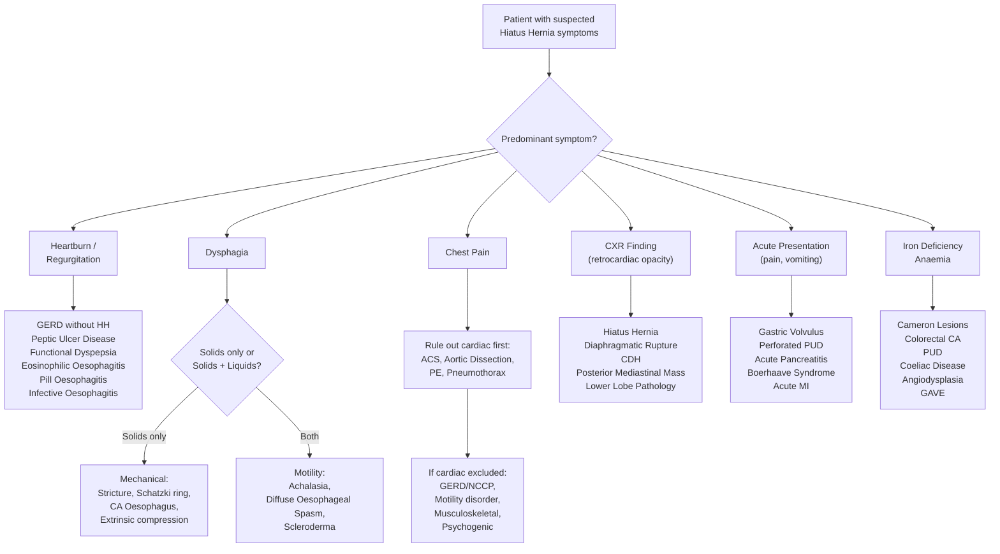

## Differential Diagnosis of Hiatus Hernia

### Why Think About Differential Diagnosis?

Before jumping into the differentials, let's be clear about what we're actually differentiating. A patient with a hiatus hernia can present in several ways:

1. **GERD symptoms** (heartburn, regurgitation) — must differentiate from other causes of heartburn/dyspepsia
2. **Dysphagia** — must differentiate from other causes of oesophageal dysphagia
3. **Chest pain** — must differentiate from cardiac and other non-cardiac causes
4. **CXR finding** (retrocardiac opacity / mediastinal mass) — must differentiate from other mediastinal/thoracic pathology
5. **Acute presentation** (volvulus/strangulation) — must differentiate from other acute abdominal/thoracic emergencies
6. **Iron deficiency anaemia** — must differentiate from other occult GI bleeding sources

The differential diagnosis therefore depends entirely on the **presenting complaint**. Let's systematically address each.

---

### A. Differential Diagnosis by Presenting Symptom

#### A1. Patient Presenting with Heartburn / Acid Regurgitation (GERD-like Symptoms)

This is the most common presentation of a sliding (Type I) hiatus hernia. The differential here is essentially the differential of **GERD and dyspepsia** [9][10]:

| Diagnosis | Key Distinguishing Features | Why It Mimics Hiatus Hernia |
|---|---|---|
| ***Gastro-oesophageal reflux disease (GERD) without hiatus hernia*** | Heartburn, regurgitation, posturally aggravated. OGD may show oesophagitis but **no hiatus hernia** | GERD and hiatus hernia are inter-related but can occur independently [11]. Not all GERD has hiatus hernia; not all hiatus hernia has GERD [4] |
| ***Peptic ulcer disease (PUD)*** | Epigastric pain, may radiate to back. Often related to meals (gastric ulcer = pain with eating; duodenal ulcer = pain relieved by eating). H. pylori / NSAID history [10] | Both can cause epigastric burning. However PUD pain is more "gnawing" and centred in epigastrium rather than retrosternal |
| ***Functional (non-ulcer) dyspepsia*** [10] | Postprandial fullness, early satiety, epigastric pain/burning. **No structural abnormality on OGD**. Diagnosis of exclusion requiring Rome IV criteria | Overlaps significantly with GERD symptoms. Key: no oesophagitis, no hernia, no ulcer on OGD |
| ***Infective oesophagitis*** [9] | Odynophagia predominates. Immunocompromised patients (HIV, post-transplant). Causes: Candida (white plaques), HSV (shallow ulcers), CMV (deep ulcers) | Can cause heartburn and dysphagia similar to reflux oesophagitis |
| ***Pill oesophagitis*** [9] | History of taking medications without adequate water, especially tetracyclines, bisphosphonates, NSAIDs, potassium chloride. Sudden onset odynophagia | Localised oesophageal inflammation mimics reflux symptoms |
| ***Eosinophilic oesophagitis*** [9] | Usually men in 20s–30s with atopic history (asthma, eczema, food allergies). ***Painful dysphagia and GERD-like symptoms*** [12]. Diagnosis requires oesophageal biopsy showing > 15 eosinophils/HPF | Causes heartburn and dysphagia. Responds poorly to PPI (unlike GERD) |
| ***Oesophageal motility disorders*** [9] | Achalasia, diffuse oesophageal spasm, jackhammer oesophagus. Dysphagia for **both solids and liquids**, chest pain, regurgitation of undigested food | Both GERD and achalasia can present with heartburn and regurgitation. ***Oesophageal manometry is diagnostic of achalasia*** [13] |
| ***Coronary artery disease*** [9] | Retrosternal chest pain/discomfort — but related to exertion, relieved by rest/GTN. Risk factors: age, smoking, HTN, DM, hyperlipidaemia. Levine's sign | Oesophageal and cardiac pain share the same visceral afferent pathways → can be indistinguishable by history alone [14] |
| **Gastric/oesophageal malignancy** [10] | Progressive dysphagia, weight loss, anorexia, GI bleeding. Alarming features present | Can initially present with "heartburn" or dyspepsia-like symptoms |

<Callout title="GERD vs Hiatus Hernia vs Oesophagitis" type="idea">
These three conditions are ***inter-related but can occur independently*** [11]. Think of them as a Venn diagram with overlapping circles:
- You can have **GERD without hiatus hernia** (LES dysfunction alone)
- You can have **hiatus hernia without GERD** (especially paraesophageal type where GOJ is competent)
- You can have **GERD without oesophagitis** (non-erosive reflux disease, NERD — the majority in Asia)
- You can have **oesophagitis without GERD** (infective, eosinophilic, pill-induced)

Oesophagitis can develop into: ulcer → stricture → ***Barrett's oesophagus (10%) → metaplasia → adenoCA (7% of Barrett's)*** [11].
</Callout>

#### A2. Patient Presenting with Dysphagia

Dysphagia is a key symptom of both sliding hiatus hernia (from strictures or Schatzki ring) and paraesophageal hernia (from mechanical compression or incarceration). The differential of **oesophageal dysphagia** is broad [15][16]:

**Step 1: Determine if mechanical or functional**

| Feature | Mechanical (Structural) | Functional (Motility) |
|---|---|---|
| Onset | Can be gradual or sudden | Usually gradual |
| Progressive? | Often | Variable |
| Solids vs liquids | ***Difficulty swallowing solid >> fluid*** | ***Difficulty swallowing solid + fluid*** |
| Response to bolus | Often regurgitation | Usually passes with repeated swallowing or liquid |
| Temperature variation | None | May vary |

**Step 2: Identify the cause**

| Category | Diagnosis | Key Distinguishing Features |
|---|---|---|
| **Intrinsic mechanical** | ***Schatzki ring*** | Concentric mucosal fold at squamocolumnar junction. ***Typically associated with hiatus hernia (97%)*** and eosinophilic oesophagitis [6][12]. **Intermittent** dysphagia for solids |
| | **Oesophageal web** | Thin eccentric membrane in cervical oesophagus. ***Associated with Plummer-Vinson syndrome*** (iron deficiency anaemia + dysphagia + web) [12] |
| | **Peptic stricture** | Progressive dysphagia for solids, long history of GERD/heartburn. From chronic oesophagitis → fibrosis |
| | **Oesophageal carcinoma** | Progressive dysphagia for solids → liquids, weight loss, anorexia, GI bleeding |
| | **Eosinophilic oesophagitis** | Young atopic male, intermittent dysphagia, food impaction |
| **Extrinsic compression** | **Mediastinal mass / lymphadenopathy** | Lung cancer, lymphoma compressing oesophagus |
| | **Aortic aneurysm** | Elderly, pulsatile mass, CT shows aneurysm |
| | **Large paraesophageal hernia** | The hernia itself compresses the oesophagus |
| **Motility** | ***Achalasia*** [13] | Dysphagia for solids AND liquids, regurgitation of undigested food (acidic smell from fermentation), chest pain. ***Failure of LES relaxation + aperistalsis on manometry*** |
| | **Diffuse oesophageal spasm** | Intermittent dysphagia + chest pain, "corkscrew oesophagus" on barium swallow |
| | **Jackhammer (nutcracker) oesophagus** | Normal peristalsis but increased intensity → chest pain and dysphagia |
| | **Systemic sclerosis (scleroderma)** | Smooth muscle fibrosis → aperistalsis in distal 2/3 of oesophagus + LES incompetence → severe GERD |

#### A3. Patient Presenting with Chest Pain

Chest pain is common in both hiatus hernia (from GERD-related oesophageal pain, or mechanical irritation in paraesophageal types) and many other conditions. The critical first step is always to **rule out life-threatening cardiac causes** [14][17]:

**Life-threatening causes to exclude first:**

| Diagnosis | Key Features | Why It Must Be Excluded |
|---|---|---|
| ***Acute coronary syndrome (ACS)*** [17] | Crushing central chest pain, radiation to jaw/arm, diaphoresis, nausea. ECG changes, troponin rise | Can be fatal. Oesophageal and cardiac pain share the same visceral afferents (vagus + thoracic sympathetic chain) → indistinguishable by history alone |
| **Aortic dissection** | Sudden onset, tearing pain radiating to back, BP differential between arms | Catastrophic if missed |
| **Pulmonary embolism** | Pleuritic chest pain, dyspnoea, tachycardia. Risk factors: immobility, surgery, DVT | Common mimic |
| **Tension pneumothorax** | Sudden onset, pleuritic, tracheal deviation, absent breath sounds | Emergency |
| **Myopericarditis** | Pleuritic, positional (relieved by leaning forward), recent viral illness, diffuse ST elevation | Can cause tamponade |

**Non-cardiac causes (once cardiac excluded):**

| Diagnosis | Key Features |
|---|---|
| ***GERD (most common cause of NCCP, ~50%)*** [4] | Retrosternal burning, posturally aggravated, meal-related. PPI test positive |
| **Oesophageal motility disorders** | Achalasia, diffuse spasm, jackhammer oesophagus |
| **Musculoskeletal** | Reproducible on palpation. Costochondritis (Tietze syndrome if swelling present) |
| **Psychogenic / Panic disorder** | Anxiety, hyperventilation, palpitations, perioral tingling |
| **Pulmonary** | Pneumonia, pleuritis — typically pleuritic and associated with respiratory symptoms |

<Callout title="Approach to NCCP" type="idea">
***The approach to non-cardiac chest pain (NCCP)*** [4]:
1. **Full cardiac workup** to rule out cardiac chest pain first
2. ***PPI test***: PPI standard dose BD for 4–8 weeks (for GERD — most common cause, 50% of NCCP)
3. ***24h oesophageal monitoring*** if PPI test negative
4. ***Manometry*** for motility disorder if 24h monitoring is negative
</Callout>

#### A4. Patient Presenting with a CXR Finding (Retrocardiac Opacity)

A hiatus hernia, especially Types II–IV, may be discovered incidentally on CXR as a ***retrocardiac gas shadow (gastric bubble)*** [1]. The differential of a retrocardiac opacity or posterior mediastinal mass includes:

| Diagnosis | Key Features |
|---|---|
| **Hiatus hernia** | Retrocardiac gas shadow with or without air-fluid level. Confirmed with CT or barium swallow |
| ***Diaphragmatic rupture*** [18] | History of trauma (may be remote — insidious presentation). Stomach/bowel herniated into thorax. ***Usually left-sided (no liver to protect)***. Risk: strangulating IO |
| ***Congenital diaphragmatic hernia (CDH)*** [19] | ***Posterolateral most common (1:4000), L > R*** [19]. Neonatal presentation with respiratory distress. Herniated abdominal contents prevent lung growth (pulmonary hypoplasia) |
| **Posterior mediastinal mass** | Neurogenic tumours (schwannoma, neurofibroma), oesophageal duplication cyst, descending aortic aneurysm, vertebral body lesion |
| **Pericardial cyst / fat pad** | Smooth, well-defined opacity, usually at right cardiophrenic angle |
| **Lower lobe pathology** | Pneumonia, lung abscess, pleural effusion — can all cause retrocardiac opacity |

#### A5. Patient Presenting with Acute Abdomen / Thoracic Emergency

When a paraesophageal hernia presents acutely (volvulus, strangulation), the differential includes other **acute abdominal and thoracic emergencies**:

| Diagnosis | Key Distinguishing Features |
|---|---|
| **Gastric volvulus from hiatus hernia** | Borchardt's triad (severe pain, unproductive retching, inability to pass NG tube). Known hiatus hernia |
| **Perforated peptic ulcer** | Sudden onset severe epigastric pain, peritonism, pneumoperitoneum on erect CXR |
| **Acute pancreatitis** | Epigastric pain radiating to back, raised amylase/lipase |
| **Acute MI / ACS** | Chest pain with ECG changes and troponin rise — must always be excluded |
| **Boerhaave syndrome (oesophageal perforation)** | History of forceful vomiting, severe chest pain, subcutaneous emphysema, Mackler triad (vomiting, chest pain, subcutaneous emphysema) |
| **Mesenteric ischaemia** | Severe abdominal pain "out of proportion to findings", AF or vascular risk factors |

#### A6. Patient Presenting with Iron Deficiency Anaemia

| Diagnosis | Key Distinguishing Features |
|---|---|
| **Cameron lesions (hiatus hernia)** | Linear erosions at level of diaphragmatic hiatus from mechanical trauma. Chronic, occult blood loss |
| **Colorectal malignancy** | Change in bowel habit, weight loss, positive faecal occult blood test |
| **Peptic ulcer disease** | Epigastric pain, H. pylori or NSAID use |
| **Coeliac disease** | Malabsorption, diarrhoea, anti-tTG antibodies |
| **Angiodysplasia** | Elderly, may have aortic stenosis (Heyde syndrome), diagnosis by endoscopy |
| **Gastric antral vascular ectasia (GAVE)** | "Watermelon stomach" — longitudinal reddish stripes on OGD |
| **Menstrual blood loss** | Premenopausal women — always ask about menstrual history |

---

### B. Differentiating Hiatus Hernia from Key Mimics — A Clinical Approach

---

### C. Differentiating Achalasia from Hiatus Hernia with GERD

This is a particularly important differential because both can present with dysphagia, heartburn and regurgitation [13]:

| Feature | GERD (with Hiatus Hernia) | Achalasia |
|---|---|---|
| **Dysphagia** | Solids > liquids (if stricture) | ***Solids AND liquids*** |
| **Heartburn** | Classic retrosternal burning, acid-tasting | Heartburn due to food fermentation (not true acid reflux) — described as "acidic smell" |
| **Regurgitation** | Acid and partially digested food | ***Undigested food*** (food has not entered stomach) |
| **Positional** | Worse lying down/bending | Less positional |
| **Weight loss** | Uncommon unless malignancy | Common (inability to eat) |
| **PPI response** | Good response | ***No response*** |
| **Manometry** | Normal or ↓LES tone | ***↑LES resting pressure, failure to relax, aperistalsis*** |
| **Barium swallow** | May show hernia, free reflux | ***Bird's beak sign*** (tapering of distal oesophagus with proximal dilatation) |

***Key point: Pseudoachalasia*** (from malignancy at the GOJ invading the oesophageal neural plexus, or as paraneoplastic syndrome) has ***the same manometric findings as achalasia*** but can be differentiated by ***OGD and endoscopic ultrasound (EUS)*** [13]. Any shouldering or "heaping" on barium swallow should raise suspicion of pseudoachalasia [20].

---

### D. Differentiating Congenital Diaphragmatic Hernia from Hiatus Hernia

In the neonatal setting, this distinction is critical [19]:

| Feature | Congenital Diaphragmatic Hernia (CDH) | Hiatus Hernia |
|---|---|---|
| **Defect location** | ***Posterolateral (Bochdalek) most common*** | Oesophageal hiatus (central) |
| **Side** | ***Left > Right*** (no liver on left to block) | Central/midline |
| **Presentation** | Neonatal respiratory distress, scaphoid abdomen, absent breath sounds on affected side | Usually asymptomatic in neonates (if congenital hiatus hernia, rare) |
| **Key pathology** | ***Herniated abdominal contents prevent lung growth*** → pulmonary hypoplasia [19] | No pulmonary hypoplasia |
| **Associated conditions** | Malrotation (~100%), congenital heart disease | GERD, Barrett's oesophagus |
| **Incidence** | ***1:4000*** [19] | Much more common in adults |

---

<Callout title="High Yield Summary — Differential Diagnosis">

**Approach the DDx of hiatus hernia by the presenting complaint:**

1. **Heartburn/regurgitation** → DDx: GERD without hernia, PUD, functional dyspepsia, eosinophilic/infective/pill oesophagitis, coronary artery disease
2. **Dysphagia** → Determine mechanical (solids > liquids) vs motility (solids + liquids). Key DDx: stricture, Schatzki ring, CA oesophagus, achalasia, diffuse spasm, scleroderma
3. **Chest pain** → ALWAYS rule out cardiac causes first (ACS, dissection, PE). Then consider GERD (50% of NCCP), motility disorders, musculoskeletal, psychogenic
4. **CXR finding** → DDx: diaphragmatic rupture, CDH, posterior mediastinal mass, lower lobe pathology
5. **Acute presentation** → DDx: gastric volvulus, perforated PUD, pancreatitis, Boerhaave, acute MI
6. **Iron deficiency anaemia** → DDx: Cameron lesions, colorectal CA, PUD, coeliac disease, angiodysplasia

**Key distinctions:**
- GERD, hiatus hernia, and oesophagitis are inter-related but can each occur independently
- Achalasia vs GERD: dysphagia for solids + liquids, undigested food regurgitation, no PPI response, bird's beak on barium, ↑LES pressure on manometry
- CDH vs hiatus hernia: posterolateral defect, neonatal, pulmonary hypoplasia, L > R

</Callout>

---

<ActiveRecallQuiz
  title="Active Recall - Hiatus Hernia Differential Diagnosis"
  items={[
    {
      question: "A patient presents with heartburn and regurgitation. List at least 5 differential diagnoses other than hiatus hernia.",
      markscheme: "GERD without hiatus hernia, peptic ulcer disease, functional dyspepsia, eosinophilic oesophagitis, infective oesophagitis (Candida, HSV, CMV), pill oesophagitis, oesophageal motility disorders (achalasia, DES), coronary artery disease, gastric/oesophageal malignancy.",
    },
    {
      question: "How do you differentiate achalasia from GERD secondary to hiatus hernia? Give at least 4 distinguishing features.",
      markscheme: "Achalasia: dysphagia for solids AND liquids (vs solids > liquids); regurgitation of undigested food (vs acid/partially digested); no response to PPI (vs good response); manometry shows increased LES resting pressure with failure of relaxation and aperistalsis (vs normal/low LES pressure); barium shows bird's beak sign (vs hernia/free reflux). Pseudoachalasia differentiated by OGD and EUS.",
    },
    {
      question: "A retrocardiac gas shadow is seen on CXR. What is your differential diagnosis?",
      markscheme: "Hiatus hernia (most common), diaphragmatic rupture (trauma history, usually left-sided), congenital diaphragmatic hernia (neonatal, posterolateral, L > R, pulmonary hypoplasia), posterior mediastinal mass (neurogenic tumour, duplication cyst, aortic aneurysm), lower lobe pathology (pneumonia, effusion, abscess).",
    },
    {
      question: "What is the recommended stepwise approach to investigating non-cardiac chest pain (NCCP)?",
      markscheme: "Step 1: Full cardiac workup to rule out cardiac cause. Step 2: PPI test (standard dose BD for 4-8 weeks) for GERD (most common cause, 50% of NCCP). Step 3: 24h oesophageal pH monitoring if PPI test negative. Step 4: Oesophageal manometry for motility disorder if pH monitoring negative.",
    },
    {
      question: "Explain the relationship between GERD, hiatus hernia, and oesophagitis. Can each occur independently?",
      markscheme: "Yes, all three are inter-related but can occur independently. GERD without hiatus hernia (LES dysfunction alone); hiatus hernia without GERD (especially paraesophageal type with competent GOJ); GERD without oesophagitis (NERD - majority in Asia); oesophagitis without GERD (infective, eosinophilic, pill-induced). Hiatus hernia is an exacerbating factor of GERD, not a direct cause. Oesophagitis can progress: ulcer, stricture, Barrett's (10%), adenocarcinoma (7% of Barrett's).",
    },
  ]}
/>

## References

[1] Senior notes: maxim.md (Hiatal hernia section)
[4] Senior notes: Ryan Ho GI.pdf (Section 2.2.1 GERD, p56–62)
[6] Senior notes: Ryan Ho Fundamentals.pdf (Schatzki ring, p242)
[9] Senior notes: felixlai.md (GERD Differential diagnosis section)
[10] Senior notes: felixlai.md (Dyspepsia section)
[11] Senior notes: maxim.md (GERD — Relationship with hiatus hernia and oesophagitis)
[12] Senior notes: Ryan Ho GI.pdf (Webs, rings and eosinophilic oesophagitis, p32)
[13] Senior notes: felixlai.md (Achalasia section)
[14] Senior notes: Ryan Ho Cardiology.pdf (Chest Pain, p54–58)
[15] Senior notes: Ryan Ho GI.pdf (Dysphagia history and approach, p34)
[16] Senior notes: Ryan Ho Fundamentals.pdf (Dysphagia approach, p244)
[17] Senior notes: Ryan Ho Cardiology.pdf (Approach to Acute Chest Pain, p58)
[18] Senior notes: Ryan Ho Radiology.pdf (Diaphragmatic rupture, p4)
[19] Lecture slides: Neonatal Surgery.pdf (p43)
[20] Senior notes: maxim.md (Achalasia section)
