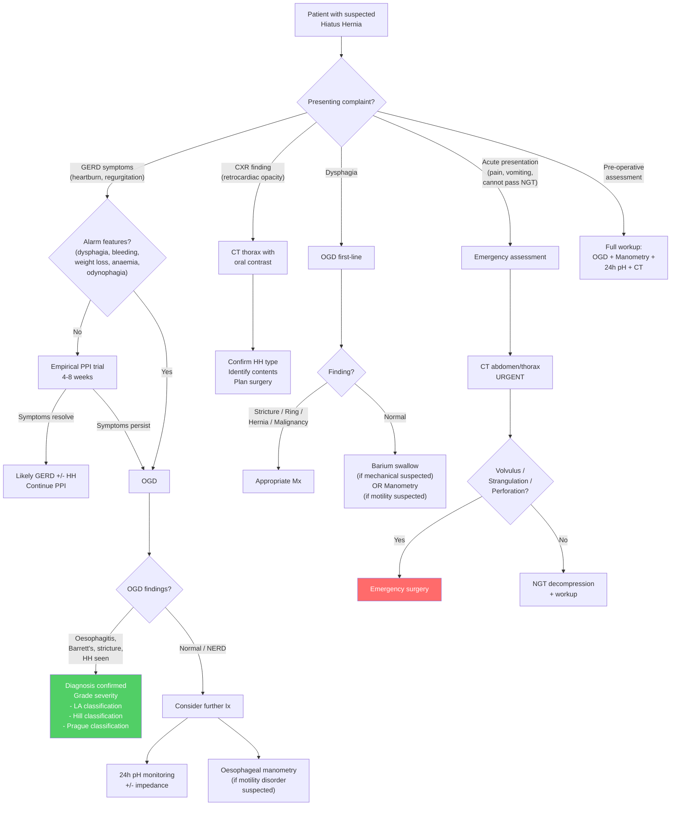

## Diagnostic Criteria

### Why There Are No Formal "Diagnostic Criteria" for Hiatus Hernia

Unlike conditions such as rheumatoid arthritis or systemic lupus erythematosus, hiatus hernia does not have published consensus diagnostic criteria from a professional body. This is because it is an **anatomical diagnosis** — you either see a herniation of gastric/abdominal contents through the oesophageal hiatus or you don't. The diagnosis is therefore made by **direct visualisation** (endoscopy or imaging) rather than by fulfilling a checklist.

That said, there are well-defined **endoscopic and radiological criteria** used in clinical practice:

### Endoscopic Criteria

On OGD, a hiatus hernia is diagnosed when:
- The **gastro-oesophageal junction (GOJ / Z-line / squamocolumnar junction)** is seen to be **displaced ≥ 2 cm above the diaphragmatic impression** (the hiatal pinch)
- In retroflexion, gastric folds are seen to extend **above the level of the diaphragmatic hiatus**

The severity of the endoscopic flap valve is graded using the ***Hill classification*** [1]:

| Hill Grade | Description | Significance |
|---|---|---|
| **Grade I** | Prominent fold of tissue along lesser curvature closely approximated to endoscope; GOJ closes tightly | Normal — intact flap valve |
| **Grade II** | Fold slightly less prominent, occasional gaping with respiration, closes promptly | Mildly impaired — may not be clinically significant |
| **Grade III** | Fold not prominent; GOJ gapes open, does not close around scope; hiatal hernia often present | Moderately impaired — associated with GERD |
| **Grade IV** | No fold; wide-open hiatus; lumen of oesophagus gapes open continuously; hernia present | Severely impaired — strongly associated with GERD and its complications |

> **Exam pearl**: The Hill classification grades the **competence of the gastro-oesophageal flap valve** on endoscopy, not the size of the hernia. Grades III–IV are strongly associated with pathological acid reflux.

### Radiological Criteria (Barium Swallow / CT)

On barium swallow or CT, a hiatus hernia is diagnosed when:
- The **GOJ** (identified as the B-ring or junction of tubular oesophagus with gastric saccular configuration) is located **> 2 cm above the diaphragmatic hiatus**
- For **paraesophageal types**: gastric fundus (or other organs) is seen **above the diaphragm** with or without GOJ displacement

### Key Principle

The diagnosis of hiatus hernia is **anatomical/imaging-based**. Clinical symptoms alone are insufficient — many patients with hiatus hernia are asymptomatic, and GERD symptoms can occur without hiatus hernia.

---

## Investigations

The investigation modalities for hiatus hernia serve two purposes:
1. **Confirm the diagnosis** and classify the type of hernia
2. **Assess the consequences** (GERD, oesophagitis, Barrett's, complications) and **plan management** (especially pre-operative assessment before fundoplication)

### Overview of Investigation Modalities

| Investigation | Primary Role | When to Use |
|---|---|---|
| ***CXR*** | Screening / Incidental finding | First-line if symptomatic; emergency presentations |
| ***CT thorax/abdomen with oral contrast*** | ***Diagnostic*** — anatomical detail | Suspected paraesophageal hernia, pre-op planning, acute complications |
| ***OGD (Oesophago-gastro-duodenoscopy)*** | Assess mucosal complications; classify flap valve | GERD symptoms, alarm features, pre-op assessment |
| **Barium swallow** | Morphological assessment; dynamic evaluation | Dysphagia workup, OGD-negative suspected hernia, pre-op |
| ***Oesophageal manometry*** | Assess LES function and oesophageal motility | ***Pre-operative*** (before fundoplication); exclude motility disorders |
| ***Ambulatory 24h oesophageal pH monitoring*** | Quantify acid reflux | ***Pre-operative***; refractory symptoms; doubtful diagnosis |
| **Blood tests** | Assess consequences (anaemia) | Iron deficiency anaemia workup |

---

### 1. Chest X-Ray (CXR)

**Rationale**: CXR is often the first investigation that raises suspicion for hiatus hernia, especially large paraesophageal types (Types II–IV). It is quick, cheap, widely available, and part of routine workup for chest pain, dyspnoea, or preoperative assessment.

**Key Findings** [1]:

| Finding | Explanation |
|---|---|
| ***Gastric bubble in the retrocardiac area*** [1] | The herniated stomach (filled with swallowed air) produces a **soft-tissue density with an air-fluid level** behind the cardiac silhouette. This is the classic finding of a large hiatus hernia |
| **Air-fluid level behind the heart** | Gas in the herniated stomach + fluid (gastric secretions) creates a characteristic air-fluid level on erect CXR |
| **Double cardiac silhouette** | The hernia sac overlapping the heart shadow creates an apparent double contour |
| **Absent gastric bubble below the diaphragm** | If the entire stomach has herniated, the normal subdiaphragmatic gastric bubble is absent |
| **Retrocardiac soft-tissue density** | May be confused with a posterior mediastinal mass, lower lobe consolidation, or pleural effusion |
| **Elevated left hemidiaphragm** | In cases where the hernia compresses lung tissue |

**Limitations**: CXR has **low sensitivity** for small sliding hernias (they may appear normal). CXR is most useful for large paraesophageal/Type III–IV hernias. A normal CXR does NOT exclude hiatus hernia.

<Callout title="CXR Interpretation Tip" type="idea">
When you see a **retrocardiac opacity** on CXR, always ask: "Is there a gas bubble or air-fluid level within it?" If yes → think hiatus hernia (or diaphragmatic rupture with bowel herniation). If no → think posterior mediastinal mass, consolidation, or effusion.
</Callout>

---

### 2. CT Thorax/Abdomen with Oral Contrast

**Rationale**: CT is the ***diagnostic*** investigation of choice [1]. It provides excellent anatomical detail of the hiatus, the position of the GOJ, the relationship of abdominal organs to the diaphragm, and any complications.

**Why oral contrast?** — Oral contrast opacifies the stomach and bowel, making it easy to identify which viscera are above and below the diaphragm. Without contrast, a herniated stomach might be difficult to distinguish from a mediastinal mass.

**Key Findings**:

| Finding | Interpretation |
|---|---|
| **Widened oesophageal hiatus** ( > 15 mm) | The diaphragmatic opening is enlarged, allowing herniation |
| **Stomach (or other organs) above the diaphragm** | Confirms herniation; identifies **type** based on what is herniated |
| **Position of GOJ relative to hiatus** | Above = Type I or III; at normal level = Type II |
| **Other organs above diaphragm** (colon, spleen, omentum) | Type IV hernia |
| **Volvulus** | Abnormal rotation of the stomach, mesenteric twisting |
| **Pneumatosis or wall thickening** | Suggests ischaemia/strangulation → emergency |
| **Pneumoperitoneum or pneumomediastinum** | Suggests perforation |

**Advantages over other modalities**:
- Non-invasive, fast, widely available
- Can identify **complications** (volvulus, strangulation, perforation)
- Excellent for **surgical planning** — determines hernia size, contents, relationship to surrounding structures
- Can assess for **incidental findings** (pulmonary, cardiac, other abdominal pathology)

**When specifically indicated**:
- Suspected **paraesophageal hernia** (Types II–IV) — these are surgical conditions and need anatomical characterisation
- **Acute presentations** (suspected volvulus, strangulation, perforation)
- **Pre-operative planning** for large or complex hernias
- When CXR shows a retrocardiac opacity of uncertain nature

---

### 3. Oesophago-Gastro-Duodenoscopy (OGD)

**Rationale**: OGD is the key investigation for assessing the **mucosal consequences** of hiatus hernia (oesophagitis, Barrett's, strictures, malignancy, Cameron lesions). It also allows direct visualisation and classification of the hernia.

**Technique relevant to hiatus hernia** [21]:
- Position: left lateral, neck flexed forward
- At the GOJ: look for ***upward displacement of the Z-line*** [1] (the squamocolumnar junction — where pale pink squamous oesophageal mucosa meets salmon-coloured columnar gastric mucosa)
- ***Retroflexion*** (J-manoeuvre) is required to visualise the gastric cardia and proximal stomach — ***hiatus hernia is better visualised in this position*** [21]
- Assess the flap valve using the ***Hill classification*** [1]

**Key Findings**:

| Finding | Significance |
|---|---|
| ***Upward displacement of Z-line*** [1] | The Z-line (squamocolumnar junction) is seen > 2 cm above the diaphragmatic impression → confirms hiatus hernia |
| ***Hill classification Grade III–IV*** [1] | Impaired flap valve → associated with pathological GERD |
| **LA classification of oesophagitis** (Grades A–D) | Assesses severity of acid-related mucosal damage. Grade A: isolated mucosal breaks ≤ 5 mm. Grade B: > 5 mm. Grade C: confluent between folds, < 75% circumference. Grade D: > 75% circumference [5] |
| **Barrett's oesophagus** | Columnar mucosa (salmon-coloured, velvet-like) replacing squamous epithelium above GOJ. Graded using **Prague classification** (C = circumferential extent, M = maximal extent in cm from GOJ) [4] |
| **Peptic stricture** | Smooth, concentric narrowing in distal oesophagus — a complication of chronic oesophagitis |
| **Schatzki ring** | Thin, concentric mucosal fold at the squamocolumnar junction — associated with hiatus hernia in ***97%*** [6] |
| **Cameron lesions** | Linear erosions/ulcers on the gastric folds at the level of the diaphragmatic hiatus — cause occult GI bleeding and iron deficiency anaemia |
| **Gastric mucosal congestion** in the hernia sac | From venous compression at the hiatus → can cause bleeding |
| **Malignancy** | Must biopsy any suspicious lesion to rule out oesophageal or gastric carcinoma |

<Callout title="Z-line vs GOJ — Getting the Anatomy Right" type="error">
The **Z-line** (squamocolumnar junction) is an **endoscopic landmark** — it is where the mucosal colour changes. The **GOJ** (gastro-oesophageal junction) is defined anatomically as the **top of the gastric folds**. In normal anatomy, these two coincide. In Barrett's oesophagus, the Z-line migrates **proximally** (upward) while the GOJ stays in place — creating a segment of columnar-lined oesophagus between the GOJ and the Z-line.

***Be careful: in patients with hiatus hernia, the gastric folds may be lost during inspiration*** [4], making it harder to identify the true GOJ. This is why Barrett's extent is measured from the **top of the gastric folds**, not from the Z-line.
</Callout>

**OGD Indications in the context of hiatus hernia**:
- ***GERD symptoms with alarm features*** (dysphagia, odynophagia, GI bleeding, anaemia, weight loss, recurrent vomiting) [4]
- Symptoms refractory to PPI therapy
- Screening for Barrett's oesophagus in high-risk patients
- Pre-operative assessment before fundoplication
- Assess Cameron lesions in patients with iron deficiency anaemia and known large hernia

**Limitations**:
- Small sliding hernias may reduce during the procedure and be missed
- ***Majority of GERD patients have non-erosive reflux disease (NERD) → OGD has low negative predictive value for GERD*** [4]
- Cannot assess motility or quantify reflux

---

### 4. Barium Swallow

**Rationale**: A barium swallow is a **dynamic fluoroscopic study** that provides real-time visualisation of swallowing, oesophageal peristalsis, GOJ position, and gastric morphology. It is particularly useful for characterising the morphology of the hernia and identifying complications.

**Technique**: Patient swallows barium sulphate suspension while standing. Fluoroscopic images are taken in real-time and spot films captured. Provocative manoeuvres (Valsalva, Trendelenburg position, water siphon test) can elicit a sliding hernia that reduces at rest.

**Key Findings**:

| Finding | Interpretation |
|---|---|
| **Gastric folds above the diaphragm** | Confirms herniation of the stomach |
| **B-ring (Schatzki ring) above the diaphragm** | The B-ring marks the squamocolumnar junction — its position above the diaphragm confirms a sliding hernia |
| **A-ring above the diaphragm** | The A-ring marks the muscular contraction ring of the distal oesophagus |
| **Widened oesophageal hiatus** | Suggests weakened crural support |
| **"Upside-down stomach"** | Large paraesophageal hernia with majority of stomach in the thorax |
| **Organoaxial or mesentericoaxial rotation** | Gastric volvulus |
| **Smooth tapering stricture** | Peptic stricture from chronic oesophagitis |
| **Mucosal irregularity or shouldering** | Suggests malignancy (right-angled shouldering = malignant; smooth tapering = benign) [22] |

**Barium vs Gastrografin (Water-Soluble Contrast)**:
- **Barium**: better mucosal coating, better image quality. But if aspirated → barium pneumonitis (rare, usually benign); if perforation → barium peritonitis/mediastinitis (severe — ***avoid barium if perforation suspected***)
- **Gastrografin**: safe if perforation suspected (absorbed). But if aspirated → ***chemical pneumonitis*** (hyperosmolar → draws fluid into alveoli). Avoid if aspiration risk
- **Rule of thumb**: Suspect perforation → use gastrografin. Suspect aspiration → use barium [20]

**When to use barium swallow**:
- Dysphagia with OGD negative but still suspect mechanical obstruction [22]
- Dynamic assessment of hernia morphology (hernia may only appear during Valsalva)
- Pre-operative assessment — defines anatomy for the surgeon
- ***Contraindicated if suspecting oesophageal diverticulum or web*** (risk of perforation with blind passage of a rigid endoscope — but barium swallow is safe here) [22]

---

### 5. Water-Soluble Contrast Swallow

**Rationale**: Used specifically when **perforation is suspected** (post-operative, Boerhaave syndrome, acute complication of hiatus hernia).

**Key Finding**:
- Contrast extravasation into the mediastinum or peritoneal cavity confirms perforation
- Can demonstrate the position of the stomach/small bowel relative to the diaphragm (useful in diaphragmatic rupture) [18]

---

### 6. Oesophageal Manometry (High-Resolution Manometry, HRM)

**Rationale**: Oesophageal manometry measures pressure within the oesophagus and across the LES. It does NOT diagnose hiatus hernia per se, but is essential for:
1. ***Pre-operative assessment before anti-reflux surgery (fundoplication)*** [9][22]
2. Excluding motility disorders (achalasia, diffuse oesophageal spasm) that might contraindicate fundoplication
3. Locating the LES for accurate placement of pH monitoring probe

**Technique** [9]:
- A pressure-sensitive catheter with **36 circumferential channels, each with 12 sensors** [22], is inserted through the nose into the oesophagus
- The patient swallows on command → pressures generated by muscle contractions are recorded
- **Reading a manometry contour plot** [22]: vertical axis = distance down oesophagus; horizontal axis = time

**Key Findings Relevant to Hiatus Hernia**:

| Finding | Interpretation |
|---|---|
| **Separation of LES and crural diaphragm pressure zones** | In a normal person, the LES and crural diaphragm create a **single** high-pressure zone. In hiatus hernia, these two components **separate** — the LES migrates above the diaphragm, creating a **"double hump"** pattern |
| ***Manometrically abnormal LES*** [9] | Resting pressure < 6 mmHg; overall length < 2 cm; abdominal length < 1 cm → all predispose to reflux |
| **Normal peristalsis** | Excludes achalasia, diffuse oesophageal spasm, absent contractility |
| **Aperistalsis** | If present → ***fundoplication is contraindicated*** (risk of severe post-operative dysphagia) [11] |

**Indications in hiatus hernia** [9]:
- ***Diagnosis of GERD is doubtful***
- ***Planning for endoscopic or surgical therapy*** (must confirm adequate peristalsis before wrapping the oesophagus)
- **NOT recommended in patients with uncomplicated GERD** [9]

<Callout title="Why Manometry Before Fundoplication?" type="error">
If a patient has **aperistalsis** (e.g., undiagnosed scleroderma oesophagus or late achalasia), performing a 360° Nissen fundoplication would create a **one-way valve** over an oesophagus that cannot generate peristalsis to push food through → severe, disabling dysphagia. Manometry is therefore **mandatory before any anti-reflux surgery** to ensure adequate oesophageal peristalsis. If motility is impaired, a **partial fundoplication** (e.g., Toupet 270°) is preferred.
</Callout>

---

### 7. Ambulatory 24-Hour Oesophageal pH Monitoring (± Impedance)

**Rationale**: This is the ***gold standard*** [9] for objectively documenting and quantifying acid reflux. It correlates symptoms with reflux episodes.

**Technique** [9]:
- A slim catheter with a **pH-sensitive probe** is positioned **5 cm above the GOJ** (located by manometry)
- The patient wears the device for 24 hours while undergoing **normal daily activities**, keeping a diary of symptoms, meals, and body position
- Alternatively, the ***BRAVO™ system*** [9] is a wireless capsule pinned to the oesophageal mucosa during endoscopy — naturally falls off after 48 hours (up to 4 days). It is more comfortable and allows a PPI trial from day 3

**Key Findings and Interpretation** [9]:

| Parameter | Interpretation |
|---|---|
| ***pH < 4 for > 6–7% of study time*** [9] | Diagnostic of pathological acid reflux |
| ***DeMeester score > 14.72*** [4] | Composite score (95th percentile) derived from frequency of reflux episodes and time to clear acid — score > 14.72 is abnormal |
| **Symptom association probability (SAP)** | Statistical correlation between symptom events and reflux episodes — SAP > 95% is positive |

**Multichannel Intraluminal Impedance (MII)** [4]:
- Newer technology, usually **combined with pH monitoring** (MII-pH)
- **Principle**: measures impedance between ring electrodes → detects bolus movement (both liquid and gas, both acid and non-acid reflux)
- **Advantage**: can detect **non-acid reflux** (important in patients on PPI who still have symptoms — their reflux may be non-acidic but still symptomatic)

**Indications** [9]:
- ***Diagnosis of GERD is doubtful***
- ***Planning for endoscopic or surgical therapy***
- ***Persistent symptoms despite PPIs*** (to determine if ongoing acid exposure is present)
- ***Persistent symptoms despite anti-reflux surgery*** (to determine surgical failure)
- **Sensitivity**: ~80–90% for GERD with oesophagitis; much lower for NERD [4]
- ***Seldom used as first-line*** due to being inconvenient, uncomfortable, and not widely available [9]

---

### 8. Blood Tests

Blood tests do not diagnose hiatus hernia but assess its **consequences**:

| Test | Rationale |
|---|---|
| **CBC (Complete Blood Count)** | Iron deficiency anaemia (microcytic, hypochromic) from Cameron lesions or chronic oesophageal bleeding |
| **Iron studies** (ferritin, serum iron, TIBC) | Confirm iron deficiency as the cause of anaemia |
| **Faecal occult blood test (FOBT)** | May be positive due to chronic occult blood loss from Cameron lesions |

---

## Diagnostic Algorithm

The approach to diagnosing hiatus hernia depends on the clinical presentation:

### Explanation of the Algorithm

**Pathway 1: GERD symptoms without alarm features**
- Most patients with heartburn/regurgitation from a sliding hiatus hernia can be managed empirically with a **PPI trial** (standard dose BD for 4–8 weeks) [4][9]. If symptoms resolve, the diagnosis is likely GERD ± hiatus hernia, and PPI is continued. If symptoms persist, OGD is indicated.
- Why not do OGD immediately? Because ***GERD is a predominantly motility disorder*** and ***the majority have NERD*** → OGD has a ***low negative predictive value*** for GERD [4]. OGD is overused in GERD.

**Pathway 2: GERD symptoms WITH alarm features**
- ***Alarm features*** (dysphagia, odynophagia, GI bleeding, anaemia, weight loss, recurrent vomiting) mandate **urgent OGD** to rule out malignancy and assess for complications [4].

**Pathway 3: Dysphagia**
- ***OGD is first-line for oesophageal dysphagia*** [22]. It allows direct visualisation, biopsy, and therapeutic intervention.
- If OGD is negative but mechanical obstruction is still suspected → **barium swallow** (more sensitive for subtle rings, webs, extrinsic compression) [22]
- If motility disorder suspected → **high-resolution manometry** (***gold standard for assessing oesophageal motility***) [22]

**Pathway 4: CXR finding**
- A retrocardiac opacity or gas bubble on CXR → ***CT thorax with oral contrast*** is diagnostic [1]. CT determines the type, contents, and size of the hernia and guides surgical planning.

**Pathway 5: Acute presentation**
- Suspected volvulus/strangulation/perforation → **urgent CT** (or immediate surgery if clinically obvious). Do NOT delay imaging for OGD in an acute emergency.

**Pathway 6: Pre-operative assessment**
- Before fundoplication, a complete workup is needed [11][9]:
  - **OGD**: to assess mucosal damage, Barrett's, and rule out malignancy
  - ***Oesophageal manometry***: to confirm adequate peristalsis (***contraindication to fundoplication = aperistalsis*** [11])
  - ***24h ambulatory pH monitoring***: to objectively confirm and quantify acid reflux
  - **CT**: for large or complex hernias requiring anatomical surgical planning

---

## Summary of Key Investigations and Findings

| Investigation | Key Finding in Hiatus Hernia | Clinical Utility |
|---|---|---|
| ***CXR*** | ***Gastric bubble in retrocardiac area*** [1], air-fluid level | Screening, incidental detection |
| ***CT with oral contrast*** | Stomach/organs above diaphragm, GOJ position, complications | ***Diagnostic*** [1], surgical planning, emergency |
| ***OGD*** | ***Upward displacement of Z-line, Hill classification*** [1], LA grading, Barrett's, Cameron lesions | Mucosal assessment, biopsy, therapeutic |
| **Barium swallow** | Gastric folds above diaphragm, hernia morphology, dynamic assessment | Morphological characterisation, pre-op |
| ***Oesophageal manometry*** | LES-crural separation, LES pressure, peristaltic function | ***Pre-operative*** [9], exclude motility disorders |
| ***24h pH monitoring*** | pH < 4 for > 6–7% of time; DeMeester > 14.72 | ***Gold standard for reflux quantification*** [9] |
| **Blood tests** | Microcytic anaemia, low ferritin, positive FOBT | Assess consequences (Cameron lesions) |

<Callout title="High Yield Summary — Diagnosis of Hiatus Hernia">

**No formal diagnostic criteria** — it is an anatomical diagnosis made by imaging or endoscopy.

**CXR**: Retrocardiac gastric bubble = first clue, especially large paraesophageal types.

**CT with oral contrast**: DIAGNOSTIC — defines type, contents, complications, surgical anatomy.

**OGD**: Assesses mucosal consequences (oesophagitis [LA classification], Barrett's [Prague classification], flap valve [Hill classification], Cameron lesions). Z-line displaced > 2 cm above hiatal pinch = hiatus hernia.

**Pre-operative workup** (before fundoplication):
1. OGD — mucosal assessment, rule out malignancy
2. Manometry — confirm adequate peristalsis (aperistalsis = contraindication to Nissen)
3. 24h pH — confirm and quantify reflux

**24h pH monitoring** = GOLD STANDARD for GERD but seldom first-line due to inconvenience.

**Barium swallow** = dynamic morphological assessment; use when OGD negative for suspected mechanical obstruction.

</Callout>

---

<ActiveRecallQuiz
  title="Active Recall - Diagnosis of Hiatus Hernia"
  items={[
    {
      question: "What are the three key investigations required in the pre-operative workup before fundoplication for hiatus hernia? Explain why each is necessary.",
      markscheme: "1. OGD: assess mucosal damage (oesophagitis, Barrett's, stricture), rule out malignancy, Cameron lesions. 2. Oesophageal manometry: confirm adequate peristalsis — aperistalsis is a contraindication to Nissen fundoplication (risk of severe dysphagia). 3. 24h pH monitoring: objectively confirm and quantify acid reflux to justify surgical intervention. All three are needed to plan the correct surgical approach.",
    },
    {
      question: "What is the Hill classification and what does it grade?",
      markscheme: "The Hill classification grades the competence of the gastro-oesophageal flap valve on endoscopic retroflexion. Grade I: prominent fold, tight closure (normal). Grade II: slightly less prominent, occasional gaping. Grade III: no prominent fold, GOJ gapes open, hernia often present. Grade IV: no fold, wide-open hiatus, continuous gaping. Grades III-IV strongly associated with pathological GERD.",
    },
    {
      question: "On 24h oesophageal pH monitoring, what threshold defines pathological acid reflux? What is the DeMeester score threshold?",
      markscheme: "pH less than 4 for more than 6-7% of total study time is diagnostic of pathological acid reflux. DeMeester score greater than 14.72 (95th percentile) is abnormal. The DeMeester score is a composite derived from frequency of reflux episodes and time required for oesophageal acid clearance.",
    },
    {
      question: "A patient with GERD symptoms has a normal OGD. What further investigations would you consider and in what order?",
      markscheme: "This patient likely has NERD (non-erosive reflux disease). Consider: 1. PPI trial (standard dose BD 4-8 weeks) if not already done. 2. 24h oesophageal pH monitoring with impedance (gold standard for confirming GERD, can detect non-acid reflux). 3. Oesophageal manometry if motility disorder suspected (dysphagia for solids and liquids). Note: OGD has low NPV for GERD because most patients have NERD.",
    },
    {
      question: "When should barium swallow be used instead of or in addition to OGD in the workup of hiatus hernia?",
      markscheme: "Barium swallow is used when: 1. OGD is negative but mechanical obstruction is still suspected (more sensitive for subtle rings, webs, extrinsic compression). 2. Dynamic assessment needed (hernia may only appear during Valsalva or Trendelenburg). 3. Pre-operative assessment for morphological anatomy. 4. If oesophageal diverticulum or web suspected (OGD contraindicated due to perforation risk). Use barium (not gastrografin) unless perforation is suspected.",
    },
    {
      question: "What CXR finding is classic for a large hiatus hernia, and what differential diagnoses should you consider for a retrocardiac opacity?",
      markscheme: "Classic finding: gastric bubble (gas shadow with air-fluid level) in the retrocardiac area. DDx of retrocardiac opacity: hiatus hernia, diaphragmatic rupture (trauma, L more than R), congenital diaphragmatic hernia (neonatal), posterior mediastinal mass (neurogenic tumour, aortic aneurysm), lower lobe consolidation/effusion. Key distinguishing feature: presence of a gas bubble or air-fluid level within the opacity suggests hollow viscus (hernia).",
    },
  ]}
/>

## References

[1] Senior notes: maxim.md (Hiatal hernia section)
[4] Senior notes: Ryan Ho GI.pdf (Section 2.2.1 GERD and Barrett's Oesophagus, p56–63)
[5] Senior notes: felixlai.md (LA classification of oesophagitis)
[6] Senior notes: Ryan Ho Fundamentals.pdf (Schatzki ring, p242)
[9] Senior notes: felixlai.md (GERD Diagnosis — PPI testing, manometry, 24h pH monitoring)
[11] Senior notes: maxim.md (GERD — Surgical treatment and pre-op workup)
[18] Senior notes: Ryan Ho Radiology.pdf (Diaphragmatic rupture, p4)
[20] Senior notes: maxim.md (Achalasia section — barium vs gastrografin)
[21] Senior notes: felixlai.md (OGD technique — retroflexion for hiatus hernia)
[22] Senior notes: Ryan Ho GI.pdf (Dysphagia investigations — OGD, barium swallow, HRM, p36)
