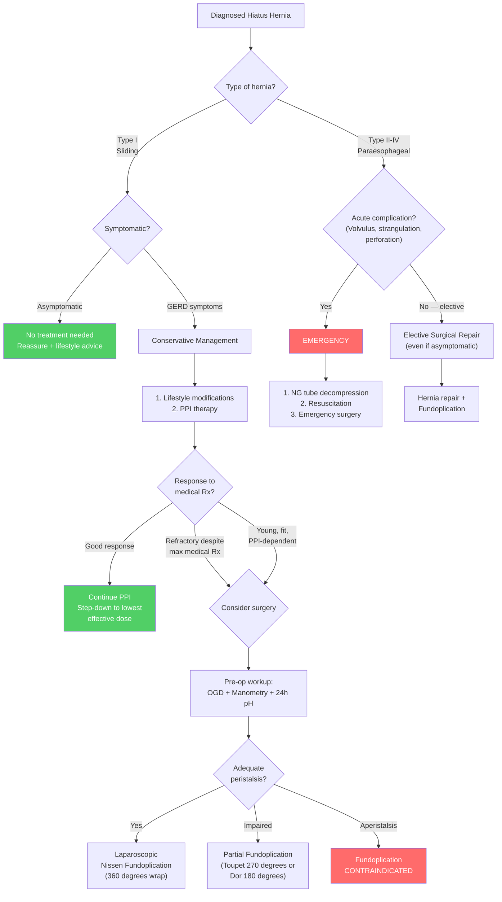

## Management of Hiatus Hernia

### Guiding Principles

The management of hiatus hernia is determined by **two key factors**:

1. **The type of hernia** — Sliding (Type I) vs Paraesophageal (Types II–IV)
2. **The severity of symptoms** and presence of **complications**

The fundamental logic:
- ***Sliding hernia (Type I) → Conservative management first*** [1] — because the main problem is GERD, and GERD responds well to medical therapy in most patients
- ***Paraesophageal / Rolling type (Types II–IV) → Surgical management indicated*** [1] — because the main risk is **mechanical complications** (volvulus, strangulation, perforation, gangrene) which cannot be prevented by acid suppression
- ***Acute complications (volvulus, strangulation) → Emergency surgery*** [1]

---

## Management Algorithm

---

## 1. Conservative Management

### 1.1 Indications

***Conservative management is indicated for sliding hernia (Type I)*** [1] — the vast majority of hiatus hernias. The rationale is that Type I hernias cause symptoms primarily through GERD, and GERD is a medical disease in the first instance.

### 1.2 Lifestyle Modifications

These are first-line for ALL patients with hiatus hernia ± GERD. Each intervention targets a specific pathophysiological mechanism:

| Modification | Mechanism / Rationale |
|---|---|
| ***Weight loss*** [1] | Reduces intra-abdominal pressure → less force pushing stomach through hiatus; reduces visceral fat around hiatus; improves LES function. Obesity is the single most important modifiable risk factor |
| ***Smoking cessation*** [1] | Smoking directly reduces LES tone (nicotine relaxes smooth muscle); causes chronic cough (↑ intra-abdominal pressure); impairs oesophageal clearance; reduces saliva production (saliva is alkaline and helps neutralise refluxed acid) |
| ***Reduce alcohol intake*** [1] | Alcohol relaxes the LES directly (smooth muscle relaxant effect); stimulates gastric acid secretion; impairs oesophageal peristalsis |
| **Dietary modifications** [9] | ***Avoidance of chocolate, spicy food, coffee*** [9] — these relax the LES. Also avoid **dietary fat** (delays gastric emptying → larger gastric volume → more reflux) |
| ***Eat small, frequent meals*** [9] | Large meals distend the stomach → ↑ intragastric pressure → ↑ transient LES relaxation episodes → more reflux |
| ***Avoid late meals*** (eating > 2–3 hours before bedtime) [9] | Lying down after eating eliminates gravity-assisted oesophageal clearance; gastric acid secretion peaks post-prandially |
| **Elevate head of bed** (15–20 cm) | Gravity helps keep gastric contents in the stomach and promotes oesophageal clearance during sleep. Use blocks under bed legs (NOT just extra pillows, which can increase abdominal pressure by flexing the body) |
| **Avoid tight clothing** | Tight belts/garments increase intra-abdominal pressure → squeeze stomach contents upward |
| **Avoid bending forward after meals** | Increases intra-abdominal pressure and removes gravity as an anti-reflux mechanism |
| **Review medications** | Stop or substitute drugs that reduce LES tone: NSAIDs, CCBs, nitrates, β-blockers, theophylline, anticholinergics [5] |

<Callout title="The PPI Paradox" type="idea">
A crucial concept to explain to patients: ***PPIs only change acidic reflux into non-acidic reflux — they change the pH but do NOT prevent reflux*** [9]. This means:
- **Heartburn** improves (because the refluxate is no longer acidic → no longer burns)
- **Regurgitation** often **persists** (because the mechanical reflux mechanism is not fixed)
- If regurgitation is the dominant symptom and persists despite PPI, ***anti-reflux surgery is needed*** [9] because it addresses the underlying mechanical defect
</Callout>

### 1.3 Pharmacological Therapy

#### A. Proton Pump Inhibitors (PPIs) — First-Line

**Mechanism**: PPIs irreversibly inhibit the H⁺/K⁺-ATPase (proton pump) on the **apical membrane of gastric parietal cells** — the final common pathway of acid secretion. By blocking this pump, they reduce gastric acid output by ~90%.

**Pharmacology**: "Proton Pump Inhibitor" → "proton" = H⁺ ion, "pump" = H⁺/K⁺-ATPase, "inhibitor" = blocks it. The name tells you exactly what it does.

| Aspect | Details |
|---|---|
| **Examples** | ***Omeprazole, Esomeprazole, Lansoprazole, Pantoprazole, Rabeprazole, Dexlansoprazole*** [9] |
| **Dosing** | ***ALL PPIs except dexlansoprazole should be administered 30 min – 1 hour before meals*** [9]. Why? PPIs bind to actively secreting proton pumps. A meal stimulates acid secretion → more pumps activated → PPI is most effective when taken before food stimulates secretion |
| **Indications** [9] | ***Mild oesophagitis (LA Grade A–B)***; ***Severe oesophagitis (LA Grade C–D)***; ***Non-erosive GERD (NERD)*** |
| **Duration** | Empirical trial: 4–8 weeks (standard dose). If responsive → step down to lowest effective dose for maintenance. Severe oesophagitis (Grade C–D) may need long-term PPI |
| **Efficacy** | Healing rate for oesophagitis: ~85–90% at 8 weeks |

**Long-term side effects of PPI** (important for surgical counselling):
- ↑ Risk of *C. difficile* infection (reduced gastric acid barrier)
- ↓ Calcium/magnesium absorption → osteoporosis risk
- ↓ Iron/B12 absorption (acid needed for absorption)
- Possible ↑ risk of chronic kidney disease, dementia (controversial, observational data)
- Drug interactions (CYP2C19 inhibition — affects clopidogrel activation)

> This is why ***young, fit, PPI-dependent patients*** are considered for surgery — to ***avoid long-term use of PPI*** [11].

#### B. H₂-Receptor Antagonists (H2RAs)

**Mechanism**: Block histamine H₂ receptors on parietal cells → reduce cAMP-mediated acid secretion. Less potent than PPIs (~60–70% acid reduction vs ~90%).

| Aspect | Details |
|---|---|
| **Examples** | ***Cimetidine, Famotidine*** [9] |
| **Indications** [9] | ***Mild oesophagitis (LA Grade A–B)***; ***NERD*** |
| **Limitation** | ***Regular use leads to tolerance and loss of therapeutic effect → should be used intermittently only*** [9]. This is called **tachyphylaxis** — downregulation of H₂ receptors with chronic stimulation |
| **Role** | Second-line to PPI; useful for nocturnal acid breakthrough (add bedtime H2RA to daytime PPI) |

#### C. Antacids

**Mechanism**: ***Neutralisation of acid*** [9] — direct chemical buffering of HCl in the gastric lumen.

| Aspect | Details |
|---|---|
| **Examples** | Aluminium hydroxide, magnesium hydroxide, calcium carbonate |
| **Role** | Symptom relief (rapid onset, short duration). Adjunctive therapy, not for maintenance. Useful as "rescue" medication between PPI doses |
| **Limitations** | Short duration (30–60 min); do not heal oesophagitis; side effects (aluminium → constipation; magnesium → diarrhoea) |

#### D. Alginates (e.g., Gaviscon)

**Mechanism**: Form a floating "raft" on top of gastric contents that mechanically prevents reflux. Also contains antacid for acid neutralisation.

**Role**: Useful adjunct, especially for postprandial reflux and in pregnancy (safe).

#### E. Prokinetics (e.g., Metoclopramide, Domperidone)

**Mechanism**: Dopamine D₂ antagonists → enhance gastric motility, accelerate gastric emptying, and increase LES tone.

**Role**: Limited in GERD management due to side effects (metoclopramide: extrapyramidal symptoms; domperidone: QT prolongation, cardiac risk). Used occasionally if delayed gastric emptying is contributing to symptoms.

---

## 2. Surgical Management

### 2.1 Indications for Surgery

***Surgical management (hernia repair + fundoplication) is indicated in*** [1][11]:

| Indication | Rationale |
|---|---|
| ***Symptomatic despite maximal medical treatment*** [1] | Failure of PPI + lifestyle to control symptoms (especially regurgitation, which PPI doesn't fix) — suggests the mechanical defect is too severe for medical therapy alone |
| ***Young and fit PPI-dependent patients*** [11] | ***To avoid long-term use of PPI*** — lifelong PPI has cumulative side effects; surgery offers a potentially curative alternative in appropriately selected patients |
| ***Rolling type (Types II–IV): Increased risk of gastric volvulus*** [1] | Paraesophageal hernias carry risk of volvulus, strangulation, perforation, gangrene — these are **mechanical** complications that **cannot be prevented by PPI**. Even **asymptomatic** paraesophageal hernias are generally recommended for elective repair |
| ***GERD complications unresponsive to medical treatment*** [11] | ***Very rare: consider alternative diagnosis*** [11] if truly refractory. But if confirmed GERD with complications (recurrent strictures, persistent Barrett's progression despite PPI), surgery is warranted |
| **Volume regurgitation as dominant symptom** | PPI only reduces acid, not volume of reflux. Surgery recreates the anti-reflux valve |
| **Extra-oesophageal GERD manifestations** (e.g., refractory asthma, chronic cough, laryngitis) | These respond less well to PPI than typical symptoms; surgery may be more effective |

### 2.2 Contraindications to Surgery

| Contraindication | Rationale |
|---|---|
| ***Aperistalsis*** [11] | ***Risk of dysphagia*** — if the oesophagus cannot generate peristalsis to push food past the newly created valve, the patient will develop severe dysphagia. Found in scleroderma oesophagus or end-stage achalasia |
| **Severe comorbidities / unfit for general anaesthesia** | Standard surgical risk consideration |
| **Unconfirmed diagnosis** | Surgery should not be performed without objective evidence of GERD (pH monitoring) and anatomical assessment (OGD, CT) |

### 2.3 Pre-Operative Workup [11][9]

Before any anti-reflux surgery, a comprehensive workup is **mandatory**:

| Investigation | Purpose |
|---|---|
| ***OGD with biopsy*** | Assess oesophagitis severity, screen for Barrett's, rule out malignancy, assess hernia anatomy |
| ***Oesophageal manometry*** [11][9] | Confirm adequate peristalsis (determines type of wrap — full vs partial). Exclude achalasia or absent contractility |
| ***24h ambulatory pH monitoring*** [11][9] | Objectively confirm and quantify acid reflux. Essential medicolegal documentation before surgery |
| **CT thorax/abdomen** | For large or complex paraesophageal hernias — defines surgical anatomy |

### 2.4 Surgical Procedures

#### A. Laparoscopic Fundoplication (Standard of Care)

This is the definitive surgical treatment. The procedure has ***three goals*** [11]:

1. ***Close the hiatal defect*** — the widened oesophageal hiatus is closed by approximating the right and left crura posteriorly with sutures (cruroplasty), ± mesh reinforcement for large defects
2. ***Restore the pressure around the LES and angle of His*** — the gastric fundus is wrapped around the distal oesophagus, creating a new high-pressure zone
3. ***Lengthen the intra-abdominal part of the oesophagus*** — mobilising the oesophagus from the mediastinum and pulling it down below the diaphragm restores the flutter-valve effect

**Types of Fundoplication**:

| Type | Degrees of Wrap | Description | Pros | Cons | Preferred When |
|---|---|---|---|---|---|
| ***Nissen*** [1][11] | **360°** (total/complete) | ***Fundus wrapped completely (360°) around the EGJ*** | ***Most commonly done*** [4]; ***most durable*** (10-year recurrence < 10%) [4]; best reflux control | ***More side effects***: dysphagia, gas bloat syndrome [11] | Good oesophageal peristalsis; standard choice |
| ***Toupet*** [11] | **270°** (partial posterior) | Fundus wrapped ***270° posteriorly*** around oesophagus | ***Less dysphagia*** [4][11]; less gas bloat | ***Higher failure rate*** (↑ recurrence) [4] | Impaired peristalsis; ***preferred in Chinese*** [11] |
| ***Dor / Watson*** [11] | **90–180°** (partial anterior) | Fundus wrapped ***anteriorly*** over the oesophagus | Least dysphagia | Higher recurrence | ***After Heller's myotomy for achalasia*** [11] (covers the myotomy site) |

<Callout title="Why Is Partial Fundoplication Preferred in Chinese Patients?" type="idea">
***Partial fundoplication (e.g., Toupet) is preferred in Chinese*** [11]. The reason likely relates to:
1. **Body habitus**: Asian patients tend to have smaller body habitus and a shorter intra-abdominal oesophageal length
2. **Less severe GERD**: Asian GERD tends to be less severe than Western GERD (less oesophagitis, less Barrett's) → a less aggressive wrap still provides adequate reflux control
3. **Tolerance**: The side effects of a tight 360° wrap (dysphagia, bloating) are less tolerated when the underlying disease is less severe

So the **risk-benefit ratio** favours a partial wrap in this population.
</Callout>

**Specific Complications of Fundoplication** [11]:

| Complication | Mechanism | Management |
|---|---|---|
| ***Gas bloat syndrome*** [11] | ***Improved anti-reflux mechanism prevents release of gastric gas by belching or vomiting → abdominal distension, flatulence*** | ***Self-limiting in ~4 weeks*** [11]. Occurs in up to ***90%*** [11] especially with Nissen. Dietary advice: eat slowly, avoid carbonated drinks, chew well |
| ***Dysphagia (wrap too tight)*** [11] | Wrap creates too much resistance for the oesophageal bolus to pass through | ***50% early post-op*** (usually resolves as oedema settles); ***10% long-term*** [11]. Ix: ***water-soluble contrast swallow*** [11]. Tx: ***endoscopic bougie/balloon dilation or revise fundoplication*** [11] |
| ***Recurrence (wrap too loose)*** [11] | Wrap does not create adequate pressure → reflux recurs | Re-do fundoplication |
| ***Slipped Nissen*** [11] | ***Wrap slides down, GOJ retracts into chest*** — the wrap migrates off the oesophagus onto the stomach | Revision surgery |
| ***Surgical emphysema*** [11] | ***Gas absorbed from pneumoperitoneum tracks into mediastinum*** | Usually self-limiting; observe |
| ***Perforation → mediastinitis*** [11] | Iatrogenic oesophageal or gastric perforation during dissection | Emergency repair, IV antibiotics, drainage |
| **Vagal nerve injury** | Damage to anterior/posterior vagal trunks during hiatal dissection → gastroparesis, diarrhoea | Prokinetics; usually partial and self-limiting |

***Efficacy***: ***PPI independence rate ~60%*** [11]. This means ~40% will still need some PPI — important for patient counselling. Long-term satisfaction is ~85–90% at 5 years.

#### B. Hernia Repair for Paraesophageal Hernias (Types II–IV)

The surgical approach for paraesophageal hernias includes:

1. **Reduction of herniated contents** back into the abdomen
2. **Excision of the hernia sac** (reduces recurrence — the sac itself can serve as a lead point for re-herniation)
3. **Cruroplasty** — closure of the hiatal defect with sutures ± mesh reinforcement
4. **Fundoplication** — usually added to prevent post-operative GERD (because the hiatal dissection may disrupt the anti-reflux mechanism)
5. **± Gastropexy** — suturing the stomach to the anterior abdominal wall to prevent recurrence

For very large defects ( > 5 cm), **mesh reinforcement** (biological or synthetic) may be used to reduce recurrence. However, mesh placement near the oesophagus carries risk of erosion and stricture → usually **biological mesh** preferred in this location.

#### C. Emergency Surgery

***For acute complications: NG tube decompression + emergency operative treatment (EOT)*** [1]:

| Complication | Surgical Approach |
|---|---|
| **Gastric volvulus** | NG tube decompression (if possible — may not pass in complete volvulus); emergency laparotomy or laparoscopy; detorsion; assess viability; hernia repair ± fundoplication ± gastropexy; resection if gangrene |
| **Strangulation** | Immediate surgery; reduce hernia; assess bowel viability; resect non-viable tissue; hernia repair |
| **Perforation** | Emergency laparotomy; repair perforation; washout; hernia repair if feasible or damage control surgery |
| **Gangrene** | Resection of gangrenous tissue (partial or total gastrectomy may be required); hernia repair; possible two-stage procedure if patient unstable |

<Callout title="NG Tube in Gastric Volvulus" type="error">
***Management of acute gastric volvulus: NG tube decompression + EOT*** [1]. The NG tube serves to:
1. **Decompress** the distended, obstructed stomach → reduce risk of perforation from overdistension
2. **Reduce aspiration risk** by emptying gastric contents

However, remember that in complete volvulus, ***the NG tube may not be passable*** (inability to pass NG tube is part of Borchardt's triad). Do NOT force the tube — proceed to surgery.
</Callout>

### 2.5 Emerging Endoscopic Treatments [11]

These are newer, less-invasive options that are still considered **emerging** (not yet standard of care):

| Technique | Mechanism | Status |
|---|---|---|
| ***Radiofrequency ablation (RFA) targeting LES*** [11] | ***Induces LES hypertrophy*** by delivering radiofrequency energy to the LES muscle → thickens the muscle → increases LES pressure | Investigational; limited long-term data |
| ***Transoral incisionless fundoplication (TIF)*** [11] | ***Targets the EGJ*** — uses an endoscopic device to create a partial fundoplication from within the stomach, without skin incisions | Growing evidence for mild-moderate GERD; less effective than laparoscopic fundoplication; shorter durability |
| **Magnetic sphincter augmentation (LINX device)** | A ring of magnetic titanium beads placed around the LES that opens with swallowing (magnetic attraction overcome by bolus pressure) but stays closed at rest (prevents reflux) | FDA-approved; growing adoption; not suitable for large hiatus hernias |

---

## 3. Management of Specific Complications of Hiatus Hernia

| Complication | Management |
|---|---|
| **Oesophagitis** | PPI therapy (LA classification guides intensity: A–B = standard dose; C–D = double dose then step down). OGD follow-up for severe grades |
| **Peptic stricture** | ***Endoscopic balloon dilation*** + ***long-term full-dose PPI*** to ↓ risk of recurrence [4] |
| **Barrett's oesophagus** | PPI for ALL patients. Surveillance OGD (Q3–5y for non-dysplastic). Endoscopic ablation (RFA) for low-grade dysplasia. Endoscopic resection (EMR/ESD) for high-grade dysplasia or intramucosal cancer [4] |
| **Cameron lesions with IDA** | PPI + oral iron supplementation. If bleeding recurs → surgical hernia repair (removes mechanical cause of erosions) |
| **Schatzki ring** | Endoscopic balloon dilation. PPI to prevent recurrence. Fundoplication if associated hiatus hernia is symptomatic |

---

## 4. Special Considerations

### 4.1 Note on ERCP and Hiatus Hernia

***Paraesophageal hiatus hernia is a contraindication to ERCP*** [21] — the altered anatomy (stomach displaced into the thorax, gastric volvulus, or gastric outlet obstruction) makes safe passage of the side-viewing duodenoscope extremely difficult and increases the risk of perforation.

Similarly, ***large hiatal hernia is a contraindication to Sengstaken-Blakemore tube placement*** [23] — the balloon may inflate in the hernia sac rather than the stomach, causing oesophageal rupture.

### 4.2 Anaesthetic Considerations

Patients with hiatus hernia are at **high risk of aspiration** during anaesthesia because the anti-reflux barrier is compromised. This is why ***rapid sequence induction (RSI)*** with ***cricoid pressure*** is used [8] — reducing the duration of unprotected airway and occluding the oesophagus to prevent passive regurgitation.

---

## Management Summary Table

| Scenario | Management |
|---|---|
| **Type I, asymptomatic** | No treatment; reassure; lifestyle advice |
| ***Type I, symptomatic (GERD)*** | ***Conservative: weight loss, smoking cessation, reduce alcohol, PPI*** [1] |
| **Type I, refractory to max medical Rx** | Surgery: laparoscopic fundoplication (after pre-op workup) |
| **Type I, young + fit + PPI-dependent** | Consider elective fundoplication to avoid lifelong PPI |
| ***Type II–IV (paraesophageal)*** | ***Surgical repair + fundoplication (even if asymptomatic)*** [1] — due to ***increased risk of gastric volvulus*** [1] |
| ***Acute complication (volvulus, strangulation)*** | ***NG tube decompression + emergency surgery*** [1] |
| **Barrett's oesophagus** | PPI + surveillance ± endoscopic treatment based on dysplasia |
| **Peptic stricture** | Endoscopic dilation + long-term PPI |

---

<Callout title="High Yield Summary — Management of Hiatus Hernia">

**Conservative (Type I Sliding)**:
- Lifestyle: weight loss, smoking cessation, reduce alcohol, avoid trigger foods, small frequent meals, no late meals, elevate head of bed
- PPI: first-line pharmacotherapy. Only reduces acid, does NOT prevent reflux. Take 30 min before meals.
- H2RA: second-line, tolerance develops with regular use

**Surgical (Indications)**:
1. Symptomatic despite max medical Rx
2. Young, fit, PPI-dependent (avoid lifelong PPI)
3. Paraesophageal type (risk of volvulus) — even if asymptomatic
4. Refractory GERD complications (very rare)

**Surgery = Laparoscopic Fundoplication**:
- Goals: close hiatal defect, restore LES pressure and angle of His, lengthen intra-abdominal oesophagus
- Nissen (360°): most durable, most side effects (dysphagia, gas bloat)
- Toupet (270° posterior): less dysphagia, preferred in Chinese and impaired motility
- Dor (anterior): after Heller's myotomy
- Contraindication: aperistalsis
- Pre-op: OGD + manometry + 24h pH
- Efficacy: PPI independence ~60%

**Emergency**:
- Gastric volvulus / strangulation / perforation → NG tube decompression + EOT

**Fundoplication complications**: gas bloat (90%, self-limiting 4 wk), dysphagia (50% early, 10% long-term), recurrence, slipped Nissen, perforation, surgical emphysema.

</Callout>

---

<ActiveRecallQuiz
  title="Active Recall - Management of Hiatus Hernia"
  items={[
    {
      question: "What are the indications for surgical management of hiatus hernia? Name at least 4.",
      markscheme: "1. Symptomatic despite maximal medical treatment. 2. Young and fit PPI-dependent patients (to avoid long-term PPI). 3. Paraesophageal/rolling type (Types II-IV) — increased risk of gastric volvulus, even if asymptomatic. 4. GERD complications unresponsive to medical treatment. 5. Volume regurgitation as dominant symptom (PPI only reduces acid, not reflux volume). 6. Refractory extra-oesophageal manifestations.",
    },
    {
      question: "Explain the three goals of laparoscopic fundoplication for hiatus hernia.",
      markscheme: "1. Close the hiatal defect (cruroplasty — approximate the crura). 2. Restore the pressure around the LES and angle of His (fundus wrap recreates high-pressure zone). 3. Lengthen the intra-abdominal part of the oesophagus (mobilise oesophagus from mediastinum, pull below diaphragm to restore flutter-valve effect).",
    },
    {
      question: "Compare Nissen vs Toupet fundoplication. Which is preferred in Chinese patients and why?",
      markscheme: "Nissen: 360 degree total wrap, most durable (10-year recurrence less than 10%), but more side effects (dysphagia, gas bloat). Toupet: 270 degree posterior partial wrap, less dysphagia, higher failure rate. Toupet preferred in Chinese because: Asian GERD tends to be less severe, smaller body habitus, partial wrap provides adequate control with fewer side effects. Also preferred when oesophageal peristalsis is impaired.",
    },
    {
      question: "Why is aperistalsis a contraindication to Nissen fundoplication?",
      markscheme: "A 360-degree wrap creates a one-way valve around the oesophagus. If the oesophagus has no peristalsis (aperistalsis, e.g. scleroderma, end-stage achalasia), it cannot generate the propulsive force needed to push a food bolus through the newly created valve. This results in severe, disabling dysphagia. Therefore manometry is mandatory before surgery to confirm adequate peristalsis.",
    },
    {
      question: "Name the specific complications of fundoplication and their management.",
      markscheme: "1. Gas bloat syndrome (90%, esp. Nissen): inability to belch/vomit, self-limiting in 4 weeks. 2. Dysphagia (wrap too tight): 50% early, 10% long-term; investigate with water-soluble contrast swallow; treat with endoscopic bougie/balloon dilation or revise fundoplication. 3. Recurrence (wrap too loose): re-do surgery. 4. Slipped Nissen: wrap slides down, GOJ retracts into chest; revision surgery. 5. Surgical emphysema: gas in mediastinum, self-limiting. 6. Perforation leading to mediastinitis: emergency repair and antibiotics.",
    },
    {
      question: "A patient with a known large paraesophageal hernia presents with severe epigastric pain, unproductive retching, and inability to pass an NG tube. What is the diagnosis and immediate management?",
      markscheme: "Diagnosis: Gastric volvulus (Borchardt's triad). Immediate management: 1. Attempt NG tube decompression (may not be possible if complete volvulus — do not force). 2. IV resuscitation (fluids, analgesia, antibiotics). 3. Emergency surgery (laparotomy or laparoscopy): detorsion, assess gastric viability, hernia repair with fundoplication and gastropexy. Resection if gangrene found.",
    },
  ]}
/>

## References

[1] Senior notes: maxim.md (Hiatal hernia — Management section)
[4] Senior notes: Ryan Ho GI.pdf (Section 2.2.1 GERD management, oesophageal strictures, Barrett's oesophagus, p56–63)
[5] Senior notes: felixlai.md (GERD Etiology — drugs reducing LES tone)
[8] Senior notes: Ryan Ho Critical Care.pdf (RSI section, p9)
[9] Senior notes: felixlai.md (GERD Management — lifestyle, PPI, H2RA, antacids, manometry, 24h pH)
[11] Senior notes: maxim.md (GERD — Surgical treatment, fundoplication types and complications)
[21] Senior notes: felixlai.md (ERCP contraindications — paraesophageal hiatus hernia)
[23] Senior notes: maxim.md (Sengstaken-Blakemore tube contraindications — large hiatal hernia)
