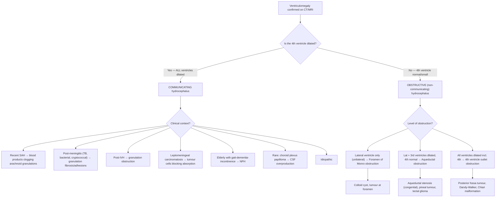
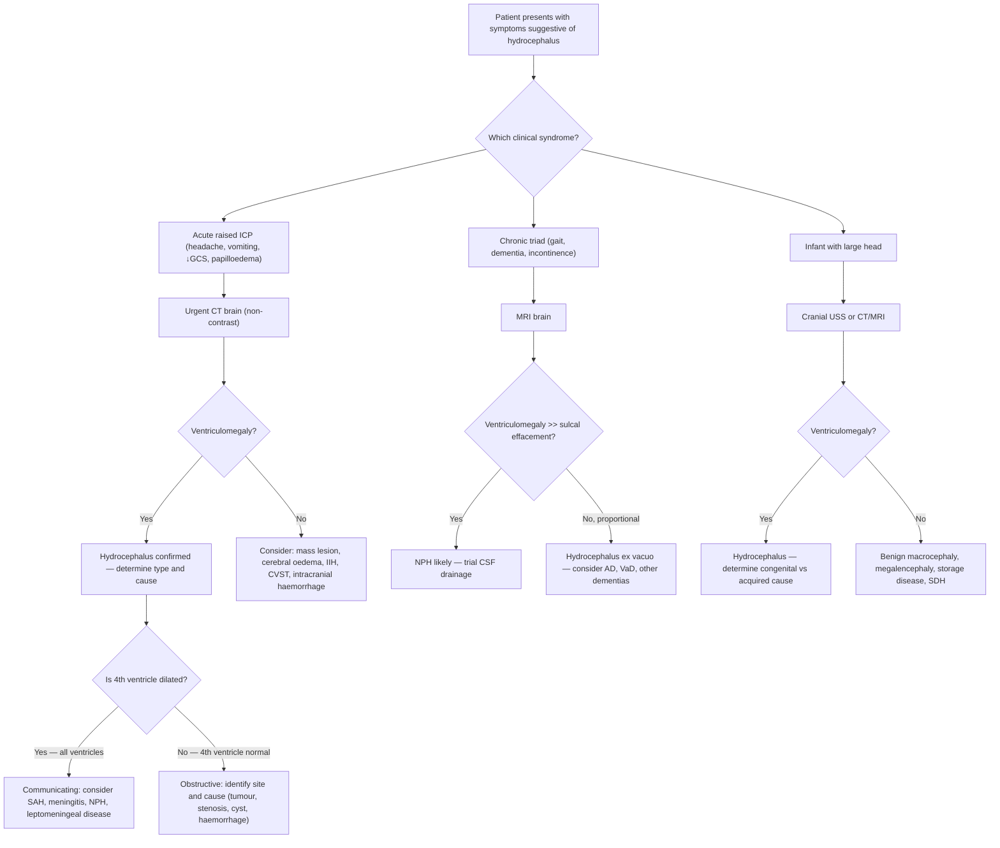

## Differential Diagnosis of Hydrocephalus

The differential diagnosis of hydrocephalus operates on two levels. First, when you encounter the **clinical syndrome** (raised ICP symptoms, or the triad of gait-dementia-incontinence, or an infant with a big head), you need to consider what else could cause those presentations *besides* hydrocephalus. Second, once hydrocephalus is confirmed on imaging, you need to determine the **underlying aetiology** — because hydrocephalus itself is a syndrome, not a final diagnosis.

Let's work through both systematically.

---

## Level 1: What Else Mimics the Clinical Presentation of Hydrocephalus?

The presentation of hydrocephalus varies dramatically by age and acuity. The differential diagnosis therefore depends on *which clinical syndrome* you are dealing with.

### A. Differential Diagnosis of Acute Hydrocephalus Presentation (Raised ICP Symptoms in Adults)

When a patient presents with ***headache (supine > erect; worse early a.m.), vomiting, blurring of vision, diplopia (CN VI), deterioration in consciousness, and papilloedema*** [1], you must consider all causes of raised ICP — not just hydrocephalus.

| Differential | Key Distinguishing Features | Why It Mimics Hydrocephalus |
|---|---|---|
| ***Space-occupying mass lesion (haematoma, tumour, abscess)*** [1] | Focal neurological deficit, seizures, constitutional symptoms (tumour), fever (abscess), trauma history (haematoma) | All raise ICP via the Monro-Kellie doctrine — increasing the volume of intracranial contents in a rigid skull. CT/MRI differentiates by showing the mass rather than ventricular dilatation |
| ***Brain swelling — focal/diffuse (cerebral oedema)*** [1] | History of ischaemic stroke (large territory infarction), trauma, hypoxic-ischaemic encephalopathy | Cytotoxic and vasogenic oedema increase brain parenchymal volume → raised ICP. Imaging shows diffuse swelling or territorial oedema rather than ventriculomegaly |
| ***Hyperaemia*** [1] | Post-traumatic, post-ischaemic reperfusion | Increased cerebral blood volume in the rigid skull raises ICP. Rare as an isolated cause |
| ***Venous congestion*** [1] | Cerebral venous sinus thrombosis (CVST): headache, seizures, focal deficits, papilloedema. Risk factors include pregnancy, OCP, prothrombotic states | Venous outflow obstruction → ↑ venous blood volume → ↑ ICP AND ↓ CSF absorption (venous pressure exceeds CSF pressure at arachnoid granulations). MR venogram shows filling defect (empty delta sign in SSS thrombosis) [8] |
| **Intracranial haemorrhage (SAH, ICH, EDH, SDH)** | SAH: thunderclap headache, meningism. ICH: acute focal deficit + headache. EDH: lucid interval post-trauma. SDH: subacute/chronic progressive | Each raises ICP through different mechanisms (mass effect, blood in subarachnoid space). Note that SAH and IVH can *cause* secondary hydrocephalus [9][10] |
| **Meningitis / Encephalitis** | Fever, meningism, altered sensorium, photophobia | Infection causes cerebral oedema (→ raised ICP) AND can cause hydrocephalus secondarily through inflammatory obstruction of CSF pathways [7] |
| ***Idiopathic intracranial hypertension (IIH / pseudotumour cerebri)*** [5] | Obese young woman, papilloedema, visual obscurations, CN VI palsy, pulsatile tinnitus. **Normal brain parenchyma on imaging with small/"slit" ventricles, empty sella sign** | Raised ICP without a mass lesion or ventriculomegaly. The key distinguishing feature: IIH has **small or normal ventricles** whereas hydrocephalus has **dilated ventricles**. LP shows ↑ opening pressure but normal constituents [5] |

> ***Key point from lecture slides***: The common causes of raised ICP listed are: ***space-occupying mass lesion (haematoma, tumour, abscess), hydrocephalus (communicating/non-communicating), brain swelling (focal/diffuse), hyperaemia, and venous congestion*** [1]

<Callout title="IIH vs Hydrocephalus — A Common Exam Pitfall" type="error">
Both IIH and hydrocephalus cause raised ICP symptoms (headache, papilloedema, CN VI palsy). The critical distinction is on imaging:
- **IIH**: small or normal ventricles, empty sella, no mass
- **Hydrocephalus**: dilated ventricles, periventricular oedema

Never diagnose hydrocephalus without confirming ventriculomegaly on imaging. Conversely, never diagnose IIH without ruling out hydrocephalus and intracranial mass first [5].
</Callout>

### B. Differential Diagnosis of Chronic Hydrocephalus / NPH Presentation (Gait-Dementia-Incontinence Triad)

This is perhaps the higher-yield differential for clinical exams. ***NPH must be distinguished from other causes of dementia because it responds well to CSF diversion*** [1][5].

| Differential | Key Distinguishing Features | Why It Mimics NPH |
|---|---|---|
| ***Alzheimer's disease (AD)*** [1][5][11] | **Cognitive decline (memory) is the FIRST and most prominent feature** — insidious anterograde amnesia with later cortical signs (aphasia, apraxia, agnosia). Gait disturbance occurs late. Imaging: generalised cerebral atrophy with **proportional** ventricular enlargement and sulcal widening (i.e. hydrocephalus ex vacuo) | Both present with dementia in the elderly. Critical distinction: in NPH, ***gait disturbance occurs early*** whereas in AD, ***cognitive features come first*** [5]. Imaging in AD shows atrophy proportional to ventricular size; in NPH, ***ventricular enlargement >> sulcal effacement*** [5][11] |
| **Vascular dementia (VaD)** [11] | Stepwise deterioration, prior cardiovascular risk factors, evidence of prior strokes on imaging, labile mood, preserved insight | Both cause gait disturbance and cognitive decline. VaD has a stepwise course and clear vascular lesions on MRI. NPH has an insidious course |
| **Parkinson's disease / Parkinsonism** [5] | Resting tremor, rigidity, bradykinesia (cardinal triad). Gait is shuffling but with festination and flexed posture rather than the wide-based "magnetic" gait of NPH | The shuffling gait can superficially resemble NPH. Key: PD has true rigidity, resting tremor, and good response to levodopa. NPH gait is **wide-based, "glue-footed"** with difficult initiation but without true parkinsonian features |
| ***Pseudoparkinsonism — cerebral arteriosclerotic disease*** [12] | Stepwise deterioration, LL > UL involvement, more symmetrical, poor response to levodopa | Subcortical vascular disease can mimic both PD and NPH. Distinguished by imaging (multiple lacunar infarcts in basal ganglia/white matter) |
| **Dementia with Lewy Bodies (DLB)** [11] | Fluctuating cognition, visual hallucinations, parkinsonism, REM sleep behaviour disorder, neuroleptic sensitivity | Both cause cognitive decline with motor features. DLB has prominent psychiatric symptoms (VH, fluctuations) which are **absent** in NPH [11] |
| **Frontotemporal dementia (FTD)** | Behavioural variant: personality changes, disinhibition, antisocial behaviour. Language variant: progressive aphasia. Onset often younger (< 65) | Both are "anterior" dementias with executive dysfunction. FTD has prominent **behavioural changes** which are disproportionate in NPH |
| **Chronic subdural haematoma (CSDH)** [8] | History of trauma (may be minor/forgotten, especially in elderly on anticoagulants). Fluctuating consciousness, focal deficits, headache. Crescentic hypodensity on CT | Both cause progressive cognitive decline and gait instability in the elderly. CT distinguishes: CSDH shows an extra-axial collection; NPH shows ventriculomegaly |
| **Depression ("pseudodementia")** [11] | More well-defined onset, patient complains actively about poor memory (vs NPH patients often lack insight), less effort in testing, no gait apraxia, classical depressive features | Apathy and psychomotor slowing in NPH can resemble depression. A therapeutic trial of antidepressants may be warranted before concluding NPH |
| **Cervical myelopathy / Spinal cord disease** | UMN signs in limbs (spasticity, hyperreflexia), bladder dysfunction, sensory level. MRI spine shows cord compression | Can cause gait difficulty and incontinence (2 of 3 NPH triad components). Distinguished by presence of a sensory level and spinal imaging |
| **B12 deficiency (subacute combined degeneration)** | Peripheral neuropathy, posterior column signs (loss of proprioception/vibration), macrocytic anaemia | Can cause gait ataxia, cognitive decline, and incontinence. Serum B12 and methylmalonic acid levels are diagnostic |

<Callout title="Hydrocephalus Ex Vacuo — Not True Hydrocephalus!" type="error">
***Hydrocephalus ex vacuo*** refers to the **physiological increase in ventricular volume** that occurs with **aging and/or cerebral atrophy** (e.g., in Alzheimer's disease) [3]. The ventricles enlarge passively to fill the space left by shrinking brain tissue. This is NOT hydrocephalus because:
- There is **no CSF flow obstruction or absorption impairment**
- Ventricular enlargement is **proportional** to sulcal widening (both expand together)
- ICP is **normal**
- There is **no transependymal oedema** (no periventricular lucencies)

In true hydrocephalus (including NPH), ventricular enlargement is **disproportionately large** compared to sulcal widening — the ventricles are big but the sulci are effaced [3][5].
</Callout>

### C. Differential Diagnosis of Infantile Hydrocephalus (Large Head / Macrocephaly)

When an infant presents with a progressively enlarging head, consider:

| Differential | Key Distinguishing Features |
|---|---|
| **Hydrocephalus** (any cause) | Tense fontanelle, split sutures, setting sun sign, dilated scalp veins, irritability. Confirmed by cranial USS or CT/MRI showing ventriculomegaly |
| **Familial/constitutional macrocephaly** (benign) | Family history of large heads, normal development, normal fontanelle tension, normal imaging. Head circumference follows a high but parallel percentile |
| **Megalencephaly** | Abnormally large brain (not enlarged ventricles). Can be benign or associated with syndromes (Sotos syndrome, Alexander disease, Canavan disease) |
| **Subdural effusion / haematoma** | Post-traumatic or post-meningitic. Imaging shows extra-axial fluid collection, not ventriculomegaly. Consider non-accidental injury |
| **Thickened skull (cranial hyperostosis)** | Rare. Conditions like osteopetrosis, rickets, thalassaemia (marrow expansion). Skull X-ray/CT shows bony thickening |
| **Storage diseases (mucopolysaccharidoses)** | Coarse facies, hepatosplenomegaly, skeletal dysplasia, developmental regression |

---

## Level 2: Determining the Underlying Aetiology Once Hydrocephalus Is Confirmed

Once imaging confirms hydrocephalus (ventriculomegaly ± periventricular oedema), the next step is to determine *why*. The pattern of ventricular dilatation and the clinical context guide you.

### Diagnostic Approach Flowchart

### Key Aetiological Categories to Consider [1][3][5]

**By temporal profile** (this helps narrow the differential rapidly):

| Acuity | Common Causes | Why This Temporal Profile? |
|---|---|---|
| **Hyperacute / Acute** (hours–days) | IVH, acute SAH, posterior fossa haemorrhage, acute bacterial meningitis, acute tumour haemorrhage, colloid cyst (intermittent) | Sudden blockage of CSF pathways or acute inflammation → rapid accumulation. The rate of CSF production (~0.3 mL/min) means significant ventriculomegaly develops within hours if outflow is completely blocked |
| **Subacute** (days–weeks) | TB meningitis (***hydrocephalus in ~80% of TBM*** [7]), brain abscess, growing tumour, cryptococcal meningitis | Slower obstruction or progressive inflammatory damage to arachnoid granulations |
| **Chronic** (weeks–months–years) | NPH, slow-growing tumours (meningioma, craniopharyngioma), aqueductal stenosis (compensated), post-SAH/meningitis (late fibrosis) | Gradual ventricular enlargement with partial compensation. In NPH, the brain "accommodates" to enlarged ventricles — ICP normalises but parenchymal damage continues through mechanical compression of corona radiata [5] |
| **Congenital** | ***Aqueductal stenosis, Arnold-Chiari malformation, Dandy-Walker syndrome, neural tube defect, congenital infection, congenital mass lesions*** [1] | Developmental abnormalities present from birth. Detected antenatally on USS or in early infancy with macrocephaly |

### Specific High-Yield Aetiologies to Differentiate

#### SAH-Related Hydrocephalus [9][10]

***SAH is a major cause of both acute and delayed hydrocephalus***. The mechanisms differ by timing:
- **Acute** (within days): Blood clot in the ventricles (IVH) or basal cisterns physically obstructs CSF flow → obstructive hydrocephalus. Blood in the subarachnoid space also acutely impairs arachnoid granulation function
- **Delayed/chronic** (weeks–months): Fibrosis and adhesion formation at arachnoid granulations from blood breakdown products → communicating hydrocephalus. May require permanent shunting

***Clinical management pathway*** [9]: SAH → secure aneurysm (clip/coil) → ICU care → ***CSF shunting for hydrocephalus*** as a known complication

#### AVM-Related Hydrocephalus [10]

***Arteriovenous malformations (AVMs) can cause hydrocephalus*** through several mechanisms [10]:
- Direct mass effect on ventricular system
- Haemorrhage (IVH/SAH) obstructing CSF pathways
- High-flow shunting raising venous sinus pressure → impaired CSF absorption
- ***Listed as a clinical feature of AVM: hydrocephalus*** [10]

#### TB Meningitis — The Hong Kong Context [7]

- TB meningitis causes ***hydrocephalus in ~80% of cases*** [7]
- Mechanism: thick basal exudates block CSF flow at the basal cisterns (obstructive component) AND cause arachnoid granulation inflammation/fibrosis (communicating component)
- Can be both acute and chronic
- Imaging: ***basal meningeal enhancement, hydrocephalus, periventricular infarcts*** [7]

---

## Distinguishing True Hydrocephalus from Mimics on Imaging

This is a critical radiological differential:

| Feature | True Hydrocephalus | Hydrocephalus Ex Vacuo (Cerebral Atrophy) |
|---|---|---|
| Ventriculomegaly | ***Disproportionately large*** compared to sulci | **Proportional** to sulcal/cisternal widening [3][6] |
| Sulci | **Effaced** (compressed against skull) | **Widened** (brain shrinkage) |
| Periventricular lucencies | **Present** (transependymal oedema) | **Absent** |
| Temporal horns | **Dilated** (first to dilate) [3] | May be mildly enlarged |
| 3rd ventricle | **Ballooned** with convex lateral walls | Normal or mildly enlarged |
| Clinical context | Signs of raised ICP or NPH triad | Progressive cognitive decline without gait/incontinence |
| Response to CSF diversion | **Yes** (in appropriate cases) | **No** |

> ***From lecture slides — diagnosis of hydrocephalus relies on:*** ***clinical suspicion, imaging studies (ventricular dilatation, change in morphology and periventricular oedema), MRI CSF studies, lumbar puncture (measures CSF pressure, trial drainage — BUT BE CAREFUL!!), EVD (rarely)*** [1]

---

## Approach to Differential Diagnosis — Putting It All Together

When you encounter a patient where hydrocephalus is in the differential, work through this logical sequence:

<Callout title="Critical Safety Distinction — Reiterated">
***A Critical Distinction*** from the lecture slides [1]:
- **Communicating hydrocephalus** (e.g., recent SAH, 4th ventricle patent): ***LP is diagnostic and therapeutic***
- **Non-communicating hydrocephalus** (e.g., cerebellar tumour + 4th ventricular obstruction, colloid cyst in 3rd ventricle): ***LP is absolutely contraindicated (and lethal)***

Always confirm the type on imaging before proceeding. If in doubt, use ***EVD*** as a temporising measure [1].
</Callout>

---

## Summary of Key Differentials by Presentation

| Presentation | Top Differentials to Consider |
|---|---|
| **Acute raised ICP** | Intracranial mass (tumour, abscess, haematoma), cerebral oedema (stroke, trauma), SAH, CVST, acute hydrocephalus, IIH |
| **Chronic gait-dementia-incontinence** | NPH, Alzheimer's disease, vascular dementia, Parkinson's disease/DLB, chronic subdural haematoma, cervical myelopathy, B12 deficiency, depression |
| **Infant macrocephaly** | Hydrocephalus (congenital causes), benign familial macrocephaly, megalencephaly, subdural effusion/haematoma, storage diseases |
| **Ventriculomegaly on imaging** | True hydrocephalus (communicating or obstructive) vs hydrocephalus ex vacuo (cerebral atrophy) |

<Callout title="High Yield Summary">

**The differential of hydrocephalus operates at two levels:**

1. **Clinical syndrome mimics** — What else causes raised ICP (acute) or gait-dementia-incontinence (chronic)?
   - Acute: mass lesion, cerebral oedema, CVST, IIH (key distinguisher: IIH has small ventricles, hydrocephalus has large ventricles)
   - Chronic (NPH): Alzheimer's disease (memory first, proportional atrophy on imaging), vascular dementia (stepwise), PD (tremor/rigidity), DLB (hallucinations), CSDH, depression

2. **Aetiological differential once confirmed** — Communicating vs obstructive, determined by whether the 4th ventricle is dilated
   - Communicating: SAH, meningitis, leptomeningeal carcinomatosis, NPH, choroid plexus papilloma
   - Obstructive: tumours, aqueductal stenosis, Dandy-Walker, Chiari, colloid cyst, IVH

**Critical distinction**: LP is safe in communicating hydrocephalus; LP is contraindicated and lethal in non-communicating hydrocephalus.

**NPH is the "must-not-miss" diagnosis** because it is a surgically treatable cause of cognitive decline that mimics irreversible dementias.

**Hydrocephalus ex vacuo** is NOT true hydrocephalus — ventricular enlargement is proportional to sulcal widening from atrophy, with no periventricular oedema.

</Callout>

---

<ActiveRecallQuiz
  title="Active Recall - Hydrocephalus Differential Diagnosis"
  items={[
    {
      question: "A 72-year-old woman presents with progressive gait difficulty, cognitive decline, and urinary incontinence. MRI shows ventriculomegaly with effaced sulci and periventricular hyperintensities on FLAIR. What is the most likely diagnosis, and name 3 key differentials you must exclude.",
      markscheme: "Most likely: Normal Pressure Hydrocephalus (NPH). Key differentials: (1) Alzheimer's disease — but AD shows proportional atrophy with sulcal widening and memory loss as first feature; (2) Vascular dementia — stepwise course, vascular risk factors, white matter ischaemic changes; (3) Chronic subdural haematoma — extra-axial collection on imaging, may have forgotten minor trauma. Also acceptable: Parkinson's disease, cervical myelopathy, B12 deficiency.",
    },
    {
      question: "How do you distinguish hydrocephalus ex vacuo from true hydrocephalus (including NPH) on imaging? Give 3 distinguishing features.",
      markscheme: "(1) In true hydrocephalus, ventriculomegaly is disproportionate to sulcal widening (ventricles large, sulci effaced); in ex vacuo, ventricular enlargement is proportional to sulcal widening. (2) Periventricular lucencies/hyperintensities (transependymal oedema) are present in true hydrocephalus but absent in ex vacuo. (3) Temporal horns are dilated early in true hydrocephalus. Also: 3rd ventricle walls are convex (ballooned) in true hydrocephalus vs normal in ex vacuo.",
    },
    {
      question: "A patient presents with headache, papilloedema, and CN VI palsy. CT brain shows small slit-like ventricles with no mass lesion. What is the most likely diagnosis, and why does this exclude hydrocephalus?",
      markscheme: "Most likely diagnosis: Idiopathic Intracranial Hypertension (IIH / pseudotumour cerebri). This excludes hydrocephalus because hydrocephalus by definition involves ventricular dilatation (ventriculomegaly), whereas IIH has small or normal ventricles. Both cause raised ICP symptoms, but the mechanism differs: IIH involves increased CSF outflow resistance without flow obstruction, whereas hydrocephalus involves obstruction or impaired absorption leading to ventricular expansion. Additional IIH features: empty sella sign, typical in obese young women.",
    },
    {
      question: "Why is lumbar puncture contraindicated in non-communicating hydrocephalus but safe in communicating hydrocephalus?",
      markscheme: "In non-communicating hydrocephalus, ventricular CSF does not freely communicate with the lumbar subarachnoid space (there is an obstruction within the ventricular system). Removing CSF from below (lumbar space) creates a pressure gradient across the tentorium/foramen magnum, which can cause downward transtentorial or tonsillar herniation, compressing the brainstem — potentially fatal. In communicating hydrocephalus, CSF flows freely from ventricles to the lumbar space (obstruction is at the level of absorption). LP therefore safely reduces pressure throughout the system without creating a dangerous gradient.",
    },
    {
      question: "Name 3 causes of hydrocephalus that are particularly relevant in the Hong Kong clinical context and explain why.",
      markscheme: "(1) TB meningitis — Hong Kong has intermediate TB burden; TBM causes hydrocephalus in approximately 80% of cases through basal exudates obstructing CSF flow and arachnoid granulation fibrosis. (2) Cryptococcal meningitis — relevant in immunocompromised patients (HIV, transplant recipients); gelatinous capsule clogs arachnoid granulations causing communicating hydrocephalus. (3) SAH from ruptured berry aneurysms — common cause of both acute (blood clot obstructing CSF) and delayed (arachnoid granulation fibrosis) hydrocephalus. Also acceptable: brain metastases from lung/NPC.",
    },
  ]}
/>

---

## References

[1] Lecture slides: GC 111. Raised intracranial pressure and hydrocephalus.pdf (p2, p14–18)
[3] Senior notes: maxim.md (Section 5.3 Hydrocephalus)
[5] Senior notes: Ryan Ho Neurology.pdf (p58–60, p153, p158–160)
[6] Senior notes: Ryan Ho Opthalmology.pdf (p90)
[7] Senior notes: Ryan Ho Respiratory.pdf (p79–80)
[8] Senior notes: Ryan Ho Radiology.pdf (p20–21)
[9] Lecture slides: GC 109. Headache and loss of consciousness Acute stroke, subarachnoid haemorrhage and vascular malformation.pdf (p21)
[10] Lecture slides: GC 109. Headache and loss of consciousness Acute stroke, subarachnoid haemorrhage and vascular malformation.pdf (p23)
[11] Senior notes: Ryan Ho Psychiatry.pdf (p81–82, p88, p95)
[12] Senior notes: Ryan Ho Neurology.pdf (p120)
