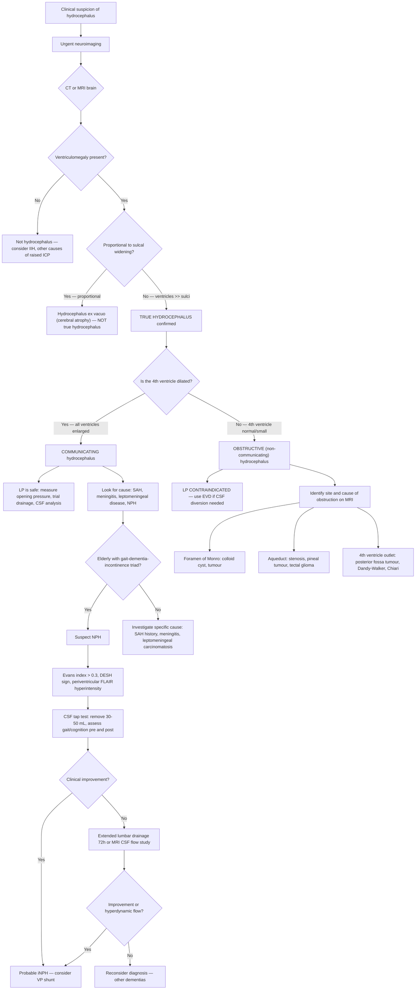

## Diagnostic Criteria for Hydrocephalus

Hydrocephalus does not have a single universally agreed-upon "diagnostic criteria" checklist like, say, the McDonald criteria for MS. Instead, diagnosis is based on the **convergence of clinical suspicion, neuroimaging findings, and — in selected cases — CSF dynamics testing**. Let's break each component down from first principles.

---

## The Diagnostic Triad: Clinical + Imaging + CSF Dynamics

The diagnosis of hydrocephalus rests on three pillars [1]:

1. ***Clinical suspicion*** — appropriate symptoms and signs
2. ***Imaging studies*** — ***ventricular dilatation, change in morphology and periventricular oedema*** [1]
3. **CSF dynamics assessment** — ***MRI CSF studies***, ***lumbar puncture (measures CSF pressure, trial drainage — BUT BE CAREFUL!!)*** [1], or EVD (rarely) [1]

The relative importance of each pillar shifts depending on whether you're dealing with acute hydrocephalus (where imaging is diagnostic and LP is often unsafe) or NPH (where imaging is suggestive but CSF dynamics testing provides the clinching evidence).

### Acute Hydrocephalus — Diagnostic Criteria

For acute hydrocephalus, the diagnosis is essentially **clinical + imaging**:

| Criterion | Details |
|---|---|
| **Clinical** | Signs and symptoms of raised ICP: ***headache (supine > erect, worse early a.m.), vomiting, blurring of vision and diplopia (CN VI), deterioration in consciousness, papilloedema (late)*** [1]. In infants: ***large head, dilated scalp veins, tense fontanelle, sunset eyes, irritability, development delay*** [1] |
| **Imaging** | CT or MRI showing ventriculomegaly with features distinguishing it from cerebral atrophy (see below) |
| **Additional** | ICP measurement (via EVD or LP in communicating cases) confirms raised pressure, but is not required for diagnosis — it is more for monitoring and treatment |

### Normal Pressure Hydrocephalus — Diagnostic Criteria (More Structured)

NPH requires more rigorous diagnostic workup because the clinical picture overlaps heavily with other dementias. The **2005 International NPH Guidelines** (Relkin, Marmarou et al.) remain the standard framework, refined by the **2020 Japanese NPH Guidelines (3rd edition)**:

#### Probable iNPH Criteria

All of the following must be met:

1. **Age > 60 years** (typically > 65)
2. **At least 2 of the classic triad**:
   - ***Gait disturbance*** (usually earliest) [1][5]
   - ***Cognitive decline*** [1][5]
   - ***Urinary incontinence*** [1][5]
3. **Imaging**: ***Ventricular enlargement disproportionate to sulcal effacement*** [5][11]
   - Evans' index > 0.3 (see below)
   - ± Periventricular lucency on CT / hyperintensity on FLAIR MRI [5][11]
4. **CSF opening pressure**: normal range (60–200 mmH₂O / 5–15 mmHg) on lumbar puncture
5. **No other identifiable cause** for the symptoms

#### Supportive Diagnostic Evidence for NPH

- ***Trial drainage: external lumbar drainage of CSF (40–100 mL) to test for clinical improvement*** [5] — this is arguably the most important diagnostic manoeuvre
- ***CSF flow study for difficult cases*** [5] — phase-contrast MRI showing hyperdynamic CSF flow through the aqueduct
- Positive response to extended lumbar drainage (72-hour continuous drainage)

<Callout title="The Tap Test — Why It Works">
The **CSF tap test** (large-volume LP removing 30–50 mL) is a diagnostic AND prognostic tool for NPH. The rationale: if removing CSF temporarily improves the patient's gait or cognition, this predicts a good response to permanent CSF diversion (shunting). Assess gait speed and cognitive testing (e.g., Mini-Mental State Examination, timed up-and-go test) **before and after** the LP.

- **Sensitivity**: only ~50–60% (i.e., a negative tap test does NOT rule out NPH — many patients still improve with shunting)
- **Specificity**: ~90% (a positive response strongly predicts shunt-responsiveness)

For equivocal cases, **extended lumbar drainage** (continuous drainage over 72 hours via a lumbar catheter) has higher sensitivity (~80–90%) [5].
</Callout>

---

## Key Imaging Indices and Measurements

### Evans' Index — The Cardinal Measurement

**Evans' index** = maximum width of the frontal horns / maximum biparietal diameter of the inner skull, measured on the same axial slice.

- **Normal**: < 0.3
- **Hydrocephalus**: ***Evans' index > 0.3*** indicates ventriculomegaly

Why it works: the frontal horns are among the first parts of the lateral ventricles to dilate in hydrocephalus. Comparing them to the biparietal diameter normalises for head size.

<Callout title="Evans' Index — Necessary but Not Sufficient" type="error">
Evans' index > 0.3 confirms **ventriculomegaly** but does NOT by itself distinguish true hydrocephalus from hydrocephalus ex vacuo (cerebral atrophy). You MUST look at additional features — particularly the relationship between ventricular size and sulcal widening, and the presence of periventricular oedema.
</Callout>

### DESH Sign (Disproportionately Enlarged Subarachnoid-space Hydrocephalus)

A highly specific finding for iNPH on imaging:
- **Ventriculomegaly** (Evans' index > 0.3) **WITH**
- **Tight high-convexity sulci** (effaced at the vertex/medial surface) **AND**
- **Widened Sylvian fissures** (laterally)

Why this pattern? In NPH, the enlarged ventricles push brain tissue upward and outward → the superior convexity sulci are compressed against the skull, while the Sylvian fissures (which are more compliant) remain dilated. This "top-tight, bottom-wide" pattern is characteristic and distinguishes NPH from atrophy (where sulci are widened everywhere).

---

## Master Diagnostic Algorithm

---

## Investigation Modalities — Detailed Breakdown

### 1. CT Brain (Non-Contrast) — First-Line Emergency Imaging

**Why CT first?** It is fast (< 5 minutes), widely available (even at 3am in any Emergency Department), and excellent at detecting acute hydrocephalus, haemorrhage, and mass lesions. In the acute setting, a non-contrast CT brain is the single most important investigation.

**Key findings in hydrocephalus on CT** [3][5][6]:

| Finding | Description | Pathophysiological Basis |
|---|---|---|
| ***Ventriculomegaly*** | Enlarged ventricles with ***rounded (ballooned) temporal and frontal horns*** [5] | CSF accumulation under pressure stretches the normally angular ventricular horns into smooth, rounded contours |
| ***First ventricle to dilate: temporal horn of lateral ventricles*** [3] | The temporal horns are normally slit-like; even mild dilatation is pathological | The temporal horn walls are thin and compliant — they offer the least resistance to expansion |
| ***Periventricular lucencies (hypodensities)*** [3][5] | Halo of low density surrounding the ventricles, especially at the frontal and occipital horns | ***Transependymal oedema*** — when ventricular pressure exceeds the absorptive capacity of the ependyma, CSF is forced through the ependymal lining into the periventricular white matter [5] |
| ***Sulci and fissure effacement*** [3] | Cortical sulci appear compressed/absent over the convexity | Expanded ventricles push the brain parenchyma outward against the inner skull table, compressing the subarachnoid space |
| ***Midline shift / herniation*** [3] | Asymmetric ventricular dilatation (e.g., unilateral foramen of Monro obstruction) or associated mass effect | Unequal pressure between hemispheres causes the brain to shift across the midline |
| **Evans' index > 0.3** | Measured on axial slice at level of frontal horns | See above — quantitative confirmation of ventriculomegaly |
| ***Obstructive hydrocephalus pattern: not all ventricles dilated, 4th ventricle normal-looking*** [5] | Proximal ventricles dilated, distal ventricles normal | Obstruction is within the ventricular system; ventricles downstream of the block are decompressed |

**Distinguishing from cerebral atrophy (hydrocephalus ex vacuo)** [3][6]:
- In atrophy: ***ventriculomegaly is proportional to sulcal/cisternal widening*** [6]
- In true hydrocephalus: ***ventriculomegaly > sulcal/cisternal widening (disproportionate)*** [6]

### 2. MRI Brain — Gold Standard for Detailed Assessment

**Why MRI?** Superior soft tissue contrast, multiplanar imaging, and specific sequences provide far more detail than CT. MRI is the imaging modality of choice for:
- Identifying the **site and cause** of obstruction (especially posterior fossa lesions, aqueductal stenosis, tumours)
- Assessing **periventricular oedema** (best on T2-weighted FLAIR)
- **CSF flow studies** (phase-contrast MRI)
- Evaluating NPH (DESH sign, aqueductal flow void)
- Ruling out differentials (e.g., CVST on MR venography)

**Key MRI sequences and findings**:

| Sequence | Findings in Hydrocephalus | Why This Sequence? |
|---|---|---|
| **T1-weighted** | Enlarged ventricles (CSF appears dark/hypointense); mass lesion identification | Basic anatomical delineation |
| **T2-weighted** | Enlarged ventricles (CSF appears bright/hyperintense); periventricular hyperintensity = transependymal oedema | Fluid-sensitive — highlights CSF and oedema |
| ***T2-FLAIR*** | ***Periventricular radiolucency (hyperintensity) especially on FLAIR sequence*** [5][11] — this is the most sensitive sequence for periventricular oedema | FLAIR "nulls" free-flowing CSF (makes it dark) while keeping oedema bright — so periventricular oedema stands out against the dark CSF in the ventricles. Brilliantly useful for distinguishing transependymal oedema from normal CSF |
| **Sagittal T2** | Visualises the aqueduct of Sylvius — "flow void" (dark signal) indicates patent aqueduct with flowing CSF; absent flow void suggests stenosis. Also shows Chiari malformation, 3rd ventricle floor anatomy for ETV planning | Best single sequence for determining the SITE of obstruction |
| ***Phase-contrast (cine) MRI*** | ***MRI CSF studies*** [1] — quantifies CSF flow velocity and direction through the aqueduct over the cardiac cycle. In NPH: **hyperdynamic aqueductal CSF flow** (aqueductal stroke volume > 42 μL is suggestive). In aqueductal stenosis: absent or markedly reduced flow | Non-invasive assessment of CSF dynamics; helpful in difficult NPH cases [5] |
| **DWI** | Can show restricted diffusion in periventricular white matter (acute hydrocephalus with ischaemia) or in associated pathology (abscess, infarct) | Helps identify complications and exclude differentials |
| **Contrast-enhanced T1** | Identifies tumours, meningeal enhancement (meningitis, leptomeningeal carcinomatosis), ring-enhancing lesions | Essential for aetiological workup — what is CAUSING the hydrocephalus? |
| **MR Venography** | Rules out cerebral venous sinus thrombosis (CVST) which can cause communicating hydrocephalus by raising venous pressure | Important differential; CVST can look very similar to IIH or communicating hydrocephalus |

<Callout title="Why FLAIR Is the Key Sequence">
On standard T2-weighted images, both CSF and periventricular oedema appear bright (hyperintense) — making it difficult to distinguish oedema from normal CSF. **FLAIR** (Fluid-Attenuated Inversion Recovery) selectively **suppresses the signal from free-flowing CSF** while keeping oedema signal bright. This means periventricular oedema "lights up" as a bright halo around the otherwise dark ventricles — a highly specific sign of active hydrocephalus (transependymal CSF migration) [5][11].
</Callout>

### 3. Lumbar Puncture (LP)

***LP measures CSF pressure and allows trial drainage — BUT BE CAREFUL!!*** [1]

This is simultaneously one of the most **useful** and most **dangerous** investigations in hydrocephalus. The safety depends entirely on whether the hydrocephalus is communicating or non-communicating:

| | Communicating Hydrocephalus | Non-communicating Hydrocephalus |
|---|---|---|
| **Safety** | ***LP is diagnostic and therapeutic*** [1] | ***LP is absolutely contraindicated (and lethal)*** [1] |
| **Why?** | CSF freely communicates between ventricles and lumbar space → removing CSF below reduces pressure evenly throughout the system | Ventricular CSF is isolated from lumbar space → removing CSF below creates a pressure gradient across the tentorium/foramen magnum → downward herniation |
| **Application** | Measure opening pressure, perform CSF tap test (remove 30–50 mL and assess clinical improvement), obtain CSF for analysis (infection, malignancy) | Do NOT perform LP; use EVD instead for CSF diversion and ICP monitoring |

> ***"No LP if raised ICP unless absolutely sure communicating hydrocephalus"*** [1]

**LP findings in hydrocephalus** (when safe to perform):

| Parameter | Finding | Interpretation |
|---|---|---|
| **Opening pressure** | Elevated ( > 20 cmH₂O) in acute communicating hydrocephalus; **normal** (6–20 cmH₂O) in NPH | In NPH, pressure is paradoxically normal — the damage comes from the enlarged ventricular surface area (Force = Pressure × Area), not from the pressure itself |
| **CSF composition** | May reveal the underlying cause: ↑ protein + ↓ glucose + lymphocytic pleocytosis in TB meningitis [7]; ↑ cryptococcal Ag in cryptococcal meningitis [13]; malignant cells in leptomeningeal carcinomatosis | Always send CSF for biochemistry, cell count, culture, and cytology when the aetiology is unclear |
| **Post-LP clinical improvement** | Improvement in gait/cognition after removing 30–50 mL → **positive tap test** predicting good shunt response | This is the therapeutic trial for NPH [5] |

### 4. ICP Monitoring

**Methods** [1][3]:
- ***External Ventricular Drain (EVD)***: gold standard for ICP monitoring. A catheter is placed directly into the lateral ventricle through a burr hole. Allows both **continuous ICP measurement** and **therapeutic CSF drainage**
- **Intraparenchymal pressure monitor**: fibreoptic catheter placed in brain parenchyma. Measures ICP but cannot drain CSF
- **LP** (in communicating cases only): intermittent measurement of opening pressure

**When to use ICP monitoring** [1]:
- ***ICP monitoring when GCS unreliable or evolving condition*** [1]
- When clinical examination cannot reliably track neurological status (e.g., intubated, sedated patients)
- ***Definitely abnormal > 20 cmH₂O*** [1] — this is the threshold to escalate treatment
- Used to guide titration of ICP-lowering therapy

### 5. Cranial Ultrasound (Infants)

**Why USS in infants?** The open anterior fontanelle provides an acoustic window that allows direct visualisation of the ventricles without radiation or sedation.

| Advantage | Limitation |
|---|---|
| Bedside, non-invasive, no radiation, no sedation | Limited to infants with open fontanelle (typically < 18 months) |
| Can be repeated serially for monitoring | Cannot visualise posterior fossa well; limited parenchymal detail |

**Key findings**: dilated lateral ventricles, dilated 3rd ventricle, periventricular echogenicity (oedema)

### 6. Shunt Series (Plain X-Rays) — For Shunt Complications

**When?** A patient with a **known VP/VA shunt** presenting with new symptoms of hydrocephalus (suggesting shunt malfunction).

**What it involves**: plain X-rays of the **entire course of the shunt** — skull XR, C-spine XR, CXR, AXR [3]

**Key findings** [3]:
- **Shunt disconnection/fracture**: visible break in the catheter line
- **Catheter migration/dislodgement**: tip not in expected position
- **Kinking**: catheter looped or angulated

This is a quick first-line investigation to identify mechanical shunt failure before proceeding to CT brain for ventricular assessment.

### 7. Fundoscopy

**Why?** To detect ***papilloedema*** — optic disc swelling caused by raised ICP transmitted along the optic nerve sheath [6].

- **Acute papilloedema**: swollen disc with blurred margins, dilated superficial capillaries, absent spontaneous venous pulsation
- **Chronic papilloedema**: optic atrophy, constricted visual fields → permanent vision loss if untreated

**Key points** [6]:
- Papilloedema is a ***late*** sign [1] — its absence does NOT exclude raised ICP
- In infants, papilloedema may not develop (expandable skull decompresses ICP)
- Always perform fundoscopy before LP to help assess for raised ICP

---

## Investigations for Identifying the Underlying Cause

Once hydrocephalus is confirmed and classified (communicating vs obstructive), targeted investigations identify the aetiology:

| Suspected Cause | Investigation | Key Findings |
|---|---|---|
| **Tumour** | Contrast MRI brain | Enhancing mass at specific location (posterior fossa, pineal, sellar, CPA); associated oedema [13a] |
| **SAH** | Non-contrast CT brain (acute); LP for xanthochromia (if CT negative); CTA/MRA/DSA for aneurysm | Hyperdensity in basal cisterns and sulcal spaces [8]; ***CSF shunting for post-SAH hydrocephalus*** [9] |
| **TB meningitis** | Contrast CT/MRI: ***basal meningeal enhancement, tuberculoma, hydrocephalus, periventricular infarcts*** [7]. CSF: ↑ protein, ↓ glucose, lymphocytic pleocytosis, AFB smear/culture, TB-PCR, ADA | ***Hydrocephalus in ~80% of TBM*** [7] |
| **Cryptococcal meningitis** | LP (safe — communicating): ↑ protein, ↓ glucose, lymphocytes. Indian ink stain, CSF/serum cryptococcal antigen | Communicating hydrocephalus from gelatinous capsule clogging arachnoid granulations [13] |
| **Bacterial meningitis** | Blood cultures, LP (after CT if indicated), CSF Gram stain/culture | Post-meningitic arachnoid granulation adhesions → communicating hydrocephalus |
| **Congenital causes** | MRI brain (sagittal views critical): aqueductal stenosis (absent aqueductal flow void on cine MRI), Chiari malformation (tonsillar descent), Dandy-Walker (cystic 4th ventricle, absent vermis) | Prenatal USS may show ventriculomegaly |
| **Leptomeningeal carcinomatosis** | Contrast MRI (leptomeningeal enhancement), CSF cytology (malignant cells), CSF flow cytometry | Communicating hydrocephalus; may need repeated LP for cytology (sensitivity improves with repeat sampling) |
| **CVST** | MR venography (filling defect, absent flow) | Empty delta sign in SSS thrombosis; may cause communicating hydrocephalus via raised venous pressure |

---

## NPH-Specific Diagnostic Workup — Step-by-Step

Because NPH is ***a surgically treatable cause of cognitive decline*** [1] that must not be missed, and because the diagnosis is challenging, here is the structured approach:

### Step 1: Clinical Assessment
- Age > 60, at least 2 of: gait disturbance, cognitive decline, urinary incontinence
- Gait assessment: timed up-and-go (TUG) test, 10-metre walk test — quantify for pre/post comparison
- Cognitive assessment: MMSE or MoCA (look for subcortical pattern: slow processing, poor attention, impaired executive function)
- Rule out other causes: check B12, TFT, RFT, Ca, glucose (reversible causes of dementia) [11]

### Step 2: Neuroimaging
- ***MRI preferred over CT*** [5]:
  - ***Ventricular enlargement >> sulcal effacement*** [5]
  - Evans' index > 0.3
  - DESH sign (tight high-convexity, wide Sylvian fissure)
  - ***Periventricular radiolucency especially on T2 FLAIR sequence*** [5]
  - Aqueductal flow void present (excludes aqueductal stenosis)
  - Phase-contrast cine MRI: hyperdynamic aqueductal CSF flow (aqueductal stroke volume > 42 μL)

### Step 3: CSF Tap Test
- ***Trial drainage: external lumbar drainage of CSF (40–100 mL) to test for clinical improvement*** [5]
- Practical protocol: LP, remove 30–50 mL CSF, measure opening pressure
- Assess gait (TUG, 10-metre walk) and cognition at **baseline**, then at **1 hour**, **24 hours**, and **72 hours** post-LP
- **Positive test**: ≥ 20% improvement in gait speed or ≥ 3-point improvement in MMSE

### Step 4: Extended Lumbar Drainage (If Tap Test Equivocal)
- Continuous lumbar CSF drainage via an indwelling lumbar catheter over 72 hours, draining ~150–200 mL total
- Higher sensitivity (~80–90%) than single tap test
- Requires inpatient monitoring (risk of overdrainage, infection, nerve root irritation)

### Step 5: ***CSF Flow Study for Difficult Cases*** [5]
- Phase-contrast cine MRI quantifying aqueductal stroke volume
- Resistance to CSF outflow (Rout) measured via infusion test (research-level; infrequently used in HK clinical practice)

---

## Summary Table: Investigations at a Glance

| Investigation | When to Use | Key Finding | Safety Considerations |
|---|---|---|---|
| **NCCT brain** | First-line, acute | Ventriculomegaly, periventricular lucency, mass, haemorrhage | Safe, rapid |
| **MRI brain** | Gold standard, detailed assessment | All CT findings + aqueductal assessment, DESH, FLAIR oedema, cause identification | Requires time and cooperation; check programmable shunt settings before and after [1] |
| ***MRI CSF studies (cine MRI)*** [1] | NPH workup, difficult cases | Hyperdynamic aqueductal flow, aqueductal stroke volume | Non-invasive |
| ***LP*** [1] | **Communicating hydrocephalus ONLY** | Opening pressure, CSF analysis, tap test for NPH | ***Absolutely contraindicated in non-communicating hydrocephalus*** [1] |
| ***EVD*** [1] | Acute, non-communicating, or unstable/evolving | Continuous ICP monitoring + therapeutic CSF drainage | Invasive; infection risk ~5–10% |
| **Cranial USS** | Infants with open fontanelle | Ventricular dilatation | Non-invasive, no radiation |
| **Shunt series XR** | Shunted patients with new symptoms | Disconnection, fracture, migration of catheter | Non-invasive |
| **Fundoscopy** | All suspected raised ICP | Papilloedema (late sign) | Non-invasive |
| **Contrast MRI/CT** | Aetiological workup | Tumour, meningeal enhancement, abscess | Contrast allergy risk; gadolinium for MRI |

<Callout title="High Yield Summary">

**Diagnosis of hydrocephalus rests on:**
1. ***Clinical suspicion*** — raised ICP symptoms OR NPH triad
2. ***Imaging*** — ventriculomegaly (Evans' index > 0.3) with disproportionate sulcal effacement and periventricular oedema (best seen on T2-FLAIR)
3. ***CSF dynamics*** — LP (communicating only), MRI CSF flow studies, EVD

**Critical safety rule**: ***No LP if raised ICP unless absolutely sure communicating hydrocephalus*** [1]

**Distinguishing true hydrocephalus from ex vacuo**: ventriculomegaly >> sulcal widening in true hydrocephalus; proportional enlargement in atrophy

**NPH diagnosis**: Evans' index > 0.3 + DESH sign + periventricular FLAIR signal + positive CSF tap test (clinical improvement after removing 30-50 mL CSF)

**First ventricle to dilate**: temporal horn of lateral ventricles [3]

**Pattern helps localise obstruction**: all ventricles dilated = communicating; 4th ventricle normal = obstruction at or above the aqueduct

**ICP monitoring**: EVD is gold standard; threshold to intervene > 20 cmH₂O [1]

**For shunted patients with new symptoms**: urgent CT brain + shunt series XR to assess for blockage, disconnection, or overdrainage [3]

</Callout>

---

<ActiveRecallQuiz
  title="Active Recall - Hydrocephalus Diagnosis and Investigations"
  items={[
    {
      question: "List the 4 diagnostic modalities mentioned in the lecture slides for diagnosing hydrocephalus, and state which one requires the most caution.",
      markscheme: "(1) Clinical suspicion, (2) Imaging studies (ventricular dilatation, change in morphology, periventricular oedema), (3) MRI CSF studies, (4) Lumbar puncture (measures CSF pressure, trial drainage). LP requires the most caution — it is absolutely contraindicated in non-communicating hydrocephalus as it can cause fatal downward herniation. EVD is also mentioned as rarely used for diagnosis.",
    },
    {
      question: "What is Evans' index, how is it calculated, and what is the threshold value for ventriculomegaly? What is its main limitation?",
      markscheme: "Evans' index = maximum width of frontal horns divided by maximum biparietal diameter of inner skull on the same axial CT/MRI slice. Threshold: > 0.3 indicates ventriculomegaly. Main limitation: it confirms ventriculomegaly but cannot distinguish true hydrocephalus from hydrocephalus ex vacuo (cerebral atrophy). Must assess sulcal widening and periventricular oedema to differentiate.",
    },
    {
      question: "Explain why T2-FLAIR MRI is the best sequence for detecting periventricular oedema in hydrocephalus. What is the pathophysiological basis of this finding?",
      markscheme: "FLAIR nulls/suppresses signal from free-flowing CSF (making ventricles appear dark) while keeping oedema signal bright (hyperintense). This allows periventricular oedema to stand out as a bright halo against dark ventricles, unlike standard T2 where both CSF and oedema are bright and hard to distinguish. Pathophysiology: transependymal oedema occurs when raised ventricular pressure forces CSF through the ependymal lining into periventricular white matter (interstitial oedema).",
    },
    {
      question: "Describe the CSF tap test for NPH. How much CSF is removed, what do you assess, and what are the sensitivity and specificity?",
      markscheme: "Remove 30-50 mL (up to 40-100 mL per senior notes) CSF via LP. Assess gait (timed up-and-go, 10m walk) and cognition (MMSE/MoCA) before and after LP (at 1h, 24h, 72h). Positive test: improvement in gait speed by 20% or more, or improvement in MMSE by 3 or more points. Sensitivity is only approximately 50-60% (negative test does not rule out NPH). Specificity is approximately 90% (positive test strongly predicts shunt response). For equivocal cases, extended lumbar drainage over 72 hours has higher sensitivity of 80-90%.",
    },
    {
      question: "A patient with a VP shunt presents with recurrent headache and drowsiness. What investigations would you order and what findings would you look for?",
      markscheme: "Order: (1) Urgent CT brain — look for ventriculomegaly suggesting shunt blockage, or subdural haematoma/hygroma suggesting over-shunting. (2) Shunt series (plain XR of skull, C-spine, CXR, AXR) — look for catheter disconnection, fracture, kinking, or migration. Additional: inspect the shunt tract for cutaneous erythema (infection). If infection suspected: blood cultures, consider shunt tap by neurosurgery. Common scenarios from slides: blocked shunt causing hydrocephalus recurrence, CSDH from over-shunting, intracranial hypotension from over-shunting, or shunt infection with peritonitis.",
    },
  ]}
/>

---

## References

[1] Lecture slides: GC 111. Raised intracranial pressure and hydrocephalus.pdf (p1–2, p9, p14–18)
[3] Senior notes: maxim.md (Section 5.3 Hydrocephalus)
[5] Senior notes: Ryan Ho Neurology.pdf (p153, p159–160)
[6] Senior notes: Ryan Ho Opthalmology.pdf (p90)
[7] Senior notes: Ryan Ho Respiratory.pdf (p79)
[8] Senior notes: Ryan Ho Radiology.pdf (p20–21)
[9] Lecture slides: GC 109. Headache and loss of consciousness Acute stroke, subarachnoid haemorrhage and vascular malformation.pdf (p20–21)
[11] Senior notes: Ryan Ho Psychiatry.pdf (p82)
[13] Senior notes: Ryan Ho Neurology.pdf (p145)
[13a] Senior notes: maxim.md (Section on intracranial tumours)
