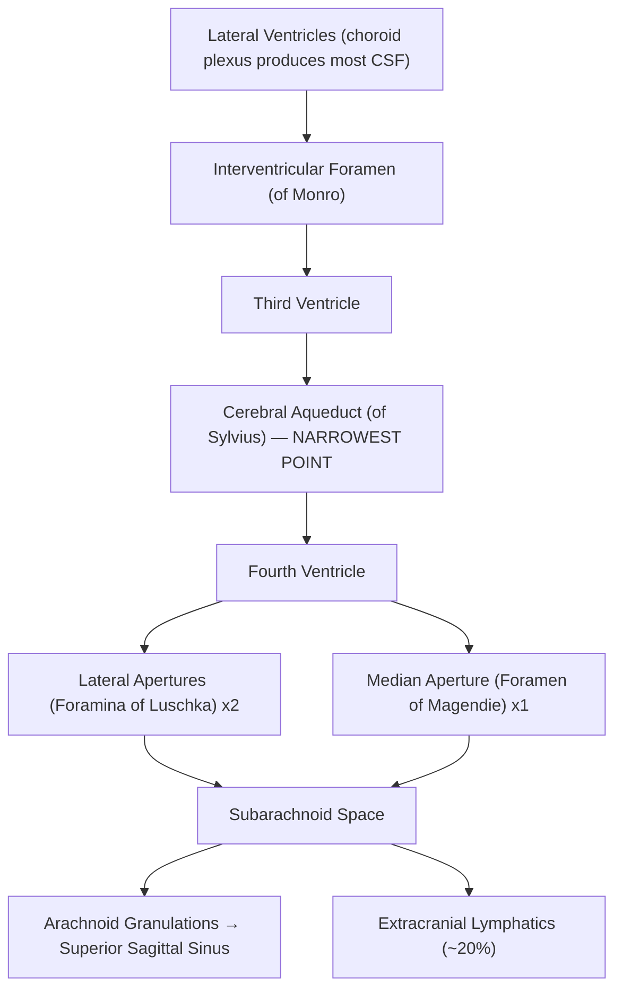

## Definition

Hydrocephalus — from Greek *"hydro"* = water + *"cephalus"* = head — literally "water on the brain." It is a condition characterised by the **accumulation of excess cerebrospinal fluid (CSF) within the cranium**, leading to **dilatation of the cerebral ventricles** (ventriculomegaly) and/or subarachnoid spaces [1][2][3].

The key concept here is a **mismatch between CSF production, circulation, and absorption**. When any part of this delicate balance is disrupted, CSF accumulates, pressure rises (or in chronic cases, the ventricles expand even without markedly raised pressure), and the brain parenchyma is compressed.

<Callout title="Core Concept">
Hydrocephalus is NOT a single disease — it is a syndrome caused by multiple possible aetiologies. Think of it as the final common pathway of any process that disrupts CSF dynamics.
</Callout>

---

## Epidemiology

- **Congenital hydrocephalus**: incidence ~0.5–1 per 1,000 live births globally [4]
  - In Hong Kong, the incidence has decreased due to **improved antenatal screening** (ultrasound detection of ventriculomegaly) and **periconceptional folate supplementation** (reducing neural tube defects which are associated with hydrocephalus) [5]
- **Acquired hydrocephalus**: can occur at any age
  - Common causes in adults in Hong Kong: post-subarachnoid haemorrhage (SAH), post-meningitis (especially TB meningitis — still relevant in Hong Kong), brain tumours, intracerebral haemorrhage (ICH)
- **Normal Pressure Hydrocephalus (NPH)**: typically affects adults > 65 years old; prevalence ~1–3% of those with dementia [1][3]
  - ***A surgically treatable cause of cognitive decline*** — this is why it matters so much [1]

### Risk Factors
- **Congenital**: prematurity (intraventricular haemorrhage/IVH), neural tube defects, congenital infections (TORCH), genetic syndromes
- **Acquired**: prior SAH, meningitis (bacterial, TB, cryptococcal — all relevant in HK), intracranial tumours, head trauma, intracranial haemorrhage
- **NPH**: prior SAH, prior meningitis, idiopathic (majority)

---

## Anatomy and CSF Physiology

Understanding hydrocephalus from first principles requires a solid grasp of CSF dynamics. Let's build this up step by step.

### CSF Volume and Turnover
- ***Average total CSF volume: ~150 mL*** [3]
  - **20% within the ventricular system**
  - **80% in the subarachnoid and cisternal spaces**
- ***Production rate: ~450–500 mL/day*** (i.e. the entire CSF volume is renewed approximately **3 times per day**) [1][3]
- This means CSF is not a stagnant pool — it is in constant flow. Any obstruction, even partial, can cause rapid accumulation.

### CSF Production
- **Active secretion** primarily by the **choroid plexus** (~75%) located within the lateral ventricles (most), 3rd ventricle, and 4th ventricle [2][3]
- Remaining ~25% from other sources: ependymal wall, brain parenchyma interstitial fluid [3]
- Mechanism: choroid plexus epithelial cells actively transport Na⁺ and HCO₃⁻ into the ventricles, with water following osmotically. Carbonic anhydrase is critical in this process — this is why **acetazolamide** (a carbonic anhydrase inhibitor) can reduce CSF production.

### CSF Circulation Pathway

The pathway follows a predictable anatomical route — and each bottleneck is a potential site of obstruction:

<Callout title="Why the Aqueduct of Sylvius Matters">
The cerebral aqueduct (aqueduct of Sylvius) is the **narrowest point** in the entire CSF pathway (~1–2 mm diameter). This makes it the most vulnerable to obstruction — whether by congenital stenosis, tumour compression, or post-inflammatory gliosis. Aqueductal stenosis is one of the most common causes of obstructive hydrocephalus.
</Callout>

### CSF Absorption
- **Primary route (~80%)**: ***Arachnoid granulations*** (also called arachnoid villi) — these are finger-like projections of arachnoid membrane that protrude into the dural venous sinuses, predominantly the **superior sagittal sinus** [2][3]
  - Absorption is **passive** and **pressure-dependent**: CSF flows into the venous sinus when CSF pressure exceeds venous sinus pressure (i.e. down a pressure gradient)
  - This is why venous sinus thrombosis can cause communicating hydrocephalus — the pressure gradient is reversed
- **Secondary route (~20%)**: ***Extracranial lymphatics*** — via the subarachnoid space around exiting cranial nerves (especially the olfactory nerve/cribriform plate) and perivascular (Virchow-Robin) spaces [3]

### The Monro-Kellie Doctrine — Context for Understanding Raised ICP

***The skull is a rigid structure with constant volume*** (after fontanelle and suture closure) [5]:
- **Brain parenchyma: ~80%**
- **Blood (arterial + venous): ~10%**
- **CSF: ~10%**

***An increase in any one compartment must be compensated by a decrease in others***, primarily through [5]:
1. **CSF outflow** from cranium to spinal subarachnoid space (slow compensatory mechanism)
2. **Venous blood outflow** from cranial sinuses (rapid compensatory mechanism)

When these compensatory mechanisms are **overwhelmed**, intracranial pressure (ICP) rises steeply — this is the exponential portion of the pressure-volume (elastance) curve.

**Exception**: ***In infants, the sutures and fontanelles are not yet fused*** → the cranial cavity is **expansile** → ICP may not rise significantly, but the head progressively enlarges [1][2][5]. This is why infants present with macrocephaly rather than the classic raised ICP signs seen in adults.

---

## Aetiology and Pathophysiology

### Pathogenetic Mechanisms

There are three fundamental mechanisms by which hydrocephalus develops [1][2]:

| Mechanism | Pathophysiology | Examples |
|---|---|---|
| ***↑ CSF production*** | Overproduction exceeds absorption capacity (rare) | **Choroid plexus papilloma** [1][2] |
| ***Flow obstruction*** | Physical blockage within ventricular system or at outlet foramina | **Tumour, haematoma, aqueductal stenosis** [1][2] |
| ***↓ CSF absorption*** | Impaired absorption at arachnoid granulations | **Post-meningitis (arachnoid granulation adhesions), post-SAH** [1][2] |

An additional mechanism sometimes listed:
- ***Obstruction of venous outflow***: e.g. venous sinus thrombosis, jugular vein compression — this raises venous sinus pressure, reducing the CSF-to-venous pressure gradient, thereby impairing absorption [5]

---

## Classification

This is the most clinically important distinction, because it determines management — ***especially whether lumbar puncture is safe*** [1].

### 1. Obstructive (Non-communicating) Hydrocephalus

**Definition**: Obstruction of CSF flow **within the ventricular system** (i.e. before CSF exits into the subarachnoid space).

**Key imaging feature**: ***Ventricles dilated PROXIMAL to the obstruction, with normal-sized 4th ventricle*** (if obstruction is at or proximal to the aqueduct) [3]. If the 4th ventricle is the site of obstruction, it may be dilated too.

**Why is LP dangerous?** Because ventricular CSF **does NOT freely communicate** with the lumbar subarachnoid space. Removing CSF below the obstruction creates a **transtentorial pressure gradient** → risk of **downward (uncal/tonsillar) herniation** → brainstem compression → death [1].

> ***"LP is absolutely contraindicated (& lethal)"*** in non-communicating hydrocephalus [1]

#### Causes of Obstructive Hydrocephalus

**Congenital** [1][2][3]:
- ***Aqueductal stenosis*** — the most common cause of congenital hydrocephalus
  - Can be primary (developmental) or secondary (post-infectious gliosis, e.g. after congenital CMV/toxoplasmosis)
  - Some forms are X-linked (L1CAM mutation)
- ***Arnold-Chiari malformation*** (Type II) — downward herniation of the cerebellar vermis and brainstem through the foramen magnum, obstructing CSF flow at the posterior fossa outlet
  - Strongly associated with **myelomeningocele** [5]
- ***Dandy-Walker syndrome*** — cystic dilatation of the 4th ventricle with agenesis/hypoplasia of the cerebellar vermis → obstruction of 4th ventricle outflow
- ***Neural tube defect*** [1]
- ***Congenital infection*** [1]
- ***Congenital mass lesions*** [1]

**Acquired** [1][2][3]:
- **Tumours** — the most common acquired cause in adults:
  - **Posterior fossa tumours** (especially in children): medulloblastoma, ependymoma, pilocytic astrocytoma — compress the 4th ventricle or aqueduct
  - **CPA tumours**: vestibular schwannoma, meningioma
  - ***Brain metastasis***, gliomas [3]
  - **Craniopharyngioma / pituitary macroadenoma** — can compress 3rd ventricle
  - **Colloid cyst of the 3rd ventricle** — classically causes intermittent obstruction at the foramen of Monro, leading to episodic severe headaches and even sudden death
  - **Pineal region tumours** — compress the aqueduct
- **Vascular**: cerebellar infarct (with swelling), ICH, intraventricular haemorrhage (IVH) [3]
- **Infections**: ventriculitis, post-infective aqueductal stenosis, brain abscess, **neurocysticercosis** (a trapped cyst can obstruct the 4th ventricle or aqueduct) [3]
- **Chronic meningitis**: ***TB, Cryptococcus*** — basal exudates can obstruct foramina [5]

### 2. Communicating Hydrocephalus

**Definition**: Obstruction of CSF flow **outside the ventricular system** — i.e. ventricular CSF *freely communicates* with the subarachnoid space, but absorption is impaired (typically at arachnoid granulations).

**Key imaging feature**: ***ALL ventricles are dilated, including the 4th ventricle*** [3]

**LP is diagnostic AND therapeutic** in communicating hydrocephalus — because there is free communication between ventricles and the lumbar subarachnoid space [1].

> ***"LP is diagnostic & therapeutic"*** in communicating hydrocephalus [1]

#### Causes of Communicating Hydrocephalus [1][2][3]

| Mechanism | Examples |
|---|---|
| ***↑ CSF production*** (rare) | Choroid plexus papilloma |
| ***↓ CSF absorption*** | **Post-SAH** (blood products clog arachnoid granulations), **post-meningitis** (especially bacterial, TB — arachnoid granulation adhesions/fibrosis), **post-IVH** |
| **Tumours** | Leptomeningeal carcinomatosis (tumour cells block arachnoid granulations) |
| ***Idiopathic*** | **Normal pressure hydrocephalus (NPH)** [1] |
| **Venous outflow obstruction** | Venous sinus thrombosis (raises venous pressure → reduces absorption gradient) |

<Callout title="A Critical Distinction" type="error">
This classification (communicating vs non-communicating) is ***THE*** critical distinction for emergency management:
- **Communicating**: LP is safe and therapeutic
- **Non-communicating**: ***LP is absolutely contraindicated and potentially lethal*** → use external ventricular drain (EVD) instead

Always determine the type of hydrocephalus on imaging BEFORE performing LP [1].
</Callout>

### 3. Special Category: Normal Pressure Hydrocephalus (NPH)

This is classified separately because of its unique pathophysiology and clinical importance.

---

## Normal Pressure Hydrocephalus (NPH) — In Detail

### Definition and Concept
- ***A surgically treatable cause of cognitive decline*** [1]
- Chronic communicating hydrocephalus with **intermittently raised ICP** (ICP may be normal on single measurement, but shows pathological B-waves on continuous monitoring) [5]
- ***ICP not high despite large ventricles*** — this apparent paradox is explained by ***complex pathophysiology of abnormal brain compliance*** [1]

### Pathophysiology
- ***Complex pathophysiology of abnormal brain compliance*** [1]
- The prevailing theory: early in the disease, there is a period of raised ICP (from the inciting cause, e.g. SAH, meningitis) that expands the ventricles. Over time, a new equilibrium is reached where ICP normalises, but the **ventricles remain enlarged**
- According to Laplace's law: **Force = Pressure × Area**. Even at "normal" pressure, the enlarged ventricular surface area means the **total outward force on the brain parenchyma remains elevated** → ongoing damage
- The expanded ventricles **compress the corona radiata fibres** (white matter tracts running from cortex to internal capsule) which pass alongside the lateral ventricles [5]
- This compression particularly affects:
  - **Periventricular motor fibres** serving the lower limbs (legs are represented medially in the motor homunculus, closest to the ventricles) → gait disturbance is usually the **earliest** and most prominent feature
  - **Frontal lobe white matter connections** → subcortical/frontal-type dementia
  - **Fibres from the frontal micturition centres** → urge incontinence

### Aetiology [1][5]
- **Idiopathic** (iNPH): majority of cases — diagnosis of exclusion
- **Secondary**: previous SAH, meningitis (↓ absorption capacity)

### Clinical Presentation — ***Adam's Triad*** (also called Hakim's Triad) [3]

***Classic clinical triad*** [1]:

1. ***Gait disturbance*** ("gait apraxia")
   - *Usually the earliest and most prominent feature* — this helps distinguish NPH from Alzheimer's disease (where **cognitive decline** comes first) [5]
   - Described as ***"glue-footed"*** — feet seem stuck to the ground, with **difficult initiation**, short shuffling steps, wide-based, magnetic gait, and instability [5]
   - Pathophysiology: compression of periventricular motor fibres (especially those serving lower limbs, which are located medially)
   - Can mimic parkinsonian gait — but there is no true rigidity or tremor

2. ***Cognitive decline*** (subcortical/frontal dementia)
   - ***Psychomotor slowing, ↓ attention and concentration, impaired executive function, apathy*** [5]
   - Unlike Alzheimer's disease, **episodic memory is relatively preserved** early on
   - Pathophysiology: compression of frontal white matter connections

3. ***Urinary incontinence*** (urge-type)
   - Usually the **last** component of the triad to appear
   - Pathophysiology: disruption of frontal inhibitory pathways to the pontine micturition centre

> ***"Need to distinguish from other causes of dementia such as AD, which does not respond to shunting"*** [1]

<Callout title="NPH vs Alzheimer's Disease — A High-Yield Comparison">

| Feature | NPH | Alzheimer's Disease |
|---|---|---|
| First symptom | **Gait disturbance** | Memory loss |
| Dementia type | Subcortical/frontal | Cortical (aphasia, agnosia, apraxia) |
| Imaging | Ventriculomegaly >> sulcal effacement | Generalized atrophy with proportional sulcal widening |
| Treatable? | **Yes — responds to CSF diversion!** | No surgical cure |
| ICP signs | None (normal ICP) | None |

This distinction is critical because **NPH is reversible with treatment** [1][5].
</Callout>

---

## Clinical Features

Clinical presentation depends on ***age, cause, chronicity, and brain compliance*** [1][5].

### A. Acute Hydrocephalus (Adults)

This is essentially the clinical picture of **acutely raised ICP** superimposed on the specific features of hydrocephalus.

#### Symptoms

| Symptom | Pathophysiological Basis |
|---|---|
| ***Headache (supine > erect; worse early a.m.)*** [1] | Raised ICP is worse when supine (venous return to the brain increases in recumbency → ↑ intracranial blood volume → ↑ ICP). Early morning because ICP rises during sleep (↑ PaCO₂ from hypoventilation → cerebral vasodilation → ↑ blood volume) |
| ***Vomiting (might transiently relieve headache)*** [1] | Raised ICP stimulates the vomiting centre in the area postrema (floor of 4th ventricle). Vomiting transiently raises intrathoracic pressure → ↑ CSF drainage into the spinal canal → brief ICP reduction |
| ***Blurring of vision*** [1] | Papilloedema (if chronic enough) causes transient visual obscurations (TVOs) — fleeting episodes of grey-out/blurring lasting seconds, due to transient fluctuations in optic nerve head perfusion [6] |
| ***Diplopia (binocular, horizontal)*** [1] | CN VI (abducens) palsy — a "false localising sign." The abducens nerve has the longest intracranial course and is stretched over the petrous apex by diffuse raised ICP → lateral rectus paresis → convergent squint → horizontal diplopia |
| ***Deterioration in consciousness*** [1] | Raised ICP → ↓ CPP (CPP = MAP − ICP) → global cerebral ischaemia → reduced arousal. Also, if herniation occurs → brainstem compression → ↓ GCS |
| ***Nausea*** | Accompanies vomiting; stimulation of area postrema |

#### Signs

| Sign | Pathophysiological Basis |
|---|---|
| ***Papilloedema (late)*** [1] | ↑ ICP transmitted along the subarachnoid space surrounding the optic nerve sheath → "tourniquet" effect on the optic nerve → ↓ axoplasmic outflow → axonal swelling of the optic disc [6]. Note: papilloedema may take hours to days to develop and is therefore a **late** sign |
| **Cushing's triad**: ***Hypertension + Bradycardia + Irregular respiration*** [2] | A **late** and **ominous** sign. ↑ ICP → brainstem ischaemia (especially medulla) → sympathetic discharge (systemic HTN) → baroreceptor reflex (bradycardia) → respiratory centre dysfunction (irregular breathing). This is a sign of impending brainstem herniation |
| ***CN III, IV, VI palsy*** [2] | CN VI palsy is most common (longest intracranial course, as above). CN III palsy occurs with uncal herniation — the uncus herniates through the tentorial notch and compresses CN III → ipsilateral fixed, dilated pupil + ptosis + "down and out" eye |
| ***Impaired upward gaze (Parinaud's syndrome / "Sunset sign" in infants)*** [5] | Dilated 3rd ventricle or suprapineal recess compresses the dorsal midbrain (superior colliculus and pretectal area) → Parinaud's syndrome (upgaze paralysis, convergence-retraction nystagmus, light-near dissociation). In infants, this manifests as ***"sunsetting eyes"*** — lid retraction with impaired upward gaze so the sclera is visible above the iris [2][5] |
| **UMN long tract signs** [3] | Compression of periventricular white matter (corona radiata, internal capsule fibres) → upper motor neurone signs (hyperreflexia, spasticity, extensor plantar responses) |
| **↓ Consciousness → coma** | Progressive compression of the reticular activating system (RAS) in the brainstem |

### B. Chronic Hydrocephalus (Adults) — Including NPH

As discussed above under NPH:
- ***Dementia*** (subcortical/frontal type) [5]
- ***Gait apraxia*** [5]
- ***Incontinence*** (urge-type) [5]
- ***No other S/S of ↑ICP, eg. headache, N/V*** [5]

### C. Infants and Young Children [1][2][5]

The presentation in infants is dramatically different because ***sutures and fontanelles are not yet fused → the cranial cavity is expansile*** [5]. This means:
- ICP may not rise significantly (the skull simply expands)
- Head size progressively enlarges
- Classic raised ICP signs are often **absent** or **late**

#### Symptoms

| Symptom | Pathophysiological Basis |
|---|---|
| ***Irritability*** [1][5] | Mild raised ICP and discomfort from expanding head |
| ***Vomiting*** | Stimulation of the area postrema by raised ICP |
| **Failure to thrive, developmental delay** [1][5] | Compression of developing brain parenchyma → impaired neurological development |
| **Poor feeding** | Combination of raised ICP and brainstem dysfunction |
| ***↓ Conscious level*** (acute) [5] | If compensatory mechanisms overwhelmed → raised ICP → ↓ cerebral perfusion |

#### Signs

| Sign | Pathophysiological Basis |
|---|---|
| ***Macrocephaly (↑ head circumference)*** [1][2][5] | The unfused sutures and fontanelles allow the skull to expand as ventricular volume increases. Serial head circumference measurements crossing percentile lines is a key screening tool |
| ***Widely split sutures*** [2] | CSF pressure forces the cranial bones apart at the suture lines |
| ***Full or distended anterior fontanelle*** [1][2] | The anterior fontanelle is the largest and last to close (~18 months). Raised ICP causes it to bulge and feel tense on palpation |
| ***Frontal bossing*** [2] | Expansion of the frontal bones due to chronic raised pressure from within |
| ***Dilated and prominent scalp veins*** [1][2] | Raised intracranial venous pressure impedes venous drainage through the scalp → venous engorgement and distension of superficial scalp veins |
| ***Thin scalp*** [5] | Chronic stretching of the scalp over the expanding cranium |
| ***"Setting sun" sign*** [1][2][5] | ***Mechanism: pressure on midbrain tectum → Parinaud's syndrome*** [5]. Lid retraction + impaired upward gaze → the iris appears to "set" below the lower eyelid like a setting sun |
| ***"Cracked pot" sound on skull percussion*** [5] | Percussion of the skull produces a resonant "cracked pot" sound (Macewen's sign) due to **separation of the cranial sutures** with underlying fluid-filled ventricles |
| ***Accelerated pubertal development but disturbed growth*** [2] | Raised ICP or ventricular dilatation may compress the hypothalamus → disruption of GnRH pulsatility → precocious puberty. Growth disturbance may be due to compression of growth hormone pathways |

<Callout title="Infant vs Adult Hydrocephalus — Why the Difference?">
The fundamental difference is **skull compliance**:
- **Infants**: open fontanelles and unfused sutures → skull can expand → head enlarges, ICP may remain relatively low
- **Adults**: fused skull → rigid container → any increase in volume rapidly raises ICP (Monro-Kellie doctrine)

This is why infants present with a **big head** and adults present with **raised ICP symptoms**.
</Callout>

---

## Relevant Pathophysiology — Connecting the Dots

### Why Does Hydrocephalus Cause Brain Damage?

1. **Direct compression**: Expanded ventricles compress the surrounding brain parenchyma, especially the periventricular white matter (corona radiata)
2. **Periventricular ischaemia**: Compression of periventricular capillaries → local ischaemia → periventricular leukomalacia
3. **Transependymal CSF absorption**: When ICP rises, CSF is forced through the ependymal lining into the periventricular extracellular space → **interstitial oedema** (periventricular lucencies on CT / hyperintensities on T2-FLAIR MRI) [3][5]
4. **↓ Cerebral perfusion**: ↑ ICP → ↓ CPP (CPP = MAP − ICP) → global cerebral ischaemia [5]
5. **Brain herniation**: Pressure gradients across dural compartments → herniation syndromes → brainstem compression [5]

### Cerebral Perfusion Pressure (CPP) [5]

***CPP = MAP − ICP*** (if ICP > JVP)
***CPP = MAP − JVP*** (if JVP > ICP)

This is the **driving pressure for cerebral blood flow**:

***CBF = CPP / CVR = (MAP − ICP) / CVR*** [5]

Where CVR = cerebrovascular resistance.

**Cerebral autoregulation** maintains constant CBF across a range of MAP (roughly 50–150 mmHg in normotensive individuals). When ICP rises sufficiently to reduce CPP below the lower limit of autoregulation, CBF drops precipitously → **cerebral ischaemia**.

In **chronic hypertension**, the autoregulatory curve is shifted rightward — meaning these patients are vulnerable to ischaemia at higher MAPs than normotensive individuals [5].

---

## Aetiology — Focus on Hong Kong Context

In Hong Kong, the following aetiologies deserve particular emphasis:

1. **TB meningitis**: Hong Kong has an intermediate TB burden. TB meningitis causes **basal meningeal exudates** → obstruction of CSF flow at the basal cisterns and impaired absorption at arachnoid granulations → both communicating and obstructive hydrocephalus can occur. Hydrocephalus occurs in ***up to 80%*** of TB meningitis cases [7]

2. **Cryptococcal meningitis**: Seen in immunocompromised patients (HIV, transplant recipients). The gelatinous capsule of *Cryptococcus neoformans* clogs the arachnoid granulations → communicating hydrocephalus

3. **Spontaneous SAH**: From ruptured berry aneurysms. Blood in the subarachnoid space causes inflammation and fibrosis of arachnoid granulations → communicating hydrocephalus (acute or delayed)

4. **Brain metastases**: Common primary sites in HK include lung, breast, colorectal. Can cause obstructive hydrocephalus through mass effect

5. **Nasopharyngeal carcinoma (NPC)**: While NPC itself does not typically cause hydrocephalus directly, extensive skull base invasion or leptomeningeal carcinomatosis can rarely do so

6. **Post-neurosurgical**: Any cranial surgery carries risk of post-operative hydrocephalus

---

## Summary Table: Causes by Classification

| | **Obstructive (Non-communicating)** | **Communicating** |
|---|---|---|
| **Acquired** | **Tumours**: CPA tumours (vestibular schwannoma/meningioma), ***brain metastasis***, gliomas, craniopharyngioma/pituitary macroadenoma, colloid cyst, pineal region tumours | **Tumours**: leptomeningeal carcinomatosis |
| | **Vascular**: cerebellar infarct (with swelling), ICH, IVH | **Vascular**: SAH, IVH |
| | **Infections**: ventriculitis, post-infective aqueductal stenosis, brain abscess, **neurocysticercosis** | **Infections**: basal meningitis (***TB, Cryptococcal***) |
| | | ***Normal pressure hydrocephalus*** |
| **Congenital** | ***Aqueductal stenosis***, ***Dandy-Walker malformation***, ***Arnold-Chiari (Type II) malformation***, neural tube defects, congenital infections, congenital mass lesions | |
| **Overproduction (rare)** | ***Choroid plexus papilloma*** | |

[2][3]

---

## Imaging Findings (Brief Overview — for Clinical Feature Context)

On **CT/MRI** [3][5]:
- ***Ventriculomegaly***: enlargement of ventricles disproportionate to sulcal widening
  - **First ventricle to dilate**: ***temporal horn of the lateral ventricles*** [3] — this is because the temporal horn is the thinnest-walled and most compliant portion
  - Need to distinguish from ***hydrocephalus ex vacuo*** (physiological increase in ventricular volume with aging/cerebral atrophy) where **ventriculomegaly is proportional to sulcal/cisternal widening** [3][6]
- ***Periventricular lucencies*** (CT) / ***periventricular hyperintensities*** (T2/FLAIR MRI): due to **transependymal oedema** — CSF forced through the ependyma into periventricular white matter [3][5]
- **Sulci and fissure effacement**: expanded brain compresses the subarachnoid space [3]
- **Midline shift / herniation**: if asymmetric or associated mass lesion
- **Pattern of ventricular dilatation** helps localise the obstruction:
  - All ventricles dilated → communicating hydrocephalus
  - Lateral + 3rd ventricle dilated, 4th ventricle normal → aqueductal obstruction
  - One lateral ventricle dilated → foramen of Monro obstruction on that side

---

<Callout title="High Yield Summary">

**Definition**: Accumulation of excess CSF within the cranium → ventricular dilatation ± raised ICP

**CSF Dynamics**: Produced at choroid plexus (~450 mL/day), circulates through ventricles → subarachnoid space, absorbed at arachnoid granulations into superior sagittal sinus

**Classification** (CRITICAL):
- **Obstructive (non-communicating)**: blockage WITHIN ventricular system → LP CONTRAINDICATED
- **Communicating**: impaired absorption OUTSIDE ventricular system → LP safe and therapeutic
- **NPH**: chronic communicating hydrocephalus with normal ICP, classic triad of gait disturbance → dementia → incontinence, surgically treatable

**Causes**:
- Congenital: aqueductal stenosis, Dandy-Walker, Chiari II, neural tube defects
- Acquired: tumours, SAH, meningitis (TB, bacterial, cryptococcal), ICH/IVH

**Clinical Features**:
- Adults (acute): raised ICP symptoms (headache worse supine/AM, vomiting, visual blurring, CN VI palsy, ↓ consciousness, papilloedema)
- Adults (chronic/NPH): Adam's triad — gait apraxia, dementia, incontinence (NO raised ICP symptoms)
- Infants: macrocephaly, tense fontanelle, split sutures, scalp vein dilatation, setting sun sign, developmental delay

**Key Equations**: CPP = MAP − ICP; CBF = CPP/CVR

**NPH vs Alzheimer's**: Gait first in NPH vs memory first in AD; NPH responds to shunting; imaging shows ventriculomegaly >> sulcal effacement in NPH

</Callout>

---

<ActiveRecallQuiz
  title="Active Recall - Hydrocephalus"
  items={[
    {
      question: "What is the critical clinical distinction between communicating and non-communicating hydrocephalus in terms of emergency management?",
      markscheme: "In communicating hydrocephalus, LP is safe and therapeutic (CSF freely communicates between ventricles and lumbar subarachnoid space). In non-communicating hydrocephalus, LP is absolutely contraindicated because removing CSF below the obstruction creates a transtentorial pressure gradient, risking fatal downward herniation. EVD should be used instead.",
    },
    {
      question: "What is the classic triad of Normal Pressure Hydrocephalus (NPH) and which feature typically presents first?",
      markscheme: "Adam's triad: (1) Gait disturbance (apraxia - magnetic/glue-footed gait), (2) Cognitive decline (subcortical/frontal dementia), (3) Urinary incontinence (urge type). Gait disturbance is usually the earliest and most prominent feature. This distinguishes NPH from Alzheimer's disease where cognitive decline (memory loss) presents first.",
    },
    {
      question: "Why do infants with hydrocephalus present with macrocephaly rather than classic raised ICP symptoms?",
      markscheme: "In infants, the cranial sutures and fontanelles are not yet fused, so the cranial cavity is expansile. As CSF accumulates, the skull expands (sutures split, fontanelle bulges) rather than ICP rising dramatically. This allows the head to progressively enlarge while ICP may remain relatively low. In adults, the fused skull is a rigid container (Monro-Kellie doctrine), so any increase in volume rapidly raises ICP.",
    },
    {
      question: "Explain the pathophysiology of the 'setting sun' sign in infantile hydrocephalus.",
      markscheme: "The dilated third ventricle or suprapineal recess exerts pressure on the dorsal midbrain (tectum), specifically the superior colliculus and pretectal area. This causes Parinaud's syndrome (upgaze paralysis). In infants, this manifests as lid retraction with impaired upward gaze, making the iris appear to set below the lower eyelid like a setting sun.",
    },
    {
      question: "Name 3 congenital and 3 acquired causes of obstructive hydrocephalus.",
      markscheme: "Congenital: (1) Aqueductal stenosis, (2) Dandy-Walker syndrome (cystic dilatation of 4th ventricle with cerebellar vermis hypoplasia), (3) Arnold-Chiari Type II malformation. Acquired: (1) Posterior fossa tumours (e.g. medulloblastoma, ependymoma), (2) Intraventricular haemorrhage, (3) Colloid cyst of the 3rd ventricle. Also acceptable: brain abscess, neurocysticercosis, ventriculitis.",
    },
    {
      question: "Why is the cerebral aqueduct (of Sylvius) the most common site of obstruction in the CSF pathway?",
      markscheme: "The cerebral aqueduct is the narrowest point in the entire CSF pathway (approximately 1-2 mm diameter), connecting the 3rd to the 4th ventricle. Its small calibre makes it highly vulnerable to obstruction by congenital stenosis, tumour compression (e.g. pineal region tumours), post-inflammatory gliosis, or blood products.",
    },
  ]}
/>

---

## References

[1] Lecture slides: GC 111. Raised intracranial pressure and hydrocephalus.pdf (p14–16)
[2] Senior notes: felixlai.md (Hydrocephalus section)
[3] Senior notes: maxim.md (Section 5.3 Hydrocephalus)
[4] WHO global estimates of congenital hydrocephalus incidence
[5] Senior notes: Ryan Ho Neurology.pdf (p153, p159–160)
[6] Senior notes: Ryan Ho Opthalmology.pdf (p90 — Papilloedema)
[7] Senior notes: Ryan Ho Respiratory.pdf (p79–80 — TB meningitis)
