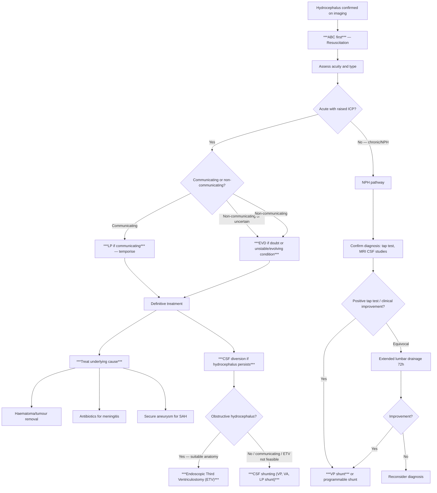
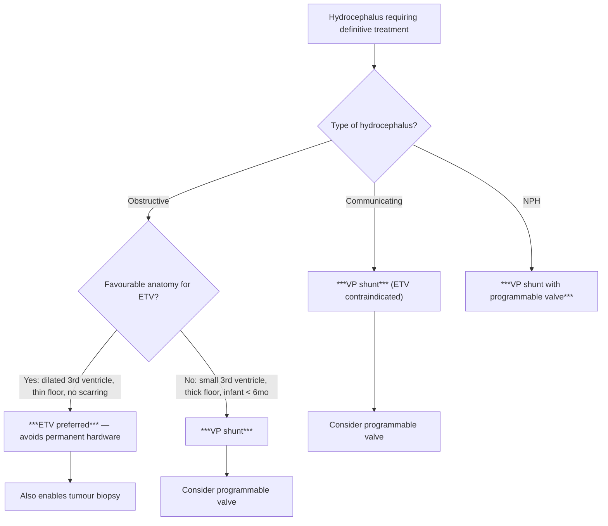

## Principles of Management

The management of hydrocephalus follows a logical hierarchy built around three fundamental goals articulated in the lecture slides [1]:

***The Fundamentals*** [1]:
- ***Protect uninjured brain***
- ***Salvage injured brain***
- ***Treat underlying cause***

And within that framework, the overarching priorities are [1]:
1. ***ALWAYS resuscitate first*** — ***ABC before ICP*** [1]
2. ***Clinical/ICP monitoring***
3. ***Control ICP and maintain cerebral perfusion***
4. ***Neuroprotective therapies***

Think of hydrocephalus management as a **time-ordered cascade**: you stabilise the patient first (ABC), buy time with temporising measures, then move to definitive treatment of both the hydrocephalus and its underlying cause.

---

## Master Management Algorithm

---

## Treatment Modalities — Detailed Breakdown

### Phase 1: Resuscitation and Immediate Stabilisation

***"ABC first"*** — ***"ALWAYS resuscitate first"*** [1]

Before doing anything about the ICP, you must ensure the patient is haemodynamically stable, ventilating adequately, and oxygenating well. This is because:

- **Hypotension** → ↓ MAP → ↓ CPP (CPP = MAP − ICP) → worsening cerebral ischaemia
- **Hypoxia** → direct neuronal injury + cerebral vasodilation (to compensate) → ↑ cerebral blood volume → ↑ ICP
- **Hypercarbia** → cerebral vasodilation → ↑ blood volume → ↑ ICP

**Practical steps**:
- **Airway**: Intubate if GCS ≤ 8 (cannot protect airway) [1]
- **Breathing**: Target SpO₂ > 97%, PaO₂ > 9 kPa, PaCO₂ 4.5–5 kPa [3]
- **Circulation**: Maintain adequate MAP for CPP (~60–80 mmHg) [1]. Avoid hypotension
- **Head elevation**: 30° — promotes venous drainage from the cranium (reduces intracranial venous blood volume → ↓ ICP) [3]
- **Loosen neck constraints** — tight cervical collars or lines can compress the jugular veins → impede venous outflow → ↑ ICP [3]

### Phase 2: Temporising Measures

These buy time while you work towards definitive treatment. The choice depends critically on whether the hydrocephalus is **communicating or non-communicating** [1].

---

#### A. Lumbar Puncture (LP) — For Communicating Hydrocephalus ONLY

***"LP if communicating"*** [1]

| Aspect | Details |
|---|---|
| **Indication** | ***Communicating hydrocephalus*** where CSF drains freely between ventricles and lumbar subarachnoid space [1][5] |
| **Contraindication** | ***LP is absolutely contraindicated (and lethal) in non-communicating hydrocephalus*** [1]. Also contraindicated if any suspicion of posterior fossa mass or uncal herniation |
| **Mechanism** | Removing 30–50 mL of CSF from the lumbar space → reduces total CSF volume → immediate ↓ ICP. Because the system is communicating, pressure reduction is transmitted uniformly to the ventricles [5] |
| **Practical** | Removal of 30–40 mL of CSF [5]; measure opening pressure; send CSF for analysis if aetiology unclear |
| **Why it's dangerous in non-communicating HC** | If there is a block within the ventricular system, removing CSF below the block creates a **transtentorial pressure gradient**: high pressure above (ventricles) vs low pressure below (lumbar) → **downward herniation** of the brainstem through the foramen magnum → death |

> ***"No LP if raised ICP unless absolutely sure communicating hydrocephalus"*** [1]

---

#### B. External Ventricular Drain (EVD) — The Emergency Workhorse

***"EVD if doubt or unstable/evolving condition"*** [1]

| Aspect | Details |
|---|---|
| **What it is** | A small catheter inserted through a burr hole into the **lateral ventricle** (usually via Kocher's point: 11 cm posterior from nasion, 3 cm lateral to midline), connected to a closed external drainage system [1][5] |
| **Dual function** | ***Manometric principle for monitoring intracranial CSF pressure*** + ***Therapeutic by draining CSF for decompression*** [1] |
| **Indications** | Any acute hydrocephalus where LP is contraindicated or unsafe; non-communicating hydrocephalus; unstable patient; evolving condition where continuous ICP monitoring is needed; ***"EVD — rarely"*** for diagnosis but commonly for treatment [1] |
| **Advantages** | Can be used in BOTH communicating and non-communicating hydrocephalus (unlike LP). Allows continuous monitoring. Can be clamped/opened to titrate drainage |
| **Risks** | ***Risk of infection*** (~5–10%), iatrogenic trauma, haemorrhage during insertion, overdrainage [1][3] |
| **Temporary only** | ***EVD is a temporary measure only but allows monitoring*** [5] — it is a bridge to definitive treatment, not a permanent solution |

**How EVD works from first principles**: By placing a catheter directly into the dilated ventricle, you bypass any obstruction (the drain is *upstream* of any block). CSF drains into an external bag, reducing ventricular volume and ICP. The height of the drainage bag relative to the external auditory meatus sets the drainage pressure — lower bag = more drainage (but risk of overdrainage); higher bag = less drainage.

---

#### C. Medical Temporisation — Diuretics

**Acetazolamide + Furosemide** [3]

| Drug | Mechanism | Role |
|---|---|---|
| **Acetazolamide** ("Diamox") | Carbonic anhydrase inhibitor → ↓ HCO₃⁻ and Na⁺ secretion by choroid plexus → ↓ CSF production (can reduce production by ~50%) | Temporary measure to slow CSF accumulation while planning definitive treatment |
| **Furosemide** (frusemide) | Loop diuretic → ↓ total body water → ↓ CSF formation via reduced water availability; may also directly inhibit choroid plexus Na⁺/K⁺ transport | Adjunct to acetazolamide |

**Limitations**: These are **temporising measures only** — they slow CSF production but do not fix the underlying obstruction or absorption problem. They are most useful in slowly progressive communicating hydrocephalus or post-haemorrhagic hydrocephalus in neonates where definitive surgery is being planned.

**Contraindications/Cautions**:
- Acetazolamide: metabolic acidosis, renal stones, hypokalemia, sulfonamide allergy
- Furosemide: dehydration, electrolyte derangement, hypovolaemia

---

#### D. General ICP Management Measures

While these are not specific to hydrocephalus, they form part of the overall management of any patient with raised ICP [1][3]:

| Measure | Mechanism | Important Caveats |
|---|---|---|
| **Head elevation 30°** | Promotes venous drainage from the cranium via gravity → ↓ intracranial venous blood volume → ↓ ICP | Ensure the neck is neutral (not rotated/flexed) to avoid jugular compression |
| **Sedation and analgesia** | ↓ Metabolic demand → ↓ cerebral blood flow requirement → ↓ ICP. Also prevents agitation-induced ICP spikes | Use in ICU setting with ICP monitoring |
| **IV Mannitol** (0.25–1 g/kg bolus) | Osmotic diuretic → creates osmotic gradient drawing water from brain parenchyma into blood → ↓ brain volume → ↓ ICP. Onset 15 min, duration ~6h | ***"No mannitol if shocked"*** [1] — mannitol causes osmotic diuresis → hypovolaemia → worsens shock. Avoid if serum Na > 155 or osmolality > 320 mOsm/L |
| **Hypertonic saline** (3% or 23.4%) | Similar osmotic mechanism to mannitol but without diuretic effect → can be used in hypovolaemic patients | Alternative to mannitol; monitor sodium levels |
| **Controlled hyperventilation** | ↓ PaCO₂ → cerebral vasoconstriction → ↓ cerebral blood volume → ↓ ICP | ***"No prophylactic/prolonged/uncontrolled hyperventilation"*** [1]. Short-term bridge only (target PaCO₂ 30–35 mmHg). Prolonged use causes rebound vasodilation and can worsen ischaemia |
| **Steroids** (dexamethasone) | ↓ Vasogenic oedema around tumours by stabilising BBB | ***"Steroids for tumour but not TBI or stroke"*** [1]. C/I in suspected CNS lymphoma (destroys diagnostic yield) [5a] |

<Callout title="The Do-NOT-Do List — From Key Messages" type="error">
Straight from the lecture slides [1]:
- ***No mannitol if shocked***
- ***No prophylactic/prolonged/uncontrolled hyperventilation***
- ***No LP if raised ICP unless absolutely sure communicating hydrocephalus***
- ***Steroids for tumour but not TBI or stroke***
- ***ABC before ICP***
</Callout>

---

### Phase 3: Definitive Treatment

***Treatment of Hydrocephalus — Definitive measures*** [1]:
- ***CSF shunting (e.g., ventriculo-peritoneal, ventriculo-atrial)***
- ***Endoscopic third ventriculostomy***
- ***Treat underlying cause (e.g., haematoma/tumour removal)***

---

#### A. Treat the Underlying Cause

This is conceptually the most important step — if you can remove the cause of the hydrocephalus, you may not need permanent CSF diversion at all.

| Cause | Definitive Treatment |
|---|---|
| **Posterior fossa tumour** | ***Craniotomy for haematoma/tumour removal*** [1] — once the tumour compressing the 4th ventricle is removed, CSF pathways may re-open |
| **Colloid cyst of 3rd ventricle** | Surgical excision (endoscopic or open) |
| **SAH** | ***Secure aneurysm*** (clip or coil) [14] to prevent rebleeding, then manage hydrocephalus (may resolve after blood clears; if not → shunt) |
| **Meningitis** | Appropriate antimicrobials (antibiotics for bacterial, anti-TB for TBM, antifungals for cryptococcal) |
| **Cerebellar haemorrhage** | ***Evacuation of hematoma*** if brainstem compression, haematoma > 3 cm, or obliteration of cisterns; ***external ventricular drainage*** if small haematoma with hydrocephalus [15] |
| **Choroid plexus papilloma** | Surgical excision → removes the source of CSF overproduction |

**Post-SAH hydrocephalus** deserves special mention [14]:
- ***Acute increase in ICP*** — ***CSF drainage helps but might provoke re-bleeding if aneurysm not yet secured!*** [14]
- ***Delayed — poor absorption and usually communicating — for shunting*** [14]
- ***Beware of new symptoms several months post-SAH*** [14] — delayed hydrocephalus can present weeks to months later as gradual cognitive decline, gait difficulty, incontinence

---

#### B. CSF Shunting — Permanent CSF Diversion

When the underlying cause cannot be removed or hydrocephalus persists despite treating the cause, permanent CSF diversion is needed.

##### Types of CSF Shunt [1][2][3][5]

| Shunt Type | Route | When to Use | Specific Considerations |
|---|---|---|---|
| ***Ventriculo-peritoneal (VP) shunt*** | Lateral ventricle → subcutaneous tunnel → peritoneal cavity | ***Usually 1st choice*** [5] — peritoneal cavity has large absorptive surface area | Most common; easiest to revise. C/I: peritonitis, peritoneal adhesions, abdominal surgery, ascites |
| ***Ventriculo-atrial (VA) shunt*** | Lateral ventricle → subcutaneous tunnel → right atrium (via internal jugular/facial vein) | When peritoneal cavity is unsuitable (e.g., adhesions, prior peritonitis) | Risk of ***nephritis (VA)*** [1] (immune complex glomerulonephritis from chronic bacteraemia — "shunt nephritis"), atrial arrhythmia, pulmonary embolism |
| ***Lumbo-peritoneal (LP) shunt*** | Lumbar subarachnoid space → peritoneal cavity | Communicating hydrocephalus only (CSF must freely reach the lumbar space) | Avoids cranial surgery. Risks: tonsillar herniation if used in non-communicating HC (same principle as LP contraindication), overdrainage, radiculopathy |

##### Components of a CSF Shunt [3]

A shunt system has three parts:
1. **Ventricular (proximal) catheter** — sits within the lateral ventricle (usually the frontal horn)
2. **Valve and reservoir** — a ***one-way valve to control CSF flow*** [1]. Prevents backflow and regulates the drainage pressure. The reservoir can be palpated subcutaneously behind the ear and can be percutaneously aspirated ("shunt tap") to test function or obtain CSF
3. **Distal catheter** — tunnelled subcutaneously to the peritoneal cavity (VP), right atrium (VA), or from the lumbar space to peritoneum (LP)

##### Programmable CSF Shunt [1][5]

***Programmable CSF shunt*** — a critically important modern advance:
- ***Allows post-op transcutaneous adjustment of shunt valve setting*** [1]
- ***Tailored to individual patients' needs*** [1]
- ***Affected by external magnetic field*** [1]
- ***Check before and after MRI*** [1][5]

How it works: The valve contains a small magnetic mechanism that sets the opening pressure. Using an external magnetic programmer held over the scalp, the clinician can **non-invasively increase or decrease the drainage pressure** after surgery. This avoids the need for reoperation if the drainage rate needs adjusting (e.g., if there's overdrainage causing CSDH, you increase the valve setting; if there's underdrainage with persistent hydrocephalus, you decrease it).

Important: MRI scanners generate powerful magnetic fields → can inadvertently **reset** the programmable valve setting. Therefore: ***check setting before and after MRI*** [1][5]. Modern programmable valves (e.g., Codman Certas Plus, Medtronic Strata) are increasingly MRI-resistant but always verify.

> ***NOT C/I for MRI, but need to check setting before and after MRI*** [5]

---

#### C. Endoscopic Third Ventriculostomy (ETV) — For Obstructive Hydrocephalus

***Endoscopic Third Ventriculostomy (ETV)*** [1]

| Aspect | Details |
|---|---|
| **Concept** | ***Fenestrate 3rd ventricle floor → bypass obstruction and restore CSF flow*** [1]. A neuroendoscope is passed through the lateral ventricle into the 3rd ventricle, and a hole is made in the floor of the 3rd ventricle (the tuber cinereum). This creates a direct communication between the 3rd ventricle and the prepontine cistern (subarachnoid space), bypassing the obstructed aqueduct |
| **Indication** | ***Obstructive hydrocephalus*** — specifically when the obstruction is at or distal to the aqueduct of Sylvius [1][2]. The 3rd ventricle must be dilated enough to safely perform the procedure. Classic scenario: ***pineal tumour with 3rd ventricle blockage → can shunt or do ETV*** [1] |
| **Contraindication** | ***NOT communicating hydrocephalus*** [2] — because in communicating hydrocephalus, the problem is impaired absorption at the arachnoid granulations, not a flow obstruction within the ventricular system. Creating a hole in the 3rd ventricle floor won't help if the subarachnoid absorption is the problem |
| **Advantages** | ***Avoid permanent shunting*** [1] — no implanted hardware, no risk of shunt infection/malfunction/overdrainage; ***Enable tumour biopsy*** [1] — the same endoscopic procedure can biopsy an obstructing tumour for histological diagnosis |
| **Success rate** | ~70–80% in appropriately selected patients (aqueductal stenosis, posterior fossa tumours). Lower success in infants < 6 months (immature arachnoid granulations may limit absorption even if flow is restored) |
| **Complications** | Basilar artery injury (the floor of the 3rd ventricle lies directly above the basilar artery), ventriculitis, CSF leak, hypothalamic injury, memory impairment (fornix damage) |

**ETV vs Shunting — When to Choose What?**

<Callout title="Why ETV Does NOT Work for Communicating Hydrocephalus">
This is a concept often tested. In communicating hydrocephalus, CSF flows freely from the ventricles into the subarachnoid space — the problem is at the **arachnoid granulations** (impaired absorption). ETV creates a bypass from the 3rd ventricle to the subarachnoid space — but the CSF is already getting to the subarachnoid space just fine. The bottleneck is downstream at absorption. Therefore, ETV does not address the pathology and is contraindicated [2][5].
</Callout>

---

#### D. Management of NPH — Special Pathway

***NPH responds well to CSF diversion (e.g., VP-shunting)*** [1]

The management of NPH is unique because:
- There is no acute emergency (ICP is normal)
- The challenge is **diagnostic certainty** — you want to be confident that the patient will improve with shunting before subjecting them to surgery
- ***Need to distinguish from other causes of dementia such as AD, which does not respond to shunting*** [1]

**NPH Management Protocol**:

1. **Confirm diagnosis**: imaging (ventricular enlargement >> sulcal effacement, FLAIR hyperintensity), tap test (remove 30–50 mL CSF, assess gait and cognition improvement) [5]
2. **If tap test positive**: proceed to **VP shunt** (usually with programmable valve for post-op titration)
3. **If tap test equivocal**: extended lumbar drainage over 72 hours → reassess
4. **Post-shunt follow-up**: regular CT to assess adequacy of shunting [5], clinical assessment of triad symptoms, check programmable valve setting after any MRI

**Prognosis of NPH after shunting**:
- Gait: improves in ~80–90% of patients — the most responsive component
- Cognition: improves in ~50–70%
- Incontinence: improves in ~50–60%
- Best outcomes when gait disturbance is the predominant feature (correlating with the mechanism — periventricular motor fibre compression is the most directly reversible pathology)
- Poorer outcomes with longer symptom duration, more advanced dementia, or significant comorbid cerebrovascular disease

---

### Phase 4: Monitoring and Follow-Up

After any intervention for hydrocephalus:

- **Regular follow-up CT** to assess adequacy of shunting/ventricular size [5]
- **Clinical assessment** of symptoms at each visit
- **Shunt setting check** after any MRI (for programmable shunts) [1][5]
- **Vigilance for shunt complications** (see Complications section to follow)
- **Serial head circumference** in infants

---

## Common Clinical Scenarios — From the Lecture Slides [1]

These are high-yield exam scenarios directly from the lecture:

| ***Scenario*** | ***What to Suspect*** | ***Action*** |
|---|---|---|
| ***1. Recurrent hydrocephalic symptoms*** | ***Blocked shunt?*** | ***Test shunt if you know what you are doing*** [1] — urgent CT brain + shunt series XR |
| ***2. Raised ICP symptoms ± focal deficit*** | ***CSDH? (e.g., elderly on aspirin)*** [1] | CT brain — crescentic extra-axial collection; neurosurgical evacuation |
| ***3. Postural headache (worse when erect)*** | ***Intracranial hypotension? (e.g., over-shunting without CSDH)*** [1] | Adjust programmable valve to higher setting; contrast MRI may show diffuse pachymeningeal enhancement, sagging brain |
| ***4. Fever + abdominal pain*** | ***Shunt infection causing peritonitis? OR Peritonitis causing shunt infection?*** [1] | ***Externalise shunt + antibiotics*** [1] — remove the infected distal catheter from the peritoneum and convert to an external drain while treating the infection; then re-internalise once infection cleared |

<Callout title="Avoid Shunting If Possible" type="idea">
***"Avoid shunting if possible!"*** [1] — This is a direct message from the lecture slides. Every implanted shunt carries lifelong risks of infection, malfunction, and revision surgery. When an alternative exists (e.g., ETV for obstructive hydrocephalus, treating the underlying cause directly), it should be preferred. However, when shunting is necessary, it is a well-established and effective treatment.
</Callout>

---

## Summary Table: Treatment Modalities at a Glance

| Treatment | Type | Indication | Contraindication | Key Point |
|---|---|---|---|---|
| **LP drainage** | Temporising | Communicating HC | ***Non-communicating HC (lethal)*** [1] | Safe, quick, diagnostic + therapeutic |
| **EVD** | Temporising | Any HC type, unstable patient | Awake patients, coagulopathy (relative) | Gold standard for ICP monitoring + drainage |
| **Acetazolamide + furosemide** | Medical | Slowly progressive HC, bridge to surgery | Metabolic acidosis, dehydration | ↓ CSF production; temporary only |
| **VP shunt** | Definitive | Communicating HC, NPH, any HC needing permanent diversion | Peritonitis, ascites, peritoneal adhesions | ***Usually 1st choice*** [5]; programmable valve preferred |
| **VA shunt** | Definitive | When peritoneum unsuitable | Cardiac disease, chronic bacteraemia | Risk of shunt nephritis, arrhythmia |
| **LP shunt** | Definitive | Communicating HC only | Non-communicating HC | Avoids craniotomy; risk of tonsillar herniation |
| **ETV** | Definitive | ***Obstructive HC*** | ***Communicating HC*** [2] | ***Avoids permanent shunting, enables tumour biopsy*** [1] |
| **Tumour/haematoma removal** | Definitive (cause) | Obstructing mass | Inoperable location/patient | May resolve HC without needing shunt |
| **Decompressive craniectomy** | Last resort | Massive infarction, post-TBI swelling | Not for HC specifically | ***Primary pathology (deficit) unchanged; quality of survival variable*** [1] |

---

<Callout title="High Yield Summary">

**Management hierarchy**: ***ABC first → Temporise → Definitive treatment → Treat underlying cause***

**Temporising measures:**
- ***LP if communicating*** (NEVER in non-communicating — lethal)
- ***EVD if doubt or unstable/evolving condition*** — works for any type; also monitors ICP
- Medical: acetazolamide + furosemide (↓ CSF production — bridge only)

**Definitive measures:**
- ***CSF shunting***: VP shunt (1st choice), VA shunt (if peritoneum unsuitable), LP shunt (communicating only)
- ***ETV***: for obstructive HC only — fenestrates 3rd ventricle floor, avoids permanent shunting, enables tumour biopsy. NOT for communicating HC
- ***Treat underlying cause***: tumour removal, aneurysm clipping/coiling, antibiotics for meningitis

**Programmable shunts**: allow transcutaneous adjustment; must check before and after MRI

**NPH**: responds well to VP shunting; gait improves most reliably; positive tap test predicts good shunt response

**Key safety rules**: No LP if non-communicating; no mannitol if shocked; no uncontrolled hyperventilation; steroids for tumour only (not TBI/stroke); avoid shunting if possible

**Post-SAH hydrocephalus**: CSF drainage helps acutely but may provoke rebleeding if aneurysm not yet secured; delayed hydrocephalus is usually communicating → shunting

</Callout>

---

<ActiveRecallQuiz
  title="Active Recall - Hydrocephalus Management"
  items={[
    {
      question: "State the 3 definitive treatment modalities for hydrocephalus listed in the lecture slides and their indications.",
      markscheme: "(1) CSF shunting (VP, VA shunt) — for any hydrocephalus requiring permanent diversion, especially communicating HC and NPH. (2) Endoscopic third ventriculostomy (ETV) — for obstructive hydrocephalus only; fenestrates the 3rd ventricle floor to bypass obstruction and restore CSF flow; also enables tumour biopsy. (3) Treat underlying cause — e.g. haematoma/tumour removal, antibiotics for meningitis, aneurysm clipping/coiling for SAH.",
    },
    {
      question: "Why is ETV contraindicated in communicating hydrocephalus? Explain from first principles.",
      markscheme: "In communicating hydrocephalus, CSF flows freely from the ventricles into the subarachnoid space — the obstruction is at the arachnoid granulations (impaired absorption). ETV creates a bypass from the 3rd ventricle to the prepontine cistern (subarachnoid space), but the CSF is already reaching the subarachnoid space. The bottleneck is downstream at absorption, not at intraventricular flow. Therefore ETV does not address the pathology and will not resolve the hydrocephalus.",
    },
    {
      question: "A patient with a VP shunt develops postural headache (worse when standing, improves lying down). What complication do you suspect and how would you manage it?",
      markscheme: "Suspect over-shunting causing intracranial hypotension. Excessive CSF drainage causes the brain to 'sag' and pulls on meningeal structures. Management: if programmable shunt, increase the valve pressure setting transcutaneously. Perform CT brain to rule out subdural haematoma/hygroma (bridging veins can be stretched and rupture from over-shunting). If non-programmable shunt, may require surgical revision to a higher-resistance valve. From lecture: this is Common Scenario 3.",
    },
    {
      question: "Describe the management approach for post-SAH hydrocephalus, distinguishing between acute and delayed presentations.",
      markscheme: "Acute: CSF drainage via EVD to relieve raised ICP, BUT be cautious as drainage might provoke re-bleeding if the aneurysm is not yet secured — priority is to secure the aneurysm first (clip/coil) then manage hydrocephalus. Delayed (weeks to months post-SAH): usually communicating hydrocephalus from poor absorption due to arachnoid granulation fibrosis/adhesions from blood products. Treatment: permanent CSF shunting (VP shunt). Important: beware of new symptoms several months post-SAH, as delayed hydrocephalus can present insidiously.",
    },
    {
      question: "List 4 things from the lecture Key Messages that you should NOT do when managing raised ICP/hydrocephalus.",
      markscheme: "(1) No LP if raised ICP unless absolutely sure communicating hydrocephalus. (2) No mannitol if shocked — causes osmotic diuresis worsening hypovolaemia. (3) No prophylactic/prolonged/uncontrolled hyperventilation — can cause vasoconstriction and worsen cerebral ischaemia. (4) Steroids for tumour but NOT for TBI or stroke — no benefit and harmful in non-tumour causes. Also: always ABC before ICP.",
    },
    {
      question: "What are the 3 components of a CSF shunt system? What is a programmable shunt and what is its key precaution regarding MRI?",
      markscheme: "Components: (1) Ventricular/proximal catheter — sits in the lateral ventricle. (2) Valve and reservoir — one-way valve controlling CSF flow; reservoir can be palpated and tapped. (3) Distal catheter — tunnelled to the peritoneal cavity (VP), right atrium (VA), or from lumbar space (LP shunt). Programmable shunt: contains a magnetic valve mechanism allowing post-op transcutaneous adjustment of pressure setting via external magnetic programmer, tailored to patient needs. MRI precaution: the strong magnetic field can reset the valve setting — must check setting before and after MRI.",
    },
  ]}
/>

---

## References

[1] Lecture slides: GC 111. Raised intracranial pressure and hydrocephalus.pdf (p8–9, p13–18)
[2] Senior notes: felixlai.md (Hydrocephalus treatment section)
[3] Senior notes: maxim.md (Section 5.3 Hydrocephalus; ICP management section)
[5] Senior notes: Ryan Ho Neurology.pdf (p156, p159–160, p163)
[5a] Senior notes: Ryan Ho Neurology.pdf (p163 — steroids C/I in CNS lymphoma)
[14] Lecture slides: GC 109. Headache and loss of consciousness Acute stroke, subarachnoid haemorrhage and vascular malformation.pdf (p20)
[15] Lecture slides: Cererbrovascular disease.pdf (p10 — cerebellar haemorrhage management)
