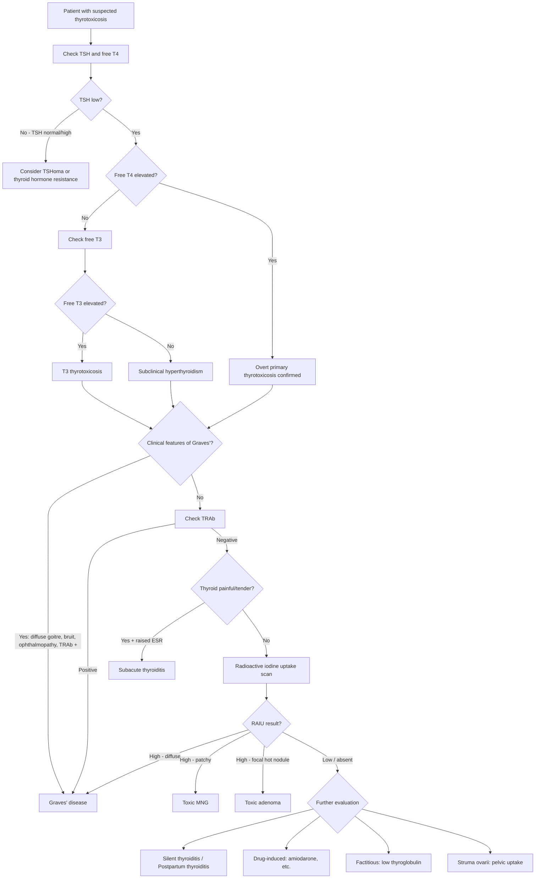

## Differential Diagnosis of Hyperthyroidism / Thyrotoxicosis

When a patient presents with clinical features suggesting thyrotoxicosis — weight loss, tremor, palpitations, heat intolerance — the real clinical challenge isn't just confirming thyrotoxicosis (that's a blood test). The challenge is **determining the cause**, because the management differs dramatically. You don't give carbimazole to someone with subacute thyroiditis, and you don't give steroids to someone with Graves'.

The differential diagnosis operates on **two levels**:

1. **Level 1**: Is this truly thyrotoxicosis, or is it a mimic? (The "broad DDx" of a thyrotoxic-looking patient)
2. **Level 2**: If it IS thyrotoxicosis, what is the underlying cause? (The "aetiological DDx" — distinguishing between causes of thyrotoxicosis)

---

### Level 1: Conditions That Mimic Thyrotoxicosis

Before you even get to the blood results, a patient with anxiety, tremor, tachycardia, weight loss, and sweating could have several other diagnoses. These are conditions that share sympathetic-overdrive features:

| Mimic | Key Distinguishing Features | Why It Mimics Thyrotoxicosis |
|---|---|---|
| **Anxiety disorder / panic disorder** | Normal TFTs. Episodic rather than constant. No goitre, no eye signs, no weight loss despite good appetite | Sympathetic activation → tachycardia, tremor, sweating, palpitations |
| **Phaeochromocytoma** | ***Paroxysmal*** headache, sweating, palpitations, hypertension (cf. Graves' has wide pulse pressure but not typically severe hypertension). 24h urinary catecholamines / plasma metanephrines elevated [6] | Catecholamine excess → direct sympathetic features. Unlike thyrotoxicosis, symptoms are typically episodic/paroxysmal |
| **Cardiac arrhythmia (e.g., SVT, AF)** | Palpitations dominant. No weight loss, no tremor, no heat intolerance. ECG diagnostic | AF can be *caused by* thyrotoxicosis — always check TFTs in new AF |
| **Substance use** (cocaine, amphetamines, excessive caffeine) | History is key. Dilated pupils, agitation. Normal TFTs | Sympathomimetic agents mimic catecholamine excess |
| **Menopause** | Hot flushes (episodic, not constant heat intolerance), irregular menses, age > 45. Normal TFTs. FSH elevated | Vasomotor instability from oestrogen withdrawal |
| **Malignancy (occult)** | Weight loss without increased appetite (anorexia present). Night sweats. Lymphadenopathy | Weight loss + sweating, but appetite is typically DECREASED (vs. thyrotoxicosis where appetite is INCREASED) |
| **Diabetes mellitus (new onset)** | Polyuria, polydipsia, weight loss. Elevated glucose. Normal TFTs | Weight loss + polyuria overlap with thyrotoxicosis. But DM has polydipsia and hyperglycaemia |
| **Heart failure** | Dyspnoea, tachycardia, oedema. But resting, not hypermetabolic. May coexist with thyrotoxicosis | High-output HF can be CAUSED by thyrotoxicosis — so check TFTs |
| **Carcinoid syndrome** | Episodic flushing, diarrhoea, wheezing. 24h urinary 5-HIAA elevated | Flushing + diarrhoea overlap. But carcinoid flushing is episodic and often triggered; thyrotoxic heat intolerance is constant |

<Callout title="Clinical Pearl" type="idea">
The single most important screening test to rule in/rule out thyrotoxicosis is **serum TSH**. If TSH is normal, the patient is almost certainly NOT thyrotoxic (exception: the very rare TSH-secreting pituitary adenoma where TSH is inappropriately normal/high). A normal TSH has a negative predictive value of > 99% for primary thyrotoxicosis.
</Callout>

---

### Level 2: Aetiological Differential Diagnosis — Distinguishing Between Causes of Thyrotoxicosis

Once thyrotoxicosis is biochemically confirmed (suppressed TSH, elevated fT4/fT3), the critical next step is determining the **cause**. This drives management.

***The aetiological differential diagnosis is best approached by dividing causes into those with HIGH radioactive iodine uptake (RAIU) versus LOW RAIU*** [1][2][7]:

| RAIU | Category | Causes | Pathophysiology |
|---|---|---|---|
| **HIGH (diffuse)** | Gland uniformly overactive | ***Graves' disease*** | TRAb uniformly stimulates all TSH receptors → diffuse hyperfunction and iodine trapping |
| **HIGH (patchy/multifocal)** | Multiple autonomous zones | ***Toxic multinodular goitre (TMNG)*** [1][7] | Multiple nodules with activating mutations → patchy autonomous uptake |
| **HIGH (focal, single)** | Single autonomous nodule | ***Toxic adenoma (Plummer's disease)*** [1][7] | Single nodule with activating TSH-receptor mutation → focal "hot" uptake with suppressed surrounding tissue |
| **LOW / absent** | Gland damaged, leaking stored hormone | ***Subacute (de Quervain's) thyroiditis*** | Post-viral granulomatous inflammation → follicular destruction → passive release of preformed T3/T4. Gland NOT actively trapping iodine |
| **LOW / absent** | Gland damaged, leaking stored hormone | ***Silent (painless) thyroiditis*** | Autoimmune lymphocytic infiltration → follicular destruction → passive hormone release. Often postpartum |
| **LOW / absent** | Drug-induced destruction | ***Amiodarone-induced thyrotoxicosis type 2*** | Direct cytotoxic effect on thyrocytes → hormone leakage |
| **LOW / absent** | Exogenous hormone | ***Factitious thyrotoxicosis / levothyroxine overdose*** [2] | Exogenous T4 suppresses TSH and native thyroid function → gland doesn't take up iodine. Thyroglobulin LOW (key distinguisher) |
| **LOW / absent** | Ectopic thyroid tissue | ***Struma ovarii*** | Ectopic thyroid tissue in ovarian teratoma producing T3/T4. Neck RAIU low but pelvic uptake present |
| **Variable** | TSH-driven | ***TSH-secreting pituitary adenoma*** [2] | TSH is inappropriately normal/elevated → drives thyroid to produce hormone. RAIU may be normal/high |
| **Variable** | hCG-driven | ***Gestational thyrotoxicosis / hCG-secreting tumour*** [2] | hCG cross-stimulates TSH receptor (structural homology with TSH — shared α-subunit, similar β-subunit) [8] |

---

### Clinical Approach to Distinguishing the Cause

The approach combines **history, examination, biochemistry, and imaging** in a logical sequence:

[2][7]

---

### Key Differentiating Features — Cause by Cause

#### 1. ***Graves' Disease vs. Toxic MNG vs. Toxic Adenoma***

This is the most common clinical distinction you'll need to make.

| Feature | ***Graves' Disease*** | ***Toxic MNG*** | ***Toxic Adenoma*** |
|---|---|---|---|
| **Age** | 30–50 years | > 50 years | 30–50 years |
| **Goitre** | ***Diffuse, smooth*** | ***Multinodular, irregular*** [1] | ***Single palpable nodule*** |
| **Thyroid bruit** | ***Present*** (increased vascularity) [9] | Absent | Absent |
| **Eye signs** | ***Graves' ophthalmopathy*** (proptosis, ophthalmoplegia, periorbital oedema) | Lid lag/retraction only (sympathetic) | Lid lag/retraction only |
| **Pretibial myxoedema** | May be present | Absent | Absent |
| **TRAb** | ***Positive (80–90%)*** [2] | Negative | Negative |
| **Anti-TPO** | ***50–80%*** positive [2] | 10–20% | Usually negative |
| **RAIU scan** | ***Diffusely increased uptake*** [1] | ***Patchy uptake with hot and cold areas*** [1] | ***Single hot nodule with suppressed surrounding tissue*** [1] |
| **Ultrasound** | Diffuse enlargement, increased vascularity ("thyroid inferno") | Multiple nodules of varying echogenicity | Single well-defined nodule |
| **Natural history** | Relapsing-remitting; may remit spontaneously or with ATDs | Progressive; ATDs rarely induce remission | Grows slowly; may cause increasing toxicity over time |

> ***On clinical examination, only 3 conclusions can be derived: thyroid nodule, multinodular goitre, or diffuse goitre*** [9]. This clinical distinction guides further investigation.

#### 2. ***Graves' Disease vs. Subacute (de Quervain's) Thyroiditis***

| Feature | ***Graves'*** | ***Subacute Thyroiditis*** |
|---|---|---|
| **Onset** | Gradual (weeks–months) | Acute (days), often follows URTI |
| **Pain** | ***Painless*** | ***Painful, exquisitely tender thyroid*** |
| **ESR/CRP** | Normal | ***Markedly elevated*** (ESR often > 50 mm/hr) |
| **TRAb** | Positive | Negative |
| **RAIU** | ***High (diffuse)*** | ***Low/absent*** (gland destroyed, not trapping iodine) |
| **Phase** | Sustained hyperthyroidism (unless treated) | ***Triphasic***: thyrotoxic phase (2–8 wks) → hypothyroid phase (weeks–months) → recovery |
| **Treatment** | ATDs, RAI, or surgery | Supportive: NSAIDs/steroids for pain and inflammation, beta-blockers for symptoms. ATDs are USELESS (gland is not synthesising — it's leaking) |

<Callout title="Why are antithyroid drugs useless in thyroiditis?" type="error">
Antithyroid drugs (carbimazole, PTU) work by inhibiting thyroid peroxidase (TPO), which blocks NEW hormone synthesis. In thyroiditis, the problem is RELEASE of PREFORMED hormone from damaged follicles — there's nothing to block. Giving carbimazole to a patient with subacute thyroiditis is a common student mistake. Beta-blockers for symptom control + NSAIDs/steroids for inflammation is all you need.
</Callout>

#### 3. ***Silent (Painless) Thyroiditis vs. Subacute Thyroiditis***

Both present with transient thyrotoxicosis followed by hypothyroidism, but:

| Feature | Silent Thyroiditis | Subacute Thyroiditis |
|---|---|---|
| Pain | ***Painless*** | ***Painful*** |
| ESR | Normal or mildly elevated | Very high |
| Aetiology | Autoimmune (lymphocytic infiltration); often ***postpartum*** | Post-viral (granulomatous) |
| Anti-TPO | Often positive | Usually negative |
| Recurrence | May recur, especially with subsequent pregnancies | Rarely recurs |

#### 4. ***Factitious Thyrotoxicosis***

- Exogenous levothyroxine ingestion (intentional or accidental over-replacement).
- **Key distinguishing feature**: ***Thyroglobulin is LOW*** (because the native gland is suppressed and atrophic; exogenous T4 does not generate thyroglobulin). In ALL other causes of thyrotoxicosis, thyroglobulin is normal or elevated.
- RAIU is low (gland suppressed).
- No goitre (gland atrophies due to TSH suppression).

#### 5. ***TSH-Secreting Pituitary Adenoma (TSHoma)*** [2][10]

- Very rare (< 1% of pituitary adenomas, < 1% of thyrotoxicosis cases).
- **Key distinguishing feature**: ***TSH is inappropriately normal or elevated*** despite high fT4/fT3. In all other causes of primary thyrotoxicosis, TSH is suppressed.
- May have features of pituitary macroadenoma: headache, bitemporal hemianopia (compression of optic chiasm), hypopituitarism (compression of normal pituitary).
- Diagnosis: MRI pituitary, α-subunit elevated.

<Callout title="The TSH Paradox">
In virtually all thyrotoxicosis, TSH is suppressed by negative feedback. If you find elevated fT4 with a NORMAL or HIGH TSH, think of only two things: (1) ***TSH-secreting pituitary adenoma (TSHoma)*** — autonomous TSH production, or (2) ***Thyroid hormone resistance syndrome*** — mutations in thyroid hormone receptor → tissues are resistant → hypothalamus/pituitary don't "see" the high T4 → keep making TSH. The key distinguisher: TSHoma patients are clinically THYROtoxic; resistance syndrome patients are clinically EUthyroid (tissues are resistant, so high T4 doesn't cause symptoms) [2][10].
</Callout>

#### 6. ***Gestational Thyrotoxicosis vs. Graves' in Pregnancy***

| Feature | Gestational Thyrotoxicosis | Graves' in Pregnancy |
|---|---|---|
| Timing | First trimester (peaks with hCG at 10–12 weeks) | Any trimester |
| Goitre | Absent or minimal | Present (diffuse) |
| Eye signs | Absent | May be present |
| TRAb | Negative | Positive |
| hCG | Very high (often associated with hyperemesis gravidarum, multiple gestation, or molar pregnancy) | Normal for gestational age |
| Course | Self-limiting — resolves as hCG falls in 2nd trimester | Persists; needs treatment |
| Treatment | Supportive (rehydration, antiemetics). ATDs NOT needed in most cases | PTU in 1st trimester, carbimazole/methimazole in 2nd/3rd trimester |

#### 7. ***hCG-Mediated Thyrotoxicosis from Germ Cell Tumours***

- ***hCG and TSH share a common α-subunit and have considerable β-subunit homology; thus hCG has a weak thyroid-stimulating effect*** [8].
- ***Marked overproduction of hCG (e.g., from hydatidiform mole, choriocarcinoma, testicular germ cell tumour) can cause overt thyrotoxicosis*** [8][11].
- Distinguished from Graves' by: male sex or obstetric history, very high serum hCG, negative TRAb, pelvic/testicular mass.

---

### Special Differential: ***Amiodarone-Induced Thyrotoxicosis (AIT)***

Amiodarone is 37% iodine by weight and has an extremely long half-life (~100 days). It can cause both hypo- AND hyperthyroidism.

| Feature | **AIT Type 1** | **AIT Type 2** |
|---|---|---|
| **Mechanism** | Iodine-induced hyperthyroidism (Jod-Basedow) in pre-existing thyroid autonomy (nodular goitre, latent Graves') | Direct thyrotoxic effect of amiodarone on thyrocytes → destructive thyroiditis → hormone leakage |
| **Underlying thyroid** | Abnormal (pre-existing nodular disease) | Normal |
| **Goitre** | Often present (nodular) | Normal or small |
| **RAIU** | Normal or increased | Low |
| **Colour-flow Doppler USG** | Increased vascularity | Decreased/absent vascularity |
| **Treatment** | Thionamides (± perchlorate to block iodine uptake) | Glucocorticoids (prednisone) |
| **Mixed forms** | Common in practice — treat with both thionamides AND steroids | |

> **Why is colour-flow Doppler useful?** Because it reflects whether the gland is *actively* producing hormone (increased blood flow = type 1) or *passively* leaking it from destruction (absent blood flow = type 2). This is particularly helpful when RAIU is unreliable (amiodarone's iodine load can suppress uptake even in type 1).

---

### ***Goitre Classification as a DDx Framework*** [1]

***When approaching a thyroid swelling, the goitre classification provides a useful framework*** for differential diagnosis:

| ***Goitre Type*** | ***Causes*** |
|---|---|
| ***Simple goitre (endemic or sporadic) — diffuse*** | Iodine deficiency, physiological (puberty, pregnancy), goitrogens |
| ***Simple goitre — nodular*** | Multinodular goitre (non-toxic) |
| ***Toxic goitre — diffuse (Graves')*** | Autoimmune (TRAb) |
| ***Toxic goitre — nodular (Plummer's / TMNG)*** | Autonomous nodule(s) with activating mutations |
| ***Toxic / functioning adenoma*** | Single autonomous nodule |
| ***Neoplastic goitre — benign*** | Follicular adenoma |
| ***Neoplastic goitre — malignant*** | Papillary, follicular, medullary, anaplastic carcinoma, lymphoma |
| ***Thyroiditis*** | ***Bacterial (acute suppurative), viral (subacute/de Quervain's), lymphocytic/Hashimoto/autoimmune (chronic)*** [1] |

[1]

---

### Approach to a Thyroid Nodule — DDx Overlay [7]

***Around 10–15% of thyroid nodules are malignant*** [7]. When evaluating a thyroid nodule, the differential includes:

| Category | Differential |
|---|---|
| ***Solitary nodule*** | ***Dominant nodule in MNG; cyst (true simple cyst, colloid nodule); neoplastic (adenoma, toxic adenoma, carcinoma)*** [7] |
| ***Multiple nodules*** | ***MNG (hyperplastic/adenomatous nodules with varying cystic degeneration); toxic MNG; multiple cysts; multiple adenomas*** [7] |
| ***Diffuse*** | ***Graves' disease; physiological (pregnancy, puberty); Hashimoto's thyroiditis; de Quervain's / subacute thyroiditis*** [7] |

***The functional status of the nodule (hot vs. cold) is assessed by thyroid scintigraphy (I-123 or Tc-99m), which is indicated when TSH is suppressed*** [1][7]:

- ***Hot nodules*** (hyperfunctioning) → almost never malignant → ***do NOT require FNAC*** [2][7]
- ***Cold nodules*** (hypofunctioning) → ***10–20% risk of malignancy*** → ***require FNAC*** (if sonographic criteria met) [2][7]

***PET CT has NO diagnostic role in thyroid diseases — even malignant nodules can have low uptake*** [7].

<Callout title="Why do hot nodules rarely harbour malignancy?">
Hot nodules are actively taking up iodine and producing thyroid hormone — they are well-differentiated, functional thyroid tissue. Malignant cells (especially papillary and anaplastic carcinoma) are typically poorly differentiated and lose the ability to trap iodine efficiently, making them appear "cold" on scan. Therefore, a cold nodule is the one that worries you. However, note that most cold nodules are still benign (only 10–20% are malignant).
</Callout>

---

### Summary Table: Key Differentiating Investigations

| Investigation | Graves' | TMNG | Toxic Adenoma | Subacute Thyroiditis | Silent Thyroiditis | Factitious | TSHoma |
|---|---|---|---|---|---|---|---|
| **TSH** | ↓↓ | ↓↓ | ↓↓ | ↓↓ | ↓↓ | ↓↓ | Normal/↑ |
| **fT4** | ↑ | ↑ | ↑ | ↑ | ↑ | ↑ | ↑ |
| **TRAb** | **+** | **−** | **−** | **−** | **−** | **−** | **−** |
| **Anti-TPO** | +/− | −/+ | − | − | **+** | − | − |
| **ESR** | Normal | Normal | Normal | **↑↑↑** | Normal | Normal | Normal |
| **Thyroglobulin** | ↑ | ↑ | ↑ | ↑ | ↑ | **↓↓** | ↑ |
| **RAIU** | ***↑ diffuse*** | ***↑ patchy*** | ***↑ focal*** | ***↓↓*** | ***↓↓*** | ***↓↓*** | ↑ |
| **USG** | Diffuse, hypervascular | Multiple nodules | Single nodule | Diffuse, hypoechoic | Diffuse, hypoechoic | Normal/small | Normal |

---

<Callout title="High Yield Summary">

**Differential Diagnosis of Thyrotoxicosis — Key Exam Points:**

1. **First confirm thyrotoxicosis biochemically** (suppressed TSH, elevated fT4 ± fT3). Then determine the CAUSE.

2. **The pivotal investigation** is ***RAIU scan*** — separates HIGH uptake (true hyperthyroidism: Graves'/TMNG/toxic adenoma) from LOW uptake (thyroiditis/exogenous/factitious).

3. ***Graves' is distinguished*** by: diffuse goitre + bruit, ophthalmopathy, positive TRAb, diffusely increased RAIU.

4. ***Subacute thyroiditis is distinguished*** by: PAIN + tenderness, raised ESR, low RAIU, self-limiting triphasic course. ATDs are useless.

5. ***Factitious thyrotoxicosis*** has LOW thyroglobulin (all others have normal/high).

6. ***TSHoma*** is the ONLY cause where TSH is inappropriately normal/high with elevated fT4.

7. ***Hot nodules (on scintigraphy) are almost never malignant*** and do NOT need FNAC. ***Cold nodules carry 10–20% malignancy risk*** and require FNAC.

8. ***hCG can cross-stimulate TSH receptors*** → gestational thyrotoxicosis (physiological) or paraneoplastic thyrotoxicosis (germ cell tumours).

9. **Amiodarone-induced thyrotoxicosis**: Type 1 = iodine-induced (thionamides), Type 2 = destructive (steroids). Colour-flow Doppler helps differentiate.

10. ***On clinical examination, only 3 conclusions: thyroid nodule, multinodular goitre, or diffuse goitre*** — this guides the DDx pathway.

</Callout>

---

<ActiveRecallQuiz
  title="Active Recall - Differential Diagnosis of Hyperthyroidism"
  items={[
    {
      question: "A patient has biochemically confirmed thyrotoxicosis (low TSH, high fT4). What single investigation best distinguishes between Graves' disease, toxic MNG, toxic adenoma, and subacute thyroiditis? Describe the expected findings for each.",
      markscheme: "Radioactive iodine uptake (RAIU) scan. Graves': diffusely increased uptake. Toxic MNG: patchy increased uptake. Toxic adenoma: single hot nodule with suppressed surrounding tissue. Subacute thyroiditis: low/absent uptake (gland destroyed, not actively trapping iodine)."
    },
    {
      question: "A thyrotoxic patient has suppressed TSH, elevated fT4, LOW RAIU, and LOW thyroglobulin. What is the diagnosis and why is thyroglobulin low?",
      markscheme: "Factitious thyrotoxicosis (exogenous levothyroxine ingestion). Thyroglobulin is low because exogenous T4 suppresses TSH, which causes native thyroid gland atrophy and cessation of thyroglobulin production. In all other causes of thyrotoxicosis, thyroglobulin is normal or elevated."
    },
    {
      question: "A thyrotoxic patient has elevated fT4 but the TSH is NOT suppressed - it is normal. What two conditions should you consider, and how do you differentiate them clinically?",
      markscheme: "1) TSH-secreting pituitary adenoma (TSHoma): patient is clinically thyrotoxic, may have visual field defects from macroadenoma. 2) Thyroid hormone resistance syndrome: patient is clinically euthyroid because tissues are resistant to thyroid hormone. MRI pituitary and alpha-subunit measurement help confirm TSHoma."
    },
    {
      question: "Why are antithyroid drugs (carbimazole/PTU) ineffective in treating thyrotoxicosis caused by subacute thyroiditis?",
      markscheme: "ATDs block thyroid peroxidase (TPO) to inhibit NEW hormone synthesis. In subacute thyroiditis, the problem is release of PREFORMED stored hormone from damaged follicles, not new synthesis. There is nothing for ATDs to block. Treatment is supportive: beta-blockers for symptoms and NSAIDs/steroids for inflammation."
    },
    {
      question: "On thyroid scintigraphy, a nodule shows increased uptake (hot nodule). Does this nodule require FNAC? Why or why not?",
      markscheme: "No. Hot (hyperfunctioning) nodules are almost never malignant because they represent well-differentiated, functional thyroid tissue actively trapping iodine. Malignant cells typically lose iodine-trapping ability and appear cold. Hot nodules do not require FNAC; cold nodules (10-20% malignancy risk) require FNAC if sonographic criteria are met."
    },
    {
      question: "How do you differentiate AIT Type 1 from AIT Type 2 and what is the treatment for each?",
      markscheme: "AIT Type 1: iodine-induced hyperthyroidism in pre-existing thyroid autonomy; RAIU normal/increased; increased vascularity on Doppler USG; treatment is thionamides plus/minus perchlorate. AIT Type 2: destructive thyroiditis from amiodarone cytotoxicity; RAIU low; decreased vascularity on Doppler; treatment is glucocorticoids."
    }
  ]}
/>

---

## References

[1] Lecture slides: GC 177. A thyroid nodule benign thyroid nodules; thyroid cancer.pdf (p4, p13)
[2] Senior notes: felixlai.md (Sections II–III: Overview and Etiology; Section V: Diagnosis; Section VI: Treatment)
[6] Senior notes: maxim.md (Phaeochromocytoma section)
[7] Senior notes: maxim.md (Approach to thyroid nodules — Differential diagnosis)
[8] Senior notes: felixlai.md (Testicular cancer — hCG and thyroid-stimulating effect)
[9] Senior notes: felixlai.md (Thyroid examination — bruit, clinical conclusions)
[10] Senior notes: felixlai.md (Pituitary adenoma — Thyrotroph adenoma / TSHoma)
[11] Senior notes: maxim.md (Testicular cancer — clinical features: gynaecomastia/hyperthyroidism from hCG)
