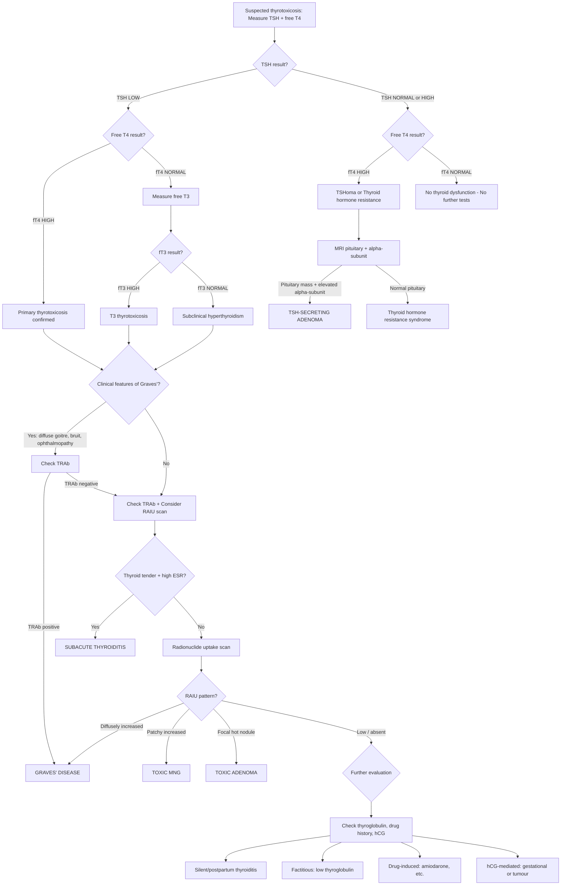
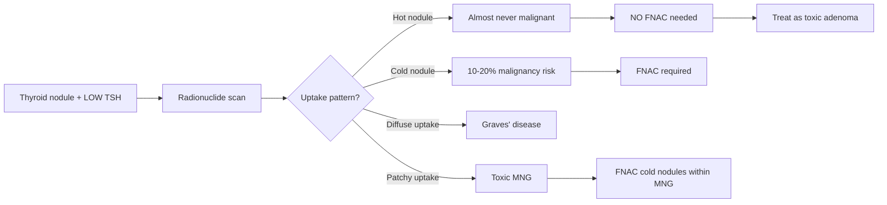

## Diagnostic Criteria and Algorithm

### "Diagnostic Criteria" — What Defines Hyperthyroidism Biochemically?

Unlike many conditions (e.g., diabetes with its HbA1c thresholds or rheumatoid arthritis with its classification criteria), hyperthyroidism doesn't have a formal "points-based" diagnostic criteria system. Instead, the diagnosis is **biochemical**, confirmed by a specific pattern on thyroid function tests (TFTs), combined with clinical context to determine the aetiology.

#### Biochemical Definitions

| Category | TSH | Free T4 | Free T3 | Clinical Significance |
|---|---|---|---|---|
| **Overt primary hyperthyroidism** | ***↓↓ (suppressed, typically < 0.1 mIU/L)*** | ***↑*** | ***↑*** | Full-blown thyrotoxicosis. Both synthesis pathways (T4 and T3) are in overdrive |
| **T3 thyrotoxicosis** | ***↓↓*** | ***Normal*** | ***↑*** | ***2–5% of hyperthyroid patients have ONLY elevated fT3*** [2]. Easy to miss if you don't check fT3. Common in early Graves' or toxic adenoma (preferential T3 secretion) |
| **Subclinical hyperthyroidism** | ***↓ (suppressed)*** | ***Normal*** | ***Normal*** | TSH suppressed but thyroid hormones haven't crossed upper limit yet. Still clinically significant — associated with AF, osteoporosis, cardiovascular mortality |
| **Secondary hyperthyroidism** | ***Normal or ↑ (inappropriately)*** | ***↑*** | ***↑*** | TSH is NOT suppressed despite high T4/T3 → ***TSH-secreting pituitary adenoma or thyroid hormone resistance syndrome*** [2] |

<Callout title="Why is TSH the single best screening test?">
TSH has a **log-linear relationship** with free T4 — even a small rise in free T4 produces a large fall in TSH. This amplification means TSH becomes abnormal BEFORE free T4 leaves the reference range, making it the earliest and most sensitive marker. ***TSH is the MOST sensitive indicator of thyroid function due to its short half-life*** — it reflects real-time pituitary sensing of circulating thyroid hormone [2].
</Callout>

<Callout title="Exam Pitfall: TSH Limitations" type="error">

***TSH should NOT be used as an isolated test*** in these situations [2]:

- **Suspected or known pituitary disease** — TSH may be normal despite central hypothyroidism or inappropriately normal in TSHoma.
- **↑ TSH alone may not necessarily indicate hypothyroidism** — recovery phase of sick euthyroid syndrome, adrenal insufficiency.
- **↓ TSH alone may not necessarily indicate hyperthyroidism** — ***first trimester of pregnancy (hCG stimulates TSH receptor by molecular mimicry)***, high-dose glucocorticoids, dopamine infusion, non-thyroidal illness [2].
</Callout>

---

### Why Measure Free T4 (not Total T4)?

***T3 and T4 are highly protein-bound*** (>99% bound to thyroxine-binding globulin [TBG], thyroxine-binding prealbumin [transthyretin], and albumin). Only the **free** fraction is biologically active [2].

***Total T3 or T4 are elevated when TBG is increased*** [2]:
- Pregnancy
- Oral contraceptives / oestrogen therapy
- Hepatitis (increased hepatic TBG synthesis)

***Total T3 or T4 are reduced when TBG is decreased*** [2]:
- Androgens
- Hypoalbuminaemia (nephrotic syndrome, liver disease)
- Glucocorticoids

***Free T3 and fT4 are normal in euthyroid patients with these conditions — hence free hormones are preferable over total thyroid hormones*** [2].

> In short: always request **free** T4 and **free** T3 — total values are misleading in any condition that alters binding protein levels.

---

### Why is fT3 Needed in Addition to fT4?

***Both fT3 and fT4 levels are required to determine subclinical or overt hyperthyroidism*** because ***2–5% of patients have ONLY elevated fT3 ("T3 thyrotoxicosis")*** [2]. This occurs because:
- In early Graves' disease and toxic adenoma, the hyperactive gland preferentially secretes T3 (which is 3–5× more biologically active).
- Peripheral conversion of T4→T3 is also upregulated.
- If you only check fT4, you'll miss these cases.

Conversely, in **hypothyroidism**, ***fT3 is NOT needed*** because fT3 can be normal in 25% of hypothyroid patients due to compensatory upregulation of deiodinase enzymes (adaptive peripheral T4→T3 conversion) [2].

---

## Master Diagnostic Algorithm

The diagnostic approach follows a systematic, stepwise algorithm. Let me walk through the logic:

### Step 1: Confirm Thyrotoxicosis Biochemically

***Measure TSH and free T4*** [2]. This is the starting point for every patient with suspected thyroid dysfunction.

### Step 2: Interpret the TSH/fT4 Pattern

Four possible patterns emerge:

| Pattern | TSH | fT4 | Next Step |
|---|---|---|---|
| **A** | ↓ | ↑ | **Primary thyrotoxicosis confirmed** → proceed to aetiological workup |
| **B** | ↓ | Normal | **Measure fT3** → if ↑: T3 thyrotoxicosis; if normal: subclinical hyperthyroidism |
| **C** | Normal or ↑ | ↑ | ***TSH-secreting pituitary adenoma or thyroid hormone resistance syndrome*** [2] |
| **D** | Normal | Normal | **No thyroid dysfunction** → no further tests needed |

### Step 3: Determine the Aetiology (for Patterns A and B)

This is where clinical assessment and targeted investigations come in:

1. ***Are there features of Graves' disease?*** (diffuse goitre, bruit, ophthalmopathy, dermopathy) → If yes, the diagnosis is likely **Graves' disease**. Confirm with **TRAb**.
2. If no Graves' features → ***Is there a nodular goitre or solitary nodule?*** → Consider **toxic MNG** or **toxic adenoma**. Confirm with ***radionuclide scan (scintigraphy)*** [1][2].
3. If radionuclide uptake is **low** → ***Destructive thyroiditis, iodine excess, or exogenous thyroid hormone*** [2].
4. If none of the above → ***Rule out other causes including stimulation by chorionic gonadotropin*** [2].

### Step 4: Special Investigation Based on Suspected Aetiology

- **TRAb positive** → Graves' disease (no further imaging needed for diagnosis)
- **RAIU scan** → Distinguishes Graves' (diffuse ↑) vs. TMNG (patchy ↑) vs. toxic adenoma (focal hot nodule) vs. thyroiditis (↓)
- **ESR markedly elevated + tender thyroid** → Subacute thyroiditis
- **Low thyroglobulin + low RAIU** → Factitious thyrotoxicosis
- **Inappropriately normal/high TSH** → MRI pituitary for TSHoma

---

### Complete Diagnostic Algorithm — Mermaid Diagram

[2]

---

## Investigation Modalities — Detailed Guide

### A. Biochemical Tests

#### 1. ***Thyroid Function Test (TFT)*** — TSH, fT4, fT3

This is the **foundation** of thyroid diagnosis.

| Test | What It Tells You | Key Interpretive Points |
|---|---|---|
| **TSH** | ***Most sensitive indicator*** of thyroid function [2] | Suppressed in primary thyrotoxicosis. Normal/elevated in TSHoma or resistance. ***Do NOT use TSH to monitor treatment response*** — it can remain suppressed for several months after starting ATDs. Use fT4/fT3 instead [2] |
| **Free T4** | Degree of thyrotoxicosis | Elevated in overt disease. Normal in T3 thyrotoxicosis and subclinical disease |
| **Free T3** | Catches T3 thyrotoxicosis | ***Needed because 2–5% have only elevated fT3*** [2]. Also useful to gauge severity — disproportionately elevated fT3 relative to fT4 suggests Graves' (preferential T3 secretion) |

<Callout title="Monitoring Pitfall" type="error">
***Do NOT use TSH level to monitor response to treatment since it can remain suppressed for several months*** after starting antithyroid drugs [2]. The pituitary thyrotrophs have been suppressed for so long that they take time to "wake up." Instead, monitor **fT4 and fT3** to assess response. TSH may take 6–8 weeks (or longer) to normalise.
</Callout>

#### 2. ***CBC with Differentials*** [2]

- **Baseline** before starting thionamides (carbimazole/methimazole, PTU).
- Why? Because thionamides can cause ***agranulocytosis*** (absolute neutrophil count < 500/μL) — a rare (0.1–0.5%) but potentially fatal adverse effect. You need a baseline WBC/neutrophil count to compare against.
- Thyrotoxicosis itself can cause mild neutropenia and relative lymphocytosis.

#### 3. ***LFT (Liver Function Tests)*** [2]

- **Baseline** before starting thionamides.
- Why? Thionamides can cause ***hepatotoxicity*** — PTU more so (hepatocellular pattern, can cause fulminant liver failure); carbimazole/methimazole (cholestatic pattern, usually milder).
- Graves' disease itself may cause mildly deranged LFTs (hepatic congestion from high-output state, or direct T3 effect on hepatocytes).

#### 4. ***Thyroid Antibodies*** [2]

Three key antibodies to know:

| Antibody | What It Detects | Clinical Utility |
|---|---|---|
| ***Thyrotropin receptor antibodies (TRAb / Anti-TSH receptor antibodies)*** | Autoantibodies that stimulate (TSI) or block the TSH receptor | **Diagnostic of Graves' disease** — positive in ***80–90%*** of Graves' [2]. Also used in pregnancy to assess risk of neonatal thyrotoxicosis (TRAb crosses placenta) |
| ***Anti-thyroid peroxidase (Anti-TPO) antibodies*** | Autoantibodies against TPO enzyme | ***50–80% positive in Graves'***; ***90–100% positive in Hashimoto's*** [2]. Present in 10–15% of normal population. Marker of autoimmune thyroid disease generally |
| ***Anti-thyroglobulin (Anti-TG) antibodies*** | Autoantibodies against thyroglobulin | ***50–70% positive in Graves'***; ***80–90% positive in Hashimoto's*** [2]. Important because they can interfere with thyroglobulin assays (relevant for thyroid cancer follow-up) |

**Interpretation summary table** [2]:

| | ***Anti-TSH (TRAb)*** | ***Anti-TPO*** | ***Anti-TG*** |
|---|---|---|---|
| ***Normal population*** | ***0%*** | ***10–15%*** | ***10–20%*** |
| ***Graves' disease*** | ***80–90%*** | ***50–80%*** | ***50–70%*** |
| ***Hashimoto's thyroiditis*** | ***10–20%*** | ***90–100%*** | ***80–90%*** |
| ***Multinodular goitre*** | ***10–20%*** | ***10–20%*** | ***30–40%*** |

> **Clinical pearl**: If you have classic clinical Graves' (diffuse goitre + bruit + ophthalmopathy) AND positive TRAb, you have your diagnosis and do NOT necessarily need a RAIU scan. TRAb is highly specific. However, if TRAb is negative and the diagnosis is unclear, RAIU scan becomes essential.

#### 5. Additional Biochemical Tests (Context-Dependent)

| Test | When to Order | Rationale |
|---|---|---|
| **ESR / CRP** | Painful thyroid | Markedly elevated in subacute (de Quervain's) thyroiditis. Normal in Graves'/TMNG |
| **Thyroglobulin** | Suspected factitious thyrotoxicosis | Low in exogenous T4 ingestion (gland suppressed). High/normal in all other causes |
| **Serum calcium** | All thyrotoxicosis, pre-operatively | Thyrotoxicosis increases bone turnover → mild hypercalcaemia in ~10%. Also baseline for post-surgical hypoparathyroidism risk |
| **hCG** | Pregnancy, suspected gestational thyrotoxicosis, young male with thyrotoxicosis | hCG cross-stimulates TSH receptor. Very high in molar pregnancy, choriocarcinoma, testicular GCT |
| **Serum calcitonin** | Suspected medullary thyroid carcinoma (MTC) | 95% of MTC produce calcitonin. NOT relevant for hyperthyroidism per se, but part of thyroid nodule workup |

---

### B. Radiological / Imaging Investigations

#### 1. ***Thyroid Ultrasound (USG)*** [1][2][7]

***USG is a routine investigation for all patients with a goitre or palpable thyroid nodule*** [1][7].

**Characteristics of USG:**
- ***Non-invasive, no radiation, convenient and cheap*** [1]
- ***Highly sensitive but relatively low specificity*** [1]

***Roles of thyroid USG*** [7]:
- ***Assess thyroid gland size*** (goitre)
- ***Assess nodules: number, size, and suspicious features***
- ***Assess cervical lymph nodes*** (especially deep nodes, e.g., level VI nodes)
- ***Assess retrosternal extension***
- ***Guide FNAC***
- ***Extend physical examination*** [1]
- ***NOT recommended as a screening test*** in the general population [1]

**USG Findings in Hyperthyroidism by Cause:**

| Cause | USG Findings |
|---|---|
| **Graves' disease** | Diffusely enlarged, hypoechoic gland ("thyroid inferno" on colour-flow Doppler = markedly increased vascularity). No discrete nodules |
| **Toxic MNG** | Multiple nodules of varying size, echogenicity, and cystic degeneration |
| **Toxic adenoma** | Single, well-defined nodule; may be hyper- or isoechoic; surrounding gland often atrophic |
| **Subacute thyroiditis** | Diffusely hypoechoic, heterogeneous; focal hypoechoic areas corresponding to inflammation. Reduced vascularity on Doppler |

***Sonographic features suspicious of malignancy*** (relevant when evaluating nodules found incidentally in hyperthyroid patients) — ***mnemonic: "SHIT CME"*** [7]:

- ***S = Solid nodule***
- ***H = Hypoechoic***
- ***I = Irregular margin***
- ***T = Taller than wide (AP > transverse)***
- ***C = Chaotic central vascularity***
- ***M = Microcalcifications***
- ***E = Extrathyroidal extension***

> ***Most important features: solid AND hypoechoic*** [7]

***Sonographic features of malignant lymph nodes*** [2]:
- ***Large > 2 cm***
- ***Roundish (taller than wide)***
- ***Heterogeneous hypoechoic***
- ***Loss of central fatty hilum***
- ***Presence of microcalcification***
- ***Intranodal cystic or coagulative necrosis***

**USG Risk Stratification for FNAC (ATA 2015 Guidelines):**

| ***Sonographic Pattern*** | ***USG Features*** | ***Risk of Malignancy*** | ***FNA Size Cut-off*** |
|---|---|---|---|
| ***High suspicion*** | ***Solid hypoechoic + ≥ 1 suspicious feature (microcalcifications, irregular margins, taller than wide, ETE, rim calcification with extrusive soft tissue)*** | ***> 70–90%*** | ***≥ 1 cm*** [2][7] |
| ***Intermediate suspicion*** | ***Hypoechoic solid nodule WITHOUT suspicious features*** | ***10–20%*** | ***≥ 1 cm*** [2][7] |
| ***Low suspicion*** | ***Isoechoic / hyperechoic solid nodule, or partially cystic with eccentric solid areas, WITHOUT suspicious features*** | ***5–10%*** | ***≥ 1.5 cm*** [2][7] |
| ***Very low suspicion*** | ***Partially cystic nodule without suspicious features, spongiform*** | ***≤ 3%*** | ***≥ 2 cm or observe*** [7] |
| ***Benign*** | ***Purely cystic nodules*** | ***≤ 1%*** | ***No biopsy*** [7] |

---

#### 2. ***Radionuclide Scan / Thyroid Scintigraphy*** [1][2][7]

**Isotopes used**: ***I-123, Tc-99m pertechnetate, or I-131*** [1]

***NOT recommended for routine diagnostic use*** [2]. This is important — you don't order a scan on everyone.

***Indications*** [2][7]:
1. ***Patient with a thyroid nodule AND suppressed TSH*** — to determine if the nodule is hyperfunctioning ("hot")
2. ***Differentiate between causes of thyrotoxicosis*** when clinical assessment and TRAb are inconclusive
3. ***Patient with MNG*** — to determine functional status of each nodule (which are hot, which are cold)
4. ***Differentiate toxic nodule (→ hemithyroidectomy) vs toxic MNG / Graves' (→ total thyroidectomy)*** [7]

***NOT performed when TSH is normal or elevated*** — because in a euthyroid or hypothyroid patient, a nodule will never be hyperfunctioning, and USG ± FNAC is the appropriate pathway [2].

**Interpretation:**

| ***Scan Pattern*** | ***Uptake*** | ***Diagnosis*** | ***Next Step*** |
|---|---|---|---|
| ***Diffusely increased uptake*** | High, uniform | ***Graves' disease*** [1] | TRAb confirmation; treat medically or RAI/surgery |
| ***Patchy / multifocal increased uptake*** | Heterogeneous | ***Toxic multinodular goitre*** [1] | Cold nodules in the MNG → FNAC |
| ***Single hot nodule with suppressed surrounding tissue*** | Focal high uptake | ***Toxic adenoma*** [1] | ***Hot nodules do NOT require FNAC*** [2] — treat as toxic adenoma |
| ***Low / absent uptake*** | Globally reduced | ***Thyroiditis, exogenous T4, iodine excess*** | ESR, thyroglobulin, drug history |
| ***Single cold nodule*** | Reduced focal uptake | Possible malignancy | ***Cold nodules have 10–20% risk of cancer → require FNAC*** [2] |

***Radio-isotope scintigraphy — diagnosis of malignancy: low sensitivity and specificity*** [1]. Its value is NOT in diagnosing cancer — it's in **functional assessment** of thyrotoxic patients.

<Callout title="Why do hot nodules NOT require FNAC?" type="idea">
Hot (hyperfunctioning) nodules are actively trapping iodine and producing thyroid hormone — this means they are well-differentiated, functional thyroid tissue. Cancer cells are typically poorly differentiated, lose iodine-trapping ability, and appear "cold." The risk of malignancy in a hot nodule is < 1%. Performing FNAC on a hot nodule wastes resources and can give misleading results (follicular cells from a functioning adenoma can look atypical).
</Callout>

---

#### 3. ***CT Scan / MRI*** [1][7]

***Not routine. Selective indications*** [7]:

1. ***Retrosternal goitre*** — USG cannot visualise below the thoracic inlet; CT delineates the retrosternal extent, relationship to great vessels, tracheal compression/deviation [7]
2. ***Locally advanced thyroid cancer*** — CT with contrast for better delineation of important structures within the cervical fascial planes (carotid sheath, oesophagus, trachea, recurrent laryngeal nerve involvement) [7]
3. **Surgical planning** for large goitres

> ***Retrosternal goitre requires CT because: (1) Cannot be visualised by USG, (2) Surgical planning, (3) Retrosternal goitre may be malignant*** [7]

**Caution**: Iodinated CT contrast can exacerbate thyrotoxicosis (Jod-Basedow) or interfere with subsequent RAI therapy (saturates iodine stores). Must wait ≥ 4–6 weeks after iodinated contrast before RAI therapy or RAIU scan.

#### 4. ***PET Scan*** [1][7]

***PET CT has NO diagnostic role in thyroid diseases — even malignant nodules can have low uptake*** [7].

- PET incidentalomas (incidentally found thyroid uptake on PET) do warrant workup (thyroid FDG uptake has ~30–50% malignancy rate), but PET is NOT ordered primarily to evaluate thyroid pathology.

#### 5. ***CXR (Thoracic Inlet View)*** [1]

- Assess tracheal deviation/compression from goitre
- Evaluate for retrosternal extension
- Baseline before RAI therapy or surgery

#### 6. ***Endoscopy (Laryngoscopy)*** [1]

- ***Pre-operative vocal cord assessment*** — flexible nasopharyngoscopy to document baseline vocal cord function before thyroid surgery. If a patient already has vocal cord paralysis pre-operatively (from tumour invasion of RLN), the surgeon must know to preserve the contralateral nerve.

---

### C. ***FNAC (Fine Needle Aspiration Cytology)*** [1][2][7]

***FNAC is a routine investigation*** for thyroid nodules meeting certain criteria [1].

**Key principle**: ***Core needle biopsy is NOT performed*** on the thyroid because it can lead to ***massive bleeding*** (thyroid is extremely vascular) and ***FNAC is very accurate*** in identifying thyroid cancer types [2].

***FNAC is both diagnostic and therapeutic for thyroid cysts*** [7] — aspiration collapses the cyst.

***Indications for FNAC*** [2]:
- Nodules meeting ***sonographic criteria for FNA*** (see USG risk stratification table above)
- ***Hypofunctioning ("cold") nodules*** on scintigraphy
- ***Dominant or atypical nodule*** in a multinodular goitre
- ***Nodules associated with abnormal lymph nodes***
- ***Complex or recurrent cystic nodules***

***NOT indicated***:
- ***Hot nodules*** on scintigraphy (almost never malignant)
- Purely cystic nodules (benign, ≤ 1% malignancy)

**Limitation**: ***Cannot distinguish follicular adenoma from follicular carcinoma*** — because the distinction requires demonstration of capsular/vascular invasion on histology, which FNAC (cytology only) cannot assess. This is why Bethesda Class IV ("follicular neoplasm") requires surgical excision (lobectomy) for definitive diagnosis [7].

***Complications of FNAC***: ***pain, bleeding, false negative*** [7]

---

### D. ***Bethesda Classification System*** — Cytology Reporting [2][7]

***The Bethesda System for Reporting Thyroid Cytopathology*** standardises FNAC results into 6 categories with corresponding malignancy risk and recommended management:

| ***Class*** | ***Diagnostic Category*** | ***Cancer Risk*** | ***Recommended Management*** |
|---|---|---|---|
| ***I*** | ***Non-diagnostic / Unsatisfactory*** | ***1–4%*** | ***Repeat FNA*** (under USG guidance) |
| ***II*** | ***Benign*** | ***0–3%*** | ***Clinical follow-up*** (repeat USG in 12–24 months) |
| ***III*** | ***Atypia of Undetermined Significance (AUS) OR Follicular Lesion of Undetermined Significance (FLUS)*** | ***5–15%*** | ***Repeat FNA*** (consider molecular testing if available) |
| ***IV*** | ***Follicular Neoplasm / Suspicious for Follicular Neoplasm*** | ***15–30%*** | ***Surgical lobectomy*** (need histology to distinguish adenoma from carcinoma) |
| ***V*** | ***Suspicious for Malignancy*** | ***60–75%*** | ***Surgical lobectomy ± frozen section → total thyroidectomy*** |
| ***VI*** | ***Malignant*** | ***97–99%*** | ***Total thyroidectomy*** (± neck dissection) |

[1][2][7]

> ***Note: Bethesda Class III "atypia" is a morphological description rather than a premalignant lesion*** [7]. It represents indeterminate cytology that doesn't fit neatly into benign or suspicious categories.

***Approach to multiple nodules*** [7]:
- ***Malignancy risk is much lower*** in multinodular goitres
- ***USG: assess each nodule separately***
- ***FNAC decision depends on USG result***:
  - ***If no suspicious nodules → FNA the largest nodule***
  - ***If any suspicious nodules → FNA all suspicious nodules***

---

### E. Summary: ***Routine vs. Selective Investigations*** [7]

| | ***Routine*** | ***Selective*** |
|---|---|---|
| ***History + Physical exam*** | ***✓*** | |
| ***Thyroid function test*** | ***✓*** | |
| ***USG thyroid ± FNAC*** | ***✓*** | |
| ***Thyroid scan*** | ***✗*** | ***Only in toxic (suppressed TSH) + nodules*** [7] |
| ***CT scan*** | ***✗*** | ***Only when (1) retrosternal goitre or (2) locally advanced thyroid cancer*** [7] |
| ***PET scan*** | ***✗*** | ***NO diagnostic role at all*** [7] |

---

### F. Specific Investigations for Graves' Ophthalmopathy

***Graves' ophthalmopathy is graded using the "NO SPECS" scoring system*** [2]:

| ***Grade*** | ***Category*** | ***Features*** |
|---|---|---|
| ***0*** | ***No signs and symptoms*** | — |
| ***1*** | ***Only signs, no symptoms*** | ***Lid retraction and lid lag (result of excess sympathetic activity — not specific to Graves')*** → staring appearance [2] |
| ***2*** | ***Soft tissue involvement*** | ***Periorbital oedema*** |
| ***3*** | ***Proptosis*** | ***Best detected by visualising sclera between lower border of iris and lower eyelid*** [2] |
| ***4*** | ***Extraocular muscle involvement*** | ***Diplopia/ophthalmoplegia — inferior rectus affected first, then goes anticlockwise (IR → MR → SR → LR)*** [2] |
| ***5*** | ***Corneal involvement*** | ***Corneal ulceration, scleral injection, chemosis, conjunctivitis*** |
| ***6*** | ***Sight loss*** | ***Compression of CN II → papilloedema, peripheral field defects, blindness*** [2] |

**Investigations for ophthalmopathy**: CT or MRI orbits (shows enlarged extraocular muscles, proptosis, increased retro-orbital fat), visual acuity and colour vision testing, formal perimetry, Hertel exophthalmometry.

---

<Callout title="High Yield Summary">

**Diagnosis of Hyperthyroidism — Key Exam Points:**

1. ***TSH is the single most sensitive screening test.*** Suppressed TSH = suspect primary hyperthyroidism. Normal/high TSH with elevated fT4 = TSHoma or resistance.

2. ***Always measure BOTH fT4 AND fT3*** — 2–5% have only elevated fT3 ("T3 thyrotoxicosis").

3. ***Measure FREE (not total) T4*** — total T4 is misleading when binding proteins are altered (pregnancy, OCP, hypoalbuminaemia).

4. ***Do NOT use TSH to monitor treatment*** — it remains suppressed for months. Use fT4/fT3 instead.

5. ***TRAb is 80–90% sensitive for Graves'*** and is the key serological differentiator.

6. ***RAIU scan is NOT routine*** — indicated ONLY when TSH is suppressed AND you need to distinguish the cause (especially Graves' vs TMNG vs toxic adenoma vs thyroiditis).

7. ***Hot nodules do NOT require FNAC*** (< 1% malignancy). ***Cold nodules require FNAC*** (10–20% malignancy risk).

8. ***Routine investigations***: TFT + USG thyroid ± FNAC. ***Selective***: thyroid scan, CT, PET (PET has NO diagnostic role).

9. ***Bethesda system***: 6 categories. Class IV (follicular neoplasm) requires lobectomy because FNAC cannot distinguish follicular adenoma from carcinoma (needs capsular/vascular invasion on histology).

10. ***Pre-ATD baseline***: Always check CBC (agranulocytosis risk) and LFT (hepatotoxicity risk) before starting thionamides.

</Callout>

---

<ActiveRecallQuiz
  title="Active Recall - Diagnosis of Hyperthyroidism"
  items={[
    {
      question: "A patient has suppressed TSH but normal free T4. What is your next step, and what two diagnoses could this represent?",
      markscheme: "Next step: measure free T3. If fT3 is elevated: T3 thyrotoxicosis (2-5% of hyperthyroid patients have only elevated fT3). If fT3 is also normal: subclinical hyperthyroidism."
    },
    {
      question: "Why should you measure free T4 rather than total T4 in evaluating thyroid function? Give two clinical scenarios where total T4 would be misleadingly elevated.",
      markscheme: "T3/T4 are highly protein-bound to TBG. Total T4 reflects both bound and free fractions and is affected by TBG levels. Total T4 is misleadingly elevated in pregnancy (increased TBG from oestrogen effect) and in patients on oral contraceptives/oestrogen therapy (increased TBG). Free T4 reflects the biologically active fraction and is unaffected by TBG changes."
    },
    {
      question: "A thyroid nodule is found in a patient with suppressed TSH. What investigation should be performed before FNAC, and what finding would make FNAC unnecessary?",
      markscheme: "Perform radionuclide scan (thyroid scintigraphy) first. If the nodule is hot (hyperfunctioning, uptake greater than surrounding tissue), it is almost never malignant (less than 1% cancer risk) and does NOT require FNAC. Only cold nodules (10-20% malignancy risk) require FNAC."
    },
    {
      question: "List the mnemonic for sonographic features suspicious of thyroid malignancy on USG and state which two features are most important.",
      markscheme: "SHIT CME: Solid, Hypoechoic, Irregular margin, Taller than wide, Chaotic central vascularity, Microcalcifications, Extrathyroidal extension. The two most important features are Solid and Hypoechoic."
    },
    {
      question: "A Bethesda Class IV (follicular neoplasm) result on FNAC requires surgical lobectomy rather than repeat FNA. Explain why FNAC alone cannot make the definitive diagnosis.",
      markscheme: "FNAC provides cytology only. The distinction between follicular adenoma (benign) and follicular carcinoma (malignant) requires demonstration of capsular or vascular invasion, which can only be assessed on histological examination of the excised specimen. Therefore, surgical lobectomy is needed for definitive diagnosis."
    },
    {
      question: "Before starting a patient on carbimazole for Graves disease, what two baseline blood tests must you order and why?",
      markscheme: "1) CBC with differentials: baseline because carbimazole can cause agranulocytosis (rare but potentially fatal). 2) LFT: baseline because thionamides can cause hepatotoxicity (PTU causes hepatocellular damage; carbimazole/methimazole causes cholestatic pattern)."
    }
  ]}
/>

---

## References

[1] Lecture slides: GC 177. A thyroid nodule benign thyroid nodules; thyroid cancer.pdf (p7, p8, p12, p13)
[2] Senior notes: felixlai.md (Sections V–VII: Diagnosis, Treatment, Case Study; thyroid antibody table; Bethesda classification; radionuclide scan indications; TFT interpretation)
[7] Senior notes: maxim.md (Approach to thyroid nodules: investigations, USG features, FNAC indications, thyroid scan, CT/PET roles, Bethesda classification, SHIT CME mnemonic)
