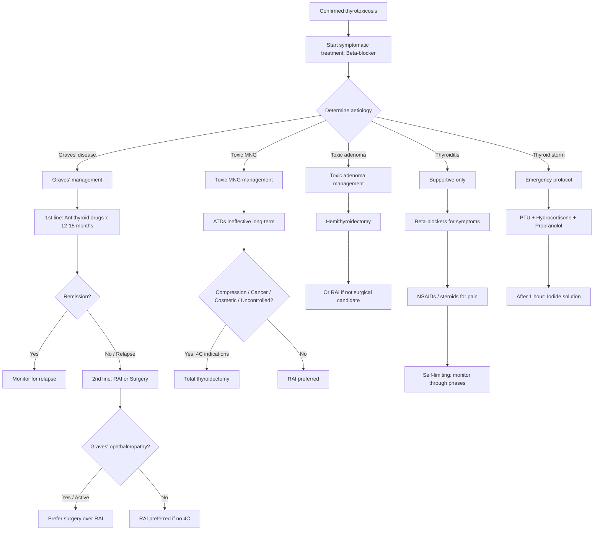

## Management of Hyperthyroidism

### Guiding Principles

Before diving into specifics, let's understand the framework. Managing hyperthyroidism involves **three layers**:

1. **Immediate symptomatic relief** — beta-blockers (works within hours to days)
2. **Definitive treatment of the underlying cause** — antithyroid drugs (ATDs), radioactive iodine (RAI), or surgery (the "Big Three")
3. **Emergency management** — thyroid storm (a medical emergency)

The choice among the Big Three depends on the **aetiology**, **severity**, **patient factors** (age, pregnancy, comorbidities), and **patient preference**. There is no single "best" treatment — it's a discussion.

---

### Management Algorithm Overview

[2][7]

---

### Layer 1: Immediate Symptomatic Treatment — Beta-Blockers

**Why beta-blockers?** Thyroid hormones upregulate β-adrenergic receptors, amplifying the effect of circulating catecholamines. Beta-blockers directly counteract this — they don't affect thyroid hormone levels but dramatically improve symptoms.

| Drug | Dose | Key Points |
|---|---|---|
| ***Propranolol*** | ***40 mg TDS*** [7] | The classic choice. Non-selective β-blocker. **Additional benefit**: ***blocks peripheral conversion of T4→T3*** (unique among beta-blockers — inhibits type 1 deiodinase). ***Provides more rapid clinical response (days instead of weeks)*** compared to ATDs alone [7]. ***Continue propranolol until 7 days post-op*** because T4 levels remain high immediately after surgery [7] |
| Atenolol | 50–100 mg OD | Selective β1-blocker. Useful when propranolol is contraindicated (e.g., asthma — but even atenolol should be used cautiously in severe asthma) |
| ***Diltiazem*** | Variable | ***Consider if β-blockers are contraindicated*** (e.g., severe asthma, decompensated heart failure) [2]. Non-dihydropyridine calcium channel blocker that controls heart rate |

<Callout title="Why propranolol specifically?">
All beta-blockers reduce heart rate and tremor. But propranolol has a unique pharmacological advantage: it inhibits the type 1 deiodinase enzyme that converts T4→T3 peripherally. Since T3 is 3–5× more active than T4, blocking this conversion provides additional clinical benefit beyond simple β-blockade. This is why propranolol is preferred over atenolol in thyrotoxicosis.
</Callout>

---

### Layer 2: Definitive Treatment — The Big Three

#### A. ***Thionamides (Antithyroid Drugs / ATDs)*** [2]

**Drugs**: ***Carbimazole*** (prodrug, converted to methimazole in vivo) / ***Methimazole*** / ***Propylthiouracil (PTU)***

**Etymology**: "Thio-" = sulphur (these drugs contain a thioureylene group); "-namide" = amide derivative

***Mechanism of action*** [2]:
1. ***Inhibit the action of thyroid peroxidase (TPO)***:
   - ***Inhibit iodination (organification) of tyrosine residues*** on thyroglobulin
   - ***Inhibit coupling of iodotyrosines*** (MIT+DIT→T3, DIT+DIT→T4)
   - Net effect: ***block production of T3 and T4***
2. ***PTU additionally inhibits peripheral conversion of T4→T3*** (via type 1 deiodinase inhibition) — this makes PTU the preferred drug in **thyroid storm** and **first trimester of pregnancy**

**Why is onset slow?** ***The thyroid gland stores 2–3 months' worth of preformed hormone***. ATDs block *new* synthesis but don't affect the already-stored hormone. ***Onset of euthyroid takes 3–4 weeks since the thyroid gland has a large storage of hormones that need to be depleted before manifestation of drug effects*** [2].

***Treatment protocol*** [2]:
- ***High dose initially*** (e.g., carbimazole 30–40 mg/day) to block synthesis quickly
- ***Reduction of dose when patient becomes euthyroid*** (e.g., carbimazole 5–15 mg/day maintenance)
- ***Therapy given for 12–18 months*** [2]
- Two strategies:
  - **Titration regimen** ("dose-adjust"): Start high, reduce to lowest dose that maintains euthyroidism. Fewer side effects.
  - **Block-and-replace regimen**: High-dose ATD (blocks all synthesis) + levothyroxine replacement simultaneously. Advantage: more stable TFTs. Disadvantage: higher drug dose → more side effects.

***Indications*** [2]:
- ***Children***
- ***Pregnancy*** (PTU in first trimester; carbimazole/methimazole in 2nd/3rd trimester)
- ***Mild disease***
- ***First-line for Graves' disease*** [7]
- Patients who prefer non-invasive treatment
- Bridge to RAI or surgery

***Adverse effects*** [2]:

| Adverse Effect | Frequency | Mechanism / Details |
|---|---|---|
| ***Skin rash / urticaria / pruritus*** | ***~5%*** | ***Allergic reaction — triggers histamine release. Treated with antihistamine*** [2] |
| ***Fever*** | Uncommon | Hypersensitivity |
| ***Arthritis / arthralgia*** | Uncommon | Immune-mediated |
| ***Agranulocytosis*** | ***0.1–0.5%*** | ***Occurs within the first 2–3 months of treatment*** [2]. Idiosyncratic, dose-related for methimazole. Potentially fatal — patients must be educated to **stop the drug immediately and present for urgent FBC** if they develop fever, sore throat, or mouth ulcers |
| ***Hepatotoxicity*** | Rare | PTU → hepatocellular necrosis (can be fulminant — why PTU is used only in 1st trimester, not long-term). Carbimazole/methimazole → cholestatic pattern (usually milder) |

> ***Baseline CBC with differentials and LFT must be checked before starting thionamides*** [2] — to detect pre-existing cytopaenias or liver disease, and to have a comparison point if toxicity develops.

<Callout title="Carbimazole vs. PTU — When to Use Which?" type="idea">

| Scenario | Drug of Choice | Reason |
|---|---|---|
| **Standard Graves' treatment** | Carbimazole/methimazole | Once-daily dosing, better compliance, lower hepatotoxicity risk |
| **1st trimester of pregnancy** | PTU | Methimazole is associated with rare embryopathy (aplasia cutis, choanal/oesophageal atresia). PTU crosses placenta less |
| **2nd/3rd trimester of pregnancy** | Switch to carbimazole | PTU has higher risk of hepatotoxicity with prolonged use |
| **Thyroid storm** | PTU | Additional benefit of blocking peripheral T4→T3 conversion |
| **Cross-reactivity allergy** | ~30% cross-react between carbimazole and PTU. If severe allergy to one, the other may also cause reactions — consider RAI or surgery |

</Callout>

***Relapse rate***: ***High — approximately 70% relapse after 1 year of stopping ATDs*** [2]. This is because ATDs do not address the underlying autoimmune process (TRAb production continues). Favourable prognostic factors for sustained remission: small goitre, mild disease, declining TRAb levels during treatment, short duration of disease.

---

#### B. ***Radioactive Iodine (RAI / I-131)*** [2]

**How it works**: ***I-131 is taken up and processed by the thyroid gland in the same way as normal iodide*** — via the sodium-iodide symporter (NIS). ***Its specificity to the thyroid is due to preferential thyroid uptake via the Na-I cotransporter*** [2]. Once inside follicular cells, ***it becomes incorporated into thyroglobulin*** and ***emits β-radiation*** locally → ***destruction of thyroid gland through necrosis of follicular cells*** [2]. The β-particles have a short range (~2 mm), so damage is confined to the thyroid with minimal systemic radiation.

***Indications*** [2][7]:
- ***Refractory to antithyroid medications***
- ***Relapse after ATD course*** (most common scenario)
- ***2nd-line for Graves' disease*** [7]
- ***Preferred for toxic MNG if no 4C indications*** [7]
- ***Ablation of residual tumour tissue after thyroidectomy*** (for thyroid cancer — different context)
- ***Refused surgery / poor surgical candidate***

***Contraindications*** [2]:
- ***Pregnancy and lactation*** — ***damage to fetal thyroid gland*** (fetal thyroid concentrates iodine from ~12 weeks gestation); ***secreted in breastmilk*** [2]
- ***Children and adolescents*** — ***avoid potential teratogenicity in young age*** [2]
- **Active Graves' ophthalmopathy** — RAI can worsen eye disease (proposed mechanism: release of thyroid antigens from destroyed gland → immune flare → orbital inflammation). If RAI is necessary in a patient with mild/inactive ophthalmopathy, steroid cover is given.
- **Very large goitre** (poor response; may need surgery instead)
- **Suspected thyroid malignancy** (need histological diagnosis first)

***Important reassurances for patients*** [2]:
- ***NO effect on fertility***
- ***NO effect on congenital malformations*** in future offspring
- ***NO increased cancer risk*** in offspring

***Preparation and precautions for I-131 therapy*** [2]:

**Before RAI:**
- ***Discussion of treatment options and patient consent***
- ***Instruct patients on post-therapy precautions and follow-ups***
- ***Avoid iodine-containing food, medicine (cough suppressants with iodine), or radiological contrast for ≥ 4 weeks*** before RAI — excess stable iodine competes with I-131 for uptake, reducing efficacy
- ***Avoid antithyroid medications for ≥ 4 weeks*** before RAI — ATDs reduce iodine organification, which reduces I-131 retention in the gland
- ***Symptomatic control of hyperthyroidism by propranolol*** during the waiting period
- ***Pregnancy test for patients with child-bearing potential***

**After RAI:**
- ***Symptomatic control of hyperthyroidism by propranolol*** (RAI takes 2–3 months to work)
- ***Discharge home immediately and avoid close contact with others*** (radiation precautions for ~1–2 weeks depending on dose)
- ***Safe contraception for ≥ 6 months***
- ***Avoid pregnancy and breastfeeding for ≥ 6 months*** [2]

***Adverse effects / Complications*** [2]:
- ***Hypothyroidism***:
  - ***Transient: 3.5–28%***
  - ***Permanent: 10–15% in the first 2 years, then 3% per year*** thereafter [2]
  - ***Due to late effects of radiation and lymphocytic infiltration and destruction of thyroid tissue*** [2]
  - ***Requires lifelong T4 replacement*** eventually in most patients
- Radiation thyroiditis (transient worsening of thyrotoxicosis 1–2 weeks post-RAI due to release of stored hormone from damaged follicles)
- Sialadenitis (salivary gland inflammation — salivary glands also have NIS)
- Theoretical concern about worsening Graves' ophthalmopathy (mitigated by steroid prophylaxis)

***Onset of therapeutic effect***: ***Months (2–3 months)*** [2]. This is why beta-blockers are essential during the interim.

---

#### C. ***Surgery (Thyroidectomy)*** [2][7]

***Indications for thyroidectomy*** — commonly remembered as ***"4C"*** [7]:

| ***Indication*** | ***Explanation*** |
|---|---|
| ***CA thyroid (Cancer)*** | Malignancy confirmed or highly suspected on FNAC |
| ***Uncontrolled thyrotoxicosis (Cannot control)*** | ***Refractory to antithyroid medications, refused RAI*** [2], or need for rapid definitive control |
| ***Compression*** | ***Obstructive goitre*** — dysphagia, stridor, tracheal deviation, retrosternal extension [1][2] |
| ***Cosmetic concern*** | Large visible goitre causing distress to the patient [1] |

Additional indications [2]:
- ***Pregnant women intolerant to antithyroid medications***
- ***Thyroid-eye signs (active Graves' ophthalmopathy)*** — surgery preferred over RAI because RAI can worsen ophthalmopathy [2]
- ***Multinodular goitre*** (regardless of thyroid status, if compression/cancer concern) [2]

***Extent of resection*** [7]:

| ***Condition*** | ***Solitary Nodule*** | ***Multinodular*** |
|---|---|---|
| ***Euthyroid*** | ***Observe; Hemithyroidectomy if 4C*** | ***Observe; Total thyroidectomy if 4C*** |
| ***Hyperthyroid*** | ***Hemithyroidectomy*** | ***Total thyroidectomy*** |

[7]

Specifically for thyrotoxicosis [7]:
- ***Graves' disease***: ***Total thyroidectomy recommended*** (preferred over subtotal) [7]
- ***Toxic MNG***: ***Total thyroidectomy*** [7]
- ***Toxic adenoma***: ***Hemithyroidectomy*** (if no evidence of nodules in contralateral lobe) [7]

***Why total thyroidectomy for Graves' rather than subtotal?*** [7]:

| Feature | ***Total Thyroidectomy*** | Subtotal Thyroidectomy |
|---|---|---|
| Return to euthyroid | ***Immediate*** | Variable duration |
| Risk of recurrence | ***None*** | 5–20% (residual tissue still has TRAb stimulation) |
| Risk of thyroid failure | ***100% (lifelong T4 replacement)*** | Lower but still significant |
| Risk of parathyroid injury | ***Higher*** | Lower |
| Risk of RLN injury | ***Higher*** | Lower |

> The trade-off is clear: total thyroidectomy eliminates recurrence risk entirely but commits the patient to lifelong levothyroxine and carries higher surgical morbidity. In experienced hands, complication rates are low, making total thyroidectomy the preferred choice [7].

***Surgical types — Terminology*** [7]:
- ***Total thyroidectomy***: resection of both lobes + isthmus + pyramidal lobe
- ***Subtotal thyroidectomy***: resection of > 1/2 of both lobes + isthmus (***rarely indicated*** [1])
- ***Hemithyroidectomy***: resection of one lobe + isthmus
- ***Lobectomy***: resection of one lobe (isthmus preserved)

***For benign thyroid nodules*** (non-toxic) [1]:
- ***Unilateral lobectomy (hemithyroidectomy)***: ***for uninodular goitre — safe, minimal morbidities, diagnosis and cure, future reoperation on contralateral lobe without difficulty. Around 10–20% chance of hypothyroidism*** [1]
- ***Total/near-total thyroidectomy***: ***for symptomatic multinodular goitre — no recurrence/need for reoperation, additional surgical risk (hypoparathyroidism), needs long-term thyroxine replacement*** [1]
- ***Partial or bilateral subtotal thyroidectomy***: ***rarely indicated*** [1]

***Mechanism***: ***Removal of the thyroid gland to lower thyroid hormone level*** [2]. Straightforward — physically remove the source.

***Complications of thyroid surgery*** [2]:

| Complication | Mechanism | Prevention/Management |
|---|---|---|
| ***Hypoparathyroidism*** | Inadvertent removal or devascularisation of parathyroid glands (they're tiny, ~5 mm, on the posterior thyroid surface) → hypocalcaemia | Pre-op calcium/vitamin D supplementation. Post-op: monitor Ca²⁺. Treat with IV calcium gluconate if symptomatic (Chvostek's/Trousseau's sign) |
| ***Vocal cord paralysis*** | Injury to ***recurrent laryngeal nerve (RLN)*** → unilateral: hoarseness; bilateral: airway obstruction | Pre-op laryngoscopy to document baseline vocal cord function. Meticulous surgical technique. Intraoperative nerve monitoring |
| ***Thyroid storm*** | Manipulation of gland during surgery → massive hormone release into circulation | ***Patients should be brought to euthyroid before surgery*** [2] |
| ***Haemorrhage*** | Thyroid is highly vascular. Post-op haematoma can compress trachea → airway compromise | ***Hemorrhage — compression and oedematous effect compresses on trachea*** [2]. Emergency: open wound at bedside, evacuate haematoma |
| ***Hypothyroidism*** | Loss of functioning thyroid tissue | Planned: T4 replacement after total thyroidectomy. Monitor TSH at 6 weeks post-hemi |
| ***Wound infection*** | Any surgical wound | Standard aseptic technique |
| Hungry bone syndrome | Sudden removal of PTH/thyroid hormone effect → massive calcium influx into bones → severe hypocalcaemia | Pre-op calcium/vitamin D supplementation |

---

### ***Pre-operative Preparation in Thyrotoxic Patients Undergoing Thyroid Surgery*** [7]

This is **critically important** and frequently tested. Operating on a thyrotoxic patient risks precipitating a **thyroid storm**.

***Goal: Maintain biochemically euthyroid at operation to prevent thyroid storm*** [7]:

1. ***High-dose carbimazole (30–40 mg/day) for 8–12 weeks***, then ***low dose (15 mg/day) to maintain euthyroid*** [7]

2. ***Propranolol (40 mg TDS)***: ***blocks beta receptors + reduces T4→T3 conversion*** [7]
   - ***Provides more rapid clinical response (days instead of weeks)*** [7]
   - ***T4 level is still high post-op → continue propranolol until 7 days post-op*** [7]

3. ***Lugol's iodine***: ***decreases iodine uptake + decreases vascularity of thyroid gland (decreases intra-operative bleeding)*** [7]
   - ***Can be given with carbimazole/beta-blocker for 10 days before operation*** [7]
   - Mechanism: The Wolff-Chaikoff effect — acute iodine excess transiently inhibits organification and hormone release. Additionally, excess iodine reduces thyroid blood flow.

4. ***Monitor Ca and vitamin D level and supplement accordingly*** (for post-op hypoPTH/hungry bone syndrome) [7]

5. ***Vocal cord function by laryngoscopy*** [7] — document baseline before surgery

<Callout title="Why Lugol's Iodine BEFORE Surgery?">
Lugol's iodine (potassium iodide + iodine) serves a dual purpose pre-operatively: (1) it exploits the **Wolff-Chaikoff effect** — flooding the gland with iodine transiently inhibits hormone synthesis and release; (2) it reduces thyroid vascularity, making the gland less engorged and easier/safer to operate on with less bleeding. It is given for **10 days** before surgery. It is NOT given alone (must be combined with ATDs) because the Wolff-Chaikoff effect is temporary and the gland can "escape" — resuming hormone production despite excess iodine.
</Callout>

---

### Management by Aetiology — Summary

#### ***Graves' Disease*** [2][7]

| Line | Treatment | Details |
|---|---|---|
| ***1st line*** | ***Antithyroid drugs*** | ***Carbimazole 12–18 months. ~30% achieve sustained remission. ~70% relapse*** [2][7] |
| ***2nd line*** | ***RAI*** | ***Preferred if no active ophthalmopathy and no 4C*** [7]. Steroid cover for mild/inactive eye disease |
| ***2nd line*** | ***Surgery (total thyroidectomy)*** | ***Preferred if 4C present or active Graves' ophthalmopathy*** [7] |

#### ***Toxic MNG*** [7]

| Line | Treatment | Details |
|---|---|---|
| ATDs | ***Ineffective long-term*** | ***Recur upon discontinuation*** [7]. Can be used for ***prolonged course if patient does not want RAI or surgery*** |
| ***Preferred*** | ***RAI*** | ***Preferred if no 4C*** [7] |
| ***Preferred*** | ***Surgery (total thyroidectomy)*** | ***Preferred if 4C*** [7] |

> ***Why are ATDs ineffective for toxic MNG?*** Because TMNG is caused by autonomous somatic mutations in the TSH receptor — there is no autoimmune process to "burn out." Unlike Graves' (where TRAb may fluctuate and remission can occur), the autonomous nodules never stop producing. ATDs mask the problem but don't fix it. Stop the drug, and the thyrotoxicosis returns.

#### ***Toxic Adenoma*** [7]

- ***Hemithyroidectomy*** — removes the single autonomous nodule, preserves the contralateral lobe [7]
- Alternative: RAI (if not surgical candidate)
- ATDs: temporary bridge only

#### ***Subacute Thyroiditis***

- **No ATDs** (gland is not overproducing — it's leaking)
- Beta-blockers for symptomatic relief
- NSAIDs for mild pain; **prednisolone** for severe pain/inflammation
- Self-limiting: thyrotoxic phase → hypothyroid phase → recovery

#### ***Subclinical Hyperthyroidism***

Treat if:
- TSH persistently < 0.1 mIU/L
- Age > 65 (risk of AF, osteoporosis)
- Presence of symptoms, AF, osteoporosis, or cardiac risk factors
- Postmenopausal women (osteoporosis risk)

Otherwise: monitor with serial TFTs every 3–6 months.

---

### Comparison of the Three Definitive Treatments [2]

| Feature | ***Surgery*** | ***Antithyroid Drugs*** | ***RAI (I-131)*** |
|---|---|---|---|
| ***Relapse rate*** | ***Low*** | ***High (70% after 1 year)*** | ***Low / Intermediate*** |
| ***Risk of hypothyroidism*** | ***Intermediate / High*** | ***Low*** | ***Intermediate / High (10–15% in first 2 years, 3%/year thereafter)*** |
| ***Other long-term complications*** | ***Significant morbidity*** (RLN, hypoPTH) | ***Rare*** | ***Rare*** |
| ***Ease of treatment and cost*** | ***Intermediate*** | ***Least favourable*** (long-term compliance) | ***Simple and easy*** |
| ***Onset of therapeutic effect*** | ***Immediate*** | ***Days / Weeks*** | ***Months (2–3 months)*** |

[2]

---

### ***Nonsurgical Ablative Treatment*** [1]

This is an emerging option for selected patients:

- ***Volume reduction rate (VRR): 50–80%*** [1]
- ***Patient selection***: ***symptomatic / single / hyperfunctioning nodule; < 4 cm or < 20 mL / growth on sonogram; benign (FNAC ×2); motivated patients*** [1]
- ***Expectations***: ***preserve function, minimally invasive, avoiding GA, day procedure, scarless, cosmetic outcome*** [1]
- ***Limitations***: ***not cure, unsatisfactory shrinkage, regrowth, additional procedure, risk unique to ablation, expense*** [1]
- Modalities include: radiofrequency ablation (RFA), laser ablation, ethanol ablation (for cysts), high-intensity focused ultrasound (HIFU)

---

### Layer 3: ***Emergency Management — Thyroid Storm*** [2]

***Thyroid storm (thyrotoxic crisis)*** is a life-threatening, decompensated thyrotoxicosis with multi-organ dysfunction.

***Pathophysiology*** [2]:
- ***Develops in patients with longstanding untreated hyperthyroidism precipitated by an acute event*** such as ***surgery, trauma, or infection***
- ***Rapid increase in serum thyroid hormone levels*** → ***increased response to sympathetic inputs from catecholamines (adrenaline/noradrenaline) by permissive effect***
- ***Leads to cardiovascular symptoms including hyperpyrexia, tachycardia, hypertension, followed by heart failure with hypotension and arrhythmia*** [2]

**Diagnosis**: Clinical — use the **Burch-Wartofsky Point Scale (BWPS)** (scores > 45 highly suggestive of thyroid storm). Based on: temperature, CNS effects, GI-hepatic dysfunction, tachycardia, heart failure, AF, precipitant history.

***General measures*** [2]:
- ***Correction of hyperthermia with paracetamol (NOT salicylate) and physical cooling*** [2]
  - **Why NOT salicylate (aspirin)?** Salicylates displace T4 from TBG → increase free T4 → worsen thyrotoxicosis
- ***Correction of dehydration with IV fluid replacement***
- ***Supportive therapy: O₂ supplementation, digoxin or diuretics for congestive heart failure and AF*** [2]
- Treat the precipitant (antibiotics for infection, etc.)

***Medical treatment*** [2]:

**Step 1 — Initial regimen (given simultaneously):**

| Drug | Role | Mechanism |
|---|---|---|
| ***Propylthiouracil (PTU)*** | Block new hormone synthesis + block peripheral T4→T3 conversion | Inhibits TPO + inhibits type 1 deiodinase. PTU preferred over carbimazole in storm because of the dual action |
| ***Hydrocortisone*** (100 mg IV Q8H) | Block peripheral T4→T3 conversion; treat potential relative adrenal insufficiency; anti-inflammatory | Glucocorticoids inhibit type 1 deiodinase; accelerated cortisol metabolism in thyrotoxicosis can unmask adrenal insufficiency |
| ***Propranolol*** (IV or high-dose oral) | Block β-adrenergic effects; additionally blocks T4→T3 conversion | Directly counters tachycardia, tremor, agitation, and sympathetic storm |

**Step 2 — Following regimen (after 1 hour):**

| Drug | Role | Mechanism |
|---|---|---|
| ***Iodide*** — ***Lugol's solution, sodium iodide (NaI), or ipodate*** | ***Block thyroid hormone release*** | Acute iodine excess → Wolff-Chaikoff effect → inhibits hormone release AND organification |

> **Why wait 1 hour?** You MUST give PTU first to block organification BEFORE giving iodide. If you give iodide first, the thyroid will use that iodine as substrate to make MORE hormone (Jod-Basedow effect), making the storm worse. PTU blocks the machinery first; then iodide is safe to give as it blocks release.

***Alternative agents*** [2]:
- ***Diltiazem*** — ***if β-blockers are contraindicated*** (severe asthma, decompensated HF)
- ***Lithium carbonate (LiCO₃)*** — ***if antithyroid drugs are contraindicated*** (inhibits thyroid hormone release by a different mechanism)
- ***Plasmapheresis and charcoal haemoperfusion*** — ***in desperate cases*** [2] (physically removes circulating thyroid hormone from blood)
- **Cholestyramine** — binds thyroid hormone in gut, interrupts enterohepatic recirculation

<Callout title="Thyroid Storm Treatment Order Mnemonic" type="idea">
**"P-P-H → then I"**: **P**TU + **P**ropranolol + **H**ydrocortisone → then **I**odide (1 hour later). The order matters! Never give iodide before PTU.
</Callout>

---

### Post-Treatment Monitoring

After any definitive treatment, patients require long-term follow-up:

- **After ATDs**: Monitor TFTs every 4–6 weeks during treatment (use fT4/fT3, NOT TSH initially). After discontinuation, monitor for relapse (TFTs every 3 months for the first year, then annually).
- **After RAI**: TFTs every 4–6 weeks. Most patients develop hypothyroidism — start levothyroxine when TSH rises. ***Lifelong monitoring*** because hypothyroidism can develop years later.
- **After surgery**: 
  - Monitor calcium post-operatively (risk of hypoPTH)
  - ***Measure serum TSH 6 weeks after hemithyroidectomy*** to determine need for T4 replacement [7]
  - After total thyroidectomy: start levothyroxine replacement immediately (unless RAI ablation needed)

---

### Management of Specific Conditions in Context

#### ***Thyroid Nodule — Surgical Overview*** [7]

***Overview of management by thyroid status and morphology*** [7]:

| | ***Solitary*** | ***Multinodular*** |
|---|---|---|
| ***Euthyroid*** | ***Observe; Hemithyroidectomy if 4C*** | ***Observe; Total thyroidectomy if 4C*** |
| ***Hyperthyroid*** | ***Hemithyroidectomy*** | ***Total thyroidectomy*** |

***Indications for treatment of benign thyroid nodules*** [1]:
- ***Symptomatic (size of goitre/nodule)***
- ***Increase in goitre size***
- ***Trachea compression or deviation***
- ***Retrosternal extension***
- ***Suspected malignancy***
- ***Cosmetic considerations / patient wish*** [1]

---

<Callout title="High Yield Summary">

**Management of Hyperthyroidism — Key Exam Points:**

1. ***Beta-blockers (propranolol)*** are first-line for symptomatic relief — propranolol is preferred because it additionally blocks peripheral T4→T3 conversion.

2. ***Three definitive treatments***: ATDs (thionamides), RAI (I-131), and surgery. Choice depends on aetiology, patient factors, and 4C indications.

3. ***Graves' disease***: ATDs 1st line (12–18 months); RAI or surgery 2nd line. ***70% relapse*** after ATDs. ***Surgery preferred if active ophthalmopathy or 4C***.

4. ***Toxic MNG***: ATDs ineffective long-term (recur on discontinuation). RAI preferred if no 4C; total thyroidectomy if 4C.

5. ***Toxic adenoma***: Hemithyroidectomy.

6. ***Pre-op preparation is critical***: Carbimazole 8–12 weeks → euthyroid; propranolol (continue until 7 days post-op); Lugol's iodine 10 days pre-op; monitor Ca/vitamin D; laryngoscopy.

7. ***Thyroid storm***: PTU + propranolol + hydrocortisone → then iodide AFTER 1 hour. Never give iodide before PTU. Paracetamol (NOT salicylate) for fever.

8. ***4C indications for surgery***: Cancer, Cannot control (uncontrolled thyrotoxicosis), Compression, Cosmetic.

9. ***RAI contraindications***: Pregnancy, lactation, children/adolescents, active Graves' ophthalmopathy.

10. ***Post-RAI***: Most patients develop hypothyroidism (10–15% in first 2 years, 3%/year after). Lifelong monitoring required.

</Callout>

---

<ActiveRecallQuiz
  title="Active Recall - Management of Hyperthyroidism"
  items={[
    {
      question: "In thyroid storm, the treatment order is PTU, propranolol, and hydrocortisone first, then iodide after 1 hour. Explain why iodide must be given AFTER PTU and not before.",
      markscheme: "PTU must be given first to block thyroid peroxidase (organification) so the gland cannot use iodine to synthesise new hormone. If iodide is given first, the thyroid uses it as substrate to produce MORE T3/T4 (Jod-Basedow effect), worsening the storm. Once organification is blocked by PTU, iodide safely blocks hormone RELEASE via the Wolff-Chaikoff effect."
    },
    {
      question: "Why is paracetamol used instead of aspirin/salicylates for fever in thyroid storm?",
      markscheme: "Salicylates displace T4 from thyroxine-binding globulin (TBG), increasing the free T4 fraction in the blood and worsening thyrotoxicosis. Paracetamol does not affect TBG binding and is therefore the safe antipyretic in thyroid storm."
    },
    {
      question: "A patient with Graves' disease has failed antithyroid drug therapy and has active, moderate Graves' ophthalmopathy. Should they receive RAI or surgery? Explain why.",
      markscheme: "Surgery (total thyroidectomy) is preferred. RAI can worsen Graves' ophthalmopathy because destruction of thyroid tissue releases thyroid antigens, triggering an immune flare that exacerbates orbital inflammation. Surgery avoids this risk. If RAI is absolutely necessary with mild/inactive eye disease, steroid prophylaxis is required."
    },
    {
      question: "List the 4C indications for thyroidectomy.",
      markscheme: "Cancer (confirmed or suspected malignancy), Cannot control (uncontrolled thyrotoxicosis refractory to ATDs or RAI refused), Compression (obstructive symptoms: dysphagia, stridor, tracheal deviation, retrosternal extension), Cosmetic (large goitre causing patient distress)."
    },
    {
      question: "Describe the pre-operative preparation for a thyrotoxic patient undergoing thyroid surgery, including the three main drug categories and their specific purposes.",
      markscheme: "1) Carbimazole (30-40 mg/day for 8-12 weeks then maintenance 15 mg/day): block hormone synthesis to achieve euthyroid state. 2) Propranolol (40 mg TDS): beta-blockade for symptom control plus blocks peripheral T4-to-T3 conversion; continue until 7 days post-op. 3) Lugol's iodine (10 days pre-op): Wolff-Chaikoff effect to block hormone release plus reduces thyroid vascularity to decrease intra-operative bleeding. Also: monitor Ca/vitamin D, laryngoscopy for vocal cord function."
    },
    {
      question: "Why are antithyroid drugs ineffective as long-term definitive treatment for toxic multinodular goitre, unlike Graves' disease?",
      markscheme: "In TMNG, the hyperthyroidism is caused by autonomous somatic activating mutations in the TSH receptor within individual nodules. There is no autoimmune process that can remit. ATDs block new hormone synthesis while taken, but upon discontinuation the autonomous nodules resume unregulated production. In Graves', the autoimmune process (TRAb production) may remit over time, allowing approximately 30% sustained remission after a 12-18 month ATD course."
    }
  ]}
/>

---

## References

[1] Lecture slides: GC 177. A thyroid nodule benign thyroid nodules; thyroid cancer.pdf (p14, p15, p18)
[2] Senior notes: felixlai.md (Section VI: Treatment of hyperthyroidism; Section VII: Case study — RAI preparation; thyroid storm management)
[3] Lecture slides: Management of differentiated thyroid carcinoma.pdf (p7, p8, p16, p17)
[7] Senior notes: maxim.md (Thyrotoxicosis management, pre-op preparation, extent of resection, 4C indications, overview of management table)
