## Complications of Hypothyroidism

Complications of hypothyroidism can be divided into two broad categories:

1. **Complications of the disease itself** — what happens when hypothyroidism is untreated or undertreated
2. **Complications of the treatment** — what happens when levothyroxine is over-replaced, or complications from the underlying cause/surgery that led to hypothyroidism

Let's work through each systematically, always explaining the **"why"** from first principles.

---

### A. Complications of Untreated/Undertreated Hypothyroidism

The underlying principle is simple: thyroid hormones are the body's metabolic thermostat. Without them, **every organ system gradually decelerates**, and metabolic waste products (particularly glycosaminoglycans) accumulate. Over time, this deceleration becomes dangerous.

#### 1. Cardiovascular Complications

| Complication | Pathophysiology | Clinical Significance |
|---|---|---|
| **Accelerated atherosclerosis and coronary artery disease** | ↓ T3 → ↓ hepatic LDL receptor expression → ↓ LDL clearance → ***hypercholesterolaemia*** [1]. Also: ↑ homocysteine, ↑ CRP (inflammatory state), endothelial dysfunction, diastolic hypertension (↑ SVR from ↓ vasodilatory effect of T3). All of these synergistically promote atherogenesis | Hypothyroidism is an **independent cardiovascular risk factor**. Always check TFTs in patients with premature atherosclerosis or unexplained dyslipidaemia. The dyslipidaemia is **reversible** with T4 treatment |
| **Diastolic hypertension** | T3 normally relaxes vascular smooth muscle (↓ SVR). In hypothyroidism: ↑ SVR → ↑ diastolic BP. Also ↓ cardiac output → baroreceptor-mediated vasoconstriction | ~30% of hypothyroid patients have diastolic hypertension. Resolves with T4 replacement |
| ***Pericardial effusion*** | ↑ Capillary permeability + ↓ lymphatic drainage + glycosaminoglycan (GAG) deposition in pericardial space → slow fluid accumulation [1] | Usually **slow-onset and large** (can be massive — > 1L) but rarely causes tamponade because the pericardium stretches gradually. Resolves with T4 treatment |
| ***Bradycardia and ↓ cardiac output*** | ↓ Chronotropic effect (T3 normally upregulates β1-adrenergic receptors and Na⁺/K⁺-ATPase in cardiomyocytes) + ↓ inotropy [1] | Can lead to haemodynamic compromise, especially in elderly. Contributes to ***peripheral cyanosis*** and exercise intolerance |
| **Heart failure** | Combination of ↓ contractility, ↑ SVR, pericardial effusion, and in severe cases, myxoedematous cardiomyopathy (GAG infiltration of myocardium) | Rare in isolation but contributes to overall cardiovascular morbidity. Hypothyroidism should be excluded in all new-onset heart failure |

> **Why does hypothyroidism cause diastolic (not systolic) hypertension?** In hyperthyroidism, T3 causes vasodilation → ↓ SVR → ↓ diastolic BP (widened pulse pressure). In hypothyroidism, the opposite occurs: ↓ vasodilation → ↑ SVR → ↑ diastolic BP. But cardiac output is low, so systolic BP is normal or low. The result: **narrowed pulse pressure** with elevated diastolic pressure.

#### 2. Neurological and Psychiatric Complications

| Complication | Pathophysiology | Detail |
|---|---|---|
| **Depression** | ↓ Serotonin and noradrenaline turnover in the CNS due to reduced metabolic activity. T3 also has a direct role in serotonergic neurotransmission | Hypothyroidism is a well-recognised **treatable cause of depression**. Always check TFTs in new-onset depression. May not respond to antidepressants until hypothyroidism is corrected |
| **Cognitive impairment / "pseudodementia"** | ↓ CNS metabolic rate → slowed synaptic transmission, impaired memory consolidation | Reversible with T4 treatment — critical DDx of dementia in elderly patients |
| **Psychosis ("myxoedema madness")** | Severe metabolic derangement in the CNS | Rare but dramatic — can present with paranoia, hallucinations, frank psychosis. Always check TFTs in first-episode psychosis |
| **Peripheral neuropathy** | GAG deposition causing nerve entrapment (e.g. ***carpal tunnel syndrome*** — ***carpal tunnel is thickened in myxoedema*** [1]) + metabolic neuropathy (↓ axonal transport) | Carpal tunnel syndrome is the most common entrapment neuropathy. May be bilateral. Also: tarsal tunnel syndrome, other compressive neuropathies |
| **Cerebellar ataxia** | Mechanism poorly understood; likely metabolic effect on Purkinje cells | Rare; reversible |

#### 3. Haematological Complications

***Anaemia*** is common and is multifactorial [1]:

| Type | Mechanism |
|---|---|
| ***Anaemia of chronic disease*** | Cytokine-mediated ↓ erythropoiesis + ↓ erythropoietin production (most common) |
| ***Iron deficiency anaemia*** | From ***menorrhagia*** — ↓ thyroid hormones → altered GnRH pulsatility → anovulatory cycles with heavy, prolonged bleeding [1] |
| ***Folate deficiency*** | ***Bacterial overgrowth*** — ↓ gut motility → intestinal stasis → bacterial overgrowth → consumption of luminal folate [1] |
| **Pernicious anaemia (B12 deficiency)** | Associated autoimmune gastritis with anti-intrinsic factor and anti-parietal cell antibodies — part of autoimmune polyglandular syndrome. Presents as macrocytic anaemia |

Additionally: **Acquired von Willebrand disease** (type 1) can occur due to ↓ vWF synthesis, leading to a mild bleeding tendency.

#### 4. Metabolic Complications

| Complication | Pathophysiology |
|---|---|
| ***Hypercholesterolaemia*** | ↓ LDL receptors → ↓ LDL clearance → ↑ total cholesterol and LDL. Also ↑ triglycerides. Causes ***xanthelasmata*** and accelerated atherosclerosis [1] |
| **Hyponatraemia** | ↓ Free water clearance (↑ ADH secretion + ↓ cardiac output → ↓ renal perfusion → ↑ proximal tubular sodium and water reabsorption + impaired diluting capacity). This is **dilutional hyponatraemia** — an important DDx of SIADH-like picture |
| **Hypoglycaemia** | ↓ Gluconeogenesis + ↓ glycogenolysis. Usually mild but can be severe in myxoedema coma. Also related to possible concurrent adrenal insufficiency (autoimmune polyglandular syndrome) |
| **Elevated CK** | Hypothyroid myopathy → CK leaks from damaged skeletal muscle. Can be massively elevated (> 10× normal). **Important**: this is skeletal CK (CK-MM), NOT cardiac CK (CK-MB) — don't mistake it for MI. Also causes elevated AST (which overlaps with both liver and muscle) |

#### 5. Musculoskeletal Complications

| Complication | Pathophysiology |
|---|---|
| ***Proximal myopathy*** | ↓ Oxidative metabolism in skeletal muscle → weakness. Also GAG deposition in muscle fibres. Tests: ask patient to ***raise arms above head*** or stand from squatting [1] |
| **Myalgia and stiffness** | GAG accumulation + ↓ ATP-dependent relaxation → muscle stiffness |
| **Hoffman syndrome** | Rare: hypothyroid myopathy with muscle pseudohypertrophy (muscles look enlarged due to GAG infiltration but are actually weak). More common in children |
| **Rhabdomyolysis** (rare) | Severe cases can develop true rhabdomyolysis with massive CK elevation, myoglobinuria, and acute kidney injury |

#### 6. Reproductive Complications

| Complication | Pathophysiology |
|---|---|
| ***Menorrhagia*** (most common) | Anovulatory cycles from ↓ GnRH pulsatility. Also ↓ clotting factors [1] |
| **Infertility** | ↑ TRH → ↑ prolactin → suppresses GnRH → hypogonadotrophic hypogonadism. Also: anovulation directly from thyroid hormone deficiency on the ovary |
| **Miscarriage and adverse pregnancy outcomes** | Untreated hypothyroidism in pregnancy: ↑ risk of miscarriage, pre-eclampsia, placental abruption, preterm delivery, low birth weight |
| **Impaired fetal neurodevelopment** | Maternal T4 crosses the placenta and is critical for fetal CNS development, especially in the first trimester before the fetal thyroid gland is functional. ↓ maternal T4 → ↓ fetal IQ, learning difficulties |
| ***Galactorrhoea*** | ↑ TRH → ↑ prolactin → milky nipple discharge |

#### 7. Gastrointestinal Complications

| Complication | Pathophysiology |
|---|---|
| ***Constipation*** (very common) | ↓ Gut motility due to ↓ metabolic drive to smooth muscle [1] |
| **Paralytic ileus** | Severe hypothyroidism can cause frank ileus — hypothyroidism is listed as a metabolic cause of paralytic ileus |
| **Pseudo-obstruction (Ogilvie-like)** | ↓ Autonomic drive to the colon. Hypothyroidism is a recognised metabolic cause of colonic pseudo-obstruction |
| **Ascites** | Rare; mechanism similar to effusions (↑ capillary permeability + GAG deposition). Can be exudative or transudative |

#### 8. Respiratory Complications

| Complication | Pathophysiology |
|---|---|
| ***Pleural effusion*** | Same mechanism as pericardial effusion — ↑ capillary permeability + ↓ lymphatic drainage + GAG deposition [1]. Usually bilateral and transudative |
| **Hypoventilation** | ↓ Central respiratory drive + respiratory muscle weakness (myopathy affecting diaphragm and intercostal muscles) + possible airway narrowing from macroglossia and pharyngeal myxoedema |
| **Obstructive sleep apnoea** | Macroglossia and pharyngeal mucosal oedema (GAG deposition) → upper airway narrowing. Also: obesity contributes |

#### 9. Congenital Hypothyroidism Complications

If untreated in the neonatal period → ***cretinism*** [1]:
- ***Short stature*** — T3/T4 are essential for GH secretion and bone maturation (growth plate chondrocyte proliferation)
- ***Mental retardation*** — thyroid hormones are critical for CNS myelination, synaptogenesis, and neuronal migration in the first 2–3 years of life. Damage is **irreversible** if not treated within the first few weeks
- ***Puffy face*** — myxoedematous infiltration
- ***Deaf mutism*** — cochlear development requires thyroid hormones
- ***Protuberant abdomen and umbilical hernia*** — hypotonia of abdominal muscles

<Callout title="Why Is Neonatal Screening So Important?">
The brain develops explosively in the first 2–3 years of life. Thyroid hormones drive myelination of CNS axons, neuronal migration, and synaptogenesis. Without T4, these processes are irreversibly impaired. The tragedy of cretinism is that it is **completely preventable** with early T4 replacement (within the first 2 weeks of life). This is why Hong Kong has universal neonatal TSH screening.
</Callout>

---

### B. Myxoedema Coma — The Most Severe Complication

This deserves special attention as it is the **most life-threatening complication** of hypothyroidism.

***General features: severe hypothyroidism with hypothermia, respiratory failure with hypoxia, and coma*** [1]

**Mortality**: 20–60% even with treatment.

#### Pathophysiology
- Represents the **decompensation** of all the chronic metabolic effects of hypothyroidism
- Usually occurs in patients with longstanding untreated or undertreated hypothyroidism, triggered by a **precipitating event**

#### Precipitants
- **Infection** (most common — especially pneumonia, UTI)
- Cold exposure (winter months)
- Sedatives and opioids (further depress CNS and respiratory drive)
- Non-compliance with levothyroxine
- Surgery, trauma
- Stroke, GI haemorrhage, heart failure

#### Clinical Features

| Feature | Mechanism |
|---|---|
| **Hypothermia** (core temp often < 35°C, can be < 30°C) | ↓ BMR → ↓ thermogenesis. The body cannot generate enough heat |
| **Altered consciousness → coma** | ↓ CNS metabolic rate + hyponatraemia + hypoglycaemia + hypoxia/hypercapnia all contribute to encephalopathy |
| **Bradycardia and hypotension** | ↓ Chronotropy + ↓ inotropy + ↓ intravascular volume |
| **Hypoventilation with CO₂ retention** | ↓ Respiratory drive + respiratory muscle weakness |
| **Hyponatraemia** | ↑ ADH + ↓ free water clearance |
| **Hypoglycaemia** | ↓ Gluconeogenesis + possible concurrent adrenal insufficiency |
| **Pericardial/pleural effusions** | Chronic accumulation from GAG deposition |
| **Generalised myxoedema** | Non-pitting oedema from GAG accumulation |

#### Management (Recap) [1]

***General management***:
- ***Treatment of precipitating causes***
- ***Maintenance of body temperature*** (passive rewarming)
- ***Correction of hypoglycaemia with D10***
- ***Correction of fluid and electrolytes with NS ± vasopressors***
- Mechanical ventilation for hypoventilation

***Medical treatment***:
- ***Liothyronine (T3)*** — faster onset
- ***Levothyroxine (T4)*** — IV loading dose (200–500 mcg) then 50–100 mcg/day IV
- ***Hydrocortisone*** — empirical 50–100 mg IV q8h (give BEFORE or WITH thyroid hormones)

---

### C. Complications of Treatment (Levothyroxine)

These are iatrogenic complications — from the treatment itself rather than the disease.

| Complication | Mechanism | Detail |
|---|---|---|
| ***Acute adrenal crisis*** | ***↑ Metabolic clearance of adrenocortical hormones → ↓ cortisol and aldosterone*** [1] | ***Contraindicated in patients with adrenal insufficiency*** without prior cortisol replacement. Starting T4 in a patient with undiagnosed Addison's disease or panhypopituitarism → Addisonian crisis (hypotension, hypoglycaemia, shock, death) [1] |
| ***Deterioration of CVS disease*** | ***↑ Workload of heart and worsens ischaemic symptoms*** [1] | ***Angina / Arrhythmias / Cardiac failure*** — if T4 is started at too high a dose or titrated too rapidly in elderly or IHD patients, the sudden increase in metabolic rate and myocardial O₂ demand can precipitate acute coronary syndrome or arrhythmia [1] |
| **Atrial fibrillation** | Chronic over-suppression of TSH (< 0.1 mU/L) → iatrogenic subclinical thyrotoxicosis | 3× increased risk of AF if TSH chronically suppressed. Particularly relevant in thyroid cancer patients on TSH-suppressive T4 therapy [12] |
| **Osteoporosis** | Chronic TSH suppression → ↑ bone turnover → net bone resorption | Especially in **post-menopausal women** on long-term suppressive T4. ***Osteoporosis → calcium supplements required*** [10]. Monitor with DEXA scans |
| **Over-replacement symptoms** | Iatrogenic thyrotoxicosis | Tremor, palpitations, weight loss, heat intolerance, diarrhoea, insomnia — essentially creating the opposite condition |

<Callout title="The Balancing Act in Thyroid Cancer Patients" type="idea">
In thyroid cancer, levothyroxine serves a dual purpose: replacement AND suppression of TSH (to reduce tumour growth). But suppressive doses carry risks of AF and osteoporosis. Modern guidelines stratify this:
- ***Low risk: TSH 0.5–2.0 mIU/L (no suppression needed)*** [12]
- ***Intermediate risk: TSH 0.1–0.5 mIU/L*** [12]
- ***High risk: TSH < 0.1 mIU/L*** [12]

The key is: only suppress as much as the risk warrants. ***The low risk group does NOT require TSH suppression*** [12].
</Callout>

---

### D. Complications Related to the Underlying Cause / Its Treatment

Many patients become hypothyroid because of treatment for another thyroid condition (surgery, RAI). The complications of these treatments are often encountered alongside hypothyroidism management.

#### Complications of Thyroidectomy [10][2]

This is extensively tested in exams. Even though these are "surgical complications," they are inseparable from the hypothyroidism story because thyroidectomy is one of the most common causes of hypothyroidism in Hong Kong.

| ***Classification*** | ***Complication*** | ***Pathophysiology / Detail*** |
|---|---|---|
| ***Immediate (Intraoperative)*** | ***Intraoperative bleeding*** | Thyroid is a highly vascularised organ (superior and inferior thyroid arteries) [10] |
| | ***Oesophageal injury*** | Posterior relation of the thyroid [10] |
| | ***Tracheal injury*** | Intimate anterior relation [10] |
| | ***Tracheomalacia*** | ***Floppy tracheal wall due to chronic compression*** — if a large goitre has been compressing the trachea for years, the tracheal cartilage softens. When the goitre is removed, the trachea may collapse [2][10] |
| | ***Thyroid storm*** | Only in thyrotoxic patients who are not adequately prepared pre-operatively. ***Precipitated by surgery in patients with longstanding untreated hyperthyroidism*** [10] |
| | ***Superior laryngeal nerve (SLN/EBSLN) injury*** | ***SLN supplies the cricothyroid muscle which lengthens (tenses) the vocal cord to produce high-pitched sound. Presents with vocal fatigue and changes in voice quality*** [10]. ***Loss of high pitch, poor volume, easy fatigue*** [2] |
| | ***Recurrent laryngeal nerve (RLN) injury*** | ***RLN supplies all intrinsic muscles of larynx except cricothyroid*** [10] |
| | | ***Ipsilateral (unilateral) RLN injury → unilateral vocal cord palsy → hoarseness and ineffective cough*** [10] |
| | | ***Bilateral RLN injury → bilateral vocal cord palsy → stridor and dyspnoea (airway obstruction)*** — because ***6 adductors > 2 abductors*** (the adductors overpower the abductors, pulling both cords to the midline and obstructing the airway) [2][10] |
| | | ***↑ Risk of aspiration pneumonia*** [10] |
| ***Early*** | ***Haematoma formation*** | ***Reactionary bleeding within first 24 hours → haematoma compresses on venous return → laryngeal oedema → complete closure of vocal cords → asphyxiation*** [2] |
| | | ***Management: Remove all stitches from skin down to cervical fascia at bedside (first action!). Resuscitation: protect airway, give supplemental oxygen. Arrange emergency OT for haemostasis*** [2] |
| | | ***Potentially fatal if compression on airways*** [10] |
| | ***Wound infection*** | ***NOT a recognised complication (clean surgical field)*** [2] — this is a favourite exam trick question |
| | ***Hoarseness of voice (HOV)*** | ***Transient HOV: due to vocal cord oedema from endotracheal intubation → resolves spontaneously*** [2] |
| | | ***Persistent HOV: RLN injury*** [2] |
| ***Late*** | ***Hypothyroidism*** | Expected after total thyroidectomy (100%). ***10–20% after hemithyroidectomy*** [3]. ***Late complication*** requiring lifelong T4 replacement [2] |
| | ***Hypoparathyroidism → Hypocalcaemia*** | ***MOST common complication*** of thyroidectomy (especially total) [10][2] |
| | | ***Only in total thyroidectomy*** — because all four parathyroid glands are at risk [2] |
| | | ***Usually transient*** — due to surgical handling/devascularisation of parathyroids, recovers in days to weeks [2] |
| | | S/S: ***perioral numbness, carpopedal spasm, Chvostek's sign, Trousseau's sign*** [2] |
| | | ***Severe hypocalcaemia can lead to laryngospasm requiring emergency intubation / surgical airway*** [2] |
| | | Management: ***Ca + vit D supplement (acute: IV Ca gluconate)*** [2]. Specifically: ***IV 10–20 mL of 10% calcium gluconate over 10 minutes (slow bolus)*** for acute symptomatic hypocalcaemia. Maintenance: ***calcium carbonate + calcitriol (vitamin D)*** [10] |
| | ***Hungry bone syndrome*** | ***Severe and prolonged hypocalcaemia despite normal or even elevated PTH levels*** [10]. Occurs when thyroidectomy is performed for hyperthyroid patients with significant bone disease — sudden removal of PTH/thyroid hormone effect → rapid influx of calcium into "hungry" demineralised bones → profound hypocalcaemia. ***Associated with hypophosphataemia and hypomagnesaemia*** [10] |
| | ***Recurrence*** (of goitre/nodule) | Only relevant to hemithyroidectomy or subtotal thyroidectomy. Total thyroidectomy has no recurrence risk [10] |
| | ***Hypertrophic scar / Keloid*** | ***Wound complications. Hypertrophic / keloid scar*** [2] |

<Callout title="Post-Operative Dyspnoea After Thyroidectomy — Critical DDx" type="error">
If a patient develops dyspnoea after thyroidectomy, consider these causes in order of urgency [2]:
1. ***Haemorrhage*** → haematoma → laryngeal oedema → airway obstruction. **Open the wound at bedside immediately**
2. ***Bilateral RLN irritation*** → airway obstruction (adductors > abductors)
3. ***Laryngeal spasm due to hypocalcaemia*** → emergency intubation
4. ***Injury to trachea / pneumothorax***
5. ***Tracheomalacia*** (floppy tracheal wall due to chronic compression by a large goitre)

This is a high-yield exam scenario. The first action for suspected haematoma is **open the wound at bedside** — do NOT wait for theatre.
</Callout>

#### Complications of Radioactive Iodine (RAI) Therapy [1]

RAI is commonly used for Graves' disease and differentiated thyroid cancer. Its main complication:

| Complication | Detail |
|---|---|
| ***Hypothyroidism*** | The **expected and intended** outcome for Graves' disease. ***Risk of hypothyroidism: 10–15% in first 2 years, then 3% per year onwards*** [14]. ***Requires lifelong T4 replacement*** [1] |
| Transient thyroiditis | Radiation-induced inflammation → pain, transient thyrotoxicosis (release of preformed hormone) |
| Salivary gland damage (sialadenitis) | Salivary glands also concentrate iodine via NIS → radiation damage → dry mouth. Reduce risk with sialogogues (lemon drops, chewing gum) |
| ***No effect on fertility, congenital malformations, or cancer risk of offspring*** [1] | Important reassurance for patients |
| Teratogenic in pregnancy | ***Contraindicated in pregnancy and lactation*** — ***damage to thyroid gland of fetus*** [1]. ***Avoid breast-feeding since it is secreted in breastmilk*** [1] |

---

### E. Autoimmune Associations (Complications by Association)

Because the most common cause of hypothyroidism in Hong Kong is **Hashimoto's thyroiditis**, patients are at risk of other autoimmune conditions:

| Associated Condition | Prevalence with Hashimoto's | Significance |
|---|---|---|
| **Type 1 Diabetes Mellitus** | ~5–10% | Screen with HbA1c/fasting glucose |
| **Addison's disease** (autoimmune adrenal insufficiency) | ~1–2% | Critical to identify BEFORE starting T4 (risk of adrenal crisis) |
| **Pernicious anaemia** | ~5–10% | B12 deficiency → macrocytic anaemia, subacute combined degeneration of the cord |
| **Vitiligo** | ~7% | Autoimmune destruction of melanocytes |
| **Coeliac disease** | ~2–5% | Causes malabsorption → may ↓ T4 absorption → patient needs higher T4 dose and seems "resistant" to treatment |
| **Primary biliary cholangitis (PBC)** | ~10–15% have Hashimoto's | T-lymphocyte-mediated attack on intrahepatic bile ducts. Extreme female predominance [15] |
| ***Thyroid lymphoma*** | Rare but important | ***Hashimoto's thyroiditis*** is a risk factor for primary thyroid lymphoma (MALT or DLBCL). Suspect if a patient with Hashimoto's develops a **rapidly enlarging, firm thyroid mass** |

> These associations form part of the **autoimmune polyglandular syndromes** (APS). APS Type 2 (Schmidt syndrome) is the most relevant: Addison's + autoimmune thyroid disease + T1DM.

---

### F. Complications Summary — Systems Approach

```mermaid
graph TD
    A["UNTREATED HYPOTHYROIDISM"] --> B["Cardiovascular"]
    A --> C["Neuropsychiatric"]
    A --> D["Haematological"]
    A --> E["Metabolic"]
    A --> F["Reproductive"]
    A --> G["Respiratory"]
    A --> H["GI"]
    A --> I["Musculoskeletal"]
    A --> J["MYXOEDEMA COMA"]
    
    B --> B1["Accelerated atherosclerosis"]
    B --> B2["Diastolic hypertension"]
    B --> B3["Pericardial effusion"]
    B --> B4["Heart failure"]
    
    C --> C1["Depression"]
    C --> C2["Cognitive decline"]
    C --> C3["Carpal tunnel syndrome"]
    C --> C4["Myxoedema madness"]
    
    D --> D1["Anaemia - multifactorial"]
    
    E --> E1["Hypercholesterolaemia"]
    E --> E2["Hyponatraemia"]
    E --> E3["Hypoglycaemia"]
    
    F --> F1["Menorrhagia / Infertility"]
    F --> F2["Adverse pregnancy outcomes"]
    
    G --> G1["Pleural effusion"]
    G --> G2["Hypoventilation"]
    G --> G3["OSA"]
    
    H --> H1["Constipation → Ileus"]
    
    I --> I1["Myopathy"]
    I --> I2["Elevated CK"]
    
    J --> J1["Hypothermia + Coma + CVS collapse"]
    J --> J2["MORTALITY 20-60%"]
    
    K["TREATMENT COMPLICATIONS"] --> K1["Over-replacement → AF, Osteoporosis"]
    K --> K2["Adrenal crisis"]
    K --> K3["CVS deterioration in IHD"]
```

---

<Callout title="High Yield Summary">

**Complications of untreated hypothyroidism — by system:**
- **CVS**: Accelerated atherosclerosis (↓ LDL receptors → hypercholesterolaemia), diastolic HTN (↑ SVR), pericardial effusion, bradycardia, heart failure
- **Neuro**: Depression, cognitive decline ("pseudodementia"), psychosis ("myxoedema madness"), carpal tunnel syndrome, peripheral neuropathy
- **Haem**: Multifactorial anaemia (ACD, iron deficiency from menorrhagia, folate deficiency from bacterial overgrowth, pernicious anaemia from autoimmune gastritis)
- **Metabolic**: Hypercholesterolaemia, hyponatraemia (↑ ADH), hypoglycaemia, elevated CK
- **Reproductive**: Menorrhagia, infertility (↑ prolactin), adverse pregnancy outcomes, impaired fetal neurodevelopment
- **Respiratory**: Pleural effusion, hypoventilation, OSA
- **GI**: Constipation → ileus → pseudo-obstruction
- **Neonatal**: Cretinism (irreversible mental retardation, short stature, deaf mutism)

**Myxoedema coma**: Most severe complication. Hypothermia + coma + CVS collapse. Mortality 20–60%. Treat with IV T4 ± T3 + IV hydrocortisone + supportive care. Precipitants: infection, cold, sedatives, non-compliance.

**Treatment complications**:
- Adrenal crisis (if coexisting adrenal insufficiency not treated first)
- CVS deterioration (angina, arrhythmias, HF — if started too fast in elderly/IHD)
- AF and osteoporosis (from chronic TSH over-suppression)

**Thyroidectomy complications**: Haematoma (open wound at bedside!), RLN injury (unilateral → hoarseness; bilateral → airway obstruction), EBSLN injury (voice quality), hypoparathyroidism (MOST common — perioral numbness, carpopedal spasm; treat with IV Ca gluconate acutely), tracheomalacia, hypothyroidism. Wound infection is NOT a recognised complication.

**Autoimmune associations**: T1DM, Addison's, pernicious anaemia, vitiligo, coeliac disease, PBC, thyroid lymphoma.
</Callout>

---

<ActiveRecallQuiz
  title="Active Recall - Complications of Hypothyroidism"
  items={[
    {
      question: "Explain why untreated hypothyroidism causes diastolic (rather than systolic) hypertension.",
      markscheme: "T3 normally relaxes vascular smooth muscle and decreases SVR. In hypothyroidism, loss of this vasodilatory effect causes increased SVR, which raises diastolic BP. Cardiac output is reduced (decreased inotropy and chronotropy), so systolic BP is normal or low. The result is a narrowed pulse pressure with elevated diastolic pressure."
    },
    {
      question: "A patient develops acute dyspnoea 6 hours after total thyroidectomy. The neck is swollen. What is the most likely diagnosis and what is the immediate first action?",
      markscheme: "Reactionary haemorrhage causing neck haematoma, compressing venous return and causing laryngeal oedema leading to airway obstruction. Immediate first action: open all stitches from skin down to cervical fascia at the bedside to decompress the haematoma. Do NOT wait for the operating theatre. Then: resuscitate (protect airway, supplemental oxygen), arrange emergency return to theatre for haemostasis."
    },
    {
      question: "What is the most common complication of total thyroidectomy, and what are its clinical signs?",
      markscheme: "Hypoparathyroidism causing hypocalcaemia. Usually transient due to surgical handling or devascularisation of parathyroid glands. Clinical signs: perioral numbness, carpopedal spasm, Chvostek's sign (facial nerve tap causes facial muscle twitch), Trousseau's sign (BP cuff inflation causes carpal spasm). Severe hypocalcaemia can lead to laryngospasm requiring emergency intubation."
    },
    {
      question: "List the four mechanisms by which hypothyroidism causes anaemia, and state which is the most common.",
      markscheme: "1) Anaemia of chronic disease (MOST common) - cytokine-mediated decreased erythropoiesis. 2) Iron deficiency anaemia from menorrhagia. 3) Folate deficiency from bacterial overgrowth (decreased gut motility causes intestinal stasis and bacterial consumption of folate). 4) Pernicious anaemia / B12 deficiency from associated autoimmune gastritis (anti-intrinsic factor antibodies)."
    },
    {
      question: "Why is wound infection NOT a recognised complication of thyroidectomy?",
      markscheme: "Because thyroidectomy is a clean surgical field (no breach of mucosal or hollow visceral surfaces). The operative site involves only skin, fascial layers, and the thyroid gland itself, with no communication with the aerodigestive tract (unless there is inadvertent tracheal or oesophageal injury). Therefore the infection rate is negligibly low."
    },
    {
      question: "A thyroid cancer patient is on TSH-suppressive levothyroxine therapy with TSH of 0.05 mIU/L. What two long-term complications should you monitor for, and how?",
      markscheme: "1) Atrial fibrillation - monitor with regular pulse checks, ECG. Risk is 3x higher when TSH is chronically less than 0.1 mIU/L. 2) Osteoporosis - especially in postmenopausal women. Monitor with DEXA bone density scans and supplement with calcium. Ensure TSH suppression is only as aggressive as the risk category warrants."
    }
  ]}
/>

## References

[1] Senior notes: felixlai.md (Hypothyroidism: Clinical Features, Treatment, Myxoedema Coma, Causes, Anaemia mechanisms)
[2] Senior notes: maxim.md (Thyroidectomy complications: haematoma, RLN/EBSLN injury, parathyroid injury, post-op dyspnoea DDx, wound complications)
[3] Lecture slides: GC 177. A thyroid nodule benign thyroid nodules; thyroid cancer.pdf (Surgical treatment of benign nodules, hypothyroidism rates)
[10] Senior notes: felixlai.md (Thyroid cancer: Complications of thyroidectomy, Hypoparathyroidism, Hungry bone syndrome, T4 replacement post-thyroidectomy)
[12] Senior notes: maxim.md (Thyroxine roles and TSH suppression targets, Thyroidectomy indications and pre-op evaluation)
[14] Senior notes: felixlai.md (Treatment of hyperthyroidism comparison table: surgery vs anti-thyroid drugs vs RAI, risk of hypothyroidism)
[15] Senior notes: felixlai.md (Primary biliary cholangitis: associated medical conditions including Hashimoto's thyroiditis)
