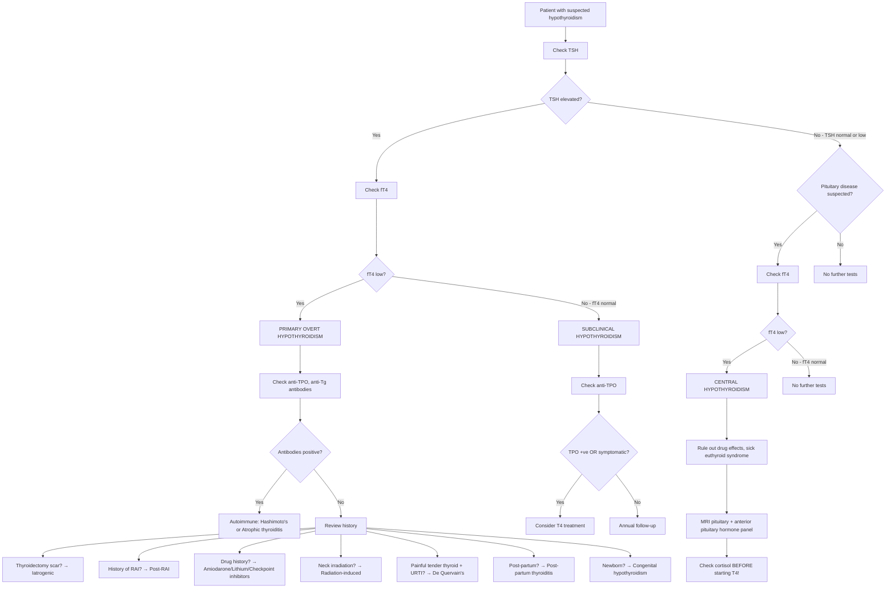

## Differential Diagnosis of Hypothyroidism

When a patient presents with features suggestive of hypothyroidism — fatigue, weight gain, cold intolerance, constipation, dry skin, bradycardia — your job is twofold:

1. **Confirm that hypothyroidism is the diagnosis** (as opposed to mimics that share overlapping features)
2. **Determine the cause** of the hypothyroidism (because management differs)

Let's tackle both systematically.

---

### A. Conditions That Mimic Hypothyroidism (The "Look-Alikes")

Many conditions share individual features with hypothyroidism. The key is that hypothyroidism produces a **constellation** of symptoms across multiple systems simultaneously — if only one or two features are present, think of the alternatives below.

| Clinical Feature | Hypothyroidism Mimic | How to Distinguish |
|---|---|---|
| **Fatigue + weight gain** | Depression | Depression has anhedonia, low mood, sleep disturbance. TFTs normal. Note: hypothyroidism itself causes depression — always check TFTs in new-onset depression [1] |
| | Chronic fatigue syndrome | No objective metabolic signs (normal reflexes, normal HR, normal skin). TFTs normal |
| | Cushing's syndrome | Central obesity, moon face, striae, buffalo hump, hyperglycaemia. Cortisol elevated. Different fat distribution pattern (central vs diffuse in hypothyroidism) |
| | Obstructive sleep apnoea | Daytime somnolence, snoring, obesity. Sleep study diagnostic |
| **Constipation** | IBS (constipation-predominant) | Fluctuating symptoms, meets Rome IV criteria, TFTs normal [6] |
| | Drug-induced (opioids, CCBs) | Temporal relationship with drug. TFTs normal [6] |
| | Hypercalcaemia | Check serum calcium — hyperparathyroidism can coexist with hypothyroidism (autoimmune polyglandular syndrome or post-thyroidectomy hypocalcaemia is the opposite!) |
| | Hypokalemia | Check electrolytes [6] |
| | Colonic malignancy | Red flags: PR bleeding, weight loss, iron deficiency anaemia. Colonoscopy |
| **Bradycardia** | Beta-blocker use | Drug history |
| | Sick sinus syndrome | ECG, Holter monitor |
| | Raised intracranial pressure | Cushing's reflex (bradycardia + hypertension + irregular breathing). Neurological signs |
| **Dry skin / hair loss** | Iron deficiency anaemia | Check ferritin, iron studies |
| | Dermatological conditions (eczema, psoriasis) | Localised vs generalised, no metabolic features |
| | Ageing | No goitre, normal TFTs |
| **Non-pitting oedema** | Lymphoedema | Usually unilateral or asymmetric, history of surgery/radiation/infection |
| | Pretibial myxoedema of Graves' disease | Paradoxically in **hyper**thyroidism — autoimmune GAG deposition (TSH receptor antibodies on dermal fibroblasts). Bilateral shins, "peau d'orange" appearance |
| **Periorbital oedema** | Nephrotic syndrome | Heavy proteinuria, hypoalbuminaemia, generalised pitting oedema |
| | Allergic/angioedema | Acute onset, urticaria, history of allergen exposure |
| **Carpal tunnel syndrome** | Primary CTS (most common) | ***Ageing, female, DM, hypothyroid, RA, obesity, pregnancy*** are all risk factors [7]. Always check TFTs in new CTS — hypothyroidism is a treatable secondary cause |
| | Cervical radiculopathy (C6/7) | Neck pain, dermatomal distribution, neck movement exacerbates [7] |
| **Hoarse voice** | Laryngeal pathology | Direct laryngoscopy. RLN palsy from other causes (lung cancer, post-thyroidectomy) [2] |
| | GORD (laryngopharyngeal reflux) | Heartburn, throat clearing |
| **Hypercholesterolaemia** | Familial hypercholesterolaemia | Family history, tendon xanthomata, very high LDL. TFTs normal — but always check TFTs before starting a statin for new dyslipidaemia |
| | Nephrotic syndrome | Proteinuria, hypoalbuminaemia |
| **Effusions (pericardial/pleural)** | Heart failure | Elevated BNP, cardiomegaly, other signs of HF |
| | Malignancy | Bloody effusion, cytology positive |
| | Infection (TB in Hong Kong) | Fever, lymphocytic exudate |
| **Cognitive decline** | Dementia (Alzheimer's, vascular) | Hypothyroidism is a **reversible cause of dementia** — always check TFTs in cognitive decline workup. If TFTs abnormal, treat first and reassess |
| **Goitre** | See Section B below | Goitre has its own extensive DDx |
| ***Mental sluggishness / "slow"*** | Normal ageing | No objective signs. TFTs normal |
| | Medications (sedatives, anticonvulsants) | Drug history |
| **Galactorrhoea** | Prolactinoma | Hypothyroidism causes ↑ TRH → ↑ prolactin → galactorrhoea. Must check TFTs AND prolactin. If TFTs show hypothyroidism, treat it — prolactin often normalises [8] |
| | Drug-induced (antipsychotics, metoclopramide, domperidone) | Temporal relationship with drug [8] |

<Callout title="The 'Check TFTs' Rule" type="idea">
In clinical practice, TFTs should be checked in ANY patient presenting with:
- New-onset depression or cognitive decline
- Unexplained weight gain
- New-onset constipation without obvious cause
- New dyslipidaemia (before starting a statin!)
- New carpal tunnel syndrome
- Unexplained effusions
- Galactorrhoea / menstrual irregularities
- Unexplained anaemia

Hypothyroidism is **common, easily diagnosed, and easily treated** — missing it is unforgivable.
</Callout>

---

### B. Differential Diagnosis of the Cause of Hypothyroidism

Once hypothyroidism is confirmed biochemically (↑ TSH + ↓ fT4 = primary; low/normal TSH + ↓ fT4 = central), you must determine the **aetiology**. The approach is systematic:

#### Step 1: Primary vs Central

| Feature | Primary Hypothyroidism | Central (Secondary/Tertiary) Hypothyroidism |
|---|---|---|
| **TSH** | **↑↑** (the pituitary "shouts louder" because it senses low T4) | **Low or inappropriately normal** (the pituitary is broken — it can't respond) |
| **fT4** | ↓ | ↓ |
| **Goitre** | May be present (Hashimoto's, iodine deficiency, drug-induced) | Absent (no TSH drive to enlarge gland) |
| **Other pituitary hormone deficiency** | No | Yes — look for hypocortisolism, hypogonadism, GH deficiency (panhypopituitarism) |
| **Prevalence** | ~95% of all hypothyroidism | ~5% |

> **Why does this distinction matter?** Because in central hypothyroidism, you must **exclude coexisting adrenal insufficiency BEFORE starting thyroxine**. Starting T4 in a patient with undiagnosed adrenal insufficiency increases cortisol metabolism → precipitates acute adrenal crisis (Addisonian crisis) → potentially fatal [1].

#### Step 2: If Primary — What Is the Cause?

The differential of primary hypothyroidism is essentially the **aetiological table** from the previous section. Clinically, you narrow it down using:

| Clue | Points Towards |
|---|---|
| **Goitre present** | Hashimoto's (early), iodine deficiency, dyshormonogenesis, drug-induced (lithium, amiodarone), Riedel's thyroiditis |
| **No goitre** | Atrophic thyroiditis, post-thyroidectomy, post-RAI, post-external radiation, late Hashimoto's (burnt out) |
| **Thyroidectomy scar on neck** | ***Iatrogenic — post-thyroidectomy*** [1]. Also assess for ***hypoparathyroidism*** (hypocalcaemia) [2] |
| **History of RAI treatment** | Post-RAI hypothyroidism (expected outcome of Graves' treatment) [1] |
| **Drug history**: amiodarone, lithium, checkpoint inhibitors, interferon | Drug-induced hypothyroidism [1] |
| **Anti-TPO and/or anti-Tg antibodies positive** | Autoimmune — Hashimoto's (anti-TPO 90–100%, anti-Tg 80–90%) or atrophic thyroiditis [1] |
| **Previous neck irradiation** (e.g. childhood leukaemia, lymphoma) | ***Radiation-induced thyroid failure*** [3][4] |
| **Post-partum (within 12 months of delivery)** | Post-partum thyroiditis (transient; may follow a thyrotoxic phase) [1] |
| **Painful, tender thyroid + preceding URTI** | Subacute (De Quervain's) thyroiditis — transient hypothyroid phase [1] |
| **Neck irradiation + enlarged pituitary** | Could be radiation to hypothalamus/pituitary → central hypothyroidism. Also, longstanding primary hypothyroidism → ***thyrotroph hyperplasia*** mimicking a pituitary tumour [5] |
| **Other autoimmune conditions** (T1DM, Addison's, vitiligo, pernicious anaemia) | Autoimmune polyglandular syndrome — Hashimoto's is the likely thyroid cause |
| **Newborn with screening TSH elevated** | Congenital hypothyroidism — thyroid dysgenesis (80–85%), dyshormonogenesis (10–15%), maternal blocking antibodies (5%) [1] |
| **Family history of MEN II** | Post-thyroidectomy for medullary thyroid carcinoma [3][4] |
| **Woody hard, fixed thyroid** | Riedel's thyroiditis (very rare) [1] |

#### Step 3: If Central — What Is the Cause?

| Clue | Points Towards |
|---|---|
| **Headache, visual field defects (bitemporal hemianopia)** | Pituitary macroadenoma compressing optic chiasm [5] |
| **Other pituitary hormone deficiency** (amenorrhoea, ↓ libido, fatigue, hypoglycaemia) | Panhypopituitarism — tumour, surgery, irradiation, infiltrative [5] |
| **Post-partum haemorrhage, failure to lactate** | ***Sheehan's syndrome*** — post-partum pituitary necrosis [1][5] |
| **History of pituitary surgery or cranial irradiation** | Iatrogenic hypopituitarism [5] |
| **History of head trauma** | Traumatic hypopituitarism |
| **Diabetes insipidus features (polyuria, polydipsia)** | Hypothalamic/posterior pituitary disease |

<Callout title="Pituitary Enlargement in Primary Hypothyroidism — A Trap!" type="error">
Longstanding untreated primary hypothyroidism → chronically elevated TSH → ***thyrotroph hyperplasia*** → the pituitary gland enlarges and can mimic a pituitary adenoma on MRI [5]. This is important because:
1. You might misdiagnose it as a pituitary tumour and operate unnecessarily
2. The "tumour" **shrinks with thyroid hormone replacement** — always check TFTs before pituitary surgery for an apparently non-functioning adenoma!
</Callout>

---

### C. Differential Diagnosis of Goitre (A Key Overlap)

Since many patients with hypothyroidism present with a **goitre** (or conversely, a goitre is discovered and TFTs reveal hypothyroidism), you must know the differential diagnosis of goitre and how it maps to thyroid function status.

***Classification of goitre*** [3]:

| Category | Examples | Thyroid Status |
|---|---|---|
| ***Simple goitre (endemic or sporadic)*** | ***Diffuse*** or ***nodular*** | Euthyroid (or mildly hypothyroid if iodine deficiency) |
| ***Neoplastic goitre*** | ***Benign*** (follicular adenoma) or ***Malignant*** (papillary, follicular, anaplastic, medullary CA) [3][4] | Usually euthyroid (rarely thyrotoxic — functioning adenoma, metastatic thyroid CA) |
| ***Thyroiditis*** | ***Bacterial (acute suppurative)***, ***viral (subacute/De Quervain's)***, ***lymphocytic/Hashimoto/autoimmune (chronic)*** [3] | Variable — thyrotoxic (early destructive), hypothyroid (late), or euthyroid |
| ***Toxic goitre*** | ***Diffuse toxic (Graves')***, ***toxic nodular (Plummer's)***, ***toxic/functioning adenoma*** [3] | Thyrotoxic |

***Approach to thyroid nodules*** [4]:

| Pattern | Differential |
|---|---|
| ***Solitary nodule*** | ***Dominant nodule in MNG; Cyst (true simple cyst, colloid nodule); Neoplastic (adenoma, toxic adenoma, carcinoma)*** [4] |
| ***Multiple nodules*** | ***MNG (hyperplastic/adenomatous nodules with varying degree of cystic degeneration); toxic MNG; multiple cysts; multiple adenoma*** [4] |
| ***Diffuse*** | ***Graves' disease; Physiological (pregnancy, puberty); Hashimoto's thyroiditis; De Quervain's/subacute thyroiditis*** [4] |

***Thyroid nodule pathology*** [3]:
- ***Nodular goitre: colloid / haemorrhagic cystic / complex / hyperplastic / adenomatous nodule (70%)***
- ***Benign follicular adenoma: mainly non-toxic (15%)***
- ***Well-differentiated thyroid carcinoma (10%)***
- ***Miscellaneous: other thyroid malignancies, thyroiditis (5%)***

> ***Around 10–15% of nodules are malignant*** [4] — this is why ALL thyroid nodules need proper workup even if the patient is hypothyroid.

<Callout title="Hypothyroid + Goitre = Think Hashimoto's First (in HK)">
In a Hong Kong patient with hypothyroidism AND a goitre, Hashimoto's thyroiditis is the #1 diagnosis. Confirm with **anti-TPO antibodies** (positive in 90–100%) [1]. The goitre in Hashimoto's is typically **diffusely enlarged, firm, rubbery, and may have a bosselated (irregular/lobulated) surface**. However, always exclude coexisting thyroid nodules/malignancy — Hashimoto's is a risk factor for ***thyroid lymphoma*** [4].
</Callout>

---

### D. Differential Diagnosis by Thyroid Function Test Pattern

This is the most practical approach in clinical practice. You get the TFTs back — now what?

| TFT Pattern | TSH | fT4 | fT3 | Diagnosis | Next Step |
|---|---|---|---|---|---|
| **Primary overt hypothyroidism** | ↑↑ | ↓ | ↓ | Primary hypothyroidism | Check anti-TPO, anti-Tg. Review drug history, surgical history, RAI history |
| **Subclinical hypothyroidism** | ↑ (mildly) | Normal | Normal | Mild/subclinical hypothyroidism | Check anti-TPO → if positive AND symptomatic → treat. If negative and asymptomatic → annual follow-up [1] |
| **Central hypothyroidism** | Low or inappropriately normal | ↓ | ↓ | Pituitary/hypothalamic disease | MRI pituitary, anterior pituitary hormone panel (cortisol FIRST — exclude adrenal insufficiency before starting T4) |
| **Low T4, low TSH, low T3** (acutely unwell patient) | Low | Low | Low | **Sick euthyroid syndrome** (non-thyroidal illness syndrome) | Do NOT treat with thyroxine. Repeat TFTs after recovery. The low T3 is an adaptive response to severe illness (reduces metabolic demand) |
| **High TSH, normal fT4, normal fT3** (with high anti-TPO) | ↑ | Normal | Normal | Early Hashimoto's / subclinical hypothyroidism | Monitor or treat depending on TSH level and symptoms [1] |

<Callout title="Sick Euthyroid Syndrome — Don't Be Fooled!" type="error">
In any acutely unwell patient (ICU, sepsis, post-surgery, acute MI), TFTs can be misleading:
- T3 drops first (↓ peripheral conversion of T4 → T3 as an adaptive mechanism to reduce metabolic demand)
- T4 may also drop
- TSH can be low, normal, or transiently elevated during recovery

**This does NOT mean the patient is hypothyroid.** Do NOT start thyroxine. Repeat TFTs 6–8 weeks after recovery. Treating sick euthyroid syndrome with thyroxine may actually be harmful (increases catabolism in an already stressed patient).
</Callout>

---

### E. Clinical Approach to the Differential — A Decision Framework

This flowchart is adapted from the diagnostic algorithm in the senior notes [1] and reflects the standard clinical approach.

---

### F. Special Differential Considerations

#### Hypothyroidism Causing Other Conditions (Don't Forget the Reverse)

Hypothyroidism itself can be the **underlying cause** of other presentations. Always consider hypothyroidism in the DDx of:

| Presentation | Why Hypothyroidism Causes It |
|---|---|
| ***Constipation*** | ↓ gut motility → also consider in DDx of pseudo-obstruction (***metabolic: hypothyroidism***) [6] |
| ***Carpal tunnel syndrome*** | GAG deposition thickens the transverse carpal ligament → median nerve compression. ***Hypothyroid*** is listed as a secondary cause of CTS [7] |
| **Paralytic ileus / pseudo-obstruction** | ***Hypothyroidism*** is listed as a metabolic cause of both paralytic ileus and pseudo-obstruction [6] |
| ***Galactorrhoea*** | ↑ TRH → ↑ prolactin → milky nipple discharge [8] |
| ***Hypercholesterolaemia*** | ↓ LDL receptors. Always check TFTs before diagnosing primary dyslipidaemia |
| **Pericardial / pleural effusion** | ↑ capillary permeability + GAG deposition |
| **Anaemia (macrocytic or normocytic)** | Multiple mechanisms (ACD, B12/folate deficiency, iron deficiency from menorrhagia) [1] |
| **Hyponatraemia** | ↑ ADH secretion (inappropriate) + ↓ free water clearance + ↓ cardiac output → dilutional hyponatraemia |
| **Elevated CK** | Myopathy → CK leak. Can be misdiagnosed as myocardial infarction or rhabdomyolysis |
| ***Gynaecomastia*** | Altered oestrogen:androgen ratio from hypothyroidism-associated hypogonadism [9] |
| ***Pituitary enlargement (pseudo-tumour)*** | ***Thyrotroph hyperplasia*** from longstanding primary hypothyroidism [5] |

---

> **Key Exam Point**: The differential diagnosis of hypothyroidism is really three questions in one:
> 1. Is it truly hypothyroidism or a mimic? → Confirm with TFTs
> 2. Is it primary or central? → TSH tells you
> 3. What is the specific cause? → Clinical context (antibodies, history, drugs, surgery) tells you

<Callout title="High Yield Summary">

**Mimics of hypothyroidism**: Depression, chronic fatigue syndrome, Cushing's, OSA, nephrotic syndrome, normal ageing — all share individual features but lack the full metabolic constellation. TFTs distinguish.

**Primary vs Central**: TSH is the key — elevated = primary (95%), low/normal = central (5%). In central, ALWAYS exclude adrenal insufficiency before starting T4.

**Sick euthyroid syndrome**: Low T3 ± low T4 ± low TSH in acutely unwell patients. Do NOT treat with thyroxine. Repeat TFTs after recovery.

**Most common cause in HK**: Hashimoto's (anti-TPO 90–100%). Drug-induced (amiodarone, lithium, checkpoint inhibitors) and iatrogenic (post-thyroidectomy, post-RAI) are also very common.

**Goitre DDx maps to thyroid status**: Euthyroid (simple goitre, adenoma), hypothyroid (Hashimoto's, iodine deficiency), hyperthyroid (Graves', toxic MNG, toxic adenoma). Around 10–15% of thyroid nodules are malignant.

**Thyrotroph hyperplasia trap**: Longstanding primary hypothyroidism → pituitary enlargement mimicking adenoma. Shrinks with T4 replacement — check TFTs before pituitary surgery.

**Always check TFTs in**: new depression, new CTS, new dyslipidaemia, new constipation, cognitive decline, galactorrhoea, unexplained effusions, unexplained anaemia, pseudo-obstruction.
</Callout>

---

<ActiveRecallQuiz
  title="Active Recall - Differential Diagnosis of Hypothyroidism"
  items={[
    {
      question: "A patient has low fT4 and an inappropriately normal TSH. What is the diagnosis, and what critical investigation must you perform BEFORE starting thyroxine replacement?",
      markscheme: "Central (secondary/tertiary) hypothyroidism. Must check serum cortisol and exclude coexisting adrenal insufficiency before starting levothyroxine, because T4 replacement increases cortisol metabolism and can precipitate an Addisonian crisis."
    },
    {
      question: "A critically ill ICU patient has low T3, low T4, and low TSH. Should you start thyroxine? Explain your reasoning.",
      markscheme: "No. This is sick euthyroid syndrome (non-thyroidal illness syndrome). The low T3 is an adaptive response to reduce metabolic demand in severe illness. Treating with thyroxine is not indicated and may be harmful. Repeat TFTs 6-8 weeks after recovery from the acute illness."
    },
    {
      question: "An MRI brain shows an enlarged pituitary in a 55-year-old woman with longstanding fatigue and constipation. Her TSH is very high and fT4 is low. What is the most likely explanation for the pituitary enlargement?",
      markscheme: "Thyrotroph hyperplasia secondary to longstanding primary hypothyroidism. Chronically elevated TSH causes hypertrophy and hyperplasia of thyrotrophs, enlarging the pituitary and mimicking a pituitary adenoma. It will shrink with thyroid hormone replacement. Always check TFTs before pituitary surgery."
    },
    {
      question: "List four clinical presentations (outside classic hypothyroid symptoms) where you should always check TFTs as part of the workup.",
      markscheme: "Any four of: new-onset depression or cognitive decline, new dyslipidaemia (before starting a statin), new carpal tunnel syndrome, unexplained constipation, galactorrhoea, unexplained pericardial or pleural effusions, unexplained macrocytic or normocytic anaemia, pseudo-obstruction or paralytic ileus, unexplained hyponatraemia."
    },
    {
      question: "A patient in Hong Kong presents with hypothyroidism and a diffusely enlarged, firm goitre. Anti-TPO antibodies are strongly positive. What is the diagnosis, and what associated malignancy should you be aware of?",
      markscheme: "Hashimoto's thyroiditis (chronic lymphocytic thyroiditis). Associated malignancy is primary thyroid lymphoma (MALT-type or diffuse large B-cell lymphoma). Hashimoto's is also the most common cause of hypothyroidism in iodine-sufficient areas like Hong Kong."
    }
  ]}
/>

## References

[1] Senior notes: felixlai.md (Hypothyroidism: Definitions, Etiology, Diagnosis, Clinical Features, Treatment)
[2] Senior notes: maxim.md (Thyroid surgery complications, Parathyroid anatomy)
[3] Lecture slides: GC 177. A thyroid nodule benign thyroid nodules; thyroid cancer.pdf (Goitre classification, Thyroid nodule pathology)
[4] Senior notes: maxim.md (Approach to thyroid nodules, Thyroid cancer overview, Risk factors)
[5] Senior notes: felixlai.md (Pituitary adenomas, Differential diagnosis of sellar mass, Thyrotroph hyperplasia)
[6] Senior notes: maxim.md (Constipation DDx, Paralytic ileus, Pseudo-obstruction aetiology)
[7] Senior notes: maxim.md (Carpal tunnel syndrome risk factors and clinical features)
[8] Senior notes: felixlai.md (Nipple discharge and galactorrhoea, Hypothyroidism causing hyperprolactinaemia)
[9] Senior notes: maxim.md (Gynaecomastia aetiology)
