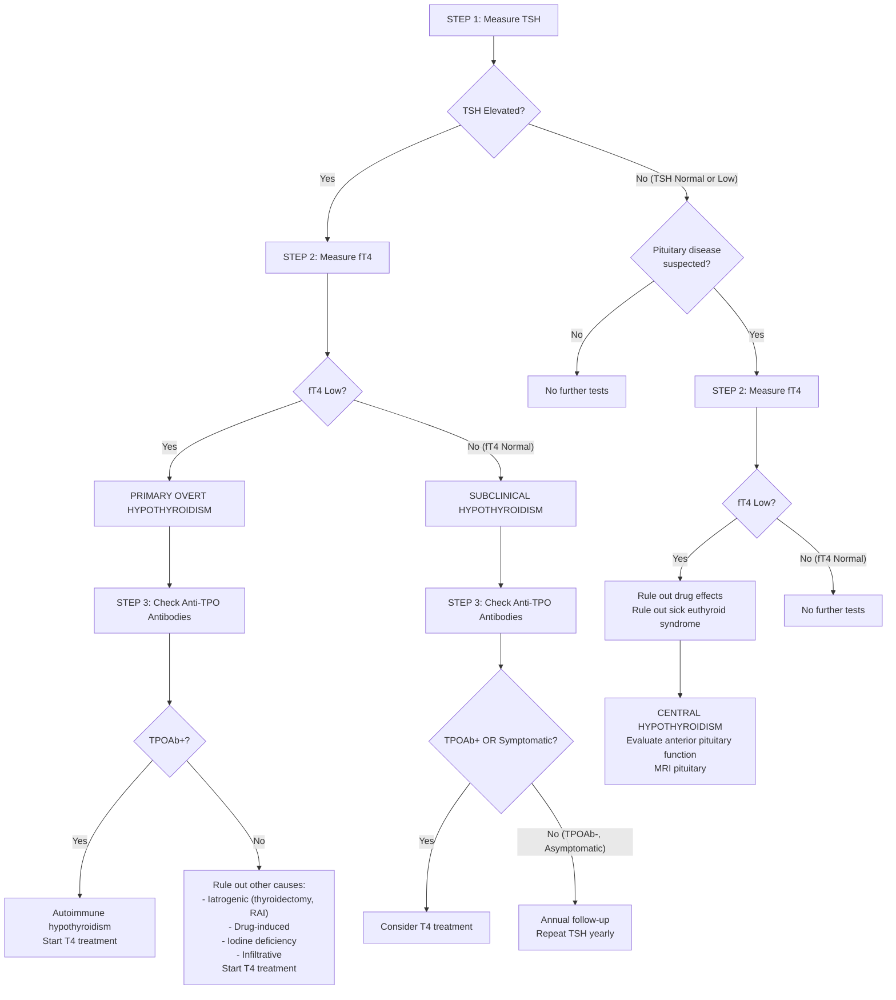

## Diagnostic Criteria, Algorithm, and Investigations for Hypothyroidism

### A. Diagnostic Criteria — First Principles

Unlike many conditions that have formal "diagnostic criteria" (e.g. the Jones criteria for rheumatic fever), hypothyroidism is diagnosed **biochemically**. The clinical features are supportive but non-specific — many conditions mimic hypothyroidism. The diagnosis rests on **thyroid function tests (TFTs)**.

Let's build the diagnostic logic from first principles of the HPT axis:

#### The Core Logic

1. **TSH is the gatekeeper.** The anterior pituitary is exquisitely sensitive to circulating T4/T3 levels. Even tiny drops in free T4 cause a disproportionately large rise in TSH (logarithmic-linear relationship). This is why ***TSH is the MOST sensitive indicator of thyroid function due to its short half-life*** — it changes dynamically in response to alterations in T3 and T4 [1].

2. **fT4 determines severity.** Once TSH is elevated, measuring fT4 tells you whether the patient has:
   - **Subclinical hypothyroidism** (↑ TSH, normal fT4) — the thyroid is struggling but compensating
   - **Overt hypothyroidism** (↑ TSH, ↓ fT4) — the thyroid has failed

3. **Anti-TPO antibodies determine aetiology.** If positive → autoimmune (Hashimoto's or atrophic thyroiditis). If negative → look for other causes (iatrogenic, drug-induced, etc.)

#### Biochemical Diagnostic Criteria

| Diagnosis | TSH | fT4 | fT3 | Notes |
|---|---|---|---|---|
| **Primary overt hypothyroidism** | **↑↑** | **↓** | ↓ (or normal) | ***fT3 level is NOT needed since it can be normal (not necessarily low) in 25% of patients due to peripheral conversion from T4 → T3 by adaptive deiodinase responses to hypothyroidism*** [1] |
| **Subclinical (mild) hypothyroidism** | **↑** (mildly, typically 4.5–10 mU/L) | **Normal** | Normal | The gland is compensating. TSH is working overtime to maintain fT4. |
| **Central (secondary/tertiary) hypothyroidism** | **Low or inappropriately normal** | **↓** | ↓ | The pituitary is broken — it cannot mount an appropriate TSH response. TSH may even be "normal" numerically but is inappropriate for the low fT4 |

<Callout title="Why Measure fT4 and NOT Total T4?" type="idea">
***T3 and T4 are highly protein-bound*** and many factors influence protein binding [1]:
- **Thyroxine-binding globulin (TBG)** carries ~70% of circulating T4
- ***Total T3 or T4 are elevated when TBG is increased***: **pregnancy, oral contraceptives, hormonal therapy** [1]
- ***Total T3 or T4 are reduced when TBG is decreased***: **androgens, hypoalbuminaemia** [1]
- ***fT3 and fT4 are normal in euthyroid patients with the above circumstances and hence are preferable over total thyroid hormones*** [1]

So measuring total T4 would give you **falsely high** values in pregnant women on OCPs and **falsely low** values in nephrotic syndrome — leading to misdiagnosis. Free T4 (fT4) measures only the biologically active, unbound fraction and is unaffected by binding protein changes.
</Callout>

<Callout title="TSH Limitations — When It Misleads You" type="error">
***TSH should NOT be used as an isolated test in patients with suspected or known pituitary disease*** [1]. Key caveats:

- ***↑ TSH alone may not necessarily indicate hypothyroidism*** — e.g. **recovery phase of sick euthyroid syndrome** (TSH transiently rises), **TSH-secreting pituitary adenoma** (secondary hyperthyroidism) [1]
- ***↓ TSH alone may not necessarily indicate hyperthyroidism*** — e.g. **central (secondary) hypothyroidism**, **1st trimester of pregnancy** (due to hCG secretion which ***stimulates TSH receptor by molecular mimicry***), **high dose glucocorticoids or dopamine** (suppress TSH secretion) [1]

**Bottom line:** TSH is the best first-line test for PRIMARY thyroid disease. But if you suspect pituitary/hypothalamic disease, you MUST measure fT4 alongside TSH.
</Callout>

---

### B. Diagnostic Algorithm

The following algorithm is adapted directly from the senior notes [1] and reflects the standard clinical approach to evaluating hypothyroidism.

#### Step-by-Step Walkthrough

**Step 1: Measure TSH** — This is your screening test. It is the single most useful test.

**Step 2: Interpret the TSH**
- If **elevated** → the pituitary is "shouting" because it senses low thyroid hormones → likely **primary** hypothyroidism → proceed to measure **fT4**
- If **normal** → ask yourself: is there clinical suspicion of pituitary disease? If no → no further tests. If yes → measure **fT4** anyway (because TSH can be inappropriately normal in central hypothyroidism)

**Step 3: Measure fT4**
- If TSH elevated + fT4 **low** → **Primary overt hypothyroidism** → check **anti-TPO antibodies** to determine aetiology
- If TSH elevated + fT4 **normal** → **Subclinical (mild) hypothyroidism** → check **anti-TPO antibodies** to guide management
- If TSH normal/low + fT4 **low** (with clinical suspicion of pituitary disease) → ***Rule out drug effects, sick euthyroid syndrome, then evaluate anterior pituitary function*** [1]

**Step 4: Anti-TPO Antibodies**
- ***If TPOAb+ → autoimmune hypothyroidism → T4 treatment*** [1]
- ***If TPOAb- → rule out other causes of hypothyroidism → T4 treatment*** [1]
- For subclinical hypothyroidism: ***if TPOAb+ or symptomatic → T4 treatment. If TPOAb-, no symptoms → annual follow-up*** [1]

<Callout title="The Algorithm in One Sentence">
**TSH first → if elevated, fT4 next → if low, it's overt primary hypothyroidism; if normal, it's subclinical → then TPO antibodies to determine cause and guide treatment. If TSH is normal/low but you suspect pituitary disease, measure fT4 anyway.**
</Callout>

---

### C. Investigation Modalities — Detailed Breakdown

Let's go through each investigation systematically, explaining **what** it is, **why** we do it, **key findings**, and **interpretation**.

#### 1. Thyroid Function Tests (TFTs)

These are the **cornerstone** of diagnosis.

##### a. Serum TSH

| Aspect | Detail |
|---|---|
| **What it measures** | Concentration of thyroid-stimulating hormone from the anterior pituitary |
| **Why it's the best first test** | ***TSH is the MOST sensitive indicator of thyroid function*** due to the logarithmic-linear relationship: small changes in fT4 cause large reciprocal changes in TSH [1] |
| **Normal range** | ~0.4–4.0 mU/L (varies by assay and population; may be higher in elderly) |
| **In primary hypothyroidism** | **↑↑** — often > 10 mU/L in overt disease |
| **In subclinical hypothyroidism** | **Mildly ↑** — typically 4.5–10 mU/L |
| **In central hypothyroidism** | **Low or inappropriately normal** |
| **Monitoring caveat** | ***Do NOT use TSH level to monitor response to treatment since it can remain suppressed for several months*** (in patients transitioning from hyperthyroid to hypothyroid states, or early in T4 replacement) — ***use T3 and T4 level instead*** initially [1] |

##### b. Serum fT4 (Free Thyroxine)

| Aspect | Detail |
|---|---|
| **What it measures** | Unbound, biologically active T4 in serum |
| **Why fT4 and not total T4** | Unaffected by changes in binding proteins (pregnancy ↑ TBG, nephrotic syndrome ↓ TBG, OCP ↑ TBG) [1] |
| **In primary overt hypothyroidism** | **↓** |
| **In subclinical hypothyroidism** | **Normal** (the gland is compensating under TSH drive) |
| **Key point** | ***fT4 level is required to determine subclinical or overt hypothyroidism*** [1] |

##### c. Serum fT3 (Free Triiodothyronine)

| Aspect | Detail |
|---|---|
| **Role in hypothyroidism** | ***fT3 level is NOT needed*** in the evaluation of hypothyroidism [1] |
| **Why?** | ***fT3 can be normal in 25% of hypothyroid patients*** due to peripheral conversion from T4 → T3 by ***adaptive deiodinase responses*** — the body preferentially converts the remaining T4 to the more active T3 to compensate [1] |
| **When IS fT3 useful?** | In hyperthyroidism — to detect ***T3 toxicosis*** (where only fT3 is elevated, fT4 is normal) [1] |

<Callout title="Summary: Which Thyroid Hormones to Measure When">

| Suspected Condition | Measure | Reasoning |
|---|---|---|
| **Hypothyroidism** | TSH + fT4 | fT3 not needed — can be normal in hypothyroidism due to adaptive deiodination |
| **Hyperthyroidism** | TSH + fT4 + fT3 | fT3 needed because 2–5% of patients have T3 toxicosis (only fT3 elevated) |
| **Monitoring T4 replacement** | TSH (after 6–8 weeks equilibration) | Once TSH has normalised, it becomes a reliable monitor |
</Callout>

---

#### 2. Thyroid Antibodies

These determine the **aetiology** (autoimmune vs non-autoimmune) and guide management decisions, particularly in subclinical hypothyroidism.

| Antibody | Target | Significance in Hypothyroidism |
|---|---|---|
| ***Anti-thyroid peroxidase (TPO) antibodies*** | TPO enzyme on apical surface of follicular cells | **The most important antibody in hypothyroidism.** Positive in ***90–100% of Hashimoto's thyroiditis*** [1]. Present in 10–15% of the normal population (subclinical autoimmunity). Predicts progression from subclinical → overt hypothyroidism (~4.3% per year if TPOAb+) |
| ***Anti-thyroglobulin (TG) antibodies*** | Thyroglobulin protein in colloid | Positive in ***80–90% of Hashimoto's thyroiditis*** [1]. Less specific than TPOAb. Important in thyroid cancer follow-up (interferes with thyroglobulin measurement) [10] |
| ***Thyrotropin receptor antibodies (TRAb)*** | TSH receptor on follicular cells | Primarily relevant in **Graves' disease** (80–90% positive) [1]. In hypothyroidism, **TSH receptor-blocking antibodies** (a subtype of TRAb) can cause **atrophic thyroiditis** — they block TSH action instead of stimulating it. Also relevant in neonatal hypothyroidism (maternal blocking antibodies crossing placenta) |

**Antibody prevalence table** [1]:

| Condition | Anti-TSH | Anti-TPO | Anti-TG |
|---|---|---|---|
| ***Normal population*** | ***0%*** | ***10–15%*** | ***10–20%*** |
| ***Graves' disease*** | ***80–90%*** | ***50–80%*** | ***50–70%*** |
| ***Hashimoto's thyroiditis*** | ***10–20%*** | ***90–100%*** | ***80–90%*** |
| ***Multinodular goitre*** | ***10–20%*** | ***10–20%*** | ***30–40%*** |

> **Clinical pearl**: A positive anti-TPO in a patient with subclinical hypothyroidism means they are more likely to progress to overt disease AND more likely to benefit from early T4 treatment [1].

---

#### 3. Baseline Blood Tests

These are not diagnostic of hypothyroidism per se but are essential for identifying complications and preparing for treatment.

| Investigation | Why | Expected Findings in Hypothyroidism |
|---|---|---|
| ***CBC with differentials*** | ***Baseline to prepare patient for thionamides which can cause agranulocytosis*** (more relevant in hyperthyroidism treatment, but done as part of complete workup) [1]. Also detects anaemia (common in hypothyroidism) | **Normocytic or macrocytic anaemia** (ACD, B12/folate deficiency). May see low WCC if concurrent autoimmune neutropenia |
| ***LFT*** | ***Baseline LFT to prepare patient for thionamides which can cause hepatotoxicity*** [1]. Hypothyroidism itself can cause mild transaminase elevation | Mildly elevated AST/ALT (due to myopathy → CK leak can also cause AST elevation). Elevated CK (skeletal muscle origin) |
| **Lipid panel** | Hypothyroidism causes secondary hypercholesterolaemia (↓ LDL receptors) | **↑ Total cholesterol, ↑ LDL-cholesterol**, ↑ triglycerides. Correct with T4 treatment before starting a statin |
| **Serum electrolytes (Na⁺, K⁺)** | Hypothyroidism causes hyponatraemia (↓ free water clearance, ↑ ADH) | **Hyponatraemia** — always check TFTs in unexplained hyponatraemia |
| **Serum calcium and phosphate** | Relevant if post-thyroidectomy (assess for hypoparathyroidism) or if concurrent autoimmune hypoparathyroidism | ***Hypocalcaemia*** if parathyroid glands damaged/removed [10] |
| **Serum CK (creatine kinase)** | Hypothyroid myopathy causes CK elevation — can be mistaken for MI or rhabdomyolysis | **Elevated CK** (skeletal muscle isoform, not cardiac) |
| **Serum glucose** | Hypothyroidism can cause hypoglycaemia (↓ gluconeogenesis, ↓ glycogenolysis), especially in myxoedema coma | Low-normal or ↓ glucose |
| **Prolactin** | If galactorrhoea or menstrual disturbance present. ↑ TRH → ↑ prolactin | Mildly elevated prolactin (usually < 100 ng/mL — if > 200, think prolactinoma) |

---

#### 4. Imaging Studies

##### a. Thyroid Ultrasound (USG)

***Thyroid USG*** is ***routine for all patients with goitre or palpable nodule*** [3][11].

| Aspect | Detail |
|---|---|
| **Modality** | ***B-mode real-time ultrasonography*** [3] |
| **Advantages** | ***Non-invasive, no radiation, convenient, and cheap*** [3] |
| **Sensitivity/Specificity** | ***Highly sensitive but relatively low specificity*** [3] |
| ***Roles*** [3][11] | ***Extend physical examination*** |
| | ***Select nodules for FNAC*** |
| | ***Guide needle aspiration*** |
| | ***Assess size of goitre*** [11] |
| | ***Assess nodule number and suspicious features*** [11] |
| | ***Assess cervical lymph nodes (esp. deep nodes, e.g. level VI nodes)*** [11] |
| | ***Assess retrosternal extension*** [11] |
| **NOT recommended as** | ***A screening test*** in the general population [3] |

**Findings specific to hypothyroidism:**
- **Hashimoto's thyroiditis**: Diffusely **hypoechoic** gland (due to lymphocytic infiltration replacing normal follicular tissue), **heterogeneous echotexture**, may show **pseudo-nodular** pattern, often with **increased vascularity** on Doppler. The gland may be enlarged (early) or atrophic (late)
- **Atrophic thyroiditis**: Small, hypoechoic gland
- **Post-thyroidectomy**: Absent gland (total) or small remnant (subtotal)

**Concurrent nodule assessment** — because even in a hypothyroid patient, you must evaluate for coexisting thyroid nodules:

***Sonographic features suspicious of malignancy: "SHIT CME"*** [11] — ***most important are solid and hypoechoic***:
- ***S — Solid nodule***
- ***H — Hypoechoic nodule***
- ***I — Irregular margin***
- ***T — Taller than wide (AP > TS)***
- ***C — Chaotic central vascularity***
- ***M — Microcalcifications***
- ***E — Extrathyroidal extension***

**USG risk stratification and FNAC criteria** [1][3][11]:

| ***Sonographic Pattern*** | ***Ultrasound Features*** | ***Risk of Malignancy*** | ***FNA Size Cutoff*** |
|---|---|---|---|
| ***High suspicion*** | ***Solid hypoechoic nodule + ≥ 1 suspicious feature (microcalcifications, taller than wide, irregular margins, ETE)*** | ***> 70–90%*** | ***FNA if ≥ 1 cm*** |
| ***Intermediate suspicion*** | ***Hypoechoic solid nodule with smooth margins WITHOUT other suspicious features*** | ***10–20%*** | ***FNA if ≥ 1 cm*** |
| ***Low suspicion*** | ***Isoechoic or hyperechoic nodule with no suspicious features*** | ***5–10%*** | ***FNA if ≥ 1.5 cm*** |
| ***Very low suspicion*** | ***Partially cystic nodule*** | ***≤ 3%*** | ***FNA if ≥ 2 cm or observe*** |
| ***Benign*** | ***Purely cystic nodules*** | ***≤ 1%*** | ***No biopsy*** |

##### b. Fine Needle Aspiration Cytology (FNAC)

While FNAC is primarily used for thyroid **nodule** assessment rather than diagnosing hypothyroidism itself, it is critical when a patient with hypothyroidism has coexisting nodules — remember, ***Hashimoto's is a risk factor for thyroid lymphoma***.

***FNAC is diagnostic and therapeutic for thyroid cysts*** [11].

***Core needle biopsy is NOT performed*** because the thyroid is a ***very vascularised structure*** and core biopsy would ***lead to massive bleeding***. ***FNAC is very accurate in identifying type of thyroid cancer*** [10].

***Bethesda Classification*** [1][3]:

| ***Class*** | ***Diagnostic Category*** | ***Cancer Risk*** | ***Usual Management*** |
|---|---|---|---|
| ***I*** | ***Non-diagnostic*** | ***1–4%*** | ***Repeat FNA*** |
| ***II*** | ***Benign*** | ***0–3%*** | ***Clinical follow-up*** |
| ***III*** | ***AUS or FLUS*** | ***5–15%*** | ***Repeat FNA*** |
| ***IV*** | ***Follicular neoplasm*** | ***15–30%*** | ***Surgical lobectomy*** |
| ***V*** | ***Suspicious of malignancy*** | ***60–75%*** | ***Surgical lobectomy (FS) + TT*** |
| ***VI*** | ***Malignant*** | ***97–99%*** | ***Total thyroidectomy (TT)*** |

> ***AUS*** = atypia of undetermined significance; ***FLUS*** = follicular lesion of undetermined significance [3]

**Limitation**: ***Limited assessment of architecture — cannot distinguish follicular adenoma vs carcinoma*** [11]. This is because follicular carcinoma is defined by **capsular or vascular invasion**, which requires histological (not cytological) assessment.

##### c. Radionuclide Scan (Thyroid Scintigraphy)

| Aspect | Detail |
|---|---|
| **Isotopes used** | ***I-123, Tc-99m, or I-131*** [3] |
| **Role in hypothyroidism** | Limited. ***NOT recommended for routine diagnostic use*** [1] |
| **Primary indication** | ***Only in patients with ↓ TSH (clinical or subclinical hyperthyroidism) + nodules*** — to determine functional status of nodule [1][11] |
| ***Why NOT in hypothyroidism?*** | ***NOT performed in euthyroid or ↑ TSH states since the thyroid nodule will never be hyperfunctioning and will require USG ± FNAC to confirm anyways*** [1] |
| **Interpretation** | ***Hot nodules (uptake > surrounding tissue) → almost never malignant → do NOT require FNAC*** [1] |
| | ***Cold nodules (uptake < surrounding tissue) → 10–20% risk of cancer → require FNAC if sonographic criteria met*** [1] |
| **Use in hypothyroidism diagnosis** | In Hashimoto's: **diffusely reduced, patchy uptake** (destroyed follicles can't trap iodine). However, this is NOT how we diagnose Hashimoto's (antibodies + clinical context suffice) |
| ***Role in specific scenarios*** | ***Differentiate between toxic nodule (→ hemithyroidectomy) vs toxic MNG / Graves' (→ total thyroidectomy)*** [11] — relevant to thyrotoxicosis, not hypothyroidism |

***Diagnosis of malignancy: low sensitivity and specificity*** on scintigraphy [3] — this is why we rely on USG + FNAC, not scans.

##### d. Other Imaging

| Investigation | Indication | Key Points |
|---|---|---|
| ***CT scan of neck*** | ***Only when: (1) Retrosternal goitre, (2) Locally advanced thyroid cancer*** [11] | ***Retrosternal goitre requires CT because: (1) Cannot be visualised by USG, (2) Surgical planning, (3) Retrosternal goitre may be malignant*** [11]. CAUTION: Use non-iodinated contrast if RAI therapy is planned (iodinated contrast interferes with RAI uptake for 6–8 weeks) |
| **MRI pituitary** | Suspected central hypothyroidism | Assess for pituitary tumour, empty sella, infiltrative disease. Remember: longstanding primary hypothyroidism → thyrotroph hyperplasia → can mimic pituitary tumour [5] |
| ***CXR (thoracic inlet view)*** | ***Assess for retrosternal extension, tracheal deviation, tracheal compression*** [3] | May show mediastinal widening from retrosternal goitre |
| ***PET scan*** | ***NO diagnostic role in thyroid diseases*** [11] — ***even malignant nodules can have low uptake*** | Exception: PET-avid thyroid incidentalomas discovered during PET for other cancers have a ~30–35% risk of malignancy → warrant FNAC |

<Callout title="Investigation Hierarchy — What's Routine vs Selective" type="idea">
Adapted from the surgical approach [11]:

| Routine for ALL patients | Selective (specific indications only) |
|---|---|
| ***History + Physical examination*** | ***Thyroid scan*** — only if ↓ TSH + nodules |
| ***Thyroid function test (TFT)*** | ***CT scan*** — only for retrosternal goitre or locally advanced cancer |
| ***USG thyroid ± FNAC*** | ***PET scan*** — NO diagnostic role at all |

For **hypothyroidism specifically**, add: anti-TPO antibodies, CBC, lipid panel, electrolytes.
</Callout>

---

#### 5. Special Investigations

##### a. Neonatal Screening
- **Universal neonatal screening** for congenital hypothyroidism is performed in Hong Kong (and most developed countries)
- **Heel prick blood spot test** at 24–72 hours of life
- **Measures TSH** (primary screening strategy in most programmes) — elevated TSH triggers reflex fT4 measurement
- Why? Thyroid hormones are critical for **CNS myelination** in the first 2–3 years — undetected congenital hypothyroidism causes ***irreversible cretinism*** [1]

##### b. Evaluation of Central Hypothyroidism
When you suspect central (secondary/tertiary) hypothyroidism:

| Investigation | Purpose | Key Finding |
|---|---|---|
| **Full anterior pituitary hormone panel** | Assess for panhypopituitarism | Check: cortisol (8 am), LH/FSH, oestradiol/testosterone, IGF-1, prolactin. CORTISOL FIRST — must exclude adrenal insufficiency before starting T4 |
| **MRI pituitary with gadolinium** | Visualise sellar/suprasellar pathology | Pituitary adenoma, empty sella, infiltrative disease. Beware: thyrotroph hyperplasia from primary hypothyroidism can mimic adenoma [5] |
| **Formal visual field testing** | Assess for optic chiasm compression | Bitemporal hemianopia in pituitary macroadenoma |
| **Dynamic pituitary testing (TRH stimulation test)** | Distinguish secondary (pituitary) from tertiary (hypothalamic) | Rarely used in modern practice — MRI has largely replaced it. In pituitary disease: TSH does not rise after TRH injection. In hypothalamic disease: delayed but exaggerated TSH rise |

<Callout title="CRITICAL SAFETY POINT" type="error">
In central hypothyroidism, **ALWAYS check serum cortisol and exclude coexisting adrenal insufficiency BEFORE starting levothyroxine**. Why?

Levothyroxine increases the body's metabolic rate → increases cortisol metabolism → if the patient already has ACTH deficiency (common in panhypopituitarism), starting T4 will deplete their already low cortisol → **acute adrenal crisis** (hypotension, shock, death).

**The rule: Cortisol FIRST, then Thyroxine.**
</Callout>

---

### D. Putting It All Together — The Complete Investigation Panel

For a patient with confirmed or suspected hypothyroidism, here is the systematic investigation approach:

| Category | Investigation | Purpose |
|---|---|---|
| **Confirm diagnosis** | TSH | Screen — elevated in primary, low/normal in central |
| | fT4 | Confirm and grade severity (subclinical vs overt) |
| **Determine aetiology** | Anti-TPO antibodies | Autoimmune (Hashimoto's 90–100%, atrophic thyroiditis) |
| | Anti-Tg antibodies | Supportive of autoimmune aetiology; interference with Tg tumour marker |
| | Clinical history | Post-thyroidectomy, post-RAI, drugs (amiodarone, lithium, checkpoint inhibitors), neck irradiation |
| **Assess complications** | CBC | Anaemia (ACD, iron deficiency from menorrhagia, B12/folate deficiency) |
| | Lipid panel | Hypercholesterolaemia (↓ LDL receptors) |
| | Electrolytes | Hyponatraemia (↑ ADH, ↓ free water clearance) |
| | CK | Elevated in hypothyroid myopathy |
| | LFT | Mild transaminase elevation |
| | Serum calcium | If post-thyroidectomy → hypoparathyroidism |
| **Image the gland** | Thyroid USG | Assess gland morphology, identify coexisting nodules, guide FNAC |
| **If nodule found** | FNAC (USG-guided) | Bethesda classification; exclude malignancy |
| | Thyroid scintigraphy | Only if TSH is LOW (to assess hot vs cold nodule) |
| **If central hypothyroidism suspected** | MRI pituitary | Sellar pathology |
| | Full pituitary panel | Cortisol FIRST, then LH/FSH, IGF-1, prolactin |
| | Visual fields | Chiasmal compression |

---

### E. Interpretation Summary Table

| Finding | Interpretation |
|---|---|
| ↑ TSH + ↓ fT4 | Primary overt hypothyroidism |
| ↑ TSH + normal fT4 | Subclinical hypothyroidism |
| Normal/low TSH + ↓ fT4 | Central hypothyroidism OR sick euthyroid syndrome |
| Anti-TPO strongly positive | Hashimoto's thyroiditis (or atrophic thyroiditis) |
| Diffusely hypoechoic, heterogeneous thyroid on USG | Hashimoto's thyroiditis |
| Small/absent thyroid on USG | Atrophic thyroiditis, post-thyroidectomy, congenital dysgenesis |
| Cold nodule on scintigraphy | 10–20% risk of malignancy → needs FNAC |
| Hot nodule on scintigraphy | Almost never malignant → treat as toxic adenoma, no FNAC needed |
| Elevated CK | Hypothyroid myopathy (skeletal, not cardiac) |
| ↑ Cholesterol, ↑ LDL | Secondary dyslipidaemia from hypothyroidism |
| Hyponatraemia | ↑ ADH + ↓ free water clearance |
| Macrocytic anaemia + anti-parietal cell Ab | Concurrent pernicious anaemia (autoimmune polyglandular) |
| Pituitary enlargement on MRI + ↑↑ TSH | Thyrotroph hyperplasia (NOT a tumour) — resolves with T4 replacement |

---

<Callout title="High Yield Summary">

**Diagnosis of hypothyroidism is BIOCHEMICAL — TSH is the first-line test.**

**TSH interpretation:**
- ↑ TSH = primary (95% of cases). Measure fT4 to distinguish overt (↓ fT4) from subclinical (normal fT4).
- Normal/↓ TSH + ↓ fT4 = central hypothyroidism. Needs MRI pituitary + pituitary hormone panel. Check cortisol BEFORE starting T4.

**fT3 is NOT needed** in hypothyroidism workup — it can be normal in 25% of cases due to adaptive deiodination.

**Always measure fT4, never total T4** — total T4 is affected by TBG changes (pregnancy ↑, OCP ↑, nephrotic syndrome ↓).

**Anti-TPO antibodies** are the key aetiological test — positive in 90–100% of Hashimoto's. Predicts progression of subclinical → overt hypothyroidism.

**Thyroid USG is routine** for all goitres/palpable nodules. Suspicious sonographic features = SHIT CME. FNA criteria based on ATA risk stratification by sonographic pattern.

**Thyroid scintigraphy is NOT for hypothyroidism** — only indicated when TSH is LOW + nodules present. Hot = benign (no FNAC), Cold = potentially malignant (needs FNAC).

**PET scan has NO diagnostic role** in thyroid diseases.

**Bethesda classification** guides FNAC management: Class I → repeat, Class II → follow-up, Class III → repeat, Class IV → lobectomy, Class V → lobectomy + FS + TT, Class VI → TT.

**Baseline bloods**: CBC (anaemia), lipids (↑ cholesterol), electrolytes (hyponatraemia), CK (myopathy), calcium (post-thyroidectomy hypoparathyroidism).
</Callout>

---

<ActiveRecallQuiz
  title="Active Recall - Diagnosis and Investigation of Hypothyroidism"
  items={[
    {
      question: "Why is fT4 measured instead of total T4 in thyroid function testing? Give two clinical scenarios where total T4 would be misleading.",
      markscheme: "T3 and T4 are highly protein-bound. Total T4 is affected by TBG levels. Falsely ELEVATED total T4: pregnancy, oral contraceptives, hormone therapy (all increase TBG). Falsely LOW total T4: androgen use, hypoalbuminaemia/nephrotic syndrome (decrease TBG). fT4 measures only the unbound biologically active fraction and is unaffected by binding protein changes."
    },
    {
      question: "A patient has elevated TSH and low fT4. Anti-TPO antibodies are negative. List four other causes of primary hypothyroidism you should consider.",
      markscheme: "Any four of: iatrogenic (post-thyroidectomy, post-radioactive iodine, post-external neck irradiation), drug-induced (amiodarone, lithium, checkpoint inhibitors), iodine deficiency, infiltrative disease (sarcoidosis, amyloidosis, Riedel's thyroiditis), congenital hypothyroidism, post-partum or subacute thyroiditis (transient)."
    },
    {
      question: "Why is fT3 NOT needed in the diagnostic workup of hypothyroidism, whereas it IS needed in suspected hyperthyroidism?",
      markscheme: "In hypothyroidism, fT3 can be normal in 25% of cases due to adaptive peripheral deiodinase upregulation converting remaining T4 to T3 - so fT3 is not a sensitive marker. In hyperthyroidism, fT3 is needed because 2-5% of patients have T3 toxicosis where only fT3 is elevated while fT4 is normal."
    },
    {
      question: "What is the mnemonic for sonographic features suspicious of thyroid malignancy on ultrasound? List all components.",
      markscheme: "SHIT CME: Solid nodule, Hypoechoic, Irregular margin, Taller than wide (AP greater than TS), Chaotic central vascularity, Microcalcifications, Extrathyroidal Extension. Most important features are solid and hypoechoic."
    },
    {
      question: "When is thyroid scintigraphy indicated, and how do you interpret hot versus cold nodules?",
      markscheme: "Indicated only when TSH is LOW (hyperthyroidism) with thyroid nodules - to determine functional status. NOT indicated in euthyroid or elevated TSH states. Hot nodules (uptake greater than surrounding tissue) are almost never malignant and do NOT require FNAC. Cold nodules (uptake less than surrounding tissue) have 10-20% risk of cancer and require FNAC if sonographic criteria are met."
    },
    {
      question: "In a patient with suspected central hypothyroidism, what investigation must be performed BEFORE starting levothyroxine, and why?",
      markscheme: "Must check serum cortisol and exclude coexisting adrenal insufficiency (ACTH deficiency in panhypopituitarism). Levothyroxine increases metabolic rate and cortisol metabolism. If the patient has undiagnosed adrenal insufficiency, starting T4 will deplete already low cortisol and precipitate an acute Addisonian crisis (hypotension, shock, death). Rule: cortisol first, then thyroxine."
    }
  ]}
/>

## References

[1] Senior notes: felixlai.md (Hypothyroidism: Diagnosis, Biochemical Tests, TFT Interpretation, Thyroid Antibodies, Radionuclide Scan)
[3] Lecture slides: GC 177. A thyroid nodule benign thyroid nodules; thyroid cancer.pdf (USG, FNAC Bethesda, Scintigraphy, Investigation hierarchy)
[5] Senior notes: felixlai.md (Pituitary adenomas, Thyrotroph hyperplasia, Differential diagnosis of sellar mass)
[10] Senior notes: felixlai.md (Thyroid cancer diagnosis: biochemical tests, radiological tests, FNAC)
[11] Senior notes: maxim.md (Approach to thyroid nodules: Investigations, USG features, FNAC, Thyroid scan, CT indications)
