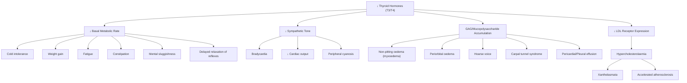

# Hypothyroidism

## 1. Definition

"Hypothyroidism" — let's break down the word: **"hypo"** = under/below, **"thyroid"** = the thyroid gland, **"-ism"** = a state or condition. So it literally means **a state of under-functioning of the thyroid gland**.

Hypothyroidism is a clinical syndrome resulting from a **deficiency of thyroid hormones** (T3 and T4), leading to a **generalised slowing of metabolic processes**. This deficiency may arise from disease of the thyroid gland itself (primary), from failure of the pituitary to secrete adequate TSH (secondary), or rarely from hypothalamic dysfunction (tertiary) [1][2].

<Callout title="Key Distinction: Hypothyroidism vs Myxoedema">
**Myxoedema** (myxo = mucus, oedema = swelling) refers specifically to the **severe form of hypothyroidism** characterised by the accumulation of mucopolysaccharides (particularly hyaluronic acid) in the dermis and subcutis, causing non-pitting oedema. It is NOT synonymous with hypothyroidism — it is the end-stage clinical manifestation. **Myxoedema coma** is the life-threatening decompensated form.
</Callout>

<Callout title="Hypothyroidism vs Thyrotoxicosis — Get the Definitions Right" type="error">
- ***Thyrotoxicosis*** = the state of thyroid hormone excess (from ANY cause) [1]
- ***Hyperthyroidism*** = excess thyroid hormone production due to excess thyroid gland function specifically [1]
- ***Hypothyroidism*** = deficiency of thyroid hormones [1]
- High iodine intake → associated with hyperthyroidism [1]
- ***Iodine deficiency → associated with hypothyroidism*** [1]

These are NOT interchangeable. Thyrotoxicosis is broader than hyperthyroidism (e.g. exogenous T4 overdose causes thyrotoxicosis but NOT hyperthyroidism).
</Callout>

---

## 2. Epidemiology

### Prevalence
- Hypothyroidism is one of the **most common endocrine disorders worldwide**
- **Overt hypothyroidism**: prevalence ~1–2% in women, ~0.1–0.2% in men
- **Subclinical hypothyroidism** (elevated TSH, normal fT4): much more common, ~4–10% of the general population, increasing with age
- Female:Male ratio ≈ **5–8:1** — the strong female predominance is because autoimmune diseases (the leading cause in iodine-sufficient areas) are far more common in women

### Age Distribution
- Incidence increases with age — peaks in the **5th–7th decade**
- However, congenital hypothyroidism is an important neonatal condition (incidence ~1 in 3,000–4,000 live births)

### Geographic Considerations (Focus on Hong Kong)
- Hong Kong is an **iodine-sufficient region** (due to dietary intake of seafood and iodized salt)
- Therefore, the **most common cause** in Hong Kong is **autoimmune thyroiditis** (Hashimoto's thyroiditis), NOT iodine deficiency
- Globally, **iodine deficiency remains the most common cause** of hypothyroidism (particularly in developing nations, mountainous regions)
- Iatrogenic hypothyroidism is increasingly common (post-radioactive iodine therapy for Graves' disease, post-thyroidectomy for thyroid cancer or multinodular goitre) [2][3]

---

## 3. Anatomy and Function of the Thyroid Gland

### Gross Anatomy
- The thyroid is a **butterfly-shaped** endocrine gland located in the anterior neck
- It consists of **two lateral lobes** connected by an **isthmus** that overlies tracheal rings 2–4
- A **pyramidal lobe** (remnant of the thyroglossal duct) may be present in ~50% of individuals, extending superiorly from the isthmus
- The gland weighs approximately **15–25 g** in adults
- ***It moves with swallowing*** (because it is invested by the pretracheal fascia which is attached to the tracheal cartilages) — this is a key clinical sign distinguishing thyroid masses from other neck lumps [3][4]

### Vascular Supply
- **Superior thyroid artery** — first branch of the external carotid artery (supplies the upper poles)
- **Inferior thyroid artery** — branch of the thyrocervical trunk (from the subclavian artery; supplies the lower poles and ALL FOUR parathyroid glands) [2]
- **Thyroid ima artery** — present in ~3% of individuals, arises from brachiocephalic trunk or aortic arch directly
- Venous drainage: superior and middle thyroid veins → internal jugular vein; inferior thyroid veins → brachiocephalic veins

### Nerve Relations (Surgically Critical)
- ***Recurrent laryngeal nerve (RLN)***: runs in the tracheo-oesophageal groove, closely related to the inferior thyroid artery at the level of Berry's ligament. Injury → ***hoarseness*** (unilateral) or ***airway obstruction*** (bilateral, because 6 adductors > 2 abductors) [2][3]
- ***External branch of the superior laryngeal nerve (EBSLN)***: runs with the superior thyroid artery near the upper pole. Injury → loss of high-pitch voice, poor volume, easy voice fatigue [2]

### Parathyroid Glands
- Four parathyroid glands lie posterior to the thyroid lobes
- ***Superior parathyroids***: derived from the 4th pharyngeal pouch, more constant position (shorter migration distance) [2]
- ***Inferior parathyroids***: derived from the 3rd pharyngeal pouch, more variable position (longer migration distance) [2]
- ALL supplied by the **inferior thyroid artery** [2]
- Damage during thyroidectomy → **hypoparathyroidism** → hypocalcaemia (the most common complication of total thyroidectomy, usually transient) [2]

### Histology
- The functional unit is the **thyroid follicle**: a sphere of follicular epithelial cells surrounding a central lumen filled with **colloid** (thyroglobulin-rich)
- **Follicular cells**: produce T3 and T4
- **Parafollicular C cells**: produce calcitonin; located in the interstitium between follicles. These are the cells of origin for **medullary thyroid carcinoma** [3]

### Thyroid Hormone Physiology

#### The Hypothalamic–Pituitary–Thyroid (HPT) Axis
1. **Hypothalamus** secretes **TRH** (thyrotropin-releasing hormone)
2. TRH stimulates the **anterior pituitary** (thyrotrophs) to secrete **TSH** (thyroid-stimulating hormone)
3. TSH stimulates the **thyroid gland** to synthesise and release **T4** (thyroxine) and **T3** (triiodothyronine)
4. T3 and T4 exert **negative feedback** on both the hypothalamus (↓TRH) and the pituitary (↓TSH)

> This negative feedback loop is the basis of thyroid function test interpretation:
> - **Primary hypothyroidism** → low T4 → loss of negative feedback → **↑TSH** (the pituitary "shouts louder")
> - **Secondary hypothyroidism** → pituitary failure → **low/inappropriately normal TSH** + low T4

#### Thyroid Hormone Synthesis (Simplified)
1. **Iodide trapping**: Follicular cells actively uptake iodide from blood via the **sodium-iodide symporter (NIS)** on the basolateral membrane
2. **Oxidation and organification**: Iodide is oxidised by **thyroid peroxidase (TPO)** and incorporated into tyrosine residues on thyroglobulin → forming MIT (monoiodotyrosine) and DIT (diiodotyrosine)
3. **Coupling**: MIT + DIT → **T3**; DIT + DIT → **T4** (still bound to thyroglobulin within colloid)
4. **Endocytosis and proteolysis**: Thyroglobulin is endocytosed back into the cell and cleaved → releasing T3 and T4 into the bloodstream
5. **Peripheral conversion**: ~80% of circulating T3 is produced by **peripheral deiodination of T4** by deiodinases (mainly in the liver and kidneys). T3 is **3–5× more biologically active** than T4.

> Why is this important? Because drugs like **amiodarone** (which contains ~37% iodine by weight) and **lithium** interfere with these steps — amiodarone causes both thyrotoxicosis AND hypothyroidism via the Wolff-Chaikoff effect and Jod-Basedow effect, while lithium blocks thyroid hormone release [1].

#### Thyroid Hormone Actions
Thyroid hormones act on **virtually every tissue** in the body by binding to nuclear thyroid hormone receptors, affecting gene transcription. Key effects:

| System | Effect of Thyroid Hormones | Consequence of Deficiency (Hypothyroidism) |
|---|---|---|
| **Metabolic** | ↑ Basal metabolic rate, ↑ O₂ consumption, ↑ heat production | Cold intolerance, weight gain, fatigue |
| **Cardiovascular** | ↑ HR, ↑ contractility, ↓ SVR | Bradycardia, ↓ cardiac output, diastolic HTN |
| **GI** | ↑ Gut motility | Constipation, ↓ appetite |
| **Neurological** | Required for CNS development (neonatal), ↑ synaptic transmission | Mental sluggishness, depression, cretinism (neonatal) |
| **Musculoskeletal** | Normal muscle function, bone turnover | Proximal myopathy, delayed relaxation of reflexes |
| **Haematological** | Supports erythropoiesis | Anaemia (multiple mechanisms) |
| **Reproductive** | Normal ovulatory cycles | Menorrhagia, anovulation, infertility |
| **Dermatological** | Normal skin turnover, sweat gland function | Dry, coarse skin; hair loss |
| **Lipid metabolism** | ↑ LDL receptor expression → ↑ LDL clearance | Hypercholesterolaemia |

---

## 4. Etiology

### Classification of Causes [1]

| Classification | Causes | Pathophysiology |
|---|---|---|
| **Primary hypothyroidism** (95% of cases; problem is in the thyroid gland itself) | **Iodine deficiency** | Insufficient substrate for thyroid hormone synthesis. The most common cause GLOBALLY, but NOT in Hong Kong |
| | ***Autoimmune hypothyroidism*** | |
| | • **Hashimoto's thyroiditis** (chronic lymphocytic thyroiditis) | Anti-TPO and anti-thyroglobulin antibodies → lymphocytic infiltration → gradual destruction of follicular cells → progressive hypothyroidism. **Most common cause in iodine-sufficient areas (including Hong Kong)** |
| | • **Atrophic thyroiditis** | TSH receptor-blocking antibodies → thyroid atrophy. Unlike Hashimoto's, NO goitre (gland atrophies instead of enlarging) |
| | **Congenital hypothyroidism** | |
| | • Thyroid gland dysgenesis (80–85%) | Agenesis, ectopia, or hypoplasia of the thyroid gland — most commonly due to mutations in transcription factors (PAX8, TTF-1/2) [1] |
| | • Dyshormonogenesis (10–15%) | Inherited enzyme defects in thyroid hormone synthesis (e.g. TPO deficiency, Pendred syndrome = TPO + sensorineural deafness) [1] |
| | • TSH-R antibody-mediated (5%) | Maternal TSH receptor-blocking antibodies cross the placenta [1] |
| | **Infiltrative hypothyroidism** | |
| | • Sarcoidosis | Granulomatous infiltration of thyroid tissue → destruction of follicles [1] |
| | • Amyloidosis | Amyloid deposition in thyroid stroma |
| | • Scleroderma | Fibrosis of thyroid gland |
| | • **Riedel's thyroiditis** | Dense fibrosis replacing thyroid tissue ("woody hard" thyroid) — very rare [1] |
| | ***Drug-induced hypothyroidism*** | |
| | • ***Amiodarone*** | Contains 37% iodine by weight. The massive iodine load can cause a sustained **Wolff-Chaikoff effect** (excess iodine → inhibition of organification → ↓ T3/T4). Also directly toxic to thyroid cells [1] |
| | • ***Lithium*** | Inhibits thyroid hormone release and may inhibit coupling. Also promotes autoimmunity [1] |
| | • Interferon-alpha, IL-2 | Can trigger autoimmune thyroiditis |
| | • Tyrosine kinase inhibitors (sunitinib, sorafenib) | Destructive thyroiditis; also ↑ T4 clearance |
| | • Immune checkpoint inhibitors (nivolumab, pembrolizumab) | Immune-related thyroiditis — increasingly common in oncology practice |
| | ***Iatrogenic hypothyroidism*** | |
| | • ***131-I (radioactive iodine) treatment*** | Radiation destroys thyroid follicular cells. Hypothyroidism is expected and often the goal of RAI treatment for Graves' disease [1][2] |
| | • ***Subtotal or total thyroidectomy*** | Physical removal of thyroid tissue [1][2] |
| | • ***External irradiation of neck*** | Radiation for head & neck cancers, lymphoma, childhood leukaemia [1][3] |
| **Secondary hypothyroidism** (Central; ~5%) | ***Hypothalamic disease*** | |
| | • Hypothalamic tumours | Destruction of TRH-secreting neurons → ↓ TRH → ↓ TSH [1] |
| | • Trauma, infiltrative disorders | |
| | ***Hypopituitarism*** | |
| | • Pituitary tumour (most common cause) | Mass effect compressing thyrotrophs → ↓ TSH [1] |
| | • Pituitary surgery or irradiation | Destruction of thyrotrophs [1] |
| | • ***Sheehan's syndrome*** | Post-partum pituitary necrosis due to haemorrhagic shock — the enlarged pituitary during pregnancy is vulnerable to ischaemia [1] |
| | • Trauma, infiltrative disorders | |
| | • ***Thyrotroph hyperplasia*** from longstanding primary hypothyroidism can enlarge the pituitary, mimicking a tumour [1][5] |
| **Transient hypothyroidism** | ***Subacute (De Quervain's) thyroiditis*** | Viral infection → granulomatous inflammation → destruction of follicles → initial thyrotoxic phase (leak of preformed hormone) → hypothyroid phase → recovery. The hypothyroid phase is typically self-limiting [1] |
| | ***Silent thyroiditis*** (including ***post-partum thyroiditis***) | Autoimmune, painless. Same triphasic pattern as above. Post-partum thyroiditis occurs within 12 months of delivery [1] |
| | Withdrawal of supraphysiologic T4 treatment | Chronic exogenous T4 suppresses the HPT axis → abrupt withdrawal → temporary hypothyroidism until axis recovers [1] |
| | Post-131I treatment (early phase) | Thyroiditis from radiation → transient hypothyroidism before recovery or permanent damage [1] |
| | Post-subtotal thyroidectomy (early phase) | [1] |

<Callout title="Hong Kong Focus" type="idea">
In Hong Kong, the **top causes** to remember are:
1. **Hashimoto's thyroiditis** — the #1 cause in our iodine-sufficient population
2. **Iatrogenic** — post-thyroidectomy (very common given the surgical volume for thyroid cancer and MNG) and post-radioactive iodine for Graves' disease
3. **Drug-induced** — amiodarone (Hong Kong's ageing population with atrial fibrillation), lithium (psychiatry), immune checkpoint inhibitors (increasing use in oncology)
4. **Post-partum thyroiditis** — common and often missed
</Callout>

### Focus on Key Aetiologies

#### Hashimoto's Thyroiditis (Chronic Lymphocytic Thyroiditis)
- **Most important cause of hypothyroidism in iodine-sufficient areas**
- Named after Hakaru Hashimoto (1912) who first described lymphocytic infiltration of the thyroid
- **Pathophysiology**: CD4+ T-helper cell mediated; anti-TPO antibodies (>90%) and anti-thyroglobulin antibodies → complement activation, antibody-dependent cell-mediated cytotoxicity, and direct cytotoxic T cell attack on thyroid follicular cells → progressive glandular destruction
- Initially may present with a **goitre** (due to lymphocytic infiltration and attempted compensatory growth driven by elevated TSH) → eventually atrophies in many patients
- Histology: **lymphocytic infiltration** with germinal centre formation, **Hürthle cell (oxyphilic) metaplasia**, fibrosis
- Associations: other autoimmune conditions (T1DM, Addison's, pernicious anaemia, vitiligo, coeliac disease) — part of **autoimmune polyglandular syndromes**
- ***Association with thyroid lymphoma*** — Hashimoto's is a risk factor for primary thyroid lymphoma (usually MALT-type or diffuse large B-cell lymphoma) [3]
- Risk factor for **follicular carcinoma** in iodine-deficient areas [3]

#### Amiodarone-Induced Hypothyroidism (AIH)
- Amiodarone is a class III antiarrhythmic, very commonly used in Hong Kong
- Contains ~37% iodine by weight → each 200 mg tablet delivers ~75 mg of iodine (daily requirement is only ~150 μg!)
- **Wolff-Chaikoff effect**: the massive iodine load causes acute inhibition of TPO-mediated organification → decreased T3/T4 synthesis
- In a normal thyroid, this effect is transient ("escape from Wolff-Chaikoff") → but in patients with underlying thyroid disease (e.g. subclinical Hashimoto's), the gland fails to escape → **persistent hypothyroidism**
- AIH is more common in iodine-**sufficient** areas (like Hong Kong)
- Distinguish from **amiodarone-induced thyrotoxicosis (AIT)** which is more common in iodine-deficient areas

#### Congenital Hypothyroidism
- Screened for in neonatal screening programmes (heel prick test measuring TSH) — **universal screening** is practised in Hong Kong
- Early detection is critical because thyroid hormones are essential for CNS development in the first 2–3 years of life
- Untreated → ***cretinism***: mental retardation, short stature, puffy face, deaf mutism, protuberant abdomen, umbilical hernia [1]

---

## 5. Classification

### By Level of HPT Axis Dysfunction

| Type | Site of Pathology | TSH | fT4 | fT3 |
|---|---|---|---|---|
| **Primary** (95%) | Thyroid gland | **↑↑** | **↓** | ↓ |
| **Secondary** (Central) | Pituitary | **↓ or inappropriately normal** | **↓** | ↓ |
| **Tertiary** (Central) | Hypothalamus | ↓ or inappropriately normal | ↓ | ↓ |

> The distinction between secondary and tertiary is largely academic and often grouped as "central hypothyroidism." In practice, what matters is: is the TSH appropriately elevated (primary) or not (central)?

### By Severity

| Severity | Definition | Clinical Significance |
|---|---|---|
| **Subclinical hypothyroidism** | ↑ TSH + **normal** fT4 | The thyroid is failing but compensating. TSH is working overtime to maintain fT4. Patient may be asymptomatic or have subtle symptoms. Important to decide who to treat (see Management later). |
| **Overt (clinical) hypothyroidism** | ↑ TSH + **↓** fT4 | Symptomatic. Requires treatment. |
| **Myxoedema coma** | Severe decompensated hypothyroidism with altered consciousness, hypothermia, cardiovascular collapse | Medical emergency. Mortality 20–60%. |

### By Duration

| Duration | Example |
|---|---|
| **Transient** | Subacute thyroiditis, post-partum thyroiditis, post-RAI (early), drug withdrawal |
| **Permanent** | Hashimoto's (advanced), post-total thyroidectomy, post-RAI (late), congenital dysgenesis |

---

## 6. Clinical Features

The clinical features of hypothyroidism are the **mirror image** of thyrotoxicosis. They all stem from one core problem: **generalised slowing of metabolic processes** due to thyroid hormone deficiency.

Think of it this way: thyroid hormones are the body's "accelerator pedal." In hypothyroidism, you've taken your foot off the accelerator. Everything slows down — heart rate, gut motility, mental processing, metabolic rate, reflexes.

### Symptoms

| System | Symptom | Pathophysiological Basis |
|---|---|---|
| **General** | ***Cold intolerance*** | ↓ BMR → ↓ thermogenesis. The body produces less heat. (Opposite of the heat intolerance in thyrotoxicosis) [1] |
| | ***Weight gain with loss of appetite*** | ↓ BMR → fewer calories burned, but appetite is also reduced (paradoxical weight gain). Much of the weight gain is actually fluid retention (myxoedema) rather than fat [1] |
| | ***Fatigue and lethargy*** | ↓ metabolic activity in all tissues → reduced energy production [1] |
| | ***Mental and physical sluggishness*** | ↓ CNS metabolic rate → slow mentation, poor concentration, memory impairment [1] |
| **Neuropsychiatric** | Depression | ↓ serotonin and noradrenaline turnover in CNS due to reduced metabolic activity |
| | Psychosis ("myxoedema madness") | Severe hypothyroidism can cause frank psychosis — always check TFTs in new-onset psychosis |
| | Cognitive impairment / dementia-like picture | Reversible with treatment — important DDx of "dementia" in the elderly |
| | Somnolence | ↓ CNS arousal |
| **Cardiovascular** | ***Bradycardia*** | ↓ chronotropic effect. T3 normally upregulates β1-adrenergic receptors and Na/K-ATPase in cardiomyocytes → in hypothyroidism, heart rate drops [1] |
| | Exertional dyspnoea | ↓ cardiac output |
| **GI** | ***Constipation*** | ↓ gut motility due to ↓ metabolic drive to smooth muscle. Can progress to ileus or even megacolon in severe cases [1] |
| | ↓ Appetite | Despite weight gain |
| **Reproductive** | ***Menorrhagia*** (heavy periods) | ↓ thyroid hormone → altered GnRH pulsatility → anovulatory cycles. Also ↓ levels of clotting factors. Menorrhagia can cause iron-deficiency anaemia |
| | Infertility, oligomenorrhoea or amenorrhoea (in severe cases) | ↑ TRH → ↑ prolactin (TRH stimulates prolactin release) → suppresses GnRH → hypogonadotrophic hypogonadism |
| | ↓ Libido, erectile dysfunction | ↑ prolactin effect + general metabolic slowing |
| **Musculoskeletal** | Muscle aches, cramps, stiffness | Accumulation of glycosaminoglycans in muscle, ↓ muscle metabolism |
| | ***Proximal myopathy*** | ↓ oxidative metabolism in muscle → weakness (test by asking patient to raise arms above head or stand from squatting) [1] |
| **Skin/Hair** | Dry, coarse skin | ↓ sweat and sebaceous gland activity |
| | Hair loss (diffuse alopecia) | ↓ hair follicle cycling |
| | Brittle nails | ↓ nail matrix activity |
| **Voice** | ***Hoarse, deep voice*** | Myxoedematous infiltration of vocal cords and laryngeal mucosa [1] |

<Callout title="The Paradox of Weight Gain with Loss of Appetite" type="idea">
Students often ask: "How can you gain weight if you're eating less?" The answer is that the **reduction in metabolic rate is proportionally greater** than the reduction in caloric intake. Also, much of the "weight gain" is **water and glycosaminoglycan accumulation** (myxoedema) rather than true adipose tissue gain [1].
</Callout>

### Signs

| Location | Sign | Pathophysiological Basis |
|---|---|---|
| **General** | ***Slow, nasal, and deep voice*** | Myxoedematous thickening of vocal cords and pharyngeal/nasal mucosa [1] |
| | Hypothermia | ↓ thermogenesis |
| | Obesity/overweight | ↓ BMR |
| **Hands** | ***Peripheral cyanosis*** | ***↓ cardiac output*** → poor peripheral perfusion → deoxygenation of peripheral blood [1] |
| | ***Palmar crease pallor*** | ***Anaemia*** — this is multifactorial [1]: |
| | | 1. **Anaemia of chronic disease** (most common) — cytokine-mediated ↓ erythropoiesis |
| | | 2. **Iron deficiency anaemia** — from menorrhagia |
| | | 3. **Folate deficiency anaemia** — from bacterial overgrowth (↓ gut motility → stasis → bacterial overgrowth → folate consumption) |
| | | 4. **Pernicious anaemia** — from associated autoimmune gastritis (anti-intrinsic factor antibodies) |
| | ***Dry and cool skin*** | ↓ sweat gland activity (cool) + ↓ sebaceous activity (dry) [1] |
| | ***Yellow discoloration (carotenodermia)*** | ***Hypercarotenaemia*** — hepatic metabolism of carotene is slowed down in hypothyroidism → carotene accumulates in the skin [1]. Note: this is NOT jaundice (sclerae are NOT yellow in carotenodermia) |
| | ***Abnormal pulse*** — ***small volume***, bradycardic | ↓ stroke volume + ↓ heart rate [1] |
| | ***Carpal tunnel syndrome*** | ***Sensory loss as the carpal tunnel is thickened in myxoedema*** — glycosaminoglycan deposition in the transverse carpal ligament and surrounding tissues compresses the median nerve [1] |
| | Doughy, thickened skin | Mucopolysaccharide deposition in dermis |
| **Arms** | ***Proximal myopathy*** | ***Test by raising arms above the head*** [1] — weakness of shoulder girdle muscles due to ↓ oxidative metabolism |
| | ***"Hung-up" biceps reflex*** | Delayed relaxation phase of deep tendon reflexes — the muscle contracts normally but the relaxation (which depends on ATP-dependent calcium reuptake into the sarcoplasmic reticulum) is slowed because metabolic processes are slowed [1] |
| **Legs** | ***Non-pitting oedema (myxoedema)*** | Accumulation of **hyaluronic acid and other glycosaminoglycans** in the dermis and subcutis → these attract water by osmosis → but the water is trapped within a gel-like matrix, so the oedema does NOT pit on pressure [1] |
| | ***"Hung-up" Achilles reflex*** | ***Rapid dorsiflexion followed by slow plantar flexion after the tendon is tapped*** — same mechanism as above (delayed relaxation). This is a very specific sign of hypothyroidism [1] |
| | Pretibial myxoedema (non-pitting) | Same mechanism — note: **pretibial myxoedema** is classically associated with **Graves' disease** (an autoimmune phenomenon), but non-pitting oedema in hypothyroidism from ANY cause occurs due to GAG deposition |
| **Eyes** | ***Periorbital oedema*** | Myxoedematous infiltration of periorbital tissues [1] |
| | ***Loss or thinning of outer third of eyebrows*** ("Queen Anne sign" / "Hertoghe sign") | Unknown exact mechanism, but believed to be due to ↓ hair follicle metabolism in this region [1] |
| | ***Xanthelasmata*** | ***Due to associated hypercholesterolaemia*** — thyroid hormones normally upregulate hepatic LDL receptors. In hypothyroidism, LDL clearance ↓ → LDL accumulates → cholesterol deposits around the eyes [1] |
| **Neck** | ***Goitre*** | ***Compensatory over-secretion of TSH*** — in primary hypothyroidism, low T4 → ↑ TSH → TSH stimulates thyroid growth → goitre. Note: NOT all causes of hypothyroidism cause goitre (e.g. atrophic thyroiditis causes gland shrinkage, post-thyroidectomy obviously has no gland) [1] |
| | ***Thyroidectomy scar*** | Assess for iatrogenic hypothyroidism (and also assess for ***hypoparathyroidism***) [1][2] |
| **Chest** | ***Pericardial effusion*** | ↑ capillary permeability + ↓ lymphatic drainage + GAG deposition → fluid accumulation in pericardial space. Usually slow-accumulating → rarely causes tamponade [1] |
| | ***Pleural effusion*** | Same mechanism as pericardial effusion [1] |
| **Skin (general)** | ***Myxoedema*** — pink, brown, or skin-coloured non-pitting oedema | ***Hyaluronic acid accumulates in dermis and subcutis*** [1] |
| | Dry, coarse, flaky skin | ↓ sweat and sebaceous gland function |
| | Sparse, coarse hair | ↓ follicular activity |
| | Periorbital puffiness | GAG deposition |
| **Newborn** | ***Cretinism*** features | ***Short stature, mental retardation, puffy face, deaf mutism, protuberant abdomen, umbilical hernia*** — T3/T4 are essential for CNS myelination and skeletal maturation in the first 2–3 years of life; deficiency causes irreversible damage [1] |

<Callout title="Hung-up Reflexes — Why?" type="idea">
The delayed relaxation phase is one of the most specific signs of hypothyroidism. Here's the mechanism:

Muscle relaxation requires **calcium reuptake** back into the sarcoplasmic reticulum via **SERCA (sarco/endoplasmic reticulum Ca²⁺-ATPase)**. This pump is ATP-dependent. In hypothyroidism, ↓ metabolic rate → ↓ ATP production → ↓ SERCA activity → calcium stays in the cytoplasm longer → the muscle stays contracted longer → **delayed relaxation**.

The Achilles tendon reflex (ankle jerk) is the easiest to assess: you tap the tendon, the foot dorsiflexes briskly (normal contraction phase), but then the foot descends back **very slowly** (delayed relaxation phase).
</Callout>

<Callout title="Why Does Hypothyroidism Cause Hypercholesterolaemia?">
Thyroid hormones (especially T3) **upregulate the expression of hepatic LDL receptors**. When T3 is deficient:
- ↓ LDL receptors on hepatocytes
- ↓ Clearance of LDL-cholesterol from the blood
- → **↑ Total cholesterol and ↑ LDL-cholesterol**

This is clinically significant because:
1. It causes **xanthelasmata** (cholesterol deposits around the eyes)
2. It is an **accelerated atherosclerosis** risk factor
3. It should be **corrected by treating the hypothyroidism** before starting a statin — always check TFTs in a patient with new-onset dyslipidaemia!
</Callout>

<Callout title="Distinguishing Causes by Goitre Presence" type="idea">

| Hypothyroidism WITH goitre | Hypothyroidism WITHOUT goitre |
|---|---|
| Hashimoto's thyroiditis (early) | Atrophic thyroiditis |
| Iodine deficiency | Post-thyroidectomy |
| Dyshormonogenesis | Post-radioactive iodine |
| Drug-induced (lithium, amiodarone) | Pituitary/hypothalamic disease |
| Infiltrative (Riedel's) | Late-stage Hashimoto's (burnt out) |

The presence or absence of a goitre helps narrow the differential.
</Callout>

### Special Clinical Scenarios

#### Subclinical Hypothyroidism
- ↑ TSH + normal fT4
- Patient may be completely **asymptomatic** or have very subtle symptoms (mild fatigue, slight weight gain)
- Important because:
  - ~2–5% per year progress to overt hypothyroidism (higher if anti-TPO antibodies positive)
  - Associated with adverse cardiovascular outcomes (dyslipidaemia, endothelial dysfunction)
  - Treatment decision depends on TSH level, symptoms, age, and antibody status (discussed in Management)

#### Hypothyroidism in Pregnancy
- Untreated maternal hypothyroidism is associated with:
  - Pre-eclampsia, placental abruption, post-partum haemorrhage
  - **Impaired fetal neurocognitive development** (IQ reduction)
  - Miscarriage, preterm delivery
- TSH targets in pregnancy are trimester-specific (generally lower than non-pregnant reference ranges)

#### Myxoedema Coma
- The most severe, life-threatening manifestation
- Precipitants: cold exposure, infection, sedatives, surgery, non-compliance with thyroxine
- Features: **hypothermia**, altered consciousness/coma, bradycardia, hypotension, hypoventilation, hyponatraemia (↓ free water clearance due to ↑ ADH)
- Mortality 20–60% even with treatment

---

## 7. Systems-Based Summary of Pathophysiology → Clinical Features

---

<Callout title="High Yield Summary">

**Definition**: Hypothyroidism = deficiency of thyroid hormones (T3/T4) → generalised metabolic slowing.

**Key Distinctions**: Primary (95%; thyroid gland problem, ↑TSH) vs Central/Secondary (5%; pituitary/hypothalamic, low/normal TSH). Subclinical (↑TSH, normal fT4) vs Overt (↑TSH, ↓fT4).

**Most common cause globally**: Iodine deficiency. **In Hong Kong**: Hashimoto's thyroiditis (autoimmune).

**Hashimoto's**: Anti-TPO + anti-Tg antibodies → lymphocytic destruction → goitre (early) → atrophy (late). Associated with other autoimmune diseases and thyroid lymphoma.

**Drug causes**: Amiodarone (Wolff-Chaikoff effect), Lithium (blocks release), Checkpoint inhibitors (immune thyroiditis).

**Iatrogenic**: Post-thyroidectomy, post-RAI, post-external neck irradiation — very common in HK.

**Cardinal symptoms**: Cold intolerance, weight gain (with ↓ appetite), fatigue, constipation, menorrhagia, mental sluggishness, hoarse voice, dry skin.

**Cardinal signs**: Bradycardia, non-pitting oedema (myxoedema), hung-up reflexes (delayed relaxation), periorbital oedema, thinning of outer 1/3 eyebrows, yellow skin (carotenodermia NOT jaundice), carpal tunnel syndrome, goitre (if primary with intact gland), dry/cool/coarse skin.

**Anaemia in hypothyroidism is multifactorial**: ACD, iron deficiency (menorrhagia), folate deficiency (bacterial overgrowth), pernicious anaemia (autoimmune association).

**Hypercholesterolaemia**: ↓ LDL receptors → ↓ LDL clearance → ↑ cholesterol → xanthelasmata, accelerated atherosclerosis. Always check TFTs before starting a statin for new dyslipidaemia.

**Myxoedema coma**: Most severe form. Hypothermia + altered consciousness + cardiovascular collapse. Medical emergency.

**Congenital hypothyroidism**: Universal neonatal screening (HK). Untreated → cretinism (irreversible mental retardation, short stature, deaf mutism).
</Callout>

---

<ActiveRecallQuiz
  title="Active Recall - Hypothyroidism: Definition, Epidemiology, Etiology and Clinical Features"
  items={[
    {
      question: "What is the most common cause of hypothyroidism in Hong Kong, and what antibodies are characteristically found?",
      markscheme: "Hashimoto's thyroiditis (chronic lymphocytic thyroiditis). Anti-TPO antibodies (>90%) and anti-thyroglobulin antibodies. Hong Kong is iodine-sufficient so autoimmune cause predominates over iodine deficiency."
    },
    {
      question: "Explain the pathophysiology of the 'hung-up' Achilles reflex in hypothyroidism.",
      markscheme: "Delayed relaxation phase. Muscle relaxation requires ATP-dependent calcium reuptake into the sarcoplasmic reticulum via SERCA pump. In hypothyroidism, decreased metabolic rate leads to decreased ATP production, slower SERCA activity, prolonged cytoplasmic calcium, and thus delayed muscle relaxation after contraction."
    },
    {
      question: "A patient with hypothyroidism has yellow skin. How do you distinguish this from jaundice, and what is the mechanism?",
      markscheme: "Carotenodermia (hypercarotenaemia), NOT jaundice. Key distinguishing feature: sclerae are NOT yellow in carotenodermia (they are yellow in jaundice). Mechanism: hypothyroidism slows hepatic metabolism of carotene, leading to carotene accumulation in the skin."
    },
    {
      question: "List four mechanisms by which hypothyroidism can cause anaemia.",
      markscheme: "1) Anaemia of chronic disease (most common, cytokine-mediated decreased erythropoiesis). 2) Iron deficiency anaemia (from menorrhagia). 3) Folate deficiency (bacterial overgrowth from decreased gut motility). 4) Pernicious anaemia / B12 deficiency (associated autoimmune gastritis with anti-intrinsic factor antibodies)."
    },
    {
      question: "Explain why amiodarone causes hypothyroidism and state in which population this is more common.",
      markscheme: "Amiodarone contains 37% iodine by weight. Massive iodine load causes sustained Wolff-Chaikoff effect: excess iodine inhibits TPO-mediated organification of iodide, decreasing T3/T4 synthesis. Normal thyroid escapes this effect, but patients with underlying thyroid disease (e.g. subclinical Hashimoto's) fail to escape. Amiodarone-induced hypothyroidism is more common in iodine-SUFFICIENT areas (like Hong Kong)."
    },
    {
      question: "Why does hypothyroidism cause hypercholesterolaemia, and what clinical signs may result?",
      markscheme: "T3 normally upregulates hepatic LDL receptor expression. In hypothyroidism, decreased T3 leads to decreased LDL receptors on hepatocytes, decreased LDL clearance from blood, and elevated total/LDL cholesterol. Clinical signs: xanthelasmata (cholesterol deposits around the eyes), and accelerated atherosclerosis. Always check TFTs before starting statins for new dyslipidaemia."
    }
  ]}
/>

## References

[1] Senior notes: felixlai.md (Sections on Hypothyroidism: Definitions, Etiology, Classical Features)
[2] Senior notes: maxim.md (Sections on Thyroid surgery complications, Thyroid anatomy, Parathyroid)
[3] Lecture slides: GC 177. A thyroid nodule benign thyroid nodules; thyroid cancer.pdf
[4] Lecture slides: GC 218. I have a swelling in the neck Neck mass (Notes).pdf
[5] Senior notes: felixlai.md (Pituitary adenomas and sellar masses section)
