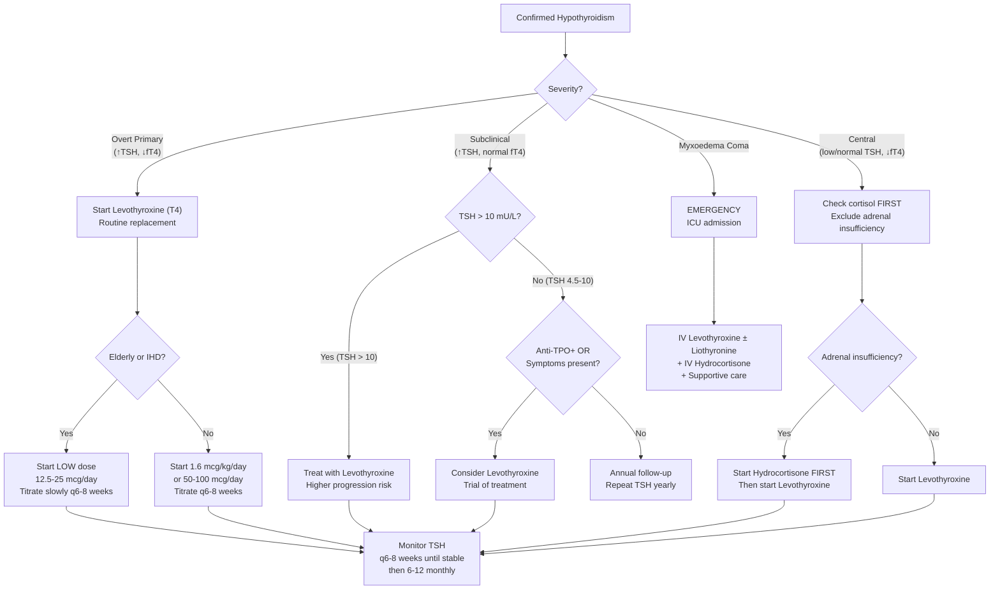

## Management of Hypothyroidism

### A. Guiding Principles — Why We Treat and How We Think About It

The management of hypothyroidism is conceptually straightforward: **replace what's missing**. The thyroid gland isn't making enough T4 and T3, so we give exogenous thyroid hormone. But the nuances — *who* to treat, *how much* to give, *how fast* to start, and *what to watch out for* — are where clinical wisdom lies.

Key management decisions depend on:
1. **Severity**: Overt vs subclinical vs myxoedema coma
2. **Aetiology**: Permanent (Hashimoto's, post-thyroidectomy) vs transient (post-partum thyroiditis, subacute thyroiditis)
3. **Patient factors**: Age, cardiovascular disease, pregnancy, coexisting adrenal insufficiency
4. **Context**: Primary vs central hypothyroidism (the latter demands cortisol replacement first)

---

### B. Management Algorithm

---

### C. Treatment Modalities

#### 1. Levothyroxine (T4) — The Mainstay

"Levothyroxine" — let's break it down: "levo" = left-handed (the L-isomer, which is the biologically active form), "thyroxine" = T4. This is synthetic T4, identical to what the thyroid gland produces.

| Aspect | Detail |
|---|---|
| **Drug** | ***Levothyroxine (T4)*** |
| ***Indication*** | ***Routine replacement therapy — for hypothyroidism of any cause*** [1] |
| **Why T4 and not T3?** | ***Due to its longer half-life (t½)*** — T4 has a half-life of ~7 days vs T3's ~1 day. This means ***take once daily only*** with stable serum levels throughout the day [1]. T4 is also a "pro-hormone" that is peripherally converted to the more active T3 by deiodinases, providing a steady, physiological supply of T3 to all tissues |
| **Starting dose** | Young, otherwise healthy adults: **1.6 mcg/kg/day** (typically 50–100 mcg/day) |
| | ***Elderly or patients with IHD***: **Start LOW — 12.5–25 mcg/day** and increase by 12.5–25 mcg every 6–8 weeks. Why? Because suddenly increasing the metabolic rate in a patient with coronary artery disease increases myocardial oxygen demand → can precipitate angina, arrhythmias, or MI |
| **Administration** | Take on an **empty stomach**, 30–60 minutes before breakfast (or at bedtime, 3+ hours after last meal). Why? Because food, calcium, iron, and PPI reduce absorption |
| **Target** | Normalise **TSH** to within the reference range (0.4–4.0 mU/L; often aim for 0.5–2.5 mU/L in most patients) |
| **Monitoring** | Check TSH **6–8 weeks** after starting or dose adjustment (it takes this long for the HPT axis to re-equilibrate). Once stable, check TSH **every 6–12 months** |

##### Adverse Effects of Levothyroxine [1]

These are really the consequences of **over-replacement** (iatrogenic thyrotoxicosis) or **under-recognised contraindications**:

| Adverse Effect | Mechanism | Detail |
|---|---|---|
| ***Acute adrenal crisis*** | ***↑ Metabolic clearance of adrenocortical hormones → ↓ cortisol and aldosterone*** | ***Contraindicated in patient with adrenal insufficiency*** — T4 increases the metabolic rate including cortisol metabolism. If the patient already has low cortisol (e.g. panhypopituitarism, Addison's), starting T4 depletes it further → **Addisonian crisis** (hypotension, shock, death) [1] |
| ***Deterioration of CVS disease by thyrotoxicosis*** | ***↑ Workload of heart and worsens ischaemic symptoms*** | ***Angina / Arrhythmias / Cardiac failure*** — over-replacement or too-rapid dose escalation in elderly/IHD patients increases myocardial O₂ demand, β-receptor sensitivity, and chronotropy [1] |
| **Over-suppression of TSH** (chronic over-replacement) | Sustained supraphysiological T4 levels | **Atrial fibrillation** (3× risk if TSH < 0.1 mU/L), **osteoporosis** (especially post-menopausal women — T4 excess increases bone turnover and resorption) |
| **Under-replacement** | Insufficient dose | Persistent symptoms of hypothyroidism, elevated TSH |

<Callout title="The Two Absolute Contraindications to Starting T4 Without Prior Action" type="error">
1. **Untreated adrenal insufficiency** — give **hydrocortisone FIRST**, then T4. (Applies to both central hypothyroidism with panhypopituitarism AND primary hypothyroidism + concurrent Addison's disease)
2. **Acute MI / unstable angina** — stabilise the cardiac condition first, then start T4 at very low doses with close cardiac monitoring

These two situations are exam favourites. The logic is the same: don't increase metabolic demand in a body that can't handle it.
</Callout>

##### Drug Interactions Affecting Levothyroxine

| Drug/Substance | Effect | Mechanism |
|---|---|---|
| **Calcium carbonate, iron supplements** | ↓ T4 absorption | Chelation in the GI tract — separate by ≥ 4 hours |
| **PPIs, antacids, sucralfate** | ↓ T4 absorption | ↑ gastric pH reduces dissolution of T4 tablet |
| **Cholestyramine, colestipol** | ↓ T4 absorption | Bile acid sequestrants bind T4 in the gut |
| **Carbamazepine, phenytoin, rifampicin** | ↑ T4 metabolism | CYP450 enzyme induction → increased T4 clearance → may need higher T4 doses |
| **Oestrogen (OCP, HRT)** | ↑ TBG → ↑ total T4 but fT4 may drop slightly | May need dose adjustment (increase by ~25%) |
| **Pregnancy** | ↑ TBG, ↑ blood volume, ↑ placental deiodination | T4 dose typically needs to **increase by 30–50%** as early as week 4–6. Monitor TSH every 4 weeks in first trimester |

---

#### 2. Liothyronine (T3) — For Acute/Severe Situations

"Liothyronine" — "lio" = smooth (variant prefix), "thyronine" = T3. This is synthetic T3.

| Aspect | Detail |
|---|---|
| **Drug** | ***Liothyronine (T3)*** |
| ***Indication*** | ***Acute severe hypothyroid state — hypothyroid coma (hypoglycaemia) — due to its faster onset*** [1] |
| **Onset** | Hours (vs T4 which takes days to weeks for full effect) |
| **Half-life** | ~1 day (vs T4's ~7 days) |
| **Why not for routine use?** | Short half-life means fluctuating serum levels → difficult to maintain steady state → peaks and troughs cause alternating thyrotoxic and hypothyroid symptoms. T4 is more physiological for chronic replacement |
| ***Adverse effects*** | ***Thyrotoxicosis — overdose leading to hyperthyroidism*** [1] |
| **Special use** | In preparation for **RAI ablation** in thyroid cancer patients who cannot tolerate prolonged hypothyroidism — ***start T3 therapy which has a shorter t½ and stop for 2 weeks prior to RAI ablation*** (vs stopping T4 for 4 weeks) [10] |

---

#### 3. Management by Clinical Scenario

##### Scenario 1: Overt Primary Hypothyroidism

This is the most common scenario — patient has ↑ TSH + ↓ fT4.

**Management:**
- ***Levothyroxine (T4) — routine replacement therapy for hypothyroidism of any cause*** [1]
- **Starting dose**: 1.6 mcg/kg/day in young, healthy patients (typically 50–100 mcg/day)
- **Elderly / IHD patients**: start 12.5–25 mcg/day, increase by 12.5–25 mcg every 6–8 weeks
- **Monitor**: TSH every 6–8 weeks until stable, then every 6–12 months
- **Goal**: TSH within normal range (0.4–4.0 mU/L)
- **Treatment is usually lifelong** for permanent causes (Hashimoto's, post-thyroidectomy, post-RAI)
- For **transient** causes (subacute thyroiditis, post-partum thyroiditis): trial of T4, then attempt dose reduction after 6–12 months to reassess if hypothyroidism has resolved

##### Scenario 2: Subclinical Hypothyroidism

This is the most controversial area — who benefits from treatment?

**Decision framework** [1]:

| TSH Level | Anti-TPO Status | Symptoms? | Action |
|---|---|---|---|
| **> 10 mU/L** | Any | Any | **Treat** — high risk of progression to overt hypothyroidism (annual rate ~5%). Associated with cardiovascular risk |
| **4.5–10 mU/L** | ***TPOAb+*** | Any | ***T4 treatment*** — TPOAb positivity predicts progression (~4.3% per year) [1] |
| **4.5–10 mU/L** | TPOAb– | **Symptomatic** | ***T4 treatment*** — therapeutic trial. Reassess symptoms at 3–6 months. If no improvement, may discontinue [1] |
| **4.5–10 mU/L** | TPOAb– | **Asymptomatic** | ***Annual follow-up*** — repeat TSH yearly. Treat if TSH rises or symptoms develop [1] |

**Special populations:**
- **Pregnancy**: treat ALL subclinical hypothyroidism (TSH > trimester-specific upper limit). Untreated subclinical hypothyroidism in pregnancy is associated with adverse obstetric and neurodevelopmental outcomes
- **Elderly ( > 70 years)**: be cautious — mildly elevated TSH may be physiological with ageing. Overtreating may cause AF and osteoporosis. Generally avoid treating if TSH < 10 and asymptomatic in the very elderly

##### Scenario 3: Central (Secondary/Tertiary) Hypothyroidism

**Critical management sequence:**

1. **Check cortisol and exclude adrenal insufficiency FIRST** [1]
2. If adrenal insufficiency present → **start hydrocortisone FIRST** (typically 15–25 mg/day in divided doses) → stabilise for several days
3. **Then** start levothyroxine
4. **Cannot use TSH to monitor** — TSH is already low/inappropriate. **Monitor fT4 levels** instead (aim for upper half of the normal range)
5. **Treat the underlying cause** — pituitary tumour (surgery, radiation), infiltrative disease, etc.

##### Scenario 4: Post-Thyroidectomy Hypothyroidism

This is an extremely common scenario in Hong Kong (high surgical volume for thyroid cancer and MNG).

***After hemithyroidectomy*** [10]:
- ***Do NOT start T4 therapy immediately postoperatively***
- ***Measure serum TSH 6 weeks after surgery and determine the need for T4 based upon TSH and evaluation of postoperative disease status*** [10]
- About ***10–20% will develop hypothyroidism*** after hemithyroidectomy [3]

***After total thyroidectomy*** [10]:
- **100% will need T4 replacement** — the entire gland has been removed [2]
- ***Depends on the need for RAI ablation*** [10]:

| Situation | Action |
|---|---|
| ***Patient does NOT need RAI ablation*** | ***Start T4 therapy immediately postoperatively*** [10] |
| ***Patient requires RAI ablation and CAN tolerate prolonged hypothyroidism*** | ***Withhold T4 therapy. Stop T4 4 weeks prior to RAI ablation*** — this allows TSH to rise, which promotes RAI uptake by residual thyroid tissue/tumour [10] |
| ***Patient requires RAI ablation and CANNOT tolerate prolonged hypothyroidism*** (e.g. CVS disease) | ***Start T3 therapy (shorter t½) and stop for 2 weeks prior to RAI ablation*** [10]. Alternatively, use ***recombinant human TSH injection*** (rhTSH/Thyrogen®) — this stimulates RAI uptake without the patient needing to become hypothyroid [10] |

<Callout title="Why Withdraw Thyroid Hormones Before RAI?">
The principle is elegant: after total thyroidectomy, any remaining thyroid tissue (normal remnant or cancer cells) still has TSH receptors and sodium-iodide symporters (NIS). By withdrawing T4/T3:
- TSH rises dramatically (no negative feedback)
- TSH stimulates NIS expression on residual cells
- NIS traps the radioactive iodine (I-131) into the cells
- I-131 emits beta radiation locally → destroys those cells

If you keep the patient on T4 (suppressing TSH), the residual cells won't upregulate NIS → won't take up the RAI → the ablation fails.

The alternative is **recombinant human TSH** — you inject exogenous TSH to stimulate uptake without needing the patient to be hypothyroid. This is especially useful in patients with ***CVS disease who cannot tolerate prolonged hypothyroidism*** [10].
</Callout>

##### Post-Thyroidectomy T4 — Replacement vs Suppression

For thyroid cancer patients, levothyroxine serves a **dual purpose** [12][13]:

1. **Replacement** — prevent hypothyroidism
2. ***Suppression*** — ***high TSH stimulates tumour growth*** (because differentiated thyroid cancer cells retain TSH receptors). By giving supraphysiological T4, you suppress TSH below normal → less stimulation of any residual cancer cells

***Target TSH depends on risk stratification*** [12]:

| ***Risk Category*** | ***Features*** | ***TSH Target*** |
|---|---|---|
| ***Low risk*** | ***None of the following features*** | ***No TSH suppression (0.5–2.0 mIU/L)*** |
| ***Intermediate risk*** | ***T3, N1, aggressive histology, vascular invasion +ve*** | ***Low TSH suppression (0.1–0.5 mIU/L)*** |
| ***High risk*** | ***T4, M1, incomplete resection*** | ***High TSH suppression ( < 0.1 mIU/L)*** |

> ***Note that the low risk group does NOT require TSH suppression*** [12] — this is a recent change in guidelines. Over-suppression causes AF and osteoporosis, so we only suppress when the benefit (reduced recurrence risk) outweighs the harm.

***Precautions of T4 suppression therapy*** [10]:
- ***Osteoporosis → Calcium supplements required***
- ***Atrial fibrillation and cardiac dysfunction → May withhold treatment*** in elderly or those with pre-existing cardiac disease [10]

---

#### 4. Management of Myxoedema Coma

This is the most severe, life-threatening form of hypothyroidism. It is a **medical emergency** with mortality of 20–60%.

***General features*** [1]:
- ***Severe hypothyroidism with hypothermia, respiratory failure with hypoxia, and coma***

**Precipitants** (important — often exam-tested):
- Infection (most common), cold exposure, trauma, surgery
- Sedatives/opioids, non-compliance with T4
- Stroke, GI bleeding, heart failure

***General management*** [1]:
- ***Treatment of precipitating causes*** — identify and treat infection, stop offending drugs
- ***Maintenance of body temperature*** — passive rewarming (blankets). Avoid active external rewarming (causes peripheral vasodilation → further hypotension)
- ***Correction of hypoglycaemia with D10*** — hypothyroidism decreases gluconeogenesis and glycogenolysis [1]
- ***Correction of fluid and electrolytes with NS ± vasopressors*** — patients are typically hyponatraemic (dilutional from ↑ ADH + ↓ free water clearance) and hypotensive [1]
- **Mechanical ventilation** — hypoventilation and CO₂ retention are common (↓ respiratory drive + respiratory muscle weakness + possible pleural effusions)

***Medical treatment*** [1]:
- ***Liothyronine (T3)*** — faster onset for the acute situation
- ***Levothyroxine (T4)*** — IV loading dose (200–500 mcg IV bolus, then 50–100 mcg/day IV). The large initial dose is needed because the distribution volume is large and the patient may have near-zero circulating T4
- ***Hydrocortisone*** — **empirical IV hydrocortisone** (50–100 mg IV q8h). Why? Because:
  1. Coexisting adrenal insufficiency is common (autoimmune polyglandular syndrome, or panhypopituitarism)
  2. Even without adrenal insufficiency, the stress of myxoedema coma increases cortisol demand
  3. Starting T4/T3 increases cortisol metabolism → can precipitate adrenal crisis
  4. Always give hydrocortisone **before or simultaneously** with T4/T3 — never after

<Callout title="Myxoedema Coma Treatment Triad" type="idea">
Remember the three-drug regimen:
1. **T4 (IV levothyroxine)** ± **T3 (IV liothyronine)** — replace thyroid hormones
2. **IV Hydrocortisone** — prevent adrenal crisis
3. **Supportive care** — warm, glucose, fluids, ventilate, treat precipitant

The order matters: **Hydrocortisone → then T4/T3** (or simultaneously). Never give thyroid hormones alone without cortisol coverage in this setting.
</Callout>

---

### D. Management of Specific Aetiologies

| Aetiology | Management Approach |
|---|---|
| **Hashimoto's thyroiditis** | Lifelong levothyroxine. Monitor TSH. Goitre usually shrinks with T4 (reduced TSH drive). If goitre causes compression → ***thyroidectomy (4C indications: CA, Compression, Cosmetic, Patient Concern)*** [2][12] |
| **Post-thyroidectomy** | See Scenario 4 above. Total thyroidectomy → lifelong T4. Hemithyroidectomy → check TSH at 6 weeks [10] |
| **Post-RAI (for Graves' disease)** | Expected outcome. Start lifelong T4 when hypothyroidism develops (may be delayed weeks to months) |
| **Drug-induced (amiodarone, lithium)** | If the offending drug can be stopped → hypothyroidism may resolve. If the drug must continue (e.g. amiodarone for life-threatening arrhythmia) → add levothyroxine while continuing the drug |
| **Transient (subacute thyroiditis, post-partum)** | Short-term T4 replacement during the hypothyroid phase. Attempt dose reduction after 6–12 months. Many recover spontaneously. Post-partum thyroiditis: ~20–30% develop permanent hypothyroidism |
| **Congenital hypothyroidism** | **Immediate** levothyroxine initiation (within 2 weeks of diagnosis). Dose: 10–15 mcg/kg/day in neonates (proportionally higher than adults because of rapid CNS growth). Goal: normalise TSH and fT4 rapidly. Lifelong treatment. Follow-up includes neurodevelopmental assessment |
| **Iodine deficiency** | Iodine supplementation. May need T4 if gland is significantly damaged. Public health approach: iodised salt programmes |
| **Central hypothyroidism** | Treat underlying cause (pituitary surgery if tumour). Cortisol replacement before T4. Monitor fT4 (not TSH) |

---

### E. Surgical Management — When Is Surgery Indicated for a Hypothyroid Patient?

Surgery is NOT a treatment for hypothyroidism per se — but it may be needed for the **underlying cause** or **associated goitre**.

***Indications for thyroidectomy (4C)*** [12]:
- ***CA thyroid*** — cancer (most important)
- ***Compression*** — pressure symptoms (dysphagia, stridor, dyspnoea)
- ***Cosmetic concern*** — large goitre
- ***Uncontrolled thyrotoxicosis*** — not applicable to hypothyroidism, but relevant when a hypothyroid patient also has nodules

***Types of thyroidectomy*** [3][12]:

| ***Procedure*** | ***Definition*** | ***Indication*** | ***Post-op Hypothyroidism Risk*** |
|---|---|---|---|
| ***Hemithyroidectomy*** | ***Resection of one lobe + isthmus*** | ***Uninodular goitre, low-risk small thyroid cancer*** | ***10–20%*** [3] |
| ***Total thyroidectomy*** | ***Resection of both lobes + isthmus + pyramidal lobe*** | ***Symptomatic MNG, high-risk thyroid cancer, Graves' disease*** | ***100%*** — lifelong T4 required [3] |
| ***Subtotal thyroidectomy*** | ***Resection of > 1/2 of both lobes + isthmus*** | ***Rarely indicated*** [3] |

***Thyroidectomy complications relevant to hypothyroidism*** [2]:
- ***Hypothyroidism (late complication)*** — expected after total thyroidectomy. Manage with lifelong T4
- ***Parathyroid injury*** — ***only in total thyroidectomy. Most common complication, but usually transient*** [2]
  - S/S: ***perioral numbness, carpopedal spasm, Chvostek's sign, Trousseau's sign*** [2]
  - ***Severe hypocalcaemia can lead to laryngospasm requiring emergency intubation / surgical airway*** [2]
  - Mx: ***Ca + vit D supplement (acute: IV Ca gluconate)*** [2]
- ***RLN injury*** — unilateral → hoarseness; bilateral → airway obstruction [2]
- ***EBSLN injury*** — loss of high pitch, poor volume, easy fatigue [2]

***Pre-operative evaluation for thyroidectomy*** [12]:
- ***Maintain biochemically euthyroid*** (critical for thyrotoxic patients; hypothyroid patients should be euthyroid on T4 before elective surgery)
- ***Vocal cord function by laryngoscopy*** — baseline documentation
- ***Monitor Ca and vit D level and supplement accordingly*** (post-op hypoPTH / hungry bone syndrome) [12]

---

### F. Monitoring and Long-Term Follow-Up

| Parameter | Frequency | Target | Notes |
|---|---|---|---|
| **TSH** | Every 6–8 weeks after dose change; every 6–12 months once stable | 0.4–4.0 mU/L (general population) | In pregnancy: trimester-specific targets. In thyroid cancer: risk-stratified suppression targets |
| **fT4** | Only in central hypothyroidism (TSH unreliable) | Upper half of normal range | Also useful early in treatment before TSH equilibrates |
| **Symptoms** | Every visit | Resolution of hypothyroid symptoms | If symptoms persist despite normal TSH, consider: compliance, absorption issues, T4/T3 combination therapy (controversial) |
| **Lipid panel** | Recheck 3–6 months after achieving euthyroidism | Improvement in cholesterol | Persistent dyslipidaemia after euthyroidism achieved → treat as primary dyslipidaemia |
| **Bone density (DEXA)** | Post-menopausal women on suppressive T4 therapy | Monitor for osteoporosis | TSH suppression accelerates bone loss |
| **Cardiac monitoring (ECG)** | Elderly / IHD patients during dose titration | No new ischaemia or arrhythmia | |

<Callout title="Common Causes of Persistent Hypothyroid Symptoms Despite 'Normal' TSH">
1. **Non-compliance** — most common! T4 must be taken daily on an empty stomach
2. **Absorption issues** — concurrent calcium, iron, PPI, coeliac disease, post-bariatric surgery
3. **Inadequate dose** — weight gain, pregnancy, drug interactions (OCP, carbamazepine, rifampicin)
4. **Wrong diagnosis** — symptoms attributed to hypothyroidism were actually from another condition (depression, sleep apnoea, anaemia)
5. **T3 conversion issue** — rare; some patients may benefit from combination T4+T3 therapy (controversial, not standard practice)
</Callout>

---

### G. Special Situations

#### Hypothyroidism in Pregnancy

- T4 dose typically needs to **increase by 30–50%** as early as 4–6 weeks gestation
- Why? ↑ TBG (oestrogen-driven) → ↑ total T4 bound → ↓ fT4 → ↑ TSH. Also: ↑ blood volume, ↑ placental type 3 deiodinase (inactivates T4)
- Monitor TSH **every 4 weeks** in the first trimester, then every 4–6 weeks
- Target TSH: **trimester-specific** (generally < 2.5 mU/L in the first trimester, < 3.0 in the second and third — though 2017 ATA guidelines suggest population-based references)
- After delivery: reduce dose back to pre-pregnancy level and recheck TSH at 6 weeks post-partum

#### Hypothyroidism + Adrenal Insufficiency

- As discussed: **always replace cortisol BEFORE thyroxine**
- This applies to: panhypopituitarism (most common), autoimmune polyglandular syndrome type 2 (Hashimoto's + Addison's + T1DM), isolated ACTH deficiency
- The rationale: ***T4 increases metabolic clearance of adrenocortical hormones → ↓ cortisol and aldosterone → acute adrenal crisis*** [1]

---

<Callout title="High Yield Summary">

**Treatment of choice**: Levothyroxine (T4) — for ALL causes of hypothyroidism. Once daily, long half-life, physiological conversion to T3 peripherally.

**Liothyronine (T3)**: Only for acute severe hypothyroidism (myxoedema coma) due to faster onset. Also used as bridge therapy before RAI ablation (stop 2 weeks before, vs T4 stopped 4 weeks before).

**Overt hypothyroidism**: Start T4. Young/healthy: 1.6 mcg/kg/day. Elderly/IHD: start LOW (12.5–25 mcg) and titrate slowly.

**Subclinical hypothyroidism**: Treat if TSH > 10, or if TPOAb+ or symptomatic. Otherwise annual follow-up.

**Central hypothyroidism**: CHECK CORTISOL FIRST. Replace hydrocortisone before T4. Monitor fT4 (not TSH).

**Post-thyroidectomy**: Hemithyroidectomy → check TSH at 6 weeks, 10–20% need T4. Total thyroidectomy → 100% need lifelong T4. If RAI needed → withhold T4 for 4 weeks (or T3 for 2 weeks, or use rhTSH).

**T4 suppression in thyroid cancer**: Low risk → TSH 0.5–2.0 (no suppression needed). Intermediate → 0.1–0.5. High risk → < 0.1.

**Myxoedema coma**: IV T4 loading ± IV T3 + IV hydrocortisone + supportive care (warm, glucose, fluids, ventilate, treat precipitant). Hydrocortisone FIRST or simultaneously.

**Two absolute rules before starting T4**: (1) Exclude adrenal insufficiency — cortisol first, then T4. (2) In IHD patients — start low, go slow.

**Monitoring**: TSH every 6–8 weeks until stable, then 6–12 monthly. In central hypothyroidism, monitor fT4 instead.

**Drug interactions**: Separate T4 from calcium/iron by 4 hours. Increase dose if on OCP, carbamazepine, rifampicin, or pregnant.
</Callout>

---

<ActiveRecallQuiz
  title="Active Recall - Management of Hypothyroidism"
  items={[
    {
      question: "A 75-year-old man with known ischaemic heart disease is diagnosed with overt primary hypothyroidism. How would you initiate levothyroxine, and why?",
      markscheme: "Start at a LOW dose of 12.5-25 mcg/day and titrate slowly (increase by 12.5-25 mcg every 6-8 weeks). Reason: suddenly increasing metabolic rate in an IHD patient increases myocardial oxygen demand, which can precipitate angina, arrhythmias, MI, or cardiac failure. Go low and slow."
    },
    {
      question: "A patient with central hypothyroidism due to a pituitary macroadenoma is about to start levothyroxine. What must you do BEFORE starting T4, and why?",
      markscheme: "Must check serum cortisol and exclude coexisting adrenal insufficiency (ACTH deficiency common in panhypopituitarism). Must start hydrocortisone FIRST if adrenal insufficiency is present. Reason: T4 increases metabolic clearance of cortisol. If cortisol is already low, starting T4 will deplete it further and precipitate an acute Addisonian crisis."
    },
    {
      question: "A patient has undergone total thyroidectomy for papillary thyroid carcinoma and requires RAI ablation but has severe ischaemic heart disease. How do you prepare them for RAI ablation?",
      markscheme: "Option 1: Start T3 therapy (shorter half-life than T4) and stop it 2 weeks before RAI ablation. Option 2: Use recombinant human TSH (rhTSH / Thyrogen) injection, which stimulates RAI uptake without requiring the patient to become hypothyroid. The patient cannot tolerate prolonged hypothyroidism from T4 withdrawal (4 weeks) due to their cardiovascular disease."
    },
    {
      question: "A patient with subclinical hypothyroidism has TSH of 7.5 mU/L and normal fT4. Anti-TPO antibodies are negative and the patient is asymptomatic. What is the management?",
      markscheme: "Annual follow-up with repeat TSH yearly. Do NOT start levothyroxine. Treatment is indicated only if: TSH greater than 10, OR TPOAb positive, OR symptomatic. This patient meets none of these criteria."
    },
    {
      question: "List the three drugs used in the medical treatment of myxoedema coma and explain why hydrocortisone is included.",
      markscheme: "Three drugs: (1) IV Levothyroxine (T4) plus or minus IV Liothyronine (T3) for thyroid hormone replacement, (2) IV Hydrocortisone. Hydrocortisone is included because: coexisting adrenal insufficiency is common in this setting (autoimmune or panhypopituitarism); T4/T3 replacement increases cortisol metabolism; the stress of critical illness increases cortisol demand. Must give hydrocortisone before or simultaneously with thyroid hormones to prevent adrenal crisis."
    },
    {
      question: "After hemithyroidectomy for a benign thyroid nodule, when should you check TSH, and what is the risk of hypothyroidism?",
      markscheme: "Do NOT start T4 immediately. Check serum TSH at 6 weeks post-operatively to determine if replacement is needed. Risk of hypothyroidism after hemithyroidectomy is approximately 10-20%."
    }
  ]}
/>

## References

[1] Senior notes: felixlai.md (Treatment of hypothyroidism, Management of myxoedema coma, Biochemical tests, TFT interpretation, Diagnostic algorithm)
[2] Senior notes: maxim.md (Thyroidectomy complications: RLN injury, parathyroid injury, EBSLN injury, post-op dyspnoea DDx)
[3] Lecture slides: GC 177. A thyroid nodule benign thyroid nodules; thyroid cancer.pdf (Benign thyroid nodules surgical treatment, RAI ablation, Management considerations)
[10] Senior notes: felixlai.md (Thyroid cancer: thyroid hormone replacement post-thyroidectomy, RAI ablation indications and preparation)
[12] Senior notes: maxim.md (Thyroxine roles and TSH targets, Thyroidectomy indications 4C, Pre-op evaluation, Extent of resection)
[13] Lecture slides: Management of differentiated thyroid carcinoma.pdf (Treatment strategy, T4 suppressive therapy, RAI ablation, ATA guidelines)
