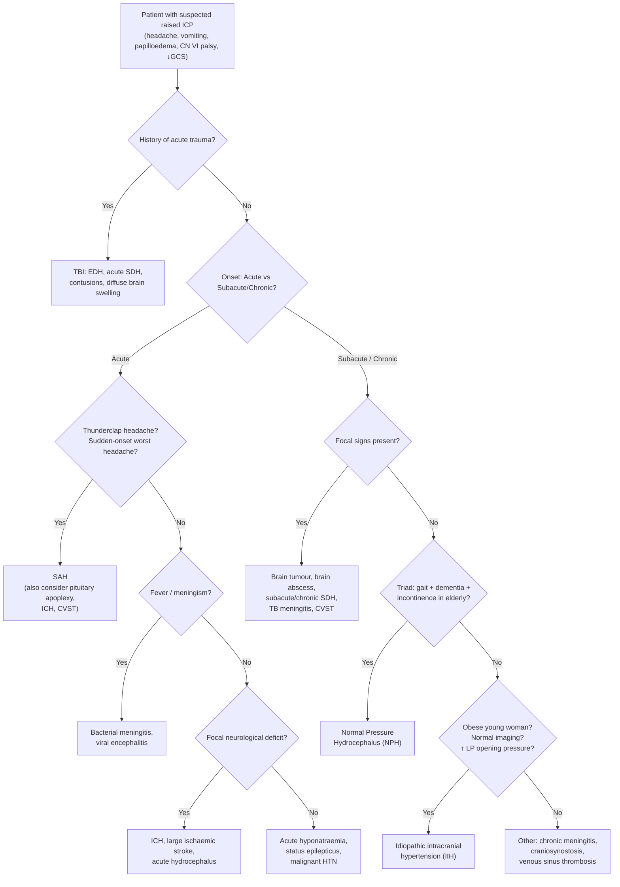

## Differential Diagnosis of Raised Intracranial Pressure

### Why a DDx Framework Matters Here

Raised ICP is a **pathophysiological state**, not a single disease. When a patient presents with features of raised ICP (headache worse supine/morning, vomiting, visual blurring, CN VI palsy, papilloedema, deteriorating consciousness), your job is to **work backwards** to identify the underlying aetiology — because the treatment depends entirely on the cause. A patient with a cerebellar tumour causing obstructive hydrocephalus needs emergency posterior fossa surgery, not just mannitol. A patient with IIH needs weight loss and acetazolamide, not a craniotomy.

The DDx is best organised by the **Monro-Kellie framework** (what component is expanded?) combined with the **temporal profile** (acute vs subacute vs chronic) because these two axes together narrow the differential most efficiently.

---

### Systematic DDx Organised by Monro-Kellie Component

#### 1. Increased Brain Volume

| Differential | Key distinguishing features | Why it causes raised ICP |
|---|---|---|
| **Ischaemic stroke with cerebral oedema** (malignant MCA syndrome, massive cerebellar infarct) | Acute onset focal neurological deficit (hemiplegia, aphasia, gaze deviation); CT shows hypodense territory ± midline shift after 24–72 h | Cytotoxic oedema (energy failure → intracellular swelling) ± subsequent vasogenic oedema (BBB breakdown). Peaks at 3–5 days post-stroke |
| ***Intracerebral haemorrhage (ICH)*** [4] | Acute onset headache + focal deficit + ↓GCS; NCCT shows hyperdense mass. ***Common sites: pons, cerebellum, putamen, thalamus*** (hypertensive); lobar if CAA | Direct mass effect of haematoma + surrounding oedema. Expanding haematoma ± IVH → acute hydrocephalus |
| ***Brain tumour*** [1][3] | Subacute/chronic progressive headache + focal neurological signs + seizures; often with constitutional symptoms (weight loss). ***Adults: 70% supratentorial (metastases, meningioma, GBM). Children 2–12 y: 70% infratentorial (medulloblastoma, pilocytic astrocytoma, ependymoma)*** | Tumour mass effect + ***vasogenic oedema (disrupted BBB, tumour-secreting VEGF)*** [3] ± ***obstructive hydrocephalus*** ± ***obstruction of cerebral venous drainage (e.g. superior sagittal sinus thrombosis)*** [3] |
| ***Brain abscess*** [1] | Subacute headache + fever + focal signs ± seizures; history of sinusitis, otitis media, dental infection, endocarditis, or immunocompromise; ring-enhancing lesion on CT/MRI | Expanding abscess + surrounding vasogenic oedema. Very high oedema-to-lesion ratio |
| ***Traumatic brain injury (TBI)*** — contusions, diffuse brain swelling [6] | History of trauma; NCCT shows contusions (salt-and-pepper hyperdensity within brain parenchyma), diffuse effacement of sulci/cisterns | ***Multifactorial: vasogenic oedema (disrupted BBB), cytotoxic oedema (neuronal injury), reactive hyperaemia (impaired autoregulation)*** [6] |
| **Acute hypoxic-ischaemic encephalopathy** | Post-cardiac arrest, near-drowning, or severe hypoxia; diffuse cerebral oedema on CT with loss of grey-white differentiation | Global energy failure → cytotoxic oedema |
| **Acute hyponatraemia** | Serum Na < 120 mmol/L; often iatrogenic (excessive hypotonic fluids) or SIADH. Confusion, seizures, coma | Osmotic gradient drives water into brain cells → cytotoxic oedema. The brain swells because neurons become relatively hyperosmolar to the plasma |

#### 2. Increased CSF Volume (Hydrocephalus)

***Hydrocephalus — communicating / non-communicating*** [1]

| Differential | Key distinguishing features | Mechanism |
|---|---|---|
| ***Obstructive (non-communicating) hydrocephalus*** | Acute/subacute onset depending on cause. CT shows dilated lateral and 3rd ventricles with **normal-sized 4th ventricle** if block at aqueduct. ***Causes: tumours (CPA tumours, brain metastasis, gliomas, craniopharyngioma), vascular (cerebellar infarct, ICH, IVH), infections (ventriculitis, brain abscess, neurocysticercosis), congenital (aqueductal stenosis, Chiari II, Dandy-Walker)*** [3] | CSF pathway blocked → CSF accumulates proximal to block → ventricular dilation → ↑ ICP |
| ***Communicating hydrocephalus*** | All ventricles dilated **including 4th ventricle**. ***Causes: SAH, IVH, basal meningitis (TB, cryptococcal — important in HK), leptomeningeal carcinomatosis*** [3] | Impaired CSF absorption at arachnoid granulations (post-inflammatory scarring/protein clogging) |
| ***Normal Pressure Hydrocephalus (NPH)*** [1] | ***Classic clinical triad: gait disturbance, cognitive decline, urinary incontinence*** ("Wet, Wacky, Wobbly"). ***ICP not high despite large ventricles.*** Chronic, insidious. Elderly patients | ***Complex pathophysiology of abnormal brain compliance***. Intermittent B-waves of raised ICP cause progressive ventricular dilation. Spot ICP may be normal. ***Responds well to CSF diversion (e.g. VP-shunting)*** |
| ***Choroid plexus papilloma*** (rare) | Mostly in children < 2 y. CT shows intraventricular enhancing mass (usually lateral ventricle in children, 4th ventricle in adults) | ***↑ CSF production*** — the papilloma actively secretes CSF at a rate exceeding normal absorption capacity |

#### 3. Increased Blood Volume

| Differential | Key distinguishing features | Mechanism |
|---|---|---|
| ***Epidural haematoma (EDH)*** | ***Lucid interval*** then rapid deterioration; temporal bone fracture + middle meningeal artery tear (75%); lentiform hyperdense lesion on CT. **Does not cross suture lines** [9] | Arterial bleeding → rapidly expanding haematoma → ↑ ICP → uncal herniation |
| **Subdural haematoma (SDH)** — acute, subacute, chronic | Acute: post-trauma with progressive ↓GCS; crescentic hyperdense collection crossing suture lines [9]. Chronic: elderly, often on anticoagulants, vague history of minor trauma weeks ago, fluctuating confusion, focal deficits. **Does not cross midline** (bound by falx) | Bridging vein tear → blood accumulates between dura and arachnoid → mass effect. Chronic SDH expands through repeated micro-bleeds from neomembrane capillaries |
| ***Subarachnoid haemorrhage (SAH)*** | Thunderclap headache ("worst headache of my life"), meningism, ± ↓GCS; NCCT shows hyperdense blood in sulci/cisterns/fissures | Aneurysm rupture → blood in subarachnoid space → (1) direct mass effect/global irritation; (2) communicating hydrocephalus (blood products clog arachnoid granulations); (3) vasospasm → delayed cerebral ischaemia |
| ***Cerebral venous sinus thrombosis (CVST)*** [4] | ***Requires high index of suspicion. F > M (pregnancy, OCP).*** Headache + papilloedema + ↓GCS + seizure + focal deficits. ***MRI + MR venogram shows filling defect. Empty delta sign (superior sagittal sinus involvement)*** | Venous outflow obstruction → ↑ venous pressure → impaired CSF absorption + venous infarction ± haemorrhagic transformation |
| ***Reactive hyperaemia*** [1] | Post-TBI or post-reperfusion (e.g. after carotid endarterectomy or thrombectomy) | Loss of autoregulation → inappropriate arteriolar dilation → ↑ cerebral blood volume |

#### 4. Infectious / Inflammatory Causes

| Differential | Key distinguishing features | Mechanism |
|---|---|---|
| ***Bacterial meningitis*** | Acute onset fever, headache, neck stiffness, photophobia, ↓GCS; CSF: ↑ neutrophils, ↑ protein, ↓ glucose | Diffuse cerebral oedema (vasogenic — BBB disruption) + communicating hydrocephalus (inflammatory exudate blocks arachnoid granulations) |
| ***TB meningitis*** [10] | ***Subacute onset over weeks. Triphasic illness: prodromal → meningitic → paralytic. CN palsies (esp II, VI). Hydrocephalus in 80%. Basal meningeal enhancement on contrast CT/MRI*** | Basal exudates → communicating hydrocephalus + vasculitis → infarcts + vasogenic oedema. Very important in Hong Kong |
| **Cryptococcal meningitis** | Insidious onset in immunocompromised (HIV, transplant); India ink +ve, cryptococcal antigen in CSF/serum | Mucoid capsule physically blocks arachnoid granulations → communicating hydrocephalus. Also direct parenchymal invasion |
| **Viral encephalitis (e.g. HSV)** | Acute onset fever, confusion, seizures, temporal lobe predilection (HSV-1); MRI shows T2/FLAIR hyperintensity in temporal lobes | Cytotoxic oedema (neuronal destruction) + vasogenic oedema (BBB disruption) |

#### 5. Idiopathic / Others

| Differential | Key distinguishing features | Mechanism |
|---|---|---|
| ***Idiopathic intracranial hypertension (IIH)*** [2] | ***Obese women of child-bearing age. S/S of ↑ICP: headache, transient visual loss, pulsatile tinnitus, diplopia (CN6 palsy), N/V. Papilloedema present. Imaging: normal brain parenchyma with small/normal ventricles ('slit' ventricles), enlarged sella (empty sella sign). LP: ↑ opening pressure but normal constituents*** | ***Unknown — may be ↑ CSF outflow resistance + ↓ CSF reabsorption***. Diagnosis of exclusion. ***Must do MRV to r/o 2° ↑ICP due to CVST*** (which can look identical on MRI) |
| **Malignant hypertension** | BP ≥ 220/120 + G3–4 fundal changes (papilloedema, retinal haemorrhages, exudates); headache, confusion, visual disturbance, AKI, APO [11] | Breakthrough of cerebral autoregulation → forced vasodilation → vasogenic oedema (hypertensive encephalopathy). **Important DDx for bilateral optic disc swelling, especially in the elderly** [8] |
| **Status epilepticus** | Witnessed seizures or subtle convulsive activity; ↑ICP is secondary | Seizure → ↑↑ metabolic demand → hyperaemia → ↑ cerebral blood volume → ↑ ICP [5][7] |
| **Pituitary apoplexy** [12] | Sudden excruciating headache + diplopia (CN III compression) + hypopituitarism (especially adrenal crisis); known pituitary adenoma. CT/MRI: acute blood in pituitary | Sudden haemorrhage into pituitary → rapid expansion within sella → mass effect. If large enough, suprasellar extension → ↑ ICP, visual field compromise |

---

### DDx by Temporal Profile

This is extremely useful clinically because the **speed of onset** immediately narrows the list [2][13]:

| **Acute** (minutes–hours) | **Subacute** (days–weeks) | **Chronic** (weeks–months) |
|---|---|---|
| EDH, acute SDH, ICH, SAH, massive ischaemic stroke, acute hydrocephalus, bacterial meningitis, pituitary apoplexy, acute hyponatraemia | Brain tumour, brain abscess, subacute SDH, TB meningitis, viral encephalitis, CVST, subacute hydrocephalus, IIH | Chronic SDH, slow-growing tumour, NPH, IIH, craniosynostosis, chronic meningitis |

---

### DDx by Age Group

| **Infants** | **Children (2–12 y)** | **Adults** | **Elderly** |
|---|---|---|---|
| Congenital hydrocephalus (aqueductal stenosis, Chiari II, Dandy-Walker), congenital infection (TORCH), choroid plexus papilloma, craniosynostosis, non-accidental injury (SDH + retinal haemorrhages) | ***Posterior fossa tumours (medulloblastoma, pilocytic astrocytoma, ependymoma)*** → obstructive hydrocephalus; acute disseminated encephalomyelitis (ADEM) | TBI (RTA, falls, assaults), brain metastases, GBM, meningioma, ICH, SAH, CVST, brain abscess, IIH | Chronic SDH (falls + anticoagulation + brain atrophy), hypertensive ICH, brain metastases, NPH, malignant hypertension |

---

### DDx of Papilloedema (Bilateral Optic Disc Swelling) Specifically

When you see bilateral disc swelling, the DDx is focused [8]:

| Cause | Discriminating feature |
|---|---|
| ***Papilloedema (from ↑ICP)*** | VA usually preserved initially; only TVOs and enlarged blind spot; **loss of spontaneous venous pulsation**, engorged retinal veins, flame haemorrhages, CWS, exudates. Disc hyperaemic acutely, pale chronically |
| ***Malignant hypertension*** | **Key DDx for bilateral disc swelling in the elderly** [8]. BP ≥ 220/120 + retinal haemorrhages/exudates + signs of end-organ damage. Fundoscopy may look identical to papilloedema |
| **Anterior ischaemic optic neuropathy (AION)** | Almost always **unilateral**. Sudden visual loss with **altitudinal VF defect**. Pale disc (chalky-white in GCA). Spontaneous venous pulsation intact |
| **Papillitis (optic neuritis)** | Usually **unilateral**. Profound visual loss + central/paracentral scotoma + abnormal colour vision + **pain on eye movement** (rectus pulling on optic nerve sheath). Hyperaemic, diffusely swollen disc |

> *Mnemonic for disc swelling mimics (pseudopapilloedema)*: optic disc drusen — bilateral, elevated disc but **no venous engorgement**, **no haemorrhages**, and the disc surface is **irregular/lumpy**. B-scan USG or autofluorescence confirms drusen.

---

### Clinical Approach: Algorithmic DDx

---

### Key Discriminating Features in the DDx

| Feature | Points towards... |
|---|---|
| ***Headache worse when supine, early morning; ↑ with coughing/sneezing; ↓ with vomiting*** [13] | **↑ICP** of any cause |
| Headache **worse when standing**, promptly relieved by lying down | **Intracranial hypotension** (opposite of ↑ICP) — post-LP or idiopathic CSF leak [2] |
| ***Thunderclap headache*** ("worst headache of my life") | **SAH** until proven otherwise (also consider CVST, pituitary apoplexy, ICA dissection) [13] |
| Lucid interval after head trauma → rapid deterioration | **Acute EDH** (middle meningeal artery tear; the lucid interval is the compensatory phase of Monro-Kellie before decompensation) |
| Elderly on anticoagulants, fluctuating confusion, trivial/forgotten trauma weeks ago | **Chronic SDH** |
| ***Subacute onset over weeks, CN palsies (esp VI), hydrocephalus, in HK endemic area*** [10] | **TB meningitis** |
| Obese young woman + headache + visual symptoms + papilloedema + ***normal MRI with small ventricles*** + ***↑ LP opening pressure with normal CSF*** [2] | **IIH** |
| ***Wet, Wacky, Wobbly in an elderly patient with ventriculomegaly out of proportion to atrophy*** [1] | **NPH** (surgically treatable!) |
| BP ≥ 220/120 + bilateral papilloedema + retinal haemorrhages + end-organ damage | **Malignant hypertension / hypertensive encephalopathy** [11] |
| ***Female, pregnancy/OCP, headache + seizure + focal deficit + haemorrhagic infarct pattern*** [4] | **CVST** — do MR venogram |

<Callout title="DDx Trap: IIH vs CVST" type="error">
IIH and CVST can look **almost identical** clinically (young woman with headache, papilloedema, CN6 palsy) and even on standard MRI (both may show normal brain parenchyma). The critical differentiator is the **MR venogram** — CVST will show a filling defect / absence of flow in a dural sinus. ***Always do MRV to rule out secondary ↑ICP due to CVST*** before diagnosing IIH [2]. Missing CVST can be fatal.
</Callout>

<Callout title="DDx Trap: Papilloedema vs Malignant Hypertension" type="error">
In an elderly patient with bilateral disc swelling, **always check the blood pressure** before assuming papilloedema from an intracranial cause. ***Malignant HTN is the key differential for bilateral optic disc swelling in the elderly*** [8]. The fundoscopic appearance can be indistinguishable from papilloedema — you need the BP and other end-organ damage to differentiate.
</Callout>

---

<Callout title="High Yield Summary">

1. **Organise DDx by Monro-Kellie component**: ↑ Brain (oedema, mass, abscess, TBI), ↑ CSF (hydrocephalus — obstructive vs communicating vs NPH), ↑ Blood (EDH, SDH, SAH, CVST, hyperaemia), Others (IIH, malignant HTN, seizures).

2. **Temporal profile narrows DDx fast**: Acute (EDH, ICH, SAH, acute hydrocephalus, bacterial meningitis) vs Subacute (tumour, abscess, TB meningitis, CVST, subacute SDH) vs Chronic (chronic SDH, NPH, IIH, slow tumour).

3. **Age-specific**: Infants — congenital hydrocephalus, craniosynostosis, NAI. Children — posterior fossa tumours. Adults — TBI, tumours, ICH, IIH. Elderly — chronic SDH, NPH, hypertensive ICH, malignant HTN.

4. **IIH vs CVST**: Always do MR venogram. IIH is a diagnosis of exclusion. CVST = filling defect on MRV.

5. **Papilloedema DDx**: True papilloedema (↑ICP) vs malignant HTN (check BP!) vs papillitis (visual loss + pain on eye movement) vs AION (unilateral, altitudinal VF defect) vs pseudopapilloedema (drusen).

6. **HK-specific high yield**: TB meningitis (subacute, basal enhancement, hydrocephalus in 80%), hypertensive ICH (putamen/thalamus/pons/cerebellum), brain metastases (lung/breast/colorectal), chronic SDH (elderly on anticoagulants), NPC skull base invasion.

</Callout>

---

<ActiveRecallQuiz
  title="Active Recall - DDx of Raised ICP"
  items={[
    {
      question: "Name the 5 main aetiological categories of raised ICP using the Monro-Kellie framework, with one example each.",
      markscheme: "1. Increased brain volume (e.g. brain tumour, cerebral oedema, abscess, TBI). 2. Increased CSF volume / hydrocephalus (e.g. obstructive hydrocephalus from aqueductal stenosis). 3. Increased blood volume - arterial (e.g. hyperaemia) or venous (e.g. CVST, SDH, EDH). 4. Infectious/inflammatory (e.g. bacterial meningitis, TB meningitis). 5. Others/idiopathic (e.g. IIH, malignant HTN). Accept any reasonable grouping with correct examples.",
    },
    {
      question: "A young obese woman presents with headache, papilloedema, and CN6 palsy. MRI brain is normal. What diagnosis do you suspect, and what critical investigation must you do before making this diagnosis?",
      markscheme: "Suspect IIH (idiopathic intracranial hypertension). Must do MR venogram to rule out cerebral venous sinus thrombosis (CVST), which can present identically. IIH is a diagnosis of exclusion. LP will show raised opening pressure with normal CSF constituents.",
    },
    {
      question: "Differentiate papilloedema from papillitis based on visual acuity, visual field defect, pain, and laterality.",
      markscheme: "Papilloedema: VA usually preserved initially, enlarged blind spot only, no pain on eye movement, bilateral. Papillitis: profound visual loss, central or paracentral scotoma with abnormal colour vision, pain on eye movement (rectus pulling on optic nerve sheath), usually unilateral.",
    },
    {
      question: "An elderly patient on warfarin presents with fluctuating confusion and subtle left-sided weakness 3 weeks after a minor fall. What is the most likely diagnosis and what would CT show?",
      markscheme: "Chronic subdural haematoma (SDH). CT would show a crescentic hypodense (or isodense if subacute) collection over the cerebral convexity, crossing suture lines but not crossing midline (bound by falx). Risk factors: elderly, brain atrophy, anticoagulation, trivial/forgotten trauma.",
    },
    {
      question: "In Hong Kong, what CNS infection should you always consider in a patient with subacute headache, cranial nerve palsies, and hydrocephalus? What are the CSF findings?",
      markscheme: "TB meningitis. CSF: raised opening pressure (18-30 cmH2O), raised protein (1-5 g/L), low glucose (majority less than 2.5 mmol/L), lymphocytic pleocytosis (100-500 per microlitre, may be neutrophilic early). AFB smear sensitivity 30-60%, culture up to 80%, TB-PCR sensitivity 82%.",
    },
    {
      question: "What is the classic CT finding that differentiates EDH from SDH? Give 3 distinguishing features.",
      markscheme: "EDH: lentiform shape, does not cross suture lines (bound to bone), crosses midline, 75-90% associated with skull fracture, usually middle meningeal artery. SDH: crescentic shape, crosses suture lines, does not cross midline (bound by falx), usually bridging vein tear, often no fracture.",
    },
  ]}
/>

---

## References

[1] Lecture slides: GC 111. Raised intracranial pressure and hydrocephalus.pdf (pp. 2, 8–9, 14–15)
[2] Senior notes: Ryan Ho Neurology.pdf (pp. 155, 158)
[3] Senior notes: maxim.md (Intracranial tumours, hydrocephalus, and ICH sections)
[4] Senior notes: maxim.md (ICH and cerebral venous thrombosis sections)
[5] Senior notes: felixlai.md (ICP causes and pathophysiology sections)
[6] Senior notes: Ryan Ho Neurology.pdf (p. 205, Secondary brain injury)
[7] Senior notes: Ryan Ho Fundamentals.pdf (p. 339)
[8] Senior notes: Ryan Ho Opthalmology.pdf (pp. 85, 88, 90)
[9] Senior notes: Ryan Ho Diagnostic Radiology.pdf (pp. 41–42)
[10] Senior notes: Ryan Ho Respiratory.pdf (p. 79)
[11] Senior notes: Ryan Ho Cardiology.pdf (p. 182)
[12] Senior notes: Ryan Ho Endocrine.pdf (p. 107)
[13] Senior notes: Ryan Ho Fundamentals.pdf (pp. 312–315)
