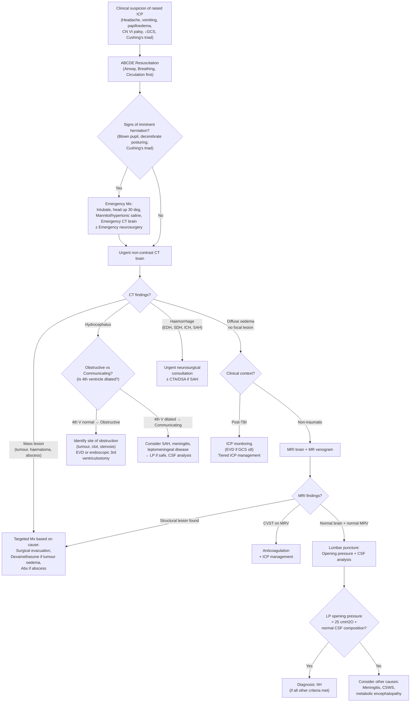

## Diagnostic Criteria for Raised ICP

Raised ICP is fundamentally a **pathophysiological state**, not a stand-alone diagnosis with a single set of diagnostic criteria the way, say, rheumatoid arthritis has ACR/EULAR criteria. Instead, the "diagnosis" involves two parallel tracks:

1. **Recognising that ICP is elevated** (clinical features ± direct measurement)
2. **Identifying the underlying cause** (neuroimaging ± LP ± targeted investigations)

There is, however, one condition — **Idiopathic Intracranial Hypertension (IIH)** — that does have formal diagnostic criteria because it is a diagnosis of exclusion where you need to prove the ICP is elevated AND that no structural cause exists.

---

### A. Quantitative Thresholds for Raised ICP

| Parameter | Value | Clinical significance |
|---|---|---|
| ***Normal adult ICP*** | ***10–15 mmHg*** [1][2] | Measured at level of external auditory meatus (approximates foramen of Monro) |
| ***Normal infant ICP*** | ***1–6 mmHg*** [1] | Lower because open fontanelles provide compliance |
| Normal young children ICP | 3–7 mmHg [2][5] | |
| **Intracranial hypertension threshold** | **≥ 20 mmHg (≈ 20 cmH₂O)** [1][5] | ***Definitely abnormal > 20 cmH₂O*** [1]. This is the **threshold to intervene** in most protocols (Brain Trauma Foundation 4th edition recommends treating ICP > 22 mmHg in TBI) |
| Severe intracranial hypertension | > 25–30 mmHg | Aggressive escalation needed; risk of herniation imminent |
| Refractory intracranial hypertension | ICP > 25 mmHg for > 25 min/h or > 30 min in any 1 hour despite maximal tier 1–2 therapy | Consider decompressive craniectomy or barbiturate coma |

> **Why 20 cmH₂O / ~15 mmHg?** Because above this level, the ICP-volume curve has entered its steep (decompensated) phase, and even small further volume additions cause dramatic ICP spikes. The Brain Trauma Foundation (4th edition, 2016; reaffirmed 2020) chose 22 mmHg as the treatment threshold based on observational data showing worse outcomes above this level.

### B. Diagnostic Criteria for IIH (Modified Dandy Criteria / Friedman et al., 2013 — Updated)

Since IIH is a diagnosis of exclusion, formal criteria exist [2][8]:

| Criterion | Explanation |
|---|---|
| 1. ***Signs and symptoms of raised ICP*** (headache, papilloedema, TVOs, CN6 palsy, tinnitus) | Must have clinical features attributable to raised ICP — papilloedema is the hallmark |
| 2. ***Normal neurological examination*** except for CN6 palsy | Any other focal deficit suggests a structural cause |
| 3. ***Normal brain parenchyma on MRI*** with ***small or normal ventricles ("slit ventricles")*** | Rules out mass lesions, hydrocephalus. May show ***enlarged sella filled with CSF (empty sella sign)*** [2] |
| 4. ***Normal CSF composition on LP*** | Rules out meningitis, carcinomatosis |
| 5. ***Elevated LP opening pressure:*** > 25 cmH₂O in adults (> 28 cmH₂O in children) | The defining feature — proves that ICP is actually elevated |
| 6. ***No other identifiable cause***, including ***MR venogram to rule out CVST*** [2] | CVST can mimic IIH perfectly on standard MRI |

<Callout title="IIH: Diagnosis of Exclusion" type="error">
You cannot diagnose IIH without **ruling out CVST** with MR venography. Both conditions cause raised ICP with normal brain parenchyma on standard MRI. Missing CVST (which requires anticoagulation) can be fatal. ***± MRV to r/o 2° ↑ICP due to CVST (otherwise similar appearance on MRI)*** [2].
</Callout>

---

## Diagnostic Algorithm

The approach follows a logical sequence: **clinical suspicion → emergency stabilisation → neuroimaging → ± LP → targeted investigations for the cause**.

### Key Decision Points Explained

**Why CT first, not MRI?**
- CT is ***fast (1 minute)*** [14], widely available 24/7, and excellent at detecting **acute blood** (hyperdense on NCCT), **mass effect/midline shift**, and **hydrocephalus** — the three things you need to know immediately. MRI takes ~20 min, is not always available urgently, and is harder to perform on unstable patients.

**Why not LP first?**
- ***LP contraindicated if raised ICP*** [1] (with exceptions, e.g. communicating hydrocephalus from meningitis where the benefit outweighs the risk). Removing CSF from below a pressure gradient can precipitate **tonsillar herniation (coning)**. You must image first to confirm there is no mass effect or obstructive hydrocephalus.

***CT/MRI brain + no papilloedema before LP if suspect mass lesion or ↑ICP. Indications for imaging before LP: altered consciousness, focal signs, papilloedema, seizure, immunocompromised*** [15].

**When to add MRI + MR venogram?**
- When CT is non-diagnostic or normal but clinical suspicion remains high
- When you suspect ***CVST*** [4] (young woman, prothrombotic state, headache + seizure + focal deficit)
- When you suspect ***IIH*** [2] (need MRV to exclude CVST)
- ***For IIH: MRI and MR venogram + Lumbar puncture*** [13]

---

## Investigation Modalities: Key Findings & Interpretations

### 1. Non-Contrast CT Brain (NCCT)

***NECT brain: single most important investigation in head injury*** [7] and the **first-line** investigation for suspected raised ICP in any acute setting.

**Why non-contrast specifically?** Because contrast can obscure blood (both appear hyperdense). You want to see blood first.

| Finding | Interpretation | Underlying cause |
|---|---|---|
| **Lentiform hyperdense collection** not crossing suture lines [9] | ***Acute epidural haematoma (EDH)*** | Middle meningeal artery tear (75%); 90% associated with skull fracture |
| **Crescentic hyperdense collection** crossing suture lines but not midline [9] | ***Acute subdural haematoma (SDH)*** | Bridging vein tear. Subacute SDH is isodense (difficult to see — ***should do CT ASAP after injury, or contrast CT*** [9]). Chronic SDH is hypodense |
| **Hyperdense mass within brain parenchyma** | ***Intracerebral haemorrhage (ICH)*** | ***Urgent NCCT brain: size and location of haematoma, any IVH/hydrocephalus, any mass effect*** [4] |
| **Hyperdense blood in sulci/cisterns/Sylvian fissure** | ***Subarachnoid haemorrhage (SAH)*** | Sensitivity ~95% within 6 h, drops to ~50% by day 5. If -ve but clinical suspicion high → LP for xanthochromia |
| **Dilated ventricles** (lateral + 3rd but NOT 4th) | ***Obstructive hydrocephalus*** at aqueductal level | Look for cause at the level of obstruction (tumour, clot) |
| **Dilated ALL ventricles** including 4th | ***Communicating hydrocephalus*** | Post-SAH, post-meningitis, leptomeningeal carcinomatosis |
| **Diffuse sulcal effacement, loss of grey-white differentiation, compressed basal cisterns** | ***Diffuse cerebral oedema*** | TBI, hypoxic-ischaemic encephalopathy, acute hyponatraemia, meningoencephalitis |
| **Midline shift** (> 5 mm is significant) | Mass effect from unilateral lesion | Indicates herniation risk — urgent neurosurgical consultation |
| **Hypodense area in vascular territory** with mass effect | ***Large territory ischaemic stroke with oedema*** | Peaks at 3–5 days; early signs: dense MCA sign, loss of insular ribbon [14] |
| **Ring-enhancing lesion** (on contrast CT) | ***Brain abscess*** or tumour (GBM) | Abscess: restricted diffusion on DWI-MRI (cellular pus restricts water movement). GBM: facilitated diffusion |
| ***Erosion of posterior clinoids*** on bone window [16] | ***Chronic raised ICP*** | Long-standing pressure remodels the sella — a subtle but classic sign |

#### CT Appearance of Blood Over Time

| Phase | Timing | CT appearance | Why? |
|---|---|---|---|
| **Acute** | < 1 week | ***Hyperdense*** | Fresh clot has high haemoglobin concentration → high attenuation |
| **Subacute** | 1–3 weeks | ***Isodense*** | Haemoglobin degradation → attenuation falls toward brain density. **Difficult to visualise** — this is the dangerous "invisible" period |
| **Chronic** | > 3 weeks | ***Hypodense*** (≈ CSF density) | Almost all protein degraded [9] |

<Callout title="The Isodense Trap" type="error">
A subacute SDH (1–3 weeks old) can be isodense to brain and easily missed on NCCT. If clinical suspicion is high (elderly patient, progressive confusion, anticoagulants), consider **contrast-enhanced CT** (the neomembranes will enhance) or **MRI** (much more sensitive for subacute collections). ***Isodense: difficult to visualize → should do CT ASAP after injury (or do contrast CT instead)*** [9].
</Callout>

### 2. MRI Brain

***MRI: more sensitive than CT especially in the first few hours*** for ischaemic stroke and many other conditions [14]. Generally **preferred over CT** for characterising intracranial tumours, infections, and oedema.

| MRI Sequence | What it shows | Key findings in raised ICP |
|---|---|---|
| **T1-weighted** | Anatomy (CSF dark, fat bright) | Subacute blood is T1 bright (methaemoglobin). Mass effect. Tonsillar herniation (low-lying tonsils) |
| **T2-weighted / FLAIR** | Oedema (CSF bright on T2, suppressed on FLAIR) | ***Vasogenic oedema most apparent on FLAIR MRI*** [3]. Periventricular transependymal CSF flow in hydrocephalus |
| **DWI / ADC** | Restricted vs facilitated diffusion | ***Cytotoxic oedema = restricted diffusion*** (early ischaemic stroke within **minutes** [14]). ***Abscess = restricted diffusion. Tumour cyst = facilitated diffusion*** [3] — key differentiator |
| **SWI / GRE** | Blood products (haemosiderin) | Microbleeds in cerebral amyloid angiopathy, diffuse axonal injury (small dark dots at grey-white junction, corpus callosum) |
| **Gadolinium contrast** | BBB disruption | ***Normal brain tissue does not enhance (due to BBB). Enhancement indicates: outside BBB (e.g. meningioma — homogeneous), or disruption of BBB (e.g. high-grade tumours, stroke, inflammation)*** [15]. Ring-enhancing: abscess or GBM |
| **MR Spectroscopy** | Metabolite ratios | ↑ Choline/NAA ratio in tumours (high cell turnover); lactate peak in abscess |
| **MR Perfusion** | Cerebral blood flow maps | High-grade tumours show ↑ perfusion; low-grade show ↓ perfusion |

#### Specific MRI Findings by Condition

| Condition | MRI findings |
|---|---|
| ***IIH*** | ***Normal brain parenchyma, small or normal ventricles ("slit ventricles"), enlarged sella filled with CSF (empty sella sign)*** [2]. ± flattened posterior sclera, perioptic CSF distension, vertical tortuosity of optic nerve |
| ***CVST*** | ***MRI brain + MR venogram for filling defect. Empty delta sign (superior sagittal sinus involvement)*** [4]. May also see venous infarcts (often haemorrhagic, not conforming to arterial territory) |
| ***TB meningitis*** | ***Basal meningeal enhancement and exudate, tuberculoma, hydrocephalus, periventricular infarcts*** [10] |
| ***HSV encephalitis*** | T2/FLAIR hyperintensity in **medial temporal lobes** (classically asymmetric), ± haemorrhagic change on SWI |
| **Brain metastases** | Multiple lesions at **grey-white junction**, circumscribed margins, ***large volume of vasogenic oedema compared to size of lesion*** [15] |
| **Intracranial hypotension** | ***Diffuse pachymeningeal enhancement (due to ↑ blood volume — compensatory venous engorgement), dilated veins, sagging brain ± pocket of CSF at site of leakage*** [2] |

### 3. MR Venogram (MRV)

- Specifically for diagnosing or excluding ***CVST***
- Shows **filling defects** in dural venous sinuses
- ***Must be performed before diagnosing IIH*** to exclude secondary cause of raised ICP [2]

### 4. CT Angiography (CTA) / Digital Subtraction Angiography (DSA)

| Modality | When to use | Key findings |
|---|---|---|
| **CTA** | SAH (to locate aneurysm), suspected vascular malformation, non-hypertensive ICH. ***Indications for vascular imaging: no HTN, age < 40–45, atypical location, CT abnormality (mass, calcifications)*** [4] | Berry aneurysm, AVM nidus, Moya-Moya pattern |
| **DSA** | Gold standard for cerebrovascular anatomy; used when CTA equivocal or for pre-intervention planning | Detailed vascular anatomy, vasospasm in SAH |

### 5. Lumbar Puncture (LP)

***LP contraindicated if raised ICP (with exception…)*** [1]. The exception is **communicating hydrocephalus** from meningitis, where there is no focal mass to cause herniation, and the diagnostic yield (CSF analysis) outweighs the risk.

| Parameter | Normal | Finding in raised ICP | Interpretation |
|---|---|---|---|
| **Opening pressure** | 6–20 cmH₂O | > 20–25 cmH₂O | Confirms raised ICP. ***IIH: LP opening pressure elevated but normal constituents*** [2] |
| **Appearance** | Clear, colourless | Turbid = infection; yellow (xanthochromia) = SAH > 12 h; blood-tinged = traumatic tap vs SAH | Xanthochromia = bilirubin from degraded Hb → confirms blood was in CSF for > 12 h (not a traumatic tap) |
| **Protein** | < 0.45 g/L | ↑ 1–5 g/L in TB meningitis [10]; moderately ↑ in bacterial; mildly ↑ in viral | High protein = BBB disruption or intrathecal immunoglobulin production |
| **Glucose** | > 50–60% of serum glucose | ***↓ glucose (< 2.5 mmol/L) in TB meningitis*** [10]; very low in bacterial; normal in viral | Consumed by bacteria/neutrophils/mycobacteria |
| **Cell count** | < 5 WBC/µL, no RBC | Neutrophilic in acute bacterial; ***lymphocytic pleocytosis (100–500/µL) in TB*** [10]; lymphocytic in viral | Pattern guides empirical therapy |
| **Microbiology** | Sterile | ***AFB smear (sens 30–60%), culture (sens up to 80%), TB-PCR (sens 82%, spec 99%)*** [10]; Gram stain, culture; ***Indian ink (+ve in cryptococcal), cryptococcal Ag*** [15] | |

***Indications for imaging before LP (to rule out mass lesion/raised ICP)***: altered consciousness, focal signs, papilloedema, seizure, immunocompromised [15].

### 6. ICP Monitoring

***Indications*** [1][2][5]:
- ***No reliable GCS (e.g. sedation, muscle paralysis)*** [1]
- ***GCS ≤ 8 (requires intubation)*** [1]
- ***Evolving disease conditions*** [1]

***Relative contraindications: awake patients; bleeding tendency*** [2].

| Method | Principle | Advantages | Disadvantages |
|---|---|---|---|
| ***External Ventricular Drain (EVD)*** [1][2][5] | Catheter in lateral ventricle connected to pressure transducer + drainage system | ***GOLD STANDARD*** [5]. ***Manometric principle for monitoring intracranial CSF pressure. Therapeutic by draining CSF for decompression*** [1]. Allows CSF sampling | ***Risk of infection, iatrogenic trauma*** [1]. Requires neurosurgical placement |
| **Intraparenchymal probe** (e.g. Codman, Camino) | Fibre-optic or strain-gauge probe placed into brain tissue | Easier to place; lower infection risk than EVD | Cannot drain CSF; cannot recalibrate in situ (drift over days) |
| **Epidural/subdural sensors** | Placed in epidural or subdural space | Less invasive | Less accurate; less commonly used |

***Interpretation of ICP monitoring*** [1][2]:
- ***Normal = 5–15 cmH₂O in adults***
- ***Definitely abnormal if > 20 cmH₂O → suggests evolving pathology → repeat imaging studies or escalate treatment*** [1][2]

> ***Clinical application example from lecture*** [1]: ***Initial GCS = E1M4V2. Intubated, ventilated & observed. ICP progressively increased from 16 to 28 cmH₂O. Definitely abnormal > 20 cmH₂O. Suggests worsening conditions. Repeat imaging studies. Escalate treatment.***

### 7. Fundoscopy

- Bedside investigation — should be performed on **every patient** with suspected raised ICP
- Looking for **papilloedema** (see clinical features section for detailed findings) [8]
- ***Fundus: swollen optic disc with blurred edges, dilated superficial capillaries and NO spontaneous venous pulsation of CRV*** [8]
- ***VF: enlarged blind spot (acute), constricted VF (chronic)*** [8]
- Remember: papilloedema is a ***LATE*** feature [1] — its **absence does NOT exclude** raised ICP

### 8. Other Investigations (Targeted by Suspected Cause)

| Investigation | When to order | What to look for |
|---|---|---|
| **Bloods**: FBC, CRP/ESR, coagulation, U&E, glucose, blood cultures | All patients | ↑ WCC/CRP (infection); coagulopathy (anticoagulant-related bleed); hyponatraemia (SIADH from ↑ICP [17]); blood cultures (meningitis) |
| **Serum Na⁺ and osmolality** | Any CNS pathology | SIADH (euvolaemic hypoNa with inappropriately concentrated urine) vs CSWS (hypovolaemic hypoNa) — both complicate ↑ICP [17] |
| **CT C-spine** | Trauma | ***Watch out for cervical spine injury*** — concurrent in up to 5–10% of severe TBI [4] |
| **CXR** | Trauma, suspected TB, suspected lung primary | TB meningitis: ***CXR for underlying pTB*** [10]. Brain metastases: primary lung tumour |
| **Skull X-ray** | Rarely used now; historical | ***Erosion of posterior clinoids*** = chronic ↑ICP [16]. Fracture lines. Calcified tumours (craniopharyngioma). ***Seldom done nowadays due to low sensitivity and specificity*** [16] |
| **EEG** | Seizures, status epilepticus, encephalitis | Diffuse slowing (encephalopathy), periodic lateralising epileptiform discharges (HSV encephalitis), non-convulsive status |
| **Stereotactic biopsy** | Brain tumour where histological diagnosis needed and surgical resection not immediately planned [3] | Tumour grading, molecular markers (IDH mutation, MGMT methylation in gliomas) |
| **Transcranial Doppler (TCD)** | Non-invasive estimation of ICP; monitoring vasospasm in SAH | Pulsatility index > 1.2–1.4 suggests raised ICP. ↑ systolic velocity in vasospasm |

---

### Summary Table: Investigation Strategy by Clinical Scenario

| Scenario | First-line | Second-line | Targeted |
|---|---|---|---|
| **Acute head trauma** | ***NECT brain*** [7] + CT C-spine | ICP monitoring if GCS ≤ 8 | CTA if vascular injury suspected |
| **Acute non-traumatic headache ± ↓GCS** | NECT brain (r/o haemorrhage) | LP if SAH suspected but CT -ve | CTA/DSA for aneurysm |
| **Subacute headache + focal signs** | NECT brain → contrast CT or MRI | MRI + contrast for tumour/abscess | Stereotactic biopsy for tumour |
| **Suspected meningitis** | ***CT/MRI before LP if altered consciousness, focal signs, papilloedema, seizure, immunocompromised*** [15] | LP + CSF analysis | Blood cultures, CXR, specific PCR |
| **Suspected IIH** | ***MRI + MR venogram*** [2][13] | LP with opening pressure + CSF analysis | Visual field testing, OCT of RNFL |
| **Suspected CVST** | CT brain (may be normal) → ***MRI + MRV*** [4] | ± CT venogram if MRI unavailable | Thrombophilia screen, pregnancy test |
| **Infant with large head** | Transfontanelle USS (non-invasive, no radiation) → MRI | CT if urgent/USS equivocal | Genetic testing if congenital cause |

---

<Callout title="High Yield Summary">

1. **Raised ICP threshold**: ≥ 20 mmHg (definitely abnormal > 20 cmH₂O). Brain Trauma Foundation treats > 22 mmHg in TBI.

2. **IIH diagnostic criteria** (Modified Dandy): Signs of raised ICP + normal neuro exam (except CN6) + normal MRI brain + normal MRV (exclude CVST!) + normal CSF composition + elevated LP opening pressure > 25 cmH₂O.

3. **Investigation sequence**: Clinical suspicion → ABCDE → Urgent NECT brain → ± MRI/MRV → ± LP (only after imaging rules out mass lesion) → Targeted investigations.

4. **NECT brain** = first-line for acute raised ICP (fast, available, detects blood/mass/hydrocephalus/shift).

5. **MRI** superior for tumour characterisation, abscess vs tumour (DWI), oedema (FLAIR), IIH (empty sella, slit ventricles), CVST (MRV), intracranial hypotension (pachymeningeal enhancement).

6. **EVD** = gold standard for ICP monitoring. Indications: GCS ≤ 8, no reliable clinical monitoring, evolving conditions.

7. **LP contraindicated** if raised ICP with mass lesion. Always image first. Exception: suspected meningitis with communicating hydrocephalus (no mass effect).

8. **CT blood appearance changes with time**: Acute = hyperdense, Subacute = isodense (danger zone — easy to miss), Chronic = hypodense.

</Callout>

---

<ActiveRecallQuiz
  title="Active Recall - Diagnosis of Raised ICP"
  items={[
    {
      question: "What is the ICP treatment threshold in TBI according to the Brain Trauma Foundation 4th edition, and how is ICP measured most accurately?",
      markscheme: "Treat ICP > 22 mmHg (some protocols use 20 mmHg). Gold standard measurement is External Ventricular Drain (EVD) — catheter in lateral ventricle connected to pressure transducer. Advantages: allows both monitoring AND therapeutic CSF drainage. Risk: infection, iatrogenic trauma.",
    },
    {
      question: "List the 6 diagnostic criteria for IIH and explain why MR venogram is mandatory.",
      markscheme: "1. Signs/symptoms of raised ICP. 2. Normal neurological exam except CN6 palsy. 3. Normal MRI brain (small/normal ventricles, may show empty sella). 4. Normal CSF composition on LP. 5. Elevated LP opening pressure > 25 cmH2O. 6. No other identifiable cause. MRV is mandatory because CVST can present identically to IIH on standard MRI — both show normal parenchyma with raised ICP. CVST requires anticoagulation; missing it is dangerous.",
    },
    {
      question: "A CT brain shows a crescentic isodense collection over the left cerebral convexity in a confused elderly patient. What is the diagnosis, why is it isodense, and what alternative imaging could help?",
      markscheme: "Subacute subdural haematoma (1-3 weeks old). Isodense because haemoglobin has partially degraded so attenuation falls toward brain tissue density. Contrast CT (neomembranes enhance) or MRI (much more sensitive - blood products visible on T1/FLAIR/SWI) would help visualise the collection.",
    },
    {
      question: "When is lumbar puncture contraindicated in the workup of raised ICP, and what must you do first?",
      markscheme: "LP is contraindicated when there is suspected mass lesion causing raised ICP with risk of pressure gradient (e.g. posterior fossa mass, significant midline shift). Always perform neuroimaging (CT brain) first. Indications for imaging before LP: altered consciousness, focal neurological signs, papilloedema, seizures, immunocompromised. Removing CSF from below can precipitate tonsillar herniation (coning).",
    },
    {
      question: "On MRI, how do you differentiate a brain abscess from a cystic brain tumour using DWI?",
      markscheme: "Brain abscess shows RESTRICTED diffusion (bright on DWI, dark on ADC map) because the cavity is filled with viscous pus containing cellular debris that restricts water molecule movement. Cystic tumour shows FACILITATED diffusion (dark on DWI, bright on ADC) because the cyst fluid is more freely mobile. This is a key distinguishing feature.",
    },
  ]}
/>

---

## References

[1] Lecture slides: GC 111. Raised intracranial pressure and hydrocephalus.pdf (pp. 1–2, 8–9)
[2] Senior notes: Ryan Ho Neurology.pdf (pp. 153, 156, 158)
[3] Senior notes: maxim.md (Intracranial tumours and hydrocephalus sections)
[4] Senior notes: maxim.md (ICH and cerebral venous thrombosis sections)
[5] Senior notes: felixlai.md (ICP overview and monitoring sections)
[7] Senior notes: Ryan Ho Fundamentals.pdf (p. 337)
[8] Senior notes: Ryan Ho Opthalmology.pdf (pp. 88, 90)
[9] Senior notes: Ryan Ho Diagnostic Radiology.pdf (pp. 40–42, 50)
[10] Senior notes: Ryan Ho Respiratory.pdf (p. 79)
[13] Senior notes: Ryan Ho Fundamentals.pdf (p. 315)
[14] Senior notes: Ryan Ho Diagnostic Radiology.pdf (pp. 40, 50)
[15] Senior notes: Ryan Ho Neurology.pdf (pp. 145, 149, 162, 164)
[16] Senior notes: Ryan Ho Neurology.pdf (p. 32)
[17] Senior notes: Ryan Ho Urogenital.pdf (p. 17)
