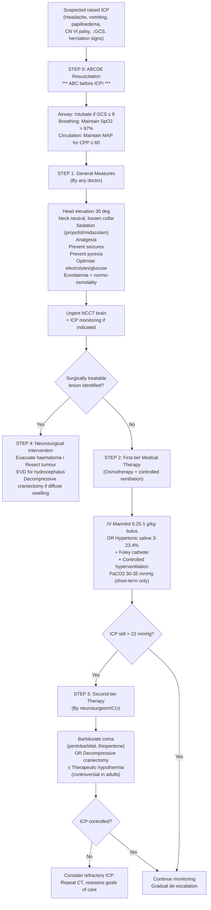

## Management of Raised Intracranial Pressure

### Overarching Principles

Before diving into individual treatments, you need to understand the **philosophy** of managing raised ICP. The lecture slides summarise it best:

> ***The Fundamentals:*** [1]
> - ***Protect uninjured brain***
> - ***Salvage injured brain***
> - ***Treat underlying cause***
> - ***ALWAYS resuscitate first***
> - ***Clinical/ICP monitoring***
> - ***Control ICP & maintain cerebral perfusion***
> - ***Neuroprotective therapies***

The single most important concept: ***ABC before ICP !!*** [1]. Why? Because maintaining normal ICP is pointless if the patient has no airway, no oxygenation, or no blood pressure. Even with normal ICP, a hypoxaemic or hypotensive brain will become ischaemic. You must ensure adequate **oxygen delivery** (airway + breathing) and **cerebral perfusion pressure** (circulation) before anything else.

**Treatment targets** (primarily from TBI guidelines, but applicable broadly) [18]:
- **ICP < 22 mmHg** (Brain Trauma Foundation 4th edition, 2016)
- **CPP 60–70 mmHg**
- SpO₂ > 97%, PaO₂ > 9 kPa
- **PaCO₂ 4.5–5 kPa** (normocapnia; avoid routine hyperventilation)
- Temperature < 37°C, avoid hypoglycaemia
- Serum Na > 140 mmol/L

---

### Management Algorithm

---

### Detailed Treatment Modalities

#### Treatment by Any Doctor (Tier 0 — General Measures)

***Treatment of Raised ICP — By any doctor:*** [1]
- ***Head elevation***
- ***Optimise ventilation***
- ***Maintain MAP***
- ***Osmotherapy***
- ***Sedation***
- ***Optimise electrolyte/glucose level***
- ***Prevent/Control seizure***
- ***Prevent pyrexia***

##### 1. Resuscitation (ABCDE)

| Component | Action | Rationale |
|---|---|---|
| **Airway** | ***Intubation*** to maintain airway patency and prevent aspiration [5] | GCS ≤ 8 → patient cannot protect own airway. Aspiration → pneumonia → hypoxaemia → ↑ ICP. Intubation also allows controlled ventilation |
| **Breathing** | Maintain **SpO₂ > 97%**, PaO₂ > 9 kPa [18]. Avoid hypoxaemia at all costs | Hypoxaemia causes reflex cerebral vasodilation → ↑ cerebral blood volume → ↑ ICP. Also directly causes neuronal injury |
| ***Circulation*** | ***Maintain MAP*** to keep ***CPP ≥ 60 mmHg*** [1][5]. Avoid hypotension. ***Maintain vascular volume & BP*** [1] | CPP = MAP − ICP. If MAP drops, CPP drops → cerebral ischaemia. In TBI, autoregulation is impaired (pressure-passive system), so the brain is entirely dependent on systemic BP. **Hypotension with hypoxemia induces reactive vasodilation and elevation in ICP** [5]. BP should only be treated when CPP > 120 mmHg or ICP > 20 mmHg [5] |
| **Disability** | GCS assessment (post-resuscitation), pupil examination | Baseline neurological status for monitoring |
| **Exposure** | Temperature, full body survey for associated injuries | Polytrauma common in TBI |

<Callout title="Critical Safety Points" type="error">

***Do NOT:*** [7]
1. ***Give mannitol if shocked*** — mannitol causes osmotic diuresis → ↓ intravascular volume → worsens shock → ↓ CPP
2. ***Blindly hyperventilate (PaCO₂ 30–35 mmHg) — can lead to vasoconstriction and may exacerbate ischaemia***
3. ***Use barbiturate/propofol outside ICU*** — risk of cardiovascular collapse without monitoring
4. ***Give steroids (not effective for TBI, contraindicated)*** — CRASH trial showed ↑ mortality with high-dose methylprednisolone in TBI

</Callout>

##### 2. Positioning — Enhanced Cerebral Venous Drainage

***Enhanced Cerebral Venous Drainage:*** [1]
- ***Avoid neck rotation***
- ***Remove neck collar if not indicated***
- ***Head elevation ~30°***
- ***Maintain vascular volume & BP***

**Why head up 30°?** [5]
- Optimises **jugular venous drainage** by gravity → ↓ intracranial venous volume → ↓ ICP
- The effect on CPP is a balance: head elevation ↓ JVP (good for ICP), but also slightly ↓ MAP at the level of the head (potentially bad for CPP)
- At **30°**, the net effect is beneficial: ↓ ICP outweighs any ↓ MAP → CPP improves
- **Over-elevation (e.g. sitting bolt upright)** will compromise carotid arterial flow and leads to an overall **decrease** in CPP [5]
- **Neck rotation/flexion** kinks the internal jugular veins → impedes venous drainage → ↑ ICP. This is why you should loosen cervical collars if not needed and ***NEVER put in jugular line in a patient with ↑ICP*** — opt for subclavian or femoral routes instead [2]

##### 3. Sedation and Analgesia

- **Purpose**: Reduces metabolic demand, ventilatory asynchrony, venous congestion (from straining/coughing), and sympathetic response of hypertension and tachycardia [5]
- ***Propofol*** is commonly used due to short half-life and easy titration [5]. Can be switched off quickly for neurological assessment ("sedation hold")
- **Midazolam** is an alternative (longer acting)
- **Fentanyl/remifentanil** for analgesia — pain itself causes sympathetic activation → ↑ BP → can ↑ ICP
- Sedation renders GCS unreliable (the patient is iatrogenically GCS 3) → this is **why ICP monitoring is needed** when patients are sedated [2]

##### 4. Fluid Management

- ***Patients should be kept euvolemic and normo-osmolar*** [5]
- **Avoid hypotonic fluids** (e.g. D5W, 0.45% NaCl) — these lower serum osmolality → water moves into the brain → worsens oedema
- **Preferred fluids**: Normal saline (0.9% NaCl) or Hartmann's solution
- ***Hyponatraemia is common in raised ICP, particularly in SAH*** [5] (due to SIADH or cerebral salt wasting [17])
- Serum Na target > 140 mmol/L [18]

##### 5. Seizure Prevention

- ***Prevent/Control seizure*** [1]
- ***Seizure can cause hyperemia and exacerbate ↑ICP*** [7]
- ***Seizure prophylaxis for 1 week only*** (if seizure history present or diffuse cortical damage) [7][18]
- Anti-epileptic drugs: usually **levetiracetam (Keppra)** or phenytoin
- ***Indicated if seizures are suspected and prophylaxis for supratentorial lesions*** [5]
- ***NOT recommended for infratentorial lesions*** [5] — the cerebellar cortex is inhibitory in nature, so seizures don't arise from infratentorial structures [15]
- Prolonged prophylaxis (> 7 days) does **not** reduce late post-traumatic epilepsy and has side effects

##### 6. Temperature Control

- ***Prevent pyrexia*** [1]
- Fever → ↑ cerebral metabolic rate → ↑ cerebral blood flow → ↑ ICP. Each 1°C rise increases CMRO₂ by ~6–8%
- Treat fever aggressively with paracetamol, cooling blankets, etc.
- Target temperature < 37°C [18]

##### 7. Glucose and Electrolyte Optimisation

- ***Optimise electrolyte/glucose level*** [1]
- **Hyperglycaemia** worsens ischaemic brain injury (increases anaerobic metabolism → lactic acidosis → more oedema). Target glucose 6–10 mmol/L with insulin sliding scale
- **Hypoglycaemia** is directly neurotoxic — must be avoided absolutely
- Correct hyponatraemia (common — see SIADH/CSWS discussion)

---

#### First-Tier Medical Therapy (Tier 1)

##### 8. Osmotherapy

The two agents used are **IV mannitol** and **hypertonic saline**. Both work by creating an osmotic gradient across an **intact BBB**, drawing water from the brain's extracellular space into the intravascular compartment.

###### IV Mannitol

***Mannitol: onset 15 min, DoA 6 h, bolus 0.25–1 g/kg, must put in Foley*** [7]

| Property | Detail |
|---|---|
| **Mechanism** | (1) ↑ Osmotic gradient between cerebral tissue and blood vessel → ↓ oedema. (2) ↑ Deformability of RBCs → improve rheology → better cerebral perfusion. (3) Osmotic diuresis → ↓ blood volume (→ ↓ ICP) [2] |
| **Dose** | 0.25–1 g/kg IV bolus (typically 20% mannitol = 1 g/5 mL). Can repeat Q4–6H |
| **Onset** | 15 minutes |
| **Duration** | ~6 hours |
| **Monitoring** | Foley catheter mandatory (large urine volumes; risk of bladder distension/rupture). Serum Na, osmolality, renal function |
| **Precautions** | Mannitol is also an immediate plasma expander before powerful diuresis → ↑↑ cardiac workload [2] |
| ***Contraindications*** | ***Avoid if hyperNa, osmolarity > 320–340, hypovolaemia, HF*** [7]. ***Avoid in patients with renal failure*** (risk of acute tubular necrosis) [5]. ***Do NOT give mannitol if shocked*** [7] |
| **Limitations** | Equilibrium reached in ~1 week → no longer effective. Must be **tapered** (not stopped abruptly) to prevent sudden reversal of osmotic gradient (rebound oedema) [2] |

###### Hypertonic Saline (HTS)

- Alternative to mannitol, increasingly preferred in many centres
- Concentrations: 3%, 5%, 7.5%, or up to **23.4%** (the latter usually given via central line only)
- **Advantages over mannitol**: Does not cause osmotic diuresis (so maintains intravascular volume → safer in **shocked** patients), no renal toxicity
- ***If in shock, can consider using hypertonic saline (up to 23.4%) instead*** [2]
- **Mechanism**: Same osmotic principle as mannitol. Also has additional theoretical anti-inflammatory and rheological benefits
- **Target serum Na**: 145–155 mmol/L (do not exceed ~160 mmol/L)

##### 9. Controlled Hyperventilation

***By neurosurgeon/ICU: Controlled hyperventilation*** [1]

| Property | Detail |
|---|---|
| **Mechanism** | ↓ PaCO₂ → respiratory alkalosis → cerebral arteriolar vasoconstriction → ↓ cerebral blood volume → ↓ ICP [2][5] |
| **Target** | ***PaCO₂ 30–35 mmHg (3.0–3.5 kPa)*** [5][7]. Aim for **low-normal** (normocapnia to mild hypocapnia) |
| **Onset** | ***Rapid onset (~1 minute)*** [7] — this makes it an excellent **emergency temporising measure** |
| **Duration** | Short-term only — ***should be tapered back to normal over several hours*** to avoid rebound vasodilatation [5] |
| **Indications** | Emergency temporisation while preparing for definitive treatment (e.g. surgery). Acute deterioration with signs of herniation |
| ***Precautions*** | ***Excessive vasoconstriction → ↑ CVR → ↓ CBF (undesirable)*** [5]. ***Blindly hyperventilating can exacerbate ischaemia*** [7]. ***Not recommended for first 24 h of head injury*** (when CBF is already low) [7]. Risk of rebound ↑ ICP when hyperventilation is discontinued abruptly |

> **From first principles**: CO₂ crosses the BBB freely. When PaCO₂ drops, perivascular pH rises (more alkaline). This alkalosis causes smooth muscle constriction in cerebral arterioles → ↓ arteriolar diameter → ↓ cerebral blood volume → ↓ ICP. But over 24–48 h, CSF bicarbonate is renally adjusted to normalise perivascular pH → the vasoconstriction wears off. That's why hyperventilation is only a **temporising measure**.

##### 10. Corticosteroids

| Property | Detail |
|---|---|
| **Mechanism** | Reduces **vasogenic oedema** by stabilising the BBB (↓ capillary permeability, ↓ VEGF expression) [2] |
| ***Indication*** | ***Only effective in vasogenic oedema → therefore, only useful in tumour-related oedema*** [2]. Also used in CNS infections (bacterial meningitis — dexamethasone before antibiotics; brain abscess) [5] |
| **Dose** | PO or IV dexamethasone 10 mg stat then 4 mg Q4–6H (or 8 mg BD) [15] |
| ***Contraindications*** | ***NOT used for trauma (CRASH trial: ↑ acute mortality)*** [7]. ***NOT used for stroke (proven worse outcome)*** [2]. ***NOT useful in ↑ICP due to acute liver failure*** [19]. ***C/I in suspected CNS lymphoma*** (steroid causes acute lysis of lymphocytes → ↓ diagnostic yield on biopsy) [15] |

<Callout title="Steroids: Know When to Use and When NOT to Use">
Steroids are wonderful for **tumour-associated vasogenic oedema** — a patient with a GBM and surrounding oedema can dramatically improve within hours of dexamethasone. But they are **harmful** in TBI (CRASH trial) and stroke. This is a frequently tested distinction.
</Callout>

---

#### Second-Tier Medical Therapy (Tier 2 — Refractory ICP)

***By neurosurgeon/ICU:*** [1]
- ***ICP monitoring + CSF drainage***
- ***Controlled hyperventilation***
- ***Barbiturate coma***
- ***Surgical removal of SOL***
- ***Decompressive craniectomy***

##### 11. Barbiturate Coma

| Property | Detail |
|---|---|
| **Agents** | Pentobarbital, thiopentone |
| **Mechanism** | ↓ Neuronal activity → ↓ cerebral metabolic rate (metabolic coupling) → ↓ cerebral blood flow → ↓ ICP [2][5]. Also: alteration in vascular tone + inhibition of free radical-mediated lipid peroxidation [5] |
| **Indication** | **Last-resort pharmacological option** for refractory ↑ ICP unresponsive to first-tier therapy |
| **Monitoring** | Requires **1-lead EEG** (aim for burst suppression pattern — beyond this, no further ICP benefit) [2]. Requires invasive haemodynamic monitoring |
| ***Risks*** | ***Risk of ↓BP, infection, electrolyte problems*** [7]. Hypotension and myocardial depression [2]. ***Must be in ICU*** [7] |
| **Notes** | ***RARELY done in clinical practice*** [2] |

##### 12. Therapeutic Hypothermia

| Property | Detail |
|---|---|
| **Mechanism** | Reduces brain metabolism → ↓ demand for CBF → ↓ ICP [5] |
| **Target** | 32–35°C (mild-moderate hypothermia) |
| ***Evidence*** | ***Therapeutic hypothermia is not recommended in adults (no benefit in RCTs) but less certain in children*** [7] |
| ***Risks*** | ***Cardiac arrest, ischaemia, bleeding tendency, pneumonia*** [7]. Also coagulopathy and shivering (which paradoxically ↑ metabolic rate) [2] |

---

#### Neurosurgical Interventions (Tier 3)

##### 13. External Ventricular Drain (EVD)

***External Ventricular Drain:*** [1]
- ***Manometric principle for monitoring intracranial CSF pressure***
- ***Therapeutic by draining CSF for decompression***
- ***Risk of infection, iatrogenic trauma***

| Property | Detail |
|---|---|
| **Indication** | Hydrocephalus (obstructive or communicating); any ↑ ICP where CSF drainage is needed; combined ICP monitoring + treatment |
| **Technique** | Burr hole at Kocher's point (2.5 cm lateral to midline, 1 cm anterior to coronal suture) → catheter inserted into frontal horn of lateral ventricle |
| **Dual function** | ***Monitor ICP + Drain CSF to reduce ICP*** [1] |
| **Risks** | Infection (ventriculitis) — use antimicrobial-impregnated catheters [18]; iatrogenic haemorrhage; catheter malposition |
| **Temporary vs Permanent** | EVD is temporary. If long-term CSF diversion needed: **ventriculoperitoneal shunt (VPS)** or **ventriculoatrial shunt (VAS)** [2] |

##### 14. Surgical Removal of Mass Lesion

***Surgical removal of SOL*** [1]

| Condition | Surgical approach |
|---|---|
| **Acute EDH** | ***Craniotomy + haematoma evacuation*** [5]. Open craniotomy allows more complete evacuation. Indications: haematoma clot volume ≥ 30 cm³, thickness ≥ 1.5 cm, GCS ≤ 8 (any single criterion) |
| **Conservative management for EDH** (if ALL met) | Clot volume < 30 cm³ AND thickness < 1.5 cm AND GCS > 8 [5] |
| **Acute SDH** | Craniotomy + evacuation. Indications: SDH > 10 mm thickness or midline shift > 5 mm |
| **Chronic SDH** | ***Burr hole*** drainage (simpler procedure) ± subdural drain. May need craniotomy if loculated/recurrent |
| **ICH** | ***Limited evidence for routine surgical evacuation for most patients*** [5]. Indications: cerebellar haemorrhage with neurological deterioration / brainstem compression / hydrocephalus; supratentorial ICH in select patients (GCS 9–12, large haematoma with midline shift, or ICP refractory to medical Rx) [5] |
| **Brain tumour** | Resection with maximal removal within safety limit [15]. Stereotactic biopsy if non-resectable. CSF shunting for associated hydrocephalus |
| **Brain abscess** | Aspiration (stereotactic or open) + prolonged IV antibiotics |
| **SAH** | ***Aneurysm repair (surgical clipping OR endovascular coiling)*** within 24–72 h when possible to prevent rebleeding [5] |

##### 15. Decompressive Craniectomy

***Decompressive craniectomy*** [1]

| Property | Detail |
|---|---|
| **Principle** | Removal of a large piece of skull bone (bone flap) → removes the rigid constraint of the Monro-Kellie doctrine → allows brain to swell outward without ↑ ICP [5] |
| ***Indications*** | ***Massive infarction (malignant MCA syndrome) or post-TBI brain swelling*** [1]. Refractory ↑ ICP despite maximal medical therapy |
| ***Effectiveness*** | ***Effective in lowering ICP & mortality*** [1] |
| ***Limitations*** | ***Primary pathology (deficit) unchanged. Quality of survival variable. Ethical & philosophical issues*** [1]. ***↓ Mortality but poor quality of survival; not recommended in guidelines but still done a lot*** [7] |
| **Evidence** | RCTs (DECIMAL, DESTINY, HAMLET for stroke; RESCUEicp for TBI) show ↓ mortality but ↑ proportion surviving with severe disability |
| **Complications** | Herniation through skull defect, CSF leakage, wound infection, epidural/subdural haematoma [5]. Risk of focal deficit due to atmospheric pressure on exposed brain (syndrome of the trephined) |
| **Follow-up** | ***Bone flap not replaced*** initially [1]. Can be followed by **cranioplasty** in 2–3 months — use autologous skull graft if early, prosthesis (e.g. titanium mesh) if late [2] |

##### 16. Endoscopic Third Ventriculostomy (ETV)

- Alternative to shunting in **obstructive hydrocephalus** (especially aqueductal stenosis)
- Endoscope used to create a hole in the floor of the third ventricle → CSF bypasses the obstruction and flows directly into the basal cisterns
- Advantage: avoids shunt-related complications (infection, mechanical failure)
- Mainly used in non-communicating hydrocephalus and NPH (selected cases)

##### 17. VP Shunt / VA Shunt (Long-term CSF Diversion)

- **Ventriculoperitoneal shunt (VPS)**: catheter from lateral ventricle → subcutaneous tunnel → peritoneal cavity. Most common permanent CSF diversion
- **Ventriculoatrial shunt (VAS)**: catheter from lateral ventricle → right atrium (if peritoneum not suitable, e.g. after peritonitis)
- **Indications**: Chronic communicating hydrocephalus, ***NPH (responds well to CSF diversion)*** [1], post-SAH hydrocephalus, failed ETV
- **Complications**: Shunt infection (Staph. epidermidis most common), shunt malfunction (obstruction, over-drainage), subdural haematoma from over-drainage, shunt nephritis (VAS)

---

#### Specific Management by Aetiology

| Condition | Specific management notes |
|---|---|
| ***Brain tumour*** | ***High-dose glucocorticoids (dexamethasone)*** for vasogenic oedema [15]. Anti-epileptic for supratentorial lesions. Definitive: surgery ± radiotherapy ± chemotherapy. ***CSF shunting for hydrocephalus in posterior fossa lesions*** [15] |
| **TBI** | ***Tranexamic acid: loading 1 g then 500 mg Q8H IV*** [7] (CRASH-3 trial: benefit in mild-moderate TBI with reactive pupils). ***Reverse anticoagulation: PLT transfusion (for antiplatelets), vit K / FFP / 4-factor PCC (for warfarin), idarucizumab (for dabigatran)*** [7]. ***Seizure prophylaxis for 1 week*** [7]. ***Stress ulcer prophylaxis by H2 blockers*** [7]. ***DVT prophylaxis: graded compression stockings*** [18]. Nutrition: feeding by at least Day 5 [18] |
| **ICH** | BP management: ***IV labetalol if SBP > 150 (unless evidence of increased ICP). Target SBP < 140, avoid rapid reduction*** [4]. Reverse anticoagulation. ***Acute hydrocephalus: burr hole + EVD*** [4] |
| **SAH** | Nimodipine 60 mg Q4H PO for 21 days (for vasospasm prevention). Early aneurysm repair (coiling or clipping). EVD for acute hydrocephalus. Euvolaemia/normovolaemia |
| ***Malignant MCA syndrome*** | ***Medical: elevate bed head, IV mannitol, hyperventilation (salvage). Surgical: external ventricular drainage, emergency hemicraniectomy*** [20] |
| **Bacterial meningitis** | Empirical antibiotics ≤ 1 hour + dexamethasone (before or with first antibiotic dose). Treat ↑ICP medically. EVD if hydrocephalus |
| ***IIH*** | ***Dietary changes to ↓weight (obesity is a RF)*** [2][8]. ***CA inhibitor (1st line): acetazolamide (Diamox), topiramate*** [2][8]. ***± Diuretics: furosemide (if refractory)*** [8]. ***Short-course corticosteroids: prednisolone*** [2]. ***Serial LPs to ↓ICP*** [2]. ***Optic nerve fenestration (ONSF) and/or CSF shunting if progressive visual loss*** [2][8] |
| ***Acute liver failure*** | ***Mannitol, hyperventilation, barbiturate coma (if refractory)*** [19]. ***Dexamethasone is NOT useful in ↑ICP due to acute liver failure*** [19]. CRRT preferred over IHD (more haemodynamically stable, better for cerebral oedema) [21] |
| **NPH** | ***CSF diversion: VP shunting or ETV. Need to distinguish from other causes of dementia such as AD, which does not respond to shunting*** [1] |

---

#### Things You Must NEVER Do

| ***Do NOT*** | Why not |
|---|---|
| ***Give mannitol if shocked*** [7] | Mannitol causes massive osmotic diuresis → ↓ intravascular volume → worsens shock → ↓ CPP |
| ***Blindly hyperventilate*** [7] | Over-ventilation (PaCO₂ < 30 mmHg) → excessive vasoconstriction → ↓ CBF → cerebral ischaemia |
| ***Use barbiturate/propofol outside ICU*** [7] | Risk of cardiovascular collapse (hypotension, myocardial depression) without invasive monitoring |
| ***Give steroids in TBI*** [7] | CRASH trial (> 10,000 patients): high-dose methylprednisolone in TBI → ↑ 14-day mortality |
| ***Put in a jugular central line*** in ↑ICP patient [2] | Risk of jugular vein thrombosis → impedes venous drainage → worsens ICP. Use subclavian or femoral instead |
| ***Perform LP without prior imaging*** when mass lesion suspected | Risk of tonsillar herniation (coning) |

---

<Callout title="High Yield Summary">

1. ***ABC before ICP!*** Always resuscitate first. CPP = MAP − ICP; if MAP is low, brain ischaemia occurs even with normal ICP.

2. **General measures (Tier 0)**: Head up 30°, neck neutral, sedation, analgesia, euvolaemia, seizure prevention, temperature control, glucose/electrolyte optimisation.

3. **Tier 1 (any doctor)**: Osmotherapy (mannitol 0.25–1 g/kg, onset 15 min, or hypertonic saline if shocked) + controlled hyperventilation (PaCO₂ 30–35 mmHg, short-term only).

4. **Tier 2 (ICU)**: Barbiturate coma (last resort, requires EEG monitoring) ± decompressive craniectomy.

5. **Steroids**: Only for tumour-associated vasogenic oedema and CNS infections. NEVER for TBI or stroke.

6. **EVD** = gold standard for ICP monitoring AND therapeutic CSF drainage.

7. **Decompressive craniectomy**: Effective in ↓ ICP and mortality but quality of survival is variable.

8. **Treat the cause**: EDH → craniotomy; SDH → craniotomy or burr hole; ICH → select cases; tumour → resection; hydrocephalus → EVD/ETV/VP shunt; IIH → weight loss + acetazolamide; SAH → aneurysm repair.

9. **Treatment targets**: ICP < 22 mmHg, CPP 60–70 mmHg, normocapnia, normoglycaemia, normonatraemia, normothermia.

10. ***Do NOT***: Give mannitol if shocked, blindly hyperventilate, use barbiturates outside ICU, give steroids in TBI, insert jugular lines in ↑ICP patients.

</Callout>

---

<ActiveRecallQuiz
  title="Active Recall - Management of Raised ICP"
  items={[
    {
      question: "List the 4 things you must NEVER do when managing raised ICP, and explain why for each.",
      markscheme: "1. Do not give mannitol if shocked - causes osmotic diuresis, worsens hypovolaemia, drops CPP. 2. Do not blindly hyperventilate - excessive vasoconstriction reduces CBF, exacerbates ischaemia. 3. Do not use barbiturate or propofol outside ICU - risk of cardiovascular collapse without invasive monitoring. 4. Do not give steroids in TBI - CRASH trial showed increased mortality. Also acceptable: do not insert jugular central lines (risk of thrombosis impairing venous drainage).",
    },
    {
      question: "Why is the head elevated to 30 degrees and not higher? Explain the physiology.",
      markscheme: "Head elevation to 30 degrees optimises jugular venous drainage by gravity, reducing intracranial venous volume and ICP. Over-elevation (e.g. sitting upright) compromises carotid arterial flow and reduces MAP at the level of the brain, causing a net decrease in CPP. At 30 degrees, the ICP reduction from improved venous drainage outweighs any drop in MAP.",
    },
    {
      question: "Compare IV mannitol and hypertonic saline as osmotherapy agents. When would you choose one over the other?",
      markscheme: "Both create osmotic gradient across intact BBB to draw water from brain. Mannitol: onset 15 min, duration 6 h, dose 0.25-1 g/kg; causes osmotic diuresis so needs Foley; contraindicated in shock, HF, hyperNa, osmolarity > 320-340, renal failure. Hypertonic saline: does not cause diuresis, maintains intravascular volume, safer in shocked patients. Choose HTS if patient is haemodynamically unstable or in shock. Choose mannitol if readily available and patient is euvolaemic with normal renal function.",
    },
    {
      question: "When are corticosteroids indicated and contraindicated in the management of raised ICP?",
      markscheme: "Indicated: brain tumour-associated vasogenic oedema (dexamethasone 10mg then 4mg Q4-6H), CNS infections (e.g. dexamethasone with antibiotics in bacterial meningitis). Contraindicated: TBI (CRASH trial - increased mortality), stroke (worse outcome), acute liver failure (not useful), suspected CNS lymphoma (lysis of lymphocytes decreases biopsy diagnostic yield).",
    },
    {
      question: "A patient with severe TBI has GCS 6. ICP is 30 mmHg despite head elevation, sedation, and mannitol. What are your next steps?",
      markscheme: "This is refractory raised ICP. First: repeat CT brain to check for new or expanding surgical lesion. If surgical lesion present: neurosurgical evacuation. If no surgical lesion: escalate to second-tier therapy - options include barbiturate coma (pentobarbital with EEG monitoring for burst suppression, in ICU only) or decompressive craniectomy. Controlled hyperventilation can be used as temporising measure. Therapeutic hypothermia is not recommended in adults. Consider goals-of-care discussion given poor quality of survival with refractory ICP.",
    },
    {
      question: "What is the management approach for IIH?",
      markscheme: "Stepwise: 1. Weight loss (dietary changes - obesity is major RF). 2. Carbonic anhydrase inhibitor as first-line: acetazolamide (Diamox) or topiramate. 3. Add diuretics (furosemide) if refractory. 4. Short-course corticosteroids (prednisolone). 5. Serial LPs to reduce ICP. 6. Surgical if progressive visual loss: optic nerve fenestration (ONSF) and/or CSF shunting (lumboperitoneal or VP shunt). Must monitor visual fields regularly as 25% at risk of severe permanent vision loss.",
    },
  ]}
/>

---

## References

[1] Lecture slides: GC 111. Raised intracranial pressure and hydrocephalus.pdf (pp. 9–10, 14)
[2] Senior notes: Ryan Ho Neurology.pdf (pp. 156–157)
[4] Senior notes: maxim.md (ICH management section)
[5] Senior notes: felixlai.md (ICP management and treatment sections)
[7] Senior notes: Ryan Ho Fundamentals.pdf (p. 339)
[8] Senior notes: Ryan Ho Opthalmology.pdf (p. 90)
[15] Senior notes: Ryan Ho Neurology.pdf (p. 163)
[17] Senior notes: Ryan Ho Urogenital.pdf (p. 17)
[18] Senior notes: maxim.md (Severe TBI management section)
[19] Senior notes: Ryan Ho GI.pdf (p. 207)
[20] Senior notes: Ryan Ho Neurology.pdf (p. 81)
[21] Senior notes: Ryan Ho Urogenital.pdf (p. 98)
