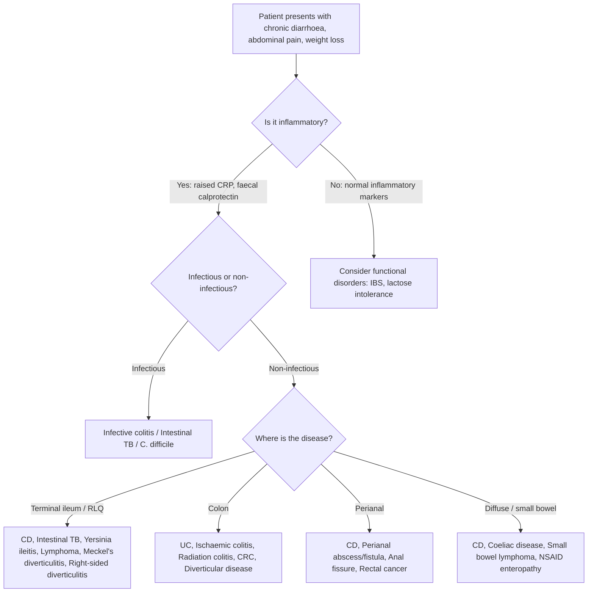

## Differential Diagnosis of Crohn's Disease

When a patient presents with features suggestive of Crohn's disease — chronic diarrhoea, abdominal pain (especially RLQ), weight loss, perianal disease, or extraintestinal manifestations — you need a systematic approach to the differential. The key question is: **"What else could cause chronic intestinal inflammation, RLQ pain, or bloody diarrhoea?"**

The differentials can be organised anatomically and by mechanism. Think about what CD looks like clinically and what other conditions mimic those features.

---

### Approach to Differential Diagnosis

---

### Differential Diagnoses — Detailed Breakdown

#### 1. Ulcerative Colitis (UC)

This is the **most important differential** because both are IBD and share many features [2].

| Feature | Crohn's Disease | Ulcerative Colitis |
|:---|:---|:---|
| ***Distribution*** | ***GI tract, rectal sparing, skip lesions*** | ***Colon & rectum, continuous*** [1] |
| ***Depth*** | ***Full thickness (transmural)*** | ***Mucosal/submucosal*** [1] |
| ***Fistula*** | ***Common (intestinal/perianal)*** | ***Never*** [1] |
| ***Benign stricture*** | ***Common*** | ***Rare*** [1] |
| ***Perianal disease*** | ***Up to 40%*** | ***Rare*** [1] |
| Hematochezia | Rare | Common |
| Passage of mucus/pus | Rare | Common |
| Abdominal mass | Sometimes | Rare |
| Small bowel involvement | ✓ | ✗ (except backwash ileitis) |
| Histology | ***Focal patchy, transmural, non-caseating granulomas*** | ***Diffuse continuous, mucosal/submucosal, no granulomas*** |
| Endoscopy | ***Solitary, deep, focal ulcers; cobblestone; skip lesions*** | ***Shallow ulcers; pseudopolyps; continuous*** |
| Serological markers | ***ASCA positive*** | ***pANCA positive*** [3] |
| Smoking | Risk factor | Protective |
| Appendicectomy | Risk factor | Protective |

**Why is this distinction important?**
- **Surgical approach differs fundamentally**: UC is curable by total proctocolectomy (remove colon + rectum → disease is gone). CD is NOT curable by surgery — disease can recur anywhere in the GI tract, so the ***surgical principle is preservation of bowel length*** [4]. If you misdiagnose UC as CD, you might under-operate; if you misdiagnose CD as UC and create an ileal pouch-anal anastomosis (IPAA), Crohn's recurrence in the pouch is devastating.
- ***Indeterminate colitis (10%)*** — when you genuinely cannot distinguish: treat surgically as UC [1][2]

<Callout title="ASCA vs pANCA" type="idea">
A helpful mnemonic: **A**SCA = **A**ffects CD ("A" for "Another bowel disease, not UC"). **p**ANCA = **p**rototypical of **U**C. Neither is diagnostic alone, but the combination ASCA+/pANCA− strongly suggests CD, while ASCA−/pANCA+ suggests UC.
</Callout>

---

#### 2. Intestinal Tuberculosis

This is the **critical differential in Hong Kong** where TB is endemic [5][2].

| Feature | Crohn's Disease | Intestinal TB |
|:---|:---|:---|
| Site | Terminal ileum (most common) | Terminal ileum / ileocaecal (also most common) |
| Granulomas | **Non-caseating**, small, scattered | **Caseating**, large, confluent |
| Ulcers | Longitudinal (along mesenteric border) | **Transverse/circumferential** (perpendicular to long axis — because TB spreads via lymphatics which run transversely) |
| Strictures | Common | Common |
| Fistulae | Common | Less common |
| Systemic features | Possible low-grade fever | Fever, night sweats, weight loss (more prominent) |
| CXR | Usually normal | May show pulmonary TB (but can be negative) |
| AFB stain/culture | Negative | May be positive (low sensitivity ~30%) |
| TB PCR | Negative | Higher sensitivity |
| Histology | Non-caseating, < 5 granulomas per section | Caseating, > 5 granulomas per section, larger granulomas |
| Response to anti-TB therapy | No improvement | Improves within 2-3 months |

**Why does intestinal TB mimic CD?**
- Both cause granulomatous inflammation of the terminal ileum with strictures and mass formation. The ileocaecal region is the site of highest lymphoid tissue concentration — TB bacilli are ingested, survive in macrophages, and preferentially settle where lymphoid tissue is abundant (Peyer's patches), just like the immune-mediated process of CD.

**Key approach in Hong Kong:**
- ***MUST do AFB smear and culture*** with sensitivity testing on all biopsies to ***rule out enteric TB*** [2][3]
- If histology is equivocal, a **therapeutic trial of anti-TB therapy** (2 months) is sometimes given before committing to CD diagnosis and immunosuppressive therapy (which would be disastrous in TB)
- Tissue **TB PCR** (GeneXpert) has improved sensitivity
- IGRA (QuantiFERON) and Mantoux test assess exposure but cannot distinguish latent from active TB

<Callout title="TB Before Biologics" type="error">
Before starting any biologic therapy (anti-TNF, etc.) for CD, you MUST screen for latent TB (CXR + IGRA/Mantoux). TNF-α is critical for granuloma maintenance in TB — anti-TNF therapy can reactivate latent TB with devastating consequences (disseminated TB). This is especially important in Hong Kong.
</Callout>

---

#### 3. ***Infective Colitis / Ileitis*** [2][5]

***Infections including E. coli, Salmonella, Shigella, Campylobacter, Yersinia and amebiasis should be excluded with stool studies*** [2].

| Organism | Key Features | Why It Mimics CD |
|:---|:---|:---|
| ***Yersinia enterocolitica*** | ***Acute ileitis***, RLQ pain, mesenteric lymphadenitis; may be ***misdiagnosed as acute appendicitis*** [5] | Affects terminal ileum; can cause granulomatous inflammation; presents identically to acute CD flare |
| ***Campylobacter*** | Bloody diarrhoea, fever, abdominal cramps | Colonic inflammation on endoscopy can look like IBD |
| ***Salmonella*** | Enteritis with watery → bloody diarrhoea, fever | Ileocaecal involvement |
| ***Shigella*** | Dysentery (bloody mucoid diarrhoea), tenesmus | Rectal/colonic inflammation mimics UC or colonic CD |
| *E. coli* O157:H7 | Bloody diarrhoea, may cause HUS | Colonic inflammation and ulceration |
| ***Entamoeba histolytica*** | Amoebic dysentery, flask-shaped ulcers in colon | Chronic colitis, may form amoeboma (inflammatory mass) |
| Cytomegalovirus (CMV) | Immunosuppressed patients; deep colonic ulcers | Can superinfect existing IBD; deep ulcers mimic CD |

**Why must you exclude infection before diagnosing CD?**
- Starting immunosuppressive therapy (steroids, biologics) in a patient with undiagnosed infection is dangerous — you would worsen the infection
- Infective colitis is **self-limiting** (days to weeks) while CD is chronic and relapsing
- A single episode of bloody diarrhoea with positive stool cultures = infection, not IBD
- However, note that ***infectious gastroenteritis in the prior 1 year*** is actually a risk factor for triggering CD onset in genetically susceptible individuals [2]

**Key discriminating factors:**
- **Acute onset** (days) vs. chronic/relapsing course (weeks-months) in CD
- **Travel history** (TOCC — travel, occupation, contacts, clusters)
- **Stool cultures**, microscopy for ova/parasites, ***C. difficile toxin PCR*** [3]

---

#### 4. ***Clostridium difficile (C. difficile) Infection*** [2][3]

***C. difficile infection should be considered particularly in patients treated with antibiotics*** [2].

- **Pseudomembranous colitis** — C. difficile toxins A (enterotoxin) and B (cytotoxin) damage colonocytes → yellowish-white plaques (pseudomembranes) on endoscopy
- **Why it matters in CD**: C. difficile can **superinfect** patients with IBD who are on immunosuppression, causing a flare that looks like worsening disease but is actually infection. Always send ***C. difficile toxin PCR*** before escalating immunosuppression for an apparent flare [3]
- Distinguishing feature: Recent antibiotic use, abrupt watery diarrhoea (may become bloody), pseudomembranes on sigmoidoscopy

---

#### 5. ***Irritable Bowel Syndrome (IBS)*** [2]

***Presents with chronic abdominal pain and altered bowel habits in the absence of an organic cause*** [2].

| Feature | Crohn's Disease | IBS |
|:---|:---|:---|
| Inflammatory markers | Elevated (CRP, ESR, faecal calprotectin) | **Normal** |
| Nocturnal symptoms | Common (wakes patient from sleep) | Rare (functional disorders spare sleep) |
| Weight loss | Common | Absent |
| Rectal bleeding | Possible (colonic disease) | Absent |
| Fever | Possible | Absent |
| Endoscopy/histology | Abnormal | **Normal** |
| Faecal calprotectin | Elevated | **Normal** (< 50 μg/g) |

**Why is this differential important?**
- IBS is extremely common (10-15% of the population) while CD is rare (~0.1%). Many patients initially diagnosed with IBS actually have early or mild CD. The key is that IBS has **no objective evidence of inflammation** — if inflammatory markers are elevated, you must investigate further.
- ***Faecal calprotectin is the most sensitive marker of intestinal inflammation in IBD*** [3] and is the best screening test to differentiate IBD from IBS. A normal faecal calprotectin essentially excludes active IBD.

---

#### 6. ***Lactose Intolerance*** [2]

***Intolerance to lactose-containing food such as dairy products. Presents with abdominal pain, diarrhoea and flatulence after ingestion of milk or milk-containing products*** [2].

- **Why it mimics CD**: Chronic diarrhoea and abdominal cramps after eating
- **Why it's different**: Symptoms are temporally related to lactose ingestion only, no systemic features, no weight loss, normal inflammatory markers, normal endoscopy
- **Complication**: CD patients can develop **secondary lactose intolerance** due to mucosal damage in the small bowel (brush border lactase is destroyed) — so both conditions can coexist
- Diagnosed by hydrogen breath test or trial elimination diet

---

#### 7. Colorectal Cancer (CRC) [6][7]

- ***CRC is a less common but serious cause of hematochezia*** [6]
- CRC can present with change in bowel habits, weight loss, anaemia, and bowel wall thickening on CT — all features overlapping with CD
- ***IBD (UC > CD) is a risk factor for CRC*** [7] — so CRC can develop ON TOP of existing CD
- CD patients with colonic involvement have increased CRC risk, necessitating surveillance colonoscopy
- Key distinguishing features: Older age (usually > 50), progressive unrelenting symptoms, obstructive features (change in stool calibre, tenesmus), mass on imaging, biopsy shows adenocarcinoma

---

#### 8. ***Ischaemic Colitis*** [6][8]

- ***Presents with rapid onset of abdominal pain, hematochezia or bloody diarrhoea*** [6]
- Typically in elderly patients with **cardiovascular risk factors** (HT, DM, AF, atherosclerosis) or thromboembolic risk factors (OCP) [8]
- Affects **watershed zones**: ***splenic flexure (Griffith's point)*** and ***rectosigmoid junction (Sudeck's point)*** [8]
- Key feature: ***generalised abdominal pain out of proportion to physical findings*** [8]
- **Why it mimics CD**: Segmental colonic inflammation, ulceration, stricture formation. However, ischaemic colitis is typically acute onset in elderly (not chronic relapsing in young patients), and the distribution follows vascular territories, not Peyer's patch distribution.

---

#### 9. ***Acute Appendicitis*** [5][9]

***Sometimes misdiagnosed with acute appendicitis — incidental finding of inflamed terminal ileum during operation*** [5].

- **Why it mimics CD**: Both cause RLQ pain, fever, tenderness, and sometimes a RLQ mass
- ***Ileitis causes*** include: ***Crohn's disease, TB, Radiation enteritis, Bacterial infection (Campylobacter, Yersinia, Salmonella)*** [5]
- Key distinguishing features:
  - Appendicitis: Acute onset (hours), migratory pain (periumbilical → RLQ), anorexia, single episode
  - CD: Chronic/relapsing course (weeks-months), diarrhoea is prominent, associated features (perianal disease, weight loss, EIMs)
  - ***Pointing sign, Rovsing's sign, Psoas sign, Obturator sign*** are specific for appendicitis [9]
- **Important scenario**: A patient taken to theatre for suspected appendicitis is found to have a normal appendix but inflamed terminal ileum → this is **acute ileitis** → do NOT resect → biopsy and close → investigate for CD/infection post-operatively

---

#### 10. Diverticular Disease [10]

- ***Right-sided diverticulitis is more common in Asian populations*** [10] → RLQ pain mimicking CD or appendicitis
- ***Clinical triad of diverticulitis: lower abdominal pain (RLQ in Asia) + fever + leucocytosis*** [10]
- Can cause strictures, fistulae (most commonly colovesical), and abscesses — similar complications to CD
- **Why it mimics CD**: Both cause segmental inflammation, strictures, fistulae, and abscesses
- **How to distinguish**: Diverticulitis is acute, episodic; CT shows pericolonic inflammation with diverticula; older age group; no skip lesions; no perianal disease; no EIMs

---

#### 11. ***Radiation Colitis/Enteritis*** [5][6]

***Occurs in weeks to years after abdominal or pelvic irradiation*** [2].

- History of radiation therapy for pelvic malignancy (cervical, prostate, rectal cancer)
- Acute radiation injury: within 6 weeks — diarrhoea, tenesmus, rectal bleeding
- Chronic radiation injury: months to years — strictures, fistulae, ulceration, bleeding
- **Why it mimics CD**: Chronic stricturing, fistulising colitis. But the distribution matches the radiation field exactly, and there is clear history of prior radiotherapy.
- Listed as a cause of ***ileitis*** [5] and ***PR bleeding*** [6]

---

#### 12. ***Medication-Associated Colitis*** [2]

***NSAIDs can cause chronic diarrhoea and bleeding*** [2].

- NSAIDs inhibit COX → reduced prostaglandin synthesis → loss of mucosal protection → ulceration, strictures (NSAID diaphragm disease), and bleeding throughout the small and large bowel
- Can mimic CD both clinically and endoscopically (small bowel ulcers, strictures)
- History of NSAID use is the key discriminating factor; resolves on cessation

---

#### 13. Other Differentials

**a) Small Bowel Lymphoma**
- Can present with chronic abdominal pain, weight loss, malabsorption, and small bowel mass/stricture
- Particularly consider in immunosuppressed patients or those with coeliac disease
- Distinguished by biopsy showing lymphomatous infiltrate

**b) Coeliac Disease**
- Chronic diarrhoea, weight loss, malabsorption, iron/folate deficiency
- Affects the proximal small bowel (duodenum/jejunum) — different from CD which favours the terminal ileum
- Diagnosed by anti-tTG antibodies and duodenal biopsy showing villous atrophy
- No perianal disease, no fistulae, no granulomas

**c) ***Meckel's Diverticulitis*** [5][9]**
- Congenital remnant of the omphalomesenteric (vitelline) duct
- **Rule of 2s**: 2% of population, 2 feet from ileocaecal valve, 2 inches long, 2 types of ectopic tissue (gastric/pancreatic), presents before age 2 (in children)
- Can cause RLQ pain mimicking appendicitis or CD, or painless GI bleeding (ectopic gastric mucosa → acid → ulceration)

**d) ***Solitary Rectal Ulcer Syndrome*** [2]**
- ***Presents with abdominal pain, altered bowel habits and bleeding***
- ***Has a characteristic appearance on histology with a thickened mucosal layer and distortion of crypt architecture*** [2]
- Usually associated with rectal prolapse or excessive straining

**e) Behçet's Disease**
- Systemic vasculitis causing oral ulcers, genital ulcers, uveitis, and GI ulceration (especially ileocaecal region)
- Can closely mimic CD — distinguish by the presence of genital ulcers and pathergy test

---

### Summary Table of Key Differentials

| Differential | Key Distinguishing Feature from CD |
|:---|:---|
| ***UC*** | Continuous colonic inflammation, no skip lesions, no fistulae, rectal always involved, pANCA+, shallow ulcers |
| ***Intestinal TB*** | Caseating granulomas, transverse ulcers, AFB+/PCR+, responds to anti-TB Rx; ***must exclude in HK*** |
| ***Infective colitis*** | Acute onset, positive stool cultures, self-limiting, TOCC history |
| ***C. difficile*** | Recent antibiotics, pseudomembranes, toxin PCR positive |
| ***IBS*** | No inflammation (normal CRP, calprotectin, endoscopy) |
| ***Lactose intolerance*** | Symptoms only with dairy, no inflammation |
| ***CRC*** | Progressive, older age, mass/stricture on imaging, biopsy shows adenocarcinoma |
| ***Ischaemic colitis*** | Acute onset, elderly, CVS risk factors, watershed zones |
| ***Appendicitis*** | Acute single episode, migratory pain, no chronic diarrhoea |
| ***Diverticular disease*** | Acute episodic, diverticula on CT, older age, right-sided in Asia |
| ***Radiation colitis*** | History of pelvic radiotherapy, distribution matches radiation field |
| ***NSAID enteropathy*** | History of NSAID use, resolves on cessation |

---

### Investigations to Differentiate (Brief Overview)

This will be covered in detail in the Diagnosis section, but the key tests used to differentiate CD from its mimics include:

| Investigation | Purpose |
|:---|:---|
| ***Faecal calprotectin*** | Differentiates inflammatory (IBD) from non-inflammatory (IBS) causes — ***most sensitive marker of intestinal inflammation in IBD*** [3] |
| ***Stool cultures, ova/parasites, C. difficile toxin PCR*** | Excludes infectious causes [2][3] |
| ***ASCA / pANCA*** | ***ASCA common in CD; pANCA common in UC*** [3] |
| ***Colonoscopy + biopsy*** | Gold standard — tissue diagnosis; ***MUST do AFB smear and culture*** [2] |
| ***CXR, IGRA, Mantoux*** | Excludes pulmonary/latent TB |
| ***CT/MR enterography*** | Evaluates small bowel disease (strictures, fistulae, abscesses) — helps distinguish CD from lymphoma, TB |
| ***MRI anal canal*** | Evaluates perianal CD [3] |
| ***Anti-tTG antibodies*** | Excludes coeliac disease |

<Callout title="The 3 Things You Must Exclude Before Diagnosing CD in Hong Kong">

1. **Intestinal TB** — AFB smear/culture/PCR on all biopsies; CXR; IGRA
2. **Infection** — stool cultures, ova/parasites, C. difficile toxin
3. **Malignancy** — colonoscopy with biopsy (CRC); cross-sectional imaging (lymphoma)

Only after excluding these can you confidently diagnose CD and start immunosuppression.
</Callout>

---

<ActiveRecallQuiz
  title="Active Recall - Crohn's Disease: Differential Diagnosis"
  items={[
    {
      question: "A 28-year-old male in Hong Kong presents with RLQ pain, chronic diarrhoea, and weight loss. Colonoscopy shows terminal ileal ulceration with granulomas. What is the most important differential diagnosis to exclude in this setting, and how would you do it?",
      markscheme: "Intestinal TB is the most important differential in Hong Kong. Exclude by: AFB smear and culture on biopsy specimens, tissue TB PCR (GeneXpert), CXR for pulmonary TB, IGRA/Mantoux for latent TB. TB granulomas are caseating and larger; TB ulcers are transverse. If equivocal, trial of anti-TB therapy for 2 months before committing to immunosuppression."
    },
    {
      question: "How does faecal calprotectin help in the differential diagnosis of Crohn's disease? What is it and what does a normal result tell you?",
      markscheme: "Faecal calprotectin is a neutrophil-derived protein (60% of neutrophil cytosol) released during intestinal inflammation. It is the most sensitive marker of intestinal inflammation in IBD. A normal result (less than 50 microg/g) essentially excludes active IBD, helping differentiate IBD from IBS and other non-inflammatory causes. It also correlates with endoscopic disease activity and predicts relapse."
    },
    {
      question: "List 4 key clinical features that distinguish Crohn's disease from ulcerative colitis.",
      markscheme: "1. CD has skip lesions vs UC is continuous. 2. CD is transmural (full thickness) vs UC is mucosal/submucosal. 3. CD causes fistulae (common) vs UC never causes fistulae. 4. CD has perianal disease (up to 40%) vs UC rarely. Also acceptable: CD has rectal sparing, deep focal ulcers, non-caseating granulomas, ASCA positive; UC has pseudopolyps, shallow ulcers, pANCA positive."
    },
    {
      question: "Why is it dangerous to start immunosuppressive therapy for presumed Crohn's disease without first excluding infection and TB?",
      markscheme: "Immunosuppression (steroids, biologics like anti-TNF) suppresses the immune response. In undiagnosed infection, this would worsen the infection and potentially cause sepsis. In latent TB, anti-TNF agents block TNF-alpha which is critical for granuloma maintenance and TB containment, leading to reactivation and potentially disseminated TB. This is especially important in TB-endemic Hong Kong."
    },
    {
      question: "A patient with known Crohn's disease on azathioprine presents with acute watery diarrhoea after a course of amoxicillin. What diagnosis should you consider and how would you investigate?",
      markscheme: "C. difficile infection (pseudomembranous colitis). Investigate with stool C. difficile toxin PCR (toxins A and B). Important because C. difficile can superinfect IBD patients on immunosuppression after antibiotic use. Must exclude before escalating immunosuppression for a presumed CD flare."
    }
  ]}
/>

## References

[1] Lecture slides: Inflammatory bowel disease.pdf (p2, p6, p9)
[2] Senior notes: felixlai.md (Inflammatory bowel disease — Crohn's disease, differential diagnosis and diagnosis sections)
[3] Lecture slides: Inflammatory bowel disease.pdf (p10, p11, p12)
[4] Senior notes: maxim.md (Inflammatory bowel disease — surgical principles)
[5] Lecture slides: GC 195. Lower and diffuse abdominal pain RLQ problems; pelvic inflammatory disease; peritonitis and abdominal emergencies.pdf (p20 — Ileitis)
[6] Lecture slides: GC 186. Lower and diffuse abdominal painfresh blood in stool.pdf (p8 — Causes of PR bleeding)
[7] Senior notes: maxim.md (Colorectal cancer — risk factors)
[8] Senior notes: maxim.md (Ischaemic bowel — clinical features and pathogenesis)
[9] Senior notes: maxim.md (Acute appendicitis — differential diagnosis)
[10] Senior notes: maxim.md (Diverticular disease — clinical features)
