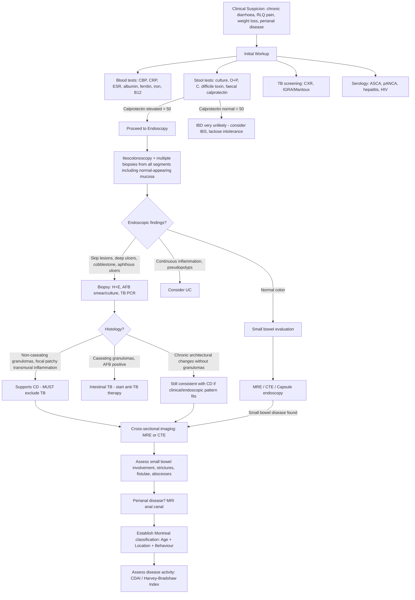

## Diagnostic Criteria, Algorithm, and Investigations for Crohn's Disease

### Important Principle: There Is No Single Diagnostic Test for CD

This is a critical point to understand from first principles. Unlike many conditions where a single blood test or imaging study clinches the diagnosis, **Crohn's disease has no pathognomonic test**. The diagnosis is made by integrating clinical presentation, laboratory findings, endoscopic appearance, histology, and imaging — essentially a **pattern recognition exercise** that requires you to piece together multiple lines of evidence while actively excluding mimics (especially intestinal TB and infections in Hong Kong).

The ECCO (European Crohn's and Colitis Organisation) guidelines state: *"The diagnosis of CD is confirmed by clinical evaluation and a combination of endoscopic, histological, radiological, and biochemical investigations. No single gold standard exists."*

---

### Diagnostic Criteria

While there is no single set of universally accepted "diagnostic criteria" like the Jones criteria for rheumatic fever, the diagnosis of CD rests on demonstrating a **characteristic constellation** of findings:

| Domain | Characteristic CD Finding | Why This Matters |
|:---|:---|:---|
| **Clinical** | Chronic (> 6 weeks) diarrhoea, abdominal pain, weight loss, perianal disease | Acute diarrhoea (< 2 weeks) = likely infectious, not IBD |
| **Endoscopic** | ***Skip lesions, deep focal ulcers, cobblestone mucosa, aphthous ulcers, strictures, fistulae*** [2] | These patterns reflect the patchy transmural nature of CD |
| **Histological** | ***Focal patchy transmural inflammation, non-caseating granulomas (must exclude TB), preserved goblet cells, crypt architectural distortion*** [2] | Granulomas found in ~30-50% of biopsies; their absence does NOT exclude CD |
| **Radiological** | Small bowel wall thickening, strictures, fistulae, creeping fat, mesenteric lymphadenopathy on CTE/MRE | Demonstrates transmural and extraluminal disease invisible to endoscopy |
| **Biochemical** | Elevated inflammatory markers (CRP, ESR), elevated faecal calprotectin, ASCA positivity | Supports inflammatory aetiology; helps differentiate from IBS |

<Callout title="No Granuloma ≠ No Crohn's" type="error">
A very common student mistake: expecting granulomas on every CD biopsy. Non-caseating granulomas are found in only ~30-50% of mucosal biopsies. Their presence strongly supports the diagnosis, but their absence does NOT exclude CD. The overall pattern of focal patchy chronic inflammation with architectural distortion is more important than the granuloma alone.
</Callout>

---

### Diagnostic Algorithm

The approach to diagnosing CD follows a systematic pathway: **History & Examination → Screening blood/stool tests → Endoscopy with biopsy → Cross-sectional imaging → Exclude mimics → Establish Montreal classification**.

---

### Investigation Modalities — Detailed Breakdown

#### I. History and Physical Examination

***Diagnosis begins with patient history and physical examination*** [3]:

**History** — ***systematically cover*** [3]:
- ***Bowel symptoms***: Duration, frequency, consistency of diarrhoea; presence of blood/mucus; nocturnal symptoms (nocturnal diarrhoea is a red flag for organic disease — functional disorders spare sleep)
- ***Medications***: NSAIDs (can trigger flares or cause NSAID enteropathy mimicking CD), antibiotics (C. difficile risk)
- ***Surgery***: Previous appendicectomy (risk factor for CD), prior bowel resections
- ***Drug history***: Immunosuppressants, biologics if known IBD
- ***Immunization status***: Important before starting immunosuppression (need to ensure vaccinations are up-to-date, especially live vaccines which are contraindicated on biologics) [3]
- Travel history, sexual history (proctitis differentials: gonorrhoea, HSV, chlamydia), TB contacts, family history of IBD

**Physical Examination** [3]:
- ***General and abdomen***: Nutritional status, pallor, fever, abdominal tenderness/mass, surgical scars
- ***Perianal region: skin tags, fissures, fistulas, abscess, PR exam*** — never skip this in suspected CD [3]
- ***Extraintestinal inspections: mouth, eyes, skin and joints*** [3] — oral aphthous ulcers, episcleritis/uveitis, erythema nodosum/pyoderma gangrenosum, peripheral arthropathy

<Callout title="The Complete IBD Examination" type="idea">
Think of it as a **head-to-toe survey**: Mouth (aphthous ulcers) → Eyes (episcleritis, uveitis) → Skin (erythema nodosum on shins, pyoderma gangrenosum) → Joints (swelling, restricted spinal movement) → Abdomen (tenderness, mass, scars) → Perianal (tags, fissures, fistulae, abscess) → General (nutritional status, clubbing, pallor). This is exactly what the lecture slide tells you to do [3].
</Callout>

---

#### II. Laboratory Tests

##### A. Blood Tests

***Blood tests: CBP, CRP, ESR, albumin, ferritin*** [3]

| Test | Expected Finding in CD | Pathophysiological Basis | Clinical Utility |
|:---|:---|:---|:---|
| ***CBP (Complete Blood Picture)*** | Anaemia (microcytic or macrocytic), leucocytosis, thrombocytosis | **Microcytic**: iron deficiency from chronic GI blood loss or impaired duodenal iron absorption. **Macrocytic**: B12 deficiency from terminal ileal disease. **Leucocytosis**: active inflammation or infection/abscess. **Thrombocytosis**: reactive — platelets are acute phase reactants (IL-6 stimulates thrombopoiesis) | Detects anaemia type and guides supplementation; leucocytosis may suggest complication [2] |
| ***CRP (C-reactive protein)*** | ***Elevated (typically higher in CD than UC)*** [2] | CRP is synthesised by hepatocytes in response to IL-6 (released from activated macrophages in the inflamed bowel wall). CD's transmural inflammation generates more IL-6 than UC's superficial inflammation → higher CRP | ***CRP monitoring under therapy is useful to document efficacy of anti-inflammatory treatment*** [2]. Rapidly responsive (half-life ~19 hours) — good for acute monitoring |
| ***ESR (Erythrocyte Sedimentation Rate)*** | Elevated | Fibrinogen (acute phase protein) coats RBCs → increased rouleaux formation → faster sedimentation. Less specific than CRP, slower to change | Trends over time; less useful for acute monitoring |
| ***Albumin*** | ***Hypoalbuminaemia*** | ***Malabsorption and protein-losing enteropathy*** [2] — inflamed mucosa leaks albumin into the gut lumen; reduced hepatic synthesis (negative acute phase reactant); reduced oral intake | Marker of nutritional status and disease severity. Low albumin = poor prognosis |
| ***Ferritin*** | Low (iron deficiency) or normal/high (acute phase reactant in active inflammation) | Ferritin stores iron but is also an acute phase reactant. In active CD, ferritin may be falsely "normal" despite true iron deficiency because inflammation elevates it | Check transferrin saturation alongside ferritin to assess true iron stores |
| ***Serum iron and vitamin B12*** | Iron ↓, B12 ↓ | Iron: malabsorption (duodenal/proximal jejunal disease) + chronic blood loss. ***Vitamin B12 deficiency***: terminal ileum is the SOLE site of B12 absorption → ileal disease or resection → deficiency [2] | Guides supplementation; B12 deficiency suggests ileal involvement |

Additional blood tests:
- **LFT**: Elevated ALP/GGT may suggest ***primary sclerosing cholangitis (PSC)***; assess liver function before starting hepatotoxic drugs (methotrexate, azathioprine)
- **RFT**: Baseline renal function; oxalate nephropathy in terminal ileal disease
- ***Hepatitis serology, HIV, TB testing*** [3] — **mandatory before starting immunosuppression/biologics**
  - Hepatitis B reactivation can occur with anti-TNF therapy → screen HBsAg, anti-HBc, anti-HBs
  - HIV affects treatment decisions and differential diagnosis
  - TB screening (CXR + IGRA) is essential before anti-TNF therapy because TNF-α is critical for granuloma maintenance in TB

##### B. Serological Markers

| Marker | Association | Sensitivity/Specificity | Interpretation |
|:---|:---|:---|:---|
| ***Anti-Saccharomyces cerevisiae antibodies (ASCA)*** | ***Common in Crohn's disease (CD)*** [2][3] | Sensitivity ~50-60% for CD; Specificity ~90% | ASCA = antibodies against the yeast *Saccharomyces cerevisiae*. Present in ~60% of CD. Suggests abnormal immune response to gut microbes |
| ***Perinuclear antineutrophil cytoplasmic antibodies (pANCA)*** | ***Common in ulcerative colitis (UC)*** [2][3] | Sensitivity ~60-70% for UC | pANCA targets perinuclear antigens in neutrophils. Present in ~65% of UC, ~10-15% of CD |
| Anti-OmpC antibody | Potential serological marker for IBD [2] | Less well-established | Antibody against outer membrane porin C of *E. coli* |

**How to use serology in practice:**
- **ASCA+/pANCA−** → strongly suggests CD
- **ASCA−/pANCA+** → strongly suggests UC
- **Neither is diagnostic alone** — they are adjuncts, not definitive tests
- Most useful in **indeterminate colitis** to help lean towards CD or UC

##### C. Stool Tests

***Stool examination: culture, Cl. difficile toxin, calprotectin*** [3]

| Test | What It Detects | Why It's Important |
|:---|:---|:---|
| ***Faecal calprotectin*** | ***Neutrophil-derived protein, 60% of neutrophil cytosol*** [3] | ***Most sensitive marker of intestinal inflammation in IBD*** [3]. ***Well correlated with endoscopic disease activity*** [3]. ***Predicts disease relapse, post-op relapse*** [3]. A normal result (< 50 μg/g) essentially excludes active IBD — brilliant for differentiating IBD from IBS without invasive endoscopy |
| Stool culture | ***E. coli O157:H7, Salmonella, Shigella, Yersinia, Campylobacter*** [2] | Must exclude infectious colitis before diagnosing CD |
| Microscopy | ***Ova, parasites*** [2] | Excludes parasitic infection (amoebiasis, giardiasis) |
| Antigen detection | ***E. coli O157:H7, Entamoeba, Cryptosporidium, Giardia*** [2] | More sensitive than microscopy for protozoa |
| ***C. difficile toxin PCR*** | ***Clostridium difficile toxin A (enterotoxin) and B (cytotoxin)*** [2][3] | ***Must be considered in patients treated with antibiotics*** [2]. Can superinfect IBD patients on immunosuppression — always check before escalating therapy for a "flare" |

<Callout title="Faecal Calprotectin — The Gatekeeper Test">

Think of faecal calprotectin as the **gatekeeper** to endoscopy. In a young patient with chronic diarrhoea:
- **Calprotectin < 50 μg/g** → IBD is very unlikely → think IBS, lactose intolerance → avoid invasive endoscopy
- **Calprotectin > 50 μg/g** (especially > 250) → significant intestinal inflammation → proceed to endoscopy

It's also invaluable for monitoring: rising calprotectin in a patient in clinical remission predicts relapse before symptoms appear, allowing pre-emptive treatment escalation.
</Callout>

---

#### III. Endoscopy

Endoscopy is the **cornerstone** of CD diagnosis because it allows direct visualisation of the mucosa AND tissue sampling for histology.

##### A. ***Colonoscopy*** [3]

***Colonoscopy*** is the primary endoscopic investigation for both UC and CD [3].

**Technique and requirements:**
- ***Ileocolonoscopy*** — the scope must be passed through the ileocaecal valve to intubate the **terminal ileum**, as this is the most commonly affected site in CD. A colonoscopy that does not examine the terminal ileum is incomplete for IBD evaluation.
- ***Biopsy should be taken from the left and right colon and rectum even if normal in appearance to assess for microscopic inflammation*** [2]
- **Multiple biopsies** from at least 5 sites (terminal ileum, ascending colon, transverse colon, descending colon, rectum) — this is essential because CD can have microscopic inflammation even where the mucosa looks macroscopically normal
- ***MUST do AFB smear and culture with sensitivity testing to rule out enteric TB*** [2] — this is mandatory in Hong Kong

**Endoscopic findings in CD** [2]:

| Finding | Description | Pathophysiological Basis |
|:---|:---|:---|
| ***Skip lesions*** | ***Skip areas of involvement with segments of normal-appearing bowel interrupted by large areas of disease*** [2] | CD starts at discrete Peyer's patches → doesn't spread continuously |
| ***Aphthous ulcers*** | Small, shallow, round ulcers with erythematous halo; earliest endoscopic lesion | Focal inflammation at lymphoid follicles; earliest visible mucosal damage overlying Peyer's patches |
| ***Solitary, deep and focal ulceration*** [2] | Deep, linear or serpiginous ulcers | Transmural inflammation erodes deeply (unlike shallow UC ulcers which are limited to mucosa) |
| ***Cobblestone appearance*** | ***Polypoid mucosal changes; deep linear ulcers = "cracks"; inflamed tissues = "stones"*** [2] | Deep longitudinal and transverse ulcers criss-cross → oedematous surviving mucosa islands resemble cobblestones |
| ***Fistulae*** | Openings visible on mucosal surface | Transmural inflammation breaches serosa → tracks to adjacent structures |
| ***Strictures*** | Luminal narrowing — scope may not be able to pass | Chronic transmural inflammation → fibrosis → stricture |
| ***Abscesses*** | May see purulent material or localised swelling | Walled-off transmural perforation |
| Rectal sparing | Rectum appears normal | CD typically spares the rectum (unlike UC which always starts there) |

**Contrast with UC endoscopic findings:**

| Feature | CD | UC |
|:---|:---|:---|
| Pattern | Skip lesions | ***Uniform and continuous lesions*** |
| Mucosa | Cobblestone, deep ulcers | ***Hyperemic mucosa, diffuse granularity, touch friability, petechiae*** [2] |
| Ulcers | Deep, focal | ***Shallow*** [2] |
| Other | Fistulae, abscesses, strictures | ***Pseudopolyps*** (hypertrophied masses of mucous membrane resembling polyps) [2] |

##### B. ***Sigmoidoscopy (for severe active disease)*** [3]

- In **acute severe colitis**, full colonoscopy is risky (risk of perforation in an acutely inflamed, thinned colon) → ***sigmoidoscopy*** is safer as it examines only the distal colon and rectum
- Allows assessment of disease extent and severity without the risks of full bowel preparation and full colonoscopy in a sick patient
- Biopsies can still be taken for histology and C. difficile toxin

##### C. ***OGD (for foregut symptoms in CD)*** [3]

- ***OGD*** is indicated when ***foregut symptoms*** are present — dysphagia, epigastric pain, nausea [3]
- Can reveal oesophageal, gastric, or duodenal CD (aphthous ulcers, strictures, granulomatous inflammation)
- Also important in paediatric CD where upper GI involvement is more common

##### D. ***Small Bowel Capsule Endoscopy (SBCE)*** [3]

- ***Small bowel capsule endoscopy*** — the patient swallows a small wireless camera capsule that transmits images as it traverses the GI tract [3]
- Excellent for visualising the small bowel mucosa (which is not reachable by standard colonoscopy or OGD)
- Detects aphthous ulcers, mucosal erosions, and strictures in the small bowel
- **Critical limitation**: ***Should be avoided in patients with suspected intestinal stricture due to possibility of retained capsule*** [2] — the capsule can get stuck proximal to a stricture, causing obstruction. A **patency capsule** (dissolvable) should be used first if stricture is suspected.

##### E. ***Single or Double Balloon Enteroscopy*** [3]

- ***Single or double balloon enteroscopy*** allows deep intubation of the small bowel — can reach areas inaccessible to standard endoscopy [3]
- Enables **therapeutic intervention** (biopsy, dilatation, haemostasis) in small bowel disease
- More invasive and time-consuming than capsule endoscopy; typically reserved for cases where capsule endoscopy detects an abnormality that requires biopsy or treatment

---

#### IV. Histology

Biopsy specimens from colonoscopy undergo H&E staining. The key histological findings in CD:

| Finding | Description | Diagnostic Significance |
|:---|:---|:---|
| ***Focal patchy involvement*** | Inflammation is not continuous; some crypts involved, adjacent crypts normal | Distinguishes from UC (diffuse continuous) |
| ***Transmural inflammation*** | Inflammatory infiltrate extends through all bowel wall layers | Only seen in full-thickness surgical specimens, not mucosal biopsies; on mucosal biopsy, submucosal inflammation may be hinted at |
| ***Non-caseating granulomas*** | Organised collections of epithelioid macrophages ± multinucleated giant cells without central necrosis | Found in ~30-50%; highly suggestive of CD when present. ***MUST exclude TB*** — TB granulomas are caseating [2] |
| ***Goblet cells preserved (not depleted)*** [2] | Goblet cells (mucus-secreting) are maintained | In UC, goblet cells are depleted due to diffuse mucosal damage |
| ***Distortion of crypt architecture*** | Crypt branching, shortening, disarray | Indicates chronic inflammation (not just acute) — distinguishes IBD from self-limiting infectious colitis |
| ***Crypt abscess and atrophy*** | Neutrophils accumulate within crypt lumina | Active inflammation; seen in both CD and UC (not specific) |
| ***Crypt branching, shortening and disarray*** [2] | Chronic architectural change | Chronicity marker; absent in acute infections |

**Additional stains and tests on biopsy:**
- ***AFB smear and culture*** — mandatory to exclude TB [2]
- **TB PCR (GeneXpert)** — higher sensitivity than AFB stain
- **CMV immunohistochemistry** — if deep ulcers in immunosuppressed patient (CMV superinfection)

---

#### V. Cross-Sectional Imaging

Endoscopy only sees the mucosal surface. CD is **transmural** — you need cross-sectional imaging to see the full bowel wall, extraluminal complications (abscesses, fistulae), and mesenteric involvement.

##### A. ***MR Enterography (MRE)*** [3]

***MRE*** is the **preferred** imaging modality for small bowel CD assessment [3].

| Feature | Details |
|:---|:---|
| **Principle** | MRI with oral contrast (to distend the small bowel lumen) + IV gadolinium (to enhance the inflamed bowel wall) |
| **Advantages** | No ionising radiation (crucial for young CD patients who need repeated imaging over a lifetime); excellent soft tissue contrast; superior for detecting fistulae and perianal disease |
| **Key findings** | Wall thickening (> 3mm), mural enhancement (indicating active inflammation), restricted diffusion (active inflammation), strictures, fistulae, abscesses, creeping fat, mesenteric lymphadenopathy, "comb sign" (engorged vasa recta in the mesentery = increased blood flow to inflamed segment) |
| **Active vs fibrostenotic** | MRE can distinguish **active inflammatory** strictures (wall enhancement, oedema, restricted diffusion) from **fibrostenotic** strictures (no enhancement, dark on T2) — this distinction guides therapy (anti-inflammatory drugs vs. surgery/dilatation) |

##### B. ***CT Enterography (CTE)*** [3]

***CTE*** is an alternative to MRE [3].

| Feature | Details |
|:---|:---|
| **Principle** | CT with oral contrast + IV contrast |
| **Advantages** | Faster, more widely available, better for detecting abscesses and evaluating for complications in acute settings |
| **Disadvantages** | **Ionising radiation** — cumulative dose is a concern in young patients with chronic disease; less sensitive for perianal disease |
| **Key findings** | Same as MRE: wall thickening, enhancement, strictures, fistulae, abscesses, "fat stranding" (haziness of mesenteric fat = inflammation) |
| **When to use over MRE** | Acute presentations (faster), claustrophobic patients, when MRI is unavailable, evaluation of extra-intestinal complications |

##### C. ***MRI Anal Canal*** [3]

***MRI anal canal*** is the investigation of choice for ***perianal CD*** [3].

- ***24.5% of patients with Crohn's disease have perianal disease; 83% required surgery*** [11]
- ***MRI and EAUS (endoanal ultrasound) necessary to document before the definitive treatment*** [11]
- MRI provides detailed soft tissue imaging of:
  - Fistula tracts (course, complexity, relationship to sphincter)
  - Abscesses (undrained collections)
  - Sphincter integrity
- Classification: Parks classification of fistulae (intersphincteric, transsphincteric, suprasphincteric, extrasphincteric)
- Essential for **surgical planning** — the surgeon needs to know exactly where the fistula tracks before operating

##### D. Plain Radiographs

| Test | Indication | Key Findings |
|:---|:---|:---|
| **CXR** | ***Indicated in patients presenting with fever or if perforation is suspected*** [2]; also for ***TB screening*** [3] | Pneumoperitoneum (free air under diaphragm = perforation); pulmonary TB (upper lobe infiltrates, cavitation) |
| **AXR** | ***Indicated to evaluate for colonic calibre*** [2] | ***Toxic megacolon: total or segmental non-obstructive dilatation of colon ≥ 6 cm or caecum > 9 cm with systemic toxicity*** [2]; small bowel obstruction (dilated loops, air-fluid levels); thumb-printing (mucosal oedema) |

##### E. Barium Studies (Historical but Still Referenced)

| Study | Findings | Current Role |
|:---|:---|:---|
| ***Barium enema*** | ***Detects aphthous ulcers, strictures, perforations with fistula tracts*** [2] | Largely replaced by colonoscopy and CTE/MRE |
| ***Small bowel follow-through (SBFT)*** | ***Nodularity, strictures and ulceration; "cobblestone" appearance; "string sign" due to luminal narrowing*** [2] | Largely replaced by MRE/CTE and capsule endoscopy; still useful if cross-sectional imaging is unavailable |

##### F. Ultrasound (USG)

- ***USG for diagnosis of ileal Crohn's disease*** [2] — bowel wall thickening > 3mm, hyperaemia on Doppler
- ***Endoanal USG can be used to identify fistula tracts*** [2] — alternative to MRI for perianal disease assessment
- Non-invasive, no radiation, inexpensive, but operator-dependent and limited by bowel gas

---

#### VI. Disease Activity Assessment

Once the diagnosis is established, **quantifying disease activity** guides treatment decisions.

##### ***Crohn's Disease Activity Index (CDAI)*** [2]

| Severity | ***CDAI Score*** | Features |
|:---|:---|:---|
| Remission | < 150 | Asymptomatic |
| ***Mild*** | ***150-220*** | Ambulatory, eating and drinking, weight loss < 10%, CRP usually > ULN |
| ***Moderate*** | ***220-450*** | Intermittent vomiting, weight loss > 10%, CRP > ULN, tender mass, no overt obstruction, ineffective treatment for mild disease |
| ***Severe*** | ***> 450*** | Cachexia with BMI < 18, abscess formation, obstruction, persistent symptoms despite intensive treatment |

The CDAI incorporates 8 variables over 7 days: number of liquid stools, abdominal pain rating, general well-being, extraintestinal features, anti-diarrhoeal use, abdominal mass, haematocrit, and body weight. It's primarily a **research tool** — in clinical practice, a combination of symptoms, CRP, calprotectin, and endoscopic findings guides management.

##### ***Harvey-Bradshaw Index (HBI)*** [12]

- A simplified version of CDAI (only 5 variables, no 7-day diary needed): general well-being, abdominal pain, number of liquid stools, abdominal mass, complications
- ***HBI > 15*** = severe disease (indication for surgical consideration) [12]
- More practical for routine clinical use

##### Endoscopic Activity

- **Simple Endoscopic Score for Crohn's Disease (SES-CD)** — grades ulcer size, ulcerated surface area, affected surface area, and presence of narrowing
- **Mucosal healing** is now a key treatment target ("treat-to-target") — the goal is not just symptom control but endoscopic remission, as mucosal healing correlates with reduced complications, hospitalisations, and surgery

##### ***Faecal Calprotectin for Monitoring*** [3]

***Faecal calprotectin*** is invaluable for monitoring:
- ***Well correlated with endoscopic disease activity*** [3]
- ***Predicts disease relapse, post-op relapse*** [3]
- Non-invasive alternative to repeated colonoscopy for tracking disease activity
- Rising calprotectin in clinical remission → subclinical inflammation → consider treatment intensification before clinical relapse

---

#### VII. Montreal Classification — Established at Diagnosis

After completing the diagnostic workup, the patient is classified using the ***Montreal classification*** [1]:

| Category | Code | Description | ***Frequency*** |
|:---|:---|:---|:---|
| **Age** | ***A1*** | ***< 16 years*** | |
| | ***A2*** | ***17-40 years*** | Most common |
| | ***A3*** | ***> 40 years*** | |
| **Location** | ***L1*** | ***Ileal*** | ***24.5%*** |
| | ***L2*** | ***Colonic*** | ***32.3%*** |
| | ***L3*** | ***Ileocolonic*** | ***43.1%*** |
| | ***L4*** | ***Isolated upper GI*** | Modifier |
| **Behaviour** | ***B1*** | ***Inflammatory (non-stricturing, non-penetrating)*** | ***65.2%*** |
| | ***B2*** | ***Stricturing*** | ***25.1%*** |
| | ***B3*** | ***Penetrating*** | ***16.1%*** |
| | ***P*** | ***Perianal*** | ***24.5%*** |

The Montreal classification is established using the **combination** of endoscopy (location, fistulae), imaging (strictures, fistulae, abscesses), and clinical assessment (perianal disease). It is dynamic — a patient initially classified as B1 may progress to B2 or B3 over time, requiring reclassification and treatment adjustment.

---

#### VIII. Pre-Treatment Screening Checklist

Before initiating therapy (especially immunosuppression/biologics), the following must be completed:

| Screening | Purpose |
|:---|:---|
| ***Hepatitis serology (HBsAg, anti-HBc, anti-HBs)*** [3] | HBV reactivation risk with immunosuppression |
| ***HIV testing*** [3] | Affects treatment and differential |
| ***TB testing (CXR, IGRA/Mantoux)*** [3] | Latent TB reactivation with anti-TNF agents |
| Varicella zoster immunity | Risk of severe varicella on immunosuppression |
| ***Immunization status*** [3] | Live vaccines contraindicated on biologics — complete before starting |
| Baseline TPMT/NUDT15 | Before azathioprine/6-MP — genetic polymorphisms cause fatal myelosuppression |
| Baseline LFT, RFT, CBP | Hepatotoxicity (methotrexate, azathioprine), myelosuppression monitoring |

<Callout title="Mandatory TB Screening Before Biologics" type="error">
In Hong Kong, where TB is endemic, EVERY patient must have TB screening (CXR + IGRA) before starting anti-TNF therapy. Failure to do so can lead to reactivation of latent TB with potentially fatal disseminated disease. TNF-α is essential for forming and maintaining granulomas that contain TB bacilli — blocking TNF-α releases the contained bacteria.
</Callout>

---

<Callout title="High Yield Summary — Diagnosis of Crohn's Disease">

**No single diagnostic test exists** — diagnosis requires integration of clinical, endoscopic, histological, radiological, and biochemical findings.

**Key investigations:**
- ***Blood tests: CBP, CRP, ESR, albumin, ferritin, B12, iron*** [3]
- ***Stool: culture, C. difficile toxin, calprotectin*** [3] — calprotectin is the gatekeeper (most sensitive marker, correlates with activity, predicts relapse)
- ***Serology: ASCA (CD), pANCA (UC)*** [3]
- ***Ileocolonoscopy + biopsies from all segments + AFB smear/culture*** [2] — gold standard
- ***MRE or CTE for small bowel evaluation*** [3]; ***MRI anal canal for perianal disease*** [3]
- ***Pre-treatment: Hepatitis serology, HIV, TB testing, immunisation status*** [3]

**Endoscopic hallmarks**: Skip lesions, deep focal ulcers, cobblestone mucosa, aphthous ulcers, strictures, fistulae

**Histological hallmarks**: Focal patchy transmural inflammation, non-caseating granulomas (30-50%, must exclude TB), preserved goblet cells, crypt architectural distortion

**Disease activity**: CDAI (mild 150-220, moderate 220-450, severe > 450) or HBI; CRP and calprotectin for monitoring

**Montreal classification** at diagnosis: A (age) + L (location) + B (behaviour) + P (perianal modifier)
</Callout>

---

<ActiveRecallQuiz
  title="Active Recall - Crohn's Disease: Diagnosis"
  items={[
    {
      question: "What is faecal calprotectin, and why is it considered the gatekeeper test in the diagnostic workup of suspected IBD?",
      markscheme: "Faecal calprotectin is a neutrophil-derived protein (60% of neutrophil cytosol). It is the most sensitive marker of intestinal inflammation in IBD. A normal level (less than 50 microg/g) essentially excludes active IBD, differentiating it from IBS without invasive endoscopy. It correlates well with endoscopic disease activity and predicts disease relapse and post-operative relapse."
    },
    {
      question: "List the key endoscopic findings of Crohn's disease on ileocolonoscopy and explain the pathophysiological basis of cobblestone appearance.",
      markscheme: "Key findings: skip lesions, aphthous ulcers, solitary deep focal ulceration, cobblestone appearance, fistulae, abscesses, strictures, rectal sparing. Cobblestone appearance: deep longitudinal and transverse ulcers criss-cross the mucosa creating cracks, while intervening oedematous surviving mucosa forms raised islands (stones). This reflects the transmural nature of CD inflammation."
    },
    {
      question: "A colonoscopy biopsy in a young Hong Kong patient shows terminal ileal granulomas. What additional tests MUST be sent on the biopsy, and why?",
      markscheme: "MUST send AFB smear and culture with sensitivity testing, and TB PCR (GeneXpert), to rule out intestinal TB. In TB-endemic Hong Kong, intestinal TB causes granulomatous terminal ileitis indistinguishable from CD. TB granulomas are typically caseating; starting immunosuppression for misdiagnosed TB would be catastrophic."
    },
    {
      question: "Compare MR enterography and CT enterography for small bowel CD assessment. When would you prefer each?",
      markscheme: "MRE: preferred for routine assessment - no ionising radiation (critical for young patients needing repeated imaging), excellent soft tissue contrast, superior for fistulae and perianal disease, can distinguish active inflammatory from fibrostenotic strictures. CTE: preferred in acute presentations (faster, more widely available), better for abscesses. CTE disadvantage is cumulative radiation dose."
    },
    {
      question: "What pre-treatment screening investigations are mandatory before starting anti-TNF therapy for Crohn's disease, and why?",
      markscheme: "1. TB screening (CXR plus IGRA/Mantoux): anti-TNF blocks TNF-alpha which maintains granulomas containing TB - risk of latent TB reactivation. 2. Hepatitis B serology (HBsAg, anti-HBc, anti-HBs): risk of HBV reactivation with immunosuppression. 3. HIV testing: affects treatment decisions. 4. Immunisation status: live vaccines contraindicated on biologics. 5. Baseline TPMT/NUDT15 if using thiopurines."
    },
    {
      question: "State the CDAI score ranges for mild, moderate, and severe Crohn's disease, and the HBI threshold indicating severe disease warranting surgical consideration.",
      markscheme: "CDAI: mild 150-220, moderate 220-450, severe greater than 450. HBI greater than 15 indicates severe disease and is an indication for surgical consideration. CDAI greater than 450 also indicates severe disease with features such as cachexia (BMI less than 18), abscess formation, obstruction, or persistent symptoms despite intensive treatment."
    }
  ]}
/>

## References

[1] Lecture slides: Inflammatory bowel disease.pdf (p2, p8)
[2] Senior notes: felixlai.md (Inflammatory bowel disease — Crohn's disease, diagnosis section)
[3] Lecture slides: Inflammatory bowel disease.pdf (p10, p11, p12)
[4] Senior notes: maxim.md (Inflammatory bowel disease — surgical principles)
[11] Lecture slides: Inflammatory bowel disease.pdf (p45 — Perianal CD)
[12] Lecture slides: Inflammatory bowel disease.pdf (p27 — Indications for surgery, HBI)
