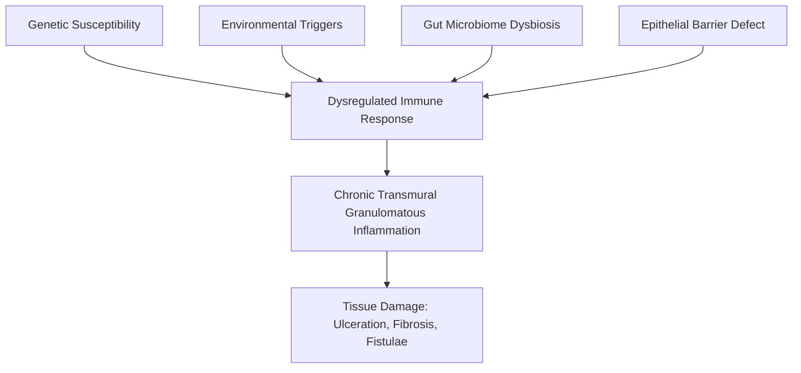

## I. Definition

Crohn's Disease (CD) is a chronic, relapsing-remitting **_inflammatory bowel disease (IBD)_** characterised by **_patchy transmural inflammation, which may affect any part of the GI tract_** [1]. Let's break the name and definition down:

- **Crohn's** — named after Dr. Burrill Crohn who described it in 1932
- **_Patchy_** — the inflammation is not continuous; there are "skip lesions" (diseased segments interspersed with normal bowel)
- **_Transmural_** — "trans" = through, "mural" = wall; inflammation penetrates the **full thickness** of the bowel wall (mucosa → submucosa → muscularis propria → serosa). This is fundamentally different from UC which is limited to mucosa/submucosa, and it explains why CD causes fistulae, abscesses, and strictures while UC generally does not [1][2].
- **_Any part of the GI tract_** — from mouth to perianal area, though it **_most commonly affects the terminal ileum_** ± colon [2]

**_Indeterminate colitis_** accounts for **_~10-15% of IBD patients_** who **_fail to be classified between UC vs CD_**, either due to inadequate tissue biopsy or a truly indeterminate form of disease. Surgical treatment for these patients follows UC principles [1][2].

<Callout title="Why the Terminal Ileum?">
  The terminal ileum is the most common site because: (1) it has the highest
  concentration of Peyer's patches (lymphoid tissue) in the GI tract — the
  immune-mediated pathology of CD preferentially targets these areas; (2) there
  is relative stasis at the ileocaecal valve allowing prolonged antigen
  exposure; (3) the terminal ileum has a unique bacterial flora composition with
  the highest bacterial load in the small bowel.
</Callout>

---

## II. Epidemiology

### Incidence and Prevalence

- **_Incidence is rising globally_**, particularly in newly industrialised countries in Asia (including Hong Kong), though overall rates remain lower than in the West [1]
- **_CD prevalence: urban > rural areas, higher socioeconomic classes_** — this supports the "hygiene hypothesis" (see Etiology) [1]
- Hong Kong context: IBD incidence has been rising steadily since the 1980s. The HK IBD registry shows CD incidence approximately 1-2 per 100,000 — lower than Western countries (5-10 per 100,000) but rapidly increasing [1]

### Age and Gender

- **_Peak age of onset for CD: in the third decade_** (i.e., 20–30 years old) [1]
- There is a possible second smaller peak around 50–70 years (bimodal distribution)
- **_Gender: CD F > M globally, but M > F in East Asia_** [1] — this is an important exam distinction. In Hong Kong, there is a slight **male predominance**, which is the opposite of Western data [1]

### East vs. West Differences (High Yield for HKU Exams)

**_East Asian IBD (including Hong Kong) differs from Western IBD_** [1]:

| Feature                                      | East Asia                 | West                         |
| :------------------------------------------- | :------------------------ | :--------------------------- |
| **_Gender in CD_**                           | **_M > F_**               | F > M                        |
| **_Family clustering_**                      | **_Less_**                | More prominent               |
| **_Surgery rates_**                          | **_Lower (5-8%)_**        | Higher (~30-50% at 10 years) |
| **_Extraintestinal manifestations_**         | **_Fewer_**               | More common                  |
| **_Primary sclerosing cholangitis with UC_** | **_Less_**                | More common                  |
| **_Penetrating and perianal disease in CD_** | **_Higher rates_**        | Lower                        |
| CD location                                  | **_More ileocolonic CD_** | More ileal-predominant       |

<Callout title="High Yield" type="idea">
  For HKU exams: remember that Hong Kong CD patients tend to be male, have more
  perianal/penetrating disease, less family history, and fewer extraintestinal
  manifestations compared to Western populations. This is a commonly tested
  distinction.
</Callout>

---

## III. Risk Factors

### Established Risk Factors for Crohn's Disease

1. **Smoking** — **_Smoking is a risk factor for Crohn's disease (but NOT ulcerative colitis — in fact, smoking is PROTECTIVE for UC)_** [2]
   - Why? Smoking impairs Th1/Th17 immune regulation, reduces mucosal blood flow, and alters the gut microbiome. CD is predominantly a Th1/Th17-mediated disease, and smoking amplifies this pathway. UC is predominantly Th2-mediated, and nicotine appears to enhance mucus production and colonic mucosal blood flow, which are protective in UC.
   - Smoking doubles the risk of CD, increases the risk of relapse, the need for surgery, and post-operative recurrence

2. **Prior appendicectomy** — **_Prior appendicectomy is a risk factor for Crohn's disease_** (conversely, **_protective for UC_**) [2]
   - The mechanism is debated: appendicectomy may alter the gut immune landscape, removing an immune regulatory organ (the appendix contains significant lymphoid tissue)

3. **Family history** — **_Family history of IBD_** [2]
   - First-degree relative with CD increases risk 5-20×
   - Concordance rate in monozygotic twins ~50% for CD (vs. ~15% for UC), indicating a stronger genetic component in CD
   - **_Less family clustering in East Asia_** compared to West [1]

4. **Infectious gastroenteritis** — **_Infectious gastroenteritis in the prior 1 year_** is a risk factor [2]
   - Likely through disruption of the mucosal barrier and alteration of the gut microbiome, triggering an abnormal immune response in genetically susceptible individuals

5. **Drug history**
   - **_NSAIDs_** can trigger flares (they inhibit protective prostaglandin synthesis in the gut, disrupt the mucosal barrier, and may increase intestinal permeability) [3]
   - Oral contraceptives — modest increased risk, possibly through microvascular thrombosis
   - Isotretinoin — previously suggested but now considered controversial

6. **Diet**
   - High refined sugar, low fibre, high fat, high processed food diets are associated with increased risk
   - Western diet in Asia may explain the rising incidence

7. **Genetic factors**
   - **NOD2/CARD15** gene mutation (chromosome 16) — the most well-established genetic association with CD (particularly ileal disease and stricturing phenotype)
     - NOD2 is an intracellular receptor for bacterial muramyl dipeptide. Mutation → defective innate immune response to gut bacteria → paradoxical chronic inflammation
   - **ATG16L1** and **IRGM** genes — involved in autophagy (cellular "self-eating" of damaged organelles/bacteria). Mutations impair bacterial clearance
   - **IL23R** gene — involved in Th17 differentiation
   - > 200 susceptibility loci identified by GWAS

<Callout title="Smoking and IBD — The Classic Exam Question" type="error">
  Students frequently confuse this: **Smoking is BAD for Crohn's, GOOD for UC.**
  The mnemonic: "**C**rohn's = **C**igarettes **C**ause it; **U**C = cigarettes
  are **U**seful (protective)." However, obviously you would never recommend
  smoking for UC patients!
</Callout>

---

## IV. Anatomy and Function (Relevant to CD)

Understanding the anatomy is critical because CD's transmural, skip-lesion pattern directly determines its clinical manifestations and complications.

### Terminal Ileum — The Most Common Site

- The terminal ileum is the last ~20-30 cm of the ileum before the ileocaecal valve
- **Functions**: absorption of vitamin B12 (cobalamin) and bile salts
  - B12 absorption occurs ONLY in the terminal ileum → CD affecting this area → **B12 deficiency** → megaloblastic anaemia, subacute combined degeneration of the spinal cord
  - Bile salt absorption occurs in the terminal ileum → malabsorption of bile salts → **bile salt diarrhoea** (bile salts reach the colon and stimulate secretion) AND **gallstone formation** (reduced bile salt pool → cholesterol supersaturation of bile) [2]
- Contains the highest concentration of **Peyer's patches** (organized lymphoid tissue) — the initial site of immune activation in CD

### Bowel Wall Layers (Why Transmural Matters)

| Layer              | CD Involvement               | Clinical Consequence                                                                               |
| :----------------- | :--------------------------- | :------------------------------------------------------------------------------------------------- |
| Mucosa             | Ulceration, aphthous ulcers  | Bleeding, malabsorption                                                                            |
| Submucosa          | Oedema, fibrosis             | Stricture formation                                                                                |
| Muscularis propria | Inflammation, fibrosis       | Dysmotility, strictures, obstruction                                                               |
| Serosa             | Inflammation reaches surface | **Fistulae** (track to adjacent structures), **abscesses** (walled-off perforation), **adhesions** |

This is why **_fistula formation_** and **_abscess formation_** are features of CD but NOT UC [1][2]. In UC, inflammation is limited to mucosa/submucosa and never penetrates deeply enough to form fistulae.

### Mesentery

- CD characteristically involves **mesenteric fat wrapping** ("creeping fat" / "fat wrapping") — the mesenteric fat hypertrophies and wraps around the inflamed bowel segment
- This is thought to be an attempt by the mesentery to contain transmural inflammation
- On surgical inspection, this is pathognomonic of CD

### Perianal Anatomy

- **_Perianal disease occurs in up to 40% of CD patients_** [1] — a very common and debilitating manifestation
- The perianal region includes the anal canal, internal and external sphincters, and the ischiorectal and intersphincteric spaces
- Perianal CD includes: fistulae-in-ano, perianal abscesses, skin tags, fissures, and anorectal strictures

---

## V. Etiology and Pathophysiology

The pathogenesis of Crohn's disease involves a complex interplay of four key elements. Think of it as a "perfect storm":

### The Four-Hit Model

### 1. Genetic Susceptibility

- **NOD2/CARD15** (chromosome 16q12): The most important genetic risk factor
  - NOD2 = "nucleotide-binding oligomerisation domain-containing protein 2" — an intracellular pattern recognition receptor (PRR) in macrophages and dendritic cells
  - Normally recognises muramyl dipeptide (MDP), a component of bacterial peptidoglycan → triggers NF-κB pathway → appropriate antimicrobial response + defensin production
  - **Mutation → impaired bacterial sensing → defective defensin production → bacteria breach the mucosal barrier → compensatory over-activation of adaptive immunity → chronic inflammation**
  - Associated with ileal disease and stricturing phenotype

- **ATG16L1 and IRGM** — autophagy genes
  - Autophagy = "auto" (self) + "phagy" (eating) — cellular housekeeping that clears intracellular bacteria and damaged organelles
  - Defective autophagy → impaired clearance of intracellular bacteria (e.g., adherent-invasive _E. coli_) → persistent immune stimulation

- **IL23R** — interleukin-23 receptor
  - IL-23 drives Th17 cell differentiation → IL-17 production → mucosal inflammation
  - Variants can be protective or risk-enhancing

### 2. Environmental Triggers

- **Smoking** (see Risk Factors)
- **Diet**: Western diet (high sugar, fat, processed food; low fibre) alters microbiome composition
- **Antibiotics**: Early-life antibiotic exposure may alter the developing microbiome
- **Hygiene hypothesis**: Growing up in overly hygienic environments → reduced microbial exposure in childhood → immature immune regulation → exaggerated response to commensal bacteria later in life. This explains the higher prevalence in **_urban > rural areas and higher socioeconomic classes_** [1]
- **Infections**: Prior GI infections may trigger disease in susceptible individuals
- **Stress**: Does not cause CD but can trigger flares via the gut-brain axis (cortisol → altered gut permeability and immune function)
- **Vitamin D deficiency**: Vitamin D is immunomodulatory; deficiency is associated with increased CD risk and disease activity

### 3. Gut Microbiome Dysbiosis

- CD patients have **reduced microbial diversity**, particularly:
  - Reduced _Firmicutes_ (especially _Faecalibacterium prausnitzii_ — a butyrate producer with anti-inflammatory properties)
  - Increased _Proteobacteria_ (especially adherent-invasive _E. coli_ — AIEC)
- **Butyrate** is a short-chain fatty acid that is the primary energy source for colonocytes and has anti-inflammatory effects. Its reduction → mucosal energy deficit → barrier dysfunction
- Whether dysbiosis is a cause or consequence of CD remains debated, but it clearly perpetuates the inflammatory cycle

### 4. Epithelial Barrier Defect

- Increased intestinal permeability ("leaky gut") is a feature of CD, even in unaffected relatives of CD patients
- Defective tight junctions, reduced mucus layer, and impaired Paneth cell function (Paneth cells secrete defensins — antimicrobial peptides)
- Barrier breach → luminal bacteria/antigens access the lamina propria → immune activation

### Immune Pathways in CD

- CD is primarily a **Th1 and Th17-mediated** disease (in contrast to UC which is Th2-mediated)
- Key cytokines:
  - **TNF-α**: The master pro-inflammatory cytokine in CD → drives macrophage activation, granuloma formation, and tissue destruction. This is the therapeutic target of **anti-TNF agents** (infliximab, adalimumab)
  - **IFN-γ**: Produced by Th1 cells → activates macrophages
  - **IL-12 and IL-23**: Drive Th1 and Th17 differentiation respectively. **Ustekinumab** targets IL-12/23
  - **IL-17**: Produced by Th17 cells → recruits neutrophils, perpetuates mucosal inflammation
  - **α4β7 integrin**: A homing molecule on T cells that directs them to the gut. **Vedolizumab** blocks this

### Granuloma Formation

- **Non-caseating granulomas** are the histological hallmark of CD (found in ~30-50% of biopsies)
- A granuloma is an organised collection of macrophages (epithelioid cells) ± multinucleated giant cells, surrounded by a collar of lymphocytes
- They form because macrophages cannot fully clear the antigenic stimulus → they aggregate and wall it off
- **_MUST exclude TB_** when granulomas are found — TB granulomas are typically **caseating** (central necrotic cheese-like material), but this distinction is not always clear on biopsy, and TB is common in Hong Kong [2]

<Callout title="CD vs TB — A Critical Distinction in Hong Kong" type="error">
  In Hong Kong, where TB is endemic, intestinal TB is a key differential for
  Crohn's disease. Both can cause granulomatous inflammation of the terminal
  ileum. Key distinguishers: TB granulomas are typically caseating and larger,
  TB AFB stain/culture may be positive, TB has systemic features (fever, night
  sweats, weight loss), and TB responds to anti-TB therapy. Tissue PCR for
  Mycobacterium tuberculosis is helpful. If in doubt, a trial of anti-TB therapy
  is sometimes given first.
</Callout>

---

## VI. Classification

### **_Montreal Phenotypical Classification_** [1][2]

This is the standard classification system for CD, classifying by **Age at diagnosis**, **Location**, and **Behaviour**:

| Category              | Code     | Description                                           | **_Frequency_**                        |
| :-------------------- | :------- | :---------------------------------------------------- | :------------------------------------- |
| **Age at onset**      | **_A1_** | **_< 16 years old_**                                  |                                        |
|                       | **_A2_** | **_17-40 years old_**                                 | Most common                            |
|                       | **_A3_** | **_> 40 years old_**                                  |                                        |
| **Disease Location**  | **_L1_** | **_Ileal_**                                           | **_24.5%_**                            |
|                       | **_L2_** | **_Colonic_**                                         | **_32.3%_**                            |
|                       | **_L3_** | **_Ileocolonic_**                                     | **_43.1% (most common)_**              |
|                       | **_L4_** | **_Isolated upper GI disease_**                       | Can be added to L1-L3                  |
| **Disease Behaviour** | **_B1_** | **_Non-stricturing, non-penetrating (inflammatory)_** | **_65.2%_**                            |
|                       | **_B2_** | **_Stricturing_**                                     | **_25.1%_**                            |
|                       | **_B3_** | **_Penetrating_**                                     | **_16.1%_**                            |
|                       | **_P_**  | **_Perianal fistula or abscess_**                     | **_24.5% (modifier, added to B1-B3)_** |

<Callout title="Montreal Classification — What It Means Clinically">

- **B1 (Inflammatory)** → predominantly mucosal inflammation → responds best to medical therapy
- **B2 (Stricturing)** → chronic inflammation → fibrosis → luminal narrowing → **bowel obstruction**. "Stricture" = "strictus" (Latin: drawn tight). Fibrostenotic strictures do NOT respond to anti-inflammatory drugs and need endoscopic dilatation or surgery
- **B3 (Penetrating)** → transmural inflammation breaches the serosa → **fistulae and abscesses**. "Penetrating" = the disease penetrates through the full wall
- **P (Perianal)** → added as a modifier to any B classification, e.g., B3P = penetrating disease with perianal involvement

**_Behaviour of disease determines management strategy_** [4]:

- **_Inflammatory disease (30%): medical treatment, surgical resection if refractory_**
- **_Fibrostenotic disease (50%): endoscopic dilatation, surgical (stricturoplasty or resection for small bowel, resection for large bowel)_**
- **_Fistulising disease (20%): drainage, medical (combined anti-TNF + azathioprine), surgical resection_**

</Callout>

### **_Clinical Subtypes of CD_** [2]

| Subtype                  | Frequency                                        | Key Features                                       |
| :----------------------- | :----------------------------------------------- | :------------------------------------------------- |
| **_Ileal disease_**      | **_24.5%_**                                      | B12/bile salt malabsorption, RIF pain, obstruction |
| **_Ileocaecal disease_** | **_43.1%_**                                      | Most common; mimics appendicitis                   |
| **_Colonic disease_**    | **_32.3%_**                                      | More like UC; bloody diarrhoea                     |
| **_Perianal disease_**   | **_8.4%_** (isolated) / **_up to 40%_** (any CD) | Fistulae, abscesses, skin tags                     |
| Others                   | Rare                                             | CD confined to mouth, stomach, duodenum, or rectum |

### **_Disease Activity — Crohn's Disease Activity Index (CDAI)_** [2]

|                    | **_Mild_**                      | **_Moderate_**                               | **_Severe_**                                          |
| :----------------- | :------------------------------ | :------------------------------------------- | :---------------------------------------------------- |
| **_CDAI_**         | **_150-220_**                   | **_220-450_**                                | **_> 450_**                                           |
| General            | Ambulatory, eating and drinking | Intermittent vomiting                        | Cachexia with **_BMI < 18_**                          |
| Weight loss        | **_< 10%_**                     | **_> 10%_**                                  |                                                       |
| CRP                | Usually > ULN                   | **_> ULN_**                                  | Increased                                             |
| Examination        |                                 | **_Tender mass, no overt obstruction_**      | **_Abscess formation, obstruction_**                  |
| Treatment response |                                 | **_Ineffective for mild disease treatment_** | **_Persistent symptoms despite intensive treatment_** |

---

## VII. Clinical Features

The clinical features of CD are directly determined by the **disease location**, **behaviour**, and **severity**. The transmural nature of inflammation is the root cause of most unique CD features.

### A. Symptoms

#### 1. Gastrointestinal Symptoms

**a) Chronic Diarrhoea (most common presenting symptom)**

- **Mechanism**: Multifactorial:
  - Mucosal inflammation → impaired water/electrolyte absorption → osmotic and secretory diarrhoea
  - Bile salt malabsorption (terminal ileal disease) → bile salts reach colon → stimulate colonic secretion (secretory diarrhoea)
  - Bacterial overgrowth in strictured/stagnant loops → deconjugation of bile salts → fat malabsorption → steatorrhoea
  - Fistulae bypassing absorptive surface → reduced transit time
- CD diarrhoea is typically **non-bloody** (unless colonic involvement) — this contrasts with UC where **_bloody diarrhoea is the hallmark_**
- When the colon is involved, there may be **_fresh blood in stool_** and urgency [5]

**b) Abdominal Pain**

- **_Typically right lower quadrant (RLQ) pain_** — because the terminal ileum/ileocaecal region is the most commonly affected [2][6]
- **Mechanism**: Transmural inflammation → serosal irritation → localised peritoneal pain in the RLQ
- Pain may be colicky (crampy, intermittent) — especially with stricturing disease → partial small bowel obstruction (SBO) → waves of peristalsis against obstruction
- Post-prandial pain — eating stimulates peristalsis → bowel contracts against a stricture → pain → patient stops eating → **weight loss** (this is "food fear")
- The RLQ mass from ileocaecal CD is a classic exam finding

**c) Nausea and Vomiting**

- More common in CD than UC because CD can affect the upper GI tract
- In moderate-severe disease: **_intermittent vomiting_** [2]
- In stricturing disease: vomiting due to small bowel obstruction

**d) Perianal Symptoms**

- **_Perianal disease in up to 40% of CD patients_** [1]
- Perianal pain, discharge (purulent or faecal), swelling
- Symptoms include: perianal abscess (throbbing pain, swelling, fever), fistula-in-ano (persistent discharge), anal fissure (sharp pain on defecation), skin tags (painless but characteristic — "sentinel tags")
- **Mechanism**: Transmural inflammation extends through the rectal wall into the perianal tissues → tracks through tissue planes → abscess → fistula

**e) Oral Symptoms**

- Oral aphthous ulcers — small, painful ulcers on the buccal mucosa, gums, or tongue
- **Mechanism**: CD can affect any part of the GI tract including the oral mucosa; aphthous ulcers represent mucosal inflammation
- Present in ~10% of CD patients; may be the first manifestation

**f) Dysphagia / Odynophagia**

- Rare; occurs with oesophageal or gastric CD
- Upper GI CD with stricturing may cause dysphagia

#### 2. Systemic/Constitutional Symptoms

**a) Weight Loss**

- Very common and multifactorial:
  - Reduced oral intake ("food fear" — eating provokes pain)
  - Malabsorption (inflamed mucosa, reduced absorptive surface, bile salt malabsorption)
  - Increased catabolism from chronic inflammation (TNF-α, IL-6 → systemic inflammatory response → muscle wasting)
  - Protein-losing enteropathy (inflamed mucosa leaks protein into the lumen)
- **_In severe disease: cachexia with BMI < 18_** [2]

**b) Fever**

- Low-grade fever in active disease (pro-inflammatory cytokines act on the hypothalamus)
- High fever suggests complication: abscess, perforation, or superimposed infection

**c) Fatigue**

- Anaemia (iron deficiency from chronic blood loss or malabsorption; B12 deficiency from terminal ileal disease; anaemia of chronic disease from chronic inflammation)
- Chronic inflammation itself causes fatigue via cytokine-mediated effects on the CNS

**d) Growth Retardation (Paediatric CD)**

- CD presenting before puberty can cause delayed growth and delayed puberty
- **Mechanism**: Chronic inflammation → high TNF-α/IL-6 → suppresses growth hormone axis; malnutrition; corticosteroid use further impairs growth

#### 3. Extraintestinal Manifestations (EIMs)

**_Extraintestinal manifestations are fewer in East Asian CD compared to Western CD_** [1], but they still occur and are high-yield for exams.

EIMs can be classified by whether they **correlate with disease activity** or are **independent of disease activity**:

**EIMs that Correlate with Disease Activity** (flare when gut disease flares):

| EIM                                                               | Features                                                                         | Mechanism                                                                                                             |
| :---------------------------------------------------------------- | :------------------------------------------------------------------------------- | :-------------------------------------------------------------------------------------------------------------------- |
| **Erythema nodosum**                                              | Painful, red, raised nodules on the shins (anterior tibiae)                      | Immune complex deposition in subcutaneous fat (panniculitis); Type III hypersensitivity                               |
| **Oral aphthous ulcers**                                          | Painful oral ulcers                                                              | Direct mucosal inflammation (same disease process)                                                                    |
| **Peripheral arthropathy (Type 1 — large joint, pauciarticular)** | Acute, asymmetric, affects large joints (knees, ankles, wrists); non-destructive | Circulating immune complexes deposit in synovium; molecular mimicry between gut bacterial antigens and joint antigens |
| **Episcleritis**                                                  | Red, uncomfortable eye without visual loss                                       | Immune complex-mediated inflammation of the episcleral tissue                                                         |

**EIMs Independent of Disease Activity** (persist even when gut disease is quiescent):

| EIM                                                              | Features                                                                              | Mechanism                                                                                                  |
| :--------------------------------------------------------------- | :------------------------------------------------------------------------------------ | :--------------------------------------------------------------------------------------------------------- |
| **Pyoderma gangrenosum**                                         | Deep, necrotic ulcer with violaceous undermined border, often on legs; pathergy       | Neutrophilic dermatosis; aberrant neutrophil chemotaxis                                                    |
| **Axial arthropathy (sacroiliitis, ankylosing spondylitis)**     | Low back pain/stiffness, worse in morning, improves with activity; HLA-B27 associated | Molecular mimicry + genetic predisposition; shared antigens between gut and sacroiliac joint               |
| **Primary sclerosing cholangitis (PSC)**                         | Progressive fibrosis of intra- and extrahepatic bile ducts → cholestasis → cirrhosis  | Autoimmune; aberrant gut-homing lymphocytes colonise the liver; **_less common with UC in East Asia_** [1] |
| **Uveitis** (anterior)                                           | Painful red eye, photophobia, visual loss                                             | Autoimmune inflammation of the uveal tract                                                                 |
| **Peripheral arthropathy (Type 2 — small joint, polyarticular)** | Symmetric, affects small joints of hands; may be persistent                           | Immune-mediated                                                                                            |

<Callout title="Remembering EIMs" type="idea">
  Mnemonic for IBD extraintestinal manifestations: **"A PIE SuCKS"** —
  **A**phthous ulcers, **P**yoderma gangrenosum, **I**ritis/uveitis,
  **E**rythema nodosum, **S**clerosing cholangitis, **C**holelithiasis (CD),
  **K**idney stones (CD), **S**acroiliitis/ankylosing spondylitis
</Callout>

**EIMs Specific to CD (due to terminal ileal disease/malabsorption):**

| EIM                                         | Mechanism                                                                                                                                                                                                           |
| :------------------------------------------ | :------------------------------------------------------------------------------------------------------------------------------------------------------------------------------------------------------------------ |
| **Cholelithiasis (gallstones)**             | Terminal ileal bile salt malabsorption → depleted bile salt pool → cholesterol supersaturation of bile → cholesterol gallstones [2]                                                                                 |
| **Nephrolithiasis (oxalate kidney stones)** | Normally, calcium binds oxalate in the gut lumen → excreted in stool. With bile salt malabsorption, free fatty acids bind calcium instead → free oxalate is absorbed → hyperoxaluria → calcium oxalate renal stones |
| **B12 deficiency**                          | Terminal ileum is the sole site of B12 absorption → megaloblastic anaemia, neuropathy                                                                                                                               |

### B. Signs

#### 1. General Examination

- **Cachexia / wasting**: In severe disease; BMI < 18 — chronic inflammation + malabsorption + reduced intake
- **Pallor**: Anaemia (iron deficiency, B12 deficiency, anaemia of chronic disease)
- **Clubbing**: Digital clubbing can occur in CD (mechanism: circulating vasodilators from chronic inflammation → increased blood flow to fingertips → connective tissue hypertrophy)
- **Oral aphthous ulcers**: Visible on inspection of the oral cavity
- **Skin signs**: Erythema nodosum (shins), pyoderma gangrenosum (legs, peristomal)
- **Eye signs**: Episcleritis (red eye without pain/visual loss), anterior uveitis (painful red eye with photophobia)
- **Joint signs**: Swollen joints (peripheral arthropathy), restricted spinal mobility (sacroiliitis/AS)

#### 2. Abdominal Examination

- **_RLQ tenderness_** — most common abdominal sign; reflects terminal ileal/ileocaecal inflammation [6]
- **_RLQ mass_** — **_tender mass_** in moderate disease [2]; this represents a phlegmon (inflamed adherent loops of bowel) or an inflammatory mass/abscess
  - Why RLQ? Because the terminal ileum and caecum are in the right iliac fossa
  - This can mimic appendicitis or appendicular mass — a critical differential in a young patient presenting with RLQ pain [6]
- **Abdominal distension** — if bowel obstruction is present (stricturing disease)
- **Visible peristalsis** — in thin patients with SBO, you may see bowel peristalsis through the abdominal wall
- **Surgical scars** — previous bowel resections, stoma sites (CD patients often require multiple surgeries)
- **Abdominal tenderness** — generalised if peritonitis (from perforation), localised to area of active disease
- **Fullness/asymmetry** — inflammatory mass or abscess

#### 3. Perianal Examination (CRITICAL — Never Skip in CD!)

- **_Perianal skin tags_** — large, oedematous, "elephant ear" skin tags are virtually pathognomonic of CD
- **Fistula openings** — external openings visible perianally; may have purulent or faecal discharge
- **Perianal abscess** — tender, fluctuant, erythematous swelling
- **Anal fissure** — classically **lateral** in CD (vs. posterior midline in idiopathic/benign fissure) — because CD fissures arise from transmural inflammation, not from tearing of the anoderm
- **Anorectal stricture** — on digital rectal examination (DRE), the examiner may feel narrowing
- **Faecal soiling** — from fistula or sphincter damage

<Callout title="Always Examine the Perineum in Suspected CD" type="error">
  A common exam mistake is failing to examine the perianal region. Up to 40% of
  CD patients have perianal disease, and it may be the PRESENTING feature. If a
  young patient presents with recurrent perianal abscesses or fistulae, think
  CD.
</Callout>

#### 4. Signs of Complications

- **Signs of SBO**: Abdominal distension, high-pitched/tinkling bowel sounds, visible peristalsis, vomiting
- **Signs of abscess**: Localised tenderness, fever, swinging pyrexia, palpable mass
- **Signs of fistula**: Abnormal openings (enterocutaneous fistula on the abdominal wall), pneumaturia or recurrent UTIs (enterovesical fistula), faeculent vaginal discharge (enterovaginal fistula)
- **Signs of perforation**: Peritonism (board-like rigidity, rebound tenderness, guarding), absent bowel sounds, tachycardia, hypotension

#### 5. Nutritional Deficiency Signs

| Deficiency | Sign                                                             | Why?                                                                         |
| :--------- | :--------------------------------------------------------------- | :--------------------------------------------------------------------------- |
| Iron       | Koilonychia, angular stomatitis, glossitis                       | Chronic blood loss + malabsorption in duodenal/proximal jejunal CD           |
| B12        | Glossitis, peripheral neuropathy, subacute combined degeneration | Terminal ileal disease/resection → B12 not absorbed                          |
| Folate     | Megaloblastic anaemia                                            | Proximal small bowel malabsorption or methotrexate use                       |
| Vitamin D  | Bone tenderness, proximal myopathy                               | Fat malabsorption (bile salt deficiency) → fat-soluble vitamin malabsorption |
| Zinc       | Acrodermatitis, poor wound healing                               | Small bowel inflammation → impaired absorption                               |
| Protein    | Oedema (hypoalbuminaemia), muscle wasting                        | Protein-losing enteropathy + malabsorption + catabolism                      |

---

## VIII. **_Disease Pattern Comparison: CD vs UC_** [1][2]

| Feature                      | **_Crohn's Disease_**                                                  | **_Ulcerative Colitis_**         |
| :--------------------------- | :--------------------------------------------------------------------- | :------------------------------- |
| **_Distribution_**           | **_GI tract, rectal sparing, skip lesions_**                           | **_Colon & rectum, continuous_** |
| **_Depth_**                  | **_Full thickness (transmural)_**                                      | **_Mucosal/submucosal_**         |
| **_Fistula_**                | **_Common (intestinal/perianal)_**                                     | **_Never_**                      |
| **_Benign stricture_**       | **_Common_**                                                           | **_Rare_**                       |
| **_Perianal disease_**       | **_Up to 40%_**                                                        | **_Rare_**                       |
| Histology pattern            | **_Focal patchy_**                                                     | **_Diffuse continuous_**         |
| **_Granuloma_**              | **_✓ (MUST exclude TB)_**                                              | **_✗_**                          |
| Goblet cells                 | **_Preserved (✓)_**                                                    | **_Depleted (✗)_**               |
| Distorted crypt architecture | ✓                                                                      | ✓                                |
| Cryptitis and crypt abscess  | ✓                                                                      | ✓                                |
| Endoscopic: skip lesions     | ✓                                                                      | ✗                                |
| Endoscopic: ulcers           | **_Solitary, deep and focal_** (rose-thorn, longitudinal, serpiginous) | **_Shallow_**                    |
| **_Fistula formation_**      | **_✓_**                                                                | **_✗_**                          |
| **_Abscess formation_**      | **_✓_**                                                                | **_✗_**                          |
| Pseudopolyps                 | Less common                                                            | **_✓_**                          |
| Smoking                      | Risk factor                                                            | Protective                       |
| Appendicectomy               | Risk factor                                                            | Protective                       |

<Callout title="The Cobblestone Mucosa">
  In CD, deep longitudinal and transverse ulcers criss-cross across the mucosa,
  with oedematous islands of surviving mucosa in between. This gives the
  "cobblestone" appearance on endoscopy — literally looks like a cobblestone
  street. This does NOT occur in UC because UC ulcers are shallow and
  continuous.
</Callout>

---

## IX. Specific Pathological Features Explained

### Skip Lesions

- Diseased segments separated by completely normal bowel
- Why? CD inflammation starts at Peyer's patches (discrete lymphoid follicles) → disease begins at these focal points → doesn't spread continuously like UC

### Cobblestone Mucosa

- Deep linear ulcers with intervening oedematous mucosa
- The "cobblestones" are the islands of surviving swollen mucosa between ulcer tracks

### Creeping Fat

- Mesenteric fat hypertrophy that wraps around the bowel
- The mesentery actively participates in CD inflammation — mesenteric adipocytes produce pro-inflammatory adipokines (TNF-α, leptin)
- Pathognomonic surgical finding

### String Sign (on barium studies/CT)

- Severe narrowing of a bowel segment (typically terminal ileum) → a thin line of barium
- Represents a fibrostenotic stricture

### Rose-Thorn Ulcers

- Deep, narrow, penetrating ulcers that project into the bowel wall on barium studies
- Named because they look like thorns on a rose stem
- Reflect the transmural nature of CD ulceration

---

<Callout title="High Yield Summary">

**Definition**: CD = chronic relapsing-remitting IBD with **_patchy, transmural inflammation affecting any part of the GI tract_** (mouth to anus); **_most commonly affects the terminal ileum_**

**Epidemiology**: **_Peak onset 3rd decade; globally F > M but M > F in East Asia_**; rising incidence in HK; **_urban > rural, higher socioeconomic status_**

**East Asia differences**: **_More male, less family clustering, lower surgery rates, fewer EIMs, less PSC with UC, higher penetrating/perianal disease_**

**Risk Factors**: **_Smoking (CD risk, UC protective)_**, **_prior appendicectomy (CD risk, UC protective)_**, family history, prior GI infection, NSAIDs, NOD2/CARD15 mutations

**Montreal Classification**: Age (A1/A2/A3) + Location (**_L1 ileal / L2 colonic / L3 ileocolonic (43.1%, most common) / L4 upper GI_**) + Behaviour (**_B1 inflammatory 65.2% / B2 stricturing 25.1% / B3 penetrating 16.1% / P perianal 24.5%_**)

**Key Clinical Features**: Chronic non-bloody diarrhoea, **_RLQ pain_**, weight loss/cachexia, **_perianal disease (up to 40%)_**, oral aphthous ulcers; EIMs (erythema nodosum, pyoderma gangrenosum, uveitis, sacroiliitis, PSC); nutritional deficiencies (B12, iron, vitamin D)

**Key Signs**: RLQ tenderness/mass, perianal skin tags/fistulae/abscesses, cachexia, clubbing, anaemia

**Pathology**: **_Non-caseating granulomas (must exclude TB)_**, skip lesions, deep focal ulcers, cobblestone mucosa, transmural inflammation, creeping fat, **_fistulae and abscesses (never in UC)_**

**Behaviour determines management**: **_Inflammatory (30%) → medical; Fibrostenotic (50%) → endoscopic/surgical; Fistulising (20%) → drainage + biologics + surgery_**

</Callout>

---

<ActiveRecallQuiz
  title="Active Recall - Crohn's Disease: Definition to Clinical Features"
  items={[
    {
      question:
        "A 25-year-old male smoker in Hong Kong presents with chronic diarrhoea and RLQ pain. Colonoscopy shows skip lesions with deep ulcers and non-caseating granulomas in the terminal ileum. What is the diagnosis, and what critical differential must be excluded in Hong Kong? Why?",
      markscheme:
        "Diagnosis: Crohn's disease. Must exclude intestinal TB because TB is endemic in HK, both cause granulomatous terminal ileitis. TB granulomas are typically caseating; send tissue for AFB stain/culture and TB PCR. If uncertain, trial of anti-TB therapy may be given.",
    },
    {
      question:
        "Explain why smoking is a risk factor for Crohn's disease but protective for ulcerative colitis.",
      markscheme:
        "CD is Th1/Th17-mediated; smoking amplifies Th1 responses, impairs mucosal blood flow, and alters gut microbiome. UC is Th2-mediated; nicotine enhances mucus production and colonic blood flow, which are protective. Smoking doubles CD risk, increases relapse and surgical rates.",
    },
    {
      question:
        "List the Montreal classification categories for Crohn's disease and state the most common location and behaviour.",
      markscheme:
        "Age: A1 (less than 16), A2 (17-40), A3 (over 40). Location: L1 ileal (24.5%), L2 colonic (32.3%), L3 ileocolonic (43.1% - most common), L4 isolated upper GI. Behaviour: B1 inflammatory (65.2% - most common), B2 stricturing (25.1%), B3 penetrating (16.1%), P perianal modifier (24.5%).",
    },
    {
      question:
        "Why does Crohn's disease cause fistulae and abscesses but ulcerative colitis does not?",
      markscheme:
        "CD inflammation is transmural (full thickness: mucosa to serosa). When inflammation breaches the serosa, it can track to adjacent structures forming fistulae or become walled-off forming abscesses. UC inflammation is limited to mucosa/submucosa and never penetrates deeply enough.",
    },
    {
      question:
        "A CD patient with terminal ileal disease develops gallstones and calcium oxalate kidney stones. Explain the pathophysiology of each.",
      markscheme:
        "Gallstones: terminal ileal bile salt malabsorption leads to depleted bile salt pool causing cholesterol supersaturation of bile forming cholesterol gallstones. Kidney stones: unabsorbed bile salts and free fatty acids bind calcium in the gut lumen, leaving oxalate free to be absorbed causing hyperoxaluria and calcium oxalate renal stones.",
    },
    {
      question:
        "List 4 key differences between East Asian and Western IBD as stated in the lecture slides.",
      markscheme:
        "1. More male prevalence with CD in East Asia (vs F > M in West). 2. Less family clustering. 3. Lower rates of surgery (5-8%). 4. Higher rates of penetrating and perianal disease in CD. Also: fewer EIMs, less PSC with UC.",
    },
  ]}
/>

## References

[1] Lecture slides: Inflammatory bowel disease.pdf (p2, p4, p5, p6, p8)
[2] Senior notes: felixlai.md (Inflammatory bowel disease — Crohn's disease section)
[3] Senior notes: felixlai.md (Inflammatory bowel disease — Ulcerative colitis section, NSAID risk)
[4] Senior notes: maxim.md (Surgical procedures for CD, management strategy by behaviour)
[5] Lecture slides: GC 186. Lower and diffuse abdominal painfresh blood in stool.pdf
[6] Lecture slides: GC 195. Lower and diffuse abdominal pain RLQ problems; pelvic inflammatory disease; peritonitis and abdominal emergencies.pdf
