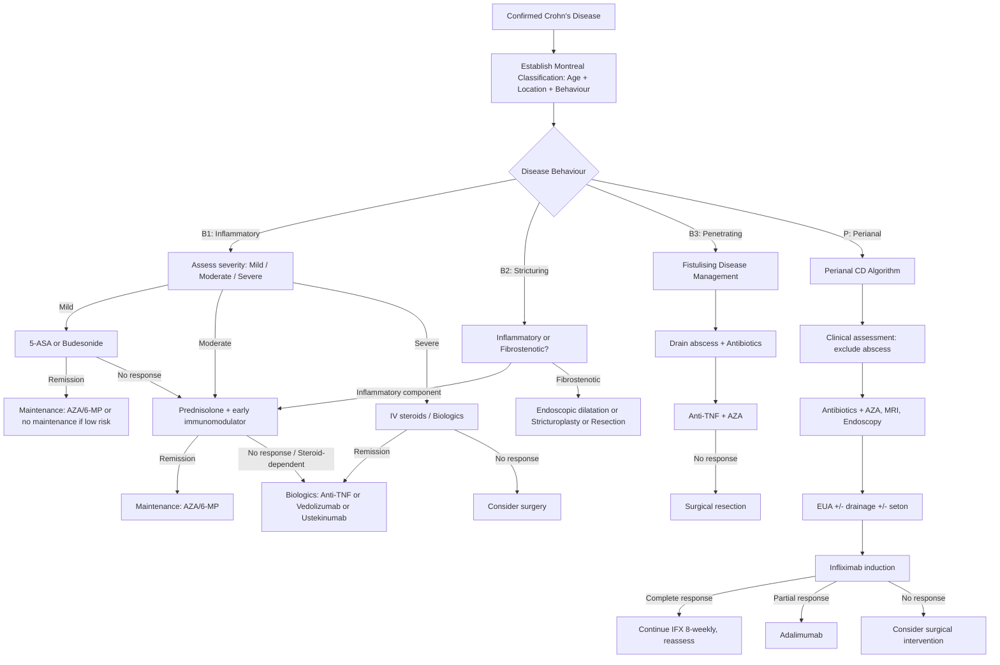
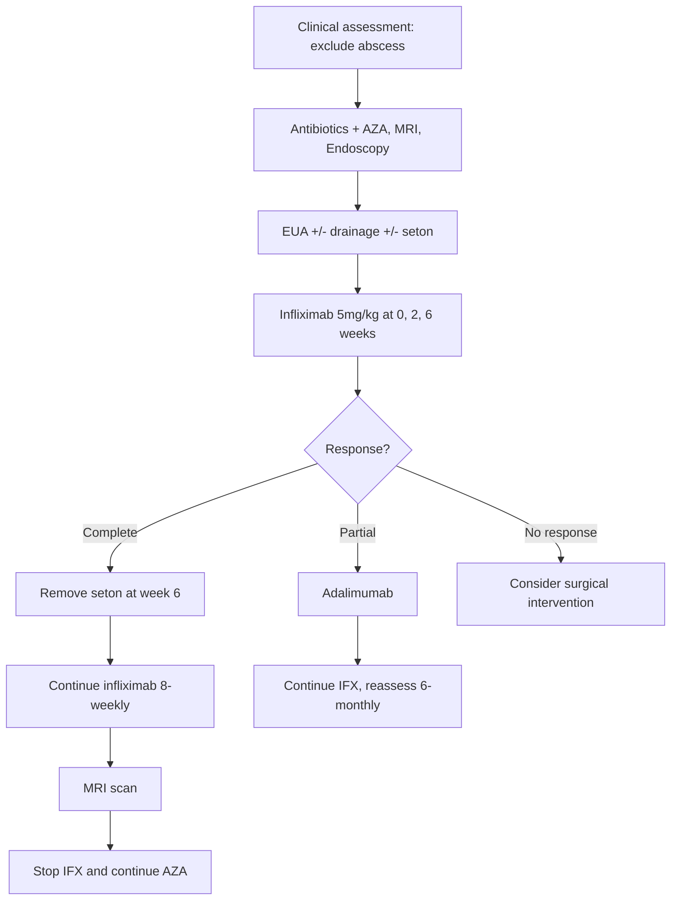

## Management of Crohn's Disease

### Overarching Principles

Before diving into specific drugs and procedures, let's establish the philosophy of CD management. This is fundamentally different from UC management because **CD is NOT curable by surgery** — it can recur anywhere in the GI tract after resection. Every management decision must be understood through this lens.

***Principles of management*** [2]:
- ***To induce and maintain remission taking into account disease activity, disease site, disease behaviour and patient preference*** [2]
- ***Trend towards early introduction of immunomodulators and biologics in patients with adverse prognostic factors*** [2]:
  - ***Young age < 40***
  - ***Extensive small bowel disease***
  - ***Perianal involvement***
  - ***Presence of strictures***
  - ***Presence of deep colonic ulcers***
  - ***Steroids required in initial treatment***
- ***Avoidance of triggering factors — smoking cessation*** [2]
- Treatment goals have evolved from **symptom control** to **"treat-to-target"**: the modern goal is **mucosal healing** (endoscopic remission) because this reduces complications, hospitalisations, and need for surgery

<Callout title="Step-Up vs Top-Down Approach">

Traditionally, CD was managed with a **"step-up"** approach: start with mild drugs (5-ASA, antibiotics) → escalate to steroids → immunomodulators → biologics as disease worsens. The modern trend, especially for patients with **adverse prognostic factors**, favours a **"top-down"** or **"accelerated step-up"** approach: early introduction of biologics ± immunomodulators to prevent structural damage (strictures, fistulae) before it occurs. Think of it like rheumatoid arthritis — if you wait for joint destruction before starting DMARDs, the damage is irreversible. Same principle in CD: fibrosis and strictures are irreversible.
</Callout>

---

### Management Algorithm Overview

---

### I. Medical Treatment

The medical management of CD uses drugs with distinct roles: **induction** (getting the inflammation under control quickly) vs **maintenance** (keeping it under control long-term). Understanding which drug does what — and why — is fundamental.

#### A. Antibiotics

***Antibiotics*** [2]:

| Feature | Details |
|:---|:---|
| **Indications** | ***Active luminal disease (for primary or adjunctive therapy for colonic CD but NOT isolated small intestine disease)***; ***Perianal diseases such as fistula***; ***Septic complications of IBD such as abscess and wound infections*** [2] |
| **Mechanism of action** | ***Efficacy may be due to treatment of an undetected pathogen, bacterial overgrowth or an unsuspected microperforation*** [2] — they reduce the bacterial antigenic load driving the immune response |
| **Examples** | ***Ciprofloxacin / Metronidazole*** [2] |
| **Clinical role** | Adjunctive — not primary therapy for most CD. Most useful in perianal disease and septic complications |

**Why ciprofloxacin and metronidazole specifically?**
- **Metronidazole** ("metro" = relating to the uterus historically, but it's actually a nitroimidazole) — effective against anaerobic bacteria and some protozoa. The gut, especially the colon, is an anaerobic environment, so metronidazole targets the predominant colonic flora. Also has immunomodulatory properties.
- **Ciprofloxacin** — a fluoroquinolone effective against gram-negative aerobes. The combination covers a broad spectrum of gut bacteria.

**Limitations:** Metronidazole causes peripheral neuropathy with prolonged use (damages nerve axons — metallic taste and tingling are early warning signs). Ciprofloxacin can cause tendinopathy.

---

#### B. 5-Aminosalicylates (5-ASA)

***5-aminosalicylates (5-ASA)*** [2]:

| Feature | Details |
|:---|:---|
| **Role** | ***Initial therapy in patients with mild to moderate Crohn's disease who do not have systemic symptoms based on its relative safety to other drugs*** [2] |
| **Mechanism** | ***Anti-inflammatory effect*** — 5-ASA acts locally on the intestinal mucosa. It inhibits the lipoxygenase and cyclooxygenase pathways (reduces leukotriene B4 and prostaglandin synthesis), scavenges reactive oxygen species, inhibits NF-κB, and reduces TNF-α production. Think of it as a "topical mucosal anti-inflammatory." |
| **Clinical role** | ***Induction agent only*** — ***NO consistent evidence that 5-ASA is effective in maintenance of remission*** [2]. ***Mesalamine can be used as maintenance after surgical intervention but NOT after medically induced remission*** [2] |
| **Dosage** | ***Mesalamine = 2-4 g/day; Sulfasalazine = 3-6 g/day*** [2] |

**Key drug distinctions:**

| Drug | Formulation | Site of Action | Notes |
|:---|:---|:---|:---|
| ***Mesalamine (Pentasa/Asacol)*** | Oral (various release mechanisms), enema, suppository | Both ileitis and colitis | ***More commonly used***; ***NOT useful in active diseases*** (i.e., limited efficacy in moderate-severe CD) [2]; Nephrotoxicity is the key adverse effect |
| ***Sulfasalazine*** | Oral | ***Colitis only*** | ***Colonic bacteria must cleave the drug to release the 5-ASA moiety*** (sulfapyridine is the carrier linked to 5-ASA by an azo bond — colonic bacteria break this bond) [2]. Cannot work in the small bowel because the bacteria needed for cleavage are in the colon |

**Why sulfasalazine only works in the colon** — explained from first principles: Sulfasalazine = sulfapyridine + 5-ASA linked by an azo bond. This bond is resistant to gastric acid and small bowel enzymes. Only colonic bacteria (which produce azoreductases) can cleave the bond → 5-ASA is released locally in the colon. For ileal disease, you need mesalamine formulations that release 5-ASA in the small bowel (e.g., Pentasa uses ethylcellulose-coated microgranules that release 5-ASA throughout the GI tract).

**Adverse effects:**
- ***Mesalamine: Nephrotoxicity*** [2] — interstitial nephritis (monitor renal function)
- ***Sulfasalazine: Nausea, headache, fever, agranulocytosis, pancreatitis, SJS*** [2]. Also ***associated with "sulfa" allergy and pregnancy complications including kernicterus (crosses placenta) and neural tube defects (inhibits absorption and metabolism of folic acid)*** [2] — always co-prescribe folic acid 5mg daily if using sulfasalazine in women of childbearing age

<Callout title="5-ASA in CD vs UC — An Important Distinction" type="error">
5-ASA is much more effective in UC than in CD. In UC, 5-ASA is both an induction AND maintenance agent and is the backbone of mild-moderate UC treatment. In CD, 5-ASA has a limited role — only for mild disease, only for induction, and it's NOT effective for maintenance after medical remission. Many students incorrectly apply UC 5-ASA principles to CD. Don't make this mistake.
</Callout>

---

#### C. Glucocorticoids

***Glucocorticoids*** [2]:

| Feature | Details |
|:---|:---|
| **Indication** | ***Indicated in patients who do not respond to 5-ASA and antibiotics*** [2] — the workhorse for inducing remission in moderate-severe CD |
| **Clinical role** | ***Induction agent only — Ineffective in maintenance of remission and NOT used for long-term*** [2] |
| **Mechanism** | Glucocorticoids suppress the immune system at multiple levels: inhibit NF-κB transcription → reduce pro-inflammatory cytokine production (TNF-α, IL-1, IL-6); reduce leukocyte migration to inflamed tissue; induce apoptosis of T lymphocytes; stabilise lysosomal membranes. They are the most potent non-biologic anti-inflammatory available. |

**Key drug distinctions:**

| Drug | Route | Dosage | Special Features |
|:---|:---|:---|:---|
| ***Prednisolone*** | Oral | ***40 mg/day reducing by 5 mg/day at weekly intervals; or 20 mg/day for 4 weeks reducing by 5 mg/day at weekly intervals*** [2] | ***More commonly used*** [2]; systemic effects (Cushingoid, osteoporosis, hyperglycaemia, adrenal suppression) |
| ***Budesonide*** | Oral (modified release) | ***9 mg/day*** [2] | ***Indicated for terminal ileum or ileocaecal disease*** [2]; ***extensive first-pass effect in liver → less systemic side effects but also less effective*** [2]. ~90% hepatic first-pass metabolism → minimal systemic bioavailability |
| Hydrocortisone | IV | 100 mg QDS | Used in acute severe disease (hospital setting) |
| Methylprednisolone | IV | 60 mg/day | Alternative IV steroid |

**Why budesonide for ileocaecal disease specifically?** Budesonide modified-release formulations (e.g., Entocort) are designed to release the drug in the ileum and right colon — exactly where ileocaecal CD occurs. Because of the extensive first-pass hepatic metabolism (~90% is inactivated on first pass through the liver), systemic steroid side effects are minimised. However, this also means it's less potent than prednisolone for widespread or severe disease.

**Critical rules about steroids in CD:**
- ***Calcium and vitamin D supplements required for osteoprotective effect if prescribed for more than 12 weeks*** [2]
- **Never use steroids for maintenance** — they don't prevent relapse and cause cumulative toxicity (osteoporosis, cataracts, diabetes, adrenal suppression, avascular necrosis)
- **Steroid-dependent** = patient relapses when steroids are tapered or within 3 months of stopping → needs immunomodulator or biologic
- **Steroid-refractory** = no response despite adequate dose → needs escalation to biologic

---

#### D. Immunomodulators

***Immunomodulators*** [2]:

These are the bridge between steroids (short-term induction) and long-term maintenance. Their onset of action is slow (2-3 months), so they cannot be used alone for acute flares.

##### Thiopurines: Azathioprine (AZA) / 6-Mercaptopurine (6-MP)

| Feature | Details |
|:---|:---|
| **Mechanism** | AZA is a prodrug → converted to 6-MP → converted to 6-thioguanine nucleotides (6-TGN) which incorporate into DNA of rapidly dividing immune cells (T lymphocytes) → inhibits purine synthesis → reduces T cell proliferation and clonal expansion. "Azathio-" (sulfur-containing) + "-prine" (purine analogue) — the name tells you it's a purine antimetabolite |
| **Clinical role** | **Maintenance agent** — used to maintain steroid-induced remission and allow steroid withdrawal ("steroid-sparing agent") |
| **Onset** | Slow — 2-3 months to reach full effect (because it takes time for the active metabolites to accumulate and for the pool of existing T cells to turn over) |
| **Key screening** | **TPMT / NUDT15 genotyping BEFORE starting** — thiopurine methyltransferase (TPMT) and NUDT15 are enzymes that metabolise thiopurines. Genetic polymorphisms cause deficiency → toxic accumulation of 6-TGN → fatal bone marrow suppression. NUDT15 polymorphisms are particularly common in **East Asian populations** (including Hong Kong) — up to 2% are homozygous deficient |
| **Adverse effects** | Myelosuppression (dose-related and idiosyncratic), hepatotoxicity, pancreatitis (idiosyncratic — occurs in ~3%, usually within first month, contraindication to re-challenge), nausea, increased infection risk, **lymphoma risk** (especially hepatosplenic T-cell lymphoma in young males on combination AZA + anti-TNF) |
| **Monitoring** | Regular CBP (every 1-2 weeks initially, then every 3 months) to detect myelosuppression; LFT |

##### Methotrexate (MTX)

| Feature | Details |
|:---|:---|
| **Mechanism** | Folate antagonist — inhibits dihydrofolate reductase (DHFR) → blocks purine and thymidylate synthesis → inhibits rapidly dividing cells. At low doses used in autoimmune disease, the immunosuppressive effect is more complex — it promotes adenosine release (anti-inflammatory) and inhibits pro-inflammatory cytokines |
| **Indication** | ***Indicated in active or relapsing disease refractory to or intolerant of AZA or 6-MP*** [2] — second-line immunomodulator |
| **Clinical role** | Both induction and maintenance |
| **Route** | SC or IM (oral bioavailability is variable) |
| **Adverse effects** | Hepatotoxicity (monitor LFT), pneumonitis, myelosuppression, teratogenicity (**ABSOLUTE contraindication in pregnancy** — must ensure effective contraception) |
| **Co-prescription** | Folic acid 5 mg weekly (on a different day from MTX) to reduce side effects |
| **Note** | ***Methotrexate is NOT effective in UC*** unlike in Crohn's disease [2] — this is an important distinction |

---

#### E. Biologic Therapies

This is the most important and rapidly evolving area of CD management. Biologics are monoclonal antibodies that target specific components of the inflammatory cascade.

##### Anti-TNF-α Agents

***Biologic therapies (Anti-TNFα)*** [2]:

| Feature | Details |
|:---|:---|
| **Indication** | ***Indicated in patients with refractory disease or patients with extra-intestinal manifestations and fistulas*** [2] |
| **Clinical role** | ***Induction agent AND Maintenance agent*** [2] — unlike steroids which are induction-only |
| **Mechanism** | TNF-α ("tumour necrosis factor alpha") is the master pro-inflammatory cytokine in CD, driving macrophage activation, granuloma formation, tissue destruction, and fistula formation. Anti-TNF monoclonal antibodies bind and neutralise TNF-α → rapidly suppress inflammation. They also induce apoptosis of TNF-expressing inflammatory cells and promote mucosal healing. |

**Pre-treatment screening — MANDATORY** [2]:

***MUST screen for TB with CXR / QuantiFERON-TB Gold + HBV infection with HBsAg*** [2]:
- ***Requires TB prophylaxis with isoniazid or rifampicin*** [2] — if latent TB is detected, treat with isoniazid 9 months (or rifampicin 4 months) BEFORE or concurrently with anti-TNF
- ***Requires HBV prophylaxis with entecavir*** [2] — if HBsAg positive or anti-HBc positive, start antiviral prophylaxis to prevent reactivation

**Key drugs:**

| Drug | Structure | Route | Induction | Maintenance | Notes |
|:---|:---|:---|:---|:---|:---|
| ***Infliximab (Remicade)*** | ***Chimeric (mouse-human) anti-TNF antibody*** | ***IV*** | ***5 mg/kg at 0, 2, 6 weeks*** [2] | ***5 mg/kg Q8 weeks*** [2] | ***1st line biologic; response quicker and better*** [2]; "chimeric" = part mouse, part human → higher immunogenicity → anti-drug antibody formation |
| ***Adalimumab (Humira)*** | ***Humanised anti-TNF antibody*** | ***SC*** | ***160 mg at 0 week, 80 mg at 2 weeks*** [2] | ***40 mg Q2 weeks*** [2] | ***Response slower and less effective*** [2]; "humanised" = fully human → lower immunogenicity; convenient SC self-administration |

**Stopping rules:**
- ***Do not stop anti-TNF easily unless there is deep remission of at least 18 months with normal blood and endoscopic parameters*** [2]
- Deep remission = clinical remission + biochemical remission (normal CRP, calprotectin) + endoscopic remission (mucosal healing)

***Contraindications*** [2]:
| Contraindication | Why |
|:---|:---|
| ***Latent untreated or active TB*** | TNF-α is essential for granuloma formation that contains TB bacilli → anti-TNF → granuloma breakdown → disseminated TB |
| ***Lymphoma*** | Anti-TNF may promote lymphoma progression (TNF-α has some anti-tumour activity) |
| ***Heart failure NYHA Class III-IV*** | TNF-α supports cardiac function in failing hearts paradoxically; anti-TNF worsens outcomes in severe HF |
| ***Demyelinating disease (Multiple sclerosis)*** | Anti-TNF can trigger or worsen demyelination (TNF-α has complex roles in myelin maintenance) |
| ***Optic neuritis*** | Related to demyelinating risk |

***Adverse effects*** [2]:
- ***Reactivation of infection (e.g. TB/HBV)***
- ***Lymphoma*** (especially hepatosplenic T-cell lymphoma — rare but often fatal, particularly in young males on combination AZA + anti-TNF)
- ***Non-melanoma skin cancer***
- Infusion reactions (infliximab — acute anaphylactoid reactions; delayed serum sickness-like reactions)
- Anti-drug antibodies → loss of response (more common with infliximab due to chimeric structure; co-administration with AZA reduces antibody formation — this is the rationale for **combination therapy**)

<Callout title="Combination Therapy: Anti-TNF + Immunomodulator">
The landmark **SONIC trial** showed that combination of infliximab + azathioprine was superior to either agent alone for inducing steroid-free remission and mucosal healing in moderate-severe CD. Why? AZA reduces the formation of anti-drug antibodies against infliximab → maintains higher drug levels → better efficacy. This is now standard practice for moderate-severe CD, particularly with infliximab.
</Callout>

##### Other Biologics (Beyond Anti-TNF)

For patients who fail or are intolerant of anti-TNF agents:

| Drug | Target | Mechanism | Key Indications | Route |
|:---|:---|:---|:---|:---|
| **Vedolizumab (Entyvio)** | α4β7 integrin | Blocks gut-homing of T lymphocytes — α4β7 integrin on T cells binds MAdCAM-1 on gut endothelial cells → T cell migration into gut mucosa. Vedolizumab blocks this → "gut-selective" immunosuppression without systemic immunosuppression | Moderate-severe CD failing anti-TNF; gut-selective → safer profile (less systemic infections) | IV Q8 weeks |
| **Ustekinumab (Stelara)** | IL-12/23 (p40 subunit) | IL-12 drives Th1 differentiation; IL-23 drives Th17 differentiation. Both pathways are central to CD pathogenesis. Ustekinumab blocks both → reduces Th1/Th17 inflammation | Moderate-severe CD failing anti-TNF; also effective for extraintestinal manifestations (psoriasis, psoriatic arthritis) | IV loading then SC Q8-12 weeks |
| **Risankizumab (Skyrizi)** | IL-23 (p19 subunit) | Selectively blocks IL-23 only (not IL-12) → more targeted than ustekinumab | Moderate-severe CD; increasingly used as first-line biologic in some guidelines | IV loading then SC |
| **Upadacitinib (Rinvoq)** | JAK inhibitor (JAK1) | Janus kinase (JAK) inhibitors block intracellular signalling downstream of multiple cytokine receptors. JAK1 inhibition reduces signalling from IL-6, IFN-γ, IL-12, IL-23 | Moderate-severe CD; oral administration (advantage) | Oral |

<Callout title="The Evolving Biologics Landscape" type="idea">
The field is moving rapidly. In 2025-2026, risankizumab (anti-IL-23) and upadacitinib (JAK1 inhibitor) have emerged as important options. The traditional hierarchy of "try anti-TNF first, then vedolizumab/ustekinumab" is being challenged by head-to-head trials showing comparable or superior efficacy of newer agents. For exams, know anti-TNF agents in detail (they remain the most commonly tested) and be aware of the newer options.
</Callout>

---

#### F. Small Molecules

| Drug | Class | Mechanism | Notes |
|:---|:---|:---|:---|
| **Tofacitinib** | JAK inhibitor (pan-JAK, primarily JAK1/3) | Blocks multiple cytokine signalling pathways | Approved for UC; NOT approved for CD (failed in CD trials — interesting because it highlights that CD and UC have distinct immunological drivers) |
| **Upadacitinib** | Selective JAK1 inhibitor | More selective than tofacitinib | Approved for CD; oral — avoids injections/infusions |
| **Ozanimod** | S1P receptor modulator | Traps lymphocytes in lymph nodes → reduces lymphocyte trafficking to the gut | Approved for UC; trials ongoing in CD |

---

### II. Surgical Treatment

***Surgical treatment is NOT curative in Crohn's disease and is mainly used to treat complications only*** [2].

This is the most important principle. Unlike UC where total proctocolectomy removes ALL diseased tissue (because UC only affects the colon/rectum), CD can recur anywhere in the GI tract after resection. Therefore:

***Surgical principles*** [4]:
- ***Preservation of bowel length (should document residual SB length)*** [4] — repeated resections can lead to **short bowel syndrome** (< 200 cm of remaining small bowel → malabsorption, dependence on TPN)
- ***Conservative and minimal resection as possible*** [2]
- ***Extended resection does not decrease recurrence*** [2] — you don't need wide margins. Even a 2cm margin is sufficient because recurrence is driven by systemic immune factors, not "missed" disease at the resection margin
- ***Bypass is NOT recommended since there is risk of malignant transformation in the bypassed segment*** [2]

#### Indications for Surgery

***Indications*** [2][12]:

**Emergency:**
- ***Fulminant colitis*** [4]
- ***Toxic megacolon: non-obstructive colonic dilatation with systemic toxicity*** [4]
- ***Impending perforation*** [4]
- ***Life-threatening haemorrhage*** [4]
- ***Perforation / Sepsis*** [2]

**Elective:**
- ***Persistent symptoms refractory to medical treatment*** [2]
  - ***CDAI > 450*** [12]
  - ***Harvey-Bradshaw Index (HBI) > 15*** [12]
- ***Strictures (intestinal obstruction)*** [2]
- ***Abscess*** [2]
- ***Fistula*** [2]
- ***Malignancy: treatment (e.g. biopsy-proven adenoCA) or prophylaxis (e.g. dysplasia on surveillance Bx)*** [4]
- ***Luminal complications: SBO, abscess, enterocutaneous fistula*** [4]
- ***Perianal diseases: abscess, fistula, anorectal stricture*** [4]
- ***Debilitating EIM, except EIM independent of colitis activity — sacroiliitis, hepatobiliary complications*** [4]

> **Key point from lecture slides**: ***Rarely curative but lead to long-lasting remissions in some patients. Low threshold for ileocolic CD*** [12].

#### Surgical Procedures by Location and Behaviour

##### 1. Small Bowel Involvement [2]

- **Small bowel resection with primary anastomosis** — remove the diseased segment and join the healthy ends

##### 2. Large Bowel Involvement [2]

| Procedure | Indication |
|:---|:---|
| ***Right hemicolectomy*** | ***MOST commonly performed*** [2] — because ileocaecal disease is the most common CD location |
| ***Total colectomy with ileorectal anastomosis (IRA)*** | If rectum is spared (functional rectum preserved) |
| ***Total proctocolectomy with IPAA*** | In patients with limited perianal disease |
| ***Total proctocolectomy with end ileostomy*** | If rectum is affected / severely diseased perianal disease |

##### 3. ***Ileocaecal CD*** [13]

***80% of ileocaecal CD require surgery*** [13]. This is a remarkable statistic — the majority eventually need resection.

Key points from lecture slides [13]:
- ***An alternative to medical Tx in the early disease course*** — the **LIR!C trial** showed that ***laparoscopic ileocaecal resection*** is a valid alternative to infliximab for limited ileocaecal CD, with comparable quality of life at 1 year
- ***Technically more difficult due to: adhesion due to inflammation, phlegmon, shortened mesentery*** [13]
- ***Reduction of adhesive bowel obstruction*** (laparoscopic advantage) [13]
- ***Consider stopping medical Tx after one year of remission*** [13]
- From the ***Stevens et al. (Lancet 2020)*** data [14]: ***Resection group: 42% no Crohn's-related medication; 26% anti-TNF but none required 2nd OT. Infliximab group: 48% need resection*** — this demonstrates that early surgery for ileocaecal CD can reduce long-term medication burden

##### 4. Strictures [2]

***Management strategy for small bowel strictures*** [15]:
- ***If inflammatory*** → ***Medical therapy*** [15]
- ***If fibrostenotic*** → ***Stricturoplasty preferred; Resection if suspect malignancy or isolated stricture*** [15]

| Procedure | Indication | Details |
|:---|:---|:---|
| ***Heineke-Mikulicz stricturoplasty*** | ***Short stricture < 10 cm*** [2] | Incision along the length of the stricture → closure perpendicular to the bowel axis (same principle as pyloroplasty) → widens the lumen without removing bowel |
| ***Finney stricturoplasty*** | ***Long stricture 10-20 cm*** [2] | Bowel is folded into U-shape → side-to-side anastomosis created |
| Endoscopic balloon dilatation | ***Distal ileal strictures are sometimes amenable to balloon dilatation*** [2]; also for anastomotic strictures | Less invasive; can be repeated; limited to short strictures (< 4-5 cm) without acute inflammation or fistula |
| Resection | Suspicion of malignancy; failed dilatation/stricturoplasty | Remove the segment entirely |

**Why stricturoplasty over resection when possible?** Because it preserves bowel length. CD patients may need multiple operations over their lifetime — if you resect every time, you'll eventually cause short bowel syndrome. Stricturoplasty widens the narrowed segment without sacrificing bowel.

**Important exception:** ***NO role for stricturoplasty in Crohn's colitis since there is a 7% risk of malignancy over 20 years*** [2] — large bowel strictures in CD should be resected, not stricturoplastied, because of the CRC risk.

***Non-operative treatment for partial obstruction*** applies in several situations including ***Crohn's disease*** [16] — if the patient has partial SBO from a known CD stricture, initial conservative management (bowel rest, IV fluids, nasogastric decompression) may resolve the episode without surgery.

##### 5. Fistula Management

***Enterocutaneous fistula: abnormal communications between 2 epithelialised surfaces*** [4].

***Causes: FRIEND*** [4] — **F**oreign body, **R**adiation, **I**nflammation/infection, **E**pithelialization, **N**eoplasm, **D**istal obstruction.

***SNAP management principle*** [2]:
| Step | Details |
|:---|:---|
| ***S — Sepsis control*** | ***Antibiotics + Percutaneous abscess drainage (CT-guided)*** [2] |
| ***N — Nutrition support*** | ***TPN aids closure of fistula*** [2] — bowel rest reduces fistula output; nutrition prevents catabolism |
| ***A — Anatomical location*** | ***Imaging to locate fistula: Fistulogram / CT or MR enteroclysis*** [2] |
| ***P — Procedure*** | ***Medical treatment by Infliximab OR Surgical treatment by en-bloc resection of bowel involving fistula with primary anastomosis and diverting stoma*** [2] |

Enterocutaneous fistula specific management [4]:
- ***Delineate anatomy of fistula: CT abdomen***
- ***Replace fluid and electrolytes, chart fistula output***
- ***Wound care, e.g. negative pressure wound therapy (NPWT)***
- ***Bowel rest → drugs (loperamide, octreotide) → endoscopic/surgical closure*** [4]

##### 6. ***Perianal CD*** [11]

This is high-yield and has its own dedicated algorithm from the lecture slides.

***Key facts*** [11]:
- ***24.5% of patients with Crohn's disease have perianal disease***
- ***83% required surgery***
- ***More complicated courses of fistula tract***
- ***MRI and EAUS necessary to document before the definitive treatment***
- ***Anti-TNF ± AZA and/or seton drainage***

***Perianal CD Treatment Algorithm*** [11][17]:

**Step-by-step explanation:**
1. ***Clinical assessment: exclude abscess*** — undrained sepsis will NOT respond to biologics. You must drain pus first.
2. ***Antibiotics (ciprofloxacin/metronidazole) + AZA; MRI and endoscopy*** to delineate the anatomy [17]
3. ***EUA (examination under anaesthesia) ± drainage ± seton*** — a **seton** is a suture/silastic loop threaded through the fistula tract that keeps it draining and prevents abscess re-accumulation. It establishes a "controlled fistula" while the inflammation is treated medically. [4]
4. ***Infliximab induction (5 mg/kg at 0, 2, 6 weeks)*** [17]
5. If **complete response** → ***remove seton at week 6*** → ***continue infliximab 8-weekly*** → eventual MRI assessment → if healed, ***stop IFX and continue AZA*** [17]
6. If **partial response** → ***adalimumab*** [17]
7. If **no response** → ***consider surgical intervention*** (defunctioning stoma ± proctectomy) [4][17]

**Surgical options for perianal CD** [2][4]:
- ***Simple fistula: Fistulotomy*** [2]
- ***Complex fistula: Seton drainage / Azathioprine / Biologics (Infliximab/Adalimumab)*** [2]
- ***If failed: defunctioning stoma ± proctectomy*** [4]

---

### III. Nutritional Support

Nutrition is a critical and often underappreciated pillar of CD management:

| Modality | Indication | Details |
|:---|:---|:---|
| **Exclusive Enteral Nutrition (EEN)** | First-line induction therapy in **paediatric CD** (equivalent to steroids); adjunctive in adults | Polymeric formula exclusively for 6-8 weeks → induces remission by altering the gut microbiome and reducing antigenic exposure. Avoids steroid side effects in growing children. |
| **Supplemental nutrition** | All CD patients with malnutrition | Iron supplementation (IV preferred if oral intolerant), B12 injections (if terminal ileal disease/resection), vitamin D, calcium, folate |
| **TPN** | Fistula management, pre-operative optimisation, short bowel syndrome | Provides bowel rest; aids fistula closure; corrects malnutrition before surgery |

---

### IV. Post-Operative Prophylaxis Against Recurrence

Since CD recurs after surgery (endoscopic recurrence at the neo-terminal ileum in ~70-80% at 1 year without prophylaxis), **post-operative prophylaxis** is essential:

| Risk Stratification | Prophylaxis |
|:---|:---|
| Low risk (first resection, short stricture, non-smoker) | Mesalamine or surveillance alone |
| High risk (smoker, penetrating disease, second resection, extensive disease) | Thiopurine (AZA/6-MP) or anti-TNF |
| Very high risk | Anti-TNF (infliximab/adalimumab) |

- **Colonoscopy at 6-12 months post-surgery** to assess for recurrence (Rutgeerts score)
- ***Faecal calprotectin predicts post-op relapse*** [3] — rising calprotectin before symptoms appear allows early intervention

---

### V. Management of Dysplasia / CRC Surveillance

***IBD-associated CRC risk factors*** [18]:
- ***Primary sclerosing cholangitis; History of colorectal neoplasia; Family history of CRC in first-degree relative; Smoking***
- ***Disease duration; Disease extent; Cumulative inflammatory burden; Active inflammation endoscopically or histologically***
- ***Stricture (UC, longer disease duration, proximal location, symptoms); Shortened tubular colon; Pseudopolyps***
- ***Early age of disease onset; Male sex***

***Management of dysplasia*** [19]:
- ***Endoscopically visible dysplasia***:
  - ***Polypoid: polypectomy***
  - ***Non-polypoid: endoscopic resection if complete resection possible***
  - ***Surgery should be considered if not endoscopically feasible***
- ***Endoscopically invisible dysplasia***:
  - ***Associated with high rate of CRC***
  - ***Referred to an experienced endoscopist***
  - ***If LGD or no dysplasia: 5% LGD changed to HGD or CRC; Surveillance or surgery?***
  - ***If invisible HGD or multifocal LGD, surgery should be offered***

---

### Summary Table: Drug Classes at a Glance

| Drug Class | Induction | Maintenance | Key CD Indication | Must-Know Point |
|:---|:---|:---|:---|:---|
| Antibiotics | Adjunct | No | Perianal, septic complications, colonic CD | NOT for isolated SB disease |
| 5-ASA | Yes (mild only) | **No** (unlike UC) | Mild CD without systemic symptoms | Sulfasalazine = colon only |
| Corticosteroids | **Yes** | **No** (never) | Moderate-severe CD | Budesonide for ileocaecal; never long-term |
| Thiopurines (AZA/6-MP) | No (too slow) | **Yes** | Steroid-sparing maintenance | Screen TPMT/NUDT15; pancreatitis risk |
| Methotrexate | Yes | Yes | AZA-intolerant/refractory | Teratogenic; NOT effective in UC |
| Anti-TNF | **Yes** | **Yes** | Moderate-severe, fistulising, EIMs | Screen TB/HBV; contraindicated in HF, MS |
| Vedolizumab | Yes | Yes | Anti-TNF failure; gut-selective | Slow onset; less effective in fistulising CD |
| Ustekinumab | Yes | Yes | Anti-TNF failure; also treats skin EIMs | Targets IL-12/23 |
| Surgery | N/A | N/A | Complications, refractory disease | NOT curative; preserve bowel length |

---

<Callout title="High Yield Summary — Management of Crohn's Disease">

**Principles**: Induce and maintain remission; treat-to-target (mucosal healing); smoking cessation; early escalation in high-risk patients.

**Medical therapy by role**:
- *Induction only*: Corticosteroids (prednisolone, budesonide)
- *Maintenance only*: Thiopurines (AZA/6-MP)
- *Both*: Anti-TNF (infliximab 1st line, adalimumab), vedolizumab, ustekinumab, methotrexate
- *5-ASA*: Induction in mild CD only; NOT effective for maintenance (unlike UC)

**Anti-TNF key points**: Screen TB (CXR + IGRA) and HBV; prophylaxis if positive. Contraindications: active TB, lymphoma, severe HF, MS. Infliximab = chimeric, IV; Adalimumab = humanised, SC. Don't stop unless deep remission ≥ 18 months.

**Surgery**: NOT curative; preserve bowel length. Indications: complications (stricture, abscess, fistula, perforation, bleeding), refractory disease (CDAI > 450, HBI > 15), malignancy. ***80% ileocaecal CD require surgery*** — laparoscopic ileocaecal resection is a valid early alternative.

**Strictures**: Inflammatory → medical; Fibrostenotic → stricturoplasty (SB) or resection (LB). No stricturoplasty in colon (malignancy risk).

**Fistulae**: SNAP (Sepsis, Nutrition, Anatomy, Procedure). Anti-TNF ± AZA. Enterocutaneous: bowel rest → loperamide/octreotide → surgical closure.

**Perianal CD**: Drain abscess first → antibiotics + AZA → EUA + seton → infliximab → if partial: adalimumab → if failed: defunctioning stoma ± proctectomy.
</Callout>

---

<ActiveRecallQuiz
  title="Active Recall - Crohn's Disease: Management"
  items={[
    {
      question: "Why are corticosteroids used for induction but NEVER for maintenance in Crohn's disease? What do you use for maintenance instead?",
      markscheme: "Steroids are effective for inducing remission by rapidly suppressing inflammation but are ineffective at preventing relapse (maintenance). Long-term steroid use causes cumulative toxicity: osteoporosis, diabetes, cataracts, adrenal suppression, avascular necrosis. For maintenance, use thiopurines (AZA/6-MP) as steroid-sparing agents, or biologics (anti-TNF, vedolizumab, ustekinumab) in moderate-severe disease."
    },
    {
      question: "List the contraindications to anti-TNF therapy and explain the mechanism for each.",
      markscheme: "1. Active or latent untreated TB: TNF-alpha maintains granulomas containing TB bacilli; blocking TNF causes granuloma breakdown and disseminated TB. 2. Lymphoma: TNF has some anti-tumour activity; blocking may promote lymphoma. 3. Severe heart failure (NYHA III-IV): TNF paradoxically supports cardiac function in failing hearts. 4. Demyelinating disease (MS): TNF has complex roles in myelin maintenance. 5. Optic neuritis: related to demyelinating risk."
    },
    {
      question: "Describe the SNAP principle for managing fistulae in Crohn's disease.",
      markscheme: "S = Sepsis control (antibiotics + CT-guided percutaneous abscess drainage). N = Nutrition support (TPN aids fistula closure, bowel rest reduces output). A = Anatomical delineation (imaging with fistulogram, CT or MR enteroclysis to locate fistula). P = Procedure (medical treatment with infliximab, OR surgical treatment with en-bloc resection of bowel + primary anastomosis + diverting stoma)."
    },
    {
      question: "A patient with ileocaecal Crohn's disease has a 15cm fibrostenotic stricture of the terminal ileum. What surgical options are available and which would you choose?",
      markscheme: "Options: Heineke-Mikulicz stricturoplasty (short stricture less than 10cm - not suitable here), Finney stricturoplasty (long stricture 10-20cm - suitable for this 15cm stricture), endoscopic balloon dilatation (for short strictures only), or resection. Choose Finney stricturoplasty to preserve bowel length. Resection if malignancy is suspected. Extended resection does not decrease recurrence. No role for bypass due to malignant transformation risk in bypassed segment."
    },
    {
      question: "Outline the perianal CD treatment algorithm as described in the lecture slides, starting from initial assessment to management of non-responders.",
      markscheme: "1. Clinical assessment to exclude abscess. 2. Antibiotics + AZA, MRI and endoscopy to delineate anatomy. 3. EUA with drainage and/or seton insertion. 4. Infliximab 5mg/kg at 0, 2, 6 weeks. 5. If complete response: remove seton at week 6, continue infliximab 8-weekly, MRI scan, then consider stopping IFX and continue AZA. 6. If partial response: try adalimumab, continue IFX and reassess 6-monthly. 7. If no response: consider surgical intervention (defunctioning stoma with or without proctectomy)."
    },
    {
      question: "Why is TPMT/NUDT15 genotyping mandatory before starting azathioprine, and why is this particularly important in Hong Kong?",
      markscheme: "TPMT and NUDT15 are enzymes that metabolise thiopurines. Genetic polymorphisms cause enzyme deficiency leading to toxic accumulation of 6-thioguanine nucleotides causing fatal bone marrow suppression (pancytopenia). NUDT15 polymorphisms are particularly common in East Asian populations including Hong Kong (up to 2% homozygous deficient). Testing before starting treatment identifies patients who need dose reduction or alternative therapy."
    }
  ]}
/>

## References

[2] Senior notes: felixlai.md (Inflammatory bowel disease — Crohn's disease, treatment section)
[3] Lecture slides: Inflammatory bowel disease.pdf (p11 — faecal calprotectin)
[4] Senior notes: maxim.md (Inflammatory bowel disease — surgical management; Surgical procedures for CD)
[11] Lecture slides: Inflammatory bowel disease.pdf (p45 — Perianal CD)
[12] Lecture slides: Inflammatory bowel disease.pdf (p27 — Indications for surgery)
[13] Lecture slides: Inflammatory bowel disease.pdf (p41 — Ileocaecal CD)
[14] Lecture slides: Inflammatory bowel disease.pdf (p43 — Stevens et al. LIR!C trial data)
[15] Lecture slides: Inflammatory bowel disease.pdf (p28 — Small bowel stricture)
[16] Lecture slides: GC 194. Intestinal obstruction colorectal cancer.pdf (p27 — Non-operative treatment)
[17] Lecture slides: Inflammatory bowel disease.pdf (p49 — Perianal CD algorithm)
[18] Lecture slides: Inflammatory bowel disease.pdf (p52 — IBD-associated CRC risk factors)
[19] Lecture slides: Inflammatory bowel disease.pdf (p55 — Management of dysplasia)
