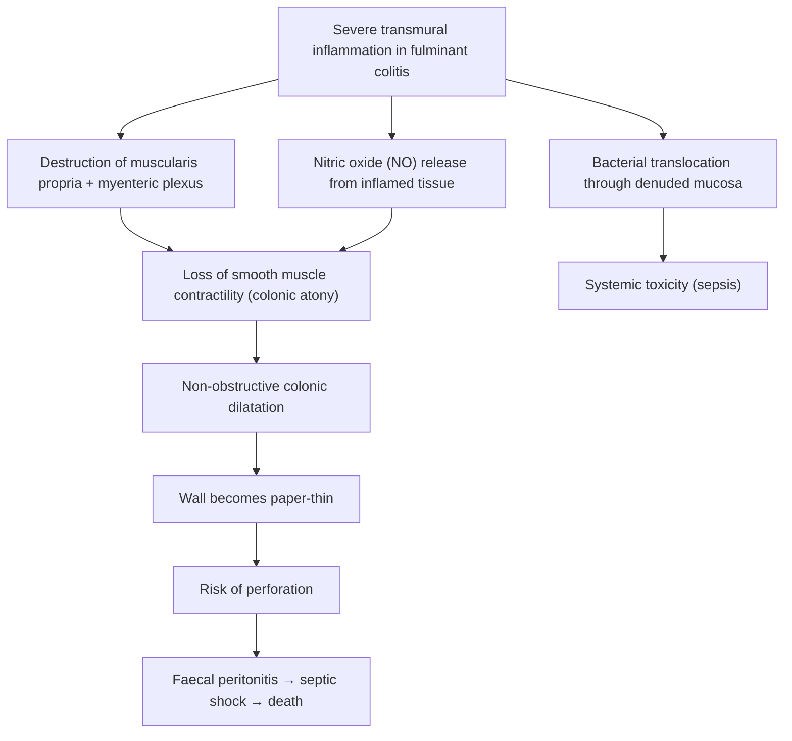
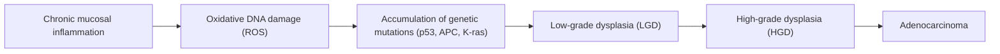
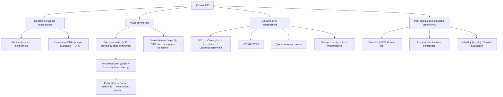

## Complications of Ulcerative Colitis

The complications of UC can be organised into three categories:

1. **Local / intestinal complications** — arising directly from the colonic disease
2. **Extraintestinal manifestations** (covered in the Clinical Features section; cross-referenced here)
3. **Treatment-related complications** — arising from medical or surgical therapy

This section focuses primarily on the local/intestinal complications and surgical complications, as they are the most clinically actionable and highest-yield for examinations.

---

### 12.1 Local / Intestinal Complications

#### A. Stricture

**What it is:** A segment of colonic narrowing causing partial or complete luminal obstruction.

**Pathophysiology:** Repeated episodes of inflammation cause submucosal fibrosis and smooth muscle hypertrophy in the colonic wall. Even though UC is "only" mucosal/submucosal, chronic relapsing inflammation leads to fibrotic remodelling of the submucosa that can narrow the lumen sufficiently to cause obstructive symptoms [2].

**Clinical features:**
- Symptoms of intestinal obstruction — colicky abdominal pain, distension, vomiting, constipation
- May be insidious (progressive narrowing of stool calibre) or acute (complete obstruction)

**The critical point — malignancy:**

> ***Strictures in UC should be considered malignant until proven otherwise by endoscopy with biopsy*** [2].

**Why?** In Crohn's disease, strictures are extremely common and are usually benign (transmural fibrosis). But in UC, strictures are **rare** because the inflammation is superficial — it doesn't normally cause the deep mural fibrosis seen in CD. So when a stricture does appear in UC, the most likely explanation is that **dysplastic or malignant tissue** is causing the narrowing. This is the inflammation → dysplasia → carcinoma sequence manifesting as a mass/stricture. Every UC stricture must be biopsied extensively, and if biopsies are inadequate or show any degree of dysplasia, surgery should be strongly considered.

***Endoscopic features that raise concern: stricture (ulcerative colitis, longer disease duration, proximal location, symptoms)*** [1].

<Callout title="UC Stricture = Cancer Until Proven Otherwise" type="error">
This is a critical exam and clinical pearl. Benign strictures are common in CD (from transmural fibrosis) but RARE in UC (mucosal inflammation doesn't cause deep fibrosis). A stricture discovered in UC should trigger immediate and thorough endoscopic evaluation with multiple biopsies to exclude adenocarcinoma.
</Callout>

---

#### B. Fulminant Colitis

**What it is:** The most severe form of acute UC — a life-threatening medical emergency.

**Clinical features** [2]:
- ***Patients present with > 10 stools per day, continuous bleeding, abdominal pain, distension, and acute severe toxic symptoms including fever and anorexia***

**Pathophysiology:**
- Fulminant colitis represents a state where the inflammatory process has become so intense that it overwhelms the body's compensatory mechanisms
- ***High risk of developing toxic megacolon as the inflammatory process extends beyond the mucosa to involve the muscle layers of the colon*** [2]
  - This is the key pathophysiological concept: normally UC is limited to mucosa/submucosa, but in fulminant colitis, the inflammation breaches this boundary and damages the **muscularis propria** → loss of smooth muscle tone → colonic atony and dilatation
  - Inflammation of the myenteric (Auerbach's) plexus → paralysis of colonic smooth muscle → the colon "stops moving"
  - Simultaneously, inflammatory mediators (NO, prostaglandins) cause vasodilation and increased vascular permeability → massive fluid shifts into the bowel wall and lumen → further distension

**Management principles:**
- Immediate admission to hospital (meets Truelove & Witts severe criteria)
- IV hydrocortisone + IV fluids + VTE prophylaxis
- Aggressive monitoring (stool charts, vitals, daily bloods, serial AXR)
- Early surgical consultation — these patients can deteriorate rapidly to toxic megacolon → perforation → death
- ***6–10% with ulcerative colitis have acute lower GI bleed needing emergency surgery (total colectomy)*** [15]

---

#### C. Toxic Megacolon

**What it is:** The most feared acute complication of UC — a true surgical emergency.

**Definition** [2]:
- ***Total or segmental non-obstructive dilatation of the colon ≥ 6 cm or caecum > 9 cm AND the presence of systemic toxicity***

**Name breakdown:** "Toxic" = systemic toxicity (sepsis-like state); "mega" = large (Greek *megas*); "colon" = the large bowel. So the name literally tells you: a dangerously dilated, toxic colon.

**Pathophysiology (from first principles):**

**Clinical presentation** [2]:
- ***Fever, tachycardia, hypotension, dehydration***
- ***Electrolyte disturbances*** (hypokalaemia worsens colonic atony — a vicious cycle)
- ***Anaemia, hypoalbuminaemia***
- ***Mental changes*** (encephalopathy from sepsis/metabolic derangement)
- Physical examination: **abdominal distension**, reduced/absent bowel sounds, diffuse tenderness, ± peritonism (if perforation has occurred)

**Diagnosis** [2]:
- ***Diagnosis is made by plain AXR***
  - Dilated colon ≥ 6 cm (transverse colon measured) or caecum > 9 cm
  - Loss of haustral markings
  - "Thumb-printing" sign (submucosal oedema/haemorrhage causing scalloped indentations along the colonic wall)
  - ***Impending perforation: thumb-printing sign*** [8]

**Management** [2]:
- ***Bowel rest and total parenteral nutrition (TPN)***
- ***Fluid and electrolyte replacement*** — aggressively correct hypokalaemia (K⁺ depletion worsens colonic atony)
- ***Corticosteroids*** (IV hydrocortisone)
- **Stop all medications that reduce colonic motility** — opioids, anticholinergics, loperamide, and codeine must be immediately discontinued as they worsen dilatation
- **Nasogastric tube decompression** + frequent position changes (rolling the patient) to help redistribute intraluminal gas
- **Serial AXR** (every 12–24 hours) to monitor colonic calibre
- ***Surgical intervention (emergency total abdominal colectomy + end ileostomy)*** if:
  - ***Failure of toxic dilatation to respond to 48 hours of therapy*** [11]
  - ***Deterioration despite optimal treatment*** [11]
  - Signs of perforation or peritonitis
  - Progressive dilatation on serial AXR

<Callout title="Why Stop Opioids and Anticholinergics in Toxic Megacolon?">
Opioids bind μ-receptors on myenteric plexus neurons → reduce acetylcholine release → decreased peristalsis → colonic atony → WORSENS dilatation. Anticholinergics directly block the muscarinic receptors needed for smooth muscle contraction. Both drug classes can precipitate or worsen toxic megacolon and must be stopped immediately.
</Callout>

---

#### D. Perforation

**What it is:** A full-thickness breach in the colonic wall allowing luminal contents to enter the peritoneal cavity.

**Pathophysiology** [2]:
- ***Most commonly occurs as a consequence of toxic megacolon***
- The massively dilated, paper-thin colonic wall (especially in the transverse colon where the diameter is greatest — Laplace's law: wall tension = pressure × radius) simply bursts
- Laplace's law explains why the largest-diameter segment perforates first: T = P × r / 2w (where T = wall tension, P = intraluminal pressure, r = radius, w = wall thickness). In toxic megacolon, r increases enormously while w decreases (thinned wall) → wall tension skyrockets → perforation
- Can also occur iatrogenically during colonoscopy in severe colitis (this is why full colonoscopy is contraindicated in fulminant colitis — use flexible sigmoidoscopy instead)

**Clinical features:**
- Sudden severe generalised abdominal pain
- Rigidity (board-like abdomen), rebound tenderness, guarding — signs of diffuse peritonitis
- Absence of bowel sounds (paralytic ileus from peritoneal contamination)
- Haemodynamic instability → septic shock
- **CXR or erect AXR**: free gas under the diaphragm (pneumoperitoneum)

**Prognosis** [2]:
- ***Perforation with peritonitis is associated with high mortality*** — reported mortality rates of 27–57% in toxic megacolon with perforation
- This underscores the importance of **early surgical intervention** when toxic megacolon is not responding to medical therapy

**Management:**
- This is a **surgical emergency** — emergency total abdominal colectomy with end ileostomy
- Aggressive resuscitation: IV fluids, broad-spectrum IV antibiotics (cover gram-negatives and anaerobes), vasopressors if needed
- ICU admission

---

#### E. Severe Haemorrhage

**What it is:** Massive, uncontrollable lower GI bleeding from the diffusely ulcerated colonic mucosa.

**Pathophysiology:**
- The friable, ulcerated mucosa in severe UC contains exposed submucosal vessels
- In most UC cases, bleeding is chronic and low-grade (mixed with stool as bloody diarrhoea). However, in severe colitis, diffuse erosion into submucosal arterioles can cause massive acute haemorrhage
- ***6–10% with ulcerative colitis have acute lower GI bleed needing emergency surgery (total colectomy)*** [15]

**Management:**
- Resuscitation: IV fluids, blood transfusion, correct coagulopathy
- If haemorrhage is uncontrollable despite medical therapy → ***emergency total abdominal colectomy + end ileostomy*** [2][11]
- ***Severe bleeding (unremitting bloody diarrhoea)*** is an indication for emergency surgery [2]

---

#### F. Colorectal Cancer (CRC)

This is the most important **long-term** complication of UC.

***CRC in IBD patients is preceded by dysplasia*** [16].
***Incidence of CRC in IBD: 18% after 30 years of colitis*** [16].

**Pathophysiology — the Inflammation-Dysplasia-Carcinoma Sequence:**

This is distinct from the sporadic **adenoma → carcinoma** sequence in non-IBD CRC. In IBD-CRC:
- The "field effect" of chronic diffuse inflammation means dysplasia can arise anywhere in the colon (not just in a single polyp)
- Dysplasia may be flat (invisible endoscopically) rather than polypoid — making detection much harder
- The risk is **cumulative** — longer disease duration = greater cumulative inflammatory burden = more DNA damage

***Risk factors for IBD-associated colorectal neoplasia*** [1]:

| Category | Risk Factors |
|---|---|
| ***Patient-specific*** | ***Primary sclerosing cholangitis; history of colorectal neoplasia; family history of CRC in first-degree relative; smoking (+); early age of disease onset (+); male sex (+)*** |
| ***Disease-specific*** | ***Disease duration; disease extent; cumulative inflammatory burden; active inflammation endoscopically or histologically*** |
| ***Endoscopic features*** | ***Stricture (UC, longer disease duration, proximal location, symptoms); shortened tubular colon; pseudopolyps*** |

[1]

**Why PSC is the strongest risk factor:** PSC is associated with a 4-fold increase in CRC risk in UC patients, independent of disease duration or extent. The mechanism is thought to involve altered bile acid metabolism — PSC causes cholestasis and changes the bile acid pool, with secondary bile acids (e.g., deoxycholic acid) being directly genotoxic to colonic epithelium.

**CRC Surveillance** (covered in detail in the Management section; key points summarised here):

***AGA Guidelines*** [12]:
- ***Started at a maximum 8 years after UC or Crohn's colitis***
- ***Left-sided or extensive colitis: within 1–2 years after initial screening colonoscopy***
- ***After two negative examinations, every 1–3 years***
- ***PSC: yearly***
- ***Ulcerative proctitis: NOT considered at increased risk***
- ***Ideally performed when disease is in remission***

***BSG Guidelines — risk-stratified*** [13]:

| ***Lower risk → Every 5 years*** | ***Intermediate risk → Every 3 years*** | ***Higher risk → Every year*** |
|---|---|---|
| ***Extensive/left-sided colitis without active inflammation; Crohn's colitis < 50% involvement*** | ***Extensive/left-sided colitis with mild inflammation; FHx CRC > 50; pseudopolyps*** | ***Extensive/left-sided colitis with moderate-severe inflammation; stricture or dysplasia in past 5 years; FHx CRC < 50*** |

---

### 12.2 Complications Related to Surgical Treatment (Post-IPAA)

Surgery (proctocolectomy + IPAA) is curative for UC but carries its own set of complications [2][8]:

#### A. Pouchitis

**The most common complication of IPAA** — lifetime incidence ~50%.

**What it is:** Inflammation of the ileal pouch (the J-pouch that was surgically created to act as a neo-rectum).

**Pathophysiology:**
- The ileal mucosa of the pouch undergoes **colonic metaplasia** over time (the ileum starts to resemble colon histologically — because it is now a reservoir exposed to faecal stasis and bacterial colonisation)
- This metaplastic mucosa is susceptible to the same dysregulated immune response that caused UC in the first place
- Bacterial overgrowth in the pouch (due to stasis) contributes to inflammation
- Pouchitis is more common in patients who had UC (vs. FAP) — supporting the idea that the underlying immune dysregulation "follows" the patient even after the colon is removed

**Clinical features:**
- ***Pouch dysfunction + systemic illness*** [8]
- Increased stool frequency (beyond baseline of ~6/day), urgency, watery/bloody stool, abdominal cramps, fever, malaise
- Diagnosis confirmed by pouchoscopy + biopsy (endoscopic evaluation of the pouch showing erythema, ulceration, and histological acute inflammation)

**Management** [2][8]:
- ***Treated with metronidazole and ciprofloxacin*** — antibiotics work here because bacterial overgrowth is a major driver. Typically a 2-week course
- For chronic/recurrent pouchitis: oral budesonide, probiotics (VSL#3), immunomodulators, or biologics
- Rarely, pouch excision with permanent ileostomy if refractory

#### B. Pouch Dysfunction (Without Pouchitis)

- ***Increased faecal frequency (mean = 6/day), urgency, incontinence*** [8]
- This is the "new normal" after IPAA — the ileal pouch cannot replicate the storage capacity of the rectum perfectly
- Most patients adapt over 6–12 months
- Management: dietary modification (low-residue diet), loperamide for frequency, pelvic floor physiotherapy for incontinence

#### C. Pelvic Nerve Damage

- ***Impotence*** [8] — pelvic dissection during proctectomy risks injury to the autonomic nerves (hypogastric nerve = sympathetic, pelvic splanchnic nerves S2–S4 = parasympathetic)
- Sympathetic damage → retrograde ejaculation or ejaculatory failure (in males)
- Parasympathetic damage → erectile dysfunction (in males), sexual dysfunction (in females)
- ***Sexual dysfunction / infertility*** [2]

#### D. Pouch-Related Structural Complications

| Complication | Mechanism | Presentation |
|---|---|---|
| ***Pouch-vaginal / perineal fistula*** [2] | Anastomotic leak or localised sepsis tracking to an adjacent structure | Passage of faecal material or air through the vagina; perineal discharge |
| ***Anastomotic stricture*** [2] | Fibrosis at the pouch-anal anastomotic site | Progressive difficulty evacuating the pouch; increased straining; narrowed calibre of stool; can be treated with endoscopic balloon dilatation |
| ***Anastomotic dehiscence with sepsis*** [2] | Breakdown of the surgical anastomosis → faecal leak into the pelvis | Pelvic sepsis — fever, abdominal/pelvic pain, raised WCC/CRP; may require drainage ± defunctioning ileostomy |

#### E. Infertility (Females)

- ***Infertility*** [2] — IPAA involves extensive pelvic dissection that causes **adhesions around the fallopian tubes and ovaries**
- Studies show ~3-fold increase in infertility after IPAA compared to medical therapy alone
- ***Female who wants to maintain fertility: total colectomy + ileorectal anastomosis (IRA)*** — this avoids pelvic dissection [8]
  - Trade-off: the rectum is left in situ → ongoing risk of rectal inflammation and CRC → needs continued surveillance

---

### 12.3 Extraintestinal Complications (Cross-Reference)

These were covered in detail in the Clinical Features section. A brief high-yield summary of the key EIM-complications:

| System | Complication | Key Points |
|---|---|---|
| ***Hepatobiliary*** | ***Primary sclerosing cholangitis (PSC)*** | ***Strong association with UC; majority of PSC patients have underlying UC; only 5% of UC patients develop PSC*** [4]. Leads to cholestasis → liver failure → cholangiocarcinoma. ***Dramatically increases CRC risk → annual surveillance colonoscopy*** [12] |
| ***Vascular*** | ***Arterial and venous thromboembolism*** | IBD is a prothrombotic state (2–3× risk). DVT, PE, portal/mesenteric vein thrombosis. Must give VTE prophylaxis during hospitalisation and flares |
| ***Dermatological*** | ***Pyoderma gangrenosum*** (more common in UC) | Deep painful ulcers with undermined, violaceous edges; pathergy phenomenon. Treat underlying UC + wound care + immunosuppression. Does NOT always correlate with disease activity |
| ***Musculoskeletal*** | ***Osteoporosis / Osteomalacia*** | Chronic steroid use + chronic inflammation → increased bone resorption. Calcium + vitamin D supplementation mandatory if steroids > 12 weeks |
| ***Haematological*** | ***Iron deficiency anaemia / Anaemia of chronic disease*** | Most common systemic complication; from chronic GI blood loss + hepcidin-mediated iron sequestration |

---

### 12.4 Prognostic Indicators

***Patient diagnosed before age 16 has a more aggressive initial course*** [2] — younger onset is associated with more extensive disease, higher relapse rates, and greater cumulative inflammatory burden over a lifetime.

***Patient diagnosed at older age is associated with a lower risk of colectomy*** [2] — older patients tend to have less extensive disease (more likely proctitis or left-sided) and may respond better to medical therapy, or may be less suitable surgical candidates.

---

### 12.5 Complications Summary — The Cascade

---

<Callout title="High Yield Summary — Complications of UC">

**Stricture:** Rare in UC (unlike CD). ***Must be considered malignant until proven otherwise by endoscopy with biopsy.***

**Fulminant colitis:** > 10 stools/day + continuous bleeding + toxic symptoms. High risk of toxic megacolon. Immediate admission, IV steroids, surgical standby.

**Toxic megacolon:** ***Colon ≥ 6 cm or caecum > 9 cm + systemic toxicity***. Diagnosed on AXR. Stop opioids/anticholinergics. Bowel rest + TPN + IV fluids + steroids. ***Surgery if no response to 48 hours therapy.***

**Perforation:** ***Usually consequence of toxic megacolon. Associated with high mortality.*** Surgical emergency.

**Severe haemorrhage:** 6–10% need emergency colectomy. Indication for emergency surgery if uncontrolled.

**CRC:** ***Incidence 18% after 30 years.*** Inflammation → dysplasia → carcinoma sequence. Risk factors: PSC, disease duration, extent, cumulative inflammation, pseudopolyps, strictures, FHx CRC. Surveillance starts at 8 years; PSC = yearly; proctitis = not at increased risk. Chromoendoscopy has highest dysplasia detection yield.

**Post-IPAA:** Pouchitis (~50%; Rx metronidazole/ciprofloxacin), anastomotic stricture, pouch-vaginal fistula, dehiscence, sexual dysfunction/infertility. Female fertility preserved by IRA instead of IPAA.

**Prognostic indicators:** Age < 16 at diagnosis → more aggressive course. Older age at diagnosis → lower colectomy risk.

</Callout>

---

<ActiveRecallQuiz
  title="Active Recall - Complications of Ulcerative Colitis"
  items={[
    {
      question: "A patient with long-standing UC is found to have a colonic stricture on surveillance colonoscopy. What is your immediate concern and what investigation must be performed?",
      markscheme: "Strictures in UC should be considered malignant until proven otherwise. Unlike CD (where transmural fibrosis commonly causes benign strictures), UC causes only mucosal/submucosal inflammation which rarely leads to benign strictures. Must perform colonoscopy with multiple biopsies of and around the stricture to exclude adenocarcinoma. If biopsies are inadequate or show any dysplasia, surgery (colectomy) should be strongly considered."
    },
    {
      question: "Define toxic megacolon, describe its pathophysiology from first principles, and name 3 medications that must be immediately discontinued.",
      markscheme: "Definition: Total or segmental non-obstructive dilatation of colon >= 6 cm or caecum > 9 cm with systemic toxicity. Pathophysiology: Severe inflammation extends beyond mucosa to involve muscularis propria and myenteric plexus (Auerbach's) in fulminant colitis. Destruction of smooth muscle and myenteric plexus + excessive nitric oxide release causes colonic atony and dilatation. Bacterial translocation through denuded mucosa causes systemic toxicity (sepsis). Wall becomes paper-thin with high risk of perforation per Laplace's law (tension = pressure x radius). Medications to stop: 1) Opioids (reduce peristalsis via mu-receptors), 2) Anticholinergics (block muscarinic receptors needed for contraction), 3) Loperamide/codeine (anti-motility). These agents worsen colonic atony and can precipitate perforation."
    },
    {
      question: "Describe the inflammation-dysplasia-carcinoma sequence in UC and name 4 risk factors for IBD-associated CRC.",
      markscheme: "Sequence: Chronic mucosal inflammation generates reactive oxygen species (ROS) causing cumulative oxidative DNA damage. Mutations accumulate in tumour suppressor genes (p53, APC) and oncogenes (K-ras), leading first to low-grade dysplasia (LGD), then high-grade dysplasia (HGD), then invasive adenocarcinoma. Unlike sporadic CRC (adenoma-carcinoma sequence), IBD-CRC arises from flat dysplasia in a 'field effect' of diffuse inflammation. Risk factors (any 4): PSC, disease duration, disease extent, cumulative inflammatory burden, active inflammation, pseudopolyps, stricture, FHx of CRC in first-degree relative, early age of onset, male sex, shortened tubular colon."
    },
    {
      question: "A patient develops pouchitis 1 year after IPAA for UC. Explain the pathophysiology and first-line treatment.",
      markscheme: "Pathophysiology: The ileal J-pouch undergoes colonic metaplasia over time (exposed to faecal stasis and bacterial colonisation). This metaplastic mucosa becomes susceptible to the same dysregulated immune response that drove the original UC. Bacterial overgrowth in the stagnant pouch contributes to inflammation. Pouchitis is more common after UC (vs FAP), supporting the immune dysregulation hypothesis. First-line treatment: oral metronidazole and/or ciprofloxacin (antibiotics address the bacterial overgrowth component). Typically a 2-week course. For chronic/recurrent pouchitis, consider oral budesonide, probiotics (VSL#3), or biologics."
    },
    {
      question: "Why is perforation in toxic megacolon associated with such high mortality, and what does Laplace's law have to do with it?",
      markscheme: "Laplace's law states that wall tension (T) is proportional to intraluminal pressure (P) multiplied by radius (r) and inversely proportional to wall thickness (w): T = Pr/2w. In toxic megacolon, the radius increases massively (dilatation) while the wall becomes paper-thin (inflammation destroys muscularis propria). This causes wall tension to skyrocket beyond the structural limit, leading to perforation. Perforation releases faecal contents into the peritoneal cavity causing diffuse faecal peritonitis. The patient is already systemically toxic (sepsis from bacterial translocation), and the addition of faecal contamination triggers overwhelming septic shock. Mortality is 27-57% because of the combination of pre-existing systemic toxicity, faecal peritonitis, and the patient's debilitated state (malnourished, anaemic, often immunosuppressed from steroids)."
    }
  ]}
/>

## References

[1] Lecture slides: Inflammatory bowel disease.pdf (p. 52 — IBD-associated CRC risk factors)
[2] Senior notes: felixlai.md (Inflammatory bowel disease — Ulcerative colitis: complications, surgical treatment, prevention/CRC screening)
[4] Senior notes: felixlai.md (Primary sclerosing cholangitis section)
[8] Senior notes: maxim.md (Inflammatory bowel disease: surgical indications; Surgical procedures for UC)
[11] Lecture slides: Inflammatory bowel disease.pdf (pp. 18, 19, 20, 21 — Surgical indications, emergency surgery, colectomy, surgical options)
[12] Lecture slides: Inflammatory bowel disease.pdf (p. 56 — AGA guideline 2010 for CRC surveillance)
[13] Lecture slides: Inflammatory bowel disease.pdf (p. 57 — BSG guideline 2010 for risk-stratified surveillance)
[15] Lecture slides: GC 186. Lower and diffuse abdominal painfresh blood in stool.pdf (p. 11 — IBD and PR bleeding)
[16] Lecture slides: Inflammatory bowel disease.pdf (p. 51 — IBD-associated CRC, colitis-dysplasia-carcinoma sequence, 18% incidence after 30 years)
