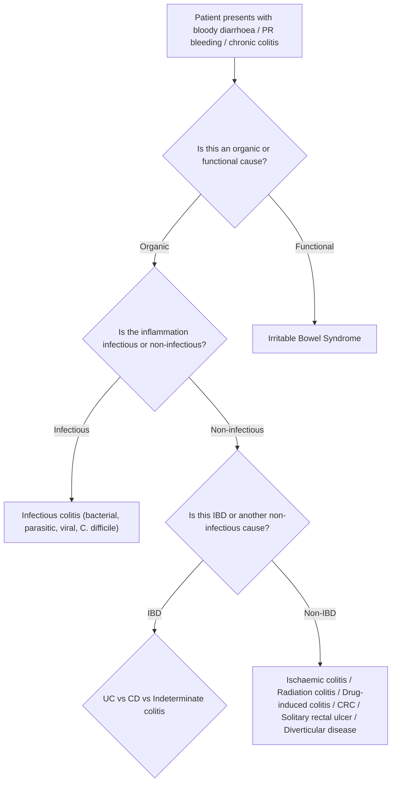

## Differential Diagnosis of Ulcerative Colitis

### 9.1 The Clinical Problem — Why Differential Diagnosis Matters

A patient presenting with **bloody diarrhoea, abdominal pain, and rectal bleeding** does NOT automatically have UC. The differential is broad because the colon has a limited repertoire of responses to injury — it becomes inflamed, it ulcerates, it bleeds. The key clinical challenge is distinguishing UC from conditions that mimic it, because **management differs dramatically** (e.g., treating infectious colitis with immunosuppression would be catastrophic; missing colorectal cancer is lethal).

The approach to differential diagnosis follows a logical framework:

---

### 9.2 Key Differentials — Detailed Breakdown

#### A. Crohn's Disease (CD) — The Most Important Differential

This is the single most important differential because both are IBD, share overlapping features, and roughly ***10% of cases fail to be classified between UC and CD (indeterminate colitis)*** [1][2].

**Why it can mimic UC:** Both can present with bloody diarrhoea, abdominal pain, weight loss, and extraintestinal manifestations. When CD is **limited to the colon** (colonic CD, ~32% of CD cases [2]), the clinical picture can be virtually indistinguishable from UC.

**How to distinguish from UC:**

| Feature | Favours **CD** | Favours **UC** |
|---|---|---|
| ***Distribution*** | ***Skip lesions, rectal sparing*** | ***Continuous from rectum proximally*** |
| ***Depth*** | ***Full thickness (transmural)*** | ***Mucosal/submucosal*** |
| ***Fistulae*** | ***Common (intestinal/perianal)*** | ***Never*** |
| ***Perianal disease*** | ***Up to 40%*** | ***Rare*** |
| ***Benign stricture*** | ***Common*** | ***Rare (suspect malignancy if present)*** |
| Granulomas on biopsy | Present (must exclude TB) | Absent |
| Goblet cells | Preserved | Depleted |
| Ulcers | Deep, focal, cobblestone | Shallow, diffuse |
| ***Pseudopolyps*** | ***Rare*** | ***Present*** |
| Serological markers | ***ASCA positive*** | ***pANCA positive*** |
| Small bowel involvement | Yes (especially terminal ileum) | No (except backwash ileitis) |
| Upper GI involvement | Yes (mouth to anus) | No |
| Smoking | Risk factor (worsens disease) | Protective |
| Appendicectomy | Risk factor | Protective |

[1][2][3]

<Callout title="When to Think Indeterminate Colitis">
If a patient has **colonic-only IBD** with features of BOTH UC and CD — e.g., continuous colitis with some deep ulcers, or diffuse colitis with a few skip areas — the label ***"indeterminate colitis"*** is applied. This occurs in ***~10% of IBD patients*** [1]. The practical point is that surgical management follows UC protocols (i.e., proctocolectomy with ileal pouch-anal anastomosis is still an option, though pouch failure rates are slightly higher).
</Callout>

#### B. Irritable Bowel Syndrome (IBS)

**Why it can mimic UC:** IBS presents with ***chronic abdominal pain and altered bowel habits*** [2], which overlaps with mild UC.

**Why it is NOT UC — first principles reasoning:**
- IBS is a **functional** disorder — there is **no organic pathology**, no mucosal inflammation, no ulceration
- IBS does NOT cause:
  - Bloody stools (if a patient has blood in the stool, it is NOT IBS until proven otherwise)
  - Raised inflammatory markers (CRP, ESR, faecal calprotectin are all normal)
  - Weight loss, anaemia, fever, or nocturnal symptoms
  - Abnormal endoscopy or histology

**Key distinguishing features:**

| Feature | IBS | UC |
|---|---|---|
| PR bleeding | Absent | Present (hallmark) |
| Faecal calprotectin | Normal ( < 50 μg/g) | Elevated |
| CRP/ESR | Normal | Elevated |
| Endoscopy | Normal | Mucosal inflammation, ulceration, pseudopolyps |
| Nocturnal symptoms | Absent (functional pain does not wake patients) | Present (severe UC causes nocturnal diarrhoea) |
| Rome IV criteria | Meets criteria for functional disorder | Does not meet criteria |

**Clinical pearl:** ***Faecal calprotectin*** is the best non-invasive test to distinguish IBD from IBS. It is a ***neutrophil-derived protein (60% of neutrophil cytosol)*** and is the ***most sensitive marker of intestinal inflammation in IBD*** [5]. A normal faecal calprotectin essentially excludes active IBD and points toward IBS.

#### C. Infectious Colitis

***Infection including E. coli, Salmonella, Shigella, Campylobacter, Yersinia, and amoebiasis should be excluded with stool studies*** [2]. ***C. difficile infection should be considered particularly in patients treated with antibiotics*** [2].

**Why infectious colitis can mimic UC:** Acute infectious colitis can produce identical symptoms — bloody diarrhoea, abdominal cramps, tenesmus, fever. On endoscopy, some infections (e.g., *Shigella*, *E. histolytica*) can cause diffuse colonic inflammation with shallow ulceration that looks exactly like UC.

**Why the distinction is critical:** Treating infectious colitis with immunosuppression (steroids, azathioprine) would worsen the infection catastrophically. Conversely, treating UC with antibiotics alone would not control the underlying immune-mediated process.

**How to distinguish:**

| Feature | Infectious Colitis | UC |
|---|---|---|
| Onset | Acute (days to 1–2 weeks) | Chronic, insidious (weeks to months) |
| Duration | Usually self-limiting ( < 4–6 weeks) | Chronic, relapsing-remitting |
| Travel history | Often positive (endemic areas for amoebiasis, Salmonella, etc.) | Not relevant |
| Antibiotic use | ***Recent antibiotics → C. difficile*** [2] | Not a trigger (though antibiotics can worsen UC) |
| Stool culture / PCR | Positive for pathogen | Negative |
| Histology | Acute inflammation, no chronic architectural changes | Chronic architectural changes (crypt distortion, branching, goblet cell depletion) |
| ***Sexual history*** | ***Neisseria gonorrhoeae and HSV are associated with proctitis*** [2] | Not relevant |

**Specific pathogens to consider:**

| Pathogen | Key Features | Why It Mimics UC |
|---|---|---|
| ***C. difficile*** | ***Antibiotic-associated pseudomembranous colitis*** [2]; produces toxin A (enterotoxin) and toxin B (cytotoxin); pseudomembranes on endoscopy | Can cause diffuse colitis with bloody diarrhoea. Can also **superinfect** existing UC (always check C. diff toxin in UC flares!) |
| *Salmonella / Shigella / Campylobacter* | Acute dysentery with bloody stools, fever | Self-limiting; stool culture positive |
| *E. coli O157:H7* | Produces Shiga toxin → haemorrhagic colitis, HUS | Bloody diarrhoea, abdominal cramps |
| ***Entamoeba histolytica*** | ***Travel to endemic areas (South/Southeast Asia, Africa)*** [2]; flask-shaped ulcers on biopsy | Chronic bloody diarrhoea; can cause amoebic liver abscess |
| *Yersinia enterocolitica* | Terminal ileitis (mimics CD more than UC); ***sometimes misdiagnosed as acute appendicitis*** [6] | RLQ pain, diarrhoea |
| *Mycobacterium tuberculosis* | ***Must exclude enteric TB*** (especially in Hong Kong!) [3]; caseating granulomas, ileocaecal involvement | Can cause chronic colitis with granulomas (mimics CD more than UC) |
| *CMV* | Immunocompromised patients; can reactivate in patients on immunosuppression for UC | Can cause colitis with deep ulcers, may complicate existing UC (steroid-refractory UC should be tested for CMV) |

[2][5][6]

<Callout title="Must Exclude Infections Before Starting Immunosuppression" type="error">
Every patient presenting with a first episode of colitis MUST have stool studies (microscopy for ova and parasites, culture, C. difficile toxin PCR) before immunosuppressive therapy is started. In Hong Kong specifically, ***TB testing is mandatory*** — TB can mimic IBD and immunosuppression in the setting of undiagnosed TB is life-threatening. ***Hepatitis serology and HIV testing*** should also be performed [5].
</Callout>

#### D. Ischaemic Colitis

**Why it can mimic UC:** Ischaemic colitis presents with ***rapid onset of abdominal pain, haematochezia or bloody diarrhoea*** [4]. On endoscopy, the mucosa may appear oedematous, friable, and ulcerated — resembling UC.

**Why it is NOT UC — first principles reasoning:**
- Ischaemic colitis results from **inadequate blood supply** to the colon (usually from low-flow states or atherosclerotic disease), NOT from immune-mediated mucosal inflammation
- It characteristically affects **watershed areas** (splenic flexure and rectosigmoid junction) — these are the boundaries between the SMA and IMA territories, and between the IMA and internal iliac arteries
- The pattern is **segmental** (not continuous from rectum) and **spares the rectum** (dual blood supply from IMA and internal iliac artery protects it) — this is the opposite of UC which STARTS at the rectum

**Key distinguishing features:**

| Feature | Ischaemic Colitis | UC |
|---|---|---|
| Onset | Acute, sudden | Gradual, insidious |
| ***Risk factors*** | ***Advanced age, hypertension, DM, dehydration, laxative use, haemodialysis, OCP, AF, atherosclerotic disease*** [4] | Younger patients, family history of IBD |
| Distribution | Segmental, watershed areas; rectum usually spared | Continuous from rectum |
| CT findings | Segmental colonic wall thickening, "thumbprinting" (submucosal oedema/haemorrhage) | Continuous colonic wall thickening, loss of haustral pattern |
| Endoscopy | Segmental with sharp demarcation ("line of demarcation"), bluish/dusky mucosa | Continuous erythema, friability, shallow ulcers, pseudopolyps |
| Chronicity | Usually self-limiting (resolves in 1–2 weeks); can stricture | Chronic, relapsing |

#### E. Radiation Colitis / Proctitis

***Radiation colitis occurs weeks to years after abdominal or pelvic irradiation*** [2].

**Why it can mimic UC:** Presents with chronic bloody diarrhoea, tenesmus, and rectal bleeding — identical symptoms to UC. The rectum is often involved (because pelvic radiation for cervical/prostate/rectal cancer directly damages it).

**How to distinguish:**
- **History of prior radiation therapy** is the key clue — always ask about cancer treatment history
- ***Acute radiation injury often occurs within 6 weeks of therapy*** [4]; chronic radiation proctitis can develop months to years later
- Endoscopy shows **telangiectasias** (dilated blood vessels) in the radiated segment, which are characteristic and not seen in UC
- The inflammation is **limited to the radiation field**, not continuous from the rectum

#### F. Medication-Associated Colitis

***NSAIDs can cause chronic diarrhoea and bleeding*** [2].

**Why it can mimic UC:** NSAIDs inhibit COX → reduced prostaglandin-mediated mucosal protection → mucosal ulceration and bleeding. The resulting colitis can look like mild-to-moderate UC on endoscopy.

**How to distinguish:**
- Temporal relationship with NSAID use (symptoms improve on stopping the drug)
- NSAIDs can also **trigger or worsen existing UC** — so this can be both a differential AND a precipitant
- Other drug causes of colitis to consider: mycophenolate mofetil, ipilimumab (immune checkpoint inhibitor colitis — increasingly common), oral contraceptives

#### G. Solitary Rectal Ulcer Syndrome (SRUS)

***Presents with abdominal pain, altered bowel habits, and bleeding. Has a characteristic appearance on histology with a thickened mucosal layer and distortion of crypt architecture*** [2].

**Why it can mimic UC:** Rectal bleeding + altered bowel habits + rectal ulceration on endoscopy.

**How to distinguish:**
- Despite the name, there may be **multiple ulcers** (or even just mucosal erythema without a discrete ulcer)
- Caused by **chronic straining and rectal prolapse** — the mechanical trauma of repeated straining and mucosal prolapse causes ischaemic injury to the rectal mucosa
- Histology is distinctive: **fibromuscular obliteration of the lamina propria** with thickened muscularis mucosae — this is NOT seen in UC
- The surrounding rectal mucosa is **normal** (no diffuse inflammation), unlike UC where the entire rectal mucosa is inflamed

#### H. Colorectal Cancer (CRC)

**Why it must always be considered:** CRC can present with ***PR bleeding, change in bowel habits, tenesmus, and weight loss*** [7] — all of which overlap with UC. Furthermore, **UC itself is a risk factor for CRC**, so the two conditions may coexist.

**How to distinguish:**
- CRC typically presents in **older patients** ( > 50) with **progressive** symptoms
- ***Constitutional symptoms, change in stool calibre, alternating diarrhoea and constipation, IO symptoms, metastatic symptoms (jaundice, SOB, bone pain)*** [7] suggest CRC
- Endoscopy reveals a **mass/lesion** rather than diffuse mucosal inflammation
- In UC, ***strictures should be considered malignant until proven otherwise by endoscopy with biopsy*** [2] — a stricture in UC is CRC until proven otherwise

#### I. Diverticular Disease

***Diverticular bleeding*** presents as ***painless massive PR bleeding (rupture of vasa recta)*** [8] — this is a different pattern from UC (which causes chronic bloody diarrhoea, not acute massive haemorrhage). However, **diverticulitis** can cause lower abdominal pain with altered bowel habits and low-grade PR bleeding, which may overlap with UC.

**How to distinguish:**
- Diverticular disease is primarily a disease of **older patients** (rare before age 30) [8]
- ***Right-sided diverticula are common in Asians*** [8] — this is important for Hong Kong
- ***Clinical triad of diverticulitis: lower abdominal pain + fever + leucocytosis*** [8] — UC has more prominent diarrhoea and bleeding rather than localised pain with fever
- CT scan shows **pericolonic inflammation with diverticula** in diverticulitis vs. **mucosal thickening without diverticula** in UC
- ***Diarrhoea rather than abdominal pain is the predominant symptom in IBD*** [4], whereas abdominal pain predominates in diverticulitis

#### J. Causes of Ileitis (Relevant When Backwash Ileitis Raises Concern)

***Causes of ileitis include*** [6]:
- ***Crohn's disease***
- ***Tuberculosis***
- ***Radiation enteritis***
- ***Bacterial infection (e.g., Campylobacter, Yersinia, Salmonella)***

These are ***sometimes misdiagnosed as acute appendicitis*** [6]. If a patient being worked up for "UC" has prominent ileal disease beyond mild backwash ileitis, these differentials must be considered — particularly CD and TB in the Hong Kong context.

---

### 9.3 Causes of PR Bleeding — Comprehensive Differential

From the lecture slides, the ***causes of PR bleeding*** should be systematically categorised [9]:

| Anatomical Location | Causes |
|---|---|
| ***Anal*** | ***Haemorrhoids; Anal fissures; Cancer*** |
| ***Colorectal*** | ***Cancer; Rectal ulcers; Diverticular bleeding; Angiodysplasia; Inflammatory bowel disease; Radiation proctitis; Ischaemic bowel; Infective colitis; Post-polypectomy bleeding*** |
| ***Small bowel*** | ***Meckel's diverticulum; Angiodysplasia, haemangioma; Small bowel tumour; Small bowel ulcer (NSAID-related); Crohn's disease; Aortoenteric fistula*** |
| ***Upper GI bleeding*** | ***Massive UGIB can present as haematochezia*** |

[9]

---

### 9.4 Summary — Approach to Differential Diagnosis of Suspected UC

The systematic approach involves asking **four key questions**:

| Question | What to Consider |
|---|---|
| **1. Is this organic or functional?** | IBS (functional) vs. IBD/infection/cancer (organic). Faecal calprotectin is the best discriminator. |
| **2. If organic, is this infectious?** | Always exclude infection FIRST: stool culture, C. diff toxin, ova & parasites, TB testing. Sexual history for STI-associated proctitis. Travel history for amoebiasis. |
| **3. If non-infectious, is this IBD?** | UC vs. CD vs. indeterminate colitis. Use clinical, endoscopic, histological, and serological features. |
| **4. If non-IBD, what else?** | Ischaemic colitis (elderly, vascular risk factors, segmental). Radiation colitis (prior radiation). Drug-induced (NSAIDs). CRC (mass on colonoscopy). SRUS (straining history, characteristic histology). Diverticular disease. |

The ***essential investigations to request*** during the differential diagnosis workup include [2][5]:
- ***Stool examination: culture, C. difficile toxin, calprotectin***
- ***Blood tests: CBP, CRP, ESR, albumin, ferritin***
- ***Serological markers: pANCA (UC), ASCA (CD)***
- ***Hepatitis serology, HIV, TB testing***
- Colonoscopy with biopsies (gold standard)

---

<Callout title="High Yield Summary — Differential Diagnosis of UC">

1. **Crohn's disease** — most important differential; distinguish by distribution (skip lesions, rectal sparing), depth (transmural), complications (fistulae, perianal disease, strictures), and serology (ASCA+ vs. pANCA+). ~10% are indeterminate.

2. **IBS** — functional, no blood, no raised inflammatory markers, normal faecal calprotectin and endoscopy.

3. **Infectious colitis** — MUST exclude before starting immunosuppression. Stool studies mandatory. C. difficile in antibiotic users; amoebiasis in travellers; TB in Hong Kong. STI proctitis (gonorrhoea, HSV) in MSM.

4. **Ischaemic colitis** — elderly, vascular risk factors, acute onset, segmental distribution at watershed areas, rectal sparing.

5. **Radiation colitis** — history of pelvic/abdominal radiation; telangiectasias on endoscopy.

6. **Drug-induced colitis** — temporal relationship with NSAIDs; resolves on cessation.

7. **SRUS** — straining history; fibromuscular obliteration on histology.

8. **CRC** — always consider; strictures in UC are malignant until proven otherwise.

9. **Diverticular disease** — older patients, painless massive bleeding (diverticular bleed) or pain + fever + leucocytosis (diverticulitis).

</Callout>

---

<ActiveRecallQuiz
  title="Active Recall - Differential Diagnosis of Ulcerative Colitis"
  items={[
    {
      question: "A 35-year-old woman presents with 6 weeks of bloody diarrhoea and abdominal cramps. Before starting corticosteroids, what 3 categories of infections must you exclude and how?",
      markscheme: "1) Bacterial: Stool culture for Salmonella, Shigella, Campylobacter, E. coli O157:H7, Yersinia. 2) C. difficile: Stool PCR for toxin A and B (especially if recent antibiotic use). 3) Parasitic: Stool microscopy for ova and parasites, antigen detection for Entamoeba histolytica, Cryptosporidium, Giardia. Also: TB testing (AFB smear, culture, and/or IGRA) is mandatory in Hong Kong. Hepatitis serology and HIV testing should also be done before immunosuppression."
    },
    {
      question: "Name 4 clinical features that would favour Crohn's disease over ulcerative colitis in a patient presenting with chronic colitis.",
      markscheme: "Any 4 of: 1) Skip lesions on endoscopy (vs continuous in UC). 2) Perianal disease (fissures, fistulae, abscesses) - up to 40% in CD, rare in UC. 3) Rectal sparing. 4) Fistula formation (enteroenteric, enterovesical, enterocutaneous). 5) Deep ulcers or cobblestone appearance. 6) Small bowel involvement. 7) Non-caseating granulomas on biopsy. 8) Abdominal mass. 9) ASCA positive (vs pANCA positive in UC)."
    },
    {
      question: "How does faecal calprotectin help distinguish IBS from IBD, and why is it the best non-invasive marker?",
      markscheme: "Faecal calprotectin is a neutrophil-derived protein constituting 60% of neutrophil cytosol. It is released when neutrophils infiltrate the intestinal wall during inflammation. It is the most sensitive marker of intestinal inflammation in IBD and correlates well with endoscopic disease activity. In IBS (functional disorder with no mucosal inflammation), calprotectin is normal (below 50 mcg/g). An elevated calprotectin strongly suggests organic inflammatory pathology (IBD, infection) and warrants colonoscopy. A normal calprotectin essentially rules out active IBD."
    },
    {
      question: "Explain why ischaemic colitis typically spares the rectum, and how this helps distinguish it from UC.",
      markscheme: "The rectum has a dual blood supply from the IMA (superior rectal artery) and the internal iliac arteries (middle and inferior rectal arteries). This redundant supply protects it from ischaemia. Ischaemic colitis affects watershed areas (splenic flexure between SMA and IMA territories; rectosigmoid junction between IMA and internal iliac). In contrast, UC almost always starts at the rectum and extends proximally in a continuous fashion. Rectal sparing in a colitis case strongly argues against UC and favours ischaemic colitis or Crohn's disease."
    },
    {
      question: "A patient with known UC develops a colonic stricture. What is the most important concern and what should be done?",
      markscheme: "A stricture in UC should be considered malignant until proven otherwise. UC causes mucosal/submucosal inflammation, which rarely leads to benign strictures (unlike CD where transmural fibrosis commonly causes strictures). Therefore, any stricture in UC raises high suspicion for colorectal cancer arising from the chronic inflammation-dysplasia-carcinoma sequence. The patient must undergo colonoscopy with multiple biopsies of the stricture to exclude malignancy."
    }
  ]}
/>

## References

[1] Lecture slides: Inflammatory bowel disease.pdf (pp. 2, 6, 9, 11)
[2] Senior notes: felixlai.md (Inflammatory bowel disease — Ulcerative colitis sections: overview, etiology, clinical manifestation, differential diagnosis, diagnosis)
[3] Senior notes: felixlai.md (Inflammatory bowel disease — Crohn's disease sections: comparison table, histological features)
[4] Senior notes: felixlai.md (Diverticular disease section: differential diagnosis including ischaemic colitis)
[5] Lecture slides: Inflammatory bowel disease.pdf (p. 11 — Diagnosis: laboratory tests, faecal calprotectin)
[6] Lecture slides: GC 195. Lower and diffuse abdominal pain RLQ problems; pelvic inflammatory disease; peritonitis and abdominal emergencies.pdf (p. 20 — Ileitis causes)
[7] Senior notes: maxim.md (LGIB DDx table — colorectal carcinoma features)
[8] Senior notes: maxim.md (Diverticular disease section)
[9] Lecture slides: GC 186. Lower and diffuse abdominal painfresh blood in stool.pdf (p. 8 — Causes of PR bleeding)
