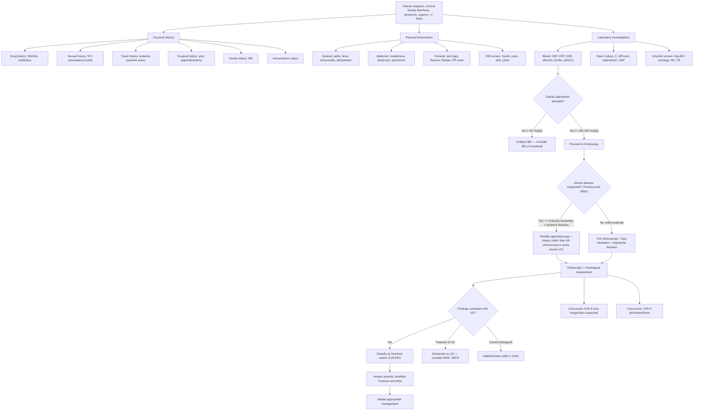

## Diagnostic Criteria, Diagnostic Algorithm & Investigations for Ulcerative Colitis

### 10.1 Diagnostic Criteria — First Principles

There is **no single gold-standard diagnostic test** for UC. Unlike, say, diabetes (where a fasting glucose or HbA1c gives you a definitive cut-off), UC is diagnosed by the **convergence of clinical, laboratory, endoscopic, and histological findings** combined with the **exclusion of other causes of colitis** (especially infection and CD). Think of it as a jigsaw puzzle — no single piece is diagnostic, but when you put together the clinical picture + endoscopy + histology + negative stool studies, the diagnosis becomes clear.

The key diagnostic pillars are:

1. **Compatible clinical presentation** — chronic/relapsing bloody diarrhoea, tenesmus, urgency, +/- extraintestinal manifestations
2. **Endoscopic findings** — continuous mucosal inflammation starting from the rectum, with characteristic features (see below)
3. **Histological confirmation** — mucosal/submucosal inflammation with crypt architectural distortion, cryptitis/crypt abscesses, goblet cell depletion
4. **Exclusion of infections and other mimics** — negative stool studies, negative TB testing
5. **Serological and biochemical support** — pANCA positivity, raised inflammatory markers, raised faecal calprotectin

<Callout title="There Is No Single Diagnostic Criterion for UC">
Unlike some conditions with formal diagnostic criteria (e.g., Jones criteria for rheumatic fever), UC is diagnosed by the **combination** of clinical history, endoscopy, histology, and exclusion of differentials. The diagnosis should be revisited if the clinical course is atypical — up to 10% of colitis cases initially labelled as UC may be reclassified as CD or indeterminate colitis over time.
</Callout>

---

### 10.2 Diagnostic Algorithm

The algorithm below reflects the systematic approach from clinical suspicion through to definitive diagnosis and disease classification:

[1][2][5]

---

### 10.3 History Taking — Targeted Questions

***Patient history should cover*** [5]:

| Domain | Key Questions | Rationale |
|---|---|---|
| ***Bowel symptoms*** | Onset, duration, frequency, blood/mucus, urgency, tenesmus, nocturnal symptoms | Characterise the presentation; nocturnal symptoms suggest organic disease (not IBS) |
| ***Medications*** | ***NSAIDs*** (trigger flare/mimic UC); ***antibiotics*** (C. difficile risk) [2] | Must exclude drug-induced colitis and superimposed C. diff |
| ***Surgery*** | Prior appendicectomy (protective for UC; risk factor for CD) | Alters pretest probability |
| ***Drug history*** | Current medications, immunosuppression, biologics | Baseline before starting therapy; drug interactions |
| ***Immunisation status*** | Hep B, varicella, influenza, pneumococcal, COVID-19 | ***Must assess before starting immunosuppression*** [5] — live vaccines contraindicated on biologics/thiopurines |
| ***Sexual history*** | ***Neisseria gonorrhoeae and HSV are associated with proctitis*** [2] | STI proctitis can mimic UC proctitis, especially in MSM |
| ***Travel history*** | ***Areas endemic for parasitic infection such as amoebiasis*** [2] | Amoebic colitis mimics UC |
| Family history | IBD in first-degree relatives | Increases pretest probability |

### 10.4 Physical Examination

***Physical examination should include*** [5]:

| Examination | Findings | Significance |
|---|---|---|
| ***General examination*** | Pallor, vital signs (fever, hypotension, tachycardia) [2] | Assess severity (Truelove & Witts); tachycardia + fever = severe |
| ***Abdomen*** | Tenderness (LLQ for left-sided UC; diffuse for pancolitis), distension (toxic megacolon), peritonism (perforation) | Localise disease; detect complications |
| ***Perianal region*** | ***Skin tags, fissures, fistulae, abscess, PR exam*** [5] | **If perianal disease is found → strongly consider CD instead of UC** (perianal disease is rare in UC) |
| ***Extraintestinal inspections*** | ***Mouth (aphthous ulcers), eyes (episcleritis, uveitis), skin (erythema nodosum, pyoderma gangrenosum), joints (arthropathy)*** [5] | Screen for EIMs; oral ulcers more suggestive of CD |
| ***Digital rectal examination*** | Blood/mucus on glove, rectal tenderness [2] | Confirms rectal involvement; assesses for rectal mass |

---

### 10.5 Investigation Modalities — Detailed Breakdown

#### A. Laboratory Tests (Blood)

***Blood tests: CBP, CRP, ESR, albumin, ferritin*** [5]

| Test | Expected Findings in UC | Pathophysiological Basis / Interpretation |
|---|---|---|
| ***CBP (Complete Blood Picture) with differentials*** | **Anaemia** (may be microcytic from iron deficiency or normocytic from chronic disease); leucocytosis (active inflammation or infection); thrombocytosis (reactive) [2] | **Iron deficiency anaemia**: chronic blood loss from friable ulcerated mucosa → depleted iron stores → low MCV, low ferritin, low serum iron, high TIBC. **Anaemia of chronic disease**: IL-6 → hepcidin → iron sequestration → low serum iron but normal/high ferritin. **Autoimmune haemolytic anaemia**: rare EIM, Coombs-positive [2] |
| ***CRP (C-reactive protein)*** | Elevated in active disease; ***CRP in Crohn disease is typically higher than in ulcerative colitis*** [2]. ***CRP monitoring under therapy is useful to document efficacy of anti-inflammatory treatment*** [2] | CRP is an acute-phase reactant produced by the liver in response to IL-6. In UC, the CRP rise is often modest (because inflammation is mucosal, not transmural), so a **normal CRP does NOT exclude active UC**. However, a significantly elevated CRP ( > 30 mg/L) in UC = severe disease (Truelove & Witts) and suggests deep/extensive inflammation |
| ***ESR (Erythrocyte Sedimentation Rate)*** | Elevated ( > 30 mm/h = severe) | ESR rises with increased fibrinogen and immunoglobulins in chronic inflammation. Less specific than CRP but included in Truelove & Witts criteria. Slow to rise and slow to fall — better reflects chronic disease activity |
| ***Albumin*** | **Hypoalbuminemia** [2] | ***Malabsorption and protein-losing enteropathy*** [2] — inflamed, denuded colonic mucosa leaks albumin into the lumen. Also: decreased hepatic synthesis due to chronic inflammation (negative acute-phase reactant) and reduced oral intake. Low albumin is a marker of disease severity and nutritional status |
| ***Ferritin*** | May be low (iron deficiency) or normal/elevated (acute-phase reactant in active inflammation) | Ferritin is both an iron storage marker AND an acute-phase reactant. In active UC, it can be misleadingly normal even with true iron deficiency. Always interpret with transferrin saturation and TIBC |
| **Electrolyte profile** | ***Hypokalaemia*** [2] | Chronic diarrhoea → loss of K⁺ in stool (colonic secretion is K⁺-rich). Can also lose bicarbonate → non-anion gap metabolic acidosis |
| **RFT** | Usually normal; assess baseline before starting nephrotoxic drugs (e.g., ciclosporin, 5-ASA can rarely cause interstitial nephritis) | Baseline renal function important for drug dosing |
| **LFT** | May show cholestatic pattern if concurrent PSC; elevated ALP/GGT | Screen for PSC; also baseline before azathioprine/methotrexate |
| ***Serum iron and vitamin B12 level*** | Low iron (chronic blood loss); ***vitamin B12 deficiency*** (rare in UC, more relevant in CD with ileal disease/resection) [2] | Iron deficiency from chronic GI blood loss; B12 deficiency relevant if backwash ileitis or post-surgical short bowel |

#### B. Serological Markers

***Serological markers from lecture slides and notes*** [2][5]:

| Marker | Association | Sensitivity/Specificity | Interpretation |
|---|---|---|---|
| ***pANCA (Perinuclear antineutrophil cytoplasmic antibodies)*** | ***Common in UC*** [2][5] | Sensitivity ~60–70% for UC; specificity ~85% | pANCA targets myeloperoxidase in neutrophil perinuclear granules. Positive pANCA supports UC diagnosis, but ~30–40% of UC patients are pANCA-negative, so a negative result does NOT exclude UC |
| ***ASCA (Anti-Saccharomyces cerevisiae antibodies)*** | ***Common in CD*** [2][5] | Sensitivity ~60% for CD; specificity ~85% | ASCA targets mannose epitopes in the yeast *S. cerevisiae* cell wall — these share structural similarity with microbial antigens in CD. ASCA-positive + pANCA-negative strongly favours CD |
| **Anti-OmpC antibody** | ***Potential serological marker for IBD*** [2] | Research stage | Targets outer membrane porin C of *E. coli*; reflects loss of immune tolerance to commensal bacteria |

<Callout title="Serological Markers Are Supportive, Not Diagnostic" type="error">
pANCA and ASCA help **differentiate UC from CD** in indeterminate cases but are **NOT diagnostic on their own**. They have imperfect sensitivity and specificity. The combination of **pANCA+/ASCA−** favours UC, while **pANCA−/ASCA+** favours CD. But endoscopy + histology remain the gold standard.
</Callout>

#### C. Stool Tests

***Stool examination: culture, Cl. difficile toxin, calprotectin*** [5]

| Test | Target | Rationale |
|---|---|---|
| ***Stool culture*** | ***Escherichia coli O157:H7, Salmonella, Shigella, Yersinia, Campylobacter*** [2] | Must exclude bacterial infection before immunosuppression |
| ***Microscopy*** | ***Ova, parasites*** [2] | Exclude amoebiasis (Entamoeba histolytica), Giardia, Cryptosporidium |
| ***Antigen detection*** | ***E. coli O157:H7, Entamoeba, Cryptosporidium, Giardia*** [2] | More sensitive than microscopy for certain parasites |
| ***PCR*** | ***C. difficile toxin A (enterotoxin) and B (cytotoxin)*** [2]; Shiga toxin | C. diff is critical to exclude — can cause initial presentation mimicking UC, or can superinfect existing UC causing a flare refractory to standard therapy |
| ***Faecal calprotectin*** | Intestinal inflammation (non-specific) | ***Neutrophil-derived protein, 60% of neutrophil cytosol*** [5]. ***Most sensitive marker of intestinal inflammation in IBD*** [5]. ***Well correlated with endoscopic disease activity*** [5]. ***Predicts disease relapse and postoperative relapse*** [5]. Normal value ( < 50 μg/g) essentially excludes active IBD. Values > 150–250 μg/g strongly suggest mucosal inflammation. Used for: (1) screening (IBD vs IBS), (2) monitoring treatment response, (3) predicting relapse |

**Why is faecal calprotectin so useful?** From first principles: when neutrophils infiltrate the inflamed intestinal wall (as happens in UC with cryptitis and crypt abscesses), they release their cytoplasmic contents into the lumen. Calprotectin constitutes 60% of the neutrophil cytoplasm. It is resistant to degradation by intestinal proteases, so it survives transit through the GI tract and can be measured in stool. The more mucosal inflammation there is, the more neutrophils infiltrate, and the higher the faecal calprotectin. This is why it correlates so well with endoscopic disease activity.

#### D. Infection Screening (Pre-Treatment)

***Hepatitis serology, HIV, TB testing*** [5]

| Test | Rationale |
|---|---|
| **Hepatitis B surface antigen + anti-HBc** | Immunosuppression (steroids, thiopurines, biologics) can cause HBV reactivation → fulminant hepatitis. Must know HBV status before treatment. If positive → antiviral prophylaxis |
| **Hepatitis C antibody** | Baseline screening; potential hepatotoxicity of immunosuppressants |
| **HIV testing** | Immunosuppression in undiagnosed HIV is dangerous; also, HIV-associated enteropathy can mimic IBD |
| **TB testing (IGRA / Mantoux + CXR)** | ***MUST do AFB smear and culture with sensitivity testing to rule out enteric TB*** [2]. Anti-TNF biologics reactivate latent TB → disseminated TB → death. TB ileocolitis mimics CD. In Hong Kong (intermediate TB burden), this is **mandatory** before starting biologics |

<Callout title="Hong Kong Context — TB Screening Is Mandatory" type="error">
Hong Kong has an intermediate burden of TB. ***AFB smear and culture with sensitivity testing must be done to rule out enteric TB*** [2]. This is non-negotiable before starting immunosuppression, especially anti-TNF agents. Enteric TB can cause granulomatous inflammation that mimics CD, and giving anti-TNF to a patient with undiagnosed TB is potentially fatal.
</Callout>

#### E. Radiological Investigations

| Modality | Indication | Key Findings | Interpretation |
|---|---|---|---|
| ***CXR*** | ***Indicated in patients presenting with fever or if perforation is suspected*** [2] | Free gas under diaphragm (pneumoperitoneum) | If free air → perforation → surgical emergency. Also baseline for TB screening (pulmonary TB) |
| ***AXR (Abdominal X-ray)*** | ***Indicated to evaluate for colonic calibre*** [2] | Dilated colon, mucosal oedema ("thumb-printing"), loss of haustral markings, "lead pipe" colon (chronic UC) | ***Toxic megacolon: total or segmental non-obstructive dilatation of colon ≥ 6 cm or caecum > 9 cm with systemic toxicity*** [2]. AXR is the first-line investigation for suspected toxic megacolon. Also look for small bowel dilatation (ileus) |
| **CT abdomen/pelvis** | Not first-line for UC diagnosis, but useful for complications (abscess, perforation, toxic megacolon) or when colonoscopy is contraindicated | Colonic wall thickening, pericolonic fat stranding, "accordion sign" (alternating contrast and oedematous mucosa), complications | Helps differentiate UC complications from other surgical emergencies. Also useful in the acute setting when colonoscopy is unsafe |
| ***MR enterography (MRE) or CT enterography (CTE)*** | ***Small bowel assessment — mainly for CD*** [5] | Not typically needed in UC (no small bowel involvement); used if backwash ileitis vs. CD ileal disease is uncertain | ***MRE is preferred over CTE in young patients (no ionising radiation)*** [5]. If ileal disease is prominent, consider reclassifying as CD |

#### F. Endoscopy — The Gold Standard

***Imaging and endoscopy*** [5]:

| Modality | When to Use | Key Features |
|---|---|---|
| ***Colonoscopy*** | ***Colonic assessment in UC/CD*** [5]. Standard investigation for suspected UC. Allows full visualisation of colon + terminal ileum + tissue biopsy | The **definitive diagnostic investigation** for UC |
| ***Sigmoidoscopy*** | ***For severe active disease*** [5]. Used when full colonoscopy is too risky (risk of perforation in severe/fulminant colitis or toxic megacolon) | Safer in acute severe UC — avoids the need for full bowel prep and avoids manipulating a severely inflamed, dilated colon. Sufficient to confirm diagnosis (since UC always involves the rectum) and obtain biopsies |

**Why colonoscopy and not just sigmoidoscopy?**
- Colonoscopy allows you to see the **full extent of disease** (needed for Montreal classification E1/E2/E3, which determines treatment and surveillance strategy)
- Allows **ileal intubation** to assess for backwash ileitis or ileal disease that might suggest CD
- ***Biopsy should be taken from the left and right colon and rectum even if normal in appearance to assess for microscopic inflammation*** [2] — this is critical because treated UC may have patchy healing, and microscopic disease may exist without macroscopic changes

**Contraindications to colonoscopy in UC context** [10]:
- ***Known or suspected perforation***
- ***Acute diverticulitis***
- ***Fulminant colitis*** (use sigmoidoscopy instead)

##### Endoscopic Findings in UC

| Feature | Description | Pathophysiological Basis |
|---|---|---|
| ***Uniform and continuous lesions*** | Disease starts at rectum and extends proximally without skip areas [2] | Continuous mucosal immune activation spreading retrograde from the rectum |
| ***Hyperaemic mucosa*** | Red, engorged mucosal surface | ***Mucosal engorgement*** — inflammatory mediators (histamine, prostaglandins, NO) cause vasodilation of mucosal and submucosal vessels [2] |
| ***Diffuse granularity of mucosa*** | Mucosa has a sandpaper-like, granular texture instead of smooth, glistening surface | Loss of the normal smooth mucosal surface due to widespread superficial oedema and inflammatory cell infiltration |
| ***Erosion, oedema, and exudates*** | Superficial mucosal breaks with mucopurulent exudate [2] | Neutrophil-mediated destruction of surface epithelium; exudate = fibrin, neutrophils, necrotic debris |
| ***Touch friability, petechiae, and bleeding*** | Mucosa bleeds on light contact with the endoscope [2] | The inflamed mucosa is so fragile (loss of epithelial integrity + dilated submucosal vessels close to the surface) that minimal mechanical trauma causes bleeding |
| ***Shallow ulceration*** | Ulcers are superficial, not deep [2] | Inflammation is limited to mucosa/submucosa — ulcers do not penetrate the muscularis propria (unlike the deep, transmural ulcers of CD) |
| ***Pseudopolyps*** | ***Hypertrophied masses of mucous membrane resembling polyps*** [2] | Islands of regenerating/hypertrophied mucosa projecting above surrounding denuded, ulcerated mucosa. Indicate prior severe inflammation. NOT neoplastic, but are a ***risk factor for IBD-associated CRC*** [1] |
| **Loss of normal vascular pattern** | Normal submucosal vascular pattern is obscured | Mucosal oedema and inflammatory infiltrate obscure the delicate submucosal vessels normally visible through transparent healthy mucosa |
| **Loss of haustral folds** | "Lead pipe" colon on imaging; featureless colon on endoscopy | Chronic inflammation → fibrosis of the submucosa → loss of the semilunar folds (haustra) that normally give the colon its segmented appearance. This is a sign of long-standing, burnt-out disease |

##### Endoscopic Severity Scoring — Mayo Endoscopic Subscore

The **Mayo endoscopic subscore** is widely used to grade endoscopic severity:

| Score | Findings | Description |
|---|---|---|
| **0** | Normal or inactive | No inflammation |
| **1** | Mild | Erythema, decreased vascular pattern, mild friability |
| **2** | Moderate | Marked erythema, absent vascular pattern, friability, erosions |
| **3** | Severe | Spontaneous bleeding, ulceration |

This score is important because it correlates with treatment decisions and is used as an endpoint in clinical trials for UC therapeutics.

#### G. Histological Findings — Biopsy Interpretation

***Histological findings in UC*** [2]:

| Feature | Description | Significance |
|---|---|---|
| ***Mucosal and submucosal (superficial) inflammation*** | Inflammatory infiltrate (neutrophils, lymphocytes, plasma cells) confined to the mucosa and submucosa | ***Distinguishes UC from CD*** (which is transmural) [2] |
| ***Diffuse, continuous involvement*** | Inflammation involves the entire biopsy uniformly, without patchy or skip areas | ***Distinguishes from CD*** (focal, patchy) [2] |
| **Cryptitis** | Neutrophil infiltration into crypt epithelium | Active inflammation — neutrophils migrating from the lamina propria into the crypt lumen |
| **Crypt abscesses** | Collections of neutrophils within the crypt lumen | The crypt lumen fills with neutrophils, forming a microabscess. Shared with CD but more prominent in UC |
| ***Crypt architectural distortion*** | ***Crypt branching, shortening, and disarray*** [2] | A hallmark of **chronicity** — repeated cycles of destruction and regeneration lead to irregular crypt arrangement. Normal crypts are parallel, evenly spaced, and extend from muscularis mucosae to surface. Distorted crypts are branched, irregular, shortened |
| ***Goblet cell depletion*** | Reduced numbers of mucin-secreting goblet cells | Chronic inflammatory destruction of goblet cells → reduced mucus production → impaired mucosal barrier. ***In CD, goblet cells are NOT depleted*** [2] — this is a key distinguishing feature |
| ***Granulomas*** | ***Rare in UC*** [2] | If granulomas are found, consider CD (where they are common) or TB (caseating granulomas). Non-caseating granulomas in a colitis specimen should prompt reclassification to CD or "indeterminate colitis" |
| **Basal plasmacytosis** | Plasma cells at the base of the mucosa (between crypt bases and muscularis mucosae) | An early and sensitive marker of IBD chronicity — normally, the crypt bases are free of plasma cells. Their presence indicates chronic immune activation |
| **Paneth cell metaplasia** | Paneth cells appearing in the left colon (they are normally found only in the small bowel and right colon) | A marker of chronic mucosal injury and regeneration — the colonic epithelium undergoes metaplastic change in response to persistent inflammation |

<Callout title="Key Histological Features — UC vs CD" type="idea">

**UC histology = "Diffuse, superficial, and depleted"**
- Diffuse continuous involvement
- Superficial (mucosal/submucosal) inflammation
- Goblet cell depletion
- Crypt distortion with abscesses
- NO granulomas

**CD histology = "Patchy, deep, and granulomatous"**
- Focal patchy involvement
- Transmural inflammation
- Goblet cells preserved
- Non-caseating granulomas (MUST exclude TB)

</Callout>

#### H. Additional Endoscopic Modalities

***From lecture slides*** [5]:

| Modality | Primary Role | Relevance to UC |
|---|---|---|
| ***Small bowel capsule endoscopy (SBCE)*** | ***Small bowel assessment in CD*** | NOT standard in UC (no small bowel disease). May be used if considering reclassification to CD |
| ***Single or double balloon enteroscopy*** | ***Small bowel assessment in CD*** | Deep small bowel visualisation; rarely needed in UC |
| ***OGD*** | ***Foregut symptoms in CD*** | UC does not involve the upper GI tract. If upper GI symptoms are present, consider CD |
| ***MRI anal canal*** | ***Perianal assessment in CD*** | UC does not cause perianal disease. If perianal pathology is found → reconsider CD |

[5]

---

### 10.6 Disease Extent Classification — Montreal System (Endoscopic)

***Montreal phenotypic classification — according to extent of inflammation observed at colonoscopy*** [2]. ***This influences treatment modality and timing of starting surveillance and its frequency*** [2].

| Code | Classification | Description | Approximate HK Prevalence |
|---|---|---|---|
| ***E1*** | ***Proctitis*** | ***Involvement limited to rectum*** | ~34.5% (proctosigmoiditis group) |
| ***E2*** | ***Left-sided UC (distal UC)*** | ***Involvement extending up to the splenic flexure*** | ~32% |
| ***E3*** | ***Extensive UC (pancolitis)*** | ***Involvement extending proximal to the splenic flexure*** | ~33.5% |

[2]

***UC distribution from lecture slides*** [5]: ***Pancolitis: Entire colon 18%; Left colitis: Up to the left flexure 28%; Proctitis: Rectosigmoid 54%***

<Callout title="HK vs Global Distribution Difference" type="idea">
Note the difference between global and HK data. Globally, ***proctitis is the most common form at ~54%*** [5], whereas in HK the distribution is roughly equal thirds [2]. This may reflect differences in when patients present (HK patients may present later with more extensive disease) or population genetics. Know both sets of numbers for exams.
</Callout>

**Why does extent matter?**
1. **Treatment**: Proctitis (E1) can often be managed with **topical** (rectal) 5-ASA alone; left-sided (E2) may need combined oral + rectal; pancolitis (E3) always needs systemic therapy
2. **CRC surveillance timing**: More extensive disease = earlier and more frequent surveillance colonoscopies
3. **Prognosis**: Pancolitis has higher rates of hospitalisation, colectomy, and CRC risk

---

### 10.7 Severity Assessment — Modified Truelove and Witts' Criteria

This is not a diagnostic criterion per se, but is integral to the initial workup because it determines **immediate management** (outpatient vs. admission, oral vs. IV therapy):

| Parameter | **Mild** | **Moderate** | **Severe** |
|---|---|---|---|
| ***Bloody stools/day*** | ***< 4*** | ***≥ 4*** | ***≥ 6*** |
| ***Pulse*** | ***< 90 bpm*** | ***≤ 90 bpm*** | ***> 90 bpm*** |
| ***Temperature*** | ***< 37.5°C*** | ***≤ 37.8°C*** | ***> 37.8°C*** |
| ***Haemoglobin*** | ***> 11.5 g/dL*** | ***≥ 10.5 g/dL*** | ***< 10.5 g/dL*** |
| ***ESR*** | ***< 20 mm/h*** | ***< 30 mm/h*** | ***> 30 mm/h*** |
| ***CRP*** | ***Normal*** | ***≤ 30 mg/L*** | ***> 30 mg/L*** |

***Interpretation: Immediate admission warranted in severe disease*** [2].

**Why these particular parameters?**
- **Bloody stools/day** → directly reflects the extent and severity of mucosal ulceration and bleeding
- **Pulse and temperature** → systemic inflammatory response; tachycardia also reflects hypovolaemia from blood/fluid loss
- **Haemoglobin** → chronic blood loss severity
- **ESR/CRP** → magnitude of the systemic inflammatory response

---

### 10.8 Putting It All Together — The Diagnostic Synthesis

To make a diagnosis of UC, you need:

| Step | Requirement | Test |
|---|---|---|
| 1 | **Compatible clinical features** | History + examination |
| 2 | **Evidence of mucosal inflammation** | Faecal calprotectin (screening); colonoscopy (definitive) |
| 3 | **Characteristic endoscopic pattern** | Continuous, rectal involvement, shallow ulcers, pseudopolyps, friability |
| 4 | **Confirmatory histology** | Mucosal/submucosal inflammation, crypt distortion, goblet cell depletion, no granulomas |
| 5 | **Exclusion of infections** | Stool studies (culture, C. diff, O&P), TB testing, Hep B/C, HIV |
| 6 | **Exclusion of other mimics** | Clinical context + endoscopy + histology to exclude ischaemic, radiation, drug-induced colitis, CRC |
| 7 | **Classification** | Montreal extent (E1/E2/E3) + severity (Truelove & Witts) |

> **When to reconsider the diagnosis:** If the patient develops features atypical for UC (perianal disease, small bowel strictures, non-caseating granulomas on biopsy, poor response to standard UC therapy), reclassify as CD or indeterminate colitis. Up to 10% of patients are reclassified over time.

---

<Callout title="High Yield Summary — Diagnosis of UC">

**No single diagnostic criterion** — UC is diagnosed by combining clinical features + endoscopy + histology + exclusion of infections.

**Focused history:** Bowel symptoms, drug history (NSAIDs, antibiotics), sexual history (STI proctitis), travel history (amoebiasis), family history, immunisation status.

**Examination:** General (pallor, fever, tachycardia) + abdomen + perianal (MUST check — perianal disease = think CD) + EIM screen (mouth, eyes, skin, joints).

**Key blood tests:** CBP, CRP, ESR, albumin, ferritin, pANCA (UC) vs ASCA (CD). Hepatitis serology, HIV, TB testing before immunosuppression.

**Key stool tests:** Culture, C. difficile toxin PCR, ova & parasites, faecal calprotectin (most sensitive non-invasive marker of intestinal inflammation; neutrophil-derived; correlates with endoscopic activity; predicts relapse).

**Endoscopy:** Colonoscopy = gold standard. Use **flexible sigmoidoscopy** in acute severe UC (safer). Biopsy from left colon, right colon, and rectum even if normal-appearing. MUST do **AFB smear and culture** to exclude enteric TB.

**Endoscopic findings:** Continuous from rectum; hyperaemia; granularity; friability; shallow ulcers; pseudopolyps; loss of vascular pattern.

**Histological findings:** Mucosal/submucosal inflammation; diffuse continuous; crypt distortion and abscesses; goblet cell depletion; NO granulomas.

**Radiology:** AXR for toxic megacolon (≥ 6 cm or caecum > 9 cm); CXR if perforation suspected.

**Classify:** Montreal E1/E2/E3 (determines treatment + surveillance). Severity by Modified Truelove & Witts (determines admission + treatment intensity).

</Callout>

---

<ActiveRecallQuiz
  title="Active Recall - Diagnosis of Ulcerative Colitis"
  items={[
    {
      question: "A patient presents with acute severe UC (8 bloody stools/day, pulse 100 bpm, temp 38.2C, Hb 9.8 g/dL). Why should you perform flexible sigmoidoscopy rather than full colonoscopy?",
      markscheme: "In acute severe UC or fulminant colitis, full colonoscopy carries a high risk of perforation because the colonic wall is severely inflamed, thinned, and may be dilated. Full bowel preparation is also poorly tolerated and may precipitate toxic megacolon. Flexible sigmoidoscopy is safer — it does not require full bowel prep, is shorter, and is sufficient to confirm diagnosis and obtain biopsies since UC always involves the rectum. Full colonoscopy can be deferred until the acute episode has been treated."
    },
    {
      question: "List 4 stool tests you would order in a patient with suspected UC and explain the rationale for each.",
      markscheme: "1) Stool culture (Salmonella, Shigella, Campylobacter, E. coli O157:H7, Yersinia) — exclude bacterial infectious colitis. 2) C. difficile toxin PCR (toxin A and B) — exclude antibiotic-associated pseudomembranous colitis and C. diff superinfection. 3) Stool microscopy/antigen detection for ova, parasites, Entamoeba, Giardia, Cryptosporidium — exclude parasitic causes especially amoebiasis. 4) Faecal calprotectin — neutrophil-derived marker correlating with endoscopic disease activity; most sensitive non-invasive marker; helps distinguish IBD from IBS; predicts relapse."
    },
    {
      question: "Explain why biopsies should be taken from the left colon, right colon, and rectum even when these areas appear macroscopically normal on colonoscopy.",
      markscheme: "Three reasons: 1) Microscopic inflammation may exist even without macroscopic changes — especially in treated UC where patchy healing can occur. 2) Segmental biopsies are needed to determine the true extent of disease (Montreal classification E1/E2/E3), which affects treatment and surveillance planning. 3) Biopsies may reveal features that change the diagnosis — e.g., granulomas suggesting CD, or features of microscopic colitis. Also, AFB staining and culture of biopsies is needed to exclude enteric TB."
    },
    {
      question: "Describe 3 endoscopic features that distinguish UC from CD and explain the pathophysiological basis for each.",
      markscheme: "1) Continuous inflammation vs skip lesions — UC spreads contiguously from rectum due to mucosal-limited retrograde immune activation; CD has patchy transmural disease. 2) Shallow ulceration vs deep ulcers/cobblestoning — UC inflammation limited to mucosa/submucosa so ulcers stay superficial; CD transmural inflammation causes deep ulcers. 3) Pseudopolyps present in UC vs absent in CD — widespread shallow ulceration in UC creates islands of regenerating mucosa; in CD focal deep ulcers do not produce this pattern. Also accept: no fistulae in UC (not transmural), friability/granularity (diffuse superficial inflammation)."
    },
    {
      question: "A patient with UC has a faecal calprotectin of 400 mcg/g but a normal CRP. Is active disease likely? Explain why CRP can be normal in active UC.",
      markscheme: "Active disease is very likely. Faecal calprotectin is the most sensitive marker of intestinal inflammation and correlates directly with endoscopic activity. CRP can be normal in active UC because UC is a mucosal/submucosal disease — the inflammation may not be extensive or deep enough to generate a significant systemic acute-phase response. CRP is produced by the liver in response to IL-6, and the IL-6 levels in UC are often lower than in CD (where transmural inflammation produces a greater systemic inflammatory signal). Up to 50% of patients with active UC can have a normal CRP. Always trust faecal calprotectin over CRP for assessing UC activity."
    },
    {
      question: "What infection screening tests must be done before starting immunosuppressive therapy in UC, and why is each important?",
      markscheme: "1) Hepatitis B serology (HBsAg, anti-HBc) — immunosuppression/biologics can reactivate HBV causing fulminant hepatitis; need antiviral prophylaxis if positive. 2) Hepatitis C antibody — baseline screening; hepatotoxicity risk with immunosuppressants. 3) HIV testing — undiagnosed HIV with immunosuppression is dangerous. 4) TB testing (IGRA/Mantoux + CXR, AFB smear and culture of biopsies) — anti-TNF agents reactivate latent TB causing disseminated disease; mandatory in Hong Kong (intermediate TB burden). 5) Varicella status — need to know before live vaccine contraindications with biologics."
    }
  ]}
/>

## References

[1] Lecture slides: Inflammatory bowel disease.pdf (p. 52 — IBD-associated CRC risk factors)
[2] Senior notes: felixlai.md (Inflammatory bowel disease — Ulcerative colitis sections: overview, diagnosis, biochemical tests, radiological tests, endoscopic findings, histological findings)
[5] Lecture slides: Inflammatory bowel disease.pdf (pp. 7, 10, 11, 12 — Diagnosis: patient history, physical examination, laboratory tests, faecal calprotectin, imaging and endoscopy, UC distribution)
[10] Senior notes: felixlai.md (Colonoscopy section — indications and contraindications)
