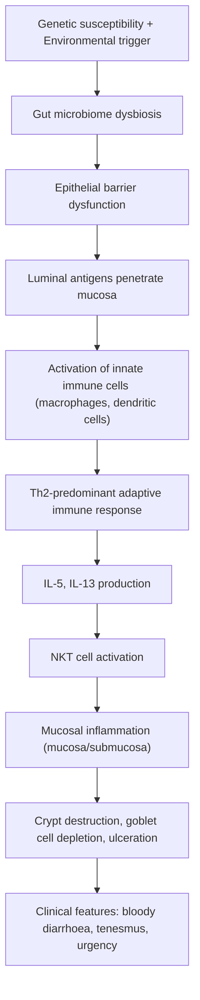

# Inflammatory Bowel Disease — Ulcerative Colitis (UC)

## 1. Definition

***Ulcerative colitis (UC) is a chronic, relapsing inflammatory bowel disease (IBD) characterised by diffuse, continuous mucosal inflammation limited to the colon*** [1][2]. The name itself tells you the disease:

- **"Ulcerative"** → ulcer-forming (Latin *ulcus* = sore/wound)
- **"Colitis"** → inflammation of the colon (Greek *kolon* = large intestine + *-itis* = inflammation)

Key defining features that separate UC from Crohn's disease (CD):

| Feature | UC | CD |
|---|---|---|
| ***Distribution*** | ***Colon & rectum, continuous*** | ***Any part of GI tract, skip lesions*** |
| ***Depth*** | ***Mucosal / submucosal*** | ***Full thickness (transmural)*** |
| ***Fistula*** | ***Never*** | ***Common (intestinal / perianal)*** |
| ***Benign stricture*** | ***Rare*** | ***Common*** |
| ***Perianal disease*** | ***Rare*** | ***Up to 40%*** |
| ***Rectal sparing*** | No (almost always involves rectum) | ***Yes (rectal sparing)*** |

[1][3]

The inflammation ***most commonly begins in the rectum and extends proximally in a continuous fashion*** — there are no "skip lesions" [2]. Occasionally, patients with pancolitis may develop **backwash ileitis** (mild ileal inflammation from reflux of colonic contents through an incompetent ileocaecal valve), but this should not be confused with true small bowel Crohn's disease.

***Indeterminate colitis*** accounts for ***10-15% of patients with IBD*** who ***fail to be classified between UC and CD*** [1][2]. This can be due to inadequate tissue biopsy or a truly indeterminate form of disease. Surgical treatment for these patients is similar to UC [2].

<Callout title="Key Distinction" type="idea">
Think of UC as a "paint roller" — it paints the colon continuously from the rectum upward. Crohn's is a "spray can" — it splatters patches anywhere from mouth to anus, and goes deep through the wall.
</Callout>

---

## 2. Epidemiology

### 2.1 Global Epidemiology

- ***Peak age of onset: between the third and seventh decade*** [1]
  - This is a broad bimodal peak — classically, **the first peak is in the 30s** and a **second smaller peak around the 50s–70s** [2]
  - Compare with CD which peaks in the **third decade**
- ***Gender: F = M (no gender predominance)*** [1][2]
  - In contrast, CD has ***F > M*** globally, but ***M > F in East Asia*** [1]

### 2.2 East vs West Differences (High Yield for HKU)

***Key differences in Asian/Eastern IBD populations compared to Western populations*** [1]:

- ***More male prevalence with CD, ileocolonic CD***
- ***Less family clustering*** (genetic factors play a smaller role relative to environmental factors in Asia)
- ***Lower rates of surgery (5–8%)***
- ***Fewer extraintestinal manifestations***
- ***Less primary sclerosing cholangitis with UC***
- ***Higher rates of penetrating and perianal disease in CD***

### 2.3 Hong Kong–Specific Data

The distribution of UC extent in Hong Kong is roughly equal thirds [2]:
- **Proctosigmoiditis: 34.5%**
- **Distal UC (left-sided): 32%**
- **Pancolitis (extensive): 33.5%**

Prevalence of IBD in Hong Kong has been steadily rising — thought to be related to Westernisation of diet, improved hygiene (the "hygiene hypothesis"), urbanisation, and changes in the gut microbiome.

***CD: urban > rural areas, higher socioeconomic classes*** [1] — this pattern is shared to some extent with UC and supports the hygiene hypothesis (less childhood microbial exposure → aberrant immune development).

<Callout title="Exam Tip">
The roughly equal distribution of disease extent in HK is a commonly tested fact. Know the Montreal classification and HK percentages.
</Callout>

---

## 3. Risk Factors and Protective Factors

### 3.1 Risk Factors

| Category | Risk Factor | Explanation |
|---|---|---|
| **Drug history** | **NSAIDs** | NSAIDs inhibit COX → reduce protective prostaglandins in gut mucosa → impaired mucosal defence → flare of colitis. They also shift arachidonic acid metabolism toward leukotrienes (pro-inflammatory) |
| **Family history** | **IBD in first-degree relative** | Polygenic susceptibility; however ***less family clustering in East Asia*** [1] |
| **Medical history** | **Infectious gastroenteritis in prior 1 year** | Post-infectious dysbiosis may trigger immune dysregulation in genetically susceptible individuals [2] |
| **Disease-specific** | ***Primary sclerosing cholangitis*** | Bidirectional association — PSC is strongly associated with UC. ***Majority of patients with PSC have underlying UC; only ~5% of UC patients have PSC*** [2][4] |
| **Other** | ***Early age of disease onset, male sex*** (for CRC risk) | Earlier onset = longer cumulative inflammatory burden [1] |

### 3.2 Protective Factors

| Category | Protective Factor | Explanation |
|---|---|---|
| **Surgical history** | ***Prior appendicectomy*** | Protective for UC (but is a *risk factor* for CD). The appendix is a lymphoid organ rich in immune cells that may prime mucosal immune responses; removing it may reduce the likelihood of the aberrant Th2-driven immune response seen in UC |
| **Social history** | ***Smoking*** | **Protective for UC** but a *risk factor* for CD [2]. Nicotine increases colonic mucus production, decreases pro-inflammatory cytokines (IL-1, IL-8), and improves mucosal blood flow — these protect the colonic mucosa. Patients who quit smoking are at increased risk of developing UC or experiencing flares |

<Callout title="Classic Exam Pitfall" type="error">
Students often confuse which IBD is associated with smoking. Remember:
- **Smoking PROTECTS against UC** (think: nicotine patches were once trialled as UC therapy)
- **Smoking WORSENS CD** (doubles the risk of flare and surgery)
- **Appendicectomy PROTECTS against UC** but is a **risk factor for CD**

These are reversed between the two diseases.
</Callout>

---

## 4. Anatomy and Function (Relevant to UC)

### 4.1 The Colon

The colon extends from the caecum (ileocaecal valve) to the rectum, approximately 1.5 m in length. Anatomically divided into:

- **Caecum and appendix** → ascending colon → **hepatic flexure** → transverse colon → ***splenic flexure*** → descending colon → sigmoid colon → **rectum**

Key functions:
- **Water and electrolyte absorption** (Na⁺, Cl⁻, short-chain fatty acids)
- **Storage of faecal material** (the reservoir function)
- **Fermentation by commensal bacteria** (microbiome)

### 4.2 Colonic Wall Layers (Why Depth of Inflammation Matters)

From inside out:
1. **Mucosa** (epithelium + lamina propria + muscularis mucosae) — ***UC is confined here + submucosa***
2. **Submucosa** (Meissner's plexus; blood vessels, lymphatics)
3. **Muscularis propria** (inner circular, outer longitudinal; Auerbach's/myenteric plexus between)
4. **Serosa/adventitia**

Because UC is limited to the mucosa and submucosa, it:
- **Does NOT produce fistulae** (fistulae require transmural inflammation to create a tract through the full wall)
- **Does NOT produce deep strictures** (rare — strictures in UC should raise concern for malignancy)
- **Does NOT produce deep ulcers** — ulcers are **shallow** (compare with CD: deep, "knife-cut" or "cobblestone" ulcers)
- **DOES produce pseudopolyps** — regenerating islands of mucosa surrounded by denuded/ulcerated mucosa give the appearance of polyps

### 4.3 The Rectum

The rectum is essentially always involved in UC (the "starting point" of the disease). This explains why:
- **PR bleeding (haematochezia)** is the hallmark symptom — the inflamed rectal mucosa is friable and bleeds easily, and blood is seen on the surface of stool
- **Tenesmus** (a painful, urgent desire to defecate with a sense of incomplete evacuation) — from rectal inflammation irritating stretch receptors
- **Urgency and incontinence** — inflamed rectum loses compliance (it becomes stiff and cannot stretch), so even small volumes of stool trigger the defecation reflex

### 4.4 Splenic Flexure (Clinical Relevance)

The splenic flexure is the key anatomical landmark for classifying UC extent (Montreal classification). It represents a "watershed" area of blood supply (between the SMA and IMA territories), making it vulnerable to ischaemia and a natural boundary for disease classification.

---

## 5. Etiology and Pathophysiology

UC is an **immune-mediated disease** arising from a complex interplay of:

1. **Genetic susceptibility**
2. **Environmental triggers**
3. **Gut microbiome dysbiosis**
4. **Dysregulated mucosal immune response**

### 5.1 Genetic Susceptibility

- Over 200 IBD susceptibility loci identified via GWAS
- **HLA-DR2** is associated with UC (vs. HLA-DR1/DQ5 in CD)
- Key genes include those involved in epithelial barrier function (e.g., *HNF4A*, *CDH1*) and immune regulation
- However, ***family clustering is less prominent in East Asia*** [1], suggesting environmental factors play a proportionally larger role in Hong Kong
- Concordance rate in monozygotic twins: ~16% for UC (vs. ~50% for CD) — confirming that environment matters more in UC

### 5.2 Environmental Triggers

| Factor | Role |
|---|---|
| **Westernised diet** (high fat, high sugar, low fibre) | Alters gut microbiome composition; reduces short-chain fatty acid (SCFA) production (butyrate is the primary fuel for colonocytes) |
| **Urbanisation/improved hygiene** | Hygiene hypothesis: less childhood microbial exposure → inadequate training of immune tolerance → aberrant immune response to commensal bacteria |
| **Antibiotics in early life** | Disrupt developing microbiome |
| **NSAIDs** | Directly damage mucosal barrier; divert arachidonic acid to leukotriene pathway |
| **Stress** | Activates the hypothalamic-pituitary-adrenal axis → increases gut permeability and inflammatory cytokines |
| **Prior GI infection** | Post-infectious dysbiosis → immune priming → loss of tolerance to commensals [2] |

### 5.3 Gut Microbiome Dysbiosis

- UC patients have **reduced microbial diversity** — especially a loss of *Firmicutes* (which produce butyrate, the main energy source for colonocytes)
- **Increase in potentially pathogenic bacteria** (e.g., *E. coli*, *Fusobacterium*)
- The loss of butyrate-producing bacteria means colonocytes are "starved" → epithelial barrier breakdown → increased permeability → bacterial translocation → inflammation

### 5.4 Dysregulated Mucosal Immune Response

Here is the core pathophysiology, step by step:

Key immunological points:
- UC is characterised by an **atypical Th2 response** (unlike CD which is Th1/Th17-driven)
- **IL-13** is a key cytokine in UC → directly damages epithelial cells and impairs barrier function
- **NKT (Natural Killer T) cells** are prominent in UC colonic mucosa
- The inflammatory infiltrate (neutrophils, lymphocytes, plasma cells) is concentrated in the **mucosa and submucosa** — this is why inflammation doesn't extend transmurally
- **Neutrophil infiltration into crypts** → **cryptitis and crypt abscesses** (a hallmark histological feature shared with CD) [2]
- Chronic inflammation → **crypt architectural distortion** (branching, shortening, irregularity of crypts) — this is a hallmark of chronicity
- **Goblet cell depletion** — mucin-producing goblet cells are destroyed by the inflammatory process → loss of the protective mucus layer → further barrier compromise. (Note: In CD, goblet cells are *preserved*) [2]

### 5.5 Why UC Starts in the Rectum and Spreads Proximally

The rectum has the highest bacterial concentration in the colon and the thinnest mucus layer. In a genetically susceptible individual, this makes it the most vulnerable site for the initial breach of immune tolerance. The disease then spreads in a retrograde, continuous fashion because the immune response propagates along the contiguous mucosal surface.

---

## 6. Classification

### 6.1 Montreal Classification of UC Extent

***The Montreal classification is the standard phenotypic classification for UC*** [2]:

| Code | Classification | Description | HK Prevalence |
|---|---|---|---|
| ***E1*** | ***Proctitis*** | ***Involvement limited to the rectum*** (distal to the rectosigmoid junction, ~15 cm) | Part of proctosigmoiditis group |
| ***E2*** | ***Left-sided UC (distal UC)*** | ***Involvement extending up to the splenic flexure*** | ~32% in HK |
| ***E3*** | ***Extensive UC (pancolitis)*** | ***Involvement extending proximal to the splenic flexure*** | ~33.5% in HK |

[2]

From Felix's notes, the HK distribution uses a slightly different subdivision [2]:
- **Proctitis** = rectum only
- **Proctosigmoiditis** (34.5%) = rectum + sigmoid
- **Distal UC** (32%) = rectum + sigmoid + colon up to splenic flexure (= Montreal E2)
- **Pancolitis** (33.5%) = beyond splenic flexure (= Montreal E3)
- **Backwash ileitis** = ileal involvement (in the setting of pancolitis)

### 6.2 Disease Severity — Modified Truelove and Witts' Criteria

This is the classic bedside severity assessment for UC — ***used in clinical practice to determine need for admission and treatment intensity*** [2]:

| Parameter | **Mild** | **Moderate** | **Severe** |
|---|---|---|---|
| ***Bloody stools per day*** | ***< 4*** | ***≥ 4*** | ***≥ 6*** |
| ***Pulse*** | ***< 90 bpm*** | ***≤ 90 bpm*** | ***> 90 bpm*** |
| ***Temperature*** | ***< 37.5°C*** | ***≤ 37.8°C*** | ***> 37.8°C*** |
| ***Haemoglobin*** | ***> 11.5 g/dL*** | ***≥ 10.5 g/dL*** | ***< 10.5 g/dL*** |
| ***ESR*** | ***< 20 mm/h*** | ***< 30 mm/h*** | ***> 30 mm/h*** |
| ***CRP*** | ***Normal*** | ***≤ 30 mg/L*** | ***> 30 mg/L*** |

***Interpretation: Immediate admission is warranted in severe disease*** [2].

<Callout title="How to Remember Truelove and Witts' Severe Criteria">
**"6-90-37.8-10.5-30-30"**:
- ≥ 6 bloody stools/day
- Pulse > 90 bpm
- Temp > 37.8°C
- Hb < 10.5 g/dL
- ESR > 30 mm/h
- CRP > 30 mg/L

If ANY one systemic criterion (pulse, temp, Hb, ESR, CRP) is met along with ≥ 6 bloody stools/day → **severe UC → admit immediately**.
</Callout>

### 6.3 Comparison Between Crohn's Disease and Ulcerative Colitis

This is an extremely high-yield comparison table for exams:

#### Clinical Features

| Feature | ***Crohn's Disease*** | ***Ulcerative Colitis*** |
|---|---|---|
| ***Haematochezia*** | ***Rare*** | ***Common*** |
| ***Passage of mucus or pus*** | ***Rare*** | ***Common*** |
| ***Abdominal mass*** | ***Sometimes*** | ***Rare*** |
| ***Upper GIT involvement*** | ***✓*** | ***✗*** |
| ***Small bowel involvement*** | ***✓*** | ***✗*** |
| ***Large bowel involvement*** | ***✓*** | ***✓*** |
| ***Rectal involvement*** | ***✓ (usually spared)*** | ***✓ (almost always involved)*** |
| ***Perianal involvement*** | ***✓*** | ***✗*** |
| ***Small bowel obstruction*** | ***Common*** | ***Rare*** |
| ***Large bowel obstruction*** | ***Common*** | ***Rare*** |

#### Biochemical Features

| Feature | ***CD*** | ***UC*** |
|---|---|---|
| ***ASCA (Anti-Saccharomyces cerevisiae antibodies)*** | ***Common*** | ***Rare*** |
| ***pANCA (perinuclear anti-neutrophil cytoplasmic antibodies)*** | ***Rare*** | ***Common*** |

#### Histological Features

| Feature | ***CD*** | ***UC*** |
|---|---|---|
| ***Pattern of involvement*** | ***Focal, patchy*** | ***Diffuse, continuous*** |
| ***Depth of inflammation*** | ***Transmural*** | ***Mucosal and submucosal*** |
| ***Granulomas*** | ***✓ (MUST exclude TB)*** | ***✗*** |
| ***Goblet cells*** | ***Preserved (✓)*** | ***Depleted (✗)*** |
| ***Distorted crypt architecture*** | ***✓*** | ***✓*** |
| ***Cryptitis and crypt abscess*** | ***✓*** | ***✓*** |

[2]

#### Endoscopic Features

| Feature | ***CD*** | ***UC*** |
|---|---|---|
| ***Skip lesions*** | ***✓*** | ***✗*** |
| ***Ulcers*** | ***Solitary, deep, and focal*** | ***Shallow*** |
| ***Fistula formation*** | ***✓*** | ***✗*** |
| ***Abscess formation*** | ***✓*** | ***✗*** |
| ***Stricture*** | ***✓*** | ***✗ (rare; if present → suspect malignancy)*** |
| ***Pseudopolyps*** | ***✗*** | ***✓*** |

[2]

<Callout title="Why No Fistulae in UC?" type="idea">
Fistulae are abnormal tracts connecting two epithelial surfaces. They require **transmural** inflammation to burrow through the entire bowel wall. Since UC is limited to the mucosa and submucosa, the inflammation never reaches deep enough to create fistulae. This is a fundamental architectural difference from CD.
</Callout>

<Callout title="Pseudopolyps — What Are They?">
Pseudopolyps (inflammatory polyps) are **islands of regenerating mucosa** surrounded by areas of mucosal ulceration and denudation. They are NOT true neoplastic polyps, but they indicate severe previous inflammation. They are characteristic of UC because the widespread, continuous shallow ulceration creates this "island" pattern. ***Pseudopolyps are a risk factor for IBD-associated CRC*** [1].
</Callout>

---

## 7. Clinical Features

### 7.1 Symptoms (with Pathophysiological Basis)

***Clinical features are related to inflammatory damage in the GIT*** [1]:

#### A. Gastrointestinal Symptoms

| Symptom | Description | Pathophysiological Basis |
|---|---|---|
| ***Bloody diarrhoea (haematochezia)*** | **The central feature of UC** [2]. Passage of blood and/or mucus mixed with stool. | Inflamed, friable, ulcerated rectal and colonic mucosa bleeds easily. The mucosal surface is denuded and superficial vessels are exposed. Mucus production increases as a failed attempt at mucosal protection but also reflects goblet cell dysfunction. |
| ***Diarrhoea*** | **Prolonged, fluctuating** course. Stools are **frequent, small-volume** [2]. | 1) **Excessive fluid secretion** — inflammatory mediators (prostaglandins, histamine) stimulate Cl⁻ secretion from crypt cells → water follows osmotically. 2) **Impaired fluid reabsorption** — damaged colonic mucosa cannot absorb water and electrolytes normally. 3) The inflamed, non-compliant rectum loses its reservoir function → cannot store stool → frequent small-volume stools. |
| ***Tenesmus*** | Painful straining with a sensation of incomplete evacuation | Inflammation of the rectal wall irritates stretch receptors and pelvic floor nerves, creating a constant sensation of "needing to go" even when the rectum is empty. |
| ***Urgency and incontinence*** | Sudden, irresistible need to defecate; may result in faecal incontinence | The inflamed rectum loses compliance (becomes stiff and fibrotic) → reduced distensibility → even small volumes of stool trigger the defecation reflex. The internal anal sphincter may also be affected by inflammation. |
| ***Constipation*** | ***UC limited to the rectum (proctitis) may paradoxically present with constipation*** [1] | When only the rectum is inflamed, the proximal colon compensates by increased water absorption, leading to hard, infrequent stools proximal to the inflammation. The rectum itself produces mucus and blood but may not have enough volume to trigger normal defecation. This is a classic exam pitfall! |
| ***Abdominal cramps and pain*** | ***Colicky abdominal pain*** [1][2], typically in the left lower quadrant (where the sigmoid/descending colon lies) | Spasm of the inflamed colonic smooth muscle. Prostaglandins and leukotrienes released by inflammatory cells directly stimulate smooth muscle contraction and activate visceral pain afferents. |
| ***Rectal bleeding with bowel movement*** | ***Pain or rectal bleeding with bowel movement*** [1] | Direct mucosal ulceration and friability; passage of stool mechanically disrupts the fragile, inflamed mucosa |

<Callout title="Constipation in Proctitis" type="error">
A common mistake is to think UC always presents with diarrhoea. ***In proctitis (E1), the patient may present with constipation*** because only the rectum is inflamed. The proximal colon overcompensates by absorbing more water. The patient may pass formed stools but with blood and mucus. Don't be fooled on the exam!
</Callout>

#### B. Constitutional Symptoms

| Symptom | Pathophysiological Basis |
|---|---|
| **Fever** | Pro-inflammatory cytokines (IL-1, IL-6, TNF-α) act on the hypothalamic thermoregulatory centre to raise the set point. Also consider secondary causes: perforation with peritonitis or superimposed C. difficile infection [2] |
| **Fatigue** | Multifactorial: anaemia of chronic disease (hepcidin-mediated iron sequestration), iron deficiency anaemia (chronic blood loss), malnutrition, cytokine-driven sickness behaviour (TNF-α, IL-6 directly cause fatigue via CNS effects), and sleep disturbance from nocturnal symptoms |
| **Anorexia** | Circulating inflammatory cytokines (TNF-α → also called "cachectin") suppress appetite centres in the hypothalamus |
| **Weight loss** | ***Result of malabsorption, decreased oral intake*** [2]. In UC specifically: reduced food intake (patients avoid eating to avoid triggering symptoms), increased metabolic demand from chronic inflammation, and protein-losing enteropathy through the denuded mucosa |

#### C. Anaemic Symptoms

| Symptom | Pathophysiological Basis |
|---|---|
| **Pallor, dyspnoea, palpitations, fatigue** [2] | Chronic blood loss from the ulcerated colonic mucosa leads to **iron deficiency anaemia**. Additionally, **anaemia of chronic disease** (ACD) occurs because IL-6 stimulates hepatic hepcidin production → hepcidin blocks ferroportin → iron is trapped in macrophages and enterocytes → functional iron deficiency even if stores are adequate. Reduced oxygen-carrying capacity → compensatory tachycardia (palpitations) and increased respiratory rate (dyspnoea) |

### 7.2 Signs (with Pathophysiological Basis)

#### A. General Examination

| Sign | Pathophysiological Basis |
|---|---|
| **Pallor** | Anaemia from chronic blood loss + ACD (see above) |
| **Tachycardia** | Compensatory response to anaemia and/or dehydration; if > 90 bpm → suggests severe disease (Truelove and Witts) |
| **Fever** | Systemic inflammatory response; > 37.8°C = severe disease |
| **Dehydration** (dry mucous membranes, reduced skin turgor, sunken eyes) | Chronic diarrhoea → fluid and electrolyte losses |
| **Cachexia / weight loss** | Chronic inflammation, malnutrition, protein-losing enteropathy |
| **Clubbing** | Rare in UC (more common in CD). Mechanism poorly understood; may relate to chronic hypoxia, circulating vasodilators (VEGF, PDGF), or inflammatory mediators causing connective tissue proliferation in nail beds |

#### B. Abdominal Examination

| Sign | Pathophysiological Basis |
|---|---|
| **Left lower quadrant tenderness** | The sigmoid and descending colon (most commonly affected in left-sided UC) are tender due to active mucosal and submucosal inflammation |
| **Diffuse abdominal tenderness** | In extensive colitis/pancolitis |
| **Abdominal distension** | If toxic megacolon develops (non-obstructive dilatation due to inflammation extending into the muscularis propria → loss of smooth muscle tone → colonic atony) |
| **Absence of palpable mass** | Unlike CD, UC rarely produces a palpable mass because there is no transmural inflammation, no mesenteric thickening, and no fistula/abscess formation |
| **Rebound tenderness / guarding** | Suggests perforation with peritonitis — a surgical emergency |

#### C. Digital Rectal Examination

| Finding | Significance |
|---|---|
| **Blood / mucus on the glove** | Confirms rectal bleeding; the rectal mucosa is friable |
| **Tenderness** | Active proctitis |
| **No perianal disease** (fissures, fistulae, skin tags) | Perianal disease is characteristic of CD, NOT UC. If perianal disease is found in a patient labelled as "UC," reconsider the diagnosis |

### 7.3 Extraintestinal Manifestations (EIMs)

***Extraintestinal manifestations*** are present in up to 25–40% of IBD patients globally, though ***fewer EIMs are seen in East Asian populations*** [1]. They can be divided into those that correlate with disease activity and those that are independent.

***Key EIMs from lecture slides*** [1]:
- ***Musculoskeletal: peripheral or axial arthropathy***
- ***Cutaneous: erythema nodosum, pyoderma gangrenosum***
- ***Ocular: scleritis, uveitis***
- ***Primary sclerosing cholangitis (PSC)***

#### A. EIMs that Correlate with Disease Activity

These flare when the colitis flares and improve when the colitis is treated:

| System | Manifestation | Pathophysiology |
|---|---|---|
| **Musculoskeletal** | ***Peripheral arthropathy*** (type 1: large joint, pauciarticular, asymmetric) | Circulating immune complexes and cross-reactive antibodies (molecular mimicry between gut bacterial antigens and joint synovial antigens) deposit in joints → synovitis |
| **Dermatological** | ***Erythema nodosum*** (tender, red nodules on anterior shins) | Immune complex–mediated panniculitis (inflammation of subcutaneous fat). The anterior shin is affected because it is a watershed area with poor blood supply → immune complexes deposit here |
| **Ocular** | ***Episcleritis*** (painless, red eye without vision loss) | Immune complex deposition in the episcleral vessels |

#### B. EIMs that are Independent of Disease Activity

These may occur even when colitis is in remission:

| System | Manifestation | Pathophysiology |
|---|---|---|
| **Musculoskeletal** | ***Axial arthropathy*** (ankylosing spondylitis, sacroiliitis) — associated with HLA-B27 | Molecular mimicry; shared antigens between gut bacteria and spinal entheses. The HLA-B27 molecule may present cross-reactive peptides to cytotoxic T cells |
| **Musculoskeletal** | **Osteoporosis / osteomalacia** | Chronic corticosteroid use, chronic inflammation (cytokines increase osteoclast activity via RANKL), malabsorption of calcium and vitamin D |
| **Dermatological** | ***Pyoderma gangrenosum*** (deep, painful, violaceous ulcers with undermined edges, typically on lower limbs) — ***more common in UC than CD*** [2] | Neutrophilic dermatosis; aberrant neutrophil chemotaxis and function. The pathergy phenomenon (worsening at sites of trauma) is characteristic |
| **Ocular** | ***Uveitis*** (painful, red eye with photophobia and blurred vision) / ***Scleritis*** / ***Iritis*** | T cell–mediated inflammation of the uveal tract; may share antigens with colonic epithelium |
| **Hepatobiliary** | ***Primary sclerosing cholangitis (PSC)*** | Chronic progressive inflammation and fibrosis of intrahepatic and extrahepatic bile ducts. Mechanism: aberrant homing of gut-primed T lymphocytes to the liver via the portal circulation (gut-liver axis). These T cells recognise cross-reactive antigens on biliary epithelium. ***Strong association with UC — majority of PSC patients have UC, but only ~5% of UC patients develop PSC*** [2][4] |
| **Hepatobiliary** | **Fatty liver / autoimmune liver disease** | Chronic inflammation, malnutrition, drug effects (corticosteroids, methotrexate) |
| ***Vascular*** | ***Arterial and venous thromboembolism*** (DVT, PE, portal/mesenteric vein thrombosis) | IBD is a prothrombotic state: inflammatory cytokines increase tissue factor expression, increase fibrinogen, decrease protein C/S, increase platelet activation, and promote endothelial dysfunction. Risk is 2–3× that of the general population |
| **Urogenital** | **Renal stones** (calcium oxalate) | Fat malabsorption → free fatty acids bind calcium → calcium is unavailable to bind oxalate in the gut → increased free oxalate is absorbed and excreted by the kidney → oxalate stones. (More common in CD with ileal disease, but can occur in extensive UC) |
| **Haematological** | **Autoimmune haemolytic anaemia** | Autoantibodies against RBC antigens; part of the generalised immune dysregulation |
| **Endocrine** | **Vitamin B12 deficiency** | Relevant mainly in CD with terminal ileal disease/resection. In UC, can occur with backwash ileitis or from secondary bacterial overgrowth |
| ***GI*** | ***Colorectal cancer*** | Chronic inflammation → oxidative DNA damage → dysplasia → carcinoma sequence. Risk factors include: disease duration, extent of colitis, severity of inflammation, PSC, pseudopolyps, strictures, family history of CRC [1] |

<Callout title="CRC Risk Factors in IBD" type="error">

***Risk factors for IBD-associated colorectal neoplasia*** (from lecture slides [1]):

**Patient-Specific Factors:**
- ***Primary sclerosing cholangitis***
- ***History of colorectal neoplasia***
- ***Family history of CRC in first-degree relative***
- ***Smoking (+)***
- ***Early age of disease onset (+)***
- ***Male sex (+)***

**Disease-Specific Factors:**
- ***Disease duration***
- ***Disease extent***
- ***Cumulative inflammatory burden***
- ***Active inflammation endoscopically or histologically***

**Endoscopic Features:**
- ***Stricture (UC, longer disease duration, proximal location, symptoms)***
- ***Shortened tubular colon***
- ***Pseudopolyps***

</Callout>

### 7.4 Distinguishing UC Presentation from CD at the Bedside

| Feature | UC | CD |
|---|---|---|
| Diarrhoea | Bloody, frequent, small-volume | May or may not be bloody; larger-volume if small bowel involved |
| Abdominal pain | LLQ, colicky, relieved by defecation | RLQ (ileal), may be obstructive |
| Rectal bleeding | Almost always present | Variable |
| Perianal disease | Absent | Common (fissures, fistulae, abscesses, skin tags) |
| Abdominal mass | Rare | RLQ mass (inflamed ileum/mesentery) |
| Mouth ulcers | Uncommon | Common (aphthous ulcers) |
| Malnutrition | Less common (colon mainly) | More common (small bowel malabsorption) |

---

## 8. Summary of Key Pathophysiological Connections

| Clinical Feature | Pathophysiology |
|---|---|
| Bloody diarrhoea | Friable, ulcerated mucosa + impaired water absorption + increased secretion |
| Tenesmus | Rectal inflammation irritating stretch receptors |
| Urgency | Reduced rectal compliance from fibrosis/inflammation |
| Constipation (proctitis) | Proximal colonic compensation + impaired rectal function |
| Pseudopolyps | Mucosal regeneration islands between areas of shallow ulceration |
| No fistulae | Inflammation confined to mucosa/submucosa (not transmural) |
| No granulomas | Th2-driven atypical immune response (not the Th1 granulomatous response of CD) |
| pANCA positivity | Autoantibodies against neutrophil myeloperoxidase — reflects the autoimmune component |
| PSC association | Aberrant gut-primed lymphocyte homing to biliary epithelium |
| Thromboembolism | Prothrombotic state from systemic inflammation |
| Pyoderma gangrenosum | Neutrophilic dermatosis; aberrant neutrophil function |
| CRC risk | Chronic inflammation → oxidative DNA damage → dysplasia-carcinoma sequence |

---

<Callout title="High Yield Summary">

**Definition:** UC = chronic, relapsing IBD with diffuse, continuous mucosal/submucosal inflammation limited to the colon, almost always starting from the rectum and extending proximally.

**Epidemiology:** Peak age 30s–70s; M = F; rising incidence in Hong Kong (Westernisation); roughly equal thirds of proctosigmoiditis/distal UC/pancolitis in HK.

**Risk Factors:** NSAIDs, family history of IBD, prior GI infection. **Protective:** Smoking, appendicectomy (opposite to CD!).

**Pathophysiology:** Genetic susceptibility + environmental triggers → microbiome dysbiosis → epithelial barrier breach → atypical Th2 immune response → mucosal/submucosal inflammation → crypt abscesses, goblet cell depletion, shallow ulceration.

**Classification:** Montreal E1/E2/E3. Severity by Modified Truelove & Witts (severe = ≥ 6 bloody stools/day + any systemic feature).

**Cardinal symptom:** Bloody diarrhoea (+ mucus, tenesmus, urgency). Proctitis may present with constipation.

**Key differences from CD:** No skip lesions, no transmural disease, no fistulae, no granulomas, no perianal disease, shallow ulcers, pseudopolyps. pANCA+ (not ASCA+).

**EIMs:** Peripheral arthropathy, erythema nodosum, episcleritis (correlate with activity). PSC, ankylosing spondylitis, pyoderma gangrenosum, uveitis (independent of activity).

**CRC risk:** Increased with longer duration, greater extent, PSC, active inflammation, pseudopolyps, strictures, family history.

</Callout>

---

<ActiveRecallQuiz
  title="Active Recall - Ulcerative Colitis (Definition, Epidemiology, Etiology, Classification, Clinical Features)"
  items={[
    {
      question: "A 28-year-old male with UC limited to the rectum (E1 proctitis) presents complaining of constipation rather than diarrhoea. Explain why this occurs.",
      markscheme: "In proctitis, only the rectum is inflamed. The proximal colon compensates by increasing water absorption, producing hard formed stools. The inflamed rectum produces blood and mucus but the lack of extensive colonic involvement means the secretory diarrhoea mechanism is not dominant. The impaired rectal compliance may also disrupt normal defecation coordination."
    },
    {
      question: "List 4 features that distinguish UC from CD on endoscopy and explain the pathophysiological basis for each.",
      markscheme: "1) Continuous inflammation (vs skip lesions in CD) — UC spreads contiguously from rectum due to mucosal-limited process. 2) Shallow ulcers (vs deep in CD) — inflammation confined to mucosa/submucosa. 3) Pseudopolyps present (regenerating mucosal islands between areas of shallow ulceration). 4) No fistulae (inflammation does not reach serosa since it is not transmural). Also accept: no granulomas (Th2 response vs Th1 granulomatous in CD), goblet cell depletion (inflammatory destruction of mucin-producing cells)."
    },
    {
      question: "State the Modified Truelove and Witts criteria for SEVERE ulcerative colitis (all 6 parameters).",
      markscheme: "Severe UC: 1) >= 6 bloody stools per day, 2) Pulse > 90 bpm, 3) Temperature > 37.8C, 4) Haemoglobin < 10.5 g/dL, 5) ESR > 30 mm/h, 6) CRP > 30 mg/L. Immediate admission warranted."
    },
    {
      question: "Explain why smoking is protective in UC but harmful in CD.",
      markscheme: "Nicotine increases colonic mucus production (protects the mucosal barrier which is key in UC), decreases pro-inflammatory cytokines (IL-1, IL-8), and improves mucosal blood flow. In CD, smoking worsens disease because it impairs the innate immune response needed to clear transmural infection/inflammation, promotes granuloma formation, and increases intestinal permeability. The opposite effects on mucosal vs transmural disease explain the divergent impact."
    },
    {
      question: "Name 4 extraintestinal manifestations of UC and classify each as correlating with disease activity or independent of it.",
      markscheme: "Correlate with activity: 1) Peripheral arthropathy (type 1, large joint), 2) Erythema nodosum, 3) Episcleritis. Independent of activity: 4) Primary sclerosing cholangitis, 5) Pyoderma gangrenosum, 6) Ankylosing spondylitis, 7) Uveitis. (Any 4 with correct classification gets full marks.)"
    },
    {
      question: "List 5 risk factors for IBD-associated colorectal neoplasia as per the lecture slides, covering patient-specific, disease-specific, and endoscopic categories.",
      markscheme: "Patient-specific: PSC, history of colorectal neoplasia, family history of CRC in first-degree relative, early age of onset, male sex. Disease-specific: disease duration, disease extent, cumulative inflammatory burden, active inflammation. Endoscopic: stricture, shortened tubular colon, pseudopolyps. (Any 5 from these categories.)"
    }
  ]}
/>

---

## References

[1] Lecture slides: Inflammatory bowel disease.pdf (pp. 2, 4, 5, 6, 9, 52)
[2] Senior notes: felixlai.md (Inflammatory bowel disease — Ulcerative colitis sections)
[3] Lecture slides: GC 186. Lower and diffuse abdominal painfresh blood in stool.pdf
[4] Senior notes: felixlai.md (Primary sclerosing cholangitis section)
