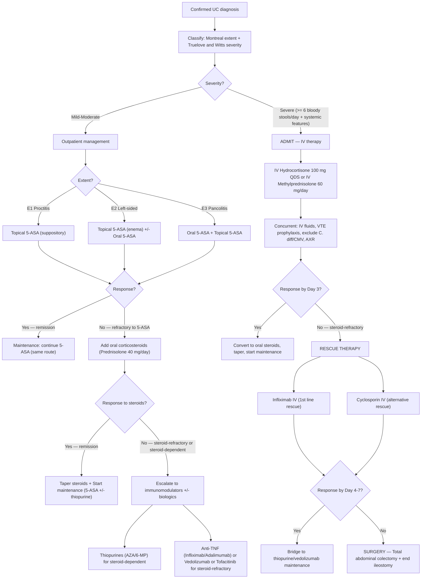

## Management of Ulcerative Colitis

### 11.1 Principles of Management

The management of UC follows a logical, step-wise framework built on two core goals [2]:

1. **Induction of remission** — control the acute flare
2. **Maintenance of remission** — prevent relapse long-term

***Principles of management: to induce and maintain remission taking into account disease activity, disease site, disease behaviour, and patient preference*** [2].

The treatment strategy is determined by two axes:
- **Disease extent** (Montreal E1 / E2 / E3) — determines route of drug delivery (topical vs. oral vs. systemic)
- **Disease severity** (Truelove & Witts: mild / moderate / severe) — determines intensity of therapy (5-ASA → steroids → rescue → surgery)

***Key treatment principles from notes*** [2]:
- ***Start with topical treatment if mild left-sided disease***
- ***Start with oral treatment if extensive disease***
- ***Combination therapy (topical + oral) is more effective in inducing remission***
- ***Consider rescue therapy in steroid-refractory disease (Day 3)***
- ***Consider surgical treatment if no improvement within Day 4–7 of rescue therapy***

---

### 11.2 Management Algorithm — Overview

[2][11]

---

### 11.3 Medical Treatment — Drug-by-Drug Breakdown

#### A. 5-Aminosalicylates (5-ASA)

The **cornerstone** of UC therapy — the first drug you reach for in mild-to-moderate disease [2].

**Name breakdown:** "5-amino" = the active amine group; "salicylate" = derived from salicylic acid (related to aspirin). These are anti-inflammatory agents that act locally on the colonic mucosa.

***Initial therapy in patients with mild to moderate UC who do not have systemic symptoms based on its relative safety to other drugs*** [2].

***Topical 5-ASA is the first-line treatment in mild to moderate UC in those who are willing to use rectal therapy including suppositories or enemas*** [2].

| Property | Detail |
|---|---|
| **Mechanism of action** | ***Anti-inflammatory effect*** [2] — 5-ASA inhibits the NF-κB pathway, scavenges reactive oxygen species, inhibits lipoxygenase and cyclooxygenase locally, and reduces neutrophil chemotaxis. It acts **topically** on the mucosa — this is why rectal formulations work so well in distal disease |
| ***Clinical role*** | ***Induction agent AND maintenance agent*** [2] — unlike steroids, 5-ASA is effective for BOTH induction and maintenance |
| ***Route of administration*** | ***Mesalamine: Oral / Enema / Suppository*** [2]; ***Sulfasalazine: Oral*** [2] |
| **Dosage** | Mesalamine: 2–4.8 g/day oral; rectal: 1 g suppository (proctitis) or 4 g enema (left-sided); Sulfasalazine: 3–6 g/day oral |

**Choosing the route by disease extent:**

| Extent | Preferred Route | Why? |
|---|---|---|
| **E1 (Proctitis)** | **Suppository** (e.g., mesalamine 1 g OD–BD) | The suppository reaches and coats the rectal mucosa directly. Oral 5-ASA is released too proximally and does not reach the rectum in adequate concentration |
| **E2 (Left-sided)** | **Enema** (e.g., mesalamine 4 g) ± **oral 5-ASA** | Enema fluid distributes up to the splenic flexure. Combination with oral is more effective than either alone |
| **E3 (Pancolitis)** | **Oral 5-ASA + topical (enema/suppository)** | Oral formulations are designed to release 5-ASA throughout the colon. Adding topical therapy boosts rectal/distal drug levels. ***Combination therapy is more effective in inducing remission*** [2] |

**Key formulations and differences:**

| Drug | Key Feature | Notes |
|---|---|---|
| ***Mesalamine (Pentasa / Asacol)*** | Pure 5-ASA in pH-dependent or time-dependent release coating | ***Nephrotoxicity*** is the key adverse effect [2] (interstitial nephritis — monitor creatinine annually). Pentasa releases 5-ASA throughout the small bowel + colon; Asacol releases in the terminal ileum and colon (pH > 7) |
| ***Sulfasalazine*** | 5-ASA linked to sulfapyridine via an azo bond; colonic bacteria cleave the bond to release 5-ASA | ***Adverse effects: Nausea, headache, fever, agranulocytosis, pancreatitis, SJS*** [2]. ***Associated with "sulfa" allergy and pregnancy complications including kernicterus (crosses placenta) and neural tube defect (inhibits absorption and metabolism of folic acid)*** [2]. Requires folic acid supplementation if used in pregnancy |

<Callout title="Why Sulfasalazine Is Less Preferred Than Mesalamine">
Sulfasalazine requires colonic bacteria to cleave the azo bond and release active 5-ASA. The sulfapyridine carrier molecule is responsible for most of the side effects (nausea, headache, rash, agranulocytosis, male infertility via oligospermia). Mesalamine formulations bypass the need for a sulfapyridine carrier, delivering pure 5-ASA with fewer systemic side effects. However, sulfasalazine is cheaper and may have additional benefit for IBD-related joint disease (the sulfapyridine component has DMARD-like properties).
</Callout>

#### B. Glucocorticoids

The **second-line agents** for induction — used when 5-ASA fails or for moderate-severe disease [2].

**Critical concept:** Steroids are for **induction ONLY** — they are NOT maintenance agents.

***Calcium and vitamin D supplements required for osteoprotective effect if prescribed for more than 12 weeks*** [2].

***Clinical role = Induction agent (Induction of remission). Ineffective in maintenance of remission and NOT used for long-term*** [2].

| Property | Detail |
|---|---|
| **Mechanism of action** | Glucocorticoids suppress the immune system broadly: inhibit NF-κB → reduce pro-inflammatory cytokines (TNF-α, IL-1, IL-6); inhibit phospholipase A₂ → reduce prostaglandin and leukotriene synthesis; reduce neutrophil migration; induce lymphocyte apoptosis. They are potent anti-inflammatory agents but have extensive systemic side effects |
| **Why NOT for maintenance?** | Chronic steroid use causes: osteoporosis, adrenal suppression, diabetes, cataracts, infection risk, Cushingoid features, avascular necrosis. The risk-benefit ratio is unacceptable for long-term use. Also, studies show steroids do NOT prevent relapse once stopped |
| **Dosing** | Prednisolone: 40 mg/day initially, reducing by 5 mg/week. ***Budesonide 9 mg/day*** — has extensive first-pass hepatic metabolism → fewer systemic side effects but also less potent. Budesonide MMX (multi-matrix) formulation specifically designed for colonic release in UC |
| **IV formulation (severe UC)** | ***Hydrocortisone 100 mg IV QDS*** or methylprednisolone 60 mg/day IV [2][11] |

**Steroid-dependent vs. steroid-refractory:**

| Term | Definition | Action |
|---|---|---|
| **Steroid-dependent** | Relapse when steroids are tapered below a certain dose, or relapse within 3 months of stopping | Escalate to thiopurines (AZA/6-MP) as steroid-sparing maintenance |
| **Steroid-refractory** | No response to adequate dose of IV steroids within 3–5 days | Escalate to rescue therapy (infliximab or cyclosporin) or surgery |

#### C. Immunomodulators (Thiopurines)

These are the **steroid-sparing maintenance agents** — the drugs that keep patients in remission and allow steroids to be withdrawn [2].

| Property | Detail |
|---|---|
| **Drugs** | ***Azathioprine (AZA) / 6-Mercaptopurine (6-MP)*** [2] |
| **Mechanism of action** | AZA is a prodrug → converted to 6-MP → metabolised to 6-thioguanine nucleotides (6-TGN), which are purine analogues that incorporate into DNA → inhibit DNA synthesis → suppress rapidly dividing lymphocytes. This is why they are "immunomodulators" — they modulate the adaptive immune response by killing proliferating T and B cells |
| **Clinical role** | Maintenance agent. Steroid-sparing. **Slow onset**: takes 8–12 weeks to reach full effect (because you need to accumulate enough 6-TGN to suppress lymphocyte proliferation). This means steroids must be used as a "bridge" during the lag period |
| **Key pre-treatment test** | **TPMT (thiopurine methyltransferase) genotype/phenotype**: TPMT is an enzyme that inactivates 6-MP. ~10% of people have intermediate TPMT activity and ~0.3% have absent TPMT → these patients accumulate toxic levels of 6-TGN → severe myelosuppression. Must check TPMT before starting |
| **Adverse effects** | Bone marrow suppression (leucopenia, pancytopenia), hepatotoxicity, pancreatitis (idiosyncratic, 3–5%), nausea, increased infection risk, slightly increased lymphoma risk |
| **Monitoring** | Regular FBC (every 1–3 months), LFT, 6-TGN levels (therapeutic drug monitoring) |

***Methotrexate is NOT effective in UC unlike in Crohn's disease*** [2] — this is an important exam point.

<Callout title="Why Does Methotrexate Work in CD But Not UC?" type="idea">
The exact reason is not fully understood, but it likely relates to the different immunological profiles. CD is driven by Th1/Th17 pathways, where methotrexate's folate antagonism and adenosine-mediated anti-inflammatory effects are particularly effective. UC is driven by an atypical Th2/NKT cell pathway that is less responsive to methotrexate's mechanism. Pragmatically: just remember that **methotrexate has no proven efficacy in UC** — don't use it.
</Callout>

#### D. Calcineurin Inhibitors (Rescue Therapy)

***Rescue therapy agents: Cyclosporin and Tacrolimus*** [2].

| Property | Detail |
|---|---|
| **Drugs** | ***Cyclosporin / Tacrolimus*** [2] |
| **Mechanism of action** | Calcineurin inhibitors block the calcineurin-NFAT pathway in T cells: calcineurin is a phosphatase that activates NFAT (nuclear factor of activated T cells) → NFAT enters the nucleus → transcribes IL-2 (the key T cell growth factor). By blocking calcineurin, these drugs prevent IL-2 production → suppress T cell proliferation and activation. This is a **rapid-acting** immunosuppressive mechanism (unlike thiopurines which take weeks) |
| **Clinical role** | ***Rescue therapy*** in acute severe UC that is ***refractory to IV steroids*** [2]. Acts as a "bridge" to thiopurine maintenance (because thiopurines take 8–12 weeks to kick in) |
| **Dosing** | Cyclosporin: 2–4 mg/kg/day IV initially, then convert to oral; target trough level 150–300 ng/mL. Tacrolimus: oral or IV, target trough level 10–15 ng/mL (induction) |
| **Contraindications** | Renal impairment (nephrotoxic), uncontrolled hypertension, hypocholesterolaemia ( < 3.0 mmol/L → increased seizure risk with cyclosporin), active infection |
| **Adverse effects** | Nephrotoxicity, hypertension, tremor, seizures (cyclosporin — especially with low cholesterol/Mg²⁺), gingival hyperplasia, hirsutism (cyclosporin), diabetes (tacrolimus), opportunistic infections |

#### E. Biologic Therapies — Anti-TNFα

The **big guns** — used for moderate-severe UC refractory to conventional therapy [2].

**Name breakdown:** "Anti-TNF" = antibodies against Tumour Necrosis Factor-alpha, a key pro-inflammatory cytokine. "Infliximab" = inf(usion) + -ximab (chimeric monoclonal antibody); "Adalimumab" = ada(ptive) + -mumab (fully human monoclonal antibody).

***Indicated in patients with refractory disease to 5-ASA, immunomodulators, and steroids*** [2].

***MUST screen for TB with CXR / QuantiFERON-TB Gold + HBV infection with HBsAg*** [2]:
- ***Requires TB prophylaxis with isoniazid or rifampicin*** [2]
- ***Requires HBV prophylaxis with entecavir*** [2]

| Property | ***Infliximab (Remicade)*** | ***Adalimumab (Humira)*** |
|---|---|---|
| **Type** | ***Chimeric anti-TNF antibody (mouse/human)*** [2] | ***Humanised anti-TNF antibody*** [2] |
| **Route** | ***IV infusion*** | ***SC injection*** |
| **Induction** | ***IV 5 mg/kg at weeks 0, 2, 6*** [2] | ***SC 160 mg at week 0, 80 mg at week 2*** [2] |
| **Maintenance** | ***IV 5 mg/kg every 8 weeks*** [2] | ***SC 40 mg every 2 weeks*** [2] |
| **Onset** | ***Response quicker and better*** [2] | ***Response slower and less effective*** [2] |
| **Key advantage** | ***1st line biologic*** [2]; faster onset; preferred for acute severe UC as rescue | Can be self-administered at home |

***Do not stop anti-TNFα easily unless there is deep remission of at least 18 months with normal blood and endoscopic parameters*** [2].

***Contraindications*** [2]:
- ***Latent untreated or active TB***
- ***Lymphoma***
- ***Heart failure of NYHA Class III–IV*** (TNF-α has compensatory effects in heart failure; blocking it worsens cardiac function)
- ***Demyelinating disease (Multiple sclerosis)*** (anti-TNF can worsen or trigger CNS demyelination)
- ***Optic neuritis***

***Adverse effects*** [2]:
- ***Reactivation of infection (e.g., TB/HBV)*** — TNF-α is critical for granuloma formation and containment of intracellular pathogens; blocking it allows dormant mycobacteria to reactivate
- ***Lymphoma*** — small absolute increase in risk (especially hepatosplenic T-cell lymphoma when combined with thiopurines in young males)
- ***Non-melanoma skin cancer***
- Infusion reactions (infliximab — chimeric antibody → can trigger anti-drug antibodies)
- Paradoxical psoriasis

<Callout title="Pre-Biologic Screening Checklist" type="error">
Before starting ANY biologic (anti-TNF, vedolizumab, ustekinumab, JAK inhibitor):
1. **TB**: CXR + IGRA/QuantiFERON. If latent TB → isoniazid prophylaxis for ≥ 4 weeks before starting biologic
2. **HBV**: HBsAg + anti-HBc. If positive → entecavir prophylaxis
3. **HCV, HIV**: Screen
4. **Varicella**: Check immunity; vaccinate if non-immune (BEFORE starting, as live vaccines are contraindicated on biologics)
5. **Assess** for active infections, heart failure, demyelinating disease
</Callout>

#### F. Newer Biologics and Small Molecules (Post-2020 Updates)

These are increasingly used in UC and are high-yield for 2025/2026 exams:

| Drug | Class | Mechanism | Role in UC |
|---|---|---|---|
| **Vedolizumab** (Entyvio) | Anti-integrin (α4β7) | Blocks the α4β7 integrin on gut-homing lymphocytes → prevents them from binding to MAdCAM-1 on intestinal endothelium → stops lymphocyte trafficking to the gut. "Gut-selective" immunosuppression — does not suppress systemic immunity | Moderate-severe UC; induction and maintenance. Preferred in patients where infection risk is a concern (gut-selective, not systemic) |
| **Ustekinumab** (Stelara) | Anti-IL-12/23 (p40 subunit) | Blocks the shared p40 subunit of IL-12 and IL-23 → suppresses Th1 (IL-12) and Th17 (IL-23) pathways | Approved for moderate-severe UC; induction (IV) then maintenance (SC) |
| **Tofacitinib** (Xeljanz) | JAK inhibitor (JAK1/3) | Blocks Janus kinase (JAK) signalling → inhibits the JAK-STAT pathway → reduces signalling of multiple cytokines (IL-2, IL-6, IL-12, IL-23, IFN-γ). An oral small molecule (not a biologic antibody) | Moderate-severe UC; oral tablet. Advantages: rapid onset, oral route. Risks: herpes zoster, VTE, cardiovascular events, lipid elevation |
| **Ozanimod** (Zeposia) | S1P receptor modulator | Blocks sphingosine-1-phosphate (S1P) receptors → traps lymphocytes in lymph nodes → prevents their migration to the inflamed colon | Moderate-severe UC; oral tablet. Requires cardiac monitoring at initiation (bradycardia risk) |

#### G. Antibiotics

***Antibiotics have MINIMAL role in treatment of active disease in UC*** [2].

| Property | Detail |
|---|---|
| **Indications** | ***Septic complications of IBD such as fulminant colitis*** [2]; pouchitis post-IPAA |
| **Drugs** | ***Ciprofloxacin / Metronidazole*** [2] |
| **Why minimal role in active UC?** | UC is an immune-mediated disease, not an infectious one. Unlike CD (where antibiotics help via treating microperforation, bacterial overgrowth, and perianal sepsis), the mucosal inflammation of UC is not driven by a specific pathogen |

---

### 11.4 Treatment by Severity — Summary Table

| Severity | Setting | Induction | Maintenance | Escalation |
|---|---|---|---|---|
| **Mild** | Outpatient | Topical 5-ASA (suppository/enema) ± oral 5-ASA | Continue 5-ASA (same route) | If refractory → add oral 5-ASA → oral steroids |
| **Moderate** | Outpatient | Oral 5-ASA + topical 5-ASA; add oral prednisolone (40 mg/day) if inadequate response | 5-ASA ± thiopurine (AZA/6-MP) if steroid-dependent | If steroid-refractory → biologics |
| ***Severe*** | ***Admit*** | ***IV hydrocortisone (100 mg QDS)*** ± VTE prophylaxis, fluid resuscitation, exclude C. diff/CMV | Bridge to thiopurine/biologic maintenance | ***If no response by Day 3 → rescue (infliximab/cyclosporin). If no response by Day 4–7 → surgery*** [2] |

[2][11]

---

### 11.5 Acute Severe UC — The Critical Pathway

***Emergency surgery is needed in 20% of UC patients and 5–10% of Crohn's colitis patients*** [11].

***Criteria (ECCO/ACG guidelines): ≥ 6 bloody stools/day + at least one of: Fever (37.8°C), tachycardia, anaemia ( < 10.5 g/dL), raised CRP*** [11].

**Day-by-day management:**

| Day | Action |
|---|---|
| **Day 0 (Admission)** | Assess severity (Truelove & Witts). Bloods (FBC, CRP, albumin, electrolytes). Stool for C. diff toxin + culture. ***AXR*** (check colonic calibre — exclude toxic megacolon). ***CT abdomen and pelvis*** if perforation suspected [11]. Start **IV hydrocortisone 100 mg QDS**. IV fluids. VTE prophylaxis (LMWH — IBD is a prothrombotic state). Nutritional support. Stop anticholinergics/opioids (increase toxic megacolon risk) |
| **Day 1–2** | Monitor stool frequency, vital signs, bloods daily. Continue IV steroids |
| **Day 3** | ***Assess response.*** ***Risk for colectomy (without 2nd line therapy): 24h stool frequency > 8; or stool frequency 3–8 + CRP > 45 mg/L → colectomy risk = 85%*** [11]. If no response → ***initiate RESCUE THERAPY*** |
| **Day 3–5** | ***Rescue: Infliximab 5 mg/kg IV*** (preferred) ***or Cyclosporin IV*** [2][11]. Also consider flexible sigmoidoscopy to exclude CMV colitis (which mimics steroid-refractory UC; treat with ganciclovir if positive) |
| **Day 5–7+** | If response to rescue → bridge to maintenance (thiopurine + infliximab or vedolizumab). ***If no response to rescue by Day 4–7 → SURGERY*** [2] |

***Predictors of colectomy*** [2]:
- ***BO > 12/day on Day 2 of IV steroid → Colectomy = 55%***
- ***BO > 8/day or BO 3–8/day + CRP > 45 on Day 3 of IV steroid → Colectomy = 85%***
- ***(Stool frequency × 0.14 × CRP) on Day 3 of IV steroid ≥ 8 → Colectomy = 75%***
- ***Colonic dilatation > 5.5 cm → Colectomy = 75%***
- ***Ileus with ≥ 3 small bowel loops of gas → Colectomy = 73%***
- ***High CRP, low albumin and pH, ESR > 75, temp > 38°C on admission → 5–9× risk*** [2]

<Callout title="The Day 3 Decision" type="error">
Day 3 of IV steroids is the critical decision point in acute severe UC. If the patient has not responded (still ≥ 6 bloody stools + systemic features), you MUST escalate to rescue therapy immediately — do NOT continue IV steroids for another week hoping for improvement. Delay in escalation increases perforation risk and mortality. The Travis/Oxford criteria (stool frequency × 0.14 × CRP ≥ 8) is a validated predictor that should trigger urgent surgical consultation.
</Callout>

---

### 11.6 Surgical Treatment

***Surgery is usually not indicated in UC but is potentially curative*** [2]. This is a crucial distinction from CD (where surgery is NOT curative and should be avoided as long as possible).

#### Indications for Surgery

***Emergency indications*** [2][11]:
- ***Fulminant colitis*** (***acute severe colitis failing medical treatment***)
- ***Toxic megacolon > 6 cm*** [11]
- ***Perforation*** [11]
- ***Severe bleeding (unremitting bloody diarrhoea)*** [11]
- ***Failure of toxic dilatation to respond to 48 hours therapy*** [11]
- ***Deterioration despite optimal treatment*** [11]
- ***Patient choice*** [11]

***Elective indications*** [2][11]:
- ***Chronic colitis with severe symptoms*** [11]
- ***Steroid-dependent*** [11]
- ***Recurrent attacks*** [11]
- ***Dysplasia or cancer*** [11]
- ***Malignancy: treatment (biopsy-proven adenocarcinoma) or prophylaxis (dysplasia on surveillance biopsy)*** [8]
- ***Refractory to medical treatment*** [2]
- ***Debilitating extra-intestinal manifestation (thromboembolic complications)*** [2]
- ***Extra-intestinal manifestation (except EIMs independent of colitis activity — sacroiliitis, hepatobiliary complications)*** [8]

#### Surgical Options

| Scenario | Procedure | Rationale |
|---|---|---|
| ***Emergency (acutely ill)*** | ***3-stage: Total abdominal colectomy + end ileostomy*** [2][11] | ***Rectum left in situ*** because it is an extraperitoneal organ and resection takes too long in a critically ill patient [2]. ***Foley catheter used to decompress rectum for 3–4 days*** [2]. ***Rectum left untouched; 2nd stage operation when patient is stable*** [11] |
| Stage 2 (recovery) | ***Completion proctectomy + IPAA*** [2][11] with diverting loop ileostomy | Done after patient recovers and steroids withdrawn (steroids impair anastomotic healing) |
| Stage 3 | ***Reversal of diverting loop ileostomy*** [2] | Final step — restores intestinal continuity |
| ***Elective (stable patient)*** | ***2-stage: Total proctocolectomy + IPAA + diverting loop ileostomy*** [2] | ***IPAA in J-configuration*** [2]. ***Standard of care*** — avoids long-term stoma. Followed by reversal of loop ileostomy later |
| **Poor sphincter function** | ***Total proctocolectomy + permanent end ileostomy*** [8] | If anal sphincter is incompetent, IPAA is futile (patient would be incontinent). Permanent stoma is needed |
| ***Female wanting to maintain fertility*** | ***Total colectomy + ileorectal anastomosis (IRA)*** [8] | ***Avoids pelvic adhesions and thus infertility*** [8]. Disadvantage: diseased rectum remains → risk of rectal disease recurrence → needs ongoing surveillance |

**Why is IPAA the standard of care?**
- The "J-pouch" (ileo-pouch-anal anastomosis) creates a neorectum from the terminal ileum, folded into a J-shape and anastomosed to the anal canal
- Allows the patient to defecate per anum without a permanent stoma
- Mean stool frequency: ~6/day (acceptable for most patients)
- Maintains continence in most patients with intact sphincters

***Complications of IPAA*** [2][8]:
- ***Pouchitis*** — most common complication (~50% lifetime risk); presents with increased stool frequency, urgency, bloody stool, fever. ***Treated with metronidazole and ciprofloxacin*** [2]
- ***Pouch-vaginal / perineal fistula*** [2]
- ***Anastomotic stricture*** [2]
- ***Anastomotic dehiscence with sepsis*** [2]
- ***Sexual dysfunction / infertility*** [2] (pelvic dissection can damage autonomic nerves — hypogastric and pelvic splanchnic nerves)
- ***Pelvic nerve damage: impotence*** [8]
- ***Pouch dysfunction: increased faecal frequency, urgency, incontinence*** [8]

<Callout title="Surgery Is Curative in UC — But Not in CD">
This is a fundamental difference. In UC, all the disease is in the colon and rectum. Removing the entire colon and rectum (total proctocolectomy) removes ALL diseased tissue → cure. In CD, disease can recur anywhere in the GI tract even after resection — so surgery is never curative and should be minimised.
</Callout>

---

### 11.7 CRC Surveillance in UC

***Long-standing UC carries an increased risk of colorectal cancer*** through the inflammation → dysplasia → carcinoma sequence [1][2].

***AGA Guidelines (2010)*** [12]:
- ***Surveillance colonoscopy started at a maximum 8 years after UC or Crohn's colitis*** [12]
- ***Optimal surveillance interval not clearly defined***:
  - ***Left-sided or extensive colitis: within 1–2 years after initial screening colonoscopy*** [12]
  - ***After two negative examinations, every 1–3 years*** [12]
  - ***Individualised (presence of other risk factors)*** [12]
- ***Primary sclerosing cholangitis: yearly*** [12] (PSC dramatically increases CRC risk)
- ***Ulcerative proctitis: NOT considered at increased risk*** [12]
- ***Ideally, surveillance colonoscopy should be performed when disease is in remission*** [12]

***BSG Guidelines (2010)*** [13] — risk-stratified surveillance:

| Risk Category | Surveillance Interval | Criteria |
|---|---|---|
| ***Lower risk*** | ***Every 5 years*** | ***Extensive or left-sided colitis without active inflammation; Crohn's colitis < 50% involvement*** |
| ***Intermediate risk*** | ***Every 3 years*** | ***Extensive or left-sided colitis with mild inflammation; FHx of CRC > 50; pseudopolyps*** |
| ***Higher risk*** | ***Every year*** | ***Extensive or left-sided colitis with moderate-severe inflammation; stricture or dysplasia in past 5 years; FHx of CRC < 50*** |

***Surveillance methods*** [2]:
- ***Chromoendoscopy*** — ***highest yield for dysplasia detection***; involves ***topical application of methylene blue or indigo carmine to enhance mucosal irregularities and facilitate targeted biopsies*** [2]
- ***High-definition white light colonoscopy*** — ***alternative with high diagnostic yield***; ***preferred when chromoendoscopy yield is decreased or mucosa poorly visualised (inadequate prep, active inflammation, pseudopolyps, strictures)*** [2]
- ***Narrow band imaging (NBI)*** — ***does NOT enhance dysplasia detection*** [2]

***Management of dysplasia*** [14]:
- ***Endoscopically visible dysplasia:***
  - ***Polypoid → polypectomy*** [14]
  - ***Non-polypoid → endoscopic resection if complete resection is possible*** [14]
  - ***Surgery should be considered if not endoscopically feasible*** [14]
- ***Endoscopically invisible dysplasia:***
  - ***Associated with high rate of CRC*** [14]
  - ***Referred to an experienced endoscopist*** [14]
  - ***If LGD or no dysplasia → 5% LGD changed to HGD or CRC → surveillance or surgery?*** [14]
  - ***If invisible HGD or multifocal LGD, surgery should be offered*** [14]

---

### 11.8 Summary — Treatment Ladder

| Step | Drug Class | Examples | Role | Key Points |
|---|---|---|---|---|
| **1** | 5-ASA | Mesalamine, sulfasalazine | Induction + maintenance | First-line for mild-moderate; topical preferred for distal disease |
| **2** | Corticosteroids | Prednisolone, budesonide MMX, hydrocortisone IV | Induction ONLY | Not for maintenance; taper once remission achieved |
| **3** | Thiopurines | AZA, 6-MP | Maintenance (steroid-sparing) | Slow onset (8–12 weeks); check TPMT first; methotrexate NOT effective in UC |
| **4** | Biologics | Infliximab, adalimumab, vedolizumab, ustekinumab | Induction + maintenance | Screen for TB/HBV; contraindicated in active TB, NYHA III–IV HF, MS |
| **5** | Small molecules | Tofacitinib, ozanimod | Induction + maintenance | Oral; rapid onset; newer agents |
| **Rescue** | Calcineurin inhibitors / Anti-TNF | Cyclosporin, infliximab | Acute severe UC refractory to IV steroids | Bridge to maintenance; surgery if fails by Day 4–7 |
| **Surgery** | — | Total colectomy / proctocolectomy + IPAA | Curative | Emergency: 3-stage; Elective: 2-stage; complications include pouchitis |

---

<Callout title="High Yield Summary — Management of UC">

**Principles:** Induce and maintain remission; treatment determined by extent (E1/E2/E3) and severity (Truelove & Witts).

**Mild-moderate:** 5-ASA first-line (topical for distal, oral + topical for extensive). Combination > monotherapy. If fails → oral steroids.

**Moderate-severe outpatient:** Oral steroids for induction → thiopurines (AZA/6-MP) for steroid-sparing maintenance. If steroid-refractory/dependent → biologics.

**Acute severe UC (admit):** IV hydrocortisone × 3 days → if no response → rescue therapy (infliximab or cyclosporin) → if no response by Day 4–7 → surgery.

**Key predictors of colectomy:** Stool freq > 8/day; stool freq 3–8 + CRP > 45; Travis index ≥ 8; colonic dilatation > 5.5 cm.

**Biologics:** Must screen TB (CXR + IGRA) + HBV (HBsAg). Contraindicated: active TB, lymphoma, NYHA III–IV HF, MS, optic neuritis.

**Surgery is CURATIVE in UC.** Emergency: 3-stage (colectomy + end ileostomy → completion proctectomy + IPAA → reversal of ileostomy). Elective: 2-stage (proctocolectomy + IPAA + loop ileostomy → reversal). Pouchitis is the most common complication (Rx: metronidazole + ciprofloxacin).

**Methotrexate is NOT effective in UC.** Antibiotics have MINIMAL role except for septic complications and pouchitis.

**CRC surveillance:** Start at 8 years for pancolitis. Chromoendoscopy is best for dysplasia detection. PSC → yearly surveillance. Proctitis → no increased risk.

</Callout>

---

<ActiveRecallQuiz
  title="Active Recall - Management of Ulcerative Colitis"
  items={[
    {
      question: "A patient with acute severe UC has been on IV hydrocortisone for 3 days. Stool frequency is 10/day and CRP is 52 mg/L. What is the colectomy risk and what should you do next?",
      markscheme: "Stool frequency 3-8 + CRP > 45 on Day 3 gives colectomy risk of 85% (even higher with stool freq > 8). Alternatively, Travis index = stool frequency x 0.14 x CRP = 10 x 0.14 x 52 = 72.8, far exceeding threshold of 8. Must initiate rescue therapy immediately: IV infliximab 5 mg/kg (preferred) or IV cyclosporin. Urgent surgical consultation. If no response to rescue by Day 4-7, proceed to emergency total abdominal colectomy with end ileostomy."
    },
    {
      question: "Explain why corticosteroids are used for induction but NOT maintenance in UC, giving at least 3 reasons.",
      markscheme: "1) Studies show steroids do NOT prevent relapse — they do not alter the natural history of the disease once stopped. 2) Chronic steroid use causes unacceptable side effects: osteoporosis, adrenal suppression, diabetes, cataracts, Cushingoid features, avascular necrosis, increased infection risk. 3) Steroids cause steroid dependency in some patients (relapse on taper), which itself becomes a problem requiring escalation to thiopurines or biologics. Calcium and vitamin D supplementation required if used for > 12 weeks."
    },
    {
      question: "List 5 things you must screen for before starting anti-TNF therapy in UC and explain the rationale for each.",
      markscheme: "1) TB (CXR + IGRA/QuantiFERON) — anti-TNF blocks granuloma formation needed to contain TB; reactivation causes disseminated TB. Prophylaxis with isoniazid if latent TB found. 2) HBV (HBsAg, anti-HBc) — immunosuppression causes HBV reactivation; prophylaxis with entecavir. 3) HCV — baseline screening. 4) HIV — immunosuppression in undiagnosed HIV is dangerous. 5) Varicella immunity — live vaccines contraindicated once on biologics; must vaccinate before if non-immune. Also assess for heart failure (NYHA III-IV is contraindication) and demyelinating disease (MS, optic neuritis)."
    },
    {
      question: "Describe the 3-stage emergency surgical procedure for acute severe UC and explain why the rectum is left in situ at the first operation.",
      markscheme: "Stage 1: Total abdominal colectomy with end ileostomy — removes the diseased colon. Rectum left in situ because: (a) rectum is extraperitoneal so dissection is technically demanding and time-consuming in a critically ill patient, (b) patient is often on high-dose steroids which impair healing — anastomosis would be at high risk of dehiscence. Foley catheter used to decompress rectal stump for 3-4 days. Stage 2: Completion proctectomy with IPAA (J-pouch) and diverting loop ileostomy — done when patient recovers and steroids are withdrawn. Stage 3: Reversal of diverting loop ileostomy — restores intestinal continuity."
    },
    {
      question: "A patient with E1 proctitis and another with E3 pancolitis both have mild UC. How does the route of 5-ASA administration differ and why?",
      markscheme: "E1 proctitis: topical 5-ASA suppository (e.g., mesalamine 1g OD-BD). The suppository delivers drug directly to the rectal mucosa. Oral 5-ASA is released too proximally and does not achieve adequate rectal concentration. E3 pancolitis: oral 5-ASA (e.g., mesalamine 2-4.8g/day) PLUS topical 5-ASA (enema or suppository). Oral formulations release 5-ASA throughout the colon. Adding topical therapy boosts drug levels in the distal colon/rectum. Combination therapy (oral + topical) is more effective than either alone for inducing remission."
    },
    {
      question: "When should CRC surveillance colonoscopy begin in a patient with UC pancolitis, and what is the recommended surveillance method with the highest yield for dysplasia?",
      markscheme: "Surveillance should begin at a maximum of 8 years after diagnosis of pancolitis (extensive colitis). The method with the highest yield for dysplasia detection is chromoendoscopy, which involves topical application of methylene blue or indigo carmine to enhance mucosal irregularities and facilitate targeted biopsies. High-definition white light colonoscopy is an alternative. NBI does NOT enhance dysplasia detection. Surveillance should ideally be performed when disease is in remission. Patients with concurrent PSC should have yearly surveillance. Proctitis alone is not considered at increased CRC risk."
    }
  ]}
/>

## References

[1] Lecture slides: Inflammatory bowel disease.pdf (p. 52 — IBD-associated CRC risk factors)
[2] Senior notes: felixlai.md (Inflammatory bowel disease — Ulcerative colitis sections: treatment, surgical treatment, complications, prevention)
[8] Senior notes: maxim.md (Inflammatory bowel disease: surgical indications; Surgical procedures for UC; Surgical procedures for CD)
[11] Lecture slides: Inflammatory bowel disease.pdf (pp. 18, 19, 20 — Surgical indications, emergency surgery, colectomy)
[12] Lecture slides: Inflammatory bowel disease.pdf (p. 56 — AGA guideline 2010 for CRC surveillance)
[13] Lecture slides: Inflammatory bowel disease.pdf (p. 57 — BSG guideline 2010 for risk-stratified surveillance)
[14] Lecture slides: Inflammatory bowel disease.pdf (p. 55 — Management of dysplasia)
