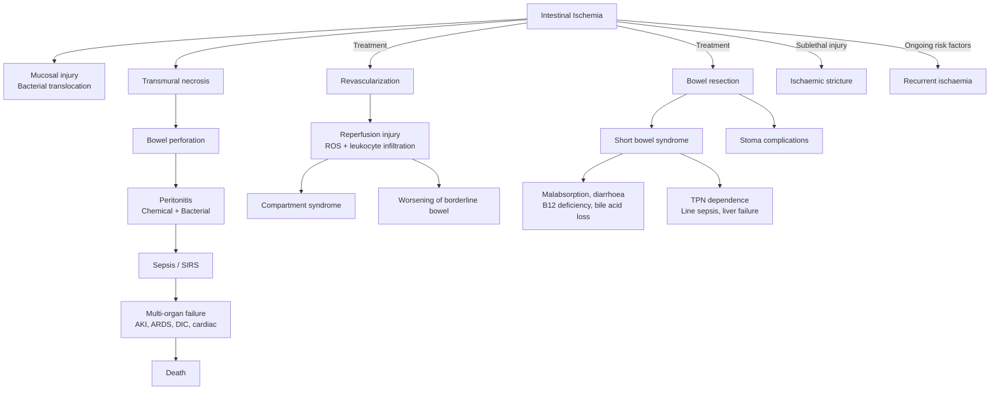

## Complications of Intestinal Ischemia

Complications of intestinal ischemia can be understood as a cascading sequence: ischemia → necrosis → perforation → peritonitis → sepsis → multi-organ failure → death. But the picture is richer than that. Complications arise from **the disease itself**, from **the treatment (surgery and revascularization)**, and from the **long-term consequences** of having lost bowel. Let's work through each systematically, always asking "why does this happen?"

---

### I. Complications of the Disease Process (Ischemia → Necrosis → Death)

These complications follow directly from the pathophysiology of ischemia described in earlier sections. Think of them as a timeline of progressive bowel destruction:

#### A. Transmural Bowel Necrosis

- **Mechanism:** Prolonged ischemia ( > 6–12 hours depending on collateral flow) → mucosal injury progresses through submucosa → muscularis → serosa → full-thickness (transmural) necrosis [1]
- ***Persistent ischemia can lead to full-thickness necrosis of bowel wall and subsequent perforation*** [1]
- **Why does it progress transmurally?** The mucosa dies first (highest metabolic rate, furthest from serosal blood supply via countercurrent oxygen exchange in villi). Progressive vasoconstriction in the obstructed vascular bed *increases* pressure and *reduces* collateral flow [1], and this ***vasoconstriction persists even after blood flow has been restored*** [1] — a vicious cycle that drives necrosis deeper through the wall
- **Clinical significance:** Necrotic bowel is a source of bacterial translocation, endotoxemia, and the nidus for perforation. ***Morbidity and mortality are dependent on duration of ischemia and its extent*** [10]

#### B. Bowel Perforation

- **Mechanism:** Full-thickness necrosis destroys the structural integrity of the bowel wall → intraluminal contents (bacteria, faeces, digestive enzymes) leak into the peritoneal cavity
- **Clinical features:** Sudden worsening of pain → generalized peritonitis (guarding, rigidity, rebound tenderness); ***pneumoperitoneum*** on imaging [2]; haemodynamic deterioration
- **Radiological signs of perforation** [2]:
  - ***Pneumoperitoneum*** — free gas under diaphragm on erect CXR
  - ***Rigler's double wall sign*** — both sides of the bowel wall visible because free gas outlines the serosal surface [2]
- ***Any length of ischemic bowel can cause significant systemic effects secondary to sepsis and dehydration*** [10]

#### C. Peritonitis

- **Mechanism:** Perforation → contamination of the peritoneal cavity with bowel contents → chemical and bacterial peritonitis
- Alternatively, bacterial translocation through intact-but-ischemic mucosa can cause peritonitis even *before* frank perforation
- **Types:**
  - *Chemical peritonitis* — digestive enzymes and bile irritate the peritoneum
  - *Bacterial (faecal) peritonitis* — gut flora (E. coli, Bacteroides, Enterococcus) infect the peritoneal cavity
- **Clinical features:** Board-like abdominal rigidity, absent bowel sounds, guarding, fever, tachycardia

#### D. Sepsis and Systemic Inflammatory Response Syndrome (SIRS)

- **Mechanism:** Necrotic bowel + bacterial translocation → endotoxins and bacteria enter the systemic circulation → overwhelming inflammatory response
- ***Intestinal ischemia can progress to sepsis, peritonitis, free intraabdominal air, bowel infarction, gangrene or even death*** [1]
- The ischemic gut becomes a "motor" driving systemic inflammation: damaged mucosal barrier loses its ability to contain ~10¹⁴ bacteria normally resident in the gut lumen
- **Clinical progression:** SIRS → sepsis → severe sepsis → septic shock → multi-organ dysfunction syndrome (MODS)

#### E. Multi-Organ Failure

- **Mechanism:** Sepsis + hypovolemia (third-spacing through damaged bowel wall) + reperfusion injury → haemodynamic collapse → end-organ hypoperfusion
- Specific organ systems affected:

| Organ System | Complication | Why It Happens |
|---|---|---|
| **Kidneys** | Acute kidney injury (AKI) | Pre-renal: hypovolemia from third-spacing and haemorrhage. Intrinsic: acute tubular necrosis from sepsis and myoglobin (if rhabdomyolysis). ***Renal failure*** is listed as a key feature of ischaemic bowel [3] |
| **Lungs** | ARDS (acute respiratory distress syndrome) | Systemic inflammatory mediators damage pulmonary capillary endothelium → non-cardiogenic pulmonary edema |
| **Heart** | Cardiogenic shock, arrhythmias | Metabolic acidosis + hyperkalaemia → cardiac irritability; myocardial depression from sepsis |
| **Liver** | Ischaemic hepatitis, DIC | Portal venous gas from necrotic bowel → hepatic injury; DIC from overwhelming sepsis |
| **Coagulation** | Disseminated intravascular coagulopathy (DIC) | Massive tissue factor release from necrotic bowel + endotoxemia → activation of coagulation cascade → consumptive coagulopathy |

<Callout title="Why Is Mortality So High?" type="error">
***High mortality if complications occur*** [7]. Mortality from acute mesenteric ischemia with bowel necrosis is 50–80%. This is because by the time necrosis occurs, the patient has entered a lethal cascade: perforation → peritonitis → sepsis → MODS. Each step is harder to reverse than the last. Prognosis: ***non-strangulating obstruction mortality ~2%; strangulating obstruction mortality 10–30%*** [7] — and frank mesenteric infarction is worse still.
</Callout>

#### F. Metabolic Complications During the Acute Phase

| Complication | Mechanism | Clinical Significance |
|---|---|---|
| ***Metabolic acidosis (HAGMA)*** [2][3] | Anaerobic metabolism of ischaemic bowel → lactic acid accumulation | Most important early biochemical marker; reflects severity of ischemia |
| **Hyperkalaemia** | Potassium release from dying cells (cellular lysis) + AKI (impaired renal excretion) | Risk of cardiac arrhythmia → cardiac arrest; must be actively managed |
| **Dehydration and electrolyte imbalance** | Third-spacing through damaged bowel; vomiting; defective intestinal absorption from oedematous bowel wall [6] | Worsens haemodynamic instability and renal function |
| **Hypovolaemic shock** | Massive fluid loss into peritoneal cavity (shock phase — fluid leaks through damaged bowel) [2] | Compounds septic shock; requires aggressive fluid resuscitation |

---

### II. Complications of Treatment (Surgical and Revascularization)

#### A. Reperfusion Injury [1][13]

This is one of the most important and counter-intuitive complications: **restoring blood flow can paradoxically make things worse**.

- **Mechanism:** During ischemia, cells accumulate hypoxanthine (a purine metabolite). When oxygen is suddenly restored, xanthine oxidase converts hypoxanthine to xanthine, generating massive amounts of ***reactive oxygen species (ROS)*** [2]. Simultaneously, the ***influx of leukocytes and complement*** [2] into the reperfused tissue amplifies the inflammatory damage.
- ***Reperfusion injury results from formation of oxygen-free radicals that directly damage the tissue and cause WBC accumulation and sequestration in microcirculation*** [13]
- ***Prolongs ischemic interval since it impairs adequate nutrient flow to the tissue despite restoration of axial blood flow*** [13]
- **Clinical consequence:** Tissue that appeared borderline viable at surgery may deteriorate *after* revascularization — this is precisely why ***second-look laparotomy at 24–48 hours*** [2] is so important

#### B. Compartment Syndrome (Abdominal)

- **Mechanism:** Massive fluid resuscitation + reperfusion edema + bowel oedema → increased intra-abdominal pressure → abdominal compartment syndrome
- When intra-abdominal pressure exceeds ~20 mmHg → compression of IVC (reduced venous return), compression of renal veins (oliguria/AKI), splinting of diaphragm (respiratory failure)
- **Management:** Decompressive laparotomy with temporary abdominal closure

#### C. Compartment Syndrome (Limb — Parallel Concept) [13]

Although this is classically taught with limb ischaemia, the same principles apply when mesenteric ischaemia is part of a systemic embolic event (e.g., saddle embolus):

- ***Prolonged ischemia → cell membrane damage → fluid leaks into interstitial space within non-distensible fascial compartments*** [13]
- ***Intracompartmental pressure > 30 mmHg*** [13]
- Signs: ***pain out of proportion*** worsening despite analgesia, numbness, tense compartment, pain on passive stretching [13]
- Management: ***urgent fasciotomy*** [13]

#### D. Anastomotic Leak (If Anastomosis Performed)

- **Mechanism:** ***Ischaemia, tension, and active infection*** are the top three risk factors for anastomotic leak [12]
- This is why primary anastomosis is generally **avoided** in the acute setting (stoma is preferred) [2]
- If anastomosis was performed (e.g., during second-look when bowel looked viable), monitor for:
  - Deviation from normal post-op course (prolonged ileus, fever, unexplained tachycardia)
  - 50% present with abdominal signs (pain, distension); 50% with systemic signs (fever, oliguria, altered mental state) [12]
  - Diagnose with **contrast CT abdomen** [12]
- Management: minor contained leaks → NPO, antibiotics, percutaneous drainage; major leaks → re-laparotomy, take down anastomosis, create stoma [12]

#### E. Complications of Thrombolysis [13]

- ***Stroke and haemorrhage*** — patients treated with endovascular thrombolysis have higher risk of:
  - Cerebrovascular events (thrombolytic agent can lyse protective clots elsewhere)
  - Major haemorrhage including GI bleeding and haematoma at vascular puncture site [13]
  - ***Catheter-related embolism to more distal arterial mesenteric branches*** [1] — fragments of clot break off during catheter manipulation and occlude smaller downstream vessels

#### F. Stoma-Related Complications

After emergency bowel resection with stoma formation, patients face:

| Complication | Mechanism |
|---|---|
| **High-output stoma** | If extensive small bowel resected, the remaining proximal jejunostomy/ileostomy produces high-volume output → severe dehydration and electrolyte loss |
| **Parastomal hernia** | Weakness at the fascial defect where the stoma is brought through the abdominal wall |
| **Stoma prolapse/retraction** | Technical factors; oedema; ischaemia of stoma |
| **Skin excoriation** | Digestive enzymes in effluent damage peristomal skin |
| **Psychosocial impact** | Body image concerns, adjustment difficulties |

---

### III. Long-Term Complications

#### A. Short Bowel Syndrome (SBS) [2][14]

This is the most devastating long-term complication of extensive bowel resection for mesenteric ischaemia.

> ***High risk of short gut syndrome: diarrhoea, steatorrhea → dehydration, malabsorption, weight loss*** [2]

**Definition:** SBS occurs when the remaining functional small bowel is insufficient for adequate nutrient and fluid absorption. In adults, this typically means < 200 cm of jejunum without colon, or < 100 cm with intact colon [14].

**Why does it happen?** When large segments of necrotic bowel are resected, the remaining intestine cannot compensate for the lost absorptive surface area. The consequences depend on *which* segment was resected:

| Segment Lost | Specific Consequences | Why |
|---|---|---|
| **Jejunum** | Less problematic than ileal loss | Ileum can adapt and take over most jejunal absorptive functions |
| **Ileum** | ***Vitamin B12 malabsorption*** [14] | Distal ileum is the *only* site for absorption of B12-intrinsic factor complex; no other segment can compensate |
| | ***Bile acid malabsorption → fat malabsorption → steatorrhoea*** [14] | Distal ileum is the selective site for bile acid reabsorption; loss of > 100 cm of terminal ileum disrupts the enterohepatic circulation → bile acid deficiency → inadequate fat emulsification |
| **Ileocaecal (IC) valve** | Reduced transit time + bacterial overgrowth [14] | IC valve slows transit (allowing more absorption time) and prevents colonic bacteria from ascending into small bowel; loss leads to SIBO |
| **Colon** | Worsened fluid and electrolyte losses | Colon absorbs ~1.5L of fluid/day; its loss compounds diarrhoea; ***presence of colon is approximately equivalent to having an additional 50 cm of small intestine*** [14] |

**Complications of SBS** [14]:

***Malabsorption*** [14] — the core problem, with downstream consequences:

- ***Watery diarrhoea*** [14] — from unabsorbed solutes creating an osmotic gradient
- Fat-soluble vitamin deficiency (A, D, E, K)
  - ***Metabolic bone disease*** (osteomalacia, osteoporosis) from malabsorption of calcium and vitamin D [14]
- ***Hypomagnesaemia*** → neuromuscular excitability (magnesium binds to unabsorbed fatty acids) [14]
- ***Hypocalcaemia*** → tetany, Trousseau's/Chvostek's sign (secondary to hypomagnesaemia) [14]
- ***Iron deficiency anaemia*** [14]
- Trace element deficiency (zinc → poor wound healing; copper → bone disease; selenium → cardiomyopathy) [14]

***Gallstones (cholelithiasis)*** [14]
- **Why?** Disrupted enterohepatic circulation → altered bile composition (supersaturated with cholesterol); absence of oral intake → reduced CCK-mediated gallbladder contraction → bile stasis → gallstone formation

***Kidney stones (nephrolithiasis)*** [14]
- **Why?** Calcium binds to unabsorbed fatty acids in the gut lumen → free oxalate is absorbed by the colon → hyperoxaluria → calcium oxalate stones in the kidneys
- Prevention: increased fluid intake, low oxalate diet, potassium citrate [14]

***TPN-associated complications*** [14]:
- ***Catheter-associated infection*** (line sepsis) — central lines are colonized by bacteria
- ***TPN-related cholestasis and liver failure*** [14] — lack of enteral feeding → reduced CCK → biliary stasis; TPN lipid infusions are hepatotoxic over time
- ***Central line sepsis*** [14]

> ***Complications of extensive small bowel resection — short bowel syndrome: Malabsorption, TPN related cholestasis, liver failure, Central line sepsis, Long term quality of life*** [14]

#### B. Ischaemic Stricture

- **Mechanism:** Sublethal ischemic injury heals with fibrosis → circumferential narrowing of the bowel lumen → stricture formation
- Most common in ischaemic colitis that resolves without surgery
- Can present weeks to months later with symptoms of partial bowel obstruction (colicky pain, distension, constipation)
- **Management:** Endoscopic balloon dilatation if short and accessible; surgical resection if long or symptomatic

#### C. Recurrent Ischaemia

- Patients who have survived one episode are at high risk of recurrence, because the underlying risk factors (AF, atherosclerosis, hypercoagulable state) persist
- **Prevention:** Long-term anticoagulation (for embolic/venous causes); antiplatelet therapy + statins + risk factor modification (for atherosclerotic causes); optimization of cardiac function

#### D. Chronic Malnutrition and Functional Impairment

- Even patients who avoid SBS may have chronically impaired absorption from residual bowel injury
- Sitophobia (fear of eating) may persist even after revascularization for chronic mesenteric ischemia
- Weight loss, sarcopenia, and deconditioning compound the problem

---

### IV. Mortality Overview

| Scenario | Approximate Mortality | Key Determinant |
|---|---|---|
| ***Non-strangulating obstruction*** | ***~2%*** [7] | No ischaemia; obstruction alone |
| ***Strangulating obstruction*** | ***10–30%*** [7] | Ischaemia + necrosis; worse with delay |
| Acute mesenteric ischaemia (overall) | 50–80% | Often diagnosed late; extensive necrosis by the time of surgery |
| Acute mesenteric ischaemia (early revascularization, no necrosis) | 15–25% | Timely diagnosis is the single most important prognostic factor |
| NOMI | 50–70% | Underlying critical illness (ICU patients); diffuse ischemia |
| Ischaemic colitis (non-gangrenous) | < 5% | Usually self-limiting; rarely requires surgery |

---

### V. Summary Diagram — Complications Cascade

---

<Callout title="High Yield Summary — Complications of Intestinal Ischemia">

**Disease Complications (cascade):**
- Transmural necrosis → perforation → peritonitis → sepsis → MODS → death
- Metabolic: HAGMA (lactic acidosis), hyperkalaemia, AKI, DIC
- ***High mortality if complications occur*** [7]: strangulating obstruction 10-30%; acute mesenteric ischaemia with necrosis 50-80%

**Treatment Complications:**
- ***Reperfusion injury***: ROS generation + leukocyte infiltration → paradoxical worsening after revascularization → reason for second-look laparotomy at 24-48h
- ***Anastomotic leak***: ischaemia is the #1 risk factor → do NOT anastomose in acute setting → stoma instead
- ***Thrombolysis***: stroke, haemorrhage, catheter-related distal embolization
- Abdominal compartment syndrome from massive resuscitation
- Stoma complications: high output, parastomal hernia, skin excoriation

**Long-term Complications:**
- ***Short bowel syndrome***: malabsorption, diarrhoea, steatorrhoea, B12 deficiency, bile acid loss, metabolic bone disease, gallstones, kidney stones, TPN dependence (line sepsis, liver failure)
- Ischaemic stricture (weeks to months later)
- Recurrent ischaemia (underlying risk factors persist)
- Chronic malnutrition and functional impairment

</Callout>

---

<ActiveRecallQuiz
  title="Active Recall - Complications of Intestinal Ischemia"
  items={[
    {
      question: "Describe the pathophysiological cascade from intestinal ischemia to multi-organ failure, naming at least 4 specific organ complications.",
      markscheme: "Ischemia causes transmural necrosis then perforation then peritonitis (chemical and bacterial) then sepsis/SIRS then multi-organ failure. Specific organs: (1) Kidneys - AKI from hypovolaemia, sepsis, ATN; (2) Lungs - ARDS from systemic inflammatory mediators damaging pulmonary capillaries; (3) Heart - arrhythmias from hyperkalaemia and acidosis, myocardial depression from sepsis; (4) Coagulation - DIC from massive tissue factor release; (5) Liver - ischaemic hepatitis, portal venous gas injury.",
    },
    {
      question: "Explain the mechanism of reperfusion injury after mesenteric revascularization. Why is second-look laparotomy planned?",
      markscheme: "During ischemia, hypoxanthine accumulates. On reperfusion, sudden oxygen supply allows xanthine oxidase to generate massive reactive oxygen species (ROS). Simultaneously, leukocytes and complement flood the reperfused tissue, amplifying inflammatory damage. This can worsen borderline-viable bowel. Second-look laparotomy at 24-48h is planned because it takes this long for reperfusion effects to declare - bowel that looked viable at first operation may prove necrotic, and bowel that looked borderline may recover.",
    },
    {
      question: "A patient undergoes extensive small bowel resection including the terminal ileum for mesenteric infarction. What specific long-term complications would you anticipate and why?",
      markscheme: "Short bowel syndrome with: (1) Vitamin B12 deficiency - terminal ileum is the only absorption site for B12-IF complex; (2) Bile acid malabsorption causing fat malabsorption and steatorrhoea - terminal ileum is selective bile acid reabsorption site, loss disrupts enterohepatic circulation; (3) Gallstones - altered bile composition plus bile stasis; (4) Calcium oxalate kidney stones - calcium binds unabsorbed fatty acids leaving free oxalate to be absorbed; (5) Fat-soluble vitamin deficiency (A, D, E, K) causing metabolic bone disease; (6) TPN dependence with risks of catheter sepsis and liver failure.",
    },
    {
      question: "What is the mortality difference between non-strangulating and strangulating intestinal obstruction, and why?",
      markscheme: "Non-strangulating obstruction mortality approximately 2%. Strangulating obstruction mortality 10-30%. The difference is because strangulation involves bowel ischaemia leading to necrosis, perforation, peritonitis and sepsis. Any length of ischaemic bowel can cause significant systemic effects from sepsis and dehydration. Timely surgery is the key prognostic factor.",
    },
    {
      question: "Why is primary anastomosis avoided after resection of necrotic bowel in acute mesenteric ischemia?",
      markscheme: "Ischaemia is the number one risk factor for anastomotic leak. In the acute setting there is contaminated peritoneal cavity, haemodynamic instability, uncertain viability at resection margins, and active infection - all further increase leak risk. Anastomotic leak in this context is frequently fatal. A stoma is created instead, and reversed electively 3-6 months later when the patient has recovered.",
    },
  ]}
/>

## References

[1] Senior notes: felixlai.md (Intestinal Bowel Ischemia — Overview and Pathogenesis sections)
[2] Senior notes: maxim.md (Ischemic bowel disease — Investigations and Management sections)
[3] Lecture slides: GC 195. Lower and diffuse abdominal pain RLQ problems; pelvic inflammatory disease; peritonitis and abdominal emergencies.pdf (p32)
[6] Senior notes: maxim.md (Intestinal obstruction — Complications section)
[7] Lecture slides: GC 194. Intestinal obstruction colorectal cancer.pdf (p38, p67)
[10] Senior notes: felixlai.md (Intestinal obstruction — Strangulation complications section)
[12] Senior notes: maxim.md (Anastomotic leak section)
[13] Senior notes: felixlai.md (Acute arterial insufficiency — Complications section); Senior notes: maxim.md (Acute limb ischaemia — Complications section)
[14] Senior notes: felixlai.md (Short bowel syndrome section); Lecture slides: Case Study – Paediatric Surgery Bilious vomiting of new-born _ACH Fung.pdf (p22)
