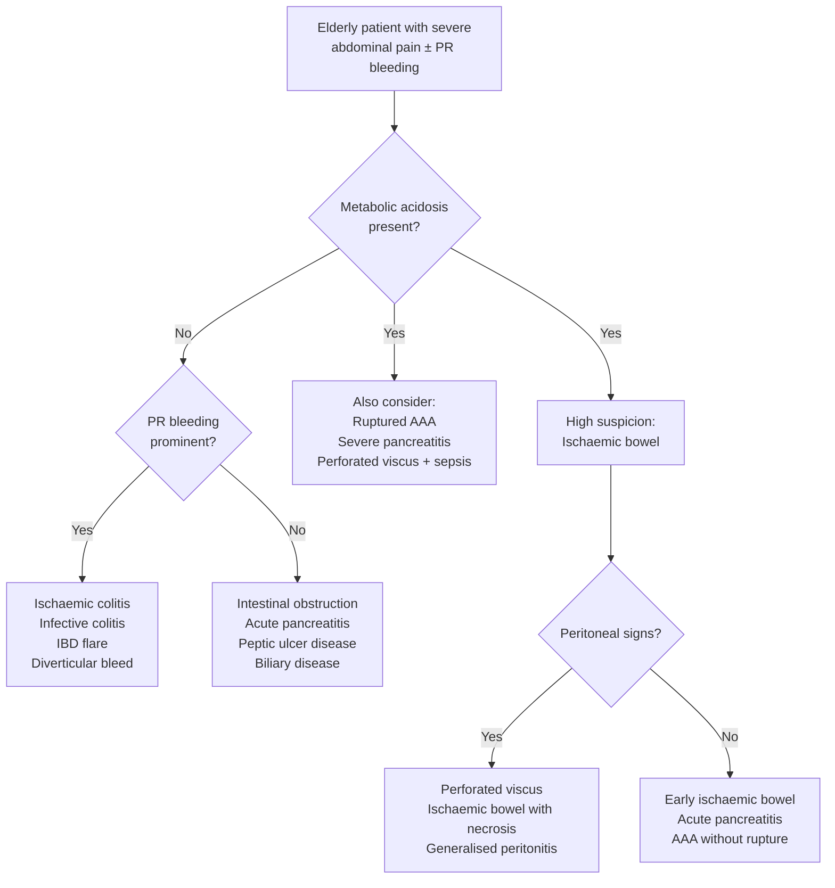

## Differential Diagnosis of Intestinal Ischemia

The differential diagnosis of intestinal ischemia is essentially the differential of **acute abdomen** — particularly in an elderly patient presenting with severe abdominal pain, and often with metabolic acidosis. The challenge is that intestinal ischemia has notoriously non-specific early features: the pain is diffuse, the abdomen can be soft, and lab markers lag behind the pathology. You need to actively think about what else could look like this, and equally, what conditions might coexist with or be mistaken for ischemic bowel.

### Approach to the Differential

The key clinical anchor is: ***elderly patient, history of AF or IHD, constant severe non-specific abdominal pain, rectal bleeding or bloody diarrhoea, lack of peritoneal sign, leukocytosis, metabolic acidosis*** [3]. When you see this picture, ischemic bowel is high on the list — but you must exclude mimics and identify coexisting pathology.

Think about the differential systematically by asking: **what else causes acute abdominal pain + metabolic acidosis + PR bleeding in an elderly patient?**

---

### A. Conditions That Mimic Acute Mesenteric Ischemia

These conditions share the pattern of **severe abdominal pain, systemically unwell, ± metabolic acidosis**:

| Differential | Why It Mimics Intestinal Ischemia | How to Distinguish |
|---|---|---|
| ***Acute pancreatitis*** [1] | Severe epigastric/diffuse pain, can have metabolic acidosis, ileus, hemodynamic instability; amylase may be elevated in both | Pancreatitis: pain radiates to back, relieved by leaning forward; amylase/lipase ≥ 3× ULN; CT shows pancreatic inflammation, not vascular occlusion. Note: mesenteric ischemia itself can mildly elevate amylase (in ~50% of cases) [1] — so a modest rise does not exclude ischemia |
| ***Ruptured abdominal aortic aneurysm (AAA)*** [4] | Sudden severe abdominal/back pain + hypotension + metabolic acidosis in elderly male with vascular risk factors | Pulsatile abdominal mass; CT shows retroperitoneal haematoma, aortic rupture; AAA can also *cause* mesenteric ischemia via atheroembolism or hypotension |
| ***Perforated peptic ulcer (PPU)*** | Sudden severe abdominal pain; peritonitis develops rapidly | PPU: board-like rigidity from chemical peritonitis (gastric acid); free air under diaphragm on erect CXR; history of NSAID/PUD |
| ***Intestinal obstruction with strangulation*** [5][6] | Colicky pain becoming constant (ischemia), vomiting, distension, metabolic acidosis if bowel becomes necrotic | Obstruction: ***colicky pain, vomiting, distension, absolute constipation*** (cardinal tetrad) [6]; transition point on CT; history of prior surgery (adhesions), hernia, or malignancy. Note: strangulated obstruction IS a form of intestinal ischemia (mechanical cause) [1][3] |
| ***Acute myocardial infarction (MI)*** [1] | Inferior MI can present as epigastric pain with nausea/vomiting, mimicking an acute abdomen; both share the same risk factor profile (elderly, AF, IHD) | ECG, troponin. Remember: MI can *cause* mesenteric ischemia (via cardiogenic shock → NOMI, or mural thrombus → embolism) — so both can coexist |
| ***Aortic dissection*** [4] | Sudden tearing pain, can cause mesenteric ischemia if the dissection flap occludes the SMA ostium | Tearing pain radiating to back; BP differential between arms; CT angiography shows dissection flap; can directly cause mesenteric malperfusion |

<Callout title="Don't Forget: MI and Aortic Dissection Can CAUSE Mesenteric Ischemia" type="error">
These are not just differentials — they are also causes. An inferior MI can cause cardiogenic shock → NOMI, or new-onset AF → embolism. Aortic dissection can extend into the SMA origin. Always do an ECG and consider CT angiography of the entire aorta in the right clinical context.
</Callout>

### B. Conditions That Mimic Ischaemic Colitis

When the dominant presentation is **abdominal pain + PR bleeding/bloody diarrhea** (i.e., colonic ischemia pattern), consider:

| Differential | Why It Mimics Ischaemic Colitis | How to Distinguish |
|---|---|---|
| ***Infective colitis*** [1] | Bloody diarrhea, abdominal pain, fever; can cause thumbprinting on imaging | Stool culture positive (Salmonella, Shigella, Campylobacter, C. difficile, E. coli O157:H7); travel or antibiotic history; tends to affect younger patients; colonoscopy shows diffuse inflammation rather than segmental/watershed pattern |
| ***Inflammatory bowel disease (IBD) flare*** [1] | Bloody diarrhea, abdominal pain, raised inflammatory markers | ***Diarrhea rather than abdominal pain is the predominant symptom*** [1]; younger age; chronic relapsing history; colonoscopy shows characteristic patterns (continuous from rectum in UC; skip lesions/cobblestoning in Crohn's); should not be misdiagnosed as ischaemic colitis since therapy is fundamentally different |
| ***Acute diverticulitis*** [1] | LLQ pain, fever, raised WCC; can cause colonic wall thickening on CT similar to ischaemic colitis | Diverticulitis: pericolonic fat stranding, diverticula visible on CT; typically LLQ tenderness; PR bleeding is uncommon in uncomplicated diverticulitis (bleeding is from diverticulosis, not diverticulitis). Features of diverticulitis on CT include ***involvement of > 10 cm of colon, pericolonic and mesenteric inflammation, absence of enlarged pericolonic lymph nodes*** [1] |
| ***Colorectal cancer (CRC)*** [1] | Can present with PR bleeding, change in bowel habit, iron deficiency anaemia, weight loss; bowel wall thickening on CT | Insidious onset; obstructive symptoms; colonoscopy with biopsy is diagnostic; mass lesion on imaging rather than segmental ischemic changes |
| ***Diverticular bleeding*** | Painless or mildly painful massive PR bleeding | Bleeding is arterial, usually painless, self-limiting in 80%; no ischaemic changes on imaging; right-sided diverticula more common in Asian population [1] |
| ***Radiation colitis/proctitis*** | PR bleeding, tenesmus, diarrhea in patients with prior pelvic radiation | History of radiotherapy for cervical/prostate/rectal cancer; telangiectasia on colonoscopy; typically affects rectum/sigmoid |

### C. Other Important Differentials of the Acute Abdomen That Must Be Excluded [4]

These are the ***life-threatening differentials of acute abdomen*** that overlap with the presentation of mesenteric ischemia:

- ***Perforated viscus*** (PPU, perforated diverticulitis, perforated CRC) — free air on erect CXR/CT
- ***Ruptured AAA*** — pulsatile mass, hemodynamic instability, CT shows aneurysm/haematoma [4]
- ***Acute mesenteric ischemia*** (itself is one of the life-threatening differentials of any acute abdomen) [4]
- ***Acute intestinal obstruction*** — cardinal tetrad of pain, vomiting, distension, constipation [6]
- ***Severe pancreatitis*** — amylase/lipase ≥ 3× ULN, CT shows pancreatic necrosis [1]
- ***Ruptured HCC*** — in Hong Kong, always consider in a patient with known hepatitis B/cirrhosis presenting with acute abdominal pain and hemodynamic instability [4]
- ***Medical causes***: DKA (ketoacidosis causes abdominal pain and metabolic acidosis — can closely mimic ischaemic bowel), Addisonian crisis, acute MI [4]
- ***Obstetric***: ruptured ectopic pregnancy, placental abruption [4]

### D. Differentials Specific to the Subtype of Ischemia

#### For Mesenteric Venous Thrombosis (insidious pain, waxing and waning)
- Portal vein thrombosis (from cirrhosis, malignancy)
- Budd-Chiari syndrome (hepatic vein thrombosis)
- Other hypercoagulable complications (DVT/PE) — ask about leg swelling, dyspnea

#### For Chronic Mesenteric Ischemia (postprandial pain, weight loss, sitophobia)
- Pancreatic cancer — also causes postprandial pain, weight loss, back pain; CT/MRCP differentiates
- Peptic ulcer disease — postprandial pain (GU) or relief (DU); OGD differentiates
- Chronic pancreatitis — epigastric pain radiating to back, steatorrhea, calcifications on imaging
- Gastric malignancy — early satiety, weight loss; OGD with biopsy

### E. Differentials of Mechanical Causes of Intestinal Ischemia

***Mechanical (volvulus, hernia)*** [3] — these are both differentials of and causes of intestinal ischemia:

| Condition | Mechanism of Ischemia | Key Features |
|---|---|---|
| ***Sigmoid volvulus*** [5] | Twisting of bowel > 360° → occlusion of both arterial supply and venous drainage | ***Coffee bean sign*** on AXR; elderly, bedbound, chronic constipation; colicky → constant pain indicates ischemia |
| ***Caecal volvulus*** [5] | Same mechanism; caecal volvulus usually presents with ischemia | Haustral pattern on AXR; younger females |
| ***Incarcerated/strangulated hernia*** [1] | Hernial ring compresses mesenteric vessels → venous then arterial occlusion | Tender irreducible groin/abdominal lump; absent cough impulse; overlying skin changes |
| ***Intestinal obstruction with strangulation*** | Adhesive band compresses mesentery; or closed-loop obstruction twists on itself | ***Colicky pain becoming constant*** suggests ischemia developing; peritoneal signs; raised lactate [6] |

<Callout title="Strangulation IS Ischemia" type="idea">
Don't think of strangulated obstruction and intestinal ischemia as completely separate entities. Strangulation is simply a *mechanical cause* of intestinal ischemia. When the exam asks "what are the causes of ischaemic bowel?", include ***thromboembolism, venous occlusion, non-obstructive mesenteric ischaemia, chronic mesenteric ischaemia, and mechanical (volvulus, hernia)*** [3].
</Callout>

### F. Summary: Differentiating by Key Clinical Features

| Feature | Ischaemic Bowel | Intestinal Obstruction | Acute Pancreatitis | Perforated Viscus | Ruptured AAA |
|---|---|---|---|---|---|
| **Pain character** | Constant, severe, out of proportion | Colicky → constant if strangulated | Epigastric, radiates to back | Sudden, severe, generalized | Sudden, back/flank, tearing |
| **PR bleeding** | Common (especially colonic) | Uncommon unless strangulated | No | No | No |
| **Peritoneal signs** | ***Absent early*** | Absent early, present if strangulated | May have guarding | ***Present early*** (chemical peritonitis) | Present if intraperitoneal rupture |
| **Metabolic acidosis** | ***Yes*** (lactic acidosis from tissue hypoxia) | Late (if strangulated) | If severe/necrotic | If septic | Yes (from shock) |
| **Key investigation** | ***CT angiography*** | CT abdomen (transition point) | Lipase + CT | Erect CXR (free air) | CT with contrast (aneurysm) |
| **Key history** | ***AF, IHD, PVD*** | Prior surgery (adhesions), hernia | Gallstones, alcohol | NSAID use, PUD | Known AAA, vascular risk factors |

<Callout title="High Yield Summary — Differential Diagnosis">

**The core differentials of acute mesenteric ischemia:**
1. Acute pancreatitis (amylase can be elevated in both — need lipase ≥ 3× ULN and CT to differentiate)
2. Ruptured AAA (can also cause ischemia)
3. Perforated viscus (PPU — free air on CXR)
4. Intestinal obstruction with strangulation (is itself a form of ischemia)
5. Acute MI / aortic dissection (can cause ischemia — always do ECG)

**The core differentials of ischaemic colitis:**
1. Infective colitis (stool culture)
2. IBD flare (diarrhea > pain; chronic history)
3. Acute diverticulitis (pericolonic fat stranding on CT)
4. Colorectal cancer (mass on colonoscopy)
5. Radiation colitis (history of RT)

**Life-threatening DDx of acute abdomen** (must always exclude): Perforated viscus, ruptured AAA, acute mesenteric ischemia, acute IO, severe pancreatitis, ruptured HCC, DKA, acute MI, Addisonian crisis, ruptured ectopic pregnancy.

**Key clinical pearl:** ***Acute abdomen + metabolic acidosis = ischaemic bowel until proven otherwise*** [2].

</Callout>

---

<ActiveRecallQuiz
  title="Active Recall - Differential Diagnosis of Intestinal Ischemia"
  items={[
    {
      question: "Name 5 life-threatening differentials of an acute abdomen that must be excluded when considering mesenteric ischemia.",
      markscheme: "Any 5 of: perforated viscus (PPU), ruptured AAA, acute mesenteric ischemia itself, acute intestinal obstruction, severe pancreatitis, ruptured HCC, DKA, acute MI, Addisonian crisis, ruptured ectopic pregnancy.",
    },
    {
      question: "Why can acute pancreatitis be confused with mesenteric ischemia, and how do you differentiate them?",
      markscheme: "Both cause severe abdominal pain, metabolic acidosis, ileus, and haemodynamic instability. Mesenteric ischemia can elevate amylase in ~50% of cases. Differentiate by: pancreatitis has lipase at least 3x ULN, pain radiates to back and is relieved by leaning forward, CT shows pancreatic inflammation not vascular occlusion. CT angiography shows mesenteric vascular occlusion in ischaemic bowel.",
    },
    {
      question: "How does ischaemic colitis differ from IBD on clinical presentation?",
      markscheme: "In IBD, diarrhoea is the predominant symptom rather than abdominal pain. IBD affects younger patients with chronic relapsing course. Ischaemic colitis affects elderly with cardiovascular risk factors, has acute onset, and follows watershed distribution (splenic flexure, rectosigmoid junction). IBD has characteristic colonoscopic patterns (continuous from rectum in UC, skip lesions in Crohns). Treatment is fundamentally different.",
    },
    {
      question: "Explain why MI and aortic dissection are not just differentials but also potential causes of mesenteric ischemia.",
      markscheme: "MI can cause mesenteric ischemia via: (1) cardiogenic shock leading to NOMI from splanchnic hypoperfusion, (2) new-onset AF leading to thrombus formation and embolism, (3) LV mural thrombus embolising to SMA. Aortic dissection can cause mesenteric ischemia when the dissection flap extends to occlude the SMA ostium (malperfusion syndrome). Both can coexist with mesenteric ischemia.",
    },
    {
      question: "A patient presents with colicky abdominal pain that has become constant, with rising lactate. What does this transition from colicky to constant pain signify, and what is the diagnosis?",
      markscheme: "Transition from colicky to constant pain signifies development of bowel ischaemia in the setting of intestinal obstruction (strangulation). Colicky pain reflects peristalsis against obstruction; constant pain reflects ischaemic necrosis of the bowel wall. This is strangulated obstruction, which is a mechanical cause of intestinal ischemia. Urgent surgical intervention is required.",
    },
  ]}
/>

## References

[1] Senior notes: felixlai.md (Intestinal Bowel Ischemia section; Lower GI Bleeding section; Acute Diverticulitis section; Acute Pancreatitis section)
[2] Senior notes: maxim.md (Ischemic bowel disease section)
[3] Lecture slides: GC 195. Lower and diffuse abdominal pain RLQ problems; pelvic inflammatory disease; peritonitis and abdominal emergencies.pdf (p31-32)
[4] Senior notes: felixlai.md (Ruptured AAA section); Senior notes: maxim.md (Acute abdomen DDx section)
[5] Senior notes: maxim.md (Volvulus section); Senior notes: felixlai.md (Volvulus section)
[6] Senior notes: maxim.md (Intestinal obstruction section); Senior notes: felixlai.md (Intestinal obstruction section)
