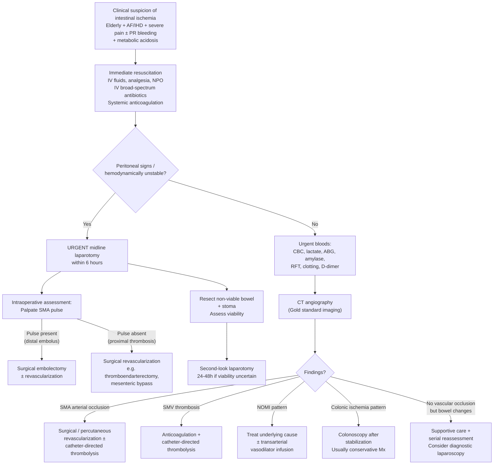

## Diagnostic Criteria, Diagnostic Algorithm, and Investigation Modalities for Intestinal Ischemia

### I. Diagnostic Criteria — A Clinical Diagnosis

Unlike conditions such as acute pancreatitis (which has a neat 2-of-3 criteria), intestinal ischemia **does not have formal universally accepted diagnostic criteria**. Instead, the diagnosis rests on a **synthesis of clinical suspicion, laboratory markers, and imaging findings**. This is important to understand: by the time you have "definitive proof," the bowel may already be dead. The diagnosis is therefore driven by a **high index of suspicion** in the right clinical context.

The diagnostic reasoning can be distilled into three pillars:

| Pillar | What You're Looking For | Key Elements |
|---|---|---|
| **1. Clinical** | High-risk patient + classic presentation | ***Elderly, history of AF or IHD*** [3]; ***constant severe non-specific abdominal pain***; ***rectal bleeding or bloody diarrhoea***; ***lack of peritoneal sign*** early [3] |
| **2. Biochemical** | Evidence of tissue ischemia and systemic compromise | ***Leukocytosis, metabolic acidosis, renal failure*** [3]; elevated ***lactate*** [2]; raised amylase |
| **3. Radiological** | Direct visualization of vascular occlusion + ischemic bowel changes | ***CT angiogram (gold standard)*** [2] showing arterial/venous occlusion; bowel wall changes; AXR findings |

<Callout title="The Clinical Threshold for Diagnosis">
The practical "diagnostic criterion" is: **If an elderly patient with cardiovascular risk factors presents with severe abdominal pain out of proportion to physical findings + metabolic acidosis (raised lactate/HAGMA) → treat as intestinal ischemia until proven otherwise.** Do not wait for confirmatory imaging before initiating resuscitation and anticoagulation. Speed saves bowel.
</Callout>

#### Specific Diagnostic Patterns by Subtype

| Subtype | Key Diagnostic Features |
|---|---|
| **Arterial embolism** | Sudden onset in patient with AF/cardiac source; CT angiography shows filling defect in SMA distal to middle colic branch; proximal SMA pulse present at surgery [1][2] |
| **Arterial thrombosis** | History of chronic mesenteric angina; CT angiography shows proximal SMA occlusion at ostium; absent SMA pulse at surgery [1][2] |
| **Venous thrombosis** | Insidious onset; hypercoagulable risk factors; CT with delayed venous phase shows ***filling defects or absent flow*** in SMV/portal vein [1][2] |
| **NOMI** | ICU patient on vasopressors; CT angiography shows patent vessels but diffuse bowel wall changes in watershed zones; angiography may show diffuse vasospasm [1] |
| **Chronic mesenteric ischemia** | Postprandial pain, sitophobia, weight loss; duplex USG or CT angiography shows multi-vessel stenosis (usually ≥ 2 of 3 mesenteric arteries) |
| **Ischaemic colitis** | Elderly with PR bleeding + mild abdominal pain; colonoscopy shows segmental mucosal changes at watershed zones; CT shows colonic wall thickening |

---

### II. Diagnostic Algorithm

The algorithm branches based on **hemodynamic stability and presence of peritoneal signs**, because this determines whether you have time for imaging or must go straight to theatre.

<Callout title="Key Decision Point — Peritoneal Signs" type="error">
***Unstable patients with peritoneal signs go straight to urgent midline laparotomy within 6 hours*** [2]. Do NOT delay for CT in this scenario — the bowel is dying. CT angiography is reserved for ***stable patients without peritoneal signs*** [2]. This is the single most important branching point in the algorithm.
</Callout>

---

### III. Investigation Modalities — Detailed Breakdown

#### A. History Taking [1]

Before any test, a focused history provides critical diagnostic clues:

| History Element | Significance | Why It Matters |
|---|---|---|
| ***History of AF, recent MI, valvular disease*** | Cardiac embolic source → acute arterial embolism | AF causes stasis in left atrium → thrombus formation → embolization to SMA |
| ***History of embolic events (e.g. stroke, limb ischemia)*** [1] | Predisposes to acute embolic mesenteric ischemia | If they've embolized once, they can embolize again — same pathological process |
| ***History of DVT or PE*** [1] | Predisposes to mesenteric venous thrombosis | Indicates hypercoagulable state; venous thrombosis can affect mesenteric veins just as it affects deep leg veins |
| ***History of PVD, chronic postprandial pain*** | Suggests acute-on-chronic thrombosis | Chronic atherosclerotic stenosis → acute plaque rupture/thrombosis |
| ***Medications: digoxin, diuretics, vasopressors*** | Risk factor for NOMI | These drugs cause splanchnic vasoconstriction → reduced mesenteric blood flow |
| Prior abdominal surgery, malignancy | Risk for adhesive obstruction (mechanical ischemia) or venous thrombosis | Surgery → adhesions → obstruction → strangulation; malignancy → hypercoagulable state |

---

#### B. Physical Examination [1][3]

| Phase | Findings | Pathophysiological Basis |
|---|---|---|
| **Vital signs** | ***Hypotension indicating septic shock*** [1]; tachycardia, fever | Transmural necrosis → bacterial translocation → systemic sepsis → distributive shock |
| **Early disease** | ***Abdominal pain out of proportion to physical examination*** [1]; ***absence of peritoneal signs***; mild abdominal distension | Visceral pain from ischemic bowel; peritoneum not yet involved because necrosis has not become transmural |
| **Advanced disease** | ***Presence of peritoneal signs*** (guarding, rigidity, rebound); ***marked abdominal distension*** [1] | Transmural bowel infarction → perforation → peritoneal contamination → somatic pain |
| **Auscultation** | Initially hyperactive → then absent bowel sounds (***ileus*** [3]) | Hyperperistalsis against ischemia initially → then paralytic ileus as musculature dies |

---

#### C. Biochemical Investigations

These are ordered **urgently** and simultaneously with imaging. No single blood test is diagnostic, but the constellation of findings supports the diagnosis and indicates severity.

| Investigation | Findings | Pathophysiological Basis / Interpretation |
|---|---|---|
| ***CBC with differentials*** [1][2] | ***↑ Hematocrit*** (hemoconcentration); ***Leukocytosis*** [3] with ***predominance of immature WBC*** (left shift) | Hemoconcentration: fluid third-spacing through damaged bowel wall → intravascular volume depletion. Leukocytosis: tissue necrosis + bacterial translocation trigger acute inflammatory response with bone marrow release of immature neutrophils (left shift). Leukocytosis is ***non-specific*** [2] but supports the diagnosis |
| ***Arterial blood gas (ABG)*** [1][2][3] | ***Metabolic acidosis*** [3] — specifically ***high anion gap metabolic acidosis (HAGMA)*** [2] | Ischemic bowel undergoes anaerobic metabolism → lactic acid production → HAGMA. This is the most important early biochemical clue. Why high anion gap? Lactate is an unmeasured anion |
| ***Serum lactate*** [1][2] | ***↑ Lactate level*** in acute mesenteric ischemia | Direct marker of tissue hypoxia — ischemic bowel produces lactate via anaerobic glycolysis. ***Lactate is a sensitive marker for bowel ischemia*** [1] but not specific (any shock state raises lactate). Serial lactate trending is useful for monitoring |
| ***Serum amylase*** [1] | ***↑ Amylase level in approximately half of patients*** with intestinal ischemia | Why? Ischemic bowel releases intracellular enzymes including amylase from damaged small bowel mucosa. This is a pitfall — can be mistaken for acute pancreatitis. The rise is typically modest ( < 3× ULN, unlike pancreatitis where lipase ≥ 3× ULN) |
| ***D-dimer*** [1] | Elevated in thrombotic/embolic ischemia; ***normal D-dimer may help to exclude acute intestinal ischemia*** | D-dimer is a fibrin degradation product — elevated when there is active thrombosis/fibrinolysis. High sensitivity but low specificity (elevated in many conditions). Its main value is as a **rule-out test**: a normal D-dimer makes acute mesenteric ischemia less likely |
| ***RFT (Renal function tests)*** [2][3] | ***Renal failure*** [3]; elevated creatinine and urea | Hypovolemia from third-spacing + systemic sepsis → prerenal AKI. Renal failure in the context of acute abdomen is a red flag for severe ischaemic bowel |
| ***Clotting profile*** [2] | May be deranged; order if suspecting hypercoagulability | If venous thrombosis suspected → check for underlying thrombophilia (protein C/S, antithrombin III, Factor V Leiden, APLS antibodies). DIC screen if septic (↑PT, ↑APTT, ↓fibrinogen, ↑D-dimer) |
| ***LFT*** | May show elevated transaminases | Ischemic hepatopathy from systemic hypoperfusion or portal venous gas |

<Callout title="The Lactate-ABG Combination Is Key" type="idea">
***Bloods: CBC (leucocytosis), lactate, ABG (HAGMA), clotting, amylase, RFT*** [2]. This is the standard panel. The combination of **raised lactate + HAGMA on ABG** in a patient with acute abdominal pain essentially clinches the diagnosis of tissue ischemia somewhere. In the right clinical context, this means ischaemic bowel.
</Callout>

---

#### D. Radiological Investigations

##### 1. Plain Abdominal X-ray (AXR) [1][2][7][8]

AXR is the **first-line imaging** in any acute abdomen. It is quick, available, and cheap — but for intestinal ischemia it is ***relatively non-specific and can be completely normal*** [1]. Its main role is to exclude other diagnoses (e.g., perforation, obstruction) and look for late signs of ischemia.

***Questions to ask on AXR*** (from lecture slides) [7]:
- ***Are there dilated bowel loops?***
- ***Are air fluid levels present in erect film?***
- ***Any gas in the colon and the level of cut off?***
- ***Any evidence of strangulation: thumbprinting, pneumatosis cystoides intestinalis, free peritoneal gas?***
- ***Any massive dilatation of colon?***
- ***Any air in the biliary tree?***

| AXR Finding | Description | Pathophysiological Basis | Stage of Disease |
|---|---|---|---|
| **Normal** | No abnormality | Early ischemia — mucosal damage only, not enough to cause gas pattern abnormality | Early |
| ***Dilated bowel loops*** [2] | Dilated small or large bowel segments | ***Paralytic ileus*** [3] — ischemic bowel wall loses motility → gas and fluid accumulate | Intermediate |
| ***Thumbprinting sign*** [2][7] | Regular indentations along bowel wall that look like thumb impressions projecting into the lumen | ***Submucosal oedema*** [2] — ischemia increases capillary permeability → fluid leaks into submucosa → normal haustral folds become thickened at regular intervals | Intermediate |
| **Bowel wall thickening** [2] | Generalized thickening of bowel wall | Mucosal and submucosal edema from ischemia and venous congestion | Intermediate |
| ***Pneumatosis intestinalis*** [2][7] | Gas within the bowel wall — appears as linear or cystic lucencies paralleling the bowel lumen | ***Necrosis*** [2] — transmural bowel necrosis allows intraluminal gas (from bacteria) to dissect into the bowel wall. This is an ominous sign indicating advanced disease | Late |
| ***Portal venous gas*** [2] | Linear branching gas lucencies over the liver | Gas from necrotic bowel enters mesenteric veins → portal vein → distributes into intrahepatic portal radicles. Like pneumatosis, this indicates ***necrosis*** and is a grave prognostic sign | Late |
| ***Pneumoperitoneum*** [2] | Free gas under diaphragm (erect CXR/AXR) | ***Perforation*** — transmural necrosis has progressed to full-thickness bowel wall breakdown → bowel contents leak into peritoneal cavity | Very late |
| ***Rigler's double wall sign*** [2] | Both the inner (mucosal) and outer (serosal) surfaces of the bowel wall are visible | Free intraperitoneal gas outlines the serosal surface while intraluminal gas outlines the mucosal surface → both walls visible. Indicates ***perforation*** [2] | Very late |

<Callout title="AXR Findings Progress With Disease Stage" type="idea">
Think of AXR findings as a timeline: **Normal → dilated loops/thumbprinting → pneumatosis/portal gas → pneumoperitoneum**. Each step represents progression from reversible mucosal ischemia to irreversible transmural necrosis to perforation. If you see pneumatosis or portal venous gas, the bowel is almost certainly dead.
</Callout>

##### 2. CT Angiography (CTA) — ***The Gold Standard*** [1][2][8][9]

CTA is the **single most important investigation** for suspected mesenteric ischemia. It simultaneously:
1. Identifies the **cause** (arterial occlusion, venous thrombosis, or NOMI pattern)
2. Demonstrates the **consequences** (bowel wall changes, perforation)
3. ***Excludes other causes of acute abdomen*** [1]
4. Allows planning for endovascular intervention if appropriate

***CT scan: more sensitive than plain abdominal X-rays*** [8]. It identifies ***level of obstruction (transition between dilated and collapsed loop), lesions (tumor, foreign bodies), viability of bowel (intravenous contrast)*** [8].

**Protocol:** Triphasic CT — non-contrast, arterial phase, and portal venous (delayed) phase [1][2]

| CT Phase | What It Shows | Key Findings |
|---|---|---|
| **Non-contrast** | Baseline; detects intramural hemorrhage, calcified atheroma | High-density bowel wall (hemorrhagic infarction in venous thrombosis) |
| **Arterial phase** | ***Arterial occlusion: lack of enhancement of arterial vasculature with timed IV contrast*** [1][2] | Filling defect in SMA/IMA = thrombus or embolus; **absence of filling defect does not sufficiently rule out acute mesenteric ischemia** (NOMI won't show a filling defect) [1] |
| **Venous/delayed phase** | ***Venous thrombosis: filling defects or absent flow during venous phase*** [1][2] | Thrombus in SMV/portal vein; surrounding mesenteric fat stranding; bowel wall enhancement pattern |

**CT findings of acute ischemia** [1][2]:

| CT Finding | Description | Significance |
|---|---|---|
| **Arterial filling defect** | Hypodense thrombus within SMA/IMA lumen on arterial phase | Direct evidence of occlusive ischemia (embolism or thrombosis) — ***specific for diagnosis*** [1] |
| **Bowel wall thickening** | Focal or segmental thickening of affected bowel segment | Edema from ischemia — ***sensitive but not specific*** [1] (also seen in infection, IBD, etc.) |
| **Bowel dilation** | Dilated loops proximal to or at the affected segment | Paralytic ileus from ischemic bowel wall |
| ***Reduced or absent bowel wall enhancement*** | Affected bowel wall fails to enhance with IV contrast | Loss of perfusion — the bowel wall is not receiving blood. This is a key distinguishing feature from other causes of wall thickening |
| **Mesenteric stranding** | Haziness/fat stranding in the mesentery surrounding affected bowel | Edema and inflammation extending into mesenteric fat |
| **Engorgement of mesenteric vessels** | Prominent, dilated mesenteric veins | Venous congestion (especially in mesenteric venous thrombosis) |
| ***Portomesenteric thrombosis*** | Thrombus visible in portal vein/SMV on venous phase | Diagnostic of mesenteric venous thrombosis |
| ***Pneumatosis intestinalis*** | Gas within bowel wall | Transmural necrosis — ominous sign |
| ***Portomesenteric venous gas*** | Gas in portal/mesenteric venous system | Necrosis — gas from dead bowel dissecting into venous system |
| **Solid organ infarction** | Splenic or hepatic infarcts | May occur with proximal SMA/celiac embolism or systemic thromboembolism |
| **Pneumoperitoneum** | Free intraperitoneal air | Bowel perforation |

***CT abdomen with contrast is sensitive for ischemic bowel and SMA occlusion, and can exclude other DDx*** [2].

> ***Investigations for acute mesenteric ischemia: MRA or MDCT angiography (CTA)*** [1]. ***Investigations for acute colonic ischemia: Colonoscopy*** [1].

<Callout title="CTA Interpretation — Embolism vs Thrombosis">
On CTA, you can often distinguish embolism from thrombosis:
- **Embolism**: filling defect located **distally** in SMA (3-8cm from origin, past middle colic takeoff); proximal SMA is patent; abrupt cutoff
- **Thrombosis**: occlusion at the **ostium/proximal SMA** where atherosclerotic plaque sits; often with calcified atheroma at the vessel origin; more gradual tapering

This distinction directly impacts the surgical approach (embolectomy vs bypass).
</Callout>

##### 3. MR Angiography (MRA) [1]

| Feature | Details |
|---|---|
| **When to use** | ***More sensitive for diagnosis of mesenteric venous thrombosis*** [1]; ***necessary for those with an allergy to iodinated contrast*** [1] |
| **Advantages** | No ionizing radiation; no iodinated contrast (uses gadolinium); excellent soft tissue resolution; can assess flow dynamics |
| **Disadvantages** | Slower than CTA (not ideal in acute emergency); limited availability; contraindicated with certain metallic implants; cannot detect calcification well; motion artifacts |
| **Role** | Second-line to CTA; primarily for venous thrombosis assessment or contrast-allergic patients |

##### 4. Duplex Ultrasound [9]

- **Duplex USG = B-mode (2D) USG + Doppler** [9]
- Can locate the level of obstruction and assess flow in mesenteric vessels
- ***Normal arterial flow waveform should be triphasic*** [9]; monophasic or biphasic waveforms are abnormal
- **Advantages:** Non-invasive, no radiation, bedside availability (useful in ICU for NOMI patients)
- **Disadvantages:** Highly operator-dependent; bowel gas obscures views; poor sensitivity for distal SMA and branch vessels; not reliable in acute emergencies
- **Main role in intestinal ischemia:** Screening tool for chronic mesenteric ischemia (elevated peak systolic velocity in SMA/celiac indicating stenosis); limited role in acute setting

##### 5. Catheter-Based Digital Subtraction Angiography (DSA) [9]

- ***Gold standard for evaluation of arterial tree*** before planning revascularization [9]
- ***Indicated only in patients with planned intervention*** (angioplasty/stenting) [9]
- Allows simultaneous diagnostic and therapeutic intervention (catheter-directed thrombolysis, vasodilator infusion for NOMI)
- **Digital subtraction** removes underlying bone from images to better visualize arteries
- **Risks:** Invasive; contrast allergy; contrast nephropathy; arterial puncture site bleeding; arterial dissection; embolization; hematoma; local infection [9]
- Largely superseded by CTA for diagnostic purposes, but remains essential when endovascular intervention is planned

##### 6. Colonoscopy [1]

- ***Investigation of choice for acute colonic ischemia*** (ischaemic colitis) [1]
- Performed **after initial stabilization**, not in the acute resuscitation phase
- Findings:
  - Segmental mucosal edema, hemorrhage, and ulceration — typically at watershed zones (splenic flexure, rectosigmoid)
  - "Single-stripe sign" (linear ulceration along the anti-mesenteric border) — good prognosis
  - "Circumferential cyanosis" — poor prognosis (indicates transmural involvement)
  - Mucosal biopsy shows ischemic changes (mucosal necrosis, ghost cells, hemosiderin-laden macrophages)
- **Contraindicated** if peritonitis suspected (risk of perforation with insufflation) [6]

<Callout title="Do NOT order colonoscopy or barium enema in acute settings with peritoneal signs" type="error">
***AVOID endoscopy for acute abdomen: sealed-off perforation may open by gas insufflation during endoscopy*** [6]. Colonoscopy is for stable patients with suspected ischaemic colitis only — not for patients with peritonitis.
</Callout>

##### 7. Adjunct Investigations [1][9]

| Investigation | Purpose | Rationale |
|---|---|---|
| ***ECG*** | Look for ***AF***, acute MI, arrhythmia | Identify embolic source; MI can cause/coexist with mesenteric ischemia |
| ***Echocardiogram*** (TTE/TOE) | Look for cardiac thrombus, valvular vegetations | Identify embolic source — essential post-operatively to guide long-term anticoagulation |
| ***Erect CXR*** | Free gas under diaphragm (perforation); widened mediastinum (aortic dissection) | Exclude perforation; exclude aortic dissection as cause |
| **Blood cultures** | If septic | Bacterial translocation through ischemic bowel → septicemia |
| **Thrombophilia screen** | If venous thrombosis suspected | Protein C/S, antithrombin III, Factor V Leiden, APLS antibodies — guides long-term anticoagulation strategy |

---

### IV. Summary of Investigation Approach by Subtype

| Subtype | First-line Investigation | Gold Standard | Key Finding |
|---|---|---|---|
| **Arterial embolism** | CTA (arterial phase) | CTA / DSA | Distal SMA filling defect with abrupt cutoff |
| **Arterial thrombosis** | CTA (arterial phase) | CTA / DSA | Proximal SMA occlusion at ostium with atherosclerotic calcification |
| **Venous thrombosis** | CTA (venous phase) / MRA | CTA with delayed phase / MRA | ***Filling defects or absent flow during venous phase*** [1][2] in SMV/portal vein |
| **NOMI** | CTA | DSA (can deliver vasodilators) | Patent vessels; diffuse bowel wall changes; angiography shows diffuse vasospasm/pruning |
| **Chronic mesenteric ischemia** | Duplex USG (screening) → CTA | CTA / MRA | Multi-vessel stenosis (≥ 2 of 3 mesenteric arteries); elevated PSV on duplex |
| **Ischaemic colitis** | CT abdomen → colonoscopy | Colonoscopy with biopsy | Segmental colonic wall thickening at watershed zones; mucosal changes on scope |

---

### V. Intraoperative Assessment of Bowel Viability [2]

When the patient reaches the operating table, the surgeon must determine which bowel to resect and which to save. This is not an "investigation" in the traditional sense, but it is a critical diagnostic step.

**Criteria for viable bowel** [2]:
- ***Pink serosa*** — healthy bowel has good colour; dusky/black = necrotic
- ***Visible peristalsis*** — actively contracting bowel is alive
- ***Mesenteric pulsation*** — palpable arterial pulsation in the mesentery indicates blood flow
- ***Bleeding from marginal arteries*** — if you cut the mesenteric edge and it bleeds, the bowel has blood supply

**Additional intraoperative techniques** [2]:
- ***Intra-operative Doppler USG*** — quantitative assessment of bowel wall blood flow
- ***Fluorescein injection → Wood's lamp*** — IV fluorescein distributes to perfused tissue; under Wood's lamp (UV), viable bowel fluoresces green. Non-viable bowel stays dark.

**Intraoperative differentiation of embolism vs thrombosis** [2]:
- ***Palpate SMA*** to differentiate:
  - ***Present proximal SMA pulse = embolism*** (embolus lodged distally)
  - ***Absent SMA pulse = thrombosis*** (thrombosis at proximal vessel/ostium)

<Callout title="High Yield Summary — Diagnosis of Intestinal Ischemia">

**No formal diagnostic criteria** — diagnosis based on clinical suspicion + biochemistry + imaging.

**Bloods (ordered urgently):**
- ***CBC*** (leukocytosis, hemoconcentration)
- ***Lactate*** (↑ = tissue hypoxia)
- ***ABG*** (HAGMA = lactic acidosis from ischaemic bowel)
- ***Amylase*** (↑ in ~50% — can mimic pancreatitis)
- ***D-dimer*** (normal may help exclude; elevated is non-specific)
- ***RFT*** (renal failure = systemic compromise)
- ***Clotting*** (hypercoagulability screen if venous thrombosis suspected)

**Imaging hierarchy:**
1. **AXR** — first-line; often normal; look for thumbprinting, pneumatosis, portal gas, free air
2. ***CT angiography (CTA)*** — **gold standard** for acute mesenteric ischemia; identifies cause + consequences + excludes other DDx
3. **MRA** — for venous thrombosis or iodinated contrast allergy
4. **DSA** — only for planned endovascular intervention
5. **Colonoscopy** — for ischaemic colitis in stable patients (NEVER with peritonitis)

**Key algorithm branch:** Peritoneal signs/unstable → ***urgent laparotomy within 6h***. No peritoneal signs/stable → ***urgent CTA***.

**AXR progression:** Normal → dilated loops/thumbprinting (edema) → pneumatosis/portal gas (necrosis) → pneumoperitoneum (perforation).

**Intraoperative viability:** Pink serosa, visible peristalsis, mesenteric pulsation, bleeding from marginal arteries, Doppler USG, fluorescein + Wood's lamp.

</Callout>

---

<ActiveRecallQuiz
  title="Active Recall - Diagnosis of Intestinal Ischemia"
  items={[
    {
      question: "What is the gold standard investigation for suspected acute mesenteric ischemia, and what are its key findings for arterial occlusion versus venous thrombosis?",
      markscheme: "CT angiography (CTA) is the gold standard. Arterial occlusion: lack of enhancement of arterial vasculature with timed IV contrast (filling defect in SMA). Venous thrombosis: filling defects or absent flow during venous/delayed phase in SMV or portal vein. CTA also shows bowel wall changes (thickening, reduced enhancement, pneumatosis, portal gas) and excludes other DDx.",
    },
    {
      question: "List 4 AXR findings suggestive of bowel ischemia and explain what each represents pathologically.",
      markscheme: "1. Thumbprinting sign - submucosal oedema causing regular indentations along bowel wall. 2. Pneumatosis intestinalis - gas within bowel wall from transmural necrosis allowing bacterial gas dissection. 3. Portal venous gas - gas from necrotic bowel entering mesenteric/portal veins (late, ominous). 4. Bowel wall thickening - mucosal and submucosal edema from ischemia. Also accept: dilated bowel loops (paralytic ileus), pneumoperitoneum (perforation), Riglers double wall sign (perforation).",
    },
    {
      question: "An elderly patient with AF presents with acute abdominal pain. Bloods show WCC 18, lactate 6.2, pH 7.22, HCO3 14. He has peritoneal signs. What is the next step and why?",
      markscheme: "Urgent midline laparotomy within 6 hours (not CT scan). Patient has peritoneal signs indicating transmural necrosis or perforation. Imaging would delay definitive treatment. At surgery: palpate SMA to differentiate embolism (pulse present) from thrombosis (pulse absent), perform revascularization and resect non-viable bowel. Anticoagulation and antibiotics should be started immediately.",
    },
    {
      question: "Why can serum amylase be misleadingly elevated in mesenteric ischemia, and how do you distinguish this from acute pancreatitis?",
      markscheme: "Amylase is elevated in approximately half of intestinal ischemia patients because ischemic small bowel mucosa releases intracellular amylase. Distinguished from pancreatitis by: (1) amylase rise is typically modest (less than 3x ULN) whereas pancreatitis requires lipase at least 3x ULN; (2) pancreatitis pain radiates to back, relieved by leaning forward; (3) CT shows pancreatic inflammation in pancreatitis vs vascular occlusion and bowel wall changes in ischemia.",
    },
    {
      question: "Name 4 criteria used intraoperatively to assess bowel viability at laparotomy for mesenteric ischemia.",
      markscheme: "Pink serosa (not dusky or black), visible peristalsis, mesenteric pulsation (palpable arterial pulse in mesentery), bleeding from marginal arteries when cut. Additional techniques: intra-operative Doppler USG for blood flow assessment, fluorescein injection with Wood lamp examination (viable bowel fluoresces, non-viable stays dark).",
    },
    {
      question: "In what clinical scenario is colonoscopy the investigation of choice for intestinal ischemia, and when is it absolutely contraindicated?",
      markscheme: "Colonoscopy is the investigation of choice for acute colonic ischemia (ischaemic colitis) in a stable patient after initial resuscitation. It shows segmental mucosal oedema, haemorrhage and ulceration at watershed zones. It is absolutely contraindicated when peritoneal signs are present or perforation is suspected, because gas insufflation during endoscopy can open a sealed-off perforation causing faecal peritonitis.",
    },
  ]}
/>

## References

[1] Senior notes: felixlai.md (Intestinal Bowel Ischemia — Diagnosis section)
[2] Senior notes: maxim.md (Ischemic bowel disease — Investigations section)
[3] Lecture slides: GC 195. Lower and diffuse abdominal pain RLQ problems; pelvic inflammatory disease; peritonitis and abdominal emergencies.pdf (p31-32)
[6] Senior notes: maxim.md (Intestinal obstruction section — "Do NOT order colonoscopy/barium enema in acute settings")
[7] Lecture slides: GC 194. Intestinal obstruction colorectal cancer.pdf (p15)
[8] Lecture slides: GC 194. Intestinal obstruction colorectal cancer.pdf (p18, p46)
[9] Senior notes: felixlai.md (Acute arterial insufficiency — Radiological tests section); Senior notes: maxim.md (PVD investigations section)
