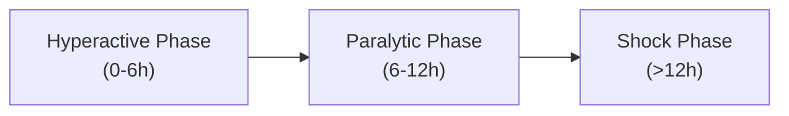
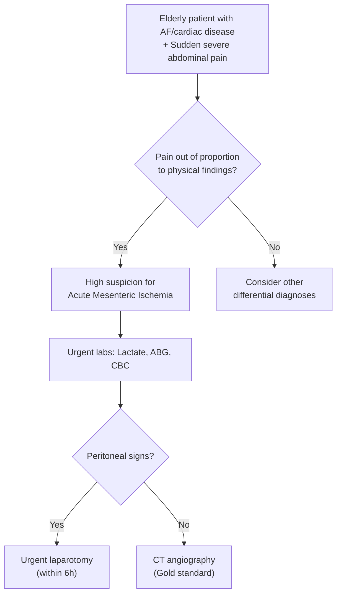

# Intestinal Ischemia

## I. Definition

Intestinal ischemia refers to **any process that reduces intestinal blood flow** below the threshold required to maintain cellular viability, leading to tissue hypoxia and, if uncorrected, transmural necrosis of the bowel wall [1][2]. The name itself is instructive:

- "Intestinal" = relating to the intestine (Latin *intestinum*)
- "Ischemia" = from Greek *ischein* (to hold back) + *haima* (blood) — literally "holding back blood"

So intestinal ischemia is the bowel being starved of its blood supply.

***Intestinal ischemia can progress to sepsis, peritonitis, free intraabdominal air, bowel infarction, gangrene, and death*** [1].

<Callout title="Key Conceptual Framework">
Think of intestinal ischemia as a spectrum — from reversible mucosal injury (early) to irreversible transmural necrosis and perforation (late). The clinical challenge is that **early signs are deceptively subtle** (pain without peritonism), while by the time peritoneal signs develop, the bowel is often already dead.
</Callout>

### Classification

Intestinal ischemia is classified along **two axes** [1][2]:

**By anatomical segment affected:**
- ***Small bowel ischemia*** = **Mesenteric ischemia** (SMA territory predominantly)
- ***Large bowel ischemia*** = **Colonic ischemia / Ischaemic colitis** (IMA territory predominantly)

**By time course:**
- ***Acute mesenteric ischemia*** — sudden onset of intestinal hypoperfusion due to occlusive or non-occlusive obstruction of arterial supply or venous outflow
- ***Chronic mesenteric ischemia*** — develops in patients with mesenteric atherosclerosis, causing episodic intestinal hypoperfusion related to eating ("mesenteric angina")

---

## II. Epidemiology

- Accounts for approximately **0.1% of all hospital admissions**, but carries a **disproportionately high mortality** (50–80% for acute mesenteric ischemia if not treated promptly) [1][2]
- **Ischaemic colitis** is the **most common form** of intestinal ischemia overall, and the most common cause of colonic ischemia
- Acute mesenteric ischemia (AMI) is less common but far more lethal

### Demographics
- ***Majority of patients are > 60 years old*** — reflecting the high prevalence of atherosclerosis, AF, and cardiac disease in this age group [2][3]
- Female predominance for ischaemic colitis; roughly equal gender distribution for acute mesenteric ischemia
- In Hong Kong, the ageing population and high prevalence of cardiovascular risk factors (hypertension, diabetes, smoking) make intestinal ischemia an increasingly important diagnosis

### Risk Factors [1][2][3]

| Category | Risk Factors | Mechanism |
|---|---|---|
| ***Cardiac disease*** | AF, valvular disease, recent MI, LV aneurysm, heart failure | AF → stasis in LA → thrombus → embolism; HF → low CO → splanchnic hypoperfusion |
| ***Peripheral artery disease (PAD)*** | Atherosclerosis of celiac/SMA/IMA | Chronic stenosis predisposes to acute thrombotic occlusion |
| ***Aortic surgery/instrumentation*** | Cardiac catheterization, aortography, EVAR | Atheroembolism or dislodgement of thrombus during manipulation |
| ***Hereditary/acquired thrombophilia*** | Factor V Leiden, protein C/S deficiency, APLS, malignancy | Predisposes to mesenteric venous thrombosis |
| ***Hernia/Volvulus/Overdistension*** | Incarcerated hernia, volvulus, adhesive bowel obstruction | Mechanical compression of vessels → both arterial and venous occlusion |
| ***Infection/Inflammation*** | Intra-abdominal sepsis, IBD | Mesenteric venous thrombosis; mycotic aneurysm → thrombosis |
| ***Hypovolemia*** | Hemorrhage, dehydration, septic shock | Reduced circulating volume → reflex splanchnic vasoconstriction |
| ***Vasoconstrictive medications*** | Digoxin, diuretics, vasopressors, cocaine, ergotamines | Direct splanchnic vasoconstriction → NOMI |
| ***Hemodialysis*** | Intradialytic hypotension | Low-flow state → non-occlusive ischemia |
| ***Smoking, HT, HL, DM*** | Classic atherosclerotic risk factors | Accelerated atherosclerosis → stenosis → thrombosis |

<Callout title="Why are cardiac patients at such high risk?" type="idea">
Three mechanisms converge: (1) AF/valvular disease → embolism; (2) Heart failure → low cardiac output → splanchnic hypoperfusion; (3) Medications used to treat cardiac disease (digoxin, diuretics, vasopressors) → direct mesenteric vasoconstriction. A patient in cardiogenic shock on multiple inotropes is the classic setup for NOMI.
</Callout>

---

## III. Anatomy and Function of Intestinal Blood Supply

Understanding the vascular anatomy is absolutely essential because it explains *where* ischemia hits, *why* certain watershed zones are vulnerable, and *how* collaterals protect (or fail to protect) the bowel.

### A. Arterial Supply

The gut receives its blood from **three major aortic branches** [1]:

| Artery | Territory | Key Branches |
|---|---|---|
| **Celiac trunk** (T12) | Foregut: distal esophagus → proximal duodenum (to ampulla of Vater), liver, spleen, pancreas | Left gastric, splenic, common hepatic |
| ***Superior Mesenteric Artery (SMA)*** (L1) | Midgut: distal duodenum → proximal 2/3 of transverse colon | Inferior pancreaticoduodenal, jejunal, ileal, ileocolic, right colic, middle colic |
| ***Inferior Mesenteric Artery (IMA)*** (L3) | Hindgut: distal 1/3 of transverse colon → proximal rectum | Left colic, sigmoid arteries, superior rectal |

> ***The SMA supplies the entire small intestine EXCEPT the proximal duodenum*** [1]. This is why SMA occlusion is devastating — it takes out most of the absorptive surface.

### B. Collateral Circulation

The intestine has a rich network of collaterals, which is both a strength (protective) and a weakness (watershed zones):

- **Pancreaticoduodenal arcades** — connect celiac trunk ↔ SMA
- ***Marginal artery of Drummond*** — runs along the mesenteric border of the colon, connecting SMA ↔ IMA branches
- **Arc of Riolan (meandering mesenteric artery)** — a more central connection between SMA and IMA (present in some but not all individuals)

### C. Watershed Zones (Critical Vulnerability Points)

These are areas where two end-arterial territories meet with tenuous anastomoses. They are the *first* to become ischemic during systemic hypoperfusion:

1. ***Griffith's point*** — at the **splenic flexure** [1][2]
   - This is the point where the terminal branches of the SMA (via middle colic artery) and IMA (via ascending branch of left colic artery) meet
   - The anastomotic bridging here is often weak or absent in some individuals
   - **Why it matters:** The splenic flexure is the most common site of ischaemic colitis

2. ***Sudeck's point*** — at the **rectosigmoid junction** [1][2]
   - Where the descending branch of the left colic artery (IMA territory) forms an anastomosis with the superior rectal artery
   - Terminal narrow branches make this area vulnerable
   - **Why it matters:** Relevant during anterior resection — the surgeon must ensure adequate blood supply to the rectal stump

<Callout title="Watershed Zones — Exam Favourite" type="error">
Students often confuse Griffith's and Sudeck's points. Remember: **Griffith's = splenic flexure** (where SMA meets IMA territory), **Sudeck's = rectosigmoid junction** (where sigmoid artery meets superior rectal artery). Both are vulnerable in NOMI and systemic hypotension.
</Callout>

### D. Venous Drainage

- ***Venous drainage parallels arterial circulation*** [1]
- Drains into the **portal venous system**: SMV + splenic vein → portal vein → liver
- IMV drains into splenic vein (or SMV directly)
- Venous thrombosis causes outflow obstruction → increased intramural pressure → bowel wall edema → hemorrhagic infarction

### E. Normal Physiology of Splanchnic Circulation [1]

- ***Splanchnic circulation receives 10–35% of cardiac output*** — 10% fasting, up to 35% postprandially
- After eating, blood flow increases to meet the metabolic demands of digestion and absorption
- **Intrinsic autoregulation** redirects blood from the gut to brain/heart during systemic hypotension — this is a *survival* mechanism but makes the gut a sacrificial organ in shock states
- Capillary density in the intestinal vasculature is high, but **intestinal oxygen extraction is relatively low** under normal conditions
  - Why? Because the gut must let oxygen-rich blood pass through to the liver via the portal vein — the liver has its own high metabolic demand
  - This means the intestine has a **reserve** of oxygen extraction it can tap into during mild ischemia

---

## IV. Pathophysiology

### A. Thresholds of Ischemia [1]

- ***Intestinal blood flow must be reduced by > 50% from the normal fasting level before oxygen delivery becomes compromised***
- The intestine can compensate for up to **~75% reduction** in mesenteric blood flow for **up to 12 hours** without substantial injury, through:
  - Vasodilation of collateral vessels
  - Increased oxygen extraction from remaining blood flow
- Beyond this compensation threshold → tissue hypoxia → injury

### B. Two-Phase Injury Model [1][2]

Intestinal injury results from **both ischemia AND reperfusion** — in fact, reperfusion injury may cause more damage than the initial ischemic insult.

**Phase 1: Ischemic (Hypoxic) Injury**
- Insufficient oxygen and nutrients for cellular metabolism
- Mucosal cells (which have the highest metabolic rate and sit at the tips of villi) are affected first
- ATP depletion → failure of Na⁺/K⁺-ATPase → cellular swelling → loss of mucosal barrier integrity
- Bacterial translocation across compromised mucosa → systemic inflammatory response
- Mucosa sloughs → bloody diarrhea/PR bleeding

**Phase 2: Reperfusion Injury** [2]
- Occurs when blood flow is restored after a period of ischemia
- ***↑ ROS (reactive oxygen species)*** from the sudden increase in O₂ supply to cells that have accumulated hypoxanthine during ischemia
- ***↑ Inflammation*** from the influx of leukocytes and complement activation
- Paradoxically, restoring blood flow can worsen tissue damage
- This is why there is a "window" for revascularization — too late, and reperfusion may cause more harm than good

**Phase 3: Prolonged Ischemia** [1]
- ***Progressive vasoconstriction*** develops in the obstructed vascular bed, increasing pressure and reducing collateral flow
- ***Vasoconstriction persists even after blood flow is restored*** — a vicious cycle
- Persistent ischemia → full-thickness (transmural) necrosis → perforation → peritonitis → sepsis → death

### C. Clinical Phases of Ischemic Bowel [2]

This maps to what you see at the bedside:

1. ***Hyperactive phase*** — Bowel initially responds to ischemia with hyperperistalsis → severe crampy pain, vomiting, diarrhea (may be bloody). **Pain is out of proportion to physical findings** because the bowel wall is not yet necrotic/perforated.
2. ***Paralytic phase*** — Peristalsis ceases as the bowel wall musculature becomes injured → absent bowel sounds, increasing distension
3. ***Shock phase*** — Fluid leaks through the damaged bowel wall → third-spacing → hypovolemia → sepsis → multi-organ failure

<Callout title="The Deadly Triad">
***Acute abdomen + metabolic acidosis = ischaemic bowel until proven otherwise*** [2]. This is a clinical pearl you must never forget. The combination of severe abdominal pain with lactic acidosis (reflecting anaerobic metabolism from tissue hypoxia) should trigger immediate workup for mesenteric ischemia.
</Callout>

### D. Pathophysiology by Mechanism of Ischemia

| Mechanism | Pathophysiology | Typical Patient | Key Features |
|---|---|---|---|
| ***Arterial embolism (50%)*** | Thrombus from LA/LV/valves/aorta dislodges → lodges at SMA bifurcation points (usually 3-8cm from SMA origin, distal to middle colic branch) | ***Elderly with AF***, recent MI, valvular disease | ***Sudden, severe periumbilical pain***; lodges distally → relatively less extensive but abrupt onset; often "normal-looking" proximal jejunum |
| ***Arterial thrombosis (15-25%)*** | Acute thrombosis superimposed on chronic atherosclerotic plaque in SMA (usually at ostium/proximal segment) | Patient with PVD, cardiovascular risk factors, prior postprandial pain | More proximal occlusion → more extensive ischemia; may have history of chronic mesenteric ischemia ("mesenteric angina") |
| ***Venous thrombosis (5%)*** | MVT → increased venous resistance → bowel wall edema → hemorrhagic infarction | Younger patients, hypercoagulable states, malignancy, recent abdominal surgery, portal hypertension | Insidious onset, pain waxes and wanes over days; hemorrhagic rather than ischemic infarction pattern |
| ***Non-occlusive mesenteric ischemia (NOMI)*** | Splanchnic vasoconstriction in low-flow states → diffuse/segmental ischemia | ICU patient on vasopressors, severe cardiac disease, post-cardiac surgery | Affects ***watershed zones*** (splenic flexure, rectosigmoid junction); variable/diffuse pain; often diagnosed late |

<Callout title="Embolism vs Thrombosis — Why it Matters" type="idea">
***Emboli lodge distally*** (past the takeoff of the middle colic artery) → the proximal jejunum is often spared. ***Thrombosis occurs proximally*** (at the SMA ostium where the atheroma is) → more extensive ischemia involving the entire SMA territory. This distinction affects both the extent of bowel at risk and the surgical approach.
</Callout>

---

## V. Etiology

### A. Causes of Intestinal Ischemia — Comprehensive Summary [1][2][3]

#### 1. Acute Mesenteric Ischemia

| Category | Cause | Proportion | Details |
|---|---|---|---|
| **Occlusive** | ***Arterial embolism*** | **~50%** | Most commonly from cardiac source: ***AF*** (most common), post-MI mural thrombus, valvular heart disease, proximal aortic atheroma/aneurysm |
| | ***Arterial thrombosis*** | **~15–25%** | Superimposed on chronic atherosclerotic plaque; also: aortic/mesenteric dissection, thrombosed mesenteric aneurysm, abdominal trauma, abdominal infection |
| | ***Venous thrombosis*** | **~5%** | Idiopathic (hypercoagulable states: Factor V Leiden, protein C/S deficiency, APLS); secondary (malignancy, portal hypertension, prior abdominal surgery, pancreatitis, cirrhosis) |
| **Non-occlusive** | ***NOMI*** | **~20–30%** | ***Splanchnic hypoperfusion and vasoconstriction*** from low CO (cardiogenic shock, post-cardiac surgery), hypovolemia, sepsis; drugs: ***digoxin, diuretics***, vasopressors, cocaine |

#### 2. Chronic Mesenteric Ischemia
- Almost exclusively due to ***atherosclerosis*** of the celiac trunk, SMA, and/or IMA [2]
- Usually requires **≥2 of the 3 major mesenteric vessels** to be significantly stenosed (due to robust collateral network)
- Less common causes: median arcuate ligament syndrome (celiac artery compression), vasculitis (Takayasu, PAN), fibromuscular dysplasia

#### 3. Ischaemic Colitis
- Most commonly **non-occlusive** (related to systemic hypoperfusion affecting watershed zones)
- Can be caused by any of the above mechanisms when the colon is the target
- ***Extrinsic causes***: strangulating hernia, volvulus [2]

### B. Hong Kong-Relevant Considerations
- High prevalence of **hypertension, diabetes, and smoking** in the elderly Hong Kong population → significant burden of atherosclerotic mesenteric disease
- AF prevalence is rising with the ageing population → increasing embolic risk
- Post-cardiac surgery patients in ICU settings → NOMI risk
- Renal failure patients on haemodialysis → intradialytic hypotension → NOMI

---

## VI. Classification

### A. By Anatomical Territory

| | Mesenteric Ischemia | Colonic Ischemia (Ischaemic Colitis) |
|---|---|---|
| **Vessel** | SMA (± celiac trunk) | IMA (± SMA) |
| **Segment** | Small bowel (± right colon) | Large bowel (splenic flexure, rectosigmoid junction most common) |
| **Severity** | Typically severe; high mortality | Usually milder; often self-limiting |
| **Presentation** | Severe pain out of proportion, late bleeding | Mild pain with early bloody diarrhea |

### B. By Time Course

| | Acute | Chronic |
|---|---|---|
| **Onset** | Minutes to hours | Weeks to months |
| **Mechanism** | Embolism, thrombosis, venous thrombosis, NOMI | Atherosclerotic stenosis (usually ≥2 vessels) |
| **Clinical** | Acute abdomen, metabolic acidosis | Postprandial pain, sitophobia, weight loss |

### C. By Mechanism (Most Clinically Useful)

1. ***Occlusive mesenteric ischemia***
   - Arterial embolism
   - Arterial thrombosis
   - Venous thrombosis
2. ***Non-occlusive mesenteric ischemia (NOMI)***
3. ***Chronic mesenteric ischemia***
4. ***Mechanical*** (volvulus, hernia) [3]

### D. Colon Ischemia Severity Classification (Brandt and Boley / AGA)

| Grade | Description |
|---|---|
| **Reversible** (transient) | Mucosal/submucosal ischemia; resolves spontaneously |
| **Stricture** | Chronic ischemic injury → fibrosis → stricture formation |
| **Gangrenous** | Full-thickness necrosis → perforation risk; requires surgery |

---

## VII. Clinical Features

### A. Symptoms

The clinical presentation varies by the mechanism, acuity, and segment of bowel involved. The unifying theme is that **early ischemia causes severe pain with deceptively few findings** — then things deteriorate rapidly.

#### 1. Abdominal Pain — ***THE cardinal symptom*** [1][2][3]

- ***MOST common presenting symptom in intestinal ischemia*** [1]
- ***Classical description: "Abdominal pain out of proportion to physical examination"*** [1][2]
  - **Why?** In early ischemia, the bowel is in agony (visceral pain from ischemic smooth muscle spasm and mucosal injury) but the peritoneum is not yet involved (no peritonitis, so minimal tenderness on palpation). The disconnect between the patient screaming in pain and a relatively soft, non-tender abdomen is the hallmark.
  - Once transmural necrosis and perforation develop → peritonitis → now the signs "catch up" with the symptoms, but by then it's often too late.

**Pattern by etiology:**

| Etiology | Pain Character | Pathophysiological Basis |
|---|---|---|
| ***Arterial embolism*** | ***Sudden, severe, periumbilical pain*** with nausea and vomiting | Acute complete occlusion → immediate ischemia of a large segment of midgut; periumbilical because SMA territory = midgut = referred to periumbilical region via T10 dermatome |
| ***Arterial thrombosis*** | ***Worsened postprandial pain*** (may have prior history of chronic mesenteric angina) | Chronic stenosis means the patient could barely cope at baseline; after eating, the intestine demands more blood (functional hyperemia) but the thrombosed artery cannot deliver → ischemic pain |
| ***Venous thrombosis*** | ***Insidious onset, waxes and wanes*** over days to weeks before diagnosis | Gradual venous outflow obstruction → slowly progressive edema and ischemia; not the sudden "thunderclap" of arterial occlusion |
| ***NOMI*** | ***Variable in severity and location*** | Diffuse low-flow → patchy ischemia; may be masked by the patient's underlying critical illness and sedation in ICU |
| ***Chronic mesenteric ischemia*** | ***Postprandial pain ("mesenteric angina") → fear of eating (sitophobia) → weight loss*** [2] | Analogous to angina pectoris: at rest, collateral flow is sufficient; with the increased demand of digestion, the stenosed vessels cannot deliver → ischemic pain 15–30 min after eating, lasting 1–3 hours |

#### 2. PR Bleeding / Bloody Diarrhea [1][2]

- ***Typically develops within 24 hours of onset of abdominal pain*** [1]
- ***More common and earlier in colonic ischemia*** than mesenteric ischemia [1]
- **Mechanism:** Mucosal ischemia → mucosal sloughing and ulceration → bleeding into the lumen. The mucosa is the first layer to die (highest metabolic rate, furthest from serosal blood supply — the "countercurrent" oxygen exchange in villi makes villous tips particularly vulnerable)
- In mesenteric ischemia, bleeding is ***uncommon in early stages*** [1] — it appears later as transmural necrosis progresses

#### 3. Nausea and Vomiting [1]

- Common early symptom, especially with arterial embolism
- **Mechanism:** Visceral afferent stimulation from ischemic bowel → vagal activation → nausea/vomiting center in medulla. Also reflects the acute periumbilical pain → reflex vomiting.

#### 4. Diarrhea (Non-Bloody Initially)

- Early ischemia causes hyperperistalsis (hyperactive phase) → diarrhea
- **Mechanism:** The ischemic bowel initially "spasms" — smooth muscle irritability from hypoxia and local inflammatory mediators → increased motility → diarrhea

#### 5. Chronic Symptoms (Chronic Mesenteric Ischemia)

- ***Postprandial abdominal pain ("mesenteric angina")*** — typically 15–30 min after eating, lasting 1–3 hours [2]
- ***Sitophobia*** (fear of eating) — patients learn to avoid food because eating causes pain → **significant weight loss** [2]
- ***Weight loss*** — from both reduced intake (sitophobia) and malabsorption (chronically ischemic mucosa cannot absorb nutrients efficiently)

### B. Signs

#### 1. Early Signs (Hyperactive Phase)

| Sign | Finding | Pathophysiological Basis |
|---|---|---|
| **Abdominal examination** | ***Diffuse tenderness but LACK OF PERITONEAL SIGNS*** early on | Ischemia is visceral (not somatic) initially; peritoneum not yet involved |
| | Abdomen may be **soft and non-distended** initially | No perforation yet; no ileus yet |
| **Bowel sounds** | Initially hyperactive (borborygmi) | Ischemic smooth muscle spasm → hyperperistalsis |
| **Vital signs** | May be relatively normal initially | Compensation phase |

#### 2. Late Signs (Paralytic and Shock Phases)

| Sign | Finding | Pathophysiological Basis |
|---|---|---|
| ***Peritonism*** | Guarding, rigidity, rebound tenderness | Transmural necrosis → perforation → peritoneal contamination |
| **Absent bowel sounds** | Silent abdomen | Bowel wall musculature infarcted → paralytic ileus [2] |
| **Abdominal distension** | Progressive distension | Paralytic ileus → gas and fluid accumulation |
| ***Shock*** | Hypotension, tachycardia, oliguria | Fluid third-spacing through damaged bowel wall + sepsis from bacterial translocation [2] |
| ***Fever*** | Pyrexia | Necrotic tissue + bacterial translocation → SIRS/sepsis |
| **Altered consciousness** | Confusion, obtundation | Septic encephalopathy, hypoperfusion |

<Callout title="The Clinical Tragedy of Mesenteric Ischemia" type="error">
The window between "pain out of proportion to findings" (when the bowel is still salvageable) and "peritonitis + shock" (when the bowel is dead) may be as short as **6–12 hours**. This is why a high index of suspicion in the right clinical setting (elderly + AF + sudden abdominal pain) is literally life-saving. By the time you have peritoneal signs, mortality exceeds 70%.
</Callout>

### C. Comparison: Acute Mesenteric vs. Acute Colonic Ischemia [1]

| Feature | Acute Mesenteric Ischemia | Acute Colonic Ischemia |
|---|---|---|
| **Age** | Varies with etiology | ***Majority > 60 years old*** |
| **Precipitating factors** | ***Acute precipitating cause is typical*** (AF, recent MI, cardiac surgery) | Acute precipitating cause is rare |
| **General condition** | ***Severely ill*** | Not severely ill |
| **Abdominal pain** | ***Severe; tenderness NOT prominent early*** | ***Mild; tenderness IS present*** |
| **Bleeding** | ***Uncommon in early stage*** | ***Common — rectal bleeding or bloody diarrhea*** |
| **Investigations** | MRA / MDCT angiography | Colonoscopy (after initial stabilization) |

### D. Special Clinical Scenarios

#### Embolism vs. Thrombosis — Clinical Differentiation

| Feature | Embolism | Thrombosis |
|---|---|---|
| **Onset** | ***Hyperacute (seconds to minutes)*** | ***Acute (hours to days)*** |
| **History** | ***AF, recent MI, valvular disease*** | Chronic abdominal angina, PVD, cardiovascular risk factors |
| **Contralateral findings** | Other embolic events possible (limb ischemia, stroke) | Evidence of generalized atherosclerosis |
| **SMA pulse (at surgery)** | ***Proximal SMA pulse PRESENT*** (embolus lodges distally) | ***Proximal SMA pulse ABSENT*** (thrombosis at ostium) |

#### Assessment of Bowel Viability (Intraoperative) [2]

At laparotomy, the surgeon must determine which bowel is viable and which must be resected. Criteria for viability:

- ***Pink serosa*** (not dusky/black)
- ***Visible peristalsis***
- ***Mesenteric pulsation*** palpable
- ***Bleeding from marginal arteries*** when cut
- Intraoperative Doppler USG
- Fluorescein injection → Wood's lamp examination (viable bowel fluoresces)

---

## VIII. Summary of Clinical Approach

<Callout title="High Yield Summary">

**Definition:** Intestinal ischemia = reduced intestinal blood flow → tissue hypoxia → necrosis if untreated.

**Classification:** By segment (mesenteric vs colonic), time course (acute vs chronic), mechanism (occlusive vs non-occlusive).

**Anatomy:**
- SMA supplies entire small bowel except proximal duodenum
- Watershed zones: ***Griffith's point (splenic flexure)*** and ***Sudeck's point (rectosigmoid junction)*** — most vulnerable to ischemia
- Splanchnic circulation receives 10–35% of CO; can compensate for 75% reduction for up to 12h

**Etiology (Acute):**
- Arterial embolism (50%) — AF most common source
- Arterial thrombosis (15–25%) — atherosclerosis, acute-on-chronic
- Venous thrombosis (5%) — hypercoagulable states
- NOMI (20–30%) — low-flow states, vasoconstrictors

**Pathophysiology:** Ischemic injury + reperfusion injury (ROS, leukocyte infiltration). Three clinical phases: hyperactive → paralytic → shock.

**Clinical Features:**
- ***"Pain out of proportion to physical examination"*** = classic early finding
- Embolism: sudden, severe periumbilical pain in patient with AF
- Thrombosis: postprandial pain with cardiovascular risk factors
- Venous: insidious waxing/waning pain
- NOMI: variable, often in ICU patients on vasopressors
- Chronic: mesenteric angina → sitophobia → weight loss
- ***Acute abdomen + metabolic acidosis = ischaemic bowel until proven otherwise***
- Late signs: peritonitis, absent bowel sounds, shock = bowel already dead

**Key Risk Factors:** AF, cardiac disease, atherosclerosis, aortic surgery, hypercoagulable states, vasoconstrictive drugs, hypovolemia, hemodialysis.

</Callout>

---

<ActiveRecallQuiz
  title="Active Recall - Intestinal Ischemia (Definition, Epidemiology, Anatomy, Etiology, Pathophysiology, Clinical Features)"
  items={[
    {
      question: "What is the classical clinical description of acute mesenteric ischemia and why does it occur?",
      markscheme: "Pain out of proportion to physical examination. Occurs because early ischemia causes severe visceral pain (ischemic smooth muscle spasm) but peritoneum is not yet involved (no peritoneal signs). By the time peritoneal signs develop, transmural necrosis/perforation has occurred.",
    },
    {
      question: "Name the two watershed zones of the colon, their anatomical locations, and the arterial territories that meet at each.",
      markscheme: "1. Griffith's point at the splenic flexure (SMA via middle colic artery meets IMA via left colic artery). 2. Sudeck's point at the rectosigmoid junction (sigmoid artery meets superior rectal artery from IMA). Both are vulnerable in NOMI and systemic hypoperfusion.",
    },
    {
      question: "List the four major causes of acute mesenteric ischemia with their approximate proportions.",
      markscheme: "1. Arterial embolism (50%) - cardiac source, especially AF. 2. Arterial thrombosis (15-25%) - superimposed on atherosclerosis. 3. Venous thrombosis (5%) - hypercoagulable states. 4. Non-occlusive mesenteric ischemia / NOMI (20-30%) - low-flow states, vasoconstrictors.",
    },
    {
      question: "Explain the two-phase injury model in intestinal ischemia. Why can reperfusion be paradoxically harmful?",
      markscheme: "Phase 1: Ischemic injury - ATP depletion, loss of mucosal barrier, bacterial translocation. Phase 2: Reperfusion injury - sudden oxygen supply generates reactive oxygen species (ROS) via accumulated hypoxanthine; influx of leukocytes and complement activation cause further tissue damage. Reperfusion can cause more harm than the initial ischemia.",
    },
    {
      question: "How do you clinically differentiate an arterial embolism from an arterial thrombosis as the cause of acute mesenteric ischemia?",
      markscheme: "Embolism: hyperacute onset (seconds-minutes), AF or cardiac source identifiable, proximal SMA pulse present at surgery (embolus lodges distally), no prior chronic symptoms. Thrombosis: acute onset (hours-days), history of chronic postprandial pain and PVD/cardiovascular risk factors, absent proximal SMA pulse (thrombosis at ostium), more extensive ischemia.",
    },
    {
      question: "What bedside clinical triad should immediately raise suspicion for ischaemic bowel?",
      markscheme: "Acute abdomen plus metabolic acidosis (raised lactate, high anion gap metabolic acidosis on ABG) equals ischaemic bowel until proven otherwise. Especially in elderly with AF or cardiovascular disease.",
    },
  ]}
/>

## References

[1] Senior notes: felixlai.md (Intestinal Bowel Ischemia section)
[2] Senior notes: maxim.md (Ischemic bowel disease section)
[3] Lecture slides: GC 195. Lower and diffuse abdominal pain RLQ problems; pelvic inflammatory disease; peritonitis and abdominal emergencies.pdf (p31-32)
