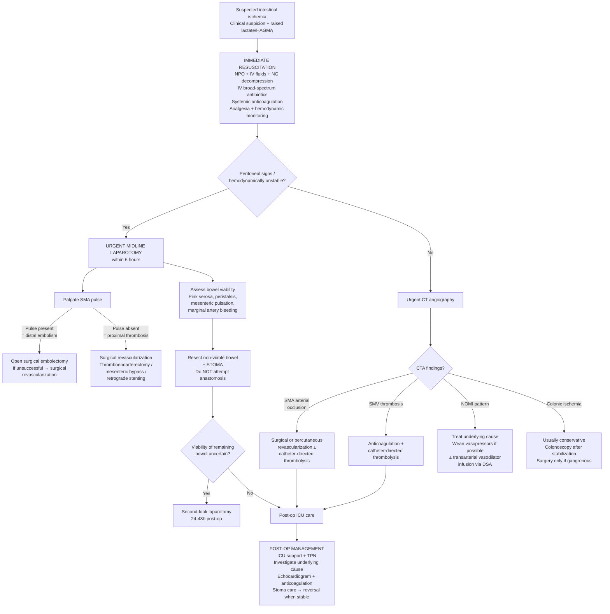

## Management of Intestinal Ischemia

The management of intestinal ischemia is fundamentally a **race against time**. Every hour of delay increases the amount of bowel that dies, and once bowel is dead, the only option is resection. The overarching principle is:

> ***Treatment is resuscitation, resect non-viable bowel*** [3]

This is deceptively simple but captures the essence: stabilize the patient, restore blood flow if possible, and remove what cannot be saved. Let's break this down systematically.

---

### I. Master Management Algorithm

---

### II. Initial Resuscitation — ALL Patients

Regardless of the subtype or severity, **every patient with suspected intestinal ischemia** receives the same initial stabilization. The rationale for each step flows directly from the pathophysiology:

| Intervention | Rationale (First Principles) | Details |
|---|---|---|
| ***NPO (Nil per os)*** [1][10] | Ischemic bowel cannot absorb nutrients; eating increases mesenteric oxygen demand → worsens ischemia; reduces aspiration risk for potential surgery | Strict fasting from the moment of suspicion |
| ***IV fluid resuscitation*** [1][10] | Fluid third-spacing through damaged bowel wall → intravascular depletion → hypovolemia worsens splanchnic perfusion; vomiting adds to losses | Crystalloids (normal saline, Hartmann's solution); aggressive volume replacement; target adequate urine output ( > 0.5 mL/kg/h) |
| ***Gastrointestinal decompression (NG tube)*** [1][10] | Paralytic ileus → gas and fluid accumulate → increased intraluminal pressure → further compromises bowel wall perfusion (a vicious cycle); decompression breaks this cycle | ***NG tube placed on free drainage with 4-hourly aspiration*** [10]; also reduces aspiration risk during anaesthetic induction |
| ***Hemodynamic monitoring and support*** [1] | Need to maintain adequate MAP to perfuse the mesenteric circulation; shock state must be corrected | Arterial line, central venous access, urinary catheter for I/O charting; judicious use of inotropes (but avoid excessive vasopressors that worsen splanchnic vasoconstriction) |
| ***Correction of electrolyte abnormalities*** [1] | Vomiting → loss of H⁺, Na⁺, K⁺, Cl⁻ → metabolic alkalosis and hypokalemia; third-spacing → further electrolyte derangements | Guided by ABG and LRFT results |
| ***Pain control*** [1] | Ischemic bowel causes excruciating visceral pain; uncontrolled pain → sympathetic activation → further splanchnic vasoconstriction | ***Parenteral opioids*** [1] (IV morphine titrated to effect); avoid meperidine in renal failure |
| ***IV broad-spectrum antibiotics*** [2] | Ischemic mucosa loses barrier function → bacterial translocation from gut lumen into systemic circulation → sepsis; prophylaxis against peritonitis if perforation occurs | ***Broad-spectrum antibiotics*** [1][2] covering gram-negatives and anaerobes (e.g., IV ceftriaxone + metronidazole, or piperacillin-tazobactam) |
| ***Systemic anticoagulation*** [1][2] | ***Prevents further propagation of thrombus*** into unaffected vascular bed; ***inhibits thrombosis distally*** in arterial and venous systems due to low flow (stasis) [11] | ***IV heparin bolus followed by continuous heparin infusion*** [11]; target ***APTT 2–2.5× normal*** [11]; indicated in arterial embolism, arterial thrombosis, venous thrombosis, AND NOMI [1]; **contraindicated if active bleeding** (e.g., significant PR hemorrhage in ischaemic colitis) [1] |

<Callout title="Why Anticoagulate Everyone?">
***Anticoagulants are indicated in patients with acute intestinal ischemia due to mesenteric arterial or venous occlusion or non-occlusive mesenteric ischemia*** [1]. The logic: even if the primary occlusion is an embolus, the low-flow state distal to it promotes secondary thrombus propagation. Heparin limits this cascade. The only exception is **active hemorrhage** — you don't anticoagulate a patient who is actively bleeding from ischaemic colitis [1].
</Callout>

---

### III. Management by Clinical Stability — The Critical Branch Point

#### A. UNSTABLE Patient (Peritoneal Signs Present)

This patient has transmural necrosis, likely perforation, and is systemically septic. There is no time for CT.

> ***Unstable (with peritoneal signs): urgent midline laparotomy (within 6h)*** [2]

**Why midline laparotomy?**
- Provides the widest possible exposure of the entire abdomen
- Allows assessment of the full length of small and large bowel
- Permits revascularization, resection, and stoma creation in a single operation
- ***Decision on surgery and timing of surgery is important*** [7]; ***high mortality if complications occur*** [7]

**Intraoperative Steps:**

**Step 1: Mesenteric Revascularization** [2]

***Palpate the SMA*** to differentiate embolism from thrombosis — this determines the surgical approach [2]:

| Finding | Diagnosis | Surgical Approach | Why This Approach |
|---|---|---|---|
| ***Present proximal SMA pulse*** | ***Embolism*** (lodged distally, past middle colic artery takeoff) | ***Open surgical embolectomy*** [1][2] → surgical revascularization if unsuccessful | Embolus is a discrete plug that can be physically extracted via arteriotomy + Fogarty balloon catheter; the vessel proximal to it is healthy |
| ***Absent SMA pulse*** | ***Thrombosis*** (at SMA ostium, superimposed on atherosclerotic plaque) | ***Surgical revascularization*** [2]: thromboendarterectomy, mesenteric bypass, or retrograde stenting | The vessel itself is diseased; simple embolectomy won't work because the underlying stenosis remains → need to bypass or re-open the chronically narrowed segment |

<Callout title="Embolectomy vs Revascularization — Why the Distinction Matters" type="idea">
An embolus is like a cork stuck in a healthy pipe — you pull it out (embolectomy) and flow resumes. A thrombosis is like a pipe that has been rusting for years and finally clogs — you need to either clean out the rust (endarterectomy), build a new pipe around it (bypass), or force it open from inside (stenting). Palpating the SMA pulse tells you which scenario you're dealing with.
</Callout>

**Step 2: Assessment of Bowel Viability** [2]

After restoring blood flow, the surgeon must determine which bowel is salvageable:

| Criterion | Viable Bowel | Non-Viable Bowel |
|---|---|---|
| **Colour** | ***Pink serosa*** [2]; dark colour becomes lighter [10] | Dark colour persists; dusky/black/gangrenous [10] |
| **Peristalsis** | ***Visible peristalsis*** [2]; firm intestinal musculature [10] | No peristalsis; flaccid, paper-thin wall [10] |
| **Mesenteric vessels** | ***Mesenteric pulsation*** palpable [2]; ***bleeding from marginal arteries*** when cut [2] | No detectable pulsation; no bleeding from cut edge [10] |
| **Advanced techniques** | ***Intra-operative Doppler USG*** [2]: detects residual flow | No flow detected |
| | ***Fluorescein injection → Wood's lamp*** [2]: viable bowel fluoresces green | Non-viable bowel stays dark under UV |

**Step 3: Resection and Stoma** [2]

- ***Resect non-viable bowels + stoma*** [2]
- ***Do NOT attempt primary anastomosis*** [2]
  - **Why?** Ischemic tissue has poor healing capacity. Anastomotic leak risk is extremely high in the setting of contamination, sepsis, hemodynamic instability, and uncertain viability of remaining bowel edges. An anastomotic leak in this context is frequently fatal.
  - Risk factors for anastomotic leak: ***ischaemia, tension, active infection*** [12]
- Stoma creation (ileostomy or jejunostomy) allows bowel to decompress and heal; can be reversed electively when the patient is stable

<Callout title="Why No Anastomosis?" type="error">
This is a critical exam point. Students sometimes wonder why you can't just resect and reconnect. The answer is that ***ischaemia*** is the number one risk factor for ***anastomotic leak*** [12]. In a septic, unstable patient with questionable bowel viability at the resection margins, attempting an anastomosis is inviting disaster. Stoma now, anastomosis later.
</Callout>

**Step 4: Second-Look Laparotomy** [2]

- ***Second-look laparotomy 24–48h after*** initial operation [2]
- **Indication:** If the extent of bowel viability is uncertain at the first operation
- **Rationale:** After revascularization, it takes 24–48h for the full effects of reperfusion to declare themselves. Some borderline bowel may recover (save it); some may declare as necrotic (resect it). This staged approach minimizes both unnecessary resection (short bowel syndrome) and retained dead bowel (ongoing sepsis)
- The decision to perform second-look should be made at the **first operation**, not based on post-op clinical deterioration

> ***High risk of short gut syndrome: diarrhoea, steatorrhea → dehydration, malabsorption, weight loss*** [2]. This is why you conserve every centimetre of viable bowel you can.

---

#### B. STABLE Patient (No Peritoneal Signs)

This patient has ischemia but the bowel is likely not yet transmurally necrotic. There is time for imaging to guide targeted therapy.

> ***Stable (no peritoneal signs): CT scan / angiography → thrombolysis (if no C/I)*** [2]

The management is then determined by the **CTA findings**:

| CTA Finding | Specific Management | Rationale |
|---|---|---|
| ***SMA arterial occlusion*** | ***Surgical or percutaneous revascularization*** [2]; catheter-directed thrombolysis if available and no contraindications [1] | Open or endovascular approach depending on expertise and patient factors; thrombolysis dissolves clot pharmacologically |
| ***SMV thrombosis*** | ***Anticoagulation + catheter-directed thrombolysis*** [2] | Venous thrombosis responds well to anticoagulation alone in many cases; catheter-directed thrombolysis accelerates clot dissolution while minimizing systemic bleeding risk |
| ***NOMI pattern*** | ***Treat underlying cause*** (optimize cardiac output, wean vasopressors) ***± transarterial vasodilator infusion*** [2] | NOMI is caused by splanchnic vasoconstriction → the treatment is to relieve the vasoconstriction (wean vasopressors, optimize CO) and directly dilate mesenteric vessels (papaverine infusion via SMA catheter during angiography) |
| ***Colonic ischemia*** | Usually conservative management; colonoscopy after stabilization; surgery only if gangrenous | Most ischaemic colitis is self-limiting (reversible mucosal injury); only gangrenous colitis requires resection |

##### Thrombolysis — Details [1][2]

- ***Local infusion of thrombolytic agent*** [1] (e.g., tPA — tissue plasminogen activator, or urokinase) via catheter placed directly into the SMA during angiography
- Converts plasminogen → plasmin → dissolves fibrin clot
- **Advantage:** Can dissolve clot without surgery; less invasive
- **Risks:** ***Possible catheter-related embolism to more distal arterial mesenteric branches*** [1]; systemic bleeding; hemorrhagic transformation of ischemic tissue
- **Contraindications to thrombolysis:**
  - Peritoneal signs (need surgery, not thrombolysis)
  - Active bleeding
  - Recent surgery ( < 10 days)
  - Stroke within 2 months
  - Uncontrolled hypertension

##### Endovascular Approaches

| Modality | Indication | Mechanism |
|---|---|---|
| **Catheter-directed thrombolysis** | Stable SMA occlusion without peritoneal signs | Fibrinolytic agent delivered directly to clot via catheter |
| ***Angioplasty and stenting*** [1] | Thrombotic SMA occlusion with underlying atherosclerotic stenosis | Balloon dilates the stenosis; stent maintains patency — addresses both the acute thrombosis and the underlying chronic disease |
| ***Transarterial vasodilator infusion*** | NOMI | Papaverine (smooth muscle relaxant) infused directly into SMA via catheter → reverses splanchnic vasoconstriction |

##### Surgical Revascularization Options

| Procedure | Mechanism | When to Use |
|---|---|---|
| ***Surgical embolectomy*** [1][2] | Arteriotomy in SMA → Fogarty balloon catheter passed distally → inflated and withdrawn to extract embolus | Arterial embolism (pulse present proximally) |
| ***Thromboendarterectomy*** [2] | Open the artery → remove thrombus and diseased intima together | Arterial thrombosis with short-segment disease |
| ***Mesenteric bypass*** [2] | Graft (prosthetic or vein) from aorta to SMA distal to the occlusion | Extensive SMA disease or failed embolectomy/endarterectomy |
| ***Retrograde stenting*** [2] | Open surgical access to SMA → retrograde passage of stent from an intra-abdominal approach | When percutaneous (femoral) access to SMA is technically difficult |

---

### IV. Post-Operative Management [2]

Post-operative care is as critical as the surgery itself:

| Component | Details | Rationale |
|---|---|---|
| ***ICU support*** [2] | Hemodynamic monitoring, ventilatory support, vasopressor management | These patients are critically ill with sepsis and multi-organ dysfunction |
| ***Nutrition: TPN (total parenteral nutrition)*** [2] | IV nutrition bypassing the GI tract entirely | Remaining bowel is recovering from ischemia/reperfusion; cannot absorb enterally initially; must provide calories to support healing |
| ***Second-look laparotomy 24–48h*** [2] | Re-explore abdomen to reassess bowel viability | Described above — critical to minimizing bowel loss while ensuring all dead tissue is removed |
| ***Stoma care*** [2] | Manage output, skin care, patient education | ***Reverse if stable*** [2] — stoma reversal is planned once patient has recovered (usually 3–6 months) |
| ***Investigate and treat underlying cause*** [2] | ***Echocardiogram*** (to identify cardiac embolic source); ***anticoagulation*** (long-term for AF, venous thrombosis, hypercoagulable states); rate/rhythm control for AF | Prevents recurrence; this is what saves the patient long-term |

---

### V. Management of Chronic Mesenteric Ischemia [2]

Chronic mesenteric ischemia is a very different beast — these patients are not acutely dying but have progressive weight loss and disability from postprandial pain.

| Intervention | Details | Rationale |
|---|---|---|
| ***Risk factor modification*** [2] | ***Smoking cessation, antihypertensive, statin*** etc. [2] | Atherosclerosis is the underlying cause; modifiable risk factors must be addressed to slow progression and reduce cardiovascular events |
| ***Endovascular: mesenteric angioplasty with stenting*** [2] | Percutaneous balloon angioplasty + stent deployment in stenosed SMA/celiac/IMA | First-line revascularization in most centres; less invasive than surgery; good short-to-medium term results; risk of restenosis |
| ***Surgical: endarterectomy or bypass*** [2] | Open surgical revascularization | Reserved for failed endovascular therapy, unfavorable anatomy, or long-segment disease; more durable but higher perioperative risk |

---

### VI. Management of Ischaemic Colitis

Most ischaemic colitis is **self-limiting** and does not require surgery. Management is largely conservative.

| Severity | Management | Rationale |
|---|---|---|
| **Mild/Transient** (majority) | IV fluids, NPO, antibiotics, serial abdominal exams; colonoscopy when stable | Mucosal/submucosal ischemia is reversible; bowel recovers with supportive care |
| **Moderate** (stricture formation) | Conservative initially → elective surgery if symptomatic stricture develops | Chronic ischemic injury heals with fibrosis → colonic stricture; may cause obstruction requiring resection |
| **Severe/Gangrenous** (transmural) | Emergency laparotomy → resection of gangrenous colon + stoma | Full-thickness necrosis will not recover; risk of perforation and sepsis; same principles as acute mesenteric ischemia |

---

### VII. Management of Mechanical Causes (Volvulus/Hernia)

These are specific causes of intestinal ischemia with tailored management:

#### Sigmoid Volvulus [2][5]

- **Initial:** NPO, drip and suck, IV antibiotics
- ***Endoscopic decompression (first line)*** [5]: flexible sigmoidoscopy de-rotation with cautious insufflation
  - Success: sudden expulsion of gas and stool → leave rectal tube in-situ for 24h → serial AXR monitoring
- ***Urgent laparotomy*** if: failed endoscopic treatment, signs of ***ischaemic bowel*** (e.g., acidosis, tenderness/guarding/rigidity/rebound), necrotic bowel at endoscopy
  - Sigmoidectomy → primary anastomosis + on-table lavage (if bowel viable and patient stable)
  - ***Emergency Hartmann's operation*** [5]: resection with end colostomy + rectal stump closure (if bowel compromised or patient unstable)
- ***Elective sigmoidectomy*** for young patients or elderly with ***recurrent*** volvulus [5]

#### Caecal Volvulus [5]

- ***Surgery is indicated*** — caecal volvulus is usually ischemic [5]
- ***Right hemicolectomy*** [5] — definitive treatment
- Colonoscopic derotation ± caecopexy — high recurrence rate

#### Strangulated Hernia [6]

- ***Urgent exploration***: assess viability (cold, pulsation, pallor, peristalsis)
- Viable bowel → hernia repair
- Non-viable bowel → ***resection + stoma*** [6]
- ***Manual reduction should not be performed*** [6]: risk of peritonitis from reducing ischaemic bowel into abdomen, risk of reduction "en masse"

---

### VIII. Summary of Indications for Urgent Surgery

***Indications for urgent surgery*** [7]:

- ***Incarcerated, strangulated hernia***
- ***Suspected or proven strangulation***
- ***Peritonitis***
- ***Pneumoperitoneum***
- ***Pneumatosis cystoides intestinalis***
- ***Closed-loop obstruction***
- ***Volvulus with peritoneal signs***

<Callout title="Signs of Resolution (If Managed Conservatively)" type="idea">
For patients managed conservatively (e.g., mild ischaemic colitis, partial obstruction without strangulation), monitor for resolution [7]:
- ***Less abdominal distension***
- ***Reduction of nasogastric output***
- ***Passage of flatus and bowel movement***
- ***Resolution in abdominal X-rays***
If there is ***unresolved obstruction → surgical treatment*** (duration of conservative treatment controversial, usually 48 hours) [7].
</Callout>

---

### IX. Special Considerations

#### Short Bowel Syndrome [2]

- A devastating complication of extensive bowel resection
- ***Diarrhoea, steatorrhea → dehydration, malabsorption, weight loss*** [2]
- Occurs when remaining small bowel is insufficient for adequate absorption (typically < 200 cm of jejunum without colon, or < 100 cm with intact colon)
- Management: TPN initially → gradual enteral feeding as bowel adapts; oral rehydration solutions; anti-diarrhoeals; possible intestinal transplant in severe cases

#### Long-Term Anticoagulation

| Cause | Long-Term Strategy |
|---|---|
| AF → embolism | Lifelong oral anticoagulation (warfarin or DOAC); rate/rhythm control |
| Venous thrombosis + hypercoagulable state | Lifelong anticoagulation; treat underlying condition |
| Thrombotic (atherosclerotic) | Antiplatelet therapy (aspirin ± clopidogrel); statin; risk factor modification |
| NOMI | Treat underlying cardiac disease; avoid/minimize vasoconstrictors |

---

<Callout title="High Yield Summary — Management of Intestinal Ischemia">

**Initial resuscitation (ALL patients):**
- NPO, IV fluids, NG decompression, parenteral opioids, IV broad-spectrum antibiotics, systemic anticoagulation (heparin), hemodynamic monitoring

**Unstable / peritoneal signs → URGENT MIDLINE LAPAROTOMY within 6h:**
1. Palpate SMA: pulse present = embolism → embolectomy; pulse absent = thrombosis → surgical revascularization
2. Assess bowel viability (pink serosa, peristalsis, mesenteric pulsation, marginal artery bleeding, Doppler, fluorescein)
3. Resect non-viable bowel + STOMA (do NOT anastomose)
4. Second-look laparotomy at 24-48h if viability uncertain

**Stable / no peritoneal signs → CT angiography then targeted therapy:**
- SMA occlusion → surgical/percutaneous revascularization ± thrombolysis
- SMV thrombosis → anticoagulation + catheter-directed thrombolysis
- NOMI → treat underlying cause + transarterial vasodilator infusion

**Post-op:** ICU, TPN, second-look, investigate cause (echo, anticoagulation), stoma reversal when stable

**Chronic mesenteric ischemia:** Risk factor modification + endovascular angioplasty/stenting or surgical bypass

**Ischaemic colitis:** Usually conservative; surgery only for gangrenous colitis

**Indications for urgent surgery:** Peritonitis, pneumoperitoneum, pneumatosis, strangulation, closed-loop obstruction, strangulated hernia

</Callout>

---

<ActiveRecallQuiz
  title="Active Recall - Management of Intestinal Ischemia"
  items={[
    {
      question: "Describe the initial resuscitation steps for a patient with suspected acute mesenteric ischemia, and explain the rationale for systemic anticoagulation.",
      markscheme: "NPO (reduce mesenteric demand and aspiration risk), IV fluids (replace third-space losses), NG decompression (reduce intraluminal pressure and aspiration risk), IV broad-spectrum antibiotics (bacterial translocation through ischaemic mucosa), parenteral opioids for pain, hemodynamic monitoring. Systemic anticoagulation with IV heparin prevents further thrombus propagation into unaffected vascular bed and inhibits secondary thrombosis distally due to low-flow stasis. Target APTT 2-2.5x normal. Contraindicated if active bleeding.",
    },
    {
      question: "At laparotomy for acute mesenteric ischemia, how do you differentiate embolism from thrombosis, and how does this change the surgical approach?",
      markscheme: "Palpate the SMA. Present proximal SMA pulse = embolism (lodged distally) → perform open surgical embolectomy using Fogarty catheter. Absent proximal SMA pulse = thrombosis (at ostium) → need surgical revascularization (thromboendarterectomy, mesenteric bypass, or retrograde stenting) because the underlying vessel is diseased and simple clot extraction will not address the stenosis.",
    },
    {
      question: "Why should you NOT attempt primary anastomosis after resecting non-viable bowel in acute mesenteric ischemia? What do you do instead?",
      markscheme: "Ischaemia is the number one risk factor for anastomotic leak. In a septic, haemodynamically unstable patient with contaminated peritoneal cavity and uncertain viability at resection margins, anastomotic leak risk is extremely high and frequently fatal. Instead: create a stoma (ileostomy or jejunostomy). Reverse the stoma electively 3-6 months later when patient has recovered. Plan second-look laparotomy at 24-48h if viability of remaining bowel is uncertain.",
    },
    {
      question: "A stable patient with no peritoneal signs has CT angiography showing patent mesenteric arteries and veins but diffuse bowel wall changes at the splenic flexure. What is the likely diagnosis and how do you manage it?",
      markscheme: "Likely NOMI (non-occlusive mesenteric ischemia) affecting the watershed zone at the splenic flexure (Griffiths point). Patent vessels with bowel wall changes = vasoconstriction, not occlusion. Management: treat underlying cause (optimize cardiac output, wean vasopressors, correct hypovolemia), consider transarterial vasodilator infusion (papaverine via SMA catheter during angiography), supportive care with antibiotics and anticoagulation. Surgery only if peritoneal signs develop.",
    },
    {
      question: "List the indications for urgent surgery in the setting of intestinal ischemia or obstruction.",
      markscheme: "Incarcerated or strangulated hernia, suspected or proven strangulation, peritonitis, pneumoperitoneum, pneumatosis cystoides intestinalis, closed-loop obstruction, volvulus with peritoneal signs. Also: failed conservative treatment after 48-72 hours, and haemodynamic instability not responding to resuscitation.",
    },
    {
      question: "How does the management of chronic mesenteric ischemia differ from acute mesenteric ischemia?",
      markscheme: "Chronic mesenteric ischemia is managed electively, not emergently. Treatment: (1) Risk factor modification - smoking cessation, antihypertensives, statin therapy. (2) First-line revascularization: endovascular mesenteric angioplasty with stenting. (3) Surgical bypass or endarterectomy reserved for failed endovascular therapy or unfavorable anatomy. No emergency laparotomy needed. The underlying cause is atherosclerosis affecting at least 2 of 3 mesenteric vessels.",
    },
  ]}
/>

## References

[1] Senior notes: felixlai.md (Intestinal Bowel Ischemia — Treatment section)
[2] Senior notes: maxim.md (Ischemic bowel disease — Management section)
[3] Lecture slides: GC 195. Lower and diffuse abdominal pain RLQ problems; pelvic inflammatory disease; peritonitis and abdominal emergencies.pdf (p32)
[5] Senior notes: maxim.md (Volvulus — Management section)
[6] Senior notes: maxim.md (Intestinal obstruction — Strangulated hernia management)
[7] Lecture slides: GC 194. Intestinal obstruction colorectal cancer.pdf (p25, p29, p67)
[10] Senior notes: felixlai.md (Intestinal obstruction — Supportive management section)
[11] Senior notes: felixlai.md (Acute arterial insufficiency — Medical treatment section)
[12] Senior notes: maxim.md (Anastomotic leak — Risk factors)
