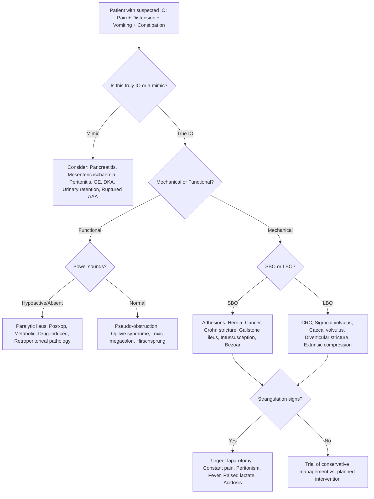

## Differential Diagnosis of Intestinal Obstruction

The differential diagnosis of intestinal obstruction is essentially the process of determining **why** the bowel is obstructed — and, crucially, **whether it is truly obstructed at all**. Many conditions mimic the cardinal features of IO (pain, distension, vomiting, constipation) without an actual mechanical barrier, and some mechanical causes masquerade as others. The approach must be systematic.

### A. The Core Clinical Question: Is This Really Intestinal Obstruction?

Before diving into specific causes, the clinician must answer three sequential questions:

1. **Is there truly an obstruction?** (vs. a mimic like paralytic ileus, gastroenteritis, or a medical cause of acute abdomen)
2. **If yes, is it mechanical or functional?**
3. **If mechanical, what is the specific cause and is there strangulation?**

***Severity of each symptom depends on the level of obstruction*** [1] — this principle is central to the differential because a high SBO presents very differently from an LBO.

<Callout title="Key Lecture Point" type="idea">
***Bilious vomiting is always pathological*** in neonates [2]. ***Abdominal distension is not always present*** [2]. ***Meconium or stool does not exclude obstruction*** [2]. These three points mean that clinical suspicion must remain high even when the "classic" tetrad is incomplete — especially in neonates.
</Callout>

---

### B. Systematic Framework for the Differential Diagnosis

The differential is best organised by:
1. **Level**: SBO vs. LBO
2. **Mechanism**: Mechanical vs. Functional
3. **Age group**: Adult vs. Neonatal/Paediatric
4. **Mimics**: Conditions that present like IO but are not

---

### C. Differential Diagnosis of Small Bowel Obstruction (Adults)

> ***Most common causes of SBO: Adhesions, Bulge (hernia), Cancer — mnemonic "ABC"*** [3][4]

#### (i) Mechanical Causes

| Category | Differential | Key Distinguishing Features | Why it causes SBO |
|:---------|:------------|:---------------------------|:-----------------|
| **Extramural** | ***Adhesions*** (~60–74%) [1][3] | History of prior abdominal/pelvic surgery; recurrent episodes; may resolve with conservative Mx | Fibrous bands kink, compress, or angulate bowel loops → luminal obstruction |
| | ***Incarcerated hernia*** (~10%) [4] | Tender, irreducible groin/umbilical/incisional lump; ***check hernial orifices*** [7] | Bowel loop trapped within hernial sac → lumen obstructed ± vascular compromise |
| | ***Volvulus*** | Acute onset, may have signs of ischaemia | Twisting of mesentery obstructs lumen AND blood supply simultaneously |
| | ***Intraperitoneal malignancy*** | Peritoneal carcinomatosis (ovarian, gastric, CRC); ascites, weight loss, cachexia | Extrinsic compression of bowel loops by tumour deposits or malignant adhesions |
| **Intramural** | ***Tumour*** (lymphoma, GIST, adenoCA) ~5% [1] | Subacute onset, weight loss, anaemia, may have palpable mass | Intramural growth narrows the lumen from within the wall |
| | ***Strictures*** (Crohn's, radiation, anastomotic, drug-induced) [1] | History of Crohn's disease (~7% of SBO [1]), prior RT, NSAID use, or previous anastomosis | Chronic inflammation → fibrosis → fixed narrowing of lumen |
| | ***Intussusception*** | Adults: suspect a pathological lead point (polyp, tumour, Meckel's) | Proximal segment telescopes into distal → luminal obstruction + venous congestion |
| **Intraluminal** | ***Gallstone ileus*** | Elderly female, ***Rigler's triad (pneumobilia + SBO + ectopic gallstone)*** [4]; ***Bouveret's syndrome*** if GOO [4] | Large stone erodes via ***cholecystoenteric fistula*** → impacts at terminal ileum (narrowest SB segment, ***2 feet proximal to IC valve***) [4] |
| | ***Bezoar*** (trichobezoar / phytobezoar) | Psychiatric history (trichotillomania), prior gastric surgery, gastroparesis | Accumulated indigestible material physically blocks lumen |
| | ***Foreign body*** | History of ingestion (children, psychiatric patients, prisoners) | Physical blockage |
| | ***Worms (Ascaris)*** | Endemic area, multiple worms form a bolus | Physical blockage by worm mass |
| | ***Faecal impaction*** | Elderly, immobile, opioid use, chronic constipation | Inspissated stool acts as intraluminal plug |

#### (ii) Functional Causes (Mimicking or Co-existing with SBO)

| Differential | Key Distinguishing Features | Why it mimics IO |
|:------------|:---------------------------|:----------------|
| ***Paralytic ileus / Post-operative ileus*** [4] | History of recent surgery (***clinically significant if > 72h post-op*** [4]), peritonitis, or metabolic derangement; ***hypoactive bowel sounds*** [4]; no transition point on imaging | No peristalsis → gas and fluid accumulate → distension and vomiting, but no mechanical barrier |
| ***Ogilvie's syndrome*** [3][4] | Hospitalised patient with severe comorbidity; ***normal bowel sounds***; ***dilated rectum on PR*** [4]; gas in rectum on AXR | Autonomic imbalance → colonic aperistalsis without mechanical cause |
| ***Drug-induced ileus*** | Opioids, anticholinergics, CCBs in drug history | Pharmacological suppression of myenteric plexus activity |
| ***Metabolic ileus*** | HypoK, hypothyroidism, uraemia, DKA | Electrolyte/hormonal derangement impairs smooth muscle contractility |

---

### D. Differential Diagnosis of Large Bowel Obstruction (Adults)

> ***Common causes of LBO: Cancer of colon, Volvulus, Diverticular stricture, Pseudo-obstruction*** [7]

| Category | Differential | Key Distinguishing Features | Why it causes LBO |
|:---------|:------------|:---------------------------|:-----------------|
| **Neoplastic** | ***Colorectal cancer*** | ***More advanced cancer, elderly patients with comorbidity, high operative mortality and morbidity, worse prognosis*** [1]; change in bowel habit, weight loss, anaemia, PR bleeding, palpable mass | Progressive intraluminal growth narrows the colonic lumen; ***15–20% of CRC patients present with IO*** [1] |
| **Volvulus** | ***Sigmoid volvulus*** (70%) | Older males, chronic constipation, institutionalised; ***coffee bean sign on AXR*** [4]; ***bird's beak sign on contrast enema*** [4] | Twisting of sigmoid around narrow mesosigmoid → closed-loop obstruction |
| | ***Caecal volvulus*** (25%) | Younger females, congenital hypermobile caecum; dilated SB on AXR | Failed fusion of ascending colon mesentery → mobile caecum twists |
| **Inflammatory** | ***Diverticular stricture*** | History of recurrent diverticulitis; LLQ (Western) or RLQ (Asia) pain; fibrotic narrowing | Chronic inflammation → fibrosis → fixed stricture of colonic lumen |
| **Stricture** | ***Anastomotic / Radiation / Ischaemic / Endometriotic*** [1] | Prior surgery, RT, vascular disease, or endometriosis history | Fibrotic narrowing from healing/scarring process |
| **Extrinsic** | ***Metastasis / Pelvic tumour*** [1] | Known primary (ovarian, uterine, prostatic); pelvic mass on examination | External compression of colon by adjacent tumour mass |
| **Pseudo-obstruction** | ***Ogilvie's syndrome*** | As above; ***diagnosis of exclusion*** [4] | Functional, not mechanical |
| **Toxic megacolon** | | IBD history, ***C. difficile*** infection, antibiotic use; ***bloody diarrhoea***; systemic toxicity (fever, tachycardia, leucocytosis) [3] | Total or segmental colonic dilatation with systemic toxicity → mimics obstructive LBO but mechanism is inflammatory paralysis |

<Callout title="Sigmoid Volvulus vs. Toxic Megacolon vs. Ogilvie's" type="error">
These three conditions all present with massive colonic dilatation and can look similar on AXR. Differentiation is crucial because management is completely different:
- **Sigmoid volvulus**: ***coffee bean sign***, absent rectal gas, no systemic toxicity initially → endoscopic decompression
- **Toxic megacolon**: systemic toxicity, ***bloody diarrhoea***, IBD/***C. difficile*** history → medical management ± colectomy
- **Ogilvie's**: hospitalised patient, no systemic toxicity, ***normal bowel sounds, dilated rectum, gas in rectum on AXR*** → supportive ± neostigmine ± colonoscopic decompression
</Callout>

---

### E. Differential Diagnosis of Neonatal Intestinal Obstruction

***Causes of neonatal intestinal obstruction*** [2]:
- ***Intestinal atresia (oesophagus to anus)***
- ***Malrotation***
- ***Meconium disease***
- ***Hirschsprung's disease***

The key differentiating feature in neonates is the **character of vomiting** (bilious vs. non-bilious) and the **timing/passage of meconium**.

| Differential | Age at Presentation | Vomiting | Distension | Meconium | Key Diagnostic Clue |
|:------------|:-------------------|:---------|:-----------|:---------|:-------------------|
| ***Malrotation with midgut volvulus*** | Days 1–28 (often first week) | ***Bilious (always pathological)*** [2] | May be minimal | May have passed normally | ***Upper GI contrast study showing DJ junction malposition***; surgical emergency |
| ***Duodenal atresia*** | Day 1 | Bilious (if distal to ampulla) or non-bilious (if proximal) | Epigastric only (proximal obstruction) | May pass normally | ***"Double bubble" sign on AXR***; association with ***Down syndrome*** [3] |
| ***Jejunoileal atresia*** | Day 1–2 | Bilious | Progressive | Absent or scant | ***Multiple dilated loops with air-fluid levels***; no gas in rectum |
| ***Meconium ileus*** | Day 1–2 | Bilious | Marked | Absent (inspissated) | Ground-glass appearance on AXR (Neuhauser sign); association with ***cystic fibrosis*** [3] |
| ***Hirschsprung's disease*** | Day 1–3 (or later in short-segment) | Bilious (late) | Progressive, massive | Delayed > 48h (***failure to pass meconium in 90%***) [3] | ***"Blast sign" on PR***; contrast enema showing transition zone; rectal suction biopsy (gold standard) |
| ***Anorectal malformation*** | Day 1 | Late | Progressive | Absent; no visible anus | Absent/abnormal anus on perineal inspection |
| ***Necrotising enterocolitis (NEC)*** | Premature neonates, days 2–14 | Bilious | Marked, tender | Bloody stools | Pneumatosis intestinalis on AXR; portal venous gas |
| ***Incarcerated inguinal hernia*** | Any neonatal age | May or may not be present | Variable | Variable | Palpable, irreducible groin swelling; especially in premature males |
| ***Pyloric stenosis*** | 2–8 weeks | ***Non-bilious, projectile*** | Epigastric only | Normal | Palpable "olive" mass in epigastrium; hypochloraemic, hypokalaemic metabolic alkalosis; pyloric muscle thickening on USS |

<Callout title="Bilious Vomiting in a Neonate" type="error">
***Bilious vomiting in a neonate = malrotation with midgut volvulus until proven otherwise***. This is a **surgical emergency** because the entire midgut can infarct within hours if the volvulus is not reduced. Do NOT wait for further investigations if the clinical picture is suspicious — obtain an urgent upper GI contrast study and call the paediatric surgeon immediately.
</Callout>

---

### F. Differential Diagnosis by Presenting Feature

Sometimes patients present with a dominant symptom rather than the full tetrad. Here is a feature-based differential approach:

#### (i) Abdominal Pain + Distension + Vomiting — "Is it really IO?"

| Mimic | Why it mimics IO | How to differentiate |
|:------|:----------------|:--------------------|
| **Acute pancreatitis** | Severe epigastric pain, vomiting, ileus (reflex ileus from retroperitoneal inflammation) | Elevated amylase/lipase; CT findings; pain radiating to back; no transition point on AXR |
| **Acute mesenteric ischaemia** | Severe abdominal pain "out of proportion to examination," vomiting, distension | AF or embolic source; raised lactate; CT angiography showing SMA occlusion; pain early, signs late |
| **Acute peritonitis** (e.g., perforated peptic ulcer) | Board-like rigidity, absent bowel sounds, vomiting | ***Free gas on erect CXR***; history of PUD/NSAID use; peritonism from the outset (not progressive as in strangulated IO) |
| **Gastroenteritis** | Vomiting, diarrhoea, colicky abdominal pain, may have distension | Diarrhoea is prominent (not constipation); infective contacts; self-limiting; AXR non-specific |
| **Diabetic ketoacidosis** | Severe abdominal pain ("pseudoperitonitis"), vomiting, dehydration | Hyperglycaemia, ketonuria, metabolic acidosis; no mechanical obstruction on imaging |
| **Acute urinary retention** | Suprapubic distension, pain, inability to void | Palpable bladder, confirmed by USS/catheterisation; no features of bowel obstruction on AXR |
| **Ruptured AAA** | Acute abdominal/back pain, hypotension, distension | Pulsatile abdominal mass; CT angiography; haemodynamic instability disproportionate to IO features |

#### (ii) Acute Abdomen by Location — Cross-referencing IO Mimics [4]

| Location | IO-related DDx | Non-IO Mimics |
|:---------|:--------------|:-------------|
| **RLQ** | Caecal volvulus, appendiceal mass causing SBO, Crohn's stricture | ***Acute appendicitis***, ***right-sided diverticulitis*** (Asia), ovarian torsion, ectopic pregnancy, ureteric colic [3][4] |
| **LLQ** | Sigmoid volvulus, diverticular stricture, CRC | ***Acute diverticulitis***, ovarian torsion, ectopic pregnancy, ureteric colic |
| **Central/diffuse** | Adhesive SBO, generalised peritonitis from perforated strangulated bowel | ***Perforated viscus, ruptured AAA, acute mesenteric ischaemia, DKA*** [4] |
| **Epigastric** | High SBO (duodenal), GOO from pyloric stenosis (neonates) or gastric cancer (adults) | ***Acute pancreatitis, acute MI, perforated PUD*** [4] |

---

### G. Differential Diagnosis — Specific Scenarios

#### (i) DDx of Sigmoid Volvulus [3]

| DDx | Differentiating Features |
|:----|:------------------------|
| ***Toxic megacolon*** | ***Total or segmental colonic dilatation with systemic toxicity***; ***bloody diarrhoea***; history of IBD or ***C. difficile*** (antibiotic use) [3] |
| ***Ogilvie's syndrome*** | ***Acute dilatation without anatomic obstruction***; hospitalised, severely ill; ***abdominal distension is the most common presentation*** [3]; normal bowel sounds; gas in rectum |
| **Obstructing CRC** | Subacute history of change in bowel habit, weight loss; CT showing mass not volvulus |

#### (ii) DDx of Intussusception (Paediatric) [3]

| DDx | Differentiating Features |
|:----|:------------------------|
| ***Meckel's diverticulum*** | Painless massive PR bleeding (vs. painful colicky episodes in intussusception); ***Technetium-99m pertechnetate scan*** positive [3] |
| ***Malrotation with midgut volvulus*** | Bilious vomiting ± PR bleeding; typically neonatal; upper GI contrast diagnostic |
| ***Bacterial colitis*** | Diarrhoea predominant, infective contacts, stool cultures positive |
| ***Septic shock*** | Lethargy and coma may mimic the inter-episode lethargy of intussusception, but haemodynamic instability, fever, and septic markers distinguish [3] |
| ***Henoch-Schönlein purpura*** | Purpuric rash over buttocks/legs, arthralgia, haematuria; abdominal pain from bowel wall haematoma ± intussusception (HSP itself can cause intussusception) |

#### (iii) DDx of Neonatal IO [3]

| DDx | Differentiating Features |
|:----|:------------------------|
| ***Malrotation of gut*** | Bilious vomiting, may have minimal distension; upper GI contrast diagnostic |
| ***Hirschsprung's disease*** | Delayed meconium passage, abdominal distension, blast sign on PR; rectal biopsy confirmatory |
| ***Meconium ileus*** | Ground-glass appearance (Neuhauser sign) on AXR; association with CF; sweat chloride test |
| ***Intestinal atresia*** | Level-dependent presentation; double bubble (duodenal), triple bubble (jejunal), microcolon (ileal/colonic) |
| ***Meconium plug syndrome*** | Occurs in up to 1:500 newborns; colonic dysmotility or abnormal meconium consistency; often resolves with contrast enema [3] |
| ***Small left colon syndrome*** | ***Infant of diabetic mother***; transient left colon dysmotility; contrast enema shows small-calibre descending colon [3] |
| ***Internal anal sphincter achalasia*** | Similar to short-segment Hirschsprung; rectal biopsy shows normal ganglia (differentiates from HD) [3] |

---

### H. Differential Diagnosis Algorithm

---

### I. How to Differentiate Mechanical SBO from Paralytic Ileus from Pseudo-obstruction

This is a high-yield exam comparison. The key is to combine **clinical features**, **examination findings**, and **imaging**.

| Feature | Mechanical SBO | Paralytic Ileus | Pseudo-obstruction |
|:--------|:--------------|:---------------|:------------------|
| **Pain** | ***Colicky*** [1] — intermittent, cramping | Mild, diffuse, non-colicky | Distension but ***not much pain*** [4] |
| **Vomiting** | ***Profuse in SBO*** [4] | Present but less dramatic | Variable |
| **Distension** | Variable (depends on level) | Diffuse | Often marked |
| **Constipation** | Complete (obstipation) if complete obstruction | Variable; may pass flatus | Variable |
| **Bowel sounds** | ***Increased*** [1] — high-pitched, tinkling (early); absent (late, if strangulation) | ***Hypoactive or absent*** [4] | ***Normal*** [4] |
| **PR examination** | Empty, collapsed rectum | Variable | ***Dilated rectum*** [4] |
| **AXR** | Dilated proximal loops + collapsed distal; transition point; absent rectal gas | Diffuse gas throughout SB and LB; no transition point | Dilated colon; ***gas present in rectum*** [4] |
| **CT abdomen** | Transition point identified; proximal dilatation, distal collapse | No transition point; diffuse dilatation | Dilated colon, no mechanical cause |
| **History** | Prior surgery, hernia, malignancy | Recent operation, peritonitis, metabolic disorder, drugs | Hospitalised, severely ill, metabolic disturbance |

---

### J. Red Flags in the Differential — When to Suspect Strangulation

Any patient with suspected IO who develops the following should be considered to have strangulated obstruction until proven otherwise — this changes the differential from "which cause?" to "emergent surgery NOW":

| Red Flag | Pathophysiological Basis |
|:---------|:------------------------|
| Constant (non-colicky) pain | Continuous ischaemic injury to bowel wall irritating peritoneum |
| ***Tachycardia and hypotension*** [7] | Hypovolaemia + sepsis from bacterial translocation |
| Fever, leucocytosis | Systemic inflammatory response to ischaemic/necrotic bowel |
| Metabolic acidosis / raised lactate | Anaerobic metabolism in ischaemic bowel tissue; lactate is a sensitive marker of bowel ischaemia |
| ***Peritoneal signs*** (guarding, rigidity, rebound) [7] | Parietal peritoneum irritated by transmural necrosis or perforation |
| Bloody PR discharge | Mucosal sloughing from ischaemic bowel |
| Absent bowel sounds | Bowel has become non-viable → no peristaltic activity |

---

<Callout title="High Yield Summary — Differential Diagnosis of IO">

1. **First question**: Is it truly IO or a mimic? (Pancreatitis, mesenteric ischaemia, DKA, peritonitis, GE, urinary retention can all mimic IO)

2. **Second question**: Mechanical or functional? — Differentiate by bowel sounds (↑↑ = mechanical; ↓/absent = ileus; normal = pseudo-obstruction), PR exam (empty rectum = mechanical LBO; dilated = pseudo-obstruction), and imaging (transition point = mechanical)

3. **Third question**: If mechanical, SBO or LBO? — SBO: ***ABC (Adhesions, Bulge/hernia, Cancer)***; LBO: ***Cancer, Volvulus, Diverticular stricture, Pseudo-obstruction***

4. **Neonatal IO**: ***Bilious vomiting = malrotation with midgut volvulus until proven otherwise***. DDx includes intestinal atresia, meconium disease, Hirschsprung's disease, NEC.

5. **Sigmoid volvulus DDx**: Toxic megacolon (systemic toxicity, bloody diarrhoea, C. difficile) vs. Ogilvie's (hospitalised, normal bowel sounds, dilated rectum, gas in rectum)

6. **Always check**: hernial orifices, surgical scars, medications (opioids, anticholinergics), metabolic panel (K⁺, TFT, glucose), strangulation signs (constant pain, peritonism, fever, lactate)

</Callout>

---

<ActiveRecallQuiz
  title="Active Recall - Differential Diagnosis of Intestinal Obstruction"
  items={[
    {
      question: "Name three clinical and investigational features that differentiate mechanical SBO from paralytic ileus from pseudo-obstruction.",
      markscheme: "Bowel sounds: increased/high-pitched in mechanical SBO, hypoactive/absent in paralytic ileus, normal in pseudo-obstruction. PR exam: empty collapsed rectum in mechanical LBO, variable in ileus, dilated rectum in pseudo-obstruction. AXR: transition point with absent rectal gas in mechanical, diffuse gas with no transition point in ileus, dilated colon with gas in rectum in pseudo-obstruction.",
    },
    {
      question: "A 75-year-old woman presents with features of distal SBO. She has no surgical history and no hernias. AXR shows SBO with pneumobilia. What is the likely diagnosis and what is the classic triad on AXR?",
      markscheme: "Gallstone ileus. Rigler triad: pneumobilia, SBO, and ectopic gallstone (usually in RIF at ileocaecal valve area). Stone erodes from gallbladder into duodenum via cholecystoenteric fistula and impacts at terminal ileum, the narrowest SB segment.",
    },
    {
      question: "List four differential diagnoses for massive colonic dilatation and explain how you differentiate them.",
      markscheme: "Sigmoid volvulus (coffee bean sign, absent rectal gas, no initial systemic toxicity), Caecal volvulus (dilated SB, arises from RLQ, haustral markings), Toxic megacolon (systemic toxicity, bloody diarrhoea, IBD or C. difficile history), Ogilvie syndrome (hospitalised patient, normal bowel sounds, dilated rectum on PR, gas in rectum on AXR, diagnosis of exclusion).",
    },
    {
      question: "In a neonate with bilious vomiting, what are the top four differential diagnoses and which one must be excluded first and why?",
      markscheme: "Top four: malrotation with midgut volvulus, intestinal atresia (jejunoileal or duodenal if distal to ampulla), meconium ileus, Hirschsprung disease. Must exclude malrotation with midgut volvulus first because the entire midgut can infarct within hours from SMA compromise if the volvulus is not surgically reduced.",
    },
    {
      question: "Name three medical conditions that can mimic intestinal obstruction and explain the mechanism by which each mimics IO.",
      markscheme: "Any three of: (1) Acute pancreatitis - retroperitoneal inflammation causes reflex ileus via sympathetic chain irritation; (2) DKA - autonomic neuropathy and metabolic derangement cause ileus and severe abdominal pain (pseudoperitonitis); (3) Acute mesenteric ischaemia - ischaemic bowel loses motility and causes distension, pain, vomiting; (4) Hypokalaemia - K+ essential for smooth muscle repolarisation, low K+ causes bowel paralysis.",
    },
  ]}
/>

---

## References

[1] Lecture slides: GC 194. Intestinal obstruction colorectal cancer.pdf (pp. 3, 9, 10, 39)
[2] Lecture slides: GC 205. The newborn baby is vomiting repeatedly Neonatal intestinal obstruction and other GI emergencies.pdf (pp. 3, 5)
[3] Senior notes: felixlai.md (Intestinal Obstruction, Volvulus, Intussusception, Intestinal Atresia, Malrotation, Hirschsprung Disease, Meckel's Diverticulum, Diverticulitis, Appendicitis sections)
[4] Senior notes: maxim.md (sections 4.3 Intestinal Obstruction, Paralytic Ileus, Pseudo-obstruction, Volvulus, Gallstone Ileus, Acute Abdomen DDx)
[7] Lecture slides: GC 195. Lower and diffuse abdominal pain RLQ problems; pelvic inflammatory disease; peritonitis and abdominal emergencies.pdf (p. 28)
