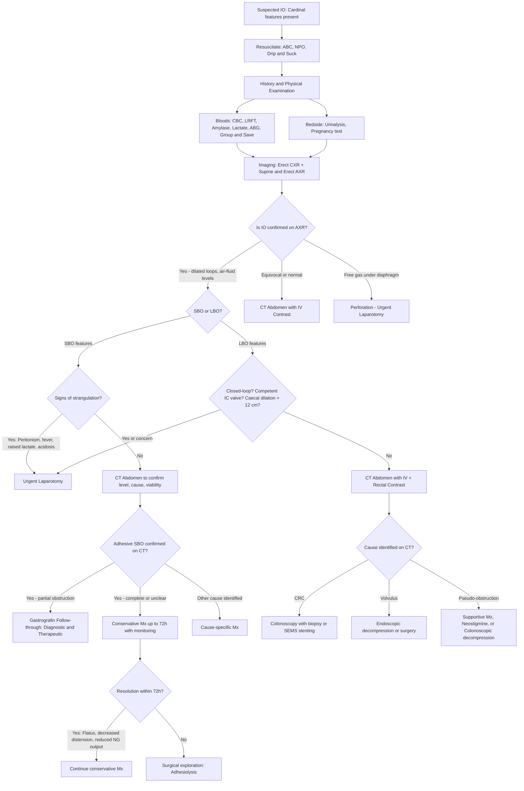
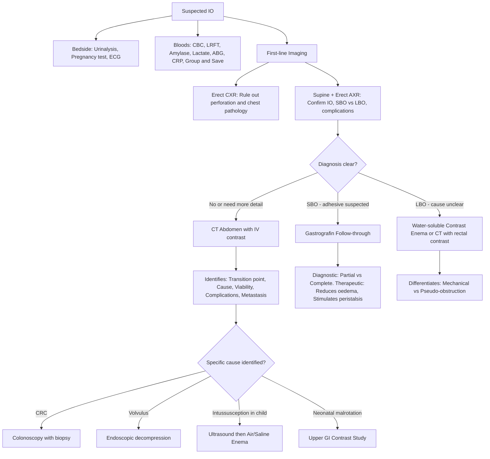

## Diagnosis of Intestinal Obstruction

### A. Diagnostic Approach — The Key Questions

The lecture slides lay out a systematic framework of questions that must be answered sequentially [1]:

> ***Does the patient have intestinal obstruction?***
> ***Ileus vs. mechanical obstruction?***
> ***What is the site and cause of obstruction? Small bowel vs. large bowel?***
> ***Is the obstruction simple or strangulated?***
> ***What investigations should be performed?***
> ***Should the patient be treated conservatively and for how long?***
> ***What are the indications for surgery?***
> ***What are the surgical options?*** [1]

There is no single "diagnostic criterion" for IO the way there is for, say, rheumatoid arthritis. Instead, IO is a **clinical-radiological diagnosis** — you combine history, examination, blood tests, and imaging to answer the questions above. Let us walk through each layer.

---

### B. Diagnostic Criteria — Clinical-Radiological Diagnosis

IO is diagnosed when the combination of:

1. **Clinical features**: ≥ 1 of the cardinal features (colicky pain, vomiting, distension, absolute constipation) in an appropriate clinical context
2. **Radiological confirmation**: Imaging demonstrating dilated bowel proximal to a transition point with collapsed distal bowel (mechanical) OR diffuse dilatation without transition point (functional)
3. **Laboratory support**: Blood results consistent with dehydration, electrolyte derangement, or ischaemia

There is no universally agreed scoring system, but the **diagnosis is essentially clinical + imaging**. The clinical picture raises the suspicion; imaging confirms and characterises it.

<Callout title="IO is a Clinical-Radiological Diagnosis" type="idea">
Unlike many medical conditions, intestinal obstruction does not have a formal set of "diagnostic criteria" with sensitivity/specificity thresholds. The diagnosis is made by putting together the clinical picture (cardinal features + risk factors + examination findings) with imaging (AXR and/or CT). The role of investigations is to **confirm** the obstruction, **localise** the level, **identify** the cause, and **detect complications** (especially strangulation).
</Callout>

---

### C. Diagnostic Algorithm

The following algorithm represents the systematic approach to a patient with suspected IO, integrating the questions from the lecture slides [1]:

---

### D. Investigation Modalities — Detailed Guide

The investigations for IO can be grouped into:
1. **Bedside tests**
2. **Blood investigations**
3. **Imaging** (the cornerstone)
4. **Endoscopy**

Each test has a specific role in answering one or more of the key diagnostic questions.

---

#### 1. Bedside Tests [7][8]

| Test | Rationale / What You're Looking For |
|:-----|:-----------------------------------|
| ***Urinalysis*** [7][8] | Exclude urological mimics (UTI, ureteric colic — haematuria); assess concentration (dehydration) |
| ***Pregnancy test*** [7][8] | Mandatory in all women of childbearing age to exclude ectopic pregnancy (a mimic of acute abdomen) and to guide imaging decisions (avoid CT radiation) |
| **Point-of-care glucose** | Exclude DKA as a cause of "pseudoperitonitis" and ileus |
| **ECG** [8] | Exclude acute MI — inferior MI can present with epigastric pain and vomiting mimicking high SBO |

---

#### 2. Blood Investigations

> ***Bloods: CBC, ABG/VBG, LRFT, amylase, lactate ± septic work-up*** [4]

| Test | What It Tells You | Why / Pathophysiological Basis |
|:-----|:-----------------|:------------------------------|
| **CBC with differential** [4][7][8] | Leucocytosis (↑ WCC) | Suggests strangulation, ischaemia, perforation, or underlying infection. The stress response and bacterial translocation from ischaemic bowel both drive leucocytosis. |
| | Anaemia (↓ Hb) | May indicate chronic blood loss from underlying malignancy (CRC) or acute haemorrhage from strangulated/necrotic bowel |
| | Haemoconcentration (↑ Hb/Hct) | Dehydration from vomiting and third-spacing |
| ***ABG / VBG*** [4][8] | **Metabolic alkalosis** | From vomiting — loss of H⁺ and Cl⁻ from gastric secretions. This is the classic acid-base disturbance in *proximal* SBO with profuse vomiting. |
| | **Metabolic acidosis** with **raised lactate** | ***Sensitive marker for bowel ischaemia*** [3]. Anaerobic metabolism in ischaemic bowel produces lactate; also reflects tissue hypoperfusion from hypovolaemia. This is a **red flag for strangulation**. |
| ***LRFT*** (Liver and Renal Function Tests) [4][8] | **↓ K⁺** (hypokalaemia) | ***Due to hypovolaemia and impaired absorption secondary to oedematous bowel wall*** [4]. Also from vomiting (direct K⁺ loss + renal K⁺ wasting from metabolic alkalosis via ↑ HCO₃⁻ delivery to distal nephron + RAAS activation) [3]. |
| | **↓ Na⁺**, **↓ Cl⁻** | Losses in vomitus (gastric secretions rich in Na⁺, Cl⁻, H⁺) |
| | **↑ Urea and Creatinine** | Pre-renal AKI from dehydration (third-spacing + vomiting + reduced intake) |
| | **↑ Urea:Creatinine ratio** ( > 20:1) | Suggests pre-renal cause — urea is passively reabsorbed in the proximal tubule when flow rate is low |
| **LFT** [3][8] | Rule out hepatic pathology; check albumin (nutritional status, malignancy) | |
| ***Amylase*** [4][8] | **↑ Amylase** | Can be mildly elevated in IO (from bowel ischaemia, peritoneal irritation); markedly elevated → think pancreatitis as the cause of ileus. ***Elevated in approximately half of patients with intestinal ischaemia*** [3]. |
| ***Serum lactate*** [3][4] | **↑ Lactate** | ***Sensitive marker for bowel ischaemia*** [3]. Lactate > 2 mmol/L should raise suspicion of strangulation. Rising serial lactate is particularly concerning. |
| **CRP** [8] | ↑ CRP | Non-specific inflammatory marker; very high CRP may suggest perforation/peritonitis |
| **Group and Save / Cross-match** [8] | Preparation for surgery | Any patient with suspected strangulation or who may need laparotomy should have blood available |
| ***Septic work-up*** [4] | Blood cultures if febrile | Bacterial translocation from ischaemic bowel → bacteraemia |

<Callout title="The Lactate-Alkalosis Paradox" type="idea">
In IO, you might see metabolic alkalosis (from vomiting) AND metabolic acidosis (from ischaemia) co-existing. This creates a mixed acid-base picture. Always interpret the ABG in context: if vomiting has been profuse but lactate is also rising, suspect concurrent strangulation. An ABG that "looks normal" might actually be a mixed disorder with opposing forces cancelling out — always check the anion gap.
</Callout>

---

#### 3. Imaging — The Cornerstone of Diagnosis

##### (i) Erect Chest X-ray (CXR)

> ***Erect CXR: free gas, aspiration pneumonia, gastric distension, NG tube position*** [4]

| Finding | Significance | Why |
|:--------|:------------|:----|
| ***Free gas under the diaphragm (pneumoperitoneum)*** | Bowel perforation | Gas escapes from a perforated viscus into the peritoneal cavity and rises to the highest point (subdiaphragmatic space in the erect position). This is a **surgical emergency** — do NOT delay for further imaging. |
| Aspiration pneumonia | Complication of IO | Vomiting in a patient with impaired consciousness or reduced GCS → aspiration of gastric/intestinal contents |
| Pleural effusion / consolidation | Thoracic pathology mimicking abdominal pain | Basal pneumonia can cause referred abdominal pain and ileus |
| NG tube position | Confirm correct placement | Before starting NG aspiration |

##### (ii) Abdominal X-ray (AXR) — Supine and Erect

> ***Erect and supine AXR*** [4]. The lecture slides outline a systematic approach to AXR interpretation [1]:

***Key questions to answer on AXR*** [1]:
- ***Are there dilated bowel loops?***
- ***Are air-fluid levels present in erect film?***
- ***Any gas in the colon and the level of cut-off?***
- ***Any evidence of strangulation: thumbprinting, pneumatosis cystoides intestinalis, free peritoneal gas?***
- ***Any massive dilatation of colon?***
- ***Any air in the biliary tree?***

**Why two views?**
- ***Supine AXR*** is better for identifying the **transition point** (where dilated bowel meets collapsed bowel) and overall gas pattern [4]
- **Erect AXR** shows **air-fluid levels** (gas rises above fluid in distended loops), though ***the number of air-fluid levels does not affect management*** [4] — what matters is whether there is obstruction and at what level

**How to distinguish SBO from LBO on AXR** [7]:

| Feature | Small Bowel | Large Bowel |
|:--------|:-----------|:-----------|
| **Mucosal folds** | ***Valvulae conniventes*** (plicae circulares) — cross the **entire width** of the lumen | ***Haustra*** — do NOT cross the entire width (only partial indentations) |
| **Location** | ***Central*** in the abdomen | ***Peripheral*** (frame the abdomen) |
| **Diameter** | Dilated if > 3 cm (SB) | Dilated if > 6 cm (colon) or > 9 cm (caecum) |
| **Number of loops** | Multiple (many loops if distal SBO) | Fewer, larger loops |

**AXR Findings in IO** [3][1]:

| Finding | Description | Significance |
|:--------|:-----------|:------------|
| ***Dilated proximal bowels with distal collapsed bowel*** [3] | Gas-filled loops proximal to obstruction; no or little gas distally | Confirms mechanical obstruction and helps localise the level |
| ***Air-fluid levels*** [3] | Multiple, at different heights within the same loop ("stepladder" pattern in SBO) | Fluid trapped in distended loops; gas sits on top in erect film |
| ***Gasless abdomen*** [3] | Complete absence of visible gas | ***Complete filling of loops of bowel with sequestered fluid*** [3] — a completely fluid-filled obstructed bowel shows no gas shadows. This is an easily missed finding! |
| ***Absent colonic/rectal gas*** | No gas seen in the colon/rectum | Suggests complete SBO (all gas proximal to obstruction) or distal LBO |
| ***Coffee bean sign*** [4] | Large, ahaustral, bent loop arising from pelvis/LLQ with 3 converging white lines | Sigmoid volvulus — the 3 lines represent the 2 walls of the dilated sigmoid and the mesenteric root |
| ***Pneumobilia*** [4] | Gas in the biliary tree (linear gas over hepatic area) | ***Air in the biliary tree*** [1] → think gallstone ileus (***Rigler's triad: pneumobilia + SBO + ectopic gallstone***) [4]. Other DDx: post-ERCP, post-cholecystectomy, emphysematous cholecystitis |
| ***Double bubble sign*** | Two rounded gas shadows (stomach + proximal duodenum) with no distal gas | Duodenal atresia in neonates; associated with Down syndrome |

**AXR Findings Suggesting Complications (Strangulation/Ischaemia)** [1][3]:

| Finding | Description | Significance |
|:--------|:-----------|:------------|
| ***Thumbprinting sign*** [3] | ***Normal haustration becomes thickened at regular intervals appearing like thumbprints projecting into the lumen*** [3]. Caused by ***bowel wall thickening usually caused by oedema*** [3]. | Suggests bowel wall ischaemia/oedema — mural haemorrhage or submucosal oedema causes the mucosa to bulge into the lumen |
| ***Pneumatosis intestinalis*** [1][3] | ***Gas tracking within the bowel wall*** — appears as linear or bubbly lucencies within the wall | Gas-producing bacteria have invaded the ischaemic bowel wall (transmural necrosis allows bacterial infiltration). This is a **late and ominous sign** indicating bowel necrosis. |
| ***Free peritoneal gas (pneumoperitoneum)*** [1] | Gas under the diaphragm (erect CXR) or between bowel loops (supine AXR — Rigler's sign / double-wall sign) | Perforation has occurred — surgical emergency |
| ***Double-wall sign (Rigler's sign)*** [3] | Both sides of the bowel wall are visible because gas is present both inside the lumen and outside in the peritoneal cavity | Confirms free intraperitoneal gas (perforation) |
| ***Portal venous gas*** | Linear branching gas shadows overlying the liver periphery | Gas has entered the portal venous system from necrotic bowel — extremely ominous sign |

**AXR Pattern by Level** [3]:

| Type | AXR Pattern |
|:-----|:-----------|
| **High SBO** | ***Little evidence of dilated small bowel loops*** [3] — short segment proximal to obstruction, often gasless |
| **Low SBO** | ***Multiple dilated small bowel loops*** [3] — central, with valvulae conniventes |
| **LBO** | ***Dilated colon proximal to obstruction*** [3]; ***dilated small bowel if ileocaecal valve is incompetent*** [3] |

<Callout title="The Gasless Abdomen Trap" type="error">
A completely ***gasless abdomen*** on AXR can be easily dismissed as "normal" — but in the context of IO, it means the obstructed loops are **completely filled with fluid** and no gas is visible. This is actually a sign of **complete, early obstruction** where swallowed air has not yet accumulated but massive fluid sequestration has occurred. Always correlate with clinical features; if suspicion is high, proceed to CT.
</Callout>

##### (iii) CT Abdomen — The Definitive Investigation

> ***CT scan: more sensitive than plain abdominal X-rays*** [1]

CT is now the **investigation of choice** for confirming IO, identifying the cause, and detecting complications. The lecture slides emphasise the following [1]:

**CT for SBO** [1]:
- ***Level of obstruction (transition between dilated and collapsed loop)***
- ***Lesions (tumour, foreign bodies)***
- ***Viability of bowel (intravenous contrast)***

**CT for LBO** [1]:
- ***Intravenous contrast, rectal contrast***
- ***Site of obstruction (transition of dilated loop and collapsed loop)***
- ***Mass lesion***
- ***Perfusion of bowel wall***
- ***Distant disease in case of malignancy***

| CT Finding | Description | What It Means |
|:-----------|:-----------|:-------------|
| **Transition point** | Abrupt change from dilated proximal loops to collapsed distal loops | Localises the exact site of mechanical obstruction |
| **Small bowel faeces sign** | Particulate matter in the dilated SB lumen with a faecal appearance | Suggests complete or near-complete SBO with prolonged stasis (bacterial fermentation of SB content) |
| ***"Target sign"*** [3] | ***Alternating hypodense and hyperdense layers*** | ***Indicative of intussusception*** [3] — concentric rings represent the layers of invaginated bowel wall and mesentery |
| ***"Whirl sign"*** [3] | ***Rotation of small bowel mesentery*** — swirling of mesenteric vessels and fat around a central axis | ***Indicative of volvulus*** [3] — the mesentery and its vessels twist around the axis of rotation |
| ***"Apple-core" lesion*** [3] | Annular narrowing of the colonic lumen with shouldered margins | ***Indicative of colorectal cancer*** [3] — circumferential tumour growth creates the characteristic shelf-like narrowing |
| **Pneumatosis intestinalis** [3] | Gas within the bowel wall | Bowel wall necrosis with bacterial invasion — ominous sign |
| **Bowel wall thickening** [3] | Mural thickening > 3 mm in SB, > 5 mm in colon | Oedema from venous congestion, ischaemia, or inflammation |
| ***Reduced or lack of bowel wall enhancement*** [3] | Bowel wall does not take up IV contrast | ***Indicates ischaemia*** — compromised arterial supply means contrast cannot reach the bowel wall. This is a key finding to look for when assessing viability. |
| **Oedematous and thickened mesentery** [3] | Mesenteric fat stranding, haziness | Venous congestion → fluid transudation into mesentery |
| **Engorgement of mesenteric vessels** [3] | Dilated, congested mesenteric veins | Impaired venous return from obstructed bowel |
| ***Portal venous gas*** [3] | Gas in the portal venous branches within the liver | Extremely ominous — gas from necrotic bowel has entered the portal system. Strong indication for emergent surgery. |
| ***Rigler's triad*** [4] | ***Pneumobilia + SBO + ectopic gallstone*** | Pathognomonic of gallstone ileus |
| **Free fluid / free gas** | Ascites or pneumoperitoneum | Perforation (gas) or transudation/ischaemia (fluid) |
| **"Beak sign"** | Tapering of bowel lumen to a point at the site of obstruction | Seen in volvulus (the twisted mesentery compresses the bowel to a beak-shaped endpoint) |

**CT Protocols**:
- **SBO**: CT with **IV contrast** (to assess bowel wall enhancement/viability). Oral contrast is generally NOT given in acute SBO because the patient is vomiting and the contrast will take too long to reach the obstruction point.
- **LBO**: CT with ***IV contrast + rectal contrast*** [1] — rectal contrast helps delineate the distal obstruction point and differentiate mechanical from pseudo-obstruction.

##### (iv) Gastrografin (Water-Soluble Contrast) Follow-Through

> ***Gastrografin meal and follow-through is indicated in adhesive IO only*** [3]

This is a particularly important investigation because it is both ***diagnostic AND therapeutic*** [3]:

| Aspect | Details |
|:-------|:-------|
| **Indication** | Suspected **adhesive SBO** only — NOT for LBO, NOT if perforation suspected (although gastrografin is water-soluble and safe, unlike barium) |
| **Technique** | 100 mL of gastrografin administered orally or via NG tube. ***X-ray is taken every 30 minutes until 4 hours (delayed film)*** [3]. ***The 2-hour film is the most important*** [3]. |
| **Diagnostic role** | Detects the ***level of obstruction and whether it is partial or complete*** [3]. If contrast reaches the colon by the 2-hour film → partial obstruction → likely to resolve conservatively. If contrast fails to reach the colon by 4–24 hours → complete obstruction → likely needs surgery. |
| **Therapeutic role** | ***Water-soluble contrast is both diagnostic and therapeutic*** [3]: (1) ***Draws fluid into lumen of bowel due to hypertonicity*** (osmotic effect, ~2000 mOsm/L) → reduces bowel wall oedema; (2) ***Decreases intestinal wall oedema and stimulates intestinal peristalsis*** [3] → may resolve partial adhesive obstruction. |
| **Evidence** | Studies show gastrografin reduces the need for surgery in adhesive SBO and shortens hospital stay. If contrast reaches the caecum within 24 hours, the probability of resolution without surgery is ~99%. |

<Callout title="Gastrografin — Diagnostic and Therapeutic" type="idea">
Gastrografin is a hyperosmolar, water-soluble contrast agent (~2000 mOsm/L). When given orally in adhesive SBO, its hypertonicity draws water into the bowel lumen, which paradoxically **reduces bowel wall oedema** (by osmotically pulling interstitial fluid from the oedematous wall into the lumen) and **stimulates peristalsis**. The ***2-hour film*** is the key timepoint — if contrast is in the colon by 2 hours, the patient almost certainly has a partial obstruction that will resolve conservatively.
</Callout>

##### (v) Water-Soluble Contrast Enema

> ***Water-soluble enema for LBO: to differentiate mechanical vs functional*** [4]

| Aspect | Details |
|:-------|:-------|
| **Indication** | Suspected **LBO** — particularly to differentiate mechanical obstruction from pseudo-obstruction; also to identify the site of obstruction |
| **Agent** | Gastrografin or other water-soluble contrast (NOT barium in acute setting — barium peritonitis risk if perforation) |
| **Findings** | ***Bird's beak sign*** in sigmoid volvulus (contrast tapers at twist point) [4]; mass lesion in CRC; diverticular stricture; transition zone in Hirschsprung's (dilated proximal ganglionic → narrow aganglionic distal segment) |
| **Caution** | ***Do NOT order colonoscopy/barium enema in acute settings: risk of perforation and chemical peritonitis*** [4] |

##### (vi) Upper GI Contrast Study (Neonates)

- ***Gold standard*** for diagnosing intestinal malrotation [3]
- Uses barium or water-soluble contrast to visualise the duodenum
- Classical findings:
  - ***"Corkscrew" appearance*** of the duodenum (abnormal position and rotation)
  - ***"Beak" appearance*** at the volvulus point
  - ***Clearly misplaced duodenum with ligament of Treitz on the right side of the abdomen*** [3]
  - Dilatation of stomach and proximal duodenum in duodenal obstruction

---

#### 4. Endoscopy

> ***Lower gastrointestinal endoscopy*** [1]: ***Diagnostic*** AND ***Therapeutic***

| Aspect | Details |
|:-------|:-------|
| **Diagnostic role** | Not usually the initial investigation but can aid in diagnosis when LBO cannot be excluded on imaging; allows biopsy of obstructing mass (CRC) |
| **Therapeutic roles** [1] | ***Decompression in sigmoid volvulus and pseudo-obstruction*** [1]; ***Stenting*** (self-expanding metallic stents / SEMS for palliation or bridge-to-surgery in left-sided CRC) [1] |
| ***Caution*** | ***To avoid excessive insufflation of gas*** [1] — already distended bowel can perforate with further gas insufflation. Use CO₂ insufflation where possible (absorbed faster than air). |
| **Contraindication** | ***Do NOT order colonoscopy/barium enema in acute settings*** [4] if perforation is suspected. ***AVOID endoscopy for acute abdomen: sealed-off perforation may open by gas insufflation during endoscopy*** [8]. |

**Specific endoscopic scenarios**:

| Scenario | Endoscopic Approach |
|:---------|:-------------------|
| **Sigmoid volvulus** | ***Flexible sigmoidoscopy de-rotation with cautious insufflation*** [4] — first line! Successful reduction: sudden expulsion of gas and stool. Leave rectal tube in situ for 24 hours. |
| **Obstructing CRC** | ***SEMS stenting*** [4] — either as bridge-to-surgery (allows elective 1-stage resection) or palliation in unresectable disease |
| **Pseudo-obstruction** | ***Colonoscopic decompression*** [4] — bowel prep not required; limit air insufflation |
| **Caecal volvulus** | Colonoscopic de-rotation ± caecopexy — high recurrence rate [4] |

---

#### 5. Special Investigations by Cause

| Condition | Investigation | Key Findings |
|:----------|:-------------|:-------------|
| **Gallstone ileus** | AXR + CT | ***Rigler's triad: pneumobilia + SBO + ectopic gallstone*** [4] |
| **Intussusception (paediatric)** | **Ultrasound** (first-line in children) | ***"Target sign" / "doughnut sign"*** on transverse view; "pseudokidney sign" on longitudinal view |
| | **Air/saline enema** | Diagnostic AND therapeutic — pneumatic or hydrostatic reduction |
| **Malrotation** | ***Upper GI contrast study*** (gold standard) [3] | Abnormal position of DJ junction; corkscrew/beak sign |
| **Hirschsprung's disease** | **Contrast enema** | Transition zone (narrow distal aganglionic → dilated proximal ganglionic); delayed 24-hour film shows contrast retention |
| | ***Rectal suction biopsy*** (gold standard) | Absence of ganglion cells in submucosal plexus; hypertrophied nerve trunks; elevated acetylcholinesterase staining |
| | **Anorectal manometry** | Absence of recto-anal inhibitory reflex (RAIR) — normally, rectal distension causes relaxation of the internal anal sphincter; in HD, the aganglionic sphincter cannot relax |
| **Meckel's diverticulum** | ***Technetium-99m pertechnetate scan*** ("Meckel's scan") [4] | Ectopic gastric mucosa actively secretes chloride → pertechnetate (a chloride analogue) accumulates → focal uptake in RLQ. Pre-med with H₂ blockers to prevent secretion of isotope. |
| **Pseudo-obstruction** | AXR (daily), CT, water-soluble contrast enema [4] | Dilated colon, gas in rectum, no transition point; CT to rule out mechanical cause |
| **CRC causing LBO** | ***Colonoscopy with biopsy*** (gold standard for CRC diagnosis) [4] | Histological confirmation; ***CEA*** for prognostication (not diagnostic — low sensitivity/specificity) [4] |

---

### E. Interpretation Framework — Putting It All Together

| Diagnostic Question | How Answered | Key Investigation |
|:-------------------|:-------------|:-----------------|
| **Is there IO?** | Clinical features + AXR showing dilated bowel ± air-fluid levels | History, examination, AXR |
| **Mechanical or functional?** | Transition point (mechanical) vs. diffuse dilatation (functional); bowel sounds; PR exam | AXR, CT, clinical examination |
| **SBO or LBO?** | ***Valvulae conniventes (central) = SBO; Haustra (peripheral) = LBO*** [7] | AXR, CT |
| **What is the cause?** | CT identifies mass, hernia, volvulus, intussusception, gallstone, etc. | CT abdomen with contrast |
| **Simple or strangulated?** | Clinical (peritonism, fever, tachycardia) + Lab (↑ lactate, acidosis, ↑ WCC) + CT (no bowel wall enhancement, pneumatosis, portal venous gas) | Clinical + Bloods + CT |
| **Partial or complete?** | Gastrografin follow-through (contrast reaching colon = partial) | Gastrografin follow-through |
| **Is there perforation?** | ***Free gas on erect CXR*** / CT; Rigler's sign on AXR | Erect CXR, CT |

---

### F. Summary: Investigation Hierarchy

---

<Callout title="High Yield Summary — Diagnosis of IO">

1. **IO is a clinical-radiological diagnosis** — no formal scoring criteria exist. Combine cardinal features + imaging.

2. **First-line imaging**: ***Erect CXR*** (rule out perforation) + ***Supine and Erect AXR*** (confirm IO, distinguish SBO vs LBO, detect complications).

3. **AXR systematic review** [1]: Dilated loops? Air-fluid levels? Gas in colon/rectum? Strangulation signs (thumbprinting, pneumatosis, free gas)? Massive colonic dilatation? Air in biliary tree?

4. **CT abdomen with IV contrast** is ***more sensitive than plain AXR*** [1] — identifies transition point, cause, viability (bowel wall enhancement), and complications. Use ***rectal contrast*** for LBO.

5. **Gastrografin follow-through** for adhesive SBO: ***diagnostic AND therapeutic***. 2-hour film is key. Contrast in colon = partial obstruction = likely to resolve conservatively.

6. **Key bloods**: Lactate (ischaemia), ABG (alkalosis from vomiting vs acidosis from ischaemia), K⁺ (hypokalaemia), WCC (infection/strangulation).

7. **Endoscopy**: ***Diagnostic and therapeutic*** — decompression in sigmoid volvulus/pseudo-obstruction; stenting in CRC. ***Caution: avoid excessive gas insufflation*** [1].

8. **Neonates**: Upper GI contrast study is gold standard for malrotation; contrast enema + rectal biopsy for Hirschsprung's.

</Callout>

---

<ActiveRecallQuiz
  title="Active Recall - Diagnosis of Intestinal Obstruction"
  items={[
    {
      question: "List the 6 key questions to ask when reviewing an AXR of a patient with suspected intestinal obstruction, as per lecture slides.",
      markscheme: "1. Are there dilated bowel loops? 2. Are air-fluid levels present on erect film? 3. Any gas in the colon and the level of cut-off? 4. Any evidence of strangulation (thumbprinting, pneumatosis intestinalis, free peritoneal gas)? 5. Any massive dilatation of colon? 6. Any air in the biliary tree?",
    },
    {
      question: "Explain the diagnostic AND therapeutic role of gastrografin follow-through in adhesive SBO. When is the most important film taken?",
      markscheme: "Diagnostic: Detects level of obstruction and whether partial or complete. If contrast reaches colon by 2 hours, obstruction is partial and likely to resolve. Therapeutic: Hyperosmotic contrast draws fluid into the lumen, reduces bowel wall oedema, and stimulates peristalsis. The 2-hour film is the most important.",
    },
    {
      question: "On CT abdomen, name 4 findings that suggest bowel ischaemia or strangulation in a patient with IO.",
      markscheme: "Any 4 of: Reduced or absent bowel wall enhancement (lack of contrast uptake), pneumatosis intestinalis (gas in bowel wall), portal venous gas, bowel wall thickening, oedematous/thickened mesentery, engorgement of mesenteric vessels, free fluid.",
    },
    {
      question: "How do you differentiate SBO from LBO on plain AXR? Name 3 distinguishing features.",
      markscheme: "1. Mucosal folds: valvulae conniventes (cross full width) in SBO vs haustra (partial) in LBO. 2. Location: central loops in SBO vs peripheral in LBO. 3. Diameter: dilated if greater than 3 cm for SB vs greater than 6 cm for colon (greater than 9 cm for caecum).",
    },
    {
      question: "Name the classic radiological triad of gallstone ileus and explain the pathophysiology.",
      markscheme: "Rigler triad: pneumobilia, SBO, and ectopic gallstone (usually in RIF). Pathophysiology: large gallstone erodes through gallbladder wall into duodenum via a cholecystoenteric fistula (usually cholecystoduodenal). The fistula allows air to enter the biliary tree (pneumobilia). The stone travels through the small bowel and impacts at the terminal ileum (narrowest part, 2 feet from IC valve).",
    },
    {
      question: "A neonate presents with bilious vomiting. What is the gold standard investigation to confirm malrotation and what are two classical findings?",
      markscheme: "Gold standard: Upper GI contrast study (barium or water-soluble). Classical findings: Corkscrew appearance of the duodenum and misplaced duodenojejunal junction (ligament of Treitz on the right side of the abdomen). Also: beak appearance at volvulus point, dilatation of stomach and proximal duodenum.",
    },
  ]}
/>

---

## References

[1] Lecture slides: GC 194. Intestinal obstruction colorectal cancer.pdf (pp. 2, 15, 18, 44, 46)
[3] Senior notes: felixlai.md (Intestinal Obstruction – Diagnosis, Intestinal Malrotation – Diagnosis, Mesenteric Ischaemia – Diagnosis, Intussusception – Diagnosis, Intestinal Atresia sections)
[4] Senior notes: maxim.md (sections 4.3 Intestinal Obstruction – Investigations, Volvulus – Investigations, Gallstone Ileus – Investigations, Pseudo-obstruction – Investigations, CRC – Investigations)
[7] Lecture slides: GC 195. Lower and diffuse abdominal pain RLQ problems; pelvic inflammatory disease; peritonitis and abdominal emergencies.pdf (pp. 12, 29)
[8] Senior notes: maxim.md (section 2.4 Acute Abdomen – Investigations)
