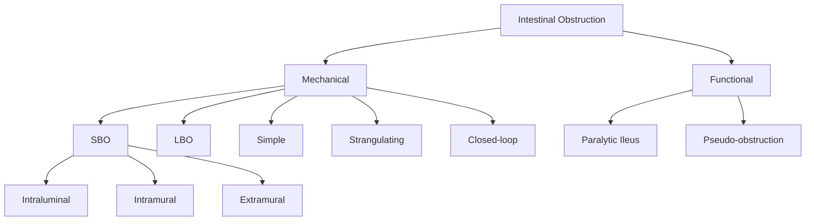
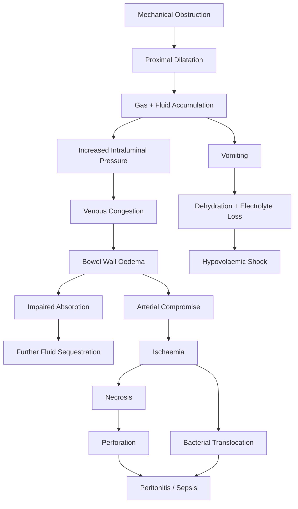

## I. Definition

> **Intestinal obstruction (IO)** refers to any condition that impedes the normal passage (aboral progress) of intestinal contents through the gastrointestinal tract.

This can occur by two fundamentally different mechanisms [1]:

1. ***Mechanical obstruction*** — implies a **physical barrier to the aboral progress of intestinal contents** (i.e., peristalsis is present and working *against* an obstruction) [1]
2. ***Ileus (functional obstruction)*** — implies **failure of peristalsis to propel intestinal contents with no mechanical barrier** [1]

The distinction matters enormously because management is completely different: mechanical obstruction often requires surgical intervention, whereas functional obstruction is usually managed conservatively by treating the underlying cause.

---

## II. Epidemiology

- ***Intestinal obstruction is a common surgical emergency*** [3]
- ***Small bowel obstruction (SBO) is more common and is involved in ~80% of cases of mechanical IO*** [3]
- ***Large bowel obstruction (LBO) accounts for about 15% of intestinal obstruction*** [1]
- ***LBO usually occurs at the sigmoid colon*** [1]
- SBO accounts for approximately 12–16% of all surgical admissions and ~20% of all emergency surgical admissions worldwide
- In Hong Kong, adhesive SBO is extremely common given the high volume of prior abdominal surgery; however, incarcerated hernias (particularly inguinal hernias) remain a leading cause in the elderly population
- In neonates, ***congenital anomalies*** — including ***intestinal atresia, malrotation, meconium disease, and Hirschsprung's disease*** — are the predominant causes [2]

### Age-specific patterns

| Age Group | Common Causes |
|:----------|:-------------|
| Neonates (0–28 days) | Intestinal atresia, malrotation with volvulus, meconium ileus, Hirschsprung's disease, anorectal malformations |
| Infants (1–36 months) | ***Intussusception*** (most common abdominal emergency in early childhood), incarcerated inguinal hernia |
| Children | Incarcerated hernia, adhesions, intussusception |
| Adults | Adhesions (~60–74%), hernias (~10%), neoplasm (~5%), Crohn's disease (~7%) for SBO [1]; colorectal cancer, volvulus, diverticular stricture for LBO |
| Elderly | Colorectal cancer (***15–20% of patients with colorectal cancer present with IO*** [1]), sigmoid volvulus, incarcerated hernia, faecal impaction |

---

## III. Risk Factors

Understanding risk factors is essentially understanding "what predisposes the bowel to being blocked or to stopping working."

### Medical History [3][4]
- **Hernia** — an incarcerated hernia traps bowel within it, creating obstruction
- **Abdominal infection or inflammation** — leads to adhesion formation or stricturing (e.g., Crohn's disease, tuberculosis, diverticulitis)
- **Abdominal malignancy** — intraluminal growth narrows the lumen; peritoneal carcinomatosis causes extrinsic compression
- **Previous intestinal obstruction** — recurrence risk is high, especially with adhesive disease (~30% recurrence)

### Surgical History [3][4]
- **Previous abdominal or pelvic surgery** — the single biggest risk factor for adhesive SBO; any peritoneal breach triggers an inflammatory-fibrotic healing cascade
- **Previous abdominal irradiation** — causes radiation enteritis → stricture formation from fibrosis (***radiation injury accounts for ~1% of SBO*** [1])

### Drug History [3][4]
- **Opiates** — activate μ-receptors on myenteric plexus → ↓ acetylcholine release → ↓ propulsive peristalsis
- **Anti-cholinergics** (anti-histamines, anti-spasmodics, anti-depressants, anti-psychotics) — block muscarinic receptors on smooth muscle → ↓ peristalsis

### Other Risk Factors
- **Chronic constipation** — predisposes to faecal impaction (LBO), sigmoid volvulus (by distending and elongating the sigmoid)
- **High-fibre diet in certain populations** — bulky stools can predispose to sigmoid volvulus
- **Bedbound / immobility** — predisposes to pseudo-obstruction and volvulus
- **Metabolic derangements** — hypokalaemia, hypothyroidism, uraemia → all impair smooth muscle contractility
- **Pregnancy** — hormonal laxity of ligaments, physical compression by gravid uterus

---

## IV. Anatomy and Function Relevant to Intestinal Obstruction

### A. Small Bowel

The small bowel (duodenum → jejunum → ileum) is approximately 6–7 metres long and is the primary site of nutrient absorption and fluid handling.

- **Blood supply**: Superior mesenteric artery (SMA) via jejunal, ileal and ileocolic branches
- **Mesentery**: The small bowel hangs from a mesentery attached to the posterior abdominal wall; this mobility makes it susceptible to adhesive kinking, volvulus, and herniation
- **Wall layers**: Mucosa → submucosa → muscularis propria (inner circular, outer longitudinal) → serosa
- **Nerve supply**: Myenteric (Auerbach's) plexus between the muscle layers controls peristalsis; submucosal (Meissner's) plexus controls secretion and absorption
  - This is why functional obstruction (paralytic ileus) involves *neuromuscular failure* of these plexuses

**Key anatomical points**:
- The **duodenojejunal flexure (ligament of Treitz)** is the landmark dividing proximal from distal SBO; obstruction proximal to this causes early bilious vomiting
- The ***terminal ileum is the narrowest portion of the small bowel*** (approximately 2 feet proximal to the ileocaecal valve), which is why gallstones (gallstone ileus) and other intraluminal objects typically impact here [4]
- ***A lesion at the ileocaecal valve presents as small bowel obstruction*** [1]

### B. Large Bowel

The large bowel (caecum → ascending → transverse → descending → sigmoid → rectum) is approximately 1.5 metres long; its primary functions are water absorption and faecal storage.

- **Blood supply**: SMA (caecum to proximal 2/3 of transverse colon) and IMA (distal 1/3 of transverse to rectum)
- **Unique anatomy**:
  - **Taeniae coli** — three longitudinal muscle bands (rather than a complete layer) leaving the wall structurally weaker between them
  - **Haustra** — sacculations between the taeniae
  - These structural features are why ***diverticula form at the weakest point where vasa recta penetrate the circular muscle*** [4]
- **Sigmoid colon** — has its own mesentery (mesosigmoid), making it mobile and prone to volvulus; also has the ***narrowest lumen → highest intraluminal pressure (Laplace's law)*** [4]
- The ***rectum is never affected by diverticula*** because its outer longitudinal muscle is a complete circumferential layer [4]

### C. The Ileocaecal Valve

This is a critical structure in IO:
- ***Competence of the ileocaecal valve determines the clinical features of distal colon obstruction*** [1]
- **Competent valve** (~1/3 of population): prevents retrograde flow of colonic contents into the ileum → creates a ***closed-loop obstruction*** between the valve and the distal obstruction → rapid caecal distension → high risk of perforation (especially when caecal diameter > 9–12 cm, per Laplace's law: T = P × r, so the caecum, having the largest radius, is most prone to perforation)
- **Incompetent valve** (~2/3 of population): allows decompression of colonic contents retrograde into the small bowel → presents with features more like SBO (distension, vomiting)

### D. Neonatal Anatomy

***Embryonic development of the gut*** [3] is critical to understanding neonatal causes:
- The GI tract is derived from **foregut** (oesophagus to mid-duodenum), **midgut** (mid-duodenum to proximal 2/3 transverse colon), and **hindgut** (distal 1/3 transverse colon to upper anal canal)
- The midgut undergoes a complex 270° counter-clockwise rotation around the SMA during weeks 4–12 of gestation
- Arrest of this rotation → ***malrotation*** → predisposes to midgut volvulus (a surgical emergency)
- ***Neural crest cells migrate craniocaudally during weeks 4–7*** of gestation to form the enteric ganglia; failure of this migration → ***Hirschsprung's disease*** [3]

<Callout title="Anatomy Pearl" type="idea">
The caecum is the most likely site of perforation in LBO with a competent ileocaecal valve because it has the largest diameter. By Laplace's law (Wall Tension = Pressure × Radius), the caecum experiences the greatest wall tension for any given intraluminal pressure.
</Callout>

---

## V. Etiology

The causes of intestinal obstruction are best organised by:
1. **Mechanism**: Mechanical vs. Functional
2. **Level**: Small bowel vs. Large bowel
3. **Relation to bowel wall**: Intraluminal vs. Intramural vs. Extramural (for mechanical causes)

### A. Mechanical Obstruction

#### (i) Small Bowel Obstruction (SBO)

> ***Most common causes of SBO: Adhesions, Malignancy, and Hernias*** [3]. The mnemonic **"ABC"** — ***Adhesion, Bulge (hernia), Cancer*** — is a useful aide-mémoire [4].

##### Extramural (Extrinsic) Causes

| Cause | Pathophysiology | Notes |
|:------|:---------------|:------|
| ***Adhesions*** | ***Congenital; post-inflammation; formed after abdominal surgery*** [1]. Fibrous bands form during peritoneal healing after surgical trauma, infection, or radiation. These bands can kink, compress, or angulate bowel loops. | ***The most common cause of SBO in Western countries*** [1]. Accounts for ***~74% of SBO admissions*** [1]. Lower abdominal and pelvic surgery (appendicectomy, colorectal surgery, gynaecological surgery) carry highest risk. |
| ***Hernias*** | Bowel herniates through a defect (inguinal canal, femoral canal, umbilical ring, incisional site) and becomes trapped (incarcerated). If the bowel lumen is obstructed, it is "obstructed"; if blood supply is also compromised, it is "strangulated." | ***~3–10% of SBO*** [1][4]. ***Incarcerated hernias are the leading cause of complications (ischaemia, necrosis, perforation) related to bowel obstruction*** [3]. In children, ***incarcerated inguinal hernia is the MC surgical cause of SBO*** [4]. |
| ***Volvulus*** | Twisting of bowel around its mesentery → luminal obstruction + vascular compromise | Small bowel volvulus is less common than sigmoid; may occur in malrotation |
| ***Intraperitoneal malignancy*** | Extrinsic compression or carcinomatosis peritonei | Ovarian, gastric, colorectal secondaries |

##### Intramural Causes

| Cause | Pathophysiology | Notes |
|:------|:---------------|:------|
| ***Tumour (primary or secondary)*** | Lymphoma, GIST, adenocarcinoma grow within the bowel wall narrowing the lumen | ***~5% of SBO*** [1] |
| ***Strictures*** | Fibrotic narrowing from ***Crohn's disease, radiation, anastomotic scarring, drug-induced*** (e.g. NSAIDs, potassium chloride) | ***Crohn's disease accounts for ~7% of SBO*** [1] |
| ***Intussusception*** | A proximal segment of bowel (intussusceptum) telescopes into a distal segment (intussuscipiens). In adults, usually caused by a pathological lead point (polyp, tumour, Meckel's diverticulum). | Most common in infants 6–36 months (usually idiopathic) |

##### Intraluminal Causes

| Cause | Pathophysiology | Notes |
|:------|:---------------|:------|
| ***Foreign bodies*** | Physical blockage of the lumen | Ingested objects, bezoars |
| ***Gallstones (gallstone ileus)*** | A large gallstone erodes through the gallbladder wall into the adjacent duodenum via a ***cholecystoenteric fistula***, then impacts at the terminal ileum (narrowest part of SB). ***Bouveret's syndrome***: stone stuck at duodenum/stomach causing gastric outlet obstruction [4]. | ***Rigler's triad on AXR: pneumobilia + SBO + ectopic gallstone*** [4] |
| ***Bezoars*** | Accumulation of indigestible material — ***trichobezoar*** (hair), ***phytobezoar*** (plant fibre) | More common in patients with prior gastric surgery or gastroparesis |
| ***Worms*** | Masses of roundworms (Ascaris lumbricoides) can physically occlude the lumen | Endemic areas; less common in HK |
| ***Meconium ileus*** | Inspissated, sticky meconium in neonates with ***cystic fibrosis*** (thick secretions due to CFTR dysfunction) | Almost pathognomonic for CF in a neonate |

<Callout title="High Yield – SBO Etiology Data" type="idea">
From the landmark Miller et al. study referenced in the lecture slides [1]:
- Adhesions: 74% of patients / 68% of admissions
- Crohn's disease: 7% / 11%
- Neoplasm: 5% / 5%
- Hernia: 3% / 3%
- Radiation injury: 1% / 1%
</Callout>

#### (ii) Large Bowel Obstruction (LBO)

> ***Most common causes of LBO: Malignancy and Volvulus*** [3]. Specifically: ***Cancer, Volvulus, Diverticulitis, Stricture (anastomotic, radiation, ischaemic, endometriotic), Extrinsic compression (metastasis, pelvic/extraperitoneal tumour)*** [1].

| Cause | Pathophysiology | Notes |
|:------|:---------------|:------|
| ***Colorectal cancer*** | Intraluminal/intramural mass progressively narrows the colonic lumen. ***15–20% of patients with colorectal cancer present with intestinal obstruction*** [1]. | ***Characteristics: more advanced cancer, elderly patients with comorbidity, high operative mortality and morbidity, worse prognosis*** [1]. Most commonly at sigmoid (narrowest lumen). |
| ***Volvulus*** | Twisting of bowel around its mesentery → closed-loop obstruction + vascular compromise. ***Sigmoid volvulus (70%)*** is most common, followed by ***caecal volvulus (25%)*** [4]. | Sigmoid volvulus: older males, elongated mesosigmoid, chronic constipation. Caecal volvulus: younger females, congenital hypermobile caecum. |
| ***Diverticulitis*** | Acute inflammation → oedema → luminal narrowing. Chronic/recurrent → fibrotic stricture. | More common in sigmoid (Western) or right colon (Asia) |
| ***Stricture*** | ***Anastomotic, radiation, ischaemic, endometriotic*** [1] | Post-surgical stricture at anastomotic site; radiation enteritis/colitis causing fibrosis |
| ***Extrinsic compression*** | ***Metastasis, pelvic/extraperitoneal tumour*** [1] | Ovarian, uterine, prostatic malignancies |

#### (iii) Neonatal Causes of Intestinal Obstruction

***Congenital anomalies*** are the primary causes [2]:

| Cause | Key Features |
|:------|:------------|
| ***Intestinal atresia*** | ***Atresia can occur from oesophagus to anus*** [2]. Most common site is jejunum and ileum. Duodenal atresia associated with Down syndrome. |
| ***Malrotation*** | Arrest of normal 270° rotation → abnormal position of duodenojejunal junction and caecum → Ladd's bands may compress duodenum → predispose to midgut volvulus |
| ***Meconium disease*** | Meconium ileus (CF) — thick, inspissated meconium; Meconium plug syndrome — colonic dysmotility |
| ***Hirschsprung's disease*** | ***Absence of ganglion cells in distal bowel*** (from failed craniocaudal migration of neural crest cells) → functional obstruction of the aganglionic segment → proximal dilatation |

Additional neonatal causes include:
- **Anorectal malformations** (imperforate anus)
- **Incarcerated inguinal hernia** (especially in premature males)
- **Necrotising enterocolitis (NEC)** — primarily affects premature neonates
- **Small left colon syndrome** — occurs in infants of diabetic mothers

### B. Functional Obstruction (Non-mechanical)

#### (i) Paralytic Ileus

> ***Paralytic ileus*** = failure of transmission of peristaltic waves secondary to ***neuromuscular failure*** in the myenteric (Auerbach's) plexus and submucosal (Meissner's) plexus [3].

| Category | Causes | Mechanism |
|:---------|:-------|:----------|
| ***Post-operative ileus*** | ***The most common cause*** [4]. | Any abdominal procedure causes peritoneal inflammation → inhibitory sympathetic reflexes + local inflammatory mediators (IL-6, prostaglandins) → paralysis of smooth muscle. ***A degree of paralytic ileus is common after any abdominal procedure with variable duration of 24–72 hours*** [3]. |
| ***Intra-peritoneal*** | ***Peritonitis, intra-abdominal abscess*** [1] | Peritoneal inflammation activates inhibitory sympathetic pathways |
| ***Inflammatory/infective*** | ***Inflammatory/infective conditions*** [1] | Same mechanism as above |
| ***Intestinal ischaemia*** | | Ischaemic bowel cannot contract effectively |
| ***Retroperitoneal*** | ***Retroperitoneal haematoma/infection; aortic, spinal, urological operations; pancreatitis*** [1] | Retroperitoneal inflammation irritates the sympathetic chain/coeliac plexus → reflex ileus |
| **Reflex ileus** | ***Fracture of spine or ribs, retroperitoneal haemorrhage*** [3] | As above |
| **Metabolic** | ***Hypokalaemia, hypothyroidism***, uraemia, diabetic ketoacidosis | K⁺ is essential for smooth muscle repolarisation; ↓K⁺ → membrane hyperpolarisation → ↓contractility. Thyroid hormone maintains basal metabolic rate of smooth muscle. |
| **Drug-induced** | ***Opiates, anti-cholinergics*** [3] | Opiates: μ-receptor activation → ↓ACh release from myenteric plexus → ↓peristalsis. Anti-cholinergics: block muscarinic M₃ receptors on smooth muscle → ↓contraction. |

<Callout title="Post-operative Ileus Timeline" type="idea">
Normal return of bowel function post-operatively: ***Small bowel: hours; Stomach: 1–2 days; Colon: 3–5 days*** [4]. Post-operative ileus is **clinically significant if > 72 hours post-op** with no return of bowel sounds, no flatus, and abdominal distension [4].
</Callout>

#### (ii) Pseudo-obstruction

> ***Pseudo-obstruction*** = clinical picture of obstruction ***in the absence of a mechanical cause or intra-abdominal disease*** [3]. ***Obstruction in the absence of a mechanical cause*** — associated with ***underlying neuropathy or myopathy*** [3].

##### Acute Colonic Pseudo-obstruction (Ogilvie's Syndrome)

- ***Characterised by acute dilatation of the colon in the absence of an anatomic lesion that obstructs the flow of intestinal content*** [3]
- ***Occurs in hospitalised patients in association with a severe illness or after surgery and in conjunction with a metabolic imbalance or administration of medications*** [3]
- ***Abdominal distension is the most common clinical presentation*** [3]
- Pathophysiology: ***Autonomic imbalance (↓ parasympathetic / ↑ sympathetic) → aperistalsis*** [4]
- Aetiology: metabolic disturbance (DM, hypoK, hypothyroidism, uraemia), drugs (opioids, CCBs), trauma/post-op, neurological diseases (Parkinson's, MS) [4]

##### Chronic Colonic Pseudo-obstruction

- ***Toxic megacolon***: ***Characterised by total or segmental colonic dilatation with systemic toxicity*** [3]. Occurs as a complication of IBD, infectious colitis (***commonly associated with Clostridium difficile***), ischaemic colitis, volvulus, diverticulitis and obstructive colorectal cancer. ***Bloody diarrhoea is the most common clinical presentation*** [3].
- ***Hirschsprung's disease***: Chronic functional obstruction from aganglionic segment

##### Small Intestinal Pseudo-obstruction
- Idiopathic
- ***Familial visceral myopathy*** [3]

#### Differentiating Features: Pseudo-obstruction vs. Mechanical Obstruction [4]

| Feature | Pseudo-obstruction | Mechanical Obstruction |
|:--------|:------------------|:----------------------|
| Bowel sounds | ***Normal*** | High-pitched / tinkling (early); absent (late) |
| PR examination | ***Dilated rectum*** | Collapsed, empty rectum |
| Pain | Distension but ***not much pain*** | Colicky, significant |
| AXR | Gas in rectum present | Absent rectal gas |

---

## VI. Classification

Intestinal obstruction can be classified along several axes. This matters clinically because the classification determines urgency, likely cause, and management approach.

### A. Anatomical Classification [3]
- **Small bowel obstruction (SBO)**
- **Large bowel obstruction (LBO)**

### B. Mechanical vs. Functional Classification [3]
- **Mechanical** — peristalsis works *against* a physical barrier
- **Functional** — absence or inadequacy of peristalsis without mechanical barrier
  - Paralytic ileus
  - Pseudo-obstruction

### C. Completeness [1]
- ***Partial vs. Complete obstruction*** [1]
  - **Partial**: some gas/fluid still passes → patient may still pass flatus, diarrhoea may occur (overflow)
  - **Complete**: no passage of gas or stool → absolute constipation (obstipation)

### D. Chronicity [1]
- ***Chronic vs. Acute*** [1]
  - **Acute**: sudden onset, often surgical emergency
  - **Chronic**: insidious, often from slowly growing tumours or strictures; may have intermittent subacute episodes

### E. Complexity [1]
- ***Simple obstruction*** — ***obstruction of the lumen, usually at one point only*** [1]; blood supply intact
- ***Strangulating obstruction*** — ***blood supply to bowel impaired*** [1]; constitutes a surgical emergency due to risk of ischaemia, necrosis, perforation
- ***Closed-loop obstruction*** — ***lumen occlusion in at least 2 points*** [1]; a ***segment of intestine is obstructed in two locations creating a segment with no proximal or distal outlet*** [3]
  - ***Presents with minimal abdominal distension since only a short segment of intestine is distended*** [3]
  - ***Can rapidly lead to complications such as ischaemia, necrosis and perforation*** [3]
  - Examples: LBO with competent ileocaecal valve, volvulus, hernia containing a loop of bowel, ***afferent loop syndrome (post-Billroth II gastrectomy)*** [4]

### F. Relation to Bowel Wall (for mechanical causes) [3]
- **Intraluminal** (within the lumen)
- **Intramural** (within the wall)
- **Extramural** (outside the wall)

<Callout title="Strangulation vs. Simple Obstruction" type="error">
A common exam mistake is failing to distinguish simple from strangulating obstruction. **Strangulation** implies compromised blood supply and is a **time-critical surgical emergency**. Clinical clues to strangulation include: constant (non-colicky) pain, peritoneal signs (guarding, rebound), tachycardia, fever, leucocytosis, and metabolic acidosis with raised lactate. Do not wait for these signs to develop — if in doubt, operate early.
</Callout>

### Classification Summary Diagram

---

## VII. Pathophysiology

Understanding the pathophysiology of IO is essential because every clinical feature and complication can be traced back to these mechanisms.

### A. Proximal Dilatation [3][4]

When a mechanical obstruction occurs, the bowel proximal to the obstruction dilates due to:

1. **Accumulation of gas**:
   - ***Swallowed air*** (the major source; ~70% nitrogen which cannot be absorbed)
   - ***Bacterial fermentation*** — significant overgrowth of both aerobic and anaerobic organisms producing CO₂, H₂, and methane [3]
2. **Accumulation of fluid**:
   - ***Saliva, bile, pancreatic secretions, and gastric secretions*** [3] — the GI tract normally secretes 6–8 litres of fluid per day, most of which is reabsorbed. Obstruction prevents distal reabsorption → massive fluid accumulation in the proximal bowel
3. **Peristaltic response**:
   - ***Initially, increased peristalsis attempts to overcome the obstruction*** [4] — this is why early bowel sounds are high-pitched and hyperactive ("tinkling")
   - Eventually, the bowel fatigues and becomes atonic

### B. Distal Collapse [3][4]

- ***Bowel below the obstruction exhibits normal peristalsis and absorption*** [3]
- ***Eventually becomes empty and collapses*** [3]
- This is why PR examination in mechanical LBO typically reveals an ***empty, collapsed rectum*** (in contrast to the ***dilated rectum*** of pseudo-obstruction)

### C. Dehydration and Electrolyte Imbalance [3][4]

This is a major source of morbidity and mortality in IO:

| Mechanism | Explanation |
|:----------|:-----------|
| ***Decreased oral intake*** | Nausea, vomiting, and NPO status |
| ***Vomiting*** | ***Loss of fluid containing Na⁺, K⁺, Cl⁻, H⁺*** [3] → **hypochloraemic, hypokalaemic metabolic alkalosis** (loss of H⁺ and Cl⁻ from gastric secretions) |
| ***Defective intestinal absorption*** | Oedematous bowel wall cannot absorb water and electrolytes normally [4] |
| ***Fluid sequestration in bowel lumen*** | Fluid is trapped ("third-spacing") within the dilated bowel, effectively lost from the circulating volume |
| ***Transudation into peritoneal cavity*** | ***Transudation of fluid into extracellular space and peritoneal cavity*** [3] — increased hydrostatic pressure in congested bowel wall drives fluid into the peritoneum |

The net effect is **hypovolaemia** → tachycardia, hypotension, oliguria, prerenal AKI.

### D. Pathogenesis of Strangulation [3]

Strangulation represents the most dangerous evolution of IO:

1. ***Impaired venous and lymphatic return*** → ***venous and lymphatic congestion resulting in oedematous tissues*** [3]
   - Venous pressure rises → increased capillary hydrostatic pressure → oedema and haemorrhagic infarction of the bowel wall
2. ***Compromised arterial blood supply*** → ***bowel ischaemia, necrosis and subsequently perforation*** [3]
   - As intramural oedema worsens, even arterial inflow is eventually compressed
   - Ischaemic bowel loses its mucosal barrier → **bacterial translocation** across the bowel wall into the peritoneal cavity and bloodstream → peritonitis, sepsis, multi-organ failure

### E. Closed-loop Obstruction — Special Pathophysiology

In closed-loop obstruction (e.g., LBO with competent ileocaecal valve, volvulus):
- The trapped segment cannot decompress in either direction
- Intraluminal pressure rises rapidly
- The caecum (largest diameter) is at highest risk of perforation by **Laplace's law** (Wall Tension = Pressure × Radius)
- Caecal diameter > 9 cm on imaging is a warning sign; > 12 cm is considered critical with imminent perforation risk

### F. Systemic Consequences

The progressive pathophysiology can be summarised in a cascade:

---

## VIII. Clinical Features

> ***Cardinal features of IO = Abdominal pain + Distension + Vomiting + Absolute constipation*** [3]

The clinical presentation depends on the **level** (proximal vs. distal), **completeness** (partial vs. complete), **type** (simple vs. strangulating), and **duration** of obstruction.

### A. Symptoms

#### 1. Abdominal Pain

- ***Sudden onset*** [3]
- ***Colicky in nature*** — ***paroxysms of pain coinciding with increased peristaltic activity*** [3]
  - **Why colicky?** The bowel contracts vigorously trying to push contents past the obstruction → intermittent smooth muscle contraction → intermittent pain → relief between spasms
- ***Located in periumbilical region (small bowel) or infraumbilical (large bowel)*** [3]
  - **Why periumbilical for SBO?** The small bowel is a midgut-derived structure; visceral pain from the midgut is referred to the periumbilical region (T9–T10 dermatome)
  - **Why infraumbilical for LBO?** The hindgut-derived colon refers pain to the infraumbilical/suprapubic region (T11–L1 dermatome)
- ***Progression from cramping to more focal and constant pain may indicate peritoneal irritation related to complications such as bowel ischaemia and necrosis*** [3]
  - **Why does it become constant?** Ischaemic bowel causes *continuous* irritation of the visceral and then parietal peritoneum → constant, localised, somatic pain that is worsened by movement

#### 2. Vomiting

- ***The more distal the obstruction, the longer it takes for the onset of nausea and vomiting*** [3]
  - **Why?** In proximal SBO, the stomach fills quickly with regurgitated secretions → early vomiting. In distal SBO or LBO, there is a large capacitance reservoir that must fill before retrograde flow reaches the stomach.
- ***Character of vomitus changes from digested food to feculent material as obstruction progresses due to enteric bacterial overgrowth*** [3]
  - "Feculent" does not mean actual faeces — it is the foul-smelling product of bacterial fermentation in stagnant small bowel contents
- **Bilious vomiting** in a neonate is ***malrotation with midgut volvulus until proven otherwise*** — this is a ***surgical emergency*** [2][5]
- In proximal SBO: vomiting is **early, profuse, and bilious** → leads to rapid dehydration and metabolic alkalosis
- In LBO: vomiting is **late** and may be feculent; some patients never vomit

#### 3. Abdominal Distension

- ***The more distal the obstruction, the greater the distension*** [3]
  - **Why?** More bowel length is available proximal to the obstruction for gas and fluid accumulation
- Proximal SBO: minimal or absent distension (short segment of bowel proximal to obstruction)
- Distal SBO: moderate distension
- LBO: marked, generalised distension (entire colon and potentially ileum if valve is incompetent)

#### 4. Absolute Constipation (Obstipation)

- ***Inability to pass faeces and flatus*** [3]
- ***Feature of complete intestinal obstruction*** [3]
- **Why?** In complete obstruction, nothing passes the obstruction point → distal bowel empties its residual contents → then nothing more can pass
- In **partial** obstruction, some flatus or even diarrhoea may still be present (overflow diarrhoea)
- Note: patients may pass stool/flatus from bowel *distal* to the obstruction in the early hours — this does NOT exclude obstruction

#### Summary: Clinical Presentation by Level

| Feature | Proximal SBO | Distal SBO | LBO |
|:--------|:-------------|:-----------|:----|
| Pain | Periumbilical, colicky, frequent | Periumbilical, colicky | Infraumbilical, colicky; may be less intense initially |
| Vomiting | Early, profuse, bilious | Later onset, may become feculent | Late or absent; if present, feculent |
| Distension | Minimal/absent | Moderate | Marked |
| Constipation | Late | Present | Early and prominent |
| Dehydration | Severe (early vomiting) | Moderate | Less prominent initially |

### B. Signs

#### 1. General Examination

- **Dehydration**: dry mucous membranes, decreased skin turgor, sunken eyes, tachycardia, hypotension
  - *Why?* Loss of fluid from vomiting, third-spacing, and reduced oral intake
- **Tachycardia**: may be from dehydration or pain; persistent tachycardia with fever raises concern for strangulation/sepsis
- **Fever**: suggests strangulation, perforation, or intra-abdominal sepsis
- **Hernia sites must be examined** — always check groin (inguinal and femoral), umbilical, and any surgical scars for incisional hernias
  - ***Incarcerated hernias are the leading cause of complications related to bowel obstruction*** [3]

#### 2. Abdominal Inspection

- **Distension**: as described above; assess degree
- **Surgical scars**: suggest adhesive obstruction
- **Visible peristalsis**: may be visible through the abdominal wall in thin patients with SBO — represents hyperperistalsis of bowel proximal to obstruction trying to overcome it ("ladder pattern")
- **Hernia orifices**: groin, umbilicus, incisional sites

#### 3. Abdominal Palpation

- **Tenderness**:
  - Mild diffuse tenderness is common in uncomplicated IO
  - ***Localised tenderness, guarding, rebound tenderness*** → suggests **peritonism** from strangulation, ischaemia, or perforation
  - A **tender, irreducible lump at a hernia site** = obstructed/strangulated hernia until proven otherwise
- **Palpable mass**: may represent the obstructing lesion (tumour), distended closed-loop, or intussusception ("sausage-shaped mass" in the RUQ in paediatric intussusception)

#### 4. Abdominal Percussion

- **Tympanic (hyper-resonant)**: due to gas-filled, distended bowel loops
- **Shifting dullness**: suggests free peritoneal fluid (ascites from transudation)

#### 5. Auscultation

- **Early / Simple obstruction**: ***High-pitched, tinkling bowel sounds*** — "borborygmi" — representing hyperactive peristalsis trying to overcome the obstruction
- **Late / Strangulation**: ***Absent bowel sounds*** — the bowel has fatigued or become necrotic → no more peristalsis
- ***Paralytic ileus: hypoactive or absent bowel sounds*** [4]
- ***Pseudo-obstruction: normal bowel sounds*** [4] — this is a key differentiating feature

#### 6. Digital Rectal Examination (PR)

- **Essential in every patient with suspected IO**
- **Empty rectum** in mechanical LBO (distal bowel has been evacuated)
- ***Dilated rectum*** in pseudo-obstruction [4]
- May reveal:
  - A rectal mass (colorectal cancer)
  - Blood on glove ("redcurrant jelly" mucus in intussusception; blood from ischaemic mucosa)
  - Faecal impaction
  - An empty ballooned rectum in Hirschsprung's disease (after which a gush of stool/gas may be released — "blast sign")

### C. Special Clinical Features by Cause

#### Strangulated Obstruction — Warning Signs

| Sign | Mechanism |
|:-----|:---------|
| Constant (non-colicky) pain | Continuous ischaemic irritation of peritoneum |
| Peritonism (guarding, rigidity, rebound) | Peritoneal inflammation from ischaemia/necrosis/perforation |
| Tachycardia, fever | Systemic inflammatory response/sepsis |
| Leucocytosis | Inflammatory response |
| Metabolic acidosis / Raised lactate | Anaerobic metabolism in ischaemic bowel |
| Bloody PR | Mucosal sloughing from ischaemic bowel |

#### Neonatal Intestinal Obstruction — Key Features [2][5]

***Bilious vomiting in a neonate is malrotation with midgut volvulus until proven otherwise*** — it is a ***surgical emergency*** [2][5].

| Feature | Significance |
|:--------|:------------|
| ***Bilious (green) vomiting*** | Obstruction distal to ampulla of Vater; think malrotation with midgut volvulus as the most dangerous cause |
| ***Non-bilious projectile vomiting*** | Obstruction proximal to ampulla; think pyloric stenosis (if 2–8 weeks old) or oesophageal/proximal duodenal atresia |
| ***Failure to pass meconium within 24–48 hours*** | Think Hirschsprung's disease, meconium ileus, anorectal malformation |
| ***Abdominal distension*** | Lower obstruction (ileal/colonic); may be absent in proximal obstruction |
| ***"Double bubble" sign on AXR*** | Duodenal atresia (dilated stomach + proximal duodenum, no distal gas if complete) |

#### Intussusception (Paediatric) — Classic Triad [3]

1. **Colicky abdominal pain** — episodic screaming with drawing up of legs, child appears well between episodes
2. **"Redcurrant jelly" stools** — bloody mucus per rectum from venous congestion and mucosal ischaemia of the intussuscepted segment
3. **"Sausage-shaped" mass** — usually palpable in the RUQ (because the ileocolic intussusception pushes along the course of the colon)
4. **"Dance sign"** — emptiness in the RIF (because the caecum has been dragged upwards)

#### Sigmoid Volvulus — Classic Features [4]
- Elderly, male, institutionalised/bedbound patient with chronic constipation
- Massive abdominal distension (often asymmetric)
- ***Coffee bean sign on AXR*** — dilated sigmoid arising from pelvis/LLQ, ahaustral, with 3 lines of sigmoid wall converging at the twist point [4]
- ***Bird's beak sign on contrast enema*** — tapering of contrast at the twist point [4]
- ***Whirl sign on CT*** [4]

<Callout title="Don't Forget Hernia Orifices!" type="error">
A common exam and clinical pitfall is forgetting to examine all hernia orifices (bilateral inguinal, femoral, umbilical, and incisional sites) in a patient presenting with intestinal obstruction. An ***incarcerated hernia*** can cause bowel obstruction and is easily missed if the groin is not exposed. **Always check the groin** — especially in elderly patients presenting with SBO.
</Callout>

---

## IX. Neonatal Intestinal Obstruction — Detailed Pathophysiology by Cause

Given the emphasis in the lecture slides [2][5][6], let us elaborate on the major neonatal causes:

### A. Intestinal Atresia [3]

- ***Atresia is a congenital defect of a hollow viscus that results in complete obstruction of the lumen*** [3]
- ***One of the most frequent causes of bowel obstruction in newborns*** [3]
- ***Most commonly affected site: jejunum and ileum (jejunoileal atresia)***; least common: colon [3]
- ***Duodenal atresia causes complete obstruction; duodenal stenosis causes partial obstruction only*** [3]

**Pathogenesis**: Two theories depending on location:
- **Duodenal atresia**: Failure of recanalization — during weeks 4–8 of gestation, the duodenal lumen becomes obliterated by epithelial proliferation and then normally recanalizes. If this fails → atresia or stenosis.
- **Jejunoileal atresia**: Vascular accident — an in-utero mesenteric vascular insult (thrombosis, volvulus, intussusception) causes segmental ischaemic necrosis → resorption → atresia. This is why jejunoileal atresia is NOT associated with other congenital anomalies (unlike duodenal atresia).

**Classification** (Grosfeld) [3]:
- ***Type I (mucosal web)***: Intact bowel wall with intraluminal mucosal membrane
- ***Type II (fibrous cord)***: Atretic ends connected by fibrous cord, mesentery intact
- ***Type IIIa (mesenteric gap defect)***: Atretic ends separated by a V-shaped mesenteric gap
- ***Type IIIb (apple-peel / Christmas tree)***: Proximal jejunal atresia with the distal bowel spiralling around a single SMA branch — carries high mortality
- ***Type IV (multiple atresia)***: Multiple atretic segments ("string of sausages")
- ***Type III is the most common; Type I is the least common*** [3]

**Associations** [3]:
- ***Duodenal atresia***: Down syndrome (trisomy 21) — ~30%; cardiac, renal, vertebral, biliary anomalies
- ***Jejunoileal atresia***: Cystic fibrosis (meconium ileus)
- ***Colonic atresia***: Hirschsprung's disease

### B. Malrotation [3][5][6]

- ***Intestinal malrotation occurs when normal rotation of the embryonic gut is arrested or disturbed during in utero development*** [3]
- ***Majority of patients present during neonatal period or within the first year of life*** [3]

**Normal embryology** [3]:
1. Weeks 4–5: Rapid growth of midgut → physiological herniation through the umbilicus
2. Weeks 6–10: The midgut undergoes a 270° counter-clockwise rotation around the SMA axis
3. Week 10–12: Return to abdomen with the duodenojejunal junction fixing to the left of midline (at the ligament of Treitz) and the caecum fixing in the RIF; the mesentery then fuses broadly to the posterior abdominal wall

**What goes wrong in malrotation**:
- The rotation is incomplete → the duodenojejunal junction fails to reach its normal position → the caecum fails to descend to the RIF
- **Ladd's bands**: Peritoneal bands extend from the malpositioned caecum across the duodenum to fix in the RUQ → extrinsic compression of the duodenum
- **Narrow mesenteric base**: The unfixed mesentery has a dangerously narrow pedicle → the entire midgut can twist around the SMA → ***midgut volvulus*** → catastrophic midgut ischaemia if not corrected within hours

**Associated conditions** [3]: CDH (~100%), CHD (40–90%), heterotaxy syndrome, omphalocele (31–45%), gastroschisis, intestinal atresia, oesophageal atresia, biliary atresia, Meckel's diverticulum

### C. Hirschsprung's Disease [3]

- "Hirschsprung" → named after Harald Hirschsprung who described it in 1886
- ***Occurs in 1 in 5000 live births; male predominance (M:F = 3:1 to 4:1)*** [3]
- ***Predominant gene: RET proto-oncogene*** — loss-of-function mutation → impaired neural crest cell migration and differentiation [3]

**Pathogenesis** [3]:
- ***Defect in craniocaudal migration of neuroblasts from the neural crest***
- Migration begins at ***week 4 and should reach the distal colon by week 7*** of gestation [3]
- ***Failure of cells to reach the distal colon leaves that segment aganglionic and therefore non-functional*** [3]
- The aganglionic segment remains tonically contracted (because ganglia normally provide inhibitory relaxation via NO and VIP) → functional obstruction → proximal bowel dilates

**Clinical features** [3]:
- Failure to pass meconium within 24–48 hours of birth (90% of neonates with HD)
- Abdominal distension
- Bilious vomiting
- "Blast sign" on PR: explosive release of gas and stool when the examining finger is withdrawn
- Later presentation: chronic constipation in children (short-segment disease)
- Complication: **Hirschsprung-associated enterocolitis (HAEC)** — explosive, foul-smelling diarrhoea, abdominal distension, fever, sepsis → can be life-threatening

### D. Intussusception [3]

- ***Intussusception = invagination (telescoping) of a part of intestine into itself*** [3]
- ***Most common abdominal emergency in early childhood*** [3]
- ***Most common cause of intestinal obstruction in infants between 6–36 months*** [3]
- ***Male predominance (M:F = 3:2)*** [3]
- ***Location: most often at ileocaecal junction (ileocolic intussusception)*** [3]

**Pathogenesis** [3]:
- ***Idiopathic (75%)***: Hypertrophy of Peyer's patches in lymphoid-rich terminal ileum secondary to viral infection (URTI, gastroenteritis) acts as a lead point
- ***Pathological lead point*** (more common in adults or children > 6 years): Meckel's diverticulum, polyps, lymphoma, duplication cysts, HSP
- The intussusceptum (proximal segment) drags into the intussuscipiens (distal segment) → venous congestion → mucosal oedema and haemorrhage → "redcurrant jelly" stool → if untreated, arterial compromise → necrosis → perforation

---

## X. Closed-Loop Obstruction — Special Entities

### A. Hernia-related Closed-Loop Obstruction [3][4]

- **Definitions** [4]:
  - ***Reducible***: hernia contents can be returned to the abdomen
  - ***Incarcerated***: contents are trapped but the bowel lumen is not obstructed
  - ***Obstructed***: bowel lumen is obstructed (closed-loop IO) but blood supply intact
  - ***Strangulated***: blood supply also compromised → ischaemia → gangrene
  - ***Richter's hernia***: only one sidewall of bowel is incarcerated → ischaemia without obstruction [4]
  - ***Reduction-en-masse***: apparently reducing the sac but did not push contents out → still strangulated [4]
- ***Incidence of strangulation: femoral > indirect inguinal > direct inguinal*** [4]

### B. Gallstone Ileus [4]

- ***Gallstone erodes through the GB into adjacent bowel through a cholecystoenteric fistula*** [4]
- ***Bouveret's syndrome***: stone stuck at duodenum/stomach → GOO [4]
- ***Cholecystoduodenal fistula (MC)***: stone travels through SB → impacts at ***terminal ileum, 2 feet proximal to the ileocaecal valve*** (narrowest part of SB) [4]
- ***AXR: Rigler's triad — pneumobilia + SBO + ectopic gallstone (usually in RIF)*** [4]
- Management: ***Enterolithotomy*** — exploratory laparotomy → ***proximal enterotomy (NOT over the stone because of ulceration)*** → ***milk the stone proximally for extraction*** [4]

---

<Callout title="High Yield Summary">

**Definition**: IO = any impediment to aboral passage of intestinal contents. Mechanical (physical barrier) vs. Functional (ileus/pseudo-obstruction).

**Epidemiology**: SBO accounts for ~80% of mechanical IO. LBO ~15%. Most common causes: SBO = adhesions > hernia > cancer; LBO = cancer > volvulus > diverticulitis.

**Risk Factors**: Prior surgery (adhesions), hernia, malignancy, medications (opiates, anticholinergics), metabolic (hypoK, hypothyroid).

**Pathophysiology cascade**: Obstruction → proximal dilatation (gas + fluid) → ↑ intraluminal pressure → venous congestion → oedema → arterial compromise → ischaemia → necrosis → perforation → peritonitis/sepsis. Dehydration from vomiting, third-spacing, impaired absorption.

**Cardinal Features (4)**: Pain (colicky → constant if strangulation), Vomiting (early in proximal SBO; late/feculent in distal), Distension (greater with distal obstruction), Absolute constipation (complete obstruction).

**Key Signs**: Dehydration, high-pitched tinkling bowel sounds (early) → absent (late), abdominal tenderness (peritonism = strangulation), empty rectum on PR (mechanical LBO), visible peristalsis, hernial orifices must be checked.

**Closed-loop obstruction**: Obstruction at 2 points, rapid ischaemia risk. Examples: LBO + competent ileocaecal valve, volvulus, hernia.

**Neonatal IO**: Bilious vomiting = malrotation with midgut volvulus until proven otherwise. Key causes: intestinal atresia, malrotation, meconium disease, Hirschsprung's disease.

**Classification**: By anatomy (SBO/LBO), mechanism (mechanical/functional), completeness (partial/complete), complexity (simple/strangulating/closed-loop), relation to wall (intra/intramural/extramural).

</Callout>

---

<ActiveRecallQuiz
  title="Active Recall - Intestinal Obstruction (Definition to Clinical Features)"
  items={[
    {
      question: "Name the 4 cardinal features of intestinal obstruction and explain how the level of obstruction affects each feature.",
      markscheme: "Pain (periumbilical for SBO, infraumbilical for LBO), Vomiting (early and bilious in proximal SBO, late and feculent in distal), Distension (greater with more distal obstruction), Absolute constipation (complete obstruction). More distal = more distension, later vomiting; more proximal = earlier vomiting, less distension.",
    },
    {
      question: "What is the most common cause of SBO in adults, and what is the most common cause of LBO? Give the approximate percentage for SBO.",
      markscheme: "SBO: Adhesions (approximately 60-74%). LBO: Colorectal cancer. 15-20% of CRC patients present with IO.",
    },
    {
      question: "Explain the pathophysiological cascade from simple mechanical obstruction to perforation.",
      markscheme: "Obstruction leads to proximal dilatation from gas and fluid accumulation, then increased intraluminal pressure causes venous and lymphatic congestion, then bowel wall oedema, then arterial compromise causing ischaemia, then necrosis, then perforation leading to peritonitis and sepsis. Bacterial translocation occurs at the ischaemia stage.",
    },
    {
      question: "A neonate presents with bilious vomiting on day 1 of life. What is the most important diagnosis to exclude and why?",
      markscheme: "Malrotation with midgut volvulus. It is a surgical emergency because the entire midgut can twist around the SMA, leading to catastrophic midgut ischaemia and necrosis within hours if not surgically corrected via Ladd procedure.",
    },
    {
      question: "Explain why a competent ileocaecal valve in the presence of a distal colonic obstruction is dangerous.",
      markscheme: "A competent ileocaecal valve prevents retrograde decompression into the ileum, creating a closed-loop obstruction. This causes rapid rise in intraluminal pressure, particularly in the caecum which has the largest diameter. By Laplace law (Tension = Pressure x Radius), the caecum is at highest risk of perforation when diameter exceeds 9-12 cm.",
    },
    {
      question: "List 4 clinical features that suggest strangulation has occurred in a patient with bowel obstruction.",
      markscheme: "Any 4 of: constant non-colicky pain, peritoneal signs (guarding, rigidity, rebound tenderness), tachycardia, fever, leucocytosis, raised lactate or metabolic acidosis, bloody PR discharge, absent bowel sounds.",
    },
  ]}
/>

---

## References

[1] Lecture slides: GC 194. Intestinal obstruction colorectal cancer.pdf (pp. 3, 4, 9, 21–23, 30, 39, 41, 42)
[2] Lecture slides: GC 205. The newborn baby is vomiting repeatedly Neonatal intestinal obstruction and other GI emergencies.pdf (p. 5)
[3] Senior notes: felixlai.md (Intestinal Obstruction, Intestinal Atresia, Intestinal Malrotation, Hirschsprung Disease, Intussusception, Volvulus sections)
[4] Senior notes: maxim.md (sections 4.3 Intestinal Obstruction, Volvulus, Gallstone Ileus, Hernia, Diverticular Disease, Meckel Diverticulum, Pseudo-obstruction)
[5] Lecture slides: Neonatal Surgery.pdf
[6] Lecture slides: Case Study – Paediatric Surgery Bilious vomiting of new-born_ACH Fung.pdf
