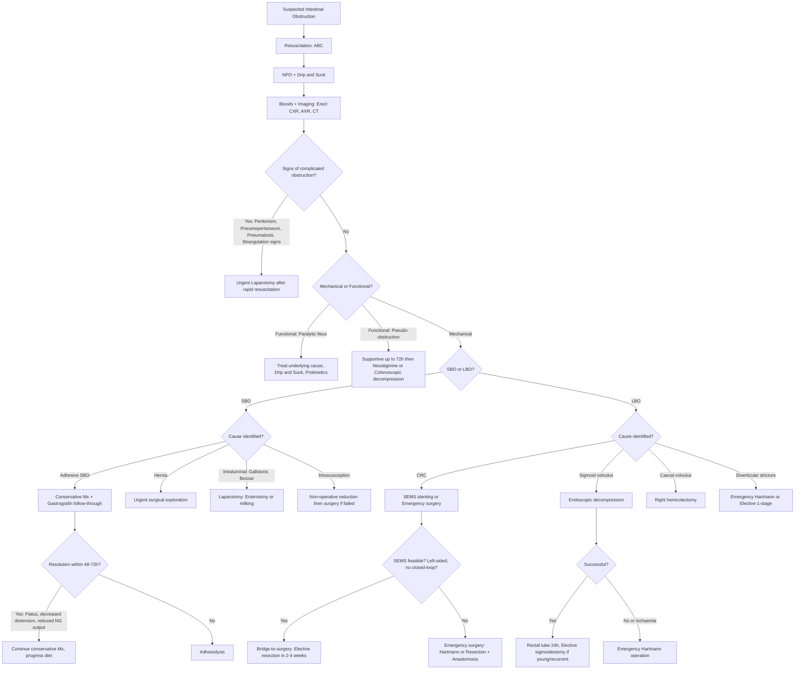

## Management of Intestinal Obstruction

### A. Overarching Principles

The management of IO follows a logical sequence that mirrors the diagnostic questions from the lecture slides [1]:

> ***Management: initial resuscitation followed by determination of the site and cause of obstruction*** [1]
> ***Decision on surgery and timing of surgery important*** [1]
> ***High mortality if complications occur*** [1]

Every patient with suspected IO requires **simultaneous resuscitation and assessment**. The key management decision is whether the patient needs **conservative (non-operative) management** or **urgent surgical intervention** — and if conservative, for how long before you pull the trigger on surgery.

---

### B. Management Algorithm — Master Overview

---

### C. Initial Management — All Patients ("Drip and Suck")

Every patient with IO, regardless of cause, requires the same initial resuscitation package. The mnemonic is **"Drip and Suck"** [3][4]:

> ***Resuscitation: ABC. NPO, O₂, IV access, analgesics, anti-emetics*** [4]

#### 1. Nil Per Os (NPO)

- ***All patients should be made NPO to limit bowel distension*** [3]
- **Why?** Any oral intake adds to the accumulating gas and fluid proximal to the obstruction, worsening distension, vomiting risk, and aspiration risk

#### 2. IV Fluid Resuscitation ("Drip")

> ***Intravenous fluid and electrolytes*** [1]

- ***External loss due to vomiting*** + ***internal loss due to sequestration of fluid in the bowel as part of the non-functional ECF (third-space loss) leading to intravascular volume depletion*** [3]
- **Crystalloids**: normal saline (0.9% NaCl), Ringer's lactate, or Hartmann's solution [3]
- ***K⁺ replacement may be indicated but should be given cautiously in patients with AKI from severe dehydration*** [3]
  - **Why cautious?** In AKI, the kidneys cannot excrete potassium effectively → risk of hyperkalaemia even though the patient is total-body K⁺ depleted. Always check K⁺ and renal function before replacing.
- **Monitoring**: Strict fluid balance (input/output charting), urine output (target > 0.5 mL/kg/h), serial U&Es
- In severe hypovolaemia: may need rapid fluid boluses (e.g. 500 mL over 15 min) guided by clinical response

#### 3. Nasogastric Tube Decompression ("Suck")

> ***NG tube / Salem sump tube (suck): free drainage + Q4h aspiration to decompress proximal bowel and reduce N/V*** [4]

- ***Achieved by non-vented (Ryle) or vented (Salem Sump) tube*** [3]
- ***Placed on free drainage with 4-hourly aspiration*** [3]
- **Functions** [3]:
  - ***Decompression proximal to obstruction*** — removes accumulated gas and fluid from the stomach/proximal SB, reducing intraluminal pressure
  - ***Reduce risk of aspiration during induction of anaesthesia and post-extubation*** — a stomach full of bilious/faeculent fluid is a massive aspiration risk during intubation
- **NG output monitoring**: Volume, colour (bilious = distal to ampulla obstruction), reducing output suggests resolution
- **Salem Sump** (double-lumen) is preferred over Ryle (single-lumen) because the vent lumen prevents the tube from adhering to the gastric mucosa during suction, reducing mucosal injury

#### 4. Pain Relief

- ***Pain management with opioids is reasonable although pain from mechanical bowel obstruction in general is often not amenable to treatment with analgesics*** [3]
- In practice: IV paracetamol as first-line, then careful titration of IV morphine/fentanyl
- ***Pethidine has no effect on gut motility c.f. morphine*** [4] — this makes it theoretically preferable in ileus, but its use is declining due to norpethidine toxicity risk
- Anti-emetics: metoclopramide (prokinetic — aids peristalsis, but contraindicated in complete mechanical obstruction as it increases peristalsis against the obstruction → risk of perforation), ondansetron, or cyclizine

<Callout title="Metoclopramide in Complete Mechanical Obstruction" type="error">
**Do NOT give metoclopramide in complete mechanical bowel obstruction.** Metoclopramide is a D₂ antagonist and 5-HT₄ agonist that increases peristaltic activity. In a complete mechanical obstruction, increased peristalsis against a fixed barrier can worsen distension, pain, and theoretically precipitate perforation. Use ondansetron or cyclizine instead for anti-emesis.
</Callout>

#### 5. Antibiotic Prophylaxis

> ***Antibiotics: if suspect bowel perforation; IV ceftriaxone + metronidazole*** [4]

- ***Broad-spectrum antibiotics due to bacterial overgrowth*** [3]
- ***Mandatory for all patients undergoing surgery for intestinal obstruction*** [3]
- ***Warranted especially in patients with complicated obstruction*** [3]
- **Why?** Bacterial translocation from ischaemic/distended bowel → bacteraemia. Enteric organisms include Gram-negatives (E. coli, Klebsiella) and anaerobes (Bacteroides) → need cover for both
- **Regimen**: IV ceftriaxone (Gram-negative cover) + IV metronidazole (anaerobic cover) [4]; or amoxicillin-clavulanate; or piperacillin-tazobactam in severe sepsis

#### 6. Monitoring

> ***Frequent monitor of vital signs, abdominal signs and X-rays*** [1]

- ***Monitor: vitals (temp, BP/P), abdominal tenderness, WBC, ABG*** [4]
- Urine output via catheter
- Serial abdominal examination (looking for developing peritonism)
- Serial AXR if on conservative management

#### 7. Nutrition

> ***Nutrition when prolonged fasting is anticipated*** [1]

- If NPO likely to exceed 5–7 days (or if the patient is already malnourished), start **total parenteral nutrition (TPN)** or peripheral PN
- **Why?** Prolonged starvation leads to catabolism, impaired wound healing, and immunosuppression — all of which worsen surgical outcomes

---

### D. Conservative (Non-Operative) Management

#### Indications for Conservative Management [1]

> ***Non-operative treatment*** is appropriate for [1]:
> - ***Partial obstruction***
> - ***Adhesions***
> - ***Crohn's disease***
> - ***Radiation stricture***
> - ***Disseminated malignant disease***

**Why conservative management works in these situations:**
- **Partial adhesive obstruction**: The bowel is kinked or compressed but not completely occluded → oedema resolves with bowel rest and decompression → the partial obstruction opens up. ***Conservative management is approximately 80% effective*** for adhesive SBO [4].
- **Crohn's stricture**: Active inflammation may respond to medical therapy (steroids, biologics) → oedema subsides → lumen opens
- **Radiation stricture**: Acute-on-chronic inflammatory oedema may settle with bowel rest
- **Disseminated malignancy**: Surgical cure unlikely; focus on palliation with decompression ± endoscopic stenting

#### Conservative Management Protocol [1][3]

| Component | Details |
|:----------|:-------|
| ***Intravenous fluid and electrolytes*** [1] | As above — crystalloid resuscitation, K⁺ replacement |
| ***Nasogastric decompression*** [1] | Free drainage + Q4h aspiration |
| ***Nutrition*** [1] | TPN if prolonged fasting anticipated |
| ***Frequent monitoring*** [1] | Vitals, abdominal signs, bloods (WCC, lactate), serial AXR |
| **Gastrografin follow-through** [3][4] | For adhesive SBO — diagnostic AND therapeutic (see Investigations section) |

#### Signs of Resolution [1][3]

> ***Resolution of obstruction*** [1]:
> - ***Less abdominal distension***
> - ***Reduction of nasogastric output***
> - ***Passage of flatus and bowel movement***
> - ***Resolution in abdominal X-rays***

#### When to Abandon Conservative Management

> ***Unresolved obstruction → surgical treatment (duration of conservative treatment controversial, usually 48 hours)*** [1]

- ***Duration of observation = 48–72 hours in which if no improvement is seen then the patient should be surgically explored*** [3]
- Some centres use **gastrografin follow-through** to guide this decision: if contrast has ***not reached the colon by 4 hours*** → adhesive IO is ***unlikely to resolve*** → book for surgery [4]

<Callout title="The 72-Hour Rule" type="idea">
Conservative management for adhesive SBO should be given a fair trial of **48–72 hours** with close monitoring. However, if at **any point** signs of strangulation develop (constant pain, peritonism, rising lactate, fever), the trial must be abandoned immediately and the patient taken to theatre. The 72-hour clock is a **maximum**, not a target — clinical deterioration always trumps the clock.
</Callout>

---

### E. Indications for Urgent Surgery

> ***Indications for urgent surgery*** [1]:
> - ***Incarcerated, strangulated hernia***
> - ***Suspected or proven strangulation***
> - ***Peritonitis***
> - ***Pneumoperitoneum***
> - ***Pneumatosis cystoides intestinalis***
> - ***Close-loop obstruction***
> - ***Volvulus with peritoneal signs***

**Why each of these is urgent:**

| Indication | Reasoning |
|:-----------|:---------|
| ***Strangulated hernia*** | Blood supply to bowel is compromised → ischaemia → necrosis → perforation within hours if not relieved |
| ***Suspected/proven strangulation*** | Same as above — the ischaemic clock is ticking |
| ***Peritonitis*** | Indicates perforation has already occurred OR transmural necrosis with bacterial translocation — source control is mandatory |
| ***Pneumoperitoneum*** | Free gas = perforation = surgical emergency |
| ***Pneumatosis cystoides intestinalis*** | Gas in the bowel wall = transmural necrosis = imminent perforation |
| ***Closed-loop obstruction*** | No decompression possible in either direction → rapid pressure build-up → rapid ischaemia → rapid perforation |
| ***Volvulus with peritoneal signs*** | Volvulus is inherently a closed-loop obstruction; peritoneal signs indicate ischaemia has already supervened |

> ***Surgical management should be delayed until resuscitation is complete provided there is no sign of strangulation or evidence of closed-loop obstruction*** [3]

**This is an important principle**: even urgent surgery benefits from a brief period (30–60 min) of aggressive fluid resuscitation to optimise the patient haemodynamically — but this should NOT delay definitive surgery for hours.

---

### F. Surgical Principles

> ***Surgical principle: Treat underlying cause + resection of non-viable bowels*** [4]
> ***Anastomosis: Primary anastomosis (usually SB) or double-barrel ileostomy for observation*** [4]

#### Assessment of Bowel Viability at Surgery [3][4]

When the abdomen is opened, the surgeon must assess whether bowel is viable or not before deciding on resection:

| Criterion | Viable | Non-viable |
|:----------|:-------|:-----------|
| **Colour** | ***Dark colour becomes lighter*** (after release of obstruction, reperfusion improves colour) [3] | ***Dark colour persists*** [3] |
| **Mesenteric vessels** | ***Visible pulsation in mesenteric arteries*** [3] | ***No detectable pulsation*** [3] |
| **General appearance** | ***Shiny*** serosa [3] | ***Dull and lusterless*** [3] |
| **Musculature** | ***Firm, peristalsis may be observed*** [3] | ***No peristalsis*** [3] |
| **Additional intra-op assessment** | ***Pink serosa, bleeding from marginal arteries*** [4]; intra-op Doppler USG; fluorescein injection → Wood's lamp [4] | Absence of these findings |

If there is doubt, the "**second-look laparotomy**" approach (re-exploring at 24–48 hours) may be used [4].

---

### G. Cause-Specific Management

#### 1. Adhesive SBO

> ***Clinical features of small bowel obstruction with previous abdominal surgery*** [1]
> ***Success rate of non-operative treatment: about 50%*** [1]
> ***Indications for surgery: Non-responsive to conservative treatment; Clinical features of strangulation*** [1]

The lecture slides also highlight the ***controversies*** [1]:
- ***Duration of conservative treatment***
- ***Administration of water-soluble contrast: Differentiates partial from complete obstruction; Therapeutic effect?; Reduced operating rate?; Shorten hospital stay*** [1]

| Phase | Management | Details |
|:------|:----------|:-------|
| **Initial** | Conservative ("Drip and Suck") | NPO, IV fluids, NG decompression, monitoring |
| **48–72h assessment** | Gastrografin follow-through | If contrast in colon by 4h → partial → continue conservative. If not → complete → surgery. |
| **Surgery** | ***Enterolysis (lysis of adhesions and release of constricting bands)*** [1] | ***Resection only on causative adhesions and remaining adhesions (if present) should be left in situ unless angulation is present as division of these adhesions will only cause further adhesion formation*** [3] |
| **If non-viable bowel** | Resection + anastomosis or stoma | Primary anastomosis if conditions favourable; stoma if contamination/instability |

#### 2. Strangulated/Obstructed Hernia

> ***Inguinal exploration: look for viability (~6P: cold, pulsation, pallor, peristalsis) → hernia repair (if viable) or resection + stoma (if non-viable)*** [4]

- ***Manual reduction should not be performed*** [4] — **Why?**
  - ***Recurrence likely*** [4]
  - ***Risk of peritonitis due to ischaemic bowel*** [4] — pushing necrotic bowel back into the abdomen causes faecal peritonitis
  - ***Reduction "en masse"*** [4] — the sac may appear reduced but the contents remain incarcerated within the sac just deep to the fascia → still strangulated
- Proceed to **urgent inguinal exploration** → assess viability → hernia repair (with mesh if viable, without mesh in contaminated field) or bowel resection + stoma if non-viable

#### 3. Intraluminal Obstruction (Bezoar, Gallstone Ileus)

> ***MC site: distal ileum / ileocaecal valve*** [4]

***Operative treatment: small bowel obstruction*** [1]:
- ***Foreign bodies (Bezoars, gallstones)*** [1]:
  - ***Break down and push to colon*** [1]
  - ***Enterotomy and removal*** [1]

For **gallstone ileus** specifically [4]:
- ***Enterolithotomy to relieve SBO*** [4]
- Exploratory laparotomy → ***proximal enterotomy (NOT over the stone because of ulceration)*** → ***milk the stone proximally for extraction*** [4]
- Same-session or elective cholecystectomy + fistula repair

#### 4. Intussusception

##### Paediatric (Ileocolic)

| Phase | Management | Details |
|:------|:----------|:-------|
| **Pre-reduction** | Stabilisation: IV fluids, prophylactic antibiotics [3] | Resuscitation before any intervention |
| **Non-operative reduction** (first-line) | ***Pneumatic (air/CO₂) or hydrostatic (saline) reduction under ultrasound guidance*** [3] | ***Pneumatic technique using air or CO₂ reduces intussusception more easily and is more advantageous if perforation occurs*** [3]. ***Ultrasound is now the intervention of choice*** for guidance (over fluoroscopy) [3]. |
| **Success criteria** | ***Appearance of water and bubbles in terminal ileum; free flow of contrast or air into terminal ileum; relief of symptoms; disappearance of abdominal mass*** [3] | |
| **Post-reduction** | ***Observation with hospitalisation for 12–24 hours*** [3] | ***Patient usually presents with fever after successful reduction due to bacterial translocation or release of endotoxin or cytokines*** [3]. Watch for recurrence. |
| **Surgical indications** | | ***Critically ill patient; suspected bowel perforation; refractory to non-operative reduction*** [3] |
| **Surgical technique** | ***Manual reduction at operation*** [3] | ***Gently compressing most distal part of intussusception towards its origin*** [3]. If reduction fails or lead point identified → resection with primary anastomosis. |

**Contraindications to non-operative reduction** [3]:
- ***Peritonitis***
- ***Perforation***
- Haemodynamic instability / septic shock
- Clinical features of prolonged ischaemia

##### Adult

- Almost always has a pathological lead point → requires **surgical resection** (not enema reduction)

#### 5. Obstructing Colorectal Cancer

This is a complex management decision that depends on **tumour location**, **patient fitness**, and **presence of complications**.

> ***Emergency surgery: if signs of ischaemia / perforation. Choice depends on risk of anastomotic leak vs morbidity of externalising a stoma*** [4]

##### Right-sided Obstruction (Caecum to Splenic Flexure) [1]

> ***Right-sided obstruction: caecum to splenic flexure*** [1]:
> - ***Resection and anastomosis if the patient is stable (right or extended right colectomy)*** [1]
> - ***Resection without anastomosis if the patient or the bowel condition is not favourable*** [1]
> - ***Non-resection: Stoma or bypass (advanced tumour)*** [1]

**Why is right-sided easier?** The terminal ileum (which is anastomosed to the remaining colon) is usually healthy and not loaded with faeces → lower risk of anastomotic leak → primary anastomosis is usually safe.

##### Left-sided Obstruction [1]

Left-sided obstruction is more challenging because the proximal colon is distended and loaded with faeces → higher risk of anastomotic leak if primary anastomosis is performed.

**Options** [1]:

| Option | Description | Indication |
|:-------|:-----------|:----------|
| ***Hartmann's operation*** [1] | ***Resection without anastomosis*** [1] — the tumour-bearing segment is resected, the distal rectum is closed as a rectal stump (Hartmann's pouch), and the proximal end is brought out as an **end colostomy**. Reversal is a second operation. | Most common emergency procedure [4]; unstable patient, contaminated field, unprepared bowel |
| ***Primary resection and anastomosis*** [1] | ***Segmental resection with primary anastomosis (on-table lavage)*** [1] — the colon proximal to the anastomosis is lavaged intra-operatively to remove faecal loading, reducing leak risk. | ***Only for very good risk patients*** [4]; stable patient with viable bowel |
| ***Subtotal colectomy with anastomosis of ileum and distal colon/rectum*** [1] | Remove the entire loaded colon → anastomose ileum to rectum/sigmoid. Avoids the issue of faecal loading entirely. | Synchronous tumours, cecal perforation from closed-loop obstruction, non-viable proximal colon |
| ***Endoscopic stenting (SEMS)*** [4] | Self-expanding metallic stent placed across the obstructing tumour endoscopically | ***For left-sided tumour except very large or distal rectal tumour (risk of tenesmus and pain)*** [4] |

**SEMS as bridge-to-surgery** [4]:
- ***Must first do CT to r/o closed-loop obstruction (perforation → T4 tumour)*** [4]
- ***Bridge to elective surgery: wait 2–4 weeks before surgical resection*** [4]
  - ***Avoid EOT (better fluid/nutrition, bowel prep) — higher chance of successful anastomosis*** [4]
  - ***Allow 1-staged procedure (no stoma)*** [4]
  - ***Allow complete oncological staging*** [4]
- ***Palliation*** [4]: for patients unfit for or declining surgery

> ***2-stage: most common*** [4]:
> - ***Resectable tumours: Hartmann's procedure (resection + end colostomy + close distal end as rectal stump → reversal of stoma)*** [4]
> - ***Unresectable tumours: proximal diversion loop colostomy/ileostomy or double-barrel stoma (Paul-Mikulicz)*** [4]

<Callout title="Hartmann's vs. Primary Anastomosis" type="idea">
The fundamental question in emergency left-sided colonic surgery is: **can I safely join the bowel ends together, or is it safer to bring out a stoma?** Anastomotic leak in an emergency setting carries up to 50% mortality. Therefore, **Hartmann's** is the safer default unless the patient is stable, the bowel is viable and relatively clean, and the surgeon is experienced. On-table lavage allows primary anastomosis by washing out the faecal-loaded proximal colon intra-operatively.
</Callout>

#### 6. Volvulus

##### Sigmoid Volvulus [1][4]

> ***Sigmoidoscopic decompression (recurrence: 50%)*** [1]
> ***Surgery (perforation, strangulation or failed decompression): Resection*** [1]

| Phase | Management | Details |
|:------|:----------|:-------|
| **Initial** | ***NPO, drip and suck, IV antibiotics*** [4] | Standard IO resuscitation |
| **First-line** | ***Flexible sigmoidoscopy de-rotation with cautious insufflation*** [4] | ***Successful reduction: sudden expulsion of gas and stool*** [4]. ***Leave rectal tube in situ for 24h for decompression → serial AXR*** [4]. |
| **Failed decompression / Ischaemia** | ***Urgent laparotomy*** [4] | ***Emergency Hartmann's operation: rectal stump + colostomy*** [4]. Or ***sigmoidectomy → primary anastomosis + on-table lavage*** if conditions favourable [4]. ***Paul-Mikulicz procedure: removal of volvulus + double-barrel colostomy for future anastomosis*** [4]. |
| **Elective (recurrence prevention)** | ***Elective sigmoidectomy*** [4] | ***For young patients or elderly with recurrent volvulus*** [4]. ***Recurrence rate of endoscopic decompression alone is ~50%*** [1] → definitive surgery reduces this. |

##### Caecal Volvulus [3][4]

- ***Volvulus is usually ischaemic and requires resection*** [3]
- ***Right hemicolectomy*** [4] is preferred
- ***Colonoscopic de-rotation ± caecopexy (fixation of caecum to RIF) — high recurrence*** [4]
- ***Decompression and reduction of volvulus if viable*** followed by ***caecopexy*** [3]

#### 7. Diverticular Disease Causing LBO [4]

- ***Elective: 1-stage*** (resection + primary anastomosis) [4]
- ***Emergency: 2-stage (Hartmann)*** [4]

---

### H. Management of Functional Obstruction

#### 1. Paralytic Ileus [4]

| Management | Details | Rationale |
|:-----------|:-------|:---------|
| **Drip and suck** | NPO, NG decompression, IV fluids | Remove accumulating secretions; maintain hydration |
| **Treat underlying cause** | Correct electrolytes (K⁺, Ca²⁺, Mg²⁺); treat sepsis; discontinue offending drugs (opioids, anticholinergics) | Addressing the root cause allows the myenteric plexus to recover |
| ***Oral gastrografin (hyperosmotic)*** [4] | Stimulates peristalsis via osmotic effect | |
| ***Prokinetics*** [4] | ***Erythromycin*** (motilin agonist — stimulates gastric and small bowel motility), ***metoclopramide*** (D₂ antagonist/5-HT₄ agonist) | Pharmacologically stimulate peristalsis |
| ***Pethidine*** [4] | ***No effect on gut motility c.f. morphine*** [4] | Preferred analgesic in ileus if opioid needed; however, limited use due to toxicity concerns |
| **Ambulation** | Encourage early mobilisation post-operatively | Physical activity promotes return of bowel function |

#### 2. Pseudo-obstruction (Ogilvie's Syndrome) [1][4]

> ***Pseudo-obstruction Management*** [1]:
> - ***To exclude mechanical obstruction***
> - ***Nasogastric tube feeding and enemas***
> - ***Colonoscopic decompression***
> - ***Rectal tube decompression***
> - ***Neostigmine***
> - ***Caecostomy***

| Step | Management | Details |
|:-----|:----------|:-------|
| **1. Supportive** (first-line, up to 72h) [4] | ***Decompression: drip and suck, rectal tube*** [4]; ***ambulation*** [4]; ***remove underlying cause: electrolyte disturbance, discontinue causative drugs*** [4] | First-line if no peritonism and caecal diameter < 12 cm |
| **2. IV Neostigmine** [1][4] | Acetylcholinesterase inhibitor → ↑ acetylcholine at muscarinic receptors on colonic smooth muscle → stimulates contraction | ***S/E: bradycardia*** → requires ***cardiac monitoring*** [4]. Contraindicated in mechanical obstruction (would worsen). Atropine should be at bedside. |
| **3. Colonoscopic decompression** [1][4] | Endoscopic aspiration of gas from the colon | ***Bowel prep not required*** (little propulsion); ***limit air insufflation to reduce risk of perforation*** [4] |
| **4. Caecostomy** [1] | Surgical or percutaneous placement of a tube into the caecum for decompression | Last resort if all other measures fail; avoids laparotomy in frail patients |
| **Urgent surgery** | If caecal diameter ***> 12 cm*** [4] or peritonism develops | Risk of perforation is critical |

---

### I. Neonatal Intestinal Obstruction — Management Principles

> ***Management*** [9]:
> - ***Medical: NPO, TPN, IV antibiotics***
> - ***Surgical indications: pneumoperitoneum, clinical deterioration, failure of medical Rx***
> - ***Operative options: Resection + stoma; Resection + primary anastomosis*** [9]

| Condition | Management | Key Points |
|:----------|:----------|:-----------|
| **Malrotation with midgut volvulus** | ***Emergency Ladd's procedure***: detorse volvulus counter-clockwise, divide Ladd's bands, broaden mesenteric base, appendicectomy (incidental — caecum is now in LIF), place SB on right and LB on left | Time-critical; delay → midgut infarction → short-gut syndrome or death |
| **Duodenal atresia** | Duodenoduodenostomy (diamond anastomosis) | Bypass the atretic segment; check for associated anomalies (Down syndrome, cardiac) |
| **Jejunoileal atresia** | Resection of atretic segment + primary anastomosis; tapering enteroplasty for size discrepancy | Proximal dilated bowel may need tapering to match calibre of distal collapsed bowel |
| **Meconium ileus** | Non-operative: Gastrografin enema (hyperosmotic → draws water into lumen → loosens inspissated meconium). Operative: if failed enema or perforation → enterotomy and irrigation or resection + stoma. | Confirm CF with sweat chloride test / genetic testing |
| **Hirschsprung's disease** | Initial: rectal irrigations with saline for decompression. Definitive: ***abdominoperineal pull-through operation*** (Soave, Duhamel, or Swenson) — resect aganglionic segment, bring ganglionic bowel to anus [3]. | Laparoscopic-assisted and transanal approaches now preferred [3] |
| **NEC** [9] | ***Medical: NPO, TPN, IV antibiotics***. ***Surgical: pneumoperitoneum, clinical deterioration, failure of medical Rx***. ***Resection + stoma or resection + primary anastomosis*** [9]. | Premature neonates; serial AXR looking for pneumatosis, portal venous gas, pneumoperitoneum |
| **Intussusception (paediatric)** | Non-operative pneumatic/hydrostatic reduction (first-line) → surgical manual reduction or resection if failed | As detailed above |

---

### J. Operative Treatment Summary Table

***Operative treatment: small bowel obstruction*** [1]:
- ***Enterolysis (lysis of adhesions and release of constricting bands)***
- ***Repair of hernia***
- ***Foreign bodies (bezoars, gallstones): Break down and push to colon; Enterotomy and removal***
- ***Bowel resection: Strangulation with gangrenous bowel; Unhealthy bowel*** [1]

| Cause | Operative Procedure |
|:------|:-------------------|
| Adhesive SBO | ***Enterolysis*** [1] — lysis of causative bands only |
| Incarcerated hernia | Hernia repair ± bowel resection if non-viable |
| Gallstone ileus | ***Enterolithotomy*** [4] ± cholecystectomy + fistula repair |
| Intussusception (paediatric) | Manual reduction → resection if irreducible or lead point |
| CRC (right-sided) | ***Right / extended right hemicolectomy + primary anastomosis*** [1] |
| CRC (left-sided) | ***Hartmann's*** [1] or segmental resection with ***on-table lavage + primary anastomosis*** [1] or ***subtotal colectomy*** [1] |
| Sigmoid volvulus | Sigmoidectomy (Hartmann's or primary anastomosis) |
| Caecal volvulus | ***Right hemicolectomy*** [4] |
| Non-viable bowel (any cause) | ***Resection of non-viable intestine*** [3] + stoma or anastomosis depending on conditions |

---

### K. Post-operative Considerations

- **NG tube**: Continue until bowel function returns (passage of flatus, reduced NG output)
- **Fluid management**: Continue IV fluids until oral intake re-established
- **VTE prophylaxis**: LMWH + TED stockings (IO patients are high-risk: immobility, dehydration, malignancy)
- **Nutrition**: Early enteral feeding when safe; TPN if prolonged ileus
- **Adhesion prevention**: Careful surgical technique, minimise peritoneal trauma; consider adhesion barriers (e.g. Seprafilm — hyaluronate-carboxymethylcellulose membrane) though evidence is variable
- **Stoma care**: If stoma created → early stoma nurse input, patient education, psychological support
- **Monitor for complications**: Anastomotic leak (fever, tachycardia, peritonism days 3–7 post-op), wound infection, recurrent obstruction

---

<Callout title="High Yield Summary — Management of IO">

1. **All patients**: Resuscitation first — ***"Drip and Suck"*** (IV fluids + NG decompression). NPO, antibiotics if complicated, monitoring.

2. **Conservative Mx** indicated for: ***partial obstruction, adhesive SBO, Crohn's stricture, radiation stricture, disseminated malignancy***. Monitor for 48–72h. Gastrografin is both diagnostic and therapeutic.

3. **Urgent surgery** indicated for: ***strangulated hernia, proven/suspected strangulation, peritonitis, pneumoperitoneum, pneumatosis intestinalis, closed-loop obstruction, volvulus with peritoneal signs***.

4. **Adhesive SBO**: Conservative Mx ~50–80% effective. Gastrografin follow-through guides decision. Surgery = adhesiolysis; resect only causative bands.

5. **Obstructing CRC**: Right-sided → resection + primary anastomosis. Left-sided → ***Hartmann's*** (most common emergency procedure) or primary anastomosis with on-table lavage (good-risk patients) or ***SEMS bridge-to-surgery***.

6. **Sigmoid volvulus**: Endoscopic decompression first-line (50% recurrence → consider elective sigmoidectomy). Caecal volvulus → right hemicolectomy.

7. **Pseudo-obstruction**: Supportive → neostigmine → colonoscopic decompression → caecostomy.

8. **Bowel viability**: Assess colour change, pulsation, shiny serosa, peristalsis. Non-viable → resect.

9. **Neonatal IO**: NPO + TPN + IV antibiotics. Surgery if pneumoperitoneum, deterioration, or failed medical Rx.

</Callout>

---

<ActiveRecallQuiz
  title="Active Recall - Management of Intestinal Obstruction"
  items={[
    {
      question: "List the 7 indications for urgent surgery in intestinal obstruction as per the lecture slides.",
      markscheme: "1. Incarcerated/strangulated hernia. 2. Suspected or proven strangulation. 3. Peritonitis. 4. Pneumoperitoneum. 5. Pneumatosis cystoides intestinalis. 6. Closed-loop obstruction. 7. Volvulus with peritoneal signs.",
    },
    {
      question: "Explain the components of 'Drip and Suck' and the rationale for each.",
      markscheme: "Drip = IV fluid resuscitation (crystalloids) to replace losses from vomiting, third-spacing, and reduced intake. Suck = NG tube decompression (free drainage + Q4h aspiration) to decompress proximal bowel, reduce vomiting, and lower aspiration risk. Also includes NPO to limit further bowel distension.",
    },
    {
      question: "For a left-sided obstructing colorectal cancer, describe 3 surgical options and the indication for each.",
      markscheme: "1. Hartmann procedure (resection + end colostomy + rectal stump) - most common emergency procedure; for unstable patients or unfavourable bowel conditions. 2. Segmental resection + primary anastomosis with on-table lavage - for stable, good-risk patients with viable bowel. 3. Subtotal colectomy + ileorectal anastomosis - for synchronous tumours or non-viable proximal colon. Also SEMS stenting as bridge-to-surgery for stable patients without closed-loop obstruction.",
    },
    {
      question: "What are the 4 criteria used at surgery to assess bowel viability?",
      markscheme: "1. Colour: dark colour becomes lighter after release (viable) vs persists (non-viable). 2. Mesenteric pulsation: visible pulsation in mesenteric arteries (viable) vs absent (non-viable). 3. Appearance: shiny serosa (viable) vs dull and lusterless (non-viable). 4. Musculature: firm with peristalsis (viable) vs no peristalsis (non-viable). Additional: bleeding from marginal arteries, intra-op Doppler, fluorescein with Wood lamp.",
    },
    {
      question: "Describe the stepwise management of Ogilvie syndrome (acute colonic pseudo-obstruction).",
      markscheme: "Step 1: Supportive management up to 72h if no peritonism and caecum less than 12 cm (drip and suck, rectal tube, ambulation, correct electrolytes, stop causative drugs). Step 2: IV neostigmine (acetylcholinesterase inhibitor; requires cardiac monitoring due to bradycardia risk). Step 3: Colonoscopic decompression (no bowel prep needed; limit air insufflation). Step 4: Caecostomy (last resort). Urgent surgery if caecum greater than 12 cm or peritonism develops.",
    },
    {
      question: "Why should manual reduction NOT be performed for a strangulated hernia? Give 3 reasons.",
      markscheme: "1. Recurrence is likely (hernia defect not repaired). 2. Risk of peritonitis due to pushing ischaemic/necrotic bowel back into the abdomen. 3. Risk of reduction en-masse where the sac is apparently reduced but contents remain incarcerated within the sac just deep to the fascia, so the bowel is still strangulated.",
    },
  ]}
/>

---

## References

[1] Lecture slides: GC 194. Intestinal obstruction colorectal cancer.pdf (pp. 25, 27, 28, 29, 32, 33, 37, 49, 52, 53, 62, 66, 67)
[3] Senior notes: felixlai.md (Intestinal Obstruction – Treatment, Intussusception – Treatment, Volvulus – Treatment, Hirschsprung Disease – Treatment)
[4] Senior notes: maxim.md (sections 4.3 Intestinal Obstruction – Management, Volvulus – Management, CRC – Emergency surgery, Pseudo-obstruction – Management, Paralytic Ileus – Mx, Mesenteric Ischaemia – Management, Gallstone Ileus – Management)
[9] Lecture slides: Neonatal Surgery.pdf (p. 40)
