## Complications of Intracranial Hemorrhage

Complications of intracranial hemorrhage are what kill patients and cause permanent disability. The primary hemorrhagic injury is done — you cannot undo it. Everything from this point is about **preventing and managing secondary injury**. Think of it as a cascade: the initial bleed triggers a series of events — each one an opportunity for the brain to sustain further damage, and each one an opportunity for you to intervene.

The complications can be organized into **early (acute)** and **late (chronic/subacute)**, and further divided into **CNS (intracranial)** and **systemic (extracranial)** complications.

For SAH specifically, there is a well-known mnemonic used in clinical practice:

> **SAH Complications: The "9 H's"** [3]: **H**aematoma, intracranial **H**ypertension, systemic **H**ypertension, **H**eart failure/arrhythmia/neurogenic pulmonary edema (early); **H**aemorrhage (re-bleed), **H**ypoperfusion (delayed cerebral ischemia), **H**ydrocephalus, **H**ypovolemia (cerebral salt wasting), **H**yponatremia (SIADH) (late)

---

### A. Complications Common to ALL Types of Intracranial Hemorrhage

#### A1. Raised Intracranial Pressure, Cerebral Edema, and Herniation

This is the **most immediate life-threatening complication** across all ICH types.

**Pathophysiology (from first principles):**
1. The hematoma acts as a **space-occupying lesion** within the rigid skull (Monro-Kellie doctrine) [1].
2. As the hematoma expands (or as surrounding cerebral edema develops), compensatory mechanisms (CSF displacement, venous outflow) are exhausted.
3. ICP rises → **CPP falls** (CPP = MAP – ICP) → **global cerebral ischemia**.
4. **Focal pressure gradients** develop across dural compartments → **brain herniation** → **brainstem compression** → **death**.

**Types of edema around hemorrhage:**
- ***Cerebral edema: cytotoxic edema (ischemia) + vasogenic edema (BBB disruption)*** [3]
- Peri-hematomal edema peaks at approximately **days 3–5** post-hemorrhage. This explains a critically important clinical point:

> ***Brain contusions may enlarge with time. Mass effect and edema — not the worst until at least Day 4–5*** [19]

This is why serial CT imaging and close neuro-observation are mandatory in the first week, even if the initial scan looks relatively benign.

**Brain herniation syndromes** (as consequences of uncontrolled raised ICP):

| Syndrome | Cause | Key Presentation |
|---|---|---|
| **Uncal (transtentorial)** | Unilateral supratentorial mass | ***Blown pupil (ipsilateral CN III palsy), ipsilateral hemiparesis (Kernohan's notch — false localizing), decreased consciousness*** |
| **Central** | Midline/diffuse supratentorial mass | ***Bilateral small pupils, Cheyne-Stokes respiration, loss of consciousness*** [1] |
| **Tonsillar (coning)** | Posterior fossa mass | ***Cardiorespiratory arrest, bilateral dilated pupils, decerebrate/decorticate posturing*** [1] |
| **Subfalcine (cingulate)** | Early unilateral SOL | ***ACA compression → bilateral lower limb weakness*** [1] |

<Callout title="Clinical Warning">
***Signs of impending herniation (must recognize immediately):*** [3]
- Fixed and dilated pupils (unilateral or bilateral)
- Decorticate or decerebrate posturing
- Cushing's triad: hypertension, bradycardia, irregular respiration

These are **pre-terminal signs**. If you see them, the patient needs urgent intervention — osmotherapy, emergency surgical decompression, or both.
</Callout>

#### A2. Hematoma Expansion

- Relevant to **all types** but particularly ICH and EDH.
- In ICH, hematoma expansion occurs in **~30% of patients within the first 24 hours** — this is the single strongest predictor of early neurological deterioration and mortality.
- The **"spot sign"** on CTA (active contrast extravasation) predicts expansion.
- *Why does it expand?* The initial rupture damages surrounding microvessels; the hemorrhage itself causes local tissue distortion, inflammation, and further microvascular injury → a positive feedback loop of bleeding.
- Prevention: **aggressive BP control** (SBP < 140), **reversal of coagulopathy**, **tranexamic acid** [2].

#### A3. Seizures

> ***CNS complications: Seizures*** [2]

- **Incidence:** ~5–10% in ICH, higher in lobar hemorrhages (cortical irritation) and SAH.
- **Mechanism:** Blood products (particularly iron from hemoglobin degradation) are direct cortical irritants → lower the seizure threshold. Perilesional ischemia and edema further contribute to cortical hyperexcitability.
- **Types:**
  - ***Early seizures (within 1 week after TBI/ICH)*** vs ***late seizures (after 1 week)*** [3]
  - Early seizures may be subclinical (non-convulsive status epilepticus) → detected only on EEG. This is why a **change in mental status** in an ICH patient should prompt EEG monitoring.
- **Why seizures are dangerous in ICH:** ***Seizure can cause hyperemia and exacerbate raised ICP*** [1][13]. In a brain with already compromised compliance, this can precipitate herniation.
- **Management:**
  - ***Prophylactic anticonvulsant if SAH*** [1]
  - ***Clinical seizures should be treated with anticonvulsants*** [2]
  - ***Prophylactic use of anticonvulsants in ICH is NOT universally recommended*** [2] — but is commonly given for 1 week in practice, especially for supratentorial lesions or if seizure has occurred.
  - ***NOT recommended for infratentorial lesions (cerebellum)*** [2]

---

### B. Complications Specific to Subarachnoid Hemorrhage (SAH)

SAH has the most distinct and well-characterized complication profile. These complications are what drive the high morbidity and mortality of SAH.

> ***SAH Complications (9H):*** [3]
> - **Early:** Haematoma, intracranial HT, systemic HT (compensates raised ICP), HF/arrhythmia/neurogenic pulmonary edema
> - **Late:** Haemorrhage (re-bleed), Hypoperfusion (delayed cerebral ischemia), Hydrocephalus, Hypovolaemia (CSW), HypoNa (SIADH)

> ***Decreased GCS after SAH — think:*** [3]
> 1. ***Hydrocephalus***
> 2. ***Re-bleeding***
> 3. ***Acute ischemic stroke***
> 4. ***Non-convulsive seizure***

#### B1. Re-bleeding

- ***Patient after aneurysmal SAH is at substantial risk of rebleeding: 3–4% in the first 24 hours, 1–2% each day in the first month*** [2]
- ***Aneurysmal rupture is associated with a mortality of 70%*** [2]
- ***Re-bleeding: 20% by day 14*** [1]
- *Why so dangerous?* The initial SAH has already raised ICP and caused injury. A second hemorrhage into this already compromised brain is often fatal because compensatory mechanisms are already exhausted.
- **Prevention:** ***Early aneurysm occlusion (within 24–72h) — the only effective treatment*** [2]. ***Short course tranexamic acid until aneurysm is secured*** [1][3].

#### B2. Vasospasm and Delayed Cerebral Ischemia (DCI)

This is the **most feared late complication** of SAH and a major cause of morbidity.

- ***Vasospasm: blood in CSF triggers reflex vasospasm in underlying arterioles → risk of delayed cerebral infarct*** [1]
- ***Time course: starts on day 4, peaks in days 7–10, resolves in 2–3 weeks*** [1]
- **Pathophysiology (from first principles):** Blood breakdown products in the subarachnoid space — particularly **oxyhemoglobin**, **endothelin-1**, and **free radicals** — cause intense, sustained contraction of the smooth muscle in cerebral arteries. This narrows the vessel lumen → reduced blood flow → ischemia → infarction if severe and prolonged. Additionally, there is inflammation, microthrombosis, and cortical spreading depolarization, all contributing to DCI.
- ***Delayed cerebral ischemia: defined as focal neurological deficit or decreased GCS by 2 points for at least 1 hour*** [3]
- **Monitoring:** Daily transcranial Doppler (TCD) — MCA mean flow velocity > 120 cm/s suggests vasospasm.
- **Investigations if suspected:** ***CT perfusion scan + CT angiogram for vasospasm*** [3]
- **Prevention and treatment:**
  - ***Nimodipine 60mg PO Q4H (or 1mg/h IV)*** [1][3] — the only agent proven to reduce DCI and improve outcomes
  - ***Triple-H therapy (Hypertension + Haemodilution + Hypervolemia) → increase CPP + improve blood rheology*** [1]
  - ***Hemodynamic augmentation (increase BP), intra-arterial vasodilators (e.g., CCB), angioplasty + stenting*** [3]

<Callout title="The Vasospasm Window">
The classic teaching is **"4–14 rule"**: vasospasm can occur from **day 4 to day 14** post-SAH, peaking at **days 7–10**. During this window, any clinical deterioration (new deficit, decreased GCS) should be assumed to be vasospasm until proven otherwise. Do NOT attribute it to "depression" or "poor cooperation."
</Callout>

#### B3. Hydrocephalus

- ***Blood in subarachnoid space → obstruction of CSF flow → hydrocephalus*** [1]
- Can be:
  - **Acute (obstructive/non-communicating):** Blood clot physically blocks CSF pathways (e.g., aqueduct of Sylvius, 4th ventricle outlets) → rapid ventricular dilation → raised ICP → emergency.
  - **Chronic (communicating):** Blood breakdown products clog the arachnoid granulations → impaired CSF absorption → gradual ventricular dilation over weeks to months.
- **Incidence:** ~20–30% of SAH patients develop hydrocephalus requiring intervention.
- **Management:**
  - ***Acute: CSF drainage via EVD*** [1][3]
  - ***May provoke re-bleeding → always treat aneurysm before decompression if possible*** [1]
  - **Chronic:** Ventriculoperitoneal (VP) shunt if persistent.

#### B4. Hyponatremia (SIADH vs Cerebral Salt Wasting)

Both SIADH and CSWS can follow SAH, and distinguishing between them is critical because the treatment is opposite:

| Feature | ***SIADH*** | ***CSWS*** |
|---|---|---|
| **Mechanism** | Inappropriate ADH secretion → renal water retention → dilutional hyponatremia | Idiopathic natriuresis + diuresis secondary to cerebral disorder → renal Na loss |
| **Volume status** | ***Euvolemic*** | ***Hypovolemic*** |
| **Urine Na** | > 20 mmol/L (inappropriate natriuresis) | > 20 mmol/L (renal Na loss) |
| **Urine osmolality** | > 200 mmol/kg (inappropriately concentrated) | Elevated |
| **Treatment** | ***Fluid restriction*** | ***Fluid and salt replacement*** (fluid restriction would worsen hypovolemia and cerebral ischemia) |

> ***CSWS results in renal Na loss → hypovolemic hyponatremia. SIADH results in renal water retention → euvolemic hyponatremia (different treatment)*** [10]

*Why does hyponatremia matter in SAH?* ***Hyponatremia may aggravate cerebral edema and cause seizures*** [3]. In the context of post-SAH brain with impaired autoregulation and vasospasm risk, hypovolemia from CSWS is particularly dangerous because it reduces cerebral perfusion.

#### B5. Cardiac Complications

- ***HF/arrhythmia/neurogenic pulmonary edema*** [3]
- **Pathophysiology:** SAH causes a massive **catecholamine surge** (sympathetic storm) → direct myocardial injury ("stunned myocardium" or neurogenic stress cardiomyopathy/Takotsubo-like pattern).
- **ECG changes:** ST changes, T-wave inversions, prolonged QT, U waves — can mimic acute coronary syndrome.
- **Troponin:** May be elevated (from direct myocardial necrosis, not coronary atherosclerosis).
- **Neurogenic pulmonary edema:** Sudden-onset pulmonary edema from massive sympathetic discharge → increased pulmonary capillary permeability + increased pulmonary venous pressure.
- *Clinical pitfall:* Do not mistake these for a primary cardiac event and delay neurosurgical management.

---

### C. Complications Specific to Subdural Hematoma

#### C1. Recurrence (Chronic SDH)

- Chronic SDH has a **recurrence rate of ~10–20%** after burr-hole drainage.
- *Why?* The fragile neomembrane around the chronic collection continues to bleed even after drainage. The brain, if significantly atrophied, may not re-expand to fill the subdural space, leaving room for re-accumulation.
- Management: Repeat burr-hole drainage; rarely requires craniotomy. Some centers use subdural drains left in situ for 24–48 hours post-drainage to reduce recurrence.

> ***Chronic SDH: Burr hole to drain. Craniotomy if recur. Good outcome with drainage.*** [3]

#### C2. Cerebral Infarction (Acute SDH)

- ***Posterior fossa SDH compresses PCA along edge of tentorium cerebelli → cerebral infarction*** [1]
- Large acute SDH can also compress anterior cerebral or middle cerebral artery territory.

---

### D. Complications Specific to Epidural Hematoma

#### D1. Rapid Herniation

- EDH is an **arterial bleed** (MMA in 85%) → rapid accumulation → ***rapid deterioration*** if not evacuated promptly.
- The classically described **"talk and die"** scenario: patient appears initially well (lucid interval) then suddenly herniates.

> ***EDH: May be small initially but can expand quickly*** [19]. ***Relatively good prognosis if treated early*** [19]

#### D2. Post-Surgical Complications

***Decompressive craniectomy complications*** [2]:
- Herniation through skull defect
- Spinal fluid leakage
- Wound infection
- Epidural and subdural hematoma (iatrogenic)

---

### E. Complications Specific to Intracerebral Hemorrhage

#### E1. Intraventricular Extension (IVH)

- ICH can rupture into the adjacent ventricle, especially in deep hemorrhages (putaminal, thalamic).
- IVH causes **obstructive hydrocephalus** (blood blocks the ventricular system) → acute rise in ICP.
- IVH is an **independent predictor of poor outcome**.
- ***Management: ventricular drainage via EVD + chemical clot lysis (streptokinase, urokinase, or tPA)*** [1]

> ***Cerebellar hemorrhage: direct brainstem compression + IVH and obstructive hydrocephalus. Rapidly fatal if large size. Good prognosis if timely surgery*** [7]

#### E2. Hematoma Expansion (see A2 above)

#### E3. Location-Specific Complications

- ***Cerebellar hemorrhage*** deserves special emphasis because it is unique: the posterior fossa is small and rigid, so even a moderate-sized hemorrhage can cause **rapid brainstem compression** and **obstructive hydrocephalus** (4th ventricle compression). This is why cerebellar hemorrhage is a neurosurgical emergency with good prognosis **only if treated timely** [1][7].
- ***Brainstem (pontine) hemorrhage***: carries the highest mortality of any ICH location due to destruction of vital brainstem centers (consciousness, respiration, cardiovascular control). ***Very high mortality; conservative treatment*** [1].

---

### F. Systemic Complications (All Types)

These are complications of the **immobilized, neurologically impaired patient** rather than of the hemorrhage itself, but they are major causes of morbidity and mortality.

| Complication | Mechanism / Pathophysiology | Prevention / Management |
|---|---|---|
| ***Aspiration pneumonia*** | Reduced consciousness → loss of protective cough and gag reflexes → aspiration of oral secretions/food; bulbar dysfunction (in brainstem lesions) | ***Careful feeding practice (NPOEM if GCS low), early mobilization, chest physiotherapy*** [1]; speech therapist assessment of swallowing before oral feeding |
| ***Bronchopneumonia / VAP*** | Immobility → hypostatic secretions; intubation → ventilator-associated pneumonia; immunosuppression from stress response | Early mobilization, chest physio, VAP bundles (head elevation, oral care, daily sedation holds) |
| ***Urinary tract infection*** | ***Catheter-associated UTI*** [2]; prolonged catheterization, neurogenic bladder | ***Indwelling catheter or condom catheter (if incontinent male) → avoid bladder overdistension*** [1]; intermittent catheterization preferred; remove catheter as soon as possible |
| ***Deep vein thrombosis (DVT) and pulmonary embolism (PE)*** | Immobility → venous stasis (Virchow's triad); hypercoagulable state from acute illness and inflammation | ***DVT prophylaxis: intermittent pneumatic compression from day of admission; consider SC heparin (UFH/LMWH) after 1–4 days of hemorrhage onset with documented cessation of bleeding*** [2]; elastic compression stockings [1] |
| ***Pressure sores*** | Immobility → sustained pressure on bony prominences → skin and soft tissue ischemia → necrosis | ***Reposition weak limbs, frequent turning, use of cushions, egg-crate/air mattress*** [1] |
| ***Contractures and frozen shoulder*** | Prolonged immobility → joint stiffness; shoulder subluxation from flaccid hemiparetic arm | ***Early physiotherapy and occupational therapy*** [1]; proper positioning of hemiplegic limb; passive ROM exercises |
| ***Dysphagia*** | Brainstem or cortical injury affecting swallowing mechanism | ***Speech therapist assessment*** [1]; modified diet; PEG tube if prolonged dysphagia |
| ***Malnutrition and dehydration*** | Reduced oral intake from dysphagia and reduced consciousness | ***Early enteral nutrition (by Day 5)*** [3]; IV fluids; dietitian input |
| ***Stress ulcers*** | Physiological stress → increased gastric acid secretion + mucosal ischemia → GI bleeding (Cushing's ulcer in head injury) | ***Stress ulcer prophylaxis with H2 blockers or PPI*** [13] |

---

### G. Late / Chronic Complications

#### G1. Post-Stroke Depression

> ***Prevalence of depression observed at any time after stroke = 29%*** [2]

> ***Depression at 3 months after stroke is correlated with a poor outcome at 1 year*** [2]

***Predictors of post-stroke depression*** [2]:
- Disability
- Anxiety
- Pre-stroke depression
- Cognitive impairment
- Severity of stroke

- **Management:** ***Screening with a structured depression inventory is recommended routinely. Patients with post-stroke depression should be treated with antidepressants (usually SSRIs) in the absence of contraindications*** [2].
- *Why is it important?* Depression impairs rehabilitation participation, reduces motivation, worsens functional outcome, and increases mortality. It is one of the most underdiagnosed complications of stroke.

#### G2. Post-Traumatic Epilepsy

- ***Late seizures (after 1 week)*** are a risk, especially with cortical involvement, penetrating injuries, and depressed skull fractures.
- ***Risk of epilepsy*** is a recognized complication of depressed skull fractures [19] and cortical hemorrhages.
- May require long-term anticonvulsant therapy.

#### G3. Cognitive Impairment

- Particularly prominent after SAH (even with good neurological recovery) and large ICH.
- Includes problems with memory, attention, executive function, and processing speed.
- Contributes to long-term disability even when physical deficits are mild.

#### G4. Chronic Hydrocephalus (Post-SAH / Post-IVH)

- Communicating hydrocephalus from impaired CSF absorption at arachnoid granulations.
- Presents weeks to months later with the classic **NPH triad**: gait apraxia, urinary incontinence, dementia ("wet, wobbly, wacky").
- May require permanent VP shunt.

#### G5. Recurrent Hemorrhage

- **CAA:** High risk of recurrent lobar ICH.
- **AVM:** If not treated, annual hemorrhage risk ~3%/year.
- **Hypertensive ICH:** Risk of recurrence if BP not controlled — emphasizes the importance of long-term antihypertensive therapy.
- **Chronic SDH:** Recurrence rate ~10–20% after initial drainage.

---

### H. Infectious Complications (Specific to Skull Base Fractures)

When intracranial hemorrhage is traumatic and associated with skull base fractures:

> ***Basilar skull fractures: complications include EDH, meningitis, CSF leak*** [3][19]

- ***CSF rhinorrhea*** (anterior fossa fracture → connection with paranasal sinuses) → ***risk of meningitis*** [19]
- ***CSF otorrhea*** (middle fossa fracture → connection with middle ear) [19]
- ***Bacterial meningitis especially if CSF leak persists > 7 days*** [1]
- ***CN palsies: generally present 2–3 days after injury*** [1] — CN I (anosmia), CN VII/VIII (facial palsy, hearing loss) are most common.

---

### I. Complications Summary Diagram

```mermaid
graph TD
    A["Intracranial Hemorrhage"] --> B["Early Complications"]
    A --> C["Late Complications"]
    A --> D["Systemic Complications"]
    
    B --> B1["Raised ICP / Edema / Herniation"]
    B --> B2["Hematoma expansion"]
    B --> B3["Seizures"]
    B --> B4["Hydrocephalus - acute obstructive"]
    B --> B5["Re-bleeding - especially SAH"]
    B --> B6["Cardiac - arrhythmia, neurogenic PE - SAH"]
    B --> B7["Systemic HTN - compensatory - SAH"]
    
    C --> C1["Vasospasm / DCI - SAH day 4-14"]
    C --> C2["Chronic hydrocephalus"]
    C --> C3["Hyponatremia - SIADH vs CSWS"]
    C --> C4["Post-stroke depression"]
    C --> C5["Post-traumatic epilepsy"]
    C --> C6["Cognitive impairment"]
    C --> C7["Recurrent hemorrhage"]
    C --> C8["Chronic SDH recurrence"]
    
    D --> D1["Aspiration pneumonia / VAP"]
    D --> D2["UTI"]
    D --> D3["DVT / PE"]
    D --> D4["Pressure sores"]
    D --> D5["Contractures / frozen shoulder"]
    D --> D6["Malnutrition / dehydration"]
    D --> D7["Stress ulcers"]
    D --> D8["Meningitis - if skull base fracture"]
```

---

<Callout title="High Yield Summary — Complications">

1. **Raised ICP / edema / herniation** is the #1 killer across all types. Edema peaks at **days 3–5** — ***not the worst until at least Day 4–5*** [19].
2. **Hematoma expansion** occurs in ~30% of ICH within 24 hours — the strongest early prognostic factor. "Spot sign" on CTA predicts expansion.
3. ***SAH complications (9H):*** early = Haematoma, intracranial HT, systemic HT, HF/arrhythmia; late = re-Hemorrhage, Hypoperfusion (vasospasm/DCI), Hydrocephalus, Hypovolemia (CSWS), HypoNa (SIADH).
4. ***Vasospasm: day 4–14 (peaks 7–10). Any deterioration in this window = vasospasm until proven otherwise. Treat with nimodipine, induced hypertension, angioplasty.***
5. ***Rebleeding: 3–4% in first 24h of SAH, 20% by day 14. Prevention = early aneurysm occlusion (within 24–72h) + short-course tranexamic acid.***
6. ***Hydrocephalus can be acute (obstructive — blood blocking CSF pathways) or chronic (communicating — arachnoid granulation blockage). Treat with EVD (acute) or VP shunt (chronic).***
7. ***SIADH (euvolemic, treat with fluid restriction) vs CSWS (hypovolemic, treat with fluid/salt replacement) — critical distinction post-SAH.***
8. ***Post-stroke depression: 29% prevalence; screen routinely; treat with SSRIs.***
9. **Systemic complications** (pneumonia, UTI, DVT/PE, pressure sores) are major causes of morbidity — prevention through early mobilization, DVT prophylaxis, careful feeding, physiotherapy.
10. ***Cerebellar hemorrhage: unique danger due to small posterior fossa → rapid brainstem compression + obstructive hydrocephalus. Good prognosis ONLY if timely surgery.*** [7]

</Callout>

---

<ActiveRecallQuiz
  title="Active Recall - Complications of Intracranial Hemorrhage"
  items={[
    {
      question: "A patient with SAH develops a new focal neurological deficit on day 7. What is the most likely cause, what is the underlying mechanism, and how would you investigate and manage it?",
      markscheme: "Most likely cause: vasospasm causing delayed cerebral ischemia (DCI). Mechanism: blood breakdown products (oxyhemoglobin, endothelin) in subarachnoid space cause sustained arterial smooth muscle contraction, peaking days 7-10 post-SAH. Investigate with CT perfusion + CTA for vasospasm, transcranial Doppler (MCA velocity greater than 120 cm/s). Management: ensure on nimodipine 60mg Q4H; hemodynamic augmentation (induced hypertension); if refractory, intra-arterial vasodilators or mechanical angioplasty."
    },
    {
      question: "Explain why brain edema peaks at days 3-5 after intracerebral hemorrhage and its clinical significance.",
      markscheme: "Perilesional edema develops due to: (1) clot retraction releasing serum into surrounding tissue, (2) thrombin-mediated inflammation, (3) hemoglobin breakdown products causing oxidative stress, (4) BBB disruption leading to vasogenic edema, (5) perilesional ischemia causing cytotoxic edema. These processes peak at days 3-5. Clinical significance: even if initial CT shows a small hemorrhage, the patient can deteriorate significantly later. Serial CT and close neuro-observation are essential. 'Not the worst until at least Day 4-5.'"
    },
    {
      question: "A post-SAH patient develops hyponatremia on day 3. How do you distinguish SIADH from cerebral salt wasting syndrome, and why does the distinction matter?",
      markscheme: "SIADH: euvolemic, inappropriate ADH secretion causing water retention; treat with fluid restriction. CSWS: hypovolemic, idiopathic renal sodium loss; treat with fluid and salt replacement. Distinction made by volume status assessment (clinical signs, urine output, CVP/JVP). Both have elevated urine Na greater than 20 and elevated urine osmolality. The distinction is critical because fluid restriction for SIADH would worsen hypovolemia in CSWS, reducing cerebral perfusion and potentially precipitating vasospasm and cerebral ischemia."
    },
    {
      question: "List the SAH complications using the 9H mnemonic, dividing them into early and late.",
      markscheme: "Early (4H): (1) Haematoma (initial bleed), (2) intracranial Hypertension (raised ICP), (3) systemic Hypertension (compensatory for raised ICP), (4) Heart failure/arrhythmia/neurogenic pulmonary edema (sympathetic storm). Late (5H): (5) Haemorrhage (re-bleed), (6) Hypoperfusion (delayed cerebral ischemia from vasospasm), (7) Hydrocephalus (acute obstructive or chronic communicating), (8) Hypovolaemia (cerebral salt wasting), (9) HypoNa (SIADH)."
    },
    {
      question: "Why is cerebellar hemorrhage considered a neurosurgical emergency, even when the hemorrhage volume is moderate?",
      markscheme: "The posterior fossa is a small, rigid compartment. Even moderate hemorrhage can cause: (1) direct brainstem compression (reticular activating system, respiratory/cardiovascular centers) leading to rapid coma and cardiorespiratory arrest; (2) compression of the 4th ventricle causing obstructive hydrocephalus and acute raised ICP. Both mechanisms can be rapidly fatal. However, prognosis is good if timely surgical evacuation and EVD are performed, because the cerebellum is not 'eloquent' cortex for motor/sensory function."
    }
  ]}
/>

## References

[1] Senior notes: Ryan Ho Neurology.pdf (p82: Prevention and treatment of complications; p85–86: Surgical decompression, SAH complications and management; p155–156: Brain herniation, ICP monitoring; p201: Basilar skull fracture complications)
[2] Senior notes: felixlai.md (Complications of stroke, treatment of acute and chronic complications, seizure management, DVT prophylaxis, post-stroke depression, decompressive craniectomy complications)
[3] Senior notes: maxim.md (SAH complications — 9H mnemonic, secondary brain injuries, decreased GCS after SAH, delayed cerebral ischemia, ICP management, CVST)
[7] Lecture slides: GC 109. Headache and loss of consciousness Acute stroke, subarachnoid haemorrhage and vascular malformation.pdf (p8: Cerebellar hemorrhage — direct brainstem compression, IVH, obstructive hydrocephalus, rapidly fatal if large, good prognosis if timely surgery)
[10] Senior notes: Ryan Ho Chemical Path.pdf (p10: SIADH vs CSWS)
[11] Senior notes: Ryan Ho Opthalmology.pdf (p90: Papilloedema pathophysiology)
[13] Senior notes: Ryan Ho Fundamentals.pdf (p339: Seizure prophylaxis, stress ulcer prophylaxis, Do NOT list, mannitol precautions)
[19] Lecture slides: GC 208. Unconscious after an accident Head injury.pdf (p14–16: Skull fracture complications, EDH — may expand quickly, brain contusion — not worst until day 4–5; p15: Middle skull base fracture)
