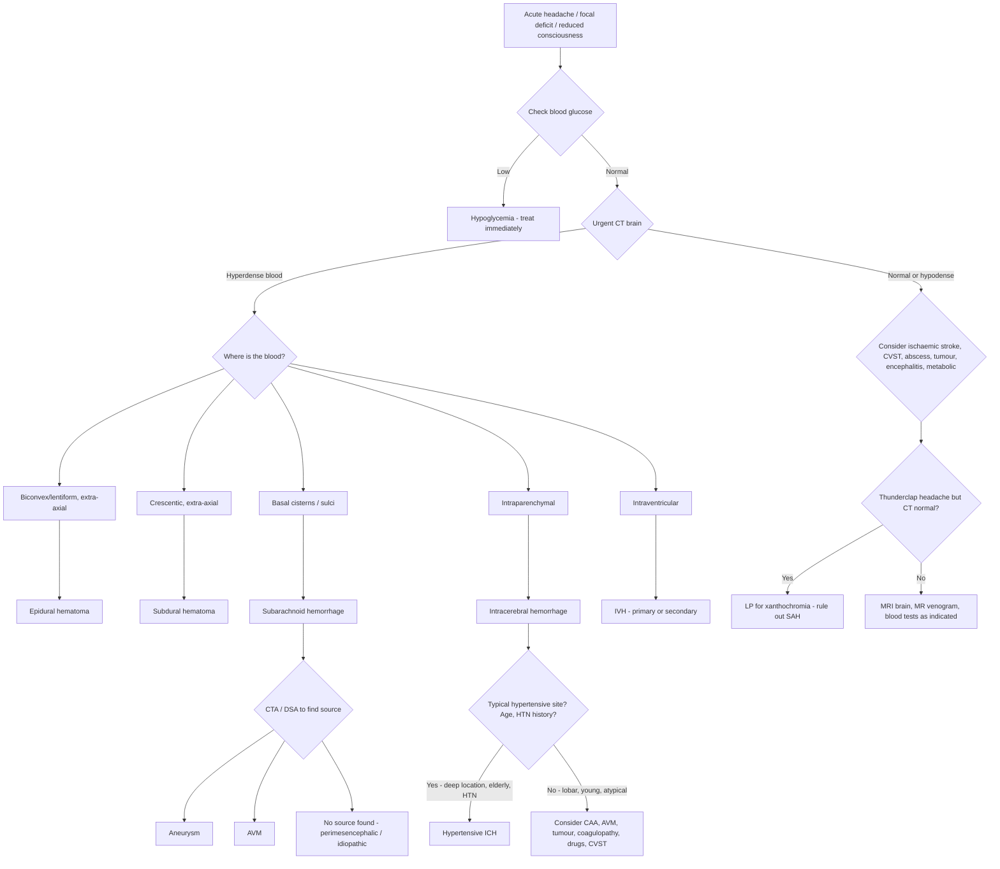

## Differential Diagnosis of Intracranial Hemorrhage

The differential diagnosis of intracranial hemorrhage operates on two levels. First, you need to **differentiate between the types of intracranial hemorrhage themselves** (EDH vs SDH vs SAH vs ICH vs IVH) because their management differs dramatically. Second, you need to **differentiate intracranial hemorrhage from conditions that mimic it** — the "stroke mimics" and other causes of acute headache, focal neurological deficit, or reduced consciousness.

Let's think about this systematically. A patient presenting with an intracranial hemorrhage will typically have some combination of:
- **Acute headache**
- **Focal neurological deficit**
- **Reduced consciousness**
- **Seizures**

Each of these has its own differential. The art is in pattern recognition — which combination, with what tempo, and with what associated features.

---

### A. Differentiating Between Types of Intracranial Hemorrhage

This is the first-order differential: once you suspect intracranial hemorrhage, you need to identify **which type**. CT brain is the definitive answer, but clinically you can narrow it down.

| Feature | EDH | SDH | SAH | ICH |
|---|---|---|---|---|
| **History** | Significant trauma (temporal) | Trauma (may be minor/forgotten in elderly) | Sudden thunderclap headache ± trauma | Sudden focal deficit; often hypertensive |
| **Onset** | Minutes to hours (lucid interval) | Hours (acute) to weeks (chronic) | Instantaneous ("thunderclap") | Seconds to minutes, may progress over hours |
| **Headache** | Progressive, localised | Insidious (chronic) or acute | ***Sudden, severe: "worst headache of my life"*** [7] | Moderate; ~40–50% have headache |
| **LOC pattern** | Lucid interval → rapid decline | Fluctuating (chronic) or progressive (acute) | Sudden LOC at onset (50%) | Progressive obtundation |
| **Meningism** | Absent | Absent | ***Present (after 3–12 hours)*** [1] | Usually absent (unless IVH extension) |
| **Focal deficit** | Ipsilateral pupil dilation, contralateral hemiparesis | Subtle (chronic) or dramatic (acute) | May be present (depends on aneurysm site) | Prominent (depends on location) |
| **Skull fracture** | ***75–90% associated*** [5][6] | Usually absent | Usually absent | Absent |
| **CT shape** | ***Biconvex/lentiform*** [5] | ***Crescentic*** [5] | Blood in basal cisterns ("star sign") | Irregular intraparenchymal hyperdensity |

<Callout title="Key Clinical Distinction: SAH vs ICH">
The strongest clinical differentiator is **meningism**. SAH causes blood in the subarachnoid space → meningeal irritation → neck stiffness, photophobia, Kernig's/Brudzinski's signs. ICH, unless it ruptures into the ventricles or subarachnoid space, does NOT cause meningism. A sudden headache WITH meningism = SAH until proven otherwise.
</Callout>

---

### B. Differentiating Intracranial Hemorrhage from Stroke Mimics

> ***Consider differential diagnosis of stroke in history: Transient events (seizures, esp Todd's paralysis; migraine aura; syncope). Persistent events (brain tumours, SDH, cerebral abscess, encephalitis, MS, metabolic encephalopathy e.g. hypoglycemia).*** [1]

> ***Clues: Nature — stroke/TIA invariably negative symptoms (loss of function). Extent — usually focal instead of global. Progression — rarely change in modality. Associating symptoms, e.g. headache in migraine.*** [1]

The differential diagnosis of intracranial hemorrhage can be organized by the **dominant presenting feature**:

---

#### B1. Differential of Acute Focal Neurological Deficit (Stroke-like Presentation)

This is the most common presentation of ICH. The key question is: **Is this a stroke? If so, is it ischemic or hemorrhagic?** You **cannot reliably distinguish them clinically — imaging is mandatory** [1][5].

| Category | Condition | Key Distinguishing Features | Why It Mimics ICH |
|---|---|---|---|
| **Vascular** | ***Ischaemic stroke*** | Maximal deficit at onset then plateaus; AF, cardiac disease; no headache (usually); CT: hypodense or normal acutely | Both cause sudden focal deficits; only CT distinguishes them |
| **Vascular** | ***Subdural hematoma*** [2] | Elderly, anticoagulants, insidious onset (chronic), fluctuating consciousness; crescentic on CT | Focal deficit + altered consciousness; chronic SDH mimics progressive ICH |
| **Vascular** | ***Cerebral venous sinus thrombosis (CVST)*** [3] | ***F > M; pregnancy, COC use; headache, seizures, raised ICP, focal deficits; CT may be normal; MR venogram shows filling defect ("empty delta sign")*** | Can cause venous infarction with hemorrhagic transformation → looks like ICH on CT |
| **Vascular** | ***Cervical arterial dissection*** [7] | ***Spontaneous (connective tissue disorder) or traumatic (fall, sports, chiropractic); ICA dissection → retroorbital pain, Horner's syndrome; VA dissection → occipital pain, vertebrobasilar symptoms; ischemia from arterial occlusion/embolism; dissecting aneurysm can rupture and cause SAH intracranially*** | Can cause ischemic stroke (embolism from dissection site) or SAH (if dissecting aneurysm ruptures intracranially) |
| **Neoplastic** | ***Brain tumour*** [2] | Subacute/chronic progression; constitutional symptoms (weight loss, malaise); papilloedema; may have hemorrhagic transformation (esp. GBM, metastases from melanoma, RCC) | Hemorrhage into a tumor can present acutely, mimicking primary ICH; look for surrounding edema and enhancement on CT/MRI |
| **Infectious** | ***Brain abscess*** [2] | Fever, raised inflammatory markers; subacute course; ring-enhancing lesion on contrast CT/MRI; history of ear/sinus infection, IE, immunosuppression | Focal deficit + headache + reduced consciousness; ring enhancement on CT distinguishes from ICH |
| **Infectious** | ***Encephalitis (viral, hypertensive, Wernicke)*** [2] | Fever, confusion, seizures; diffuse or temporal lobe involvement (HSV); Wernicke → ophthalmoplegia, ataxia, confusion (thiamine deficiency) | Altered consciousness + focal signs; but more diffuse and usually with fever |
| **Demyelinating** | ***Multiple sclerosis*** [2] | Young adults; relapsing-remitting course; MRI shows periventricular white matter lesions with different ages ("dissemination in time and space") | Acute relapse can cause sudden focal deficit; but usually subacute over days |
| **Metabolic** | ***Hypoglycemia*** [2] | On insulin/oral hypoglycemics; confusion, sweating, tremor; focal deficits can occur (hemiparesis!); rapidly reversible with glucose | A classic stroke mimic — always check blood glucose before attributing focal deficits to stroke |
| **Epileptic** | ***Seizure (Todd's paralysis)*** [1][2] | Postictal paresis: transient focal deficit following a seizure, typically lasting minutes to hours; history of seizure disorder; witnesses may describe seizure activity | Postictal hemiparesis can perfectly mimic stroke; ask about preceding seizure activity; EEG may help |
| **Migraine** | ***Hemiplegic migraine*** [2] | Migraine aura causing transient hemiparesis; gradual onset (over minutes, spreading), associated with typical migrainous headache, family history; fully reversible | Focal deficit + headache; but onset is gradual (spreading over minutes) vs sudden in ICH |
| **Other** | ***Syncope*** [2] | Transient LOC; usually global (not focal); rapid recovery; precipitants (standing, vagal triggers) | LOC can be confused with stroke if not witnessed properly |

<Callout title="The Golden Rule" type="error">
***Always check blood glucose*** in any patient presenting with acute focal neurological deficit. Hypoglycemia is the most easily reversible stroke mimic and is frequently missed. A BM stick takes 10 seconds and could save you from giving thrombolysis to a hypoglycemic patient.
</Callout>

---

#### B2. Differential of Acute Severe Headache (SAH-like Presentation)

When SAH is suspected (sudden thunderclap headache), you must differentiate it from other causes of acute headache. The lecture slides emphasize:

> ***DDx of SAH includes meningitis*** [7]

| Category | Condition | Key Distinguishing Features |
|---|---|---|
| **Vascular** | ***SAH (aneurysmal)*** | Thunderclap onset, meningism (after 3–12h), subhyaloid hemorrhage on fundoscopy, CT shows basal cistern blood |
| **Vascular** | ***Intracerebral hemorrhage*** | Headache less dramatic than SAH, focal deficit dominates, no meningism (unless IVH/SAH extension), CT shows parenchymal blood |
| **Vascular** | ***Cervical arterial dissection*** [7] | ***ICA → retroorbital pain + Horner's; VA → occipital pain + vertebrobasilar symptoms; dissecting aneurysm can rupture → SAH*** |
| **Vascular** | ***CVST*** [3] | Progressive headache (not thunderclap), seizures, raised ICP signs; may have venous infarction |
| **Vascular** | ***Hypertensive crisis/encephalopathy*** | Severely elevated BP ( > 180/120), headache, confusion, visual changes, papilledema; no blood on CT |
| **Vascular** | ***Pituitary apoplexy*** [12] | Sudden headache + visual field defect (bitemporal hemianopia) + ophthalmoplegia; hemorrhage or infarction of pituitary adenoma |
| **Infectious** | ***Meningitis*** [7] | Fever, neck stiffness, photophobia, rash (meningococcal); subacute onset (hours to days, not instantaneous); LP shows elevated WCC, protein, low glucose |
| **Primary headache** | ***Crash migraine*** [12] | Sudden severe migraine without aura; diagnosis of exclusion after SAH ruled out |
| **Primary headache** | ***Cluster headache*** [12] | Severe unilateral periorbital pain, ipsilateral autonomic features (lacrimation, rhinorrhea, conjunctival injection); rapid onset but stereotyped attacks |
| **Primary headache** | ***Benign thunderclap headache*** | Sudden onset, resolves spontaneously; diagnosis of exclusion |
| **Primary headache** | ***Benign exertional/orgasmic headache*** [12] | Thunderclap triggered by exertion or orgasm; must exclude SAH first |
| **Other** | ***Acute glaucoma*** [12] | "Misting" of vision, halos, painful red eye, mid-dilated fixed pupil; raised intraocular pressure |
| **Other** | ***Intermittent hydrocephalus*** [12] | Positional headache, impaired consciousness, leg weakness |

> ***Red flags for severe secondary headache causes: Systemic upset → CNS infections, neoplastic, vasculitis. Neurological symptoms → intracranial pathologies. New and sudden onset → temporal arteritis (if > 60y/o), secondary vascular (SAH, dissection, CVST, hypertensive crises) or non-vascular causes. Trauma → intracranial hematoma. Worse when supine, with exertion/cough → raised ICP.*** [1][12]

---

#### B3. Differential of Reduced Consciousness / Coma

Large ICH, massive SAH, and large EDH/SDH can all cause coma. The differential includes:

| Condition | Key Features |
|---|---|
| **Intracranial hemorrhage (any type)** | Focal signs, asymmetric pupils, history of trauma or sudden headache |
| **Large ischemic stroke** | Focal signs, often AF; CT initially normal or subtle hypodensity |
| **Status epilepticus** | Witnessed convulsions or subtle motor activity; EEG diagnostic |
| **Metabolic coma** | Hypoglycemia, DKA, hepatic encephalopathy, uremia, drug overdose; usually bilateral, symmetric, no focal signs |
| **CNS infection** | Fever, meningism, rash; LP diagnostic |
| **Diffuse axonal injury** | Immediate coma post-trauma without lucid interval; CT may show petechial hemorrhages at grey-white junction |

---

#### B4. Differential of Chronic/Subacute Presentations (Chronic SDH Mimics)

Chronic SDH is the great mimic. Its insidious presentation overlaps with:

| Condition | How to Distinguish from Chronic SDH |
|---|---|
| **Dementia (Alzheimer's, vascular)** | Progressive over months-years, no fluctuation, no focal signs initially; MRI shows atrophy/white matter changes, NOT a crescentic collection |
| **Normal pressure hydrocephalus (NPH)** | Classic triad: gait apraxia, urinary incontinence, dementia ("wet, wobbly, wacky"); CT shows ventriculomegaly out of proportion to sulcal atrophy |
| **Brain tumour** | Progressive focal deficits; contrast CT/MRI shows enhancing mass |
| **Depression/psychiatric** | No focal neurological signs; normal CT |

---

### C. Differential Diagnosis Decision Framework

---

### D. Key Points for Distinguishing ICH Etiology

When intracerebral hemorrhage is confirmed on CT, the next question is **what caused it?** The location and patient demographics are your strongest clues:

> ***Indications for vascular imaging in ICH: suspected non-hypertensive etiology — No HTN, Age < 40–45, Atypical location, CT abnormality (mass, calcifications)*** [3]

| Feature | Hypertensive ICH | CAA | AVM | Tumour-related | Coagulopathy |
|---|---|---|---|---|---|
| **Age** | > 50 | > 65 | Young adults | Any age | Any (on anticoagulants) |
| **Location** | ***Deep: putamen, thalamus, pons, cerebellum*** [4] | Lobar (cortical/subcortical) | Often lobar | Often lobar; multiple if metastatic | Any location |
| **HTN history** | Yes | Variable | Usually no | Variable | Variable |
| **Recurrence** | At different deep sites | At different lobar sites | Same site | Same site (unless metastatic) | Variable |
| **CT clues** | Typical deep location | Lobar, multiple cortical microbleeds on MRI (GRE/SWI) | Calcifications, serpiginous vessels, contrast enhancement | Surrounding edema, ring enhancement | May be large, diffuse |
| **Workup** | Usually clinical diagnosis; no angiography needed | MRI with GRE/SWI for microbleeds | ***CTA/DSA/MRI showing flow voids*** [8] | Contrast CT/MRI | Coagulation studies |

> ***Haemorrhagic stroke — deep vs. superficial — surgery in selected patients*** [7]

> ***Lobar hemorrhage → commonly due to arteriovenous malformations (AVM). Most commonly in temporal lobe and frontal lobe. Diagnosis by contrast CT/CT angiogram or conventional angiography.*** [5]

---

### E. Special Differentials Worth Highlighting

#### 1. Cerebral Venous Sinus Thrombosis (CVST) [3]

CVST deserves special mention because it is frequently missed and can present as intracranial hemorrhage (venous infarction with hemorrhagic transformation).

- ***Epidemiology: F > M — pregnancy, use of COC. ~1% of stroke.*** [3]
- ***Require high index of suspicion***
- ***CT brain: can be normal***
- ***MRI brain + MR venogram for filling defect; "empty delta sign" for SSS involvement*** [3]
- Think of CVST in: young woman + headache + seizures + hemorrhagic infarct in a non-arterial territory (crossing vascular boundaries).

#### 2. Cervical Arterial Dissection [7]

- ***Spontaneous — connective tissue disorder***
- ***Traumatic — fall, sports, chiropractic***
- ***ICA — retroorbital pain, Horner's syndrome***
- ***VA — occipital pain and vertebrobasilar symptoms***
- ***Ischaemia from arterial occlusion or embolism***
- ***Dissecting aneurysm can rupture and cause SAH intracranially***

This is a differential both for ischemic stroke (embolism from the dissection flap) AND for SAH (if the dissection extends intracranially and ruptures). The clue is neck pain or facial pain preceding the neurological deficit, especially in a younger patient after neck manipulation or trauma.

#### 3. Moyamoya Disease [7]

- ***Ischaemia when young; haemorrhage when older*** [7]
- Progressive occlusion of the terminal ICA → development of fragile collaterals → "puff of smoke" on angiography
- In adults, the fragile collateral vessels can rupture → ICH (especially IVH or deep hemorrhage)
- Important differential in young Asian patients with ICH

#### 4. AVM [7][8]

- ***Clinical presentation: Haemorrhage (~3%/yr) — deep, IVH, lobar; seizure; ischaemia ("vascular steal"); headache; others — bruit, hydrocephalus, heart failure*** [8]
- In a young patient with lobar ICH or IVH, AVM should be near the top of your differential

---

### F. Differential Diagnosis Summary — By Clinical Scenario

| Scenario | Top Differentials |
|---|---|
| **Acute focal deficit + headache + HTN** | ICH (hypertensive), ischemic stroke, hypertensive encephalopathy |
| **Lucid interval → rapid deterioration post-trauma** | EDH (arterial), acute SDH |
| **Elderly + progressive confusion + mild focal signs** | Chronic SDH, NPH, brain tumour, dementia |
| **Thunderclap headache + meningism** | SAH (aneurysmal), meningitis, CVST (less acute), cervical dissection |
| **Young patient + lobar ICH** | AVM, CVST, drugs (cocaine/amphetamines), Moyamoya, coagulopathy, tumour |
| **Elderly + lobar ICH + no HTN** | CAA, tumour (hemorrhagic metastasis), coagulopathy (anticoagulant-related) |
| **Young woman + headache + seizures + hemorrhagic infarct** | CVST |
| **Focal deficit after seizure** | Todd's paralysis (postictal), ICH causing seizure, CVST |
| **Sudden deficit + low GCS + diabetes** | ICH vs hypoglycemia — **check glucose first** |

<Callout title="High Yield Summary — Differential Diagnosis">

1. **First step in any acute focal deficit: check blood glucose.** Hypoglycemia is the most reversible mimic.
2. **Second step: urgent CT brain** — this is the only reliable way to distinguish hemorrhagic from ischemic stroke.
3. ***Stroke/TIA features are invariably "negative" (loss of function). If "positive" features (seizures, visual scintillations), consider alternatives*** [1].
4. **Meningism distinguishes SAH** from other types of ICH and from ischemic stroke.
5. ***SAH DDx includes meningitis*** [7] — both cause headache + meningism + photophobia; fever and subacute onset favor meningitis; instantaneous thunderclap onset favors SAH.
6. **Location of ICH on CT determines etiology:** deep = hypertensive; lobar = CAA/AVM/tumour; think vascular imaging if young, no HTN, or atypical location [3].
7. **CVST is the great masquerader** — can present as headache, raised ICP, seizures, or hemorrhagic infarct. Think of it in young women on OCP/pregnant. ***CT can be normal*** [3].
8. ***Cervical arterial dissection can cause both ischemic stroke (embolism) and SAH (intracranial rupture)*** [7].
9. **Chronic SDH mimics dementia, NPH, and brain tumour** in the elderly — always CT in new-onset cognitive decline.
10. ***Sudden headache and LOC is cerebrovascular in origin until proven otherwise*** [7].

</Callout>

---

<ActiveRecallQuiz
  title="Active Recall - Differential Diagnosis of Intracranial Hemorrhage"
  items={[
    {
      question: "A 25-year-old woman on the oral contraceptive pill presents with worsening headache over 3 days, left-sided seizures, and a hemorrhagic lesion on CT that crosses arterial vascular territories. What is the most likely diagnosis and what investigation confirms it?",
      markscheme: "Cerebral venous sinus thrombosis (CVST). Risk factors: young female, OCP use. Hemorrhagic venous infarct crosses arterial territories. Confirm with MRI brain + MR venogram showing filling defect. Empty delta sign if SSS involved. CT can be normal in CVST."
    },
    {
      question: "List 5 conditions that can mimic acute stroke (stroke mimics) and for each, state one key distinguishing feature from true stroke.",
      markscheme: "1. Hypoglycemia - on insulin/OHAs, reversible with glucose, check BM. 2. Todd's paralysis (postictal) - follows witnessed seizure, transient, resolves in hours. 3. Hemiplegic migraine - gradual spreading onset, typical migrainous headache, family history. 4. Brain tumour - subacute/chronic course, contrast-enhancing lesion on CT/MRI. 5. Brain abscess - fever, ring enhancement on contrast CT, history of infection source."
    },
    {
      question: "How do you differentiate SAH from bacterial meningitis clinically, given both present with headache and meningism?",
      markscheme: "SAH: thunderclap onset (instantaneous, maximal at onset), no fever, subhyaloid hemorrhage on fundoscopy, CT shows basal cistern blood, LP shows xanthochromia. Meningitis: subacute onset over hours to days, fever present, rash may be present (meningococcal), LP shows elevated WCC/protein and low glucose, no xanthochromia."
    },
    {
      question: "A 72-year-old with no history of hypertension presents with acute left-sided weakness. CT shows a right-sided lobar intracerebral hemorrhage. What are the top 3 etiologies to consider and what further investigation is warranted?",
      markscheme: "1. Cerebral amyloid angiopathy (CAA) - elderly, lobar, no HTN; MRI with GRE/SWI shows multiple cortical microbleeds. 2. Hemorrhagic tumour - metastasis (melanoma, RCC, choriocarcinoma) or GBM; contrast CT/MRI shows enhancement and surrounding edema. 3. AVM - less likely at this age but possible; CTA or DSA to identify. Indications for vascular imaging: no HTN, atypical (lobar) location, CT abnormality."
    },
    {
      question: "What is the clinical significance of cervical arterial dissection in the differential diagnosis of intracranial hemorrhage?",
      markscheme: "Cervical arterial dissection can cause SAH if the dissecting aneurysm extends intracranially and ruptures. ICA dissection presents with retroorbital pain and Horner's syndrome; VA dissection with occipital pain and vertebrobasilar symptoms. It also causes ischemic stroke via embolism from the dissection site. Causes: spontaneous (connective tissue disorders) or traumatic (fall, sports, chiropractic). Important in young patients with SAH or stroke after neck trauma/manipulation."
    }
  ]}
/>

## References

[1] Senior notes: Ryan Ho Neurology.pdf (Section 3.2: Cerebrovascular Diseases — Evaluation of Stroke, differential diagnosis, Section 8.1: Raised ICP)
[2] Senior notes: felixlai.md (Epidural/Subdural/Subarachnoid hemorrhage, Differential diagnosis of stroke)
[3] Senior notes: maxim.md (Intracerebral haemorrhage, Cerebral venous thrombosis)
[4] Lecture slides: Cererbrovascular disease.pdf (p5: ICH locations)
[5] Senior notes: Ryan Ho Diagnostic Radiology.pdf (p40–42: Diagnosis of stroke, Intracranial haemorrhages)
[6] Senior notes: Ryan Ho Radiology.pdf (p17–19: Acute headache imaging, intracranial haemorrhage)
[7] Lecture slides: GC 109. Headache and loss of consciousness Acute stroke, subarachnoid haemorrhage and vascular malformation.pdf (p14: Causes of SAH; p16: SAH presentation and DDx meningitis; p23: AVM features; p25: Cervical arterial dissection; p25: Key messages)
[8] Senior notes: Ryan Ho Neurology.pdf (p87–88: Cerebral Aneurysm, AVM, Moyamoya)
[11] Senior notes: Ryan Ho Opthalmology.pdf (p90: Papilloedema)
[12] Senior notes: Ryan Ho Fundamentals.pdf (p313: Red flags for headache) and Ryan Ho Neurology.pdf (p58–60: Headache differentials)
