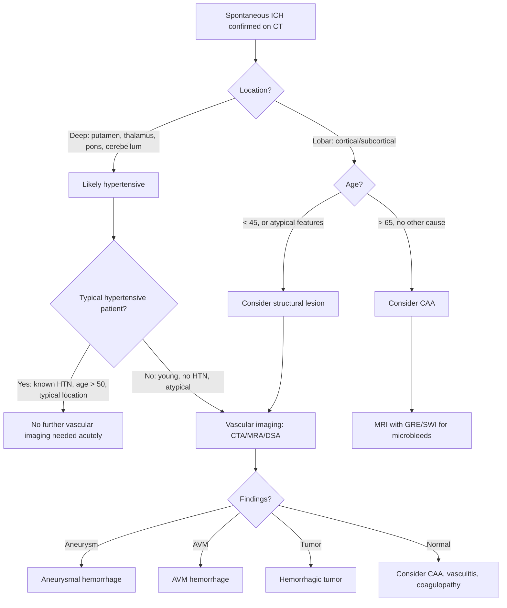
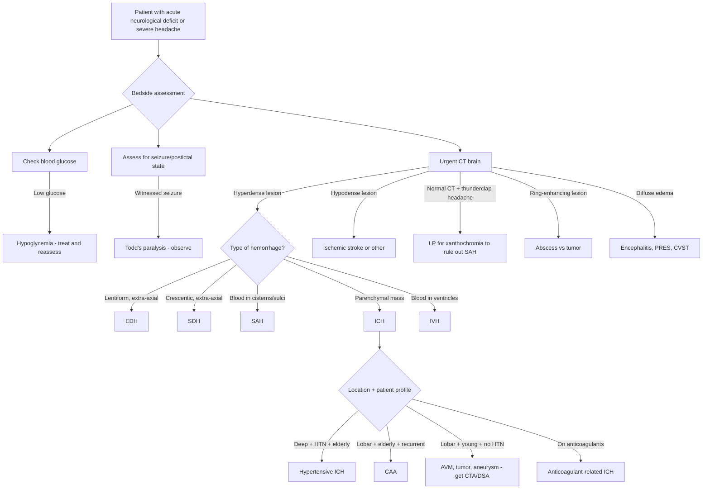

## Differential Diagnosis of Intracranial Hemorrhage

The differential diagnosis of intracranial hemorrhage operates on two levels simultaneously:

1. **When a patient presents with acute neurological deficit** — you must distinguish ICH from its many mimics (i.e., "Is this actually a bleed, or something else?")
2. **When you have confirmed intracranial hemorrhage** — you must determine the *type* (EDH vs SDH vs SAH vs ICH vs IVH) and the *underlying cause* (hypertensive vs CAA vs AVM, etc.)

Let's work through both systematically.

---

### 1. Differential Diagnosis When a Patient Presents with Acute Focal Neurological Deficit

This is the classic "stroke mimic" question. A patient arrives with sudden-onset hemiparesis, aphasia, or decreased consciousness. Before you assume it's a stroke (ischemic or hemorrhagic), you need to rule out conditions that can look identical.

> **Core principle**: ***Stroke/TIA invariably presents with negative symptoms (i.e., loss of function)*** [1]. Positive symptoms (e.g., jerking, tingling, visual scintillations) should raise suspicion for alternative diagnoses. ***Usually focal instead of global*** [1]. ***Rarely changes in modality*** (e.g., a motor deficit doesn't suddenly become a sensory deficit) [1].

#### 1.1 Vascular Differential (Other Stroke Types)

The first differentiation is **ischemic vs hemorrhagic stroke** — this is a clinical impossibility without imaging. You simply cannot reliably distinguish them at the bedside (although certain features make hemorrhage more likely: headache, vomiting, rapid deterioration, very high BP, reduced consciousness at onset).

| Feature | Favors Ischemic Stroke | Favors Hemorrhagic Stroke |
|---------|----------------------|--------------------------|
| Onset | Maximal deficit at onset (embolic) or stuttering (thrombotic) | Progressive worsening over minutes–hours (hematoma expansion) |
| Headache | Usually absent or mild | ***Headache and vomiting favor hemorrhagic stroke*** [4] |
| Consciousness | Usually preserved (unless large territory) | Often impaired early |
| Blood pressure | Elevated but not extreme | Often severely elevated ( > 180/110) |
| Meningism | Absent | Present if blood reaches subarachnoid space |
| CT brain | Hypodense area (may be normal < 6h) | ***Hyperdense area*** [6] |

<Callout title="Why You Cannot Clinically Distinguish Ischemic from Hemorrhagic Stroke" type="error">
About 15% of clinical diagnoses of ischemic stroke turn out to be hemorrhagic on CT, and vice versa. This is why ***neuroimaging (CT/MRI) is essential for ALL stroke patients*** [1] — you MUST image before giving thrombolysis. Giving tPA to a patient with ICH is catastrophic.
</Callout>

#### 1.2 Non-Vascular Mimics of Intracranial Hemorrhage

These are conditions that present with acute or subacute focal neurological deficits and/or headache and can be confused with ICH [1][4][8]:

**a) Transient Events (Mimicking TIA or Minor Stroke)**

| Condition | Key Distinguishing Features | Why It Mimics ICH |
|-----------|---------------------------|-------------------|
| ***Seizures / Todd's paralysis*** [4] | ***Postictal paresis*** — transient focal weakness after a seizure that resolves over minutes to hours. History of witnessed seizure activity (jerking = positive phenomenon). Note: ICH itself can cause seizures, so the two can coexist | Focal weakness post-seizure mimics stroke; additionally, an underlying hemorrhage can be the *cause* of the seizure |
| ***Migraine with aura / Hemiplegic migraine*** [4] | Gradual spread of symptoms over 5–60 min ("marching" positive then negative symptoms), followed by headache. Young patient, prior history. Symptoms resolve completely | The headache + focal deficit combination can mimic SAH or lobar ICH |
| ***Syncope*** [4] | Transient global LOC (not focal), rapid full recovery, prodrome of lightheadedness/dimming vision, usually positional trigger | Brief LOC can mimic the initial LOC of SAH or EDH |

**b) Persistent Events (Mimicking Established Stroke/ICH)**

| Condition | Key Distinguishing Features | Why It Mimics ICH |
|-----------|---------------------------|-------------------|
| ***Brain tumour*** [4][8] | Subacute/progressive course over weeks–months, constitutional symptoms (weight loss), progressive headache worse in morning, papilledema. However, hemorrhagic tumors (GBM, metastatic melanoma, RCC) can present acutely identical to spontaneous ICH | Some tumors bleed acutely (hemorrhagic transformation), presenting indistinguishably from spontaneous ICH on initial imaging |
| ***Subdural hematoma (chronic)*** [1][4] | ***Insidious onset with fluctuating features*** [1], cognitive decline, gait disturbance. Elderly, alcoholic, on anticoagulants. No clear history of trauma. Crescentic hypodense collection on CT | Chronic SDH can mimic dementia, brain tumor, or ischemic stroke with fluctuating deficits |
| ***Brain abscess*** [4][8] | Subacute headache, fever, focal deficits, ± seizures. Ring-enhancing lesion on contrast CT/MRI. Source of infection (sinusitis, otitis, IE, dental) | Ring-enhancing lesion with surrounding edema can cause mass effect similar to ICH |
| ***Encephalitis*** [4] | Viral: acute confusion, fever, seizures, personality change (temporal lobe involvement in HSV). Hypertensive encephalopathy: severe HTN, visual disturbance, confusion (posterior reversible encephalopathy syndrome — PRES). Wernicke encephalopathy: alcohol, confusion, ataxia, ophthalmoplegia (thiamine deficiency) | Acute confusion + focal signs + headache overlap significantly with ICH presentation |
| ***Multiple sclerosis*** [4] | Young adult, relapsing-remitting course, optic neuritis, INO, Lhermitte's sign. MRI shows white matter lesions disseminated in space and time | Acute demyelinating episode can mimic stroke/ICH with sudden focal deficit |
| ***Metabolic encephalopathy — hypoglycemia*** [1][4] | ***Hypoglycemia*** can produce focal deficits (hemiparesis, aphasia) that completely reverse with glucose correction. Always check BGL in any acute neurological deficit | Focal neurological deficit from neuroglycopenia can be indistinguishable from stroke at bedside |
| ***Cerebral venous sinus thrombosis (CVST)*** [2] | ***High index of suspicion needed*** [2]. Young woman on OCP or pregnant. Headache + seizures + focal deficits + signs of raised ICP. Venous infarcts are often hemorrhagic → actual hemorrhage on CT. ***Empty delta sign on MRV*** [2] | CVST causes venous hemorrhagic infarction — this IS a form of intracranial hemorrhage, but treatment is paradoxically anticoagulation, not hemostasis |
| ***Spinal dural AV fistula*** [4] | Progressive myelopathy (leg weakness, sensory level, sphincter dysfunction). Not truly intracranial, but can present with progressive neurological deficit | Progressive ascending weakness can be confused with posterior fossa or brainstem hemorrhage |

<Callout title="The Three Bedside 'Must-Excludes' Before Diagnosing Stroke">
1. **Check blood glucose** — hypoglycemia mimics any stroke syndrome and is instantly reversible
2. **Check for seizure activity** — Todd's paralysis is transient and does not require thrombolysis
3. **Get a CT brain** — you cannot treat stroke without knowing if it's ischemic or hemorrhagic
</Callout>

#### 1.3 Headache-Dominant Presentations (SAH Mimics)

When the presentation is dominated by ***sudden severe headache*** (thunderclap), the differential shifts [1][3][8]:

| Condition | Key Distinguishing Features |
|-----------|---------------------------|
| ***Aneurysmal SAH*** | ***Sudden severe headache, "worst headache of my life," meningism, ± LOC, subhyaloid hemorrhage on fundoscopy*** [3]. CT + LP for diagnosis |
| ***DDx: Meningitis*** [3] | ***SAH DDx meningitis*** [3] — both present with headache + meningism + photophobia. However, meningitis has fever, rash (meningococcal), more gradual onset (hours rather than instantaneous). LP shows different profiles (SAH: xanthochromia, RBCs; meningitis: WBCs, low glucose, high protein) |
| ***Cervical arterial dissection*** [3] | ***ICA dissection: retroorbital pain, Horner's syndrome. VA dissection: occipital pain + vertebrobasilar symptoms. Dissecting aneurysm can rupture and cause SAH intracranially*** [3]. Young patient, trauma or connective tissue disorder |
| Primary thunderclap headache | Benign, diagnosis of exclusion after all secondary causes ruled out |
| ***Hypertensive crisis*** [8] | Severe headache + very high BP + encephalopathy (PRES). Can be associated with ICH |
| Pituitary apoplexy | Sudden headache + visual field defect (bitemporal hemianopia) + ophthalmoplegia. Known pituitary adenoma. Hemorrhage or infarction within pituitary gland |
| ***CVST*** [2][8] | Headache (may be thunderclap) + seizures + focal deficits. MRV for diagnosis |

---

### 2. Differential Diagnosis WITHIN Intracranial Hemorrhage Types

Once imaging confirms blood inside the skull, you need to determine:
- **What type of hemorrhage?** (EDH vs SDH vs SAH vs ICH vs IVH)
- **What is the underlying cause?**

#### 2.1 Differentiating Types of Intracranial Hemorrhage on CT

| Feature | EDH | Acute SDH | SAH | ICH | IVH |
|---------|-----|-----------|-----|-----|-----|
| ***Shape*** | ***Lentiform (biconvex)*** [6] | ***Crescentic*** [6] | Blood in sulci, cisterns, fissures | Parenchymal mass (irregular) | Blood layering in ventricles |
| ***Crosses sutures?*** | ***No*** [6] | ***Yes*** [6] | N/A | N/A | N/A |
| ***Crosses midline?*** | ***Yes*** [6] | ***No (limited by falx)*** [6] | Can be bilateral | Can cross if massive | Can be bilateral |
| ***Skull fracture*** | ***75–90%*** [6] | ***Usually no*** [6] | Usually no | No | No |
| Location | Adjacent to temporal bone (MMA territory) | Over cerebral convexity | Basal cisterns, Sylvian fissures, interhemispheric fissure | ***Putaminal, thalamic, cerebellar, brainstem, lobar*** [5] | Within ventricles |
| Clinical course | ***Rapid deterioration*** [6] | Fluctuating or progressive | Thunderclap headache → meningism | Acute progressive focal deficit | Depends on primary lesion + hydrocephalus |

#### 2.2 Determining the Underlying Cause of Spontaneous ICH

This is critically important because the cause determines further investigation, management, and secondary prevention.

***Indications for vascular imaging in ICH*** [2]:
- ***No hypertension***
- ***Age < 40–45***
- ***Atypical location***
- ***CT abnormality: mass, calcifications***

> **Why does location matter so much?** Because hypertension selectively damages deep perforating arteries — so a deep hemorrhage in a hypertensive elderly patient almost certainly has a hypertensive etiology and doesn't need angiography. But a lobar hemorrhage in a young normotensive patient screams "structural lesion" (AVM, tumor, aneurysm) and MUST be investigated with vascular imaging.

| Etiological Clue | Suggests |
|-------------------|---------|
| ***Deep location (putamen, thalamus, pons, cerebellum) + known HTN + age > 50*** | ***Hypertensive arteriopathy*** [2][5] |
| ***Lobar location + age > 65 + recurrent + cortical microbleeds on MRI*** | ***Cerebral amyloid angiopathy*** [2] |
| ***Young patient + lobar + no HTN*** | ***AVM, cavernoma, tumor*** [6] |
| ***Lobar + known malignancy*** | Hemorrhagic metastasis (melanoma, RCC, choriocarcinoma, lung, thyroid) |
| On anticoagulants (warfarin, DOAC) | Anticoagulant-related ICH |
| ***Cocaine or amphetamine use*** [5] | Drug-induced vasospasm/vasculitis |
| History of prior ischemic infarct → new hemorrhage | Hemorrhagic transformation |
| Headache + seizures + focal deficit + young woman on OCP | ***CVST with venous hemorrhagic infarction*** [2] |
| Multiple hemorrhages of different ages | CAA, vasculitis, coagulopathy, metastatic disease |

#### 2.3 Differentiating Causes of SAH

| Cause | Key Features |
|-------|-------------|
| ***Trauma*** (most common overall) [3] | Clear history of head injury; blood typically over convexities/sulci rather than in basal cisterns |
| ***Aneurysmal rupture*** (most common spontaneous cause) [3] | Thunderclap headache, basal cistern blood on CT ("star sign"), confirmed by CTA/DSA |
| ***AVM bleed*** [3] | Younger patient, may have prior seizures or headaches; CTA/DSA shows AVM |
| ***Mycotic aneurysm*** [3] | History of infective endocarditis, fever; aneurysm typically at distal branch (not at Circle of Willis bifurcation) |
| ***Cervical arterial dissection*** [3] | ***ICA: retroorbital pain + Horner's syndrome. VA: occipital pain + vertebrobasilar symptoms. Dissecting aneurysm can rupture and cause SAH intracranially*** [3] |
| Perimesencephalic non-aneurysmal SAH | Blood confined to perimesencephalic cisterns only, normal angiography, benign prognosis |
| ***Cocaine*** [3] | Young patient with acute hypertensive crisis + sympathomimetic toxidrome |

<Callout title="Sentinel Headache — Don't Miss It" type="error">
About 30–50% of patients with aneurysmal SAH have a preceding "warning leak" or "sentinel headache" days to weeks before the catastrophic rupture. This presents as a sudden severe headache that resolves. If a patient presents with a thunderclap headache and a negative CT, you MUST do a lumbar puncture (looking for xanthochromia) before calling it benign. Missing a sentinel leak means the patient may re-bleed catastrophically.
</Callout>

#### 2.4 Differentiating Causes of SDH

| Cause | Key Features |
|-------|-------------|
| ***Traumatic (vast majority)*** [1] | Clear history of head injury; in children, consider non-accidental injury (NAI) [1] |
| Cerebral atrophy + trivial/forgotten trauma | ***Elderly, chronic alcoholism*** [4] — brain shrinks → bridging veins stretched → low threshold for rupture |
| Anticoagulation | Warfarin, DOACs; may bleed with minimal or no trauma |
| ***Vascular malformation (aneurysm, AVM)*** [1] | Younger patient, may have SAH component |
| ***Intracranial neoplasm (meningioma, dural metastasis)*** [1] | May see tumor on imaging; dural-based enhancement |
| ***Low CSF pressure*** [1] | ***Spontaneous intracranial hypotension, post-LP, over-shunting*** [1] — loss of CSF buoyancy → brain sags → bridging veins stretched and tear |
| ***Coagulopathy or thrombolysis*** [1] | Known bleeding disorder or recent thrombolytic therapy |

---

### 3. Summary Differential Diagnosis Mermaid Diagram

---

### 4. Key Differentiating Principles

***Key messages from the lectures*** [3]:
- ***"Sudden headache and LOC is cerebrovascular in origin until proven otherwise"*** [3]
- ***"Haemorrhagic stroke — deep vs. superficial — surgery in selected patients"*** [3]
- ***"If no history of trauma, SAH is aneurysmal in origin until proven otherwise"*** [3]

When working through the differential:

1. **Onset tempo** is the single most useful discriminator:
   - Instantaneous (seconds) → vascular (SAH, ICH)
   - Acute (minutes–hours) → vascular (ICH, ischemic stroke) or seizure
   - Subacute (days–weeks) → tumor, abscess, chronic SDH
   - Chronic (weeks–months) → tumor, chronic SDH, NPH

2. **Positive vs. negative symptoms**:
   - Negative (weakness, numbness, visual loss) → stroke/ICH
   - Positive (jerking, tingling, scintillations) → seizure, migraine

3. **Associated features** narrow the differential:
   - Fever → infection (abscess, meningitis, encephalitis)
   - Thunderclap headache → SAH until proven otherwise
   - Fluctuating consciousness in elderly → chronic SDH
   - Drug use (cocaine/amphetamines) → ICH from acute hypertensive surge
   - Young woman on OCP → CVST

---

### 5. Special Differential Considerations

#### 5.1 Cerebral Salt Wasting vs SIADH after ICH/SAH

Both can complicate intracranial hemorrhage (especially SAH) and present with hyponatremia, but treatment is opposite [9]:

| Feature | SIADH | Cerebral Salt Wasting (CSW) |
|---------|-------|-----------------------------|
| Volume status | ***Euvolemic*** | ***Hypovolemic*** |
| Mechanism | Inappropriate ADH → water retention | Idiopathic renal natriuresis + diuresis |
| Urine Na | > 20 mmol/L | > 20 mmol/L (both have renal Na loss) |
| Treatment | ***Fluid restriction*** | ***Fluid and sodium replacement*** (opposite of SIADH!) |

> ***Both can follow head pathologies. CSWS results in renal Na loss → hypovolemic hyponatremia, cf. SIADH results in renal water retention → euvolemic hyponatremia (different treatment)*** [9]. Getting this wrong is dangerous — fluid-restricting a hypovolemic patient worsens cerebral perfusion.

#### 5.2 Hemorrhagic Tumor vs Spontaneous ICH

Some tumors are notorious for presenting as acute hemorrhage:
- **Glioblastoma multiforme (GBM)** — most common primary malignant brain tumor
- **Metastatic melanoma, renal cell carcinoma, choriocarcinoma, thyroid, lung**
- Clues: surrounding edema disproportionate to hematoma size, heterogeneous enhancement on contrast CT, known primary malignancy, atypical location

#### 5.3 ***Moyamoya Disease*** [3]

- ***"Ischaemia when young; haemorrhage when older"*** [3]
- Progressive stenosis of terminal ICA → fragile collaterals develop → "puff of smoke" on angiography
- In children: presents with ischemic strokes/TIAs
- In adults: presents with hemorrhagic stroke (fragile collaterals rupture)

---

<Callout title="High Yield Summary">

**Core DDx framework for acute neurological deficit:**
1. Always check glucose (hypoglycemia), assess for seizure (Todd's paralysis), and get CT brain
2. CT differentiates ischemic from hemorrhagic stroke — CANNOT be done clinically
3. Thunderclap headache + normal CT → must LP for xanthochromia (SAH)
4. SAH DDx includes meningitis (both have headache + meningism)

**Differentiating ICH types on CT:**
- EDH: lentiform, does not cross sutures, 90% skull fracture
- SDH: crescentic, crosses sutures, does not cross midline
- SAH: blood in basal cisterns ("star sign") and sulci
- ICH: parenchymal hyperdense mass

**Determining cause of spontaneous ICH:**
- Deep + HTN + elderly = hypertensive arteriopathy
- Lobar + elderly = CAA
- Lobar + young + no HTN = AVM/tumor/aneurysm → must image vessels
- On anticoagulants = anticoagulant-related ICH
- Cocaine/amphetamines = drug-induced

**Don't forget**: CVST (young woman, OCP, paradoxically treat with anticoagulation), chronic SDH (elderly mimic of dementia), and Moyamoya (ischaemia young, haemorrhage old).

</Callout>

---

<ActiveRecallQuiz
  title="Active Recall - Differential Diagnosis of Intracranial Hemorrhage"
  items={[
    {
      question: "A 35-year-old woman on oral contraceptives presents with headache, seizures, and left hemiparesis. CT shows a hemorrhagic infarct in the right parietal lobe. What is the most likely diagnosis, and what investigation confirms it?",
      markscheme: "Cerebral venous sinus thrombosis (CVST). Young woman on OCP (risk factors), hemorrhagic venous infarction pattern on CT. Confirmed by MRI brain + MR venogram showing filling defect (empty delta sign if superior sagittal sinus). Treatment is paradoxically anticoagulation with LMWH despite the hemorrhage."
    },
    {
      question: "What are the four indications for vascular imaging in spontaneous intracerebral hemorrhage, and why is each important?",
      markscheme: "1) No hypertension (removes the most common cause, hypertensive arteriopathy). 2) Age < 40-45 (young patients more likely to have structural lesions like AVM/aneurysm). 3) Atypical location (lobar rather than deep suggests non-hypertensive etiology). 4) CT abnormality such as mass or calcifications (suggests underlying tumor or vascular malformation). All indicate the hemorrhage may have a treatable structural cause."
    },
    {
      question: "A patient presents with thunderclap headache and meningism. CT brain is normal. What must you do next and why? What specific finding confirms the diagnosis?",
      markscheme: "Must perform lumbar puncture. CT misses approximately 2-5% of SAH (especially small bleeds or delayed presentations). LP findings: blood-stained CSF (perform 3-bottle test to distinguish from traumatic tap - RBC count should remain constant in SAH vs decreasing in traumatic tap). Xanthochromia (yellow discoloration from bilirubin, develops after several hours) confirms SAH and excludes traumatic tap."
    },
    {
      question: "Explain how you differentiate cerebral salt wasting syndrome from SIADH after subarachnoid hemorrhage, and why the distinction matters.",
      markscheme: "Both present with hyponatremia and elevated urine sodium after head pathology. Key difference: CSWS = hypovolemic (renal sodium and water loss), SIADH = euvolemic (inappropriate water retention). Distinguish by clinical volume assessment and central venous pressure. Matters because treatment is opposite: CSWS needs fluid and sodium replacement; SIADH needs fluid restriction. Fluid-restricting a hypovolemic CSWS patient worsens cerebral perfusion and can cause vasospasm-related ischaemia."
    },
    {
      question: "Name three conditions that can present with acute focal neurological deficit and normal or near-normal CT brain, and give one distinguishing feature for each.",
      markscheme: "1) Hypoglycemia - rapidly reversible with glucose correction, check BGL. 2) Todd's paralysis - postictal focal weakness following witnessed seizure activity, resolves in minutes to hours. 3) Early ischemic stroke (less than 6 hours) - CT can be normal; DWI MRI detects ischemia within 1 hour. Others acceptable: migraine with aura (gradual march of positive then negative symptoms, resolves completely), encephalitis (fever, gradual onset), MS (relapsing-remitting history, white matter lesions on MRI)."
    }
  ]}
/>

## References

[1] Senior notes: Ryan Ho Neurology.pdf (Section 3.2 Cerebrovascular Diseases p74–78, Section 8.1 Raised ICP p155, Section 11.3.2 SDH p203)
[2] Senior notes: maxim.md (Intracerebral haemorrhage, Cerebral venous thrombosis sections)
[3] Lecture slides: GC 109. Headache and loss of consciousness Acute stroke, subarachnoid haemorrhage and vascular malformation.pdf (p14, p16, p25, p50)
[4] Senior notes: felixlai.md (Epidural/Subdural/Subarachnoid hemorrhage sections; Stroke DDx section)
[5] Lecture slides: Cererbrovascular disease.pdf (p5)
[6] Senior notes: Ryan Ho Diagnostic Radiology.pdf (p41–42); Senior notes: Ryan Ho Radiology.pdf (p19)
[8] Senior notes: Ryan Ho Fundamentals.pdf (p313, Headache red flags); Senior notes: Ryan Ho Neurology.pdf (p58–60, Headache differentials)
[9] Senior notes: Ryan Ho Chemical Path.pdf (p10, SIADH vs CSWS)
