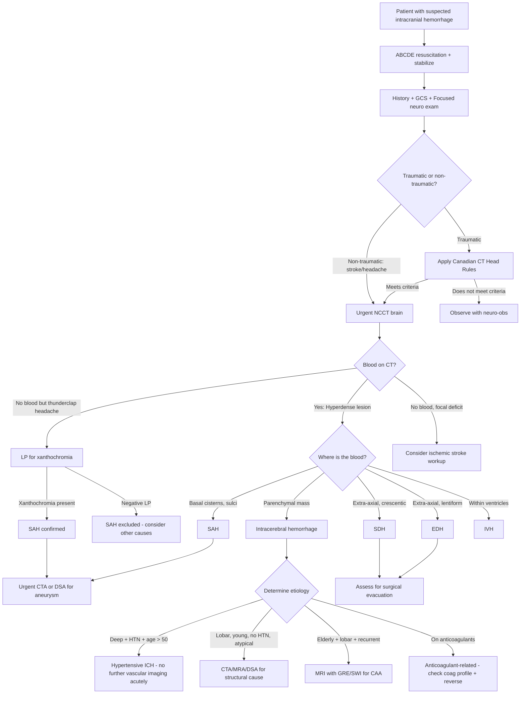

## Diagnostic Criteria, Algorithm, and Investigation Modalities for Intracranial Hemorrhage

### 1. Overarching Diagnostic Principles

Unlike many medical conditions, intracranial hemorrhage (ICH) does not have formal "diagnostic criteria" in the way that, say, rheumatoid arthritis or heart failure does. Instead, the diagnosis is fundamentally **imaging-based** — you confirm it by seeing blood on a scan. The clinical role is to:

1. **Suspect** the hemorrhage (from history and examination)
2. **Confirm** it with neuroimaging (CT or MRI)
3. **Characterize** it (type, location, volume, complications)
4. **Determine the cause** (hypertensive, CAA, vascular malformation, coagulopathy, etc.)
5. **Assess severity and complications** (hydrocephalus, herniation, IVH)

> The diagnosis of ICH is a clinical-radiological diagnosis. There is no blood test or bedside maneuver that definitively confirms or excludes intracranial hemorrhage — ***neuroimaging (CT/MRI) is essential for all stroke patients*** [1].

---

### 2. Clinical Assessment — The Foundation

Before any investigation, you need a systematic clinical assessment that guides what imaging to order and how urgently.

#### 2.1 History — What to Ask and Why

***Approach: ABCDE before any neurosurgical evaluation*** [1][8]:

| History Element | What to Elicit | Why It Matters |
|----------------|---------------|----------------|
| ***Mechanism of injury*** [1] | RTA, fall, assault, sports | Determines likelihood and type of traumatic ICH (EDH, SDH, traumatic SAH) |
| ***Time of onset*** | ***Time of stroke onset = time last seen well, NOT time last seen unwell*** [4] — critical for treatment eligibility | Determines eligibility for IV tPA ( < 3–4.5h) or thrombectomy ( < 6h) for ischemic stroke; guides urgency of imaging for hemorrhagic stroke |
| ***Symptoms of raised ICP*** [1] | ***Headache, vomiting*** | Suggests expanding hematoma or hydrocephalus |
| ***Neurological deficits and seizures*** [1] | Weakness, speech disturbance, visual loss, seizure | Indicates cortical damage; seizures more common in lobar ICH |
| ***LOC and duration*** [1] | Duration, lucid interval | Lucid interval → EDH; prolonged LOC → severe diffuse injury (DAI) |
| ***Amnesia*** [1] | Post-traumatic vs retrograde | Correlates with severity of brain injury |
| ***Skull base fracture signs*** [1] | ***CSF leakage, raccoon eyes, Battle sign*** | Indicates basilar fracture → risk of meningitis, EDH |
| Headache character | ***"Worst headache of my life," thunderclap, instantaneous*** [3][8] | Thunderclap → SAH until proven otherwise |
| Drug history | Anticoagulants, antiplatelets, cocaine/amphetamines | Anticoagulant-related ICH needs reversal; cocaine causes hypertensive ICH |
| Past medical history | HTN, DM, previous stroke, bleeding disorders, malignancy | Guides etiological workup |

#### 2.2 Physical Examination

***The Glasgow Coma Scale (GCS) is the most important assessment tool*** [1][8]:

| Component | Response | Score |
|-----------|----------|-------|
| **Eye opening (E)** | Spontaneous / To voice / To pain / None | 4/3/2/1 |
| **Verbal (V)** | Oriented / Confused / Inappropriate words / Incomprehensible / None | 5/4/3/2/1 |
| **Motor (M)** | Obeys commands / Localizes pain / Withdraws / Abnormal flexion / Extension / None | 6/5/4/3/2/1 |
| **Total** | | **3–15** |

> ***Motor scale (M) is considered the most prognostically significant*** [1]. A patient who localizes to pain (M5) has a fundamentally different prognosis from one with extension (M2).

**Key examination findings** [1][8]:

- ***Pupil response: 3rd nerve lesion is the most useful indicator of expanding intracranial lesion → indicates ipsilateral impending transtentorial herniation*** [1]
- ***Limb weakness: can be falsely localizing because herniated uncus pushes contralateral cerebral peduncle against tentorium cerebelli (Kernohan's notch)*** [1]
- ***Eye movement: decreased GCS + decreased EOM indicates poor prognosis*** [1]
- Signs of basal skull fracture: ***anterior fossa (CSF rhinorrhoea, raccoon eyes, subconjunctival haemorrhage); middle fossa (CSF otorrhoea, Battle sign — may take 24–48h to develop)*** [1]
- Fundoscopy: papilledema (raised ICP), subhyaloid hemorrhage (SAH)
- Meningism: neck stiffness, Kernig's, Brudzinski's signs (SAH, meningitis)

***The National Institute of Health Stroke Scale (NIHSS)*** should be documented for all stroke patients [1]:
- Quantifies stroke severity across 11 domains (consciousness, gaze, visual fields, facial palsy, motor arm/leg, ataxia, sensory, language, dysarthria, extinction/inattention)
- Score 0–42; higher = more severe
- Guides treatment decisions and tracks progression

---

### 3. When to Image — Decision Rules for CT Brain

Not every patient with a headache or bump to the head needs a CT. But the threshold should be LOW in the right clinical context.

#### 3.1 Traumatic Setting — Canadian CT Head Rules (CCHR) [4]

***Inclusion criteria***: Minor head injury with any 1 of [4]:
- ***GCS 13–15 after witnessed LOC***
- ***Amnesia***
- ***Confusion***

***Exclusion criteria (go straight to CT — too high risk for rules)*** [4]:
- ***GCS < 13***
- ***Obvious penetrating skull injury or depressed skull fracture***
- ***Unstable vital signs with major trauma***
- ***Focal neurological deficit***
- ***Seizure prior to assessment in ED***
- ***Bleeding disorders or use of oral anticoagulants***

***High risk for neurosurgical intervention (CT recommended)*** [4]:
- ***Age ≥ 65 years***
- ***Vomiting ≥ 2 episodes***
- ***GCS < 15 at 2 hours after injury***
- ***Suspected open or depressed skull fracture***
- ***Any signs of basal skull fracture (raccoon eyes, Battle's sign, CSF otorrhea/rhinorrhea, hemotympanum)***

***Medium risk for brain injury on CT (may consider CT)*** [4]:
- ***Amnesia before impact ≥ 30 minutes***
- ***Dangerous mechanism (pedestrian struck by motor vehicle, ejected from vehicle, fall from height > 3 feet or 5 stairs)***

#### 3.2 Non-Traumatic Setting — When to Image for Suspected Stroke/ICH

***Plain CT brain is the first line of imaging in acute stroke*** [6][10]:
- ***Mainstay of imaging in acute stroke: non-contrast CT of brain*** [6]
- ***Allows differentiation of ischaemic and haemorrhagic stroke*** [6]

Indications for urgent CT brain in non-traumatic presentations [8][10]:
- Any acute focal neurological deficit (suspected stroke)
- ***Thunderclap headache*** [8]
- ***Red flags: new-onset headache, history of cancer/immunodeficiency, coagulopathy or on anticoagulation, mental status changes, meningitic features, focal neurology, progressive deterioration*** [10]
- Deteriorating consciousness
- Signs of raised ICP

---

### 4. Master Diagnostic Algorithm

---

### 5. Investigation Modalities — Detailed

#### 5.1 Non-Contrast CT Brain (NCCT) — The Cornerstone

***NCCT brain is the single most important investigation*** [1][10] for both traumatic and non-traumatic intracranial hemorrhage.

**Why CT first?**
- Fast ( ~1 minute scan time vs ~20 minutes for MRI) [6]
- Widely available (even in district hospitals)
- Excellent sensitivity for acute hemorrhage (fresh blood is hyperdense)
- Detects skull fractures
- No contraindications in emergencies (unlike MRI with pacemakers)

**Interpretation — CT Appearance of Blood Over Time** [6][10]:

| Stage | Timeframe | CT Density | Explanation |
|-------|-----------|-----------|-------------|
| ***Acute*** | ***Days*** | ***Hyperdense*** (50–70 HU) | ***Due to protein-Hb product*** [10]. Intact hemoglobin molecules in fresh clot have high protein density |
| ***Subacute*** | ***Few days to 2 weeks*** | ***Isodense*** | ***Due to degradation of protein-Hb product. Gradually evolves from peripheral to central*** [10]. As Hb breaks down to methemoglobin, density decreases to match brain parenchyma |
| ***Chronic*** | ***> 2 weeks*** | ***Hypodense*** | Clot has lysed completely; residual cavity contains fluid with density approaching CSF |

> ***CT may not show hyperdense blood if hematocrit is low*** [10] — in a severely anemic patient, the blood may not appear bright white on CT. This is a potential pitfall.

**Key CT Findings by Hemorrhage Type**:

| Type | CT Finding | Key Features |
|------|-----------|--------------|
| ***EDH*** | ***Lentiform (biconvex) hyperdensity between skull and dura*** [6] | ***Does not cross sutures*** [6], ***75% associated with skull fracture*** [6], usually temporal region |
| ***SDH*** | ***Crescentic hyperdensity conforming to brain surface*** [6] | ***Crosses sutures*** [6], ***does not cross midline*** [6]. ***Acute: hyperdense; Subacute: isodense; Chronic: hypodense*** [6] |
| ***SAH*** | ***Hyperdensity in basal cisterns, Sylvian fissures, interhemispheric fissure*** [1] | ***"Star sign": hyperdensity in basal cisterns*** [1]. Sulcal hyperdensity more likely traumatic [1]. Sensitivity: ~98% in first 6h, decreasing to ~93% at 24h and ~50% at 1 week |
| ***ICH*** | Hyperdense parenchymal mass | Location guides etiology: ***putaminal, thalamic, cerebellar, brainstem, lobar, intraventricular*** [5] |
| ***IVH*** | Hyperdense blood layering within ventricles | May see hydrocephalus (dilated temporal horns are the earliest sign) |

**What else to look for on NCCT** [2]:
- ***Size and location of haematoma*** [2]
- ***Any IVH/hydrocephalus*** [2]
- ***Any mass effect*** [2] (midline shift, sulcal effacement, cisternal obliteration)

> **Volume estimation**: The ABC/2 method is the standard bedside formula:
> **Volume (mL) = A × B × C / 2**, where A = greatest hemorrhage diameter on CT (cm), B = diameter perpendicular to A on same slice (cm), C = number of slices with hemorrhage × slice thickness (cm). This is clinically important because ICH volume > 30 mL is associated with poor prognosis, and > 60 mL is usually fatal.

<Callout title="Subacute SDH — The Invisible Hematoma" type="error">
***Subacute subdural haematoma (1–3 weeks) is isodense — difficult to visualize*** [6]. It may appear as a subtle effacement of sulci or compression of the ipsilateral ventricle without an obvious extra-axial collection. ***Should do CT as soon as possible after injury (or do contrast CT instead)*** [6]. ***Contrast CT may show peripheral enhancement*** [10] of the neomembranes. MRI is far more sensitive for isodense SDH.
</Callout>

#### 5.2 CT Angiography (CTA)

***CTA: use of rapid injection of a large intravenous bolus of contrast to opacify vessels for CT imaging*** [6].

**When to order CTA** [2]:
- Suspected aneurysmal SAH → locate the aneurysm for surgical/endovascular planning
- ***Suspected non-hypertensive ICH etiology*** [2]:
  - ***No hypertension***
  - ***Age < 40–45***
  - ***Atypical location***
  - ***CT abnormality: mass, calcifications***
- Suspected arterial dissection
- ***Lobar hemorrhage → commonly due to AVM → diagnosis by contrast CT/CT angiogram or conventional angiography*** [6]
- ***Acute assessment of stroke*** [6] — identifies thrombus for mechanical thrombectomy

**Key findings on CTA**:

| Finding | Significance |
|---------|-------------|
| Saccular outpouching at arterial bifurcation | Berry aneurysm |
| Tangle of vessels with early venous filling | AVM ("nidus" with feeding arteries and draining veins) |
| Intimal flap or double lumen | Arterial dissection |
| "Spot sign" (contrast extravasation within hematoma) | Active hemorrhage / hematoma expansion — poor prognostic marker; predicts ongoing bleeding |
| Occluded vessel | Thrombotic/embolic stroke (guides thrombectomy) |

> **The "Spot Sign"**: A focus of contrast enhancement within the hematoma on CTA. This represents active extravasation of contrast (i.e., the patient is still actively bleeding). It predicts hematoma expansion, clinical deterioration, and mortality. It's a marker of patients who may benefit from more aggressive blood pressure control or hemostatic therapy.

**CTA vs DSA** [1][8]:
- ***CTA is highly correlated with conventional DSA and superior to MRA*** [1]
- CTA is faster and more widely available than DSA
- ***Diagnostic role of conventional angiography is diminishing as they are relatively invasive procedures carrying significant risks (2–3% risk of stroke for brain angiography)*** [6]

#### 5.3 CT Perfusion (CTP)

***CT perfusion uses contrast CT to estimate perfusion map of brain tissues*** [6]:
- ***In an ischaemic brain lesion, there is an infarct core (irrevocably damaged) and penumbra (salvageable ischaemic tissue)*** [6]
- ***CTP allows differentiation between irreversible infarct core and reversible penumbra → allows assessment for treatment*** [6]
- Primarily used in ischemic stroke rather than hemorrhagic stroke
- In ICH context: can identify perihematomal penumbra (research use)

#### 5.4 MRI Brain

***MRI is more sensitive than CT except in acute haemorrhage, bony lesions, calcific lesions*** [10]:

| Comparison | CT | MRI |
|------------|-----|-----|
| ***Radiation*** | ***Yes*** | ***No*** |
| ***Examination time*** | ***~1 min*** | ***~20 min*** |
| ***Availability*** | ***Good*** | ***Fair*** |
| ***Sensitivity for infarct*** | ***Poor*** (especially < 24h) | ***Good*** (DWI detects ischemia within minutes) |
| ***Sensitivity for haemorrhage*** | ***Good*** (acute) | ***Good*** (all stages) |

**When to use MRI in ICH**:

| Indication | Why |
|-----------|-----|
| ***Suspected subacute/chronic SDH (isodense on CT)*** [4] | ***MRI more sensitive than CT for detection of intracranial hemorrhage; used as adjunct when strong suspicion but no clear CT evidence*** [4] |
| Suspected CAA | **GRE (gradient recalled echo) / SWI (susceptibility weighted imaging)** sequences detect hemosiderin deposits → shows cortical/subcortical microbleeds characteristic of CAA (the "cortical superficial siderosis" pattern) |
| Suspected underlying tumor | Contrast MRI differentiates hemorrhagic tumor from pure ICH |
| Suspected cavernoma | ***MRI shows "popcorn" appearance with dark haemosiderin ring*** [1] around cavernous malformations. ***DSA: negative*** for cavernoma [1] (too small/low flow to show on angiography) |
| ***Diffuse axonal injury*** [10] | ***MRI better than CT — appropriate as problem-solving for brainstem contusion, DAI, hypoxic-ischaemic encephalopathy*** [10] |
| CVST | ***MRI brain + MR venogram for filling defect*** [2]; ***empty delta sign: superior sagittal sinus involvement*** [2] |
| Dating of hemorrhage | MRI signal characteristics change predictably with hemoglobin degradation — allows precise dating of the hemorrhage (useful in forensic/NAI cases) |

**MRI Signal Characteristics of Blood** (for completeness):

| Stage | Hemoglobin Form | T1W | T2W |
|-------|----------------|-----|-----|
| Hyperacute ( < 12h) | Oxyhemoglobin | Iso/hypo | Hyper |
| Acute (1–3 days) | Deoxyhemoglobin | Iso/hypo | Hypo (dark) |
| Early subacute (3–7 days) | Intracellular methemoglobin | Hyper (bright) | Hypo |
| Late subacute (1–4 weeks) | Extracellular methemoglobin | Hyper | Hyper |
| Chronic ( > 4 weeks) | Hemosiderin/ferritin | Iso/hypo | Hypo (dark rim) |

> **Why is GRE/SWI so important?** These sequences are exquisitely sensitive to the paramagnetic effects of hemosiderin (the end-product of hemoglobin degradation). Hemosiderin creates magnetic field inhomogeneity → signal dropout → appears as dark "blooming" dots. This lets you detect old microbleeds that are invisible on CT or standard MRI sequences. In CAA, you see multiple cortical/subcortical microbleeds; in hypertensive vasculopathy, you see deep microbleeds.

#### 5.5 Digital Subtraction Angiography (DSA) — The Gold Standard for Vascular Lesions

***DSA is the gold standard for cerebral vessel abnormalities*** [1][8]:

- ***Principle: fluoroscopy taken with catheterization angiography → digital reversal of first film superimposed on subsequent films → better delineation of blood vessels*** [1]
- ***Types: carotid angiography, vertebral angiography*** [1]
- ***Risks: permanent neurological complication < 1%, transient < 3%*** [1]
  - ***Vessel damage (pseudoaneurysm formation)***
  - ***Contrast-related (anaphylaxis, renal failure)***
  - ***Access site complications (groin haematoma)***
- ***Endovascular treatment can be performed simultaneously: coiling for aneurysms, mechanical thrombectomy for CVA*** [1]

**When to use DSA**:

| Indication | Rationale |
|-----------|-----------|
| Aneurysmal SAH (CTA negative or equivocal) | DSA has the highest spatial resolution for small aneurysms |
| AVM characterization (pre-surgical planning) | Maps feeding arteries, nidus, and draining veins precisely |
| CTA/MRA inconclusive in young patient with ICH | Definitive exclusion of structural vascular cause |
| Planned endovascular intervention | Diagnostic and therapeutic in same session |
| Vasculitis (suspected) | Beading pattern on DSA |

#### 5.6 Lumbar Puncture (LP) — For SAH When CT Is Negative

***LP should only be performed if CT is negative for SAH*** [3]:

- ***Clinical suspicion of SAH + CT negative → LP*** [3]
- **Timing**: wait at least 12 hours after headache onset for optimal sensitivity (xanthochromia takes time to develop)

**Key LP findings** [3]:

| Finding | Significance | Interpretation |
|---------|-------------|----------------|
| ***Blood-stained CSF*** [3] | Blood in subarachnoid space | Must distinguish from traumatic tap |
| ***3-bottle test*** [3] | Collect CSF sequentially in 3 tubes | ***SAH: RBC count remains constant across all 3 bottles. Traumatic tap: RBC count decreases progressively from bottle 1 → 3*** [3] |
| ***Xanthochromia*** [3] | ***Yellow discoloration of CSF supernatant after centrifugation*** | ***Develops after several hours*** [3] — due to breakdown of hemoglobin to bilirubin by enzymes in CSF. Confirms SAH (not present in traumatic tap because hemolysis hasn't had time to occur) |
| Elevated opening pressure | Raised ICP | Common in SAH |

<Callout title="LP Timing and Technique" type="idea">
The key to LP diagnosis of SAH is **xanthochromia** — it is the definitive test. It takes at least 6–12 hours for enough hemoglobin to break down to bilirubin to produce visible yellow discoloration. If you LP too early ( < 6h), you may get bloody CSF but no xanthochromia, and you cannot distinguish SAH from a traumatic tap. The 3-bottle test helps but is not foolproof. Spectrophotometry for xanthochromia (measuring absorbance at specific wavelengths for bilirubin and oxyhemoglobin) is more sensitive than visual inspection.
</Callout>

<Callout title="NEVER LP Before CT in Suspected Raised ICP" type="error">
If there is any clinical suspicion of raised ICP or an intracranial mass lesion, you MUST get CT before LP. Performing LP in the presence of raised ICP can precipitate tonsillar herniation (coning) — the sudden reduction in pressure below the foramen magnum creates a pressure gradient that sucks the cerebellar tonsils downward, compressing the brainstem. This is rapidly fatal.
</Callout>

#### 5.7 Basic Blood Investigations

These are not diagnostic of ICH but are essential for identifying the cause, guiding management, and ruling out contraindications to treatment [1]:

| Investigation | Purpose | Key Findings |
|--------------|---------|-------------|
| ***CBC*** [1] | ***Polycythaemia*** (thrombosis risk), anemia (may affect CT density), thrombocytopenia (bleeding risk) | ***Platelet count for ICH*** [1]; thrombocytopenia < 100 × 10⁹/L contraindicates tPA [4] |
| ***Clotting profile (PT/INR, aPTT)*** [1] | Coagulopathy assessment | ***PT > 15s / aPTT > 40s / INR > 1.7 → contraindicates tPA*** [4]; guides anticoagulant reversal |
| ***Blood glucose*** [1] | ***Rule out hypoglycemia*** (stroke mimic); DM assessment | ***Blood glucose < 2.8 mmol/L contraindicates tPA*** [4] |
| ***Renal function (U&E)*** | Baseline renal function; electrolyte abnormalities (hyponatremia from SIADH/CSW post-SAH) | Hyponatremia common after SAH |
| ***Lipid profile*** [1] | Vascular risk factor assessment | For secondary prevention |
| ***ESR ± autoimmune markers*** [1] | ***Vasculitis*** screening | Elevated ESR → temporal arteritis, vasculitis |
| ***ECG*** [1] | ***Cardiac abnormalities (AF)*** — cardioembolic source | Also: SAH can cause ECG changes (diffuse T-wave inversion, prolonged QTc) mimicking ACS |
| Group and crossmatch | In case of neurosurgical intervention | Standard pre-operative |
| Toxicology screen | If drug abuse suspected | Cocaine, amphetamines |

#### 5.8 Other Investigations

| Investigation | Indication | Key Findings |
|--------------|-----------|--------------|
| ***Duplex ultrasound*** [1] | ***Extracranial: carotid/vertebral atherosclerosis assessment. Transcranial: intracranial atherosclerosis, post-SAH vasospasm monitoring, microembolic signals*** [1] | Degree of stenosis, plaque characterization; vasospasm velocities in SAH follow-up |
| ***Echocardiography (TTE/TEE)*** [1] | ***Cardiac evaluation for cardioembolic causes*** [1] | Valvular vegetations (IE), thrombus (LA/LV), PFO, atrial myxoma |
| ***ECG ± Holter*** [1] | ***AF detection*** [1] | Paroxysmal AF may not be present on admission ECG |
| ***MR venogram (MRV)*** [2] | Suspected CVST | ***Filling defect; empty delta sign*** [2] |
| ***Conventional angiography (DSA)*** [8] | Gold standard for vascular malformations and aneurysms | See section 5.5 above |

#### 5.9 ICP Monitoring

***Indications for ICP monitoring*** [1]:
- ***No reliable clinical monitoring (e.g., sedation, muscle paralysis)*** — GCS rendered unreliable
- ***GCS ≤ 8*** — usually requires intubation, rendering verbal component "VT"
- ***Likely evolving conditions***

***Methods*** [1]:
- ***External ventricular drain (EVD): gold standard*** [1]
  - ICP monitoring by pressure transducer and/or manometer
  - Therapeutic CSF drainage (dual function — diagnostic AND therapeutic)
  - Problem: risk of infection
- Other methods: intraparenchymal transducer (e.g., Codman bolt), subarachnoid bolt, epidural sensor

***Interpretation of mean ICP*** [1]:
- ***Normal = 5–15 cmH₂O in adults***
- ***Definitely abnormal if > 20 cmH₂O → suggests evolving pathology → repeat imaging or escalate treatment***

---

### 6. Specific Diagnostic Algorithms by Hemorrhage Type

#### 6.1 Spontaneous ICH Diagnostic Pathway

1. **NCCT brain** → confirms ICH, determines location, volume, IVH, mass effect [2]
2. **Bloods**: CBC, clotting, glucose, renal function, toxicology screen
3. **Determine if vascular imaging needed** [2]:
   - If typical hypertensive ICH (deep location, known HTN, age > 50) → no urgent vascular imaging
   - If ***any of: no HTN, age < 40–45, atypical location, CT abnormality (mass, calcifications)*** [2] → **CTA or MRA** → if still inconclusive → **DSA**
4. **MRI with GRE/SWI** (when stable): for microbleeds (CAA pattern vs hypertensive pattern), underlying tumor, cavernoma
5. **Follow-up CT**: repeat in 6–24h if clinical deterioration or to assess hematoma expansion

#### 6.2 SAH Diagnostic Pathway

***Diagnosis of SAH*** [3]:
1. ***Clinical suspicion. History and Examination*** [3]
2. ***CT — can be very subtle or even normal*** [3]
   - Sensitivity: ~98% within 6h, drops with time
   - Look for: "star sign" in basal cisterns, blood in Sylvian/interhemispheric fissures
3. ***LP — only if CT negative*** [3]
   - ***Blood-stained CSF***
   - ***SAH vs traumatic tap: 3-bottle test*** [3]
   - ***Xanthochromia after several hours*** [3]
4. ***MRI — can be false-negative at acute stage*** [3]
   - FLAIR sequence can detect SAH when CT is negative, but not 100% sensitive acutely
5. ***Once diagnosed, give tranexamic acid, anticonvulsant and call neurosurgeon*** [3]
6. **Vascular imaging**: Urgent CTA or DSA to identify the aneurysm
   - ***Angiography (DSA, CTA, MRA) — urgent in SAH*** [1]
   - If first DSA negative, repeat in 1–2 weeks (aneurysm may be initially obscured by vasospasm or thrombosis)

#### 6.3 Traumatic ICH (EDH/SDH) Diagnostic Pathway

1. ***ABCDE resuscitation*** [1][8]
2. ***GCS assessment*** — most important single parameter
3. ***NCCT brain*** — apply Canadian CT Head Rules if minor injury [4]; direct CT if severe/high-risk
4. Additional imaging:
   - C-spine imaging (AP/lateral/open mouth XR ± CT C-spine) — ***watch out for cervical spine injury*** [2]
   - CXR if polytrauma
5. ***Close neuro-observation*** [1] — patient can deteriorate rapidly (especially EDH)
6. Repeat CT if clinical deterioration (hematoma expansion, new hematoma)

---

### 7. Summary Table — Investigations at a Glance

| Investigation | When to Use | What It Shows | Limitations |
|--------------|------------|--------------|-------------|
| **NCCT brain** | ALWAYS first-line | Hemorrhage type, location, volume, mass effect, hydrocephalus | Misses small SAH, isodense SDH, early ischemic stroke |
| **CTA** | Suspected aneurysm/AVM, young ICH, pre-thrombectomy | Aneurysm, AVM, dissection, spot sign | Contrast allergy, renal impairment; less spatial resolution than DSA |
| **MRI** | Subacute/chronic SDH, CAA, tumor, cavernoma, DAI, CVST | Hemorrhage dating, microbleeds, tumor, venous thrombosis | Slow, limited availability, CI with pacemakers, insensitive to acute SAH |
| **DSA** | Gold standard for vascular lesions, CTA-negative SAH, pre-intervention | Definitive aneurysm/AVM characterization | Invasive (2–3% neurological risk), contrast/access complications |
| **LP** | SAH suspected + CT negative | Xanthochromia, RBCs, 3-bottle test | Contraindicated if raised ICP; traumatic tap can confuse |
| **Basic bloods** | ALL patients | Coagulopathy, glucose, renal function, infection | Not diagnostic of ICH itself |
| **Duplex USG** | Carotid stenosis, post-SAH vasospasm | Stenosis, vasospasm velocities | Operator-dependent, limited for posterior circulation |
| **EVD/ICP monitor** | GCS ≤ 8, sedated patients, evolving pathology | ICP measurement + therapeutic drainage | Infection risk, invasive |

<Callout title="High Yield Summary">

**Diagnosis of ICH is imaging-based — NCCT brain is always first-line.**

**CT appearance of blood**: Acute = hyperdense, Subacute = isodense (dangerous — can miss SDH!), Chronic = hypodense.

**EDH on CT**: Lentiform, does not cross sutures, 75-90% with skull fracture.
**SDH on CT**: Crescentic, crosses sutures, does not cross midline.
**SAH on CT**: Star sign in basal cisterns, blood in Sylvian/interhemispheric fissures. If CT negative → must LP for xanthochromia.
**ICH on CT**: Parenchymal hyperdense mass — location guides etiology.

**When to get vascular imaging in ICH**: No HTN, age < 40–45, atypical location, CT abnormality.

**DSA is the gold standard** for vascular lesions but CTA is sufficient in most acute settings.

**Canadian CT Head Rules** guide imaging in minor head trauma.

**GCS (especially motor score)** is the most important clinical monitoring tool.

**ICP monitoring** (EVD gold standard) when GCS ≤ 8 or sedated.

**SAH diagnostic sequence**: Clinical suspicion → NCCT → LP if CT negative → CTA/DSA for aneurysm once confirmed.

</Callout>

---

<ActiveRecallQuiz
  title="Active Recall - Diagnosis and Investigations of Intracranial Hemorrhage"
  items={[
    {
      question: "A patient presents with thunderclap headache 18 hours ago. CT brain is normal. What is your next step, and what specific finding would confirm SAH?",
      markscheme: "Lumbar puncture. CT sensitivity for SAH drops over time (approximately 93% at 24h). Key finding: xanthochromia (yellow discoloration of CSF supernatant after centrifugation). This is due to bilirubin from hemoglobin breakdown in CSF, takes at least 6-12 hours to develop. Also perform 3-bottle test: in SAH, RBC count remains constant across all bottles; in traumatic tap, RBC count decreases from bottle 1 to 3."
    },
    {
      question: "List the four indications for vascular imaging in spontaneous intracerebral hemorrhage and explain the pathophysiological reasoning behind each.",
      markscheme: "1) No hypertension - hypertension is the commonest cause of deep ICH, so its absence raises suspicion for structural cause. 2) Age less than 40-45 - younger patients more likely to have AVM or aneurysm. 3) Atypical location - lobar hemorrhage in young patient suggests AVM, tumor, or CAA rather than hypertensive arteriopathy which affects deep structures. 4) CT abnormality such as mass or calcifications - suggests underlying tumor or vascular malformation. All indicate the hemorrhage may have a treatable structural etiology requiring angiographic characterization."
    },
    {
      question: "Describe the CT appearance differences between EDH and SDH. Why does EDH not cross sutures while SDH does? Why does SDH not cross the midline while EDH can?",
      markscheme: "EDH: lentiform (biconvex) shape, does not cross sutures, 75-90% associated with skull fracture. SDH: crescentic shape, crosses sutures, does not cross midline. EDH does not cross sutures because the periosteal layer of dura is firmly attached to the skull at suture lines, preventing blood spread. SDH crosses sutures because the subdural space is continuous across sutures (arachnoid is not adherent to sutures). SDH does not cross midline because the falx cerebri (a dural reflection) blocks it. EDH can cross midline because there is no dural barrier at the vertex in the epidural space."
    },
    {
      question: "What is the spot sign on CTA, what does it represent pathophysiologically, and what is its clinical significance?",
      markscheme: "The spot sign is a focus of contrast enhancement within the hematoma on CTA source images. It represents active extravasation of contrast material, meaning the patient is still actively bleeding at the time of imaging. Clinical significance: it predicts hematoma expansion (approximately one-third of ICH patients expand in first few hours), clinical deterioration, and increased mortality. It may identify patients who benefit from more aggressive blood pressure control or hemostatic therapy."
    },
    {
      question: "A 75-year-old woman presents with progressive confusion, gait disturbance, and mild left arm weakness over 4 weeks. CT brain appears normal. What diagnosis should you suspect, and what investigation would you order next?",
      markscheme: "Suspect subacute to chronic subdural hematoma. At 2-4 weeks, SDH is isodense on non-contrast CT and can be very difficult to visualize. Clues on 'normal' CT: asymmetric sulcal effacement, compressed ipsilateral ventricle without obvious cause. Next investigation: contrast CT (shows enhancing neomembranes around the collection) or MRI brain (much more sensitive for isodense collections, shows the SDH clearly on T1 and FLAIR sequences). Risk factors in this case: elderly (cerebral atrophy stretching bridging veins), possible unrecalled trivial trauma."
    },
    {
      question: "List the high-risk criteria in the Canadian CT Head Rules that mandate CT imaging in minor head injury.",
      markscheme: "High-risk criteria for neurosurgical intervention (any one mandates CT): 1) Age 65 or older. 2) Vomiting 2 or more episodes. 3) GCS less than 15 at 2 hours after injury. 4) Suspected open or depressed skull fracture. 5) Any signs of basal skull fracture (raccoon eyes, Battle sign, CSF otorrhea, CSF rhinorrhea, hemotympanum). Note: the rules only apply to GCS 13-15 patients with witnessed LOC, amnesia, or confusion. Exclusion criteria (direct to CT regardless): GCS less than 13, penetrating injury, unstable vitals, focal neurological deficit, seizure, bleeding disorder or anticoagulant use."
    }
  ]}
/>

## References

[1] Senior notes: Ryan Ho Neurology.pdf (Section 3.2 Cerebrovascular Diseases p76–80, Section 8.1 Raised ICP p153–156, Section 11.1 Head Injuries p197, Section 11.3 p203–204, Cerebral Vascular Imaging p36)
[2] Senior notes: maxim.md (Intracerebral haemorrhage, Cerebral venous thrombosis sections)
[3] Lecture slides: GC 109. Headache and loss of consciousness Acute stroke, subarachnoid haemorrhage and vascular malformation.pdf (p16, p32)
[4] Senior notes: felixlai.md (Canadian CT Head Rules p1660–1661; IV tPA contraindications p1700; EDH/SDH overview p1664–1668)
[5] Lecture slides: Cererbrovascular disease.pdf (p5, p12)
[6] Senior notes: Ryan Ho Diagnostic Radiology.pdf (p40–43, p50)
[8] Senior notes: Ryan Ho Fundamentals.pdf (p337, p475, Headache differentials p315)
[10] Senior notes: Ryan Ho Radiology.pdf (p17–19)
