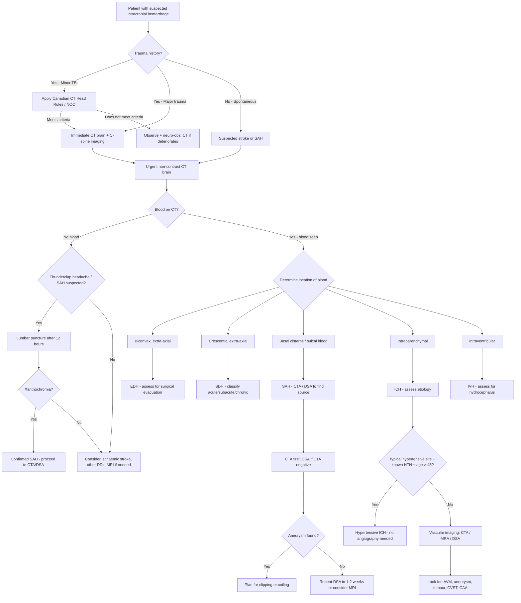

## Diagnostic Criteria, Algorithm, and Investigations for Intracranial Hemorrhage

### A. Diagnostic Principles — Why Imaging Is Everything

Let me be blunt: **there are no validated clinical diagnostic criteria that can reliably distinguish intracranial hemorrhage types from each other or from ischemic stroke at the bedside.** The diagnosis of intracranial hemorrhage is fundamentally a **neuroimaging diagnosis**. Clinical features raise suspicion, but the CT scan (or MRI) gives you the answer.

This is why every guideline worldwide states:

> ***Neuroimaging (CT/MRI) is essential for all stroke patients for confirmation of diagnosis*** [1]. ***Non-contrast CT brain is the mainstay of imaging in acute stroke — it allows differentiation of ischaemic and haemorrhagic stroke*** [5].

The clinical approach therefore has two phases:
1. **Recognize the clinical syndrome** → suspect intracranial hemorrhage
2. **Image urgently** → confirm the type, location, and extent → guide management

---

### B. When to Image: Clinical Decision Rules

Not every patient with a headache or minor bump needs a CT. But every patient with a **suspected stroke or significant head injury** does. Decision rules help in the **trauma setting** (minor head injury) to decide who needs a CT.

#### B1. Canadian CT Head Rules (CCHR) [2][13]

This applies to **minor head injury** patients with GCS 13–15 who have witnessed LOC, amnesia, or confusion.

**Exclusion criteria** (if any present → CT is recommended regardless, as risk is already high):
- ***ED GCS < 13***
- ***Obvious penetrating skull injury or depressed skull fracture***
- ***Unstable vital signs associated with major trauma***
- ***Focal neurological deficit***
- ***Seizure prior to assessment in ED***
- ***Bleeding disorders or use of oral anticoagulants***

**High risk for neurosurgical intervention** (any one → CT recommended):
- ***Age ≥ 65 years old***
- ***Vomiting ≥ 2 episodes***
- ***GCS < 15 at 2 hours after injury***
- ***Suspected open or depressed skull fracture***
- ***Any signs of basal skull fracture (raccoon eyes, Battle's sign, CSF otorrhea/rhinorrhea, hemotympanum)***

**Medium risk for brain injury on CT** (consider CT):
- ***Amnesia before impact ≥ 30 minutes***
- ***Dangerous mechanism*** (pedestrian struck by motor vehicle, ejected from vehicle, fall from height > 3 feet or 5 stairs)

#### B2. New Orleans Criteria (NOC) [2]

For patients with GCS 15/15 after traumatic brain injury — CT is indicated if **any** of:
- Headache
- Vomiting
- Age > 60
- Drug or alcohol intoxication
- Persistent antegrade amnesia
- Seizure
- Visible trauma above the clavicle

<Callout title="Clinical Pearl" type="idea">
The Canadian CT Head Rules are more specific (fewer unnecessary CTs) while the New Orleans Criteria are more sensitive (catch more pathology but more scans). In practice, if there is any clinical doubt after a head injury, the threshold to CT should be low — the radiation dose of a single head CT is modest, and missing an EDH can be fatal.
</Callout>

#### B3. Non-Traumatic Presentations

For **spontaneous** (non-traumatic) presentations — there are no formal "decision rules" like CCHR. Instead, **any patient with suspected stroke gets an urgent CT brain.** Period. The time-sensitivity of stroke management (thrombolysis window < 4.5 hours) means imaging must happen within minutes of arrival.

Specifically, **CT brain is mandatory before any thrombolysis** to exclude hemorrhage [2][5].

---

### C. Master Diagnostic Algorithm

---

### D. Investigation Modalities — Detailed

#### D1. Non-Contrast CT Brain (NCCT)

This is the **single most important investigation** for intracranial hemorrhage [1][2][5][13].

**Why NCCT first?**
- **Speed:** Takes ~1 minute. In a stroke emergency, time is brain (2 million neurons die per minute in ischemia).
- **Availability:** Available 24/7 in virtually all EDs.
- ***Sensitivity for acute hemorrhage: excellent (approaching 100% within 12 hours of onset for ICH)*** [5]. Fresh blood is hyperdense on CT because of the high protein content of hemoglobin.
- **Primary role:** ***Exclude hemorrhage before thrombolytic/antiplatelet therapy*** [5][6].

**CT Appearance of Blood Over Time** [5][6][14]:

| Time | CT Density | Explanation | Clinical Relevance |
|---|---|---|---|
| ***Acute (days)*** | ***Hyperdense (white)*** | ***Due to protein-Hb product; high attenuation*** | Easy to see; most hemorrhages diagnosed here |
| ***Subacute (few days to 2 weeks)*** | ***Isodense*** | ***Degradation of protein-Hb product; evolves peripherally to centrally*** | ***Difficult to visualize — should do CT ASAP after injury*** (or use contrast CT) [5] |
| ***Chronic ( > 2 weeks)*** | ***Hypodense (dark)*** | Completely degraded blood products | May mimic CSF or hygroma; can be confused with old infarct |

> ***Attenuation of blood on CT changes with time: Acute = hyperdense, Subacute = isodense, Chronic = hypodense*** [5]

<Callout title="Exam Point" type="error">
***Subacute SDH (1–3 weeks) is isodense and can be extremely difficult to see on NCCT!*** [5] If you have strong clinical suspicion for SDH but the CT looks "normal," look carefully for: (1) effacement of sulci on one side, (2) midline shift without a visible lesion, (3) "white matter buckling sign." Consider contrast CT or MRI.
</Callout>

> ***CT may not be hyperdense if Hct is low*** [6] — in a severely anemic patient, acute blood may appear isodense rather than hyperdense because there is less hemoglobin to generate the high attenuation signal.

**Key CT Findings by Type:**

| Type | CT Finding | Additional Features |
|---|---|---|
| ***EDH*** | ***Biconvex (lentiform) hyperdensity between skull and dura; does NOT cross sutures*** [5] | ***75% associated with skull fracture*** [5]; look at bone window |
| ***SDH*** | ***Crescentic hyperdensity (acute), isodensity (subacute), or hypodensity (chronic) that crosses sutures but NOT the midline*** [5] | Mixed density in acute-on-chronic; look for midline shift |
| ***SAH*** | ***Hyperdensity in basal cisterns, Sylvian fissures, interhemispheric fissure — "star sign"*** [1] | ***Sulcal hyperdensity is usually traumatic*** [1]; may miss small bleeds |
| ***ICH*** | Irregular hyperdensity within brain parenchyma | Note location (deep vs lobar), size, IVH extension, mass effect, midline shift |
| ***IVH*** | Hyperdensity within ventricles; dependent layering | Assess for hydrocephalus (temporal horn dilation is an early sign) |

> ***Urgent NCCT brain: assess size and location of haematoma, any IVH/hydrocephalus, any mass effect*** [3]

**Sensitivity limitations:**
- ***CT sensitivity for ischaemic stroke: < 1 day only 48% → 10–11 days 74%. Sensitivity increases with time after infarct*** [5]
- ***CT sensitivity for SAH: ~98% within 6 hours, ~93% at 24 hours, drops significantly after 3–5 days*** — this is why LP is needed if CT is negative but SAH is clinically suspected.

**MRI Blood Appearance Mnemonic** [14]:

| Time | CT | MRI T1 | MRI T2 |
|---|---|---|---|
| ***Acute ( < 72h)*** | ***Hyper*** | ***Grey (iso)*** | ***Black (hypo)*** |
| ***Subacute ( < 3 weeks)*** | ***Iso*** | ***White (hyper)*** | ***White (hyper)*** |
| ***Chronic ( > 3 weeks)*** | ***Hypo*** | ***Black (hypo)*** | ***Black (hypo)*** |

> Memory aid: MRI T1 = **"George Washington Bridge"** (Grey → White → Black); MRI T2 = **"Oreo cookie"** (Black → White → Black) [14]

---

#### D2. CT Angiography (CTA) [1][5][15]

- **Principle:** ***Rapid injection of a large IV bolus of contrast to opacify vessels for CT imaging*** [5].
- ***Can be used in place of more invasive conventional angiography*** [5].
- **When to use in ICH:**
  - ***SAH: to identify the source aneurysm — CTA is first-line vascular imaging after NCCT confirms SAH*** [1]
  - ***ICH: when non-hypertensive etiology is suspected*** [3] — indications:
    - ***No HTN***
    - ***Age < 40–45***
    - ***Atypical location (lobar in young patient)***
    - ***CT abnormality: mass, calcifications***
  - ***AVM diagnosis: contrast CT/CT angiogram or conventional angiography*** [5]

- **Key findings:**
  - **Aneurysm:** Outpouching from an arterial bifurcation; size, neck width, and relationship to parent vessel determine treatment approach.
  - **AVM:** Tangle of abnormal vessels ("nidus") with enlarged feeding arteries and early-draining veins.
  - **"Spot sign":** Active contrast extravasation within the hematoma on CTA — indicates **ongoing active bleeding** and predicts hematoma expansion. This is a critical prognostic sign.
  - **Dissection:** Intimal flap, double lumen, or tapered occlusion.

- **Advantages over DSA:** Non-invasive, fast (can be done immediately after NCCT), widely available.
- **Limitations:** Less spatial resolution than DSA; may miss very small aneurysms ( < 3 mm).

---

#### D3. Lumbar Puncture (LP) — For SAH When CT Is Negative [1][7]

> ***LP — only if CT negative*** [7]

**Why LP after negative CT for SAH?**
CT sensitivity for SAH drops after the first 12–24 hours. If the CT is done late or the bleed is very small, CT can be false-negative. LP detects blood/blood breakdown products in CSF that CT might miss.

**Timing:** Wait at least **12 hours** after headache onset before LP — this allows time for hemoglobin to break down to bilirubin (xanthochromia). If done too early, you cannot distinguish traumatic tap from SAH.

**Key findings:**

| Finding | SAH | Traumatic Tap |
|---|---|---|
| ***3-bottle test*** | ***Uniformly blood-stained CSF in all 3 tubes (no clearing)*** | Blood clears progressively from tube 1 to tube 3 |
| ***Xanthochromia*** | ***Present (yellow discoloration of supernatant after centrifugation — due to bilirubin from hemoglobin breakdown); appears after several hours*** [7] | Absent (blood is fresh, no time for breakdown) |
| Opening pressure | Often elevated | Normal |
| RBC count | Consistent across tubes | Decreasing across tubes |

> ***SAH vs traumatic tap: 3-bottle test; xanthochromia after several hours*** [7]

- **Spectrophotometry** for xanthochromia (detecting bilirubin and oxyhemoglobin peaks) is more sensitive than visual inspection alone and is the recommended method.

<Callout title="Must Know">
***Clinical suspicion + CT negative → LP is mandatory to rule out SAH*** [7]. A negative CT does NOT rule out SAH, especially if performed > 12 hours after onset. However, a negative CT + negative LP (no xanthochromia at > 12 hours) effectively excludes SAH.
</Callout>

---

#### D4. MRI Brain [1][2][5]

- ***More sensitive than CT except in acute haemorrhage, bony lesions, and calcific lesions*** [6]
- ***Better than CT especially in the first few hours for ischaemic stroke*** [5]

**When to use MRI in intracranial hemorrhage:**

| Indication | Rationale |
|---|---|
| ***Subacute/chronic SDH not clearly seen on CT*** | MRI is far more sensitive for isodense/chronic collections [2] |
| ***Suspected underlying lesion (tumour, AVM, cavernoma)*** | MRI shows soft tissue detail, enhancement, and hemosiderin |
| ***CAA diagnosis*** | ***Gradient-recalled echo (GRE) / Susceptibility-weighted imaging (SWI) sequences detect cortical microbleeds*** — pathognomonic for CAA |
| ***CVST*** | ***MRI brain + MR venogram for filling defect; "empty delta sign" for SSS involvement*** [3] |
| ***Brainstem/cerebellar strokes*** | ***MRI more sensitive for posterior fossa lesions*** [1] |
| ***DWI for ischaemia*** | ***Restricted diffusion on DWI detects ischaemia within minutes*** [5] |
| ***SAH (false-negative at acute stage)*** | ***MRI can be false-negative at acute stage*** [7] — CT is preferred acutely |

**Key MRI sequences and what they show:**

| Sequence | What It Detects | Clinical Use |
|---|---|---|
| **T1-weighted** | Subacute blood (bright), anatomy | Subacute hemorrhage, structural detail |
| **T2-weighted** | Edema (bright), chronic blood (dark) | Perilesional edema, chronic hemosiderin |
| **FLAIR** | Suppresses CSF signal; subarachnoid blood and edema remain bright | SAH detection (more sensitive than CT after 24h), perilesional edema |
| **DWI** | ***Restricted diffusion in ischaemia (bright within minutes)*** [5] | Distinguishing ischemic from hemorrhagic stroke, peri-hematomal ischemia |
| **GRE / SWI** | Hemosiderin deposits (dark "blooming" artifacts) | ***Microbleeds in CAA***, chronic hemorrhage, cavernous malformations ("popcorn" appearance with hemosiderin ring) |
| **MR Venography** | Venous sinus patency | ***CVST — filling defects, "empty delta sign"*** [3] |
| **MRA** | Arterial anatomy | Aneurysms, stenosis, dissection; screening tool |

**CT vs MRI — Comparison** [5]:

| Feature | CT | MRI |
|---|---|---|
| ***Radiation*** | ***Yes*** | ***No*** |
| ***Examination time*** | ***1 min*** | ***20 min*** |
| ***Availability*** | ***Good*** | ***Fair*** |
| ***Sensitivity for infarct*** | ***Poor (acutely)*** | ***Good*** |
| ***Sensitivity for haemorrhage*** | ***Good (acute)*** | ***Good (GRE/SWI for chronic)*** |

---

#### D5. Digital Subtraction Angiography (DSA) [1][15]

> ***DSA is the gold-standard for cerebral vessel abnormalities*** [1][15]

- **Principle:** ***Fluoroscopy with catheterization angiography → digital reversal of first film superimposed on subsequent films → better delineation of blood vessels*** [15]
- **Types:** Carotid angiography, vertebral angiography

**When to use DSA:**
- **SAH with negative CTA** — DSA has the highest spatial resolution and can detect small aneurysms ( < 3 mm) that CTA misses.
- **AVM characterization** — DSA shows the feeding arteries, nidus, and draining veins dynamically, which is essential for surgical/endovascular planning.
- **Therapeutic (endovascular):** ***Coiling for aneurysms, mechanical thrombectomy for CVA*** [15].

**Risks** [15]:
- ***Permanent neurological complication < 1%, transient < 3%***
- ***Vessel damage (pseudoaneurysm formation)***
- ***Contrast-related (anaphylaxis, renal failure)***
- ***Access site complications (groin hematoma)***
- ***Non-target embolization, arterial thrombosis/dissection, ICH, CN trauma*** (for endovascular procedures)

> ***Diagnostic role of conventional angiography is diminishing as it is relatively invasive. CT or MR angiography commonly used for diagnostic purposes and guide further interventions via conventional angiography*** [5]

---

#### D6. Duplex Ultrasound [1][15]

- ***Extracranial duplex USG: visualizes atherosclerotic plaques, clots, and degree of stenosis*** [15]
  - Use: evaluation of carotid and vertebral atherosclerosis (relevant for ischemic stroke workup)
- ***Transcranial Doppler (TCD): assesses basal segments of major cerebral arteries*** [15]
  - Use: ***Assess intracranial atherosclerosis, assess post-SAH vasospasm, monitor microembolic signals*** [15]
  - In SAH: daily TCD monitoring for vasospasm — increasing mean flow velocities ( > 120 cm/s in MCA) indicate developing vasospasm.

---

#### D7. Blood Investigations

These are not diagnostic for the hemorrhage itself but are essential for identifying the **cause**, **assessing complications**, and **guiding management**.

| Investigation | Rationale |
|---|---|
| ***CBC*** | ***Polycythemia (RF for stroke); thrombocytopenia (bleeding risk); anemia (may affect CT density)*** [1] |
| ***Clotting profile (PT/INR, aPTT)*** and ***platelet count*** | ***Essential for ICH — identify coagulopathy; guide reversal therapy*** [1] |
| ***Blood glucose*** | ***Exclude hypoglycemia as stroke mimic; DM as RF*** [1]. **Contraindication to thrombolysis if < 2.8 mmol/L** [2] |
| ***Renal function (U&E, Cr)*** | Baseline for contrast use; hyponatremia (SIADH/CSWS) post-SAH |
| ***Liver function*** | Coagulopathy from liver disease (important in alcoholics with SDH) |
| Lipid profile | Atherosclerotic RF assessment |
| ***ESR ± autoimmune markers*** | ***Vasculitis*** as cause of ICH [1] |
| Group and screen / crossmatch | In case of surgical intervention |
| Toxicology screen | Cocaine, amphetamines (if suspected drug-related ICH) |
| Fibrinogen level | If on thrombolytics and ICH complication develops; DIC screening |
| Thrombophilia screen | If CVST suspected (protein C/S, antithrombin III, factor V Leiden, antiphospholipid antibodies) |

---

#### D8. ECG [1]

- ***For cardiac abnormalities (e.g., AF)*** — identifying cardioembolic source if ischemic stroke is in the differential.
- SAH can cause **ECG changes** that mimic acute coronary syndrome: ST changes, T-wave inversion, prolonged QT, prominent U waves — these are due to massive catecholamine release (sympathetic storm) causing myocardial injury. Do not be fooled into treating for ACS.

---

#### D9. CT Perfusion (CTP) [5]

- ***Use of contrast CT to estimate perfusion map of brain tissues*** [5]
- ***Differentiates irreversible infarct core from reversible penumbra*** [5]
- More relevant to ischemic stroke (selecting candidates for thrombectomy beyond standard time windows) than primary ICH.
- In ICH, can show peri-hematomal hypoperfusion.

---

#### D10. Fundoscopy

- **Papilledema:** Indicates raised ICP (a late sign) [11]
- ***Subhyaloid hemorrhage:*** Characteristic of SAH — flame-shaped or D-shaped hemorrhage between retina and vitreous (Terson syndrome) [1]
- Should be performed in all patients with suspected raised ICP or SAH.

---

### E. Investigation Algorithm by Type of ICH

| Type | First-Line | Second-Line | Additional |
|---|---|---|---|
| **EDH** | NCCT brain (+ bone windows for fracture) | — | C-spine imaging if trauma |
| **Acute SDH** | NCCT brain | MRI if subacute/chronic SDH suspected but CT unclear | Coagulation studies (esp. if on anticoagulants) |
| **SAH** | NCCT brain → if positive: **CTA** → if CTA negative: **DSA** | ***If CT negative: LP (xanthochromia after 12h)*** [7] → if LP positive: CTA/DSA | TCD for vasospasm monitoring; daily electrolytes for SIADH/CSWS |
| **ICH (hypertensive)** | NCCT brain; bloods (clotting, CBC, glucose) | Usually no vascular imaging needed if typical site + known HTN | Monitor for hematoma expansion (repeat CT) |
| **ICH (non-hypertensive / atypical)** | NCCT brain → **CTA or MRA** | DSA if CTA/MRA negative; MRI with GRE/SWI for CAA/cavernoma | Consider contrast MRI if tumour suspected |
| **CVST** | NCCT (may be normal) → **MRI + MR venogram** | DSA if MRV equivocal | Thrombophilia screen |

---

### F. ICP Monitoring [1]

When intracranial hemorrhage is managed conservatively or in the ICU, ICP monitoring becomes critical.

> ***Indications for ICP monitoring: (1) No reliable clinical monitoring (e.g., sedation, muscle paralysis — these render GCS = 3); (2) GCS ≤ 8 (usually require sedation for intubation → V score becomes "VT"); (3) Likely evolving conditions*** [1]

**Methods** [1]:
- ***External ventricular drain (EVD): gold standard*** — provides both ICP monitoring AND therapeutic CSF drainage. Problem: risk of infection.
- Other: Intraparenchymal transducers, subarachnoid bolts.

**Interpretation** [1]:
- ***Normal mean ICP = 5–15 cmH2O in adults***
- ***Definitely abnormal if > 20 cmH2O → suggests evolving pathology → repeat imaging or escalate treatment***

---

### G. Neuro-observation (Neuro-obs)

This is not a single "test" but a critical component of monitoring. Documented at regular intervals (e.g., every 15 min → hourly → 2-hourly depending on clinical stability).

Components:
- **GCS** (Eye, Verbal, Motor) — ***M-scale is considered most prognostically significant*** [1]
- **Pupil size and reactivity** — asymmetry indicates impending herniation
- **Limb movements** — new weakness suggests evolving pathology
- **Vital signs** — BP, HR, RR, temperature, SpO2
- **Cushing's triad** monitoring (hypertension, bradycardia, irregular breathing)

> ***Close neuro-observation as patient's condition can deteriorate rapidly*** [13]

---

### H. Summary of Key Diagnostic Points

| Scenario | Key Investigation | Must-Know Findings |
|---|---|---|
| Acute stroke | NCCT brain | Exclude hemorrhage before thrombolysis; hyperdense lesion = hemorrhage |
| SAH suspected, CT positive | CTA | Identify aneurysm (site, size, morphology) |
| SAH suspected, CT negative | ***LP after 12 hours*** | ***Xanthochromia = SAH; 3-bottle test to distinguish from traumatic tap*** [7] |
| Lobar ICH in young patient | CTA/DSA | AVM, aneurysm, tumour |
| Lobar ICH in elderly, no HTN | MRI with GRE/SWI | Cortical microbleeds = CAA |
| Post-SAH monitoring | Daily TCD | MCA velocity > 120 cm/s suggests vasospasm |
| Suspected CVST | MRI + MRV | ***Filling defect; "empty delta sign"*** [3] |
| Minor head injury | Apply CCHR | High-risk features → CT; medium-risk → observe ± CT |

<Callout title="High Yield Summary — Diagnostics">

1. ***NCCT brain is the single most important investigation*** — fast, available, excellent for acute blood.
2. **CT appearance of blood evolves:** Acute = hyperdense → Subacute = isodense (DANGER: can miss SDH!) → Chronic = hypodense.
3. **MRI T1 blood mnemonic:** "George Washington Bridge" (Grey → White → Black). **T2:** "Oreo" (Black → White → Black).
4. ***For SAH: CT first → if negative, LP for xanthochromia (must wait > 12 hours). CT negative does NOT exclude SAH*** [7].
5. ***CTA is first-line vascular imaging after confirmed SAH to find the aneurysm. DSA is the gold standard but more invasive*** [15].
6. ***Indications for vascular imaging in ICH: no HTN, age < 40–45, atypical location, CT abnormality (mass, calcifications)*** [3].
7. **"Spot sign" on CTA** = active contrast extravasation = ongoing bleeding = poor prognosis and hematoma expansion.
8. ***CVST: CT can be normal; MRI + MR venogram is diagnostic (empty delta sign)*** [3].
9. **GRE/SWI on MRI** detects old microbleeds — essential for diagnosing CAA and cavernous malformations.
10. ***Canadian CT Head Rules stratify minor head injury patients for CT; high-risk criteria include age ≥ 65, vomiting ≥ 2, GCS < 15 at 2h, suspected skull fracture, basal skull fracture signs*** [2][13].

</Callout>

---

<ActiveRecallQuiz
  title="Active Recall - Diagnostics of Intracranial Hemorrhage"
  items={[
    {
      question: "A patient presents with thunderclap headache 18 hours ago. CT brain is normal. What is the next investigation and what specific finding confirms SAH?",
      markscheme: "Lumbar puncture. Must be done at least 12 hours after onset to allow hemoglobin breakdown. Key finding: xanthochromia (yellow discoloration of CSF supernatant after centrifugation, due to bilirubin from hemoglobin degradation). Also: uniformly blood-stained CSF across all 3 tubes (3-bottle test does not clear). Negative CT does NOT exclude SAH."
    },
    {
      question: "Describe the CT appearance of blood at acute, subacute, and chronic stages. Why is subacute SDH a diagnostic challenge?",
      markscheme: "Acute (days): hyperdense (white) due to protein-Hb product. Subacute (days to 2 weeks): isodense — degradation of Hb products, evolves peripherally to centrally. Chronic (over 2 weeks): hypodense (dark). Subacute SDH is isodense to brain parenchyma and can be very difficult to see on NCCT. Clues: unilateral sulcal effacement, midline shift without visible lesion. Use contrast CT or MRI if suspected."
    },
    {
      question: "List the indications for vascular imaging (CTA/DSA) in a patient with confirmed intracerebral hemorrhage on CT.",
      markscheme: "Suspected non-hypertensive etiology: (1) No history of HTN, (2) Age under 40-45, (3) Atypical location (e.g., lobar in young patient), (4) CT abnormality suggesting underlying lesion (mass, calcifications). In typical hypertensive ICH (deep location, elderly, known HTN), vascular imaging is usually NOT needed."
    },
    {
      question: "What are the high-risk criteria in the Canadian CT Head Rules that mandate CT brain after minor head injury?",
      markscheme: "High-risk for neurosurgical intervention (any one present): (1) Age 65 or over, (2) Vomiting 2 or more episodes, (3) GCS less than 15 at 2 hours after injury, (4) Suspected open or depressed skull fracture, (5) Any signs of basal skull fracture (raccoon eyes, Battle sign, CSF otorrhea/rhinorrhea, hemotympanum)."
    },
    {
      question: "Compare CTA and DSA as cerebral vascular imaging modalities in terms of principle, advantages, and limitations.",
      markscheme: "CTA: rapid IV contrast bolus with CT imaging of opacified vessels. Advantages: non-invasive, fast, widely available, can be done immediately after NCCT. Limitations: less spatial resolution, may miss small aneurysms under 3 mm. DSA: catheterization angiography with digital subtraction. Gold standard for cerebral vessel abnormalities. Advantages: highest spatial resolution, allows therapeutic intervention (coiling, thrombectomy). Limitations: invasive, permanent neurological complication under 1%, contrast and access site risks."
    },
    {
      question: "How does GRE/SWI on MRI help in the diagnostic workup of lobar ICH in an elderly patient without hypertension?",
      markscheme: "GRE (gradient-recalled echo) and SWI (susceptibility-weighted imaging) sequences are highly sensitive for hemosiderin deposits, which appear as dark 'blooming' artifacts. In CAA, they show multiple cortical/subcortical microbleeds in a lobar distribution. This pattern of microbleeds is pathognomonic for CAA and helps distinguish it from hypertensive vasculopathy (which causes deep microbleeds). Also useful for detecting cavernous malformations (popcorn appearance with hemosiderin ring)."
    }
  ]}
/>

## References

[1] Senior notes: Ryan Ho Neurology.pdf (Section 3.2: Cerebrovascular Diseases — Evaluation, Ix; Section 8.1: Raised ICP; Section 11.1: Approach to Head Injuries; Section 11.3: SDH, Traumatic SAH; p36: Cerebral Vascular Imaging)
[2] Senior notes: felixlai.md (Neuroimaging section, Canadian CT Head Rules, NOC, Diagnosis of EDH/SDH, Thrombolysis contraindications)
[3] Senior notes: maxim.md (ICH investigations, CVST investigations)
[5] Senior notes: Ryan Ho Diagnostic Radiology.pdf (p40–43: CT in stroke, Intracranial haemorrhages, CT angiography, CT perfusion; p50: MRI in stroke)
[6] Senior notes: Ryan Ho Radiology.pdf (p19: CT appearance of blood, SDH)
[7] Lecture slides: GC 109. Headache and loss of consciousness Acute stroke, subarachnoid haemorrhage and vascular malformation.pdf (p16: Diagnosis of SAH — CT, LP, xanthochromia, 3-bottle test, MRI false-negative)
[11] Senior notes: Ryan Ho Opthalmology.pdf (p90: Papilloedema)
[13] Senior notes: Ryan Ho Fundamentals.pdf (p337: Head Injuries approach, NECT, Canadian CT rules; p475: Cerebral Vascular Imaging)
[14] Senior notes: maxim.md (CT and MRI appearance of blood over time table)
[15] Senior notes: Ryan Ho Neurology.pdf (p36: DSA, CTA, MRA, Duplex USG) and Ryan Ho Fundamentals.pdf (p475: Cerebral Vascular Imaging)
