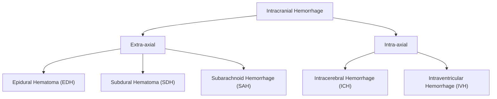

# Intracranial Hemorrhage (ICH)

## 1. Definition

Intracranial hemorrhage (ICH) refers to any bleeding occurring within the cranial vault. The term is an umbrella — "intra" = within, "cranial" = skull, "hemorrhage" = bleeding. It encompasses several distinct entities classified by the anatomical compartment in which blood accumulates:

- **Epidural hematoma (EDH):** Blood between the inner table of the skull and the periosteal (outer) layer of the dura mater.
- **Subdural hematoma (SDH):** Blood between the meningeal (inner) layer of the dura and the arachnoid mater.
- **Subarachnoid hemorrhage (SAH):** Blood within the subarachnoid space (between arachnoid and pia mater), where CSF normally circulates.
- **Intracerebral (intraparenchymal) hemorrhage:** Blood within the brain parenchyma itself.
- **Intraventricular hemorrhage (IVH):** Blood within the ventricular system — often secondary to extension of an intracerebral hemorrhage or SAH.

> ***Stroke*** *is defined as rapid onset of focal or global cerebral dysfunction due to non-traumatic vascular causes, with symptoms lasting > 24 hours or leading to death* [1]. Hemorrhagic stroke accounts for ***~20% of all strokes*** *but carries the highest mortality* [1].

<Callout title="Key Distinction">
Not all intracranial hemorrhages are "strokes." EDH and SDH are typically traumatic and are classified under traumatic brain injury, not stroke. The term "hemorrhagic stroke" specifically refers to spontaneous intracerebral hemorrhage and subarachnoid hemorrhage.
</Callout>

---

## 2. Epidemiology

### 2.1 Overall Burden

- ***Stroke is the most common adult neurological disease, and the 2nd–3rd leading cause of death in China and Hong Kong*** [1].
- Among strokes: ***ischaemic stroke 75–80%, intracerebral hemorrhage ~15%, subarachnoid hemorrhage < 5%*** [1].
- In Hong Kong and East Asia, the proportion of hemorrhagic strokes is relatively **higher** compared to Western populations, largely driven by the high prevalence of hypertension and dietary factors (high sodium intake).

### 2.2 Mortality and Prognosis (by type) [1]

| Type | 1-month mortality | 1-year mortality | Disability |
|---|---|---|---|
| ***SAH*** | ***~50%*** | — | ***50% with severe deficits*** |
| ***ICH (intracerebral)*** | ***~40%*** | ***~50%*** | Moderate–severe |
| Cortical infarct | ~20% | ~35% | Moderate |
| Lacunar infarct | Low | Low | Low |

> ***Main determinant of prognosis in stroke: mortality order (descending) is SAH > ICH > cortical infarct > lacunar infarct. Disability order: SAH > cortical infarct > ICH > lacunar infarct.*** [1]

### 2.3 Epidural Hematoma

- Relatively uncommon: ~1–4% of traumatic head injuries.
- **Peak incidence:** Young adults (20–30 years) — because the dura is less adherent to the skull in this age group.
- **Rare in the very young (< 2 years)** and **elderly (> 60 years)** — in infants the dura is tightly adherent to the skull; in elderly the middle meningeal artery is more embedded in bone grooves, making it less prone to shearing.

### 2.4 Subdural Hematoma

- Much more common than EDH, especially in the elderly.
- **Chronic SDH** is one of the most common neurosurgical conditions in geriatric populations (particularly in Hong Kong's aging population).
- Bimodal distribution: young adults (trauma) and elderly (falls, atrophy, anticoagulation).

### 2.5 Subarachnoid Hemorrhage

- ***Cerebral aneurysms found in 2–5% of the adult population, but only 6–8/100,000/year rupture*** [1].
- ***Cerebral venous thrombosis accounts for ~1% of stroke, with F > M (pregnancy, use of COC)*** [3].
- Peak incidence of aneurysmal SAH: 40–60 years; female predominance (3:2).

### 2.6 Intracerebral Hemorrhage

- Incidence: ~25 per 100,000/year globally; higher in Asian populations (including Hong Kong) — partly due to higher hypertension prevalence.
- ***Hypertension is the cause in 50–90% of cases*** [4].
- Peak incidence: 55–75 years.

### 2.7 Risk Factors

#### Non-modifiable Risk Factors [1][2]
- ***Old age***
- ***Male sex*** (overall; female predominance for SAH)
- ***Previous vascular event (MI, stroke, PVD)***
- ***Family history***
- Race/ethnicity: higher in Black and East Asian populations

#### Modifiable Risk Factors [1][2]
- ***Atherosclerotic risk factors: obesity, lack of exercise, cigarette smoking, alcohol abuse, HTN, DM, hyperlipidemia***
- ***Sources of thromboemboli: AF, CHF, IE; blood abnormalities (high fibrinogen, polycythemia, homocysteinemia, OCP/HRT use); carotid artery stenosis***
- Specific to hemorrhagic stroke:
  - **Hypertension** — the single most important modifiable risk factor for ICH
  - **Anticoagulant/antiplatelet use** — warfarin-associated ICH carries very high mortality
  - **Excessive alcohol intake** — dose-dependent risk
  - **Illicit drug use** (cocaine, amphetamines)
  - ***Smoking: strong dose-response relationship for both ischaemic stroke and SAH; risk declines after quitting and can be eliminated by 5 years*** [2]

<Callout title="Hong Kong Focus">
In Hong Kong, the leading modifiable risk factor for ICH is **hypertension**, particularly poorly controlled hypertension in middle-aged and elderly men. Falls in the elderly (often on anticoagulants for AF) are a major cause of traumatic SDH. The aging population and increasing anticoagulant use make chronic SDH an increasingly common surgical problem.
</Callout>

---

## 3. Anatomy and Function

Understanding intracranial hemorrhage requires a solid grasp of meningeal anatomy, cerebral vasculature, and CSF dynamics. Let's build this from first principles.

### 3.1 The Meninges (Layers from Outside In)

| Layer | Key Features | Clinical Relevance |
|---|---|---|
| **Periosteum (outer periosteal layer of dura)** | Adherent to inner skull table; contains middle meningeal artery (MMA) | EDH: blood strips dura from bone |
| **Dura mater (meningeal layer)** | Tough, fibrous; forms dural folds (falx cerebri, tentorium cerebelli); contains dural venous sinuses | SDH: blood between dura and arachnoid |
| **Arachnoid mater** | Avascular, delicate membrane; bridging veins traverse from brain surface through subarachnoid space to dural venous sinuses | SDH: bridging vein rupture |
| **Subarachnoid space** | Contains CSF, cerebral arteries (Circle of Willis), and arachnoid trabeculae | SAH: blood in CSF space |
| **Pia mater** | Intimately adherent to brain surface; carries small penetrating arteries | Intracerebral hemorrhage from small arteries |

### 3.2 Key Vascular Anatomy

#### Middle Meningeal Artery (MMA)
- Branch of the **maxillary artery** (from external carotid artery).
- Enters the skull through the **foramen spinosum**.
- Runs in a groove on the inner table of the skull in the temporal region, between the dura and the skull.
- **This is the vessel torn in ~85% of epidural hematomas** [5][6]. The pterion (thinnest part of the skull, where frontal, parietal, temporal, and sphenoid bones meet) overlies the MMA — trauma here is classically associated with EDH.

#### Bridging (Cortical) Veins
- Small veins that drain from the cerebral cortex (pial veins) across the subdural space to enter the dural venous sinuses (especially the superior sagittal sinus).
- They are **unsupported** as they traverse the subdural space — making them vulnerable to **shearing forces** during head trauma.
- ***Tearing of bridging veins is the cause of subdural hematoma*** [5][6].
- In the elderly with cerebral atrophy, the brain "shrinks away" from the skull — the bridging veins are stretched over a greater distance, making them even more vulnerable to tearing with even minor trauma.

#### Circle of Willis
- The anastomotic ring at the base of the brain formed by:
  - Anterior: paired ACAs connected by the anterior communicating artery (AComm)
  - Middle: MCAs (lateral)
  - Posterior: paired PCAs connected to the ICAs via posterior communicating arteries (PComm)
  - Fed by: bilateral internal carotid arteries (anterior circulation) and the basilar artery (posterior circulation, from paired vertebral arteries)
- ***Cerebral aneurysms are usually at arterial bifurcations, majority along Circle of Willis, 90% anterior circulation*** [1].
- Most common sites: AComm (~30%), PComm (~25%), MCA bifurcation (~20%).

#### Penetrating (Lenticulostriate) Arteries
- Small perforating arteries arising from the proximal MCA and ACA.
- Supply the **basal ganglia, internal capsule, and thalamus**.
- These are the vessels most affected by **hypertensive lipohyalinosis** — weakening of the vessel wall leads to formation of **Charcot-Bouchard microaneurysms**, which can rupture causing hypertensive ICH.

### 3.3 CSF Dynamics (Relevant to SAH and Hydrocephalus)

- CSF is produced by the **choroid plexus** (mainly in the lateral ventricles) at ~500 mL/day; total volume at any time is ~150 mL.
- Flow: lateral ventricles → foramen of Monro → 3rd ventricle → cerebral aqueduct → 4th ventricle → foramina of Luschka (lateral) and Magendie (median) → subarachnoid space → absorbed at arachnoid granulations into the superior sagittal sinus.
- **SAH can obstruct CSF absorption** at the arachnoid granulations (communicating hydrocephalus) or block CSF pathways with blood clot (obstructive hydrocephalus) — this is why hydrocephalus is a major complication of SAH.

### 3.4 Monro-Kellie Doctrine [1]

> ***The skull is a rigid structure with constant volume. Contents = brain (80%) + blood (10%) + CSF (10%). An increase in any constituent must be compensated by a decrease in others, mainly by CSF outflow (slow) and venous outflow (quick). Overwhelming of compensatory mechanisms leads to raised ICP.*** [1]

This is the fundamental principle explaining why intracranial hemorrhage is dangerous: the accumulating blood is a **space-occupying lesion** within a fixed-volume container. Once compensatory mechanisms are exhausted, ICP rises exponentially.

---

## 4. Etiology

### 4.1 Epidural Hematoma (EDH) [2][5][6]

| Category | Causes |
|---|---|
| **Trauma (most common)** | Road traffic accidents (RTA), falls, assaults |
| **Vascular source** | ***Arterial injury (85%)*** — middle meningeal artery; ***13% tearing of transverse sinus*** (venous); diploic veins |
| **Non-traumatic (rare)** | Infection/epidural abscess (pressure necrosis of meningeal vessels), coagulopathy, AV malformations, hemorrhagic tumors, neurosurgical complications, hemodialysis (ICP fluctuations, uremic platelet dysfunction, heparin, hypertension) |

- ***75% associated with skull fracture*** [6] (some sources cite up to 90% [5]).

### 4.2 Subdural Hematoma (SDH) [2][5][6]

| Category | Causes |
|---|---|
| **Trauma (most common)** | RTA, falls (especially elderly), assaults |
| **Vascular source** | ***Tearing of bridging veins*** |
| **Non-traumatic** | Coagulopathy (warfarin, DOACs, thrombocytopenia), AV malformation, tumors (meningioma, dural metastasis), neurosurgical complications |
| **Risk factors** | ***Diffuse cerebral atrophy (common in elderly)***, ***chronic alcoholism*** (both cause brain shrinkage → stretching of bridging veins), anticoagulant/antiplatelet use |

**Classification of SDH by chronicity** [2]:

| Type | Timeline | CT Appearance | Notes |
|---|---|---|---|
| ***Acute SDH*** | ***< 1 week*** | ***Hyperdense*** | Often significant trauma |
| ***Subacute SDH*** | ***1–3 weeks*** | ***Isodense*** (hard to see — do CT early or use contrast) | |
| ***Chronic SDH*** | ***> 3 weeks*** | ***Hypodense*** (~CSF density) | Often minor/forgotten trauma in elderly; collection of blood breakdown products |
| ***Acute-on-chronic SDH*** | Variable | Mixed density (white streaks in dark collection) | Small recurrent hemorrhages expand existing collection |

### 4.3 Subarachnoid Hemorrhage (SAH) [7][8]

- ***Commonest cause of SAH overall is trauma*** [7].
- **Spontaneous (atraumatic) SAH:**
  - ***Saccular (berry) aneurysm rupture*** — the **most common cause of spontaneous SAH** (~80–85%)
  - ***Dissecting aneurysm***
  - ***"Mycotic" aneurysm*** (infected aneurysm, e.g., from infective endocarditis)
  - ***Vascular malformation (AVM)***
  - ***Cocaine*** use (sympathomimetic surge → acute hypertension → rupture)
  - Perimesencephalic non-aneurysmal SAH (~10–15%) — benign venous bleeding around the midbrain

> ***"If no history of trauma, SAH is aneurysmal in origin until proven otherwise."*** [7]

> ***"BEWARE spontaneous SAH then LOC, fall & head injury. Ask: 'Headache before or after LOC?'"*** [7] — This is a classic exam and clinical pitfall. A patient may present with head injury but the primary event was actually a ruptured aneurysm causing SAH, LOC, and then a fall.

<Callout title="Exam Trap" type="error">
Always consider SAH as the PRIMARY event in a patient who presents with head injury + headache. The sequence matters: headache (SAH) → LOC → fall → head injury, NOT head injury → headache. Ask about the timeline carefully.
</Callout>

#### Cerebral Aneurysm — Predisposing Factors [1][7]

- ***Smoking***
- ***Hypertension***
- ***Age > 40***
- ***Family history***
- ***Female sex***
- ***Connective tissue diseases: Ehlers-Danlos syndrome, autosomal dominant polycystic kidney disease (ADPKD), Marfan syndrome, fibromuscular dysplasia***
- ***Haemodynamic stress*** [1]
- ***Coarctation of aorta*** [1]

> ***Aneurysms can be forever asymptomatic. Unpredictable spontaneous rupture.*** [7]

### 4.4 Intracerebral Hemorrhage [3][4][9]

***Etiology (in order of prevalence)*** [3][4]:

1. ***Hypertension (50–90%)*** — rupture of Charcot-Bouchard microaneurysms
   - ***Common sites: pons, cerebellum, putamen, thalamus*** [3] — deep/central locations
   - Also: ***putaminal, thalamic, cerebellar, brainstem, lobar, intraventricular*** [4]
2. ***Cerebral amyloid angiopathy (CAA)*** — lobar ICH, more peripheral [3]
   - Occurs as sporadic disorder ± association with Alzheimer's disease [2]
3. ***Others:***
   - ***Coagulopathy*** (warfarin, DOACs, heparin, hemophilia, thrombocytopenia, DIC) [3]
   - ***Structural vascular lesions: berry aneurysms, AVM*** [3][4]
   - ***Tumors*** (hemorrhagic tumors — glioblastoma, metastases from melanoma, renal cell carcinoma, choriocarcinoma, thyroid carcinoma) [4]
   - ***Drugs: cocaine, amphetamines*** [2][4]
   - ***Other parenchymal diseases (infarct with hemorrhagic transformation, tumour)*** [1]
   - Cerebral venous sinus thrombosis (venous infarction → hemorrhagic)
   - Vasculitis
   - Moyamoya disease

### 4.5 Intraventricular Hemorrhage (IVH)

- **Primary IVH** (rare): bleeding from choroid plexus or subependymal veins.
- **Secondary IVH** (common): extension of ICH or SAH into the ventricles.
- IVH is a poor prognostic sign — associated with obstructive hydrocephalus and higher mortality.

---

## 5. Pathophysiology

### 5.1 Epidural Hematoma

1. **Mechanism:** Trauma (usually temporal bone fracture at the pterion) → tears the **middle meningeal artery** (or less commonly a dural venous sinus or diploic vein).
2. **Arterial bleeding** under systemic arterial pressure → blood accumulates between the skull and the periosteal layer of the dura.
3. The dura is normally adherent to the skull (especially at suture lines) — so the expanding hematoma **strips the dura from the bone**, creating a **lenticular (biconvex/lens-shaped)** collection.
4. ***Because the dura is bound to the bone at suture lines, an EDH does NOT cross suture lines*** [5][6]. However, it ***CAN cross the midline*** (because dural attachments to the falx are not at suture lines) [2].
5. **Clinical consequence:** Arterial bleeding is high-pressure → **rapid accumulation** → rapid rise in ICP → ***rapid deterioration*** [5][6].
6. **Classic "lucid interval":** Patient loses consciousness at impact → briefly regains consciousness (lucid interval as the brain initially compensates) → then deteriorates rapidly as the expanding hematoma overwhelms compensatory mechanisms. This classic presentation occurs in ~20–50% of cases.

### 5.2 Subdural Hematoma

1. **Mechanism:** Acceleration-deceleration injury (even minor) → **shearing of bridging veins** as they cross from the mobile brain surface to the fixed dural sinuses.
2. **Venous bleeding** under low pressure → blood accumulates in the subdural space (between the meningeal layer of the dura and the arachnoid).
3. The collection spreads freely over the brain surface forming a **crescentic (crescent-shaped)** collection — ***it crosses suture lines*** (because the subdural space is continuous) but ***does NOT cross the midline*** (because the falx cerebri, a dural fold, blocks it) [5][6].
4. **Why elderly are vulnerable:**
   - Cerebral atrophy → brain shrinks → bridging veins are stretched over a longer unsupported distance → much more vulnerable to shearing, even with trivial trauma.
   - Chronic alcoholism compounds this (toxic atrophy + coagulopathy from liver dysfunction + frequent falls).
5. **Chronic SDH pathophysiology:**
   - Initial subdural hemorrhage → blood breakdown products form a membrane around the collection.
   - This **neomembrane** is highly vascularized with fragile capillaries.
   - Repeated micro-hemorrhages from these fragile capillary membranes → gradual enlargement of the collection.
   - Osmotic effect: breakdown products increase the osmolarity within the collection → draws in fluid by osmosis → further expansion.
   - This is why chronic SDH can present weeks to months after a trivial (or forgotten) injury.
6. **Clinical consequence:** Venous bleeding is low-pressure → ***chronic progressive/stable course*** [5][6] (cf. EDH which is rapid).

### 5.3 Subarachnoid Hemorrhage

1. **Mechanism:** Rupture of a saccular (berry) aneurysm at an arterial bifurcation of the Circle of Willis → high-pressure arterial blood floods into the subarachnoid space.
2. **Sudden rise in ICP:** The sudden volume of blood in the subarachnoid space acutely raises ICP → may transiently equal arterial pressure → **global cerebral ischemia** → loss of consciousness (this is why ~50% of patients lose consciousness at onset).
3. **"Thunderclap headache":** The meninges (particularly the dura and pia) are richly innervated by pain fibers of the trigeminal nerve (CN V) and upper cervical nerves → sudden stretching and irritation by blood causes the "worst headache of my life."
4. **Meningeal irritation:** Blood in the subarachnoid space is a chemical irritant → meningism (neck stiffness, photophobia, Kernig's sign, Brudzinski's sign).
5. **Secondary complications (pathophysiological cascade):**
   - **Re-bleeding:** The ruptured aneurysm can re-bleed (highest risk in first 24 hours) — this is the most feared early complication.
   - **Vasospasm:** Blood breakdown products (especially oxyhemoglobin and endothelin) are potent vasoconstrictors → delayed cerebral ischemia (DCI), typically peaks at days 4–14 post-SAH.
   - **Hydrocephalus:** Blood clots block CSF absorption at arachnoid granulations (communicating) or obstruct CSF pathways (obstructive) → acute or chronic hydrocephalus.
   - **Hyponatremia:** Either SIADH or cerebral salt wasting syndrome (CSWS) — both can follow SAH [10]. Distinguishing between these is critical because SIADH is treated with fluid restriction whereas CSWS requires fluid and salt replacement.

### 5.4 Intracerebral Hemorrhage

1. **Hypertensive ICH mechanism:**
   - Chronic hypertension → **lipohyalinosis** and **fibrinoid necrosis** of small penetrating arteries (lenticulostriate arteries, thalamoperforating arteries, paramedian pontine branches, cerebellar arteries).
   - This weakens the vessel wall → formation of **Charcot-Bouchard microaneurysms**.
   - Sudden BP surge → rupture of these microaneurysms → hemorrhage into the brain parenchyma.
   - ***Common sites: putamen (~35%), thalamus (~20%), pons (~10%), cerebellum (~10%)*** — all deep structures supplied by small penetrating arteries [3][4].

2. **Cerebral Amyloid Angiopathy (CAA) mechanism:**
   - Beta-amyloid protein deposits in the media and adventitia of small- and medium-sized cortical and leptomeningeal arteries.
   - This weakens the vessel wall → makes it prone to rupture.
   - ***Lobar ICH*** (cortical/subcortical) — typically in the temporal and occipital lobes.
   - Tends to occur in **elderly patients (> 65 years)**, often recurrent, and may be associated with Alzheimer's disease.

3. **Consequences of intracerebral hemorrhage** [1]:
   - ***Acute bleeding → blood dissects between neurons → immediate function loss***
   - ***Expanding hematoma ± associated cerebral edema → raised ICP ± death***
   - Perilesional edema: develops over hours to days due to:
     - Clot retraction and serum extrusion
     - Thrombin-mediated inflammation
     - Hemoglobin breakdown products → oxidative stress
     - Blood-brain barrier (BBB) disruption → vasogenic edema
   - If large enough → **midline shift**, **brain herniation** (transtentorial, subfalcine, or tonsillar), and **brainstem compression** → death.

### 5.5 Cerebral Edema in the Context of ICH [1]

> ***In cerebral ischemia, there is acidosis, excitotoxicity, and generation of free radicals, leading to: (1) cytotoxic edema due to increased intracellular Na+/Ca2+; and (2) vasogenic edema due to disruption of BBB.*** [1]

- **Vasogenic edema:** Damaged vessel walls allow protein-rich fluid into the extracellular space. This is the predominant form around hemorrhagic lesions.
- **Cytotoxic edema:** Neuronal energy failure → failure of Na+/K+-ATPase → intracellular water accumulation. Seen in the peri-hematomal ischemic zone.
- Edema worsens ICP and can cause secondary ischemic injury in an expanding vicious cycle:

> ***Post-traumatic brain swelling: multifactorial — vasogenic edema (disrupted BBB), cytotoxic edema (excitotoxicity, direct injury, ischemia), reactive hyperemia (impaired vascular autoregulation). Vicious cycle because these lead to raised ICP → decreased cerebral perfusion → further neuronal injury.*** [1]

### 5.6 Brain Herniation Syndromes

When ICP rises focally (e.g., from a hematoma), the brain herniates from a high-pressure compartment to a low-pressure compartment through the rigid dural partitions:

| Herniation Type | Mechanism | Clinical Features |
|---|---|---|
| **Subfalcine (cingulate)** | Cingulate gyrus herniates under the falx cerebri | ACA compression → contralateral leg weakness |
| **Transtentorial (uncal)** | Medial temporal lobe (uncus) herniates over the tentorial edge | Ipsilateral CN III palsy (dilated pupil, ptosis), contralateral hemiparesis, then bilateral posturing, coma |
| **Central (downward)** | Bilateral downward herniation through the tentorial notch | Progressive bilateral CN III palsy, Cushing's triad (hypertension, bradycardia, irregular respiration), then death |
| **Tonsillar** | Cerebellar tonsils herniate through the foramen magnum | Brainstem (medullary) compression → respiratory arrest, death |
| **External** | Brain herniates through a skull defect | Post-surgical or post-traumatic |

<Callout title="Cushing's Triad — Why It Happens">
As ICP rises and approaches mean arterial pressure (MAP), cerebral perfusion pressure (CPP = MAP – ICP) falls. The brainstem detects ischemia and triggers a massive sympathetic response to raise MAP (hypertension). The baroreceptors then detect hypertension and trigger a vagal (parasympathetic) reflex → bradycardia. Respiratory centers in the brainstem, compressed and ischemic, produce irregular breathing patterns. This is a **pre-terminal sign** — it means brainstem herniation is imminent.
</Callout>

---

## 6. Classification

### 6.1 By Anatomical Location

### 6.2 By Etiology

| | Traumatic | Spontaneous (Non-traumatic) |
|---|---|---|
| **EDH** | Most common (skull fracture → MMA tear) | Rare (infection, coagulopathy, AVM) |
| **SDH** | Acceleration-deceleration (bridging vein tear) | Coagulopathy, AVM, tumor |
| **SAH** | Most common overall cause of SAH | Aneurysm rupture (most common spontaneous cause), AVM, cocaine |
| **ICH** | Direct parenchymal contusion | HTN (most common), CAA, AVM, coagulopathy, drugs |

### 6.3 Intracerebral Hemorrhage — By Location [4]

- ***Putaminal*** (most common, ~35%)
- ***Thalamic*** (~20%)
- ***Cerebellar*** (~10%)
- ***Brainstem (pontine)*** (~10%)
- ***Lobar*** (~20%) — think CAA, AVM, tumor
- ***Intraventricular*** (primary or secondary)

### 6.4 Subdural Hematoma — By Chronicity [2]

| Type | Timeline | Pathology |
|---|---|---|
| **Acute** | < 1 week | Fresh blood, high morbidity |
| **Subacute** | 1–3 weeks | Clot organization, isodense on CT |
| **Chronic** | > 3 weeks | Encapsulated fluid with neomembrane |
| **Acute-on-chronic** | Variable | Fresh hemorrhage into existing chronic collection |

### 6.5 EDH vs SDH — Summary Comparison [5][6]

| Feature | ***Epidural*** | ***Subdural*** |
|---|---|---|
| ***Etiology*** | ***75% tearing of MMA; 13% transverse sinus*** | ***Tearing of bridging veins*** |
| ***Shape*** | ***Lentiform (biconvex)*** | ***Crescentic*** |
| ***Cross sutures?*** | ***No (bound to bone at sutures)*** | ***Yes*** |
| ***Cross midline?*** | ***Yes*** | ***No (bound by falx cerebri)*** |
| ***Clinical course*** | ***Rapid deterioration*** | ***Chronic progressive/stable*** |
| ***Bone fracture*** | ***90% (75% in some sources)*** | ***Usually no*** |
| ***CT appearance (acute)*** | ***Hyperdense, lentiform*** | ***Hyperdense, crescentic*** |

### 6.6 SAH Grading — Hunt and Hess Scale

| Grade | Description |
|---|---|
| I | Asymptomatic or minimal headache, slight nuchal rigidity |
| II | Moderate to severe headache, nuchal rigidity, no deficit except CN palsy |
| III | Drowsy, confusion, mild focal deficit |
| IV | Stupor, moderate to severe hemiparesis, early decerebrate rigidity |
| V | Deep coma, decerebrate rigidity, moribund |

### 6.7 SAH Grading — World Federation of Neurosurgical Societies (WFNS)

| Grade | GCS | Motor Deficit |
|---|---|---|
| I | 15 | Absent |
| II | 13–14 | Absent |
| III | 13–14 | Present |
| IV | 7–12 | Present or absent |
| V | 3–6 | Present or absent |

---

## 7. Clinical Features

### 7.1 Epidural Hematoma

#### Symptoms
- **History of significant head trauma** — typically a blow to the temporal region.
- **Brief initial loss of consciousness** (from the concussive impact itself).
- **"Lucid interval"** — transient improvement as the brain initially compensates for the slowly expanding hematoma (CSF displacement, venous outflow). Present in ~20–50% of cases.
  - *Why a lucid interval?* The initial LOC is from concussion (diffuse neuronal excitation). The patient recovers as the concussive effect wears off. Meanwhile, arterial blood continues to accumulate, but ICP doesn't rise immediately because CSF is displaced into the spinal canal and venous blood is displaced — the Monro-Kellie compensation. Once these are exhausted, ICP rises rapidly → second deterioration.
- **Rapidly progressive headache** — increasing ICP stretching pain-sensitive dura and blood vessels.
- **Nausea and vomiting** — direct effect of raised ICP on the area postrema (chemoreceptor trigger zone) in the floor of the 4th ventricle.
- **Progressive drowsiness → coma** — brainstem compression from transtentorial herniation.

#### Signs
- **Ipsilateral fixed, dilated pupil (blown pupil)** — the expanding temporal hematoma pushes the uncus medially over the tentorial edge → compresses the ipsilateral CN III → loss of parasympathetic fibers (which run on the outside of the nerve) → unopposed sympathetic mydriasis. This is ***"surgical" CN III palsy (non-pupil-sparing)***.
- **Contralateral hemiparesis** — compression of the ipsilateral cerebral peduncle against the tentorial edge → corticospinal tract dysfunction (remember the tract crosses at the medullary pyramids, so an ipsilateral peduncle lesion causes contralateral weakness).
  - **Kernohan's notch phenomenon:** Occasionally, the contralateral cerebral peduncle is pushed against the opposite tentorial edge → **ipsilateral hemiparesis** (a false localizing sign).
- **Cushing's triad** (late sign): hypertension, bradycardia, irregular respiration — brainstem compression.
- **Skull fracture** may be evident on examination (boggy swelling over the temporal region, Battle's sign, raccoon eyes if basilar skull fracture).

### 7.2 Subdural Hematoma

#### Acute SDH — Symptoms
- History of significant trauma (or relatively minor trauma in the elderly/anticoagulated).
- **Headache** — progressive, often worse than expected for the mechanism of injury.
- **Drowsiness, confusion** — mass effect on cortex.
- **Focal neurological deficits** — depending on location (hemiparesis, aphasia, etc.).

#### Acute SDH — Signs
- **Reduced GCS** — from cortical compression and raised ICP.
- **Ipsilateral dilated pupil** — uncal herniation (same mechanism as EDH).
- **Contralateral hemiparesis** — compression of the ipsilateral motor cortex/corticospinal tract.
- **Papilledema** — if ICP has been raised for a sufficient duration (takes hours to days to develop).

#### Chronic SDH — Symptoms
- Often **elderly patients** with **no clear history of head trauma** (or a minor fall weeks to months ago that was forgotten) [2].
- **Insidious onset:**
  - **Fluctuating confusion / cognitive decline** — often misdiagnosed as dementia.
  - **Progressive headache** — typically mild, gradual.
  - **Personality change** — frontal lobe compression.
  - **Gait disturbance / unsteadiness** — generalised cortical dysfunction.
  - **Urinary incontinence** — can mimic normal pressure hydrocephalus (NPH) triad.

#### Chronic SDH — Signs
- **Fluctuating level of consciousness** — characteristic; the fragile neomembrane capillaries re-bleed intermittently.
- **Subtle focal neurological deficits** — mild hemiparesis, reflex asymmetry.
- **Papilledema** (if chronic raised ICP).

<Callout title="Clinical Pearl" type="idea">
Chronic SDH is a **great mimic**. In any elderly patient presenting with progressive confusion, unsteadiness, personality change, or fluctuating consciousness — especially if on anticoagulants — always consider chronic SDH and get a CT head. It is one of the most treatable causes of "reversible dementia."
</Callout>

### 7.3 Subarachnoid Hemorrhage

#### Symptoms
- ***"Thunderclap headache"*** — sudden onset, maximal intensity at onset ("worst headache of my life"). This is the hallmark symptom.
  - *Why thunderclap?* Arterial blood at systemic pressure suddenly distends the subarachnoid space → acute stretching and irritation of pain-sensitive meninges and blood vessels at the base of the brain.
- **Loss of consciousness** (in ~50%) — acute rise in ICP transiently reduces cerebral perfusion to zero.
- **Nausea and vomiting** — meningeal irritation + raised ICP stimulating the vomiting center.
- **Photophobia** — meningeal inflammation sensitizes trigeminal pain pathways (photophobia is a feature of all meningeal irritation syndromes).
- **Neck stiffness/pain** — blood irritating the cervical meninges.
- **Sentinel headache** — in ~30–50% of patients, a warning "herald bleed" (minor leak from the aneurysm) occurs days to weeks before the major rupture. This is often dismissed as migraine or tension headache. *A missed sentinel headache is a major medicolegal risk.*
- **Seizures** — cortical irritation by blood.
- **Back pain** — blood tracking down the spinal subarachnoid space.

#### Signs
- **Meningism (meningeal signs):**
  - **Neck stiffness** (nuchal rigidity) — involuntary resistance to passive neck flexion due to meningeal irritation.
  - **Kernig's sign** — resistance/pain on knee extension with the hip flexed to 90°.
  - **Brudzinski's sign** — involuntary hip/knee flexion when the neck is passively flexed.
  - Note: Meningeal signs may take **6–12 hours** to develop after SAH onset.
- **Focal neurological deficits** (depending on the aneurysm location):
  - ***PComm aneurysm → CN III palsy*** (ipsilateral ptosis, "down and out" eye, dilated pupil) — the PComm artery runs adjacent to CN III, and an expanding aneurysm directly compresses it [1].
  - AComm aneurysm → can compress the hypothalamus, optic chiasm.
  - MCA aneurysm → contralateral hemiparesis, aphasia (if dominant hemisphere).
- **Subhyaloid (preretinal) hemorrhage** — on fundoscopy: flame-shaped hemorrhage between the retina and the vitreous, classically described as a "D-shaped" or "boat-shaped" collection. This occurs because acutely raised ICP impedes venous drainage from the eye through the optic nerve sheath → retinal venous congestion → hemorrhage. (Also known as **Terson syndrome** when vitreous hemorrhage occurs.)
- **Reduced GCS** — in severe cases, from global ischemia or large-volume bleed.
- **Papilledema** — if raised ICP sustained (may not be present acutely).

### 7.4 Intracerebral Hemorrhage

#### Symptoms
- **Sudden onset focal neurological deficit** — the hallmark. The specific deficit depends on the location of the hemorrhage.
- **Headache** — present in ~40–50% of ICH (cf. only ~15% in ischemic stroke). Blood irritates pain-sensitive structures. Larger hemorrhages → more headache.
- **Nausea and vomiting** — raised ICP.
- **Progressive drowsiness / coma** — expanding hematoma → raised ICP → herniation.
- **Seizures** — cortical irritation (more common in lobar hemorrhages).

#### Signs — By Location [3][4]

| ***Location*** | Typical Deficits | Pathophysiological Basis |
|---|---|---|
| ***Putaminal*** (most common) | Contralateral hemiparesis + hemisensory loss; eyes deviate toward the lesion; may progress to coma | Putamen is adjacent to the internal capsule (corticospinal and thalamocortical tracts); hematoma compresses/disrupts these tracts |
| ***Thalamic*** | Contralateral hemisensory loss > hemiparesis; upgaze palsy (eyes deviate downward and medially — "peering at the nose"); may cause aphasia (dominant) or neglect (non-dominant) | Thalamus is the sensory relay; compression of midbrain tectum causes upgaze palsy; proximity to internal capsule causes motor deficits |
| ***Cerebellar*** | Occipital headache, vertigo, ataxia, nausea/vomiting, ipsilateral limb ataxia, nystagmus; can rapidly deteriorate → coma | Disruption of cerebellar circuits; proximity to 4th ventricle → obstruction → acute obstructive hydrocephalus; brainstem compression |
| ***Pontine (brainstem)*** | Rapid coma, quadriplegia, pinpoint pupils (bilateral), loss of horizontal eye movements, hyperthermia, abnormal breathing patterns; often fatal | Pons houses the reticular activating system (consciousness), corticospinal tracts bilaterally, sympathetic pupillary pathway (disrupted → miosis from unopposed parasympathetic), CN VI nuclei and PPRF (horizontal gaze) |
| ***Lobar*** | Depends on lobe: frontal (personality change, contralateral leg weakness), parietal (contralateral sensory loss, neglect), temporal (aphasia if dominant, visual field cut), occipital (contralateral homonymous hemianopia) | Direct destruction of cortical/subcortical tissue; lobar ICH more commonly from CAA or AVM rather than hypertension |
| ***Intraventricular*** | Rapidly obtunded, may have bilateral motor deficits | Blood in ventricles → acute obstructive hydrocephalus → raised ICP; irritation of ependyma |

#### General Signs of ICH
- **Hypertension** — both a cause and a response (Cushing reflex if ICP is significantly raised).
- **Contralateral hemiparesis/hemiplegia** — UMN pattern (more common in deep hemorrhages disrupting the internal capsule).
- **Conjugate eye deviation** — toward the side of the lesion for supratentorial hemorrhages ("eyes look toward the lesion" in destructive supratentorial lesions).
- **Signs of raised ICP:** reduced GCS, Cushing's triad, papilledema, CN III or VI palsy (false localizing signs).

<Callout title="Distinguishing ICH from Ischemic Stroke Clinically">
While imaging is required for definitive diagnosis, certain features favor ICH:
- **More likely ICH:** Sudden severe headache, vomiting at onset, rapid progression to coma, very high BP at presentation (SBP > 220), seizures at onset, reduced consciousness from the start.
- **More likely ischemic:** Maximal deficit at onset (then plateaus), history of AF or cardiac disease, prior TIAs in the same territory.
- However, **you cannot reliably distinguish them clinically — urgent brain imaging is mandatory.**
</Callout>

### 7.5 Features Specific to Raised ICP Across All Types [1]

> ***Raised ICP is clinically dangerous because: (1) Globally: decreased cerebral blood flow → cerebral ischemia; (2) Focally: pressure gradient across dural compartments → brain herniation → brainstem compression.*** [1]

| Symptom/Sign | Mechanism |
|---|---|
| Headache (worse in morning, with coughing/straining) | Stretching of pain-sensitive dura and blood vessels; worse in morning because recumbency → increased venous return to head → increased ICP |
| Nausea and vomiting (may be projectile) | Direct stimulation of the vomiting center in the area postrema (floor of 4th ventricle) |
| Papilledema | Raised ICP transmitted along the optic nerve sheath → compression of the central retinal vein → impaired axoplasmic flow → axonal swelling of the optic disc [11] |
| ***Transient visual obscurations (TVOs)*** | ***Fleeting monocular visual disturbance that clears within seconds — represents transient fluctuations in optic nerve head perfusion correlating with degree of ICP elevation*** [11] |
| CN VI palsy (bilateral) | CN VI has the longest intracranial course → most vulnerable to stretch from diffuse ICP elevation (false localizing sign) |
| ***CN III palsy ("surgical")*** | Uncal herniation → compression of CN III against the tentorial edge |
| Cushing's triad | Brainstem ischemia → sympathetic hypertension → baroreceptor-mediated bradycardia → irregular breathing |
| Decreased consciousness → coma | Compression of reticular activating system (brainstem) or global hypoperfusion |

### 7.6 Cerebral Venous Sinus Thrombosis (Related Entity) [3]

> ***Epidemiology: F > M — pregnancy, use of COC. ~1% of stroke.*** [3]

***Clinical features (require high index of suspicion)*** [3]:
- ***S/S depends on site:***
  - ***Cerebral venous sinus thrombosis (90%): raised ICP (headache, papilledema, decreased GCS), seizure, focal neurological deficit***
  - ***Cavernous sinus thrombosis: proptosis, painful ophthalmoplegia, CN 3, 4, 6, V1 involvement***
  - ***Deep cerebral venous thrombosis (10%)***

---

## 8. Summary Comparison Table — Types of Intracranial Hemorrhage

| Feature | EDH | SDH | SAH | ICH |
|---|---|---|---|---|
| **Location** | Between skull and dura | Between dura and arachnoid | Subarachnoid space | Brain parenchyma |
| **Source** | MMA (arterial 85%) | Bridging veins (venous) | Berry aneurysm (arterial) | Penetrating arteries (arterial) |
| **CT shape** | Biconvex/lentiform | Crescentic | Cisternal blood (star pattern) | Irregular intracerebral density |
| **Crosses sutures** | No | Yes | N/A | N/A |
| **Crosses midline** | Yes | No | N/A | N/A |
| **Classic presentation** | Lucid interval → rapid decline | Progressive (acute) or insidious (chronic) | Thunderclap headache + meningism | Sudden focal deficit + headache |
| **Key risk factor** | Temporal bone fracture | Elderly, atrophy, anticoagulants | Aneurysm, HTN, smoking | Hypertension (50–90%) |

---

<Callout title="High Yield Summary">

**Must-know points for intracranial hemorrhage:**

1. **ICH is an umbrella term** covering EDH, SDH, SAH, intracerebral hemorrhage, and IVH.
2. **Hemorrhagic stroke** specifically = intracerebral hemorrhage + SAH = ~20% of all strokes.
3. ***Mortality: SAH (50% at 1 month) > ICH (40% at 1 month) > cortical infarct > lacunar infarct.***
4. **EDH:** Arterial (MMA), lentiform, does NOT cross sutures, CAN cross midline, lucid interval, rapid deterioration, 75–90% associated with skull fracture.
5. **SDH:** Venous (bridging veins), crescentic, crosses sutures, does NOT cross midline, chronic progressive course. Chronic SDH is a "reversible dementia" mimic in the elderly.
6. **SAH:** "Thunderclap headache," aneurysmal until proven otherwise (if no trauma). Sentinel headache is a warning sign. Complications: rebleeding, vasospasm (day 4–14), hydrocephalus, hyponatremia (SIADH vs CSWS).
7. **Intracerebral hemorrhage:** Hypertension is the #1 cause (50–90%). Deep sites (putamen, thalamus, pons, cerebellum) = hypertensive. Lobar = think CAA, AVM, tumor.
8. ***Monro-Kellie doctrine: skull is rigid, contents (brain 80% + blood 10% + CSF 10%) must be balanced; expanding hematoma → exhausted compensation → raised ICP → herniation → death.***
9. **CT appearance of blood changes with time:** Acute = hyperdense, Subacute = isodense, Chronic = hypodense.
10. ***If SAH suspected with history of trauma, ask: "Headache before or after LOC?" — to identify primary SAH causing the fall.***

</Callout>

---

<ActiveRecallQuiz
  title="Active Recall - Intracranial Hemorrhage"
  items={[
    {
      question: "Compare EDH and SDH in terms of: (1) vascular source, (2) CT shape, (3) ability to cross sutures, (4) ability to cross midline, and (5) typical clinical course.",
      markscheme: "EDH: (1) MMA arterial 85%, (2) biconvex/lentiform, (3) does NOT cross sutures (dura bound at sutures), (4) CAN cross midline, (5) rapid deterioration. SDH: (1) bridging veins (venous), (2) crescentic, (3) crosses sutures, (4) does NOT cross midline (falx blocks), (5) chronic progressive/stable."
    },
    {
      question: "A 70-year-old man on warfarin presents with 3 weeks of progressive confusion, unsteadiness, and mild right-sided weakness. CT shows a hypodense crescentic extra-axial collection. What is the diagnosis and why is it hypodense?",
      markscheme: "Chronic subdural hematoma. Hypodense because blood breakdown products have been degraded over more than 3 weeks, with the protein-hemoglobin products progressively losing density. The collection is greater than 3 weeks old. Risk factors: age (cerebral atrophy stretching bridging veins), anticoagulation (warfarin)."
    },
    {
      question: "What are the four most common sites for hypertensive intracerebral hemorrhage, and what is the underlying vascular pathology?",
      markscheme: "Putamen, thalamus, pons, cerebellum. Pathology: chronic hypertension causes lipohyalinosis and fibrinoid necrosis of small penetrating arteries (lenticulostriate, thalamoperforating, paramedian pontine branches) leading to Charcot-Bouchard microaneurysm formation, which rupture during BP surges."
    },
    {
      question: "A patient presents with sudden thunderclap headache and neck stiffness after collapsing and hitting their head. How do you determine whether this is primary SAH or secondary to head injury?",
      markscheme: "Ask whether headache occurred before or after loss of consciousness and the fall. If headache preceded LOC and fall, primary SAH with secondary trauma. If headache only after impact, traumatic SAH. 'SAH is aneurysmal until proven otherwise if no history of trauma.' Urgent CT brain and if negative, lumbar puncture for xanthochromia. CTA to identify aneurysm."
    },
    {
      question: "Explain the Monro-Kellie doctrine and its clinical relevance to intracranial hemorrhage.",
      markscheme: "Skull is a rigid container with fixed volume. Contents: brain (80%) + blood (10%) + CSF (10%). Any increase in one component must be compensated by decrease in others (CSF outflow into spinal canal - slow; venous blood outflow - fast). When compensatory mechanisms are exhausted, ICP rises exponentially. In ICH, the expanding hematoma is a space-occupying lesion that overwhelms compensation, leading to raised ICP, herniation, and brainstem compression."
    },
    {
      question: "Why does a pontine hemorrhage classically cause pinpoint pupils and rapid coma?",
      markscheme: "Pons contains the reticular activating system (responsible for consciousness) - destruction causes rapid coma. Pons also contains sympathetic descending pathways to the ciliospinal center of Budge at C8-T2. Bilateral destruction of these sympathetic fibers causes loss of sympathetic pupillary dilation, leaving unopposed parasympathetic constriction via CN III - hence bilateral pinpoint (miotic) pupils."
    }
  ]}
/>

---

## References

[1] Senior notes: Ryan Ho Neurology.pdf (Section 3.2 Cerebrovascular Diseases, Section 8.1 Raised Intracranial Pressure, Section 11.4 Secondary Brain Injury)
[2] Senior notes: felixlai.md (Epidural/Subdural/Subarachnoid hemorrhage sections, Etiology and Risk Factors of Stroke)
[3] Senior notes: maxim.md (Intracerebral haemorrhage, Cerebral venous thrombosis)
[4] Lecture slides: Cererbrovascular disease.pdf (p5–6: Intracerebral hemorrhage sites and etiology)
[5] Senior notes: Ryan Ho Diagnostic Radiology.pdf (p41–42: Intracranial Haemorrhages, EDH vs SDH comparison)
[6] Senior notes: Ryan Ho Radiology.pdf (p19: Intracranial Haemorrhage, CT appearance, SDH)
[7] Lecture slides: GC 109. Headache and loss of consciousness Acute stroke, subarachnoid haemorrhage and vascular malformation.pdf (p14: Causes of SAH, Cerebral Aneurysm)
[8] Senior notes: Ryan Ho Neurology.pdf (p87–88: Cerebral Aneurysm, AVM, Vascular Malformations)
[9] Senior notes: Ryan Ho Haemtology.pdf (p137: DIC causes including severe head injury; p130: VTE and ICH)
[10] Senior notes: Ryan Ho Chemical Path.pdf (p10: SIADH vs CSWS)
[11] Senior notes: Ryan Ho Opthalmology.pdf (p90: Papilloedema)
