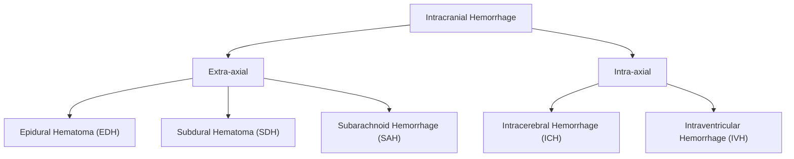

# Intracranial Hemorrhage (ICH)

## 1. Definition

Intracranial hemorrhage (ICH) refers to any bleeding that occurs within the cranial vault. The term literally breaks down as: "intra" = within, "cranial" = skull, "hemorrhage" (Greek: haima = blood, rhegnynai = to burst forth) = bleeding. It encompasses a spectrum of conditions defined by the anatomical compartment in which the blood accumulates.

This is **not** a single disease — it is a family of conditions unified by the common theme of blood where it should not be, each with distinct etiologies, mechanisms, clinical courses, and management strategies.

> **Key conceptual point**: The skull is a rigid, non-expansile box (Monro-Kellie doctrine). Any new volume — whether blood, edema, or CSF — must displace something else (CSF or venous blood), or intracranial pressure (ICP) rises. This is why even a small bleed can be catastrophic.

---

## 2. Epidemiology

### 2.1 Global and Hong Kong Context

- ***Stroke is the 2nd and 3rd leading cause of death in China and Hong Kong respectively*** [1]
- ***Types of stroke*** [1]:
  - ***Ischaemic stroke (75–80%)***
  - ***Haemorrhagic stroke (~20%)***:
    - ***Intracerebral haemorrhage (ICH, ~15%)***
    - ***Subarachnoid haemorrhage (SAH, < 5%)***
- In Hong Kong, the aging population and high prevalence of hypertension make hypertensive ICH particularly common. The Chinese population has a relatively higher proportion of hemorrhagic stroke compared to Western populations (up to 25–30% vs ~15–20%), likely related to higher rates of uncontrolled hypertension and lower use of anticoagulants historically.

### 2.2 Mortality and Prognosis

- ***Mortality in descending order*** [1]:
  - ***SAH: 50% death in 1 month***
  - ***ICH: 40% death in 1 month and 50% at 1 year***
  - ***Cortical infarct: 20% death in 1 month and 35% at 1 year***
  - ***Lacunar infarct: lowest mortality***
- ***Disability: SAH (50% with severe deficits) > cortical infarct > ICH > lacunar infarct*** [1]
- Epidural hematoma (EDH): if recognized and treated surgically early, prognosis is excellent ("the talk and die" lesion — the classic lucid interval means there is a window of opportunity)
- Chronic subdural hematoma (CSDH): generally good prognosis with surgical drainage, but recurrence rate is ~10–20%

### 2.3 Specific Epidemiology

| Type | Incidence | Key Demographics |
|------|-----------|-----------------|
| Spontaneous ICH | 10–30 per 100,000/year | Elderly, males > females, higher in East Asian populations |
| SAH | 6–8 per 100,000/year | Peak age 40–60, ***female > male*** [3], association with connective tissue disorders |
| EDH | 1–4% of head trauma cases | Young adults (peak 20–30), male predominance |
| SDH | Acute: trauma-related; Chronic: 1–5 per 100,000/year | Acute: young trauma; Chronic: elderly, alcoholics, anticoagulated patients |

---

## 3. Risk Factors

### 3.1 Non-modifiable Risk Factors

- ***Old age*** [1]
- ***Male sex*** (except SAH, where females predominate) [1]
- ***Previous vascular event (MI, stroke, PVD)*** [1]
- ***Family history*** [1]
- Race/ethnicity: higher risk in Black and East Asian populations [4]
- Genetic conditions:
  - ***Ehlers-Danlos syndrome, autosomal dominant polycystic kidney disease (ADPKD), Marfan syndrome, fibromuscular dysplasia*** [3] — predispose to cerebral aneurysms and hence SAH
  - Cerebral amyloid angiopathy (CAA) — sporadic or associated with Alzheimer's disease [4]

### 3.2 Modifiable Risk Factors

- ***Hypertension*** — the single most important modifiable risk factor for ICH [1][5]
  - Promotes microaneurysm formation (Charcot-Bouchard aneurysms) in deep perforating arteries
  - ***Hypertension accounts for 50–90% of intracerebral hemorrhage*** [5]
- ***Smoking*** — ***strong dose-response relationship for both ischemic stroke and subarachnoid hemorrhage*** [4]; risk declines after cessation and can be eliminated by 5 years
- ***Alcoholism*** — chronic alcohol abuse causes cerebral atrophy (stretches bridging veins → SDH risk), coagulopathy (liver disease), and directly increases hemorrhage risk [4]
- ***Diabetes mellitus*** [4]
- ***Dyslipidemia*** (weak association with hemorrhagic stroke; paradoxically, very low cholesterol may increase hemorrhagic stroke risk) [4]
- ***Oral contraceptive use*** [4] — especially relevant for cerebral venous sinus thrombosis
- ***Lack of exercise*** [4]
- Anticoagulant/antiplatelet therapy: warfarin-associated ICH carries the highest mortality (~50%)
- ***Drug abuse — cocaine, amphetamines*** [4][5] — cause acute hypertensive surges and vasculitis
- Coagulopathy (iatrogenic or inherited) [5]

---

## 4. Anatomy and Function

Understanding the anatomy is crucial because the clinical features and management of intracranial hemorrhage depend entirely on *where* the blood accumulates.

### 4.1 Meninges and Potential Spaces

The brain is wrapped in three meningeal layers, from outermost to innermost:

1. **Dura mater** (Latin: "tough mother") — thick, fibrous
   - Two layers: **periosteal layer** (adherent to skull inner table) and **meningeal layer**
   - These two layers separate to form the **dural venous sinuses** (e.g., superior sagittal sinus, transverse sinus)
   - The dura forms reflections: **falx cerebri** (between cerebral hemispheres), **tentorium cerebelli** (between cerebrum and cerebellum)
   - The **middle meningeal artery** runs between the periosteal dura and the skull — this is the vessel torn in most EDH

2. **Arachnoid mater** (Greek: "spider-like") — delicate membrane
   - **Bridging veins** traverse from the cortical surface through the subdural space to drain into dural venous sinuses — these are the vessels torn in SDH

3. **Pia mater** (Latin: "tender mother") — intimately adherent to brain surface
   - The **subarachnoid space** (between arachnoid and pia) contains CSF and the major cerebral arteries — this is where blood accumulates in SAH

### 4.2 Potential and Actual Spaces

| Space | Location | Bleeding Source | Resulting Hemorrhage |
|-------|----------|----------------|---------------------|
| Epidural space | Between skull and periosteal dura | ***Middle meningeal artery (85%), transverse sinus (13%)*** [6] | Epidural hematoma (EDH) |
| Subdural space | Between dura and arachnoid | ***Bridging veins*** [6] | Subdural hematoma (SDH) |
| Subarachnoid space | Between arachnoid and pia | ***Berry aneurysm rupture (most common spontaneous cause), AVM*** [3] | Subarachnoid hemorrhage (SAH) |
| Intracerebral (intra-parenchymal) | Within brain parenchyma | Deep perforating arteries (lenticulostriate, thalamoperforating) | Intracerebral hemorrhage (ICH) |
| Intraventricular | Within ventricles | Extension from ICH, or choroid plexus bleed | Intraventricular hemorrhage (IVH) |

### 4.3 Cerebral Vasculature

#### Circle of Willis
The circle of Willis is the anastomotic ring at the base of the brain connecting the anterior and posterior circulations. ***Cerebral aneurysms are commonly found at the Circle of Willis*** [3], specifically at arterial bifurcations where hemodynamic stress is greatest.

- **Anterior circulation** (from internal carotid arteries → ICA):
  - Anterior cerebral artery (ACA) — supplies medial frontal and parietal lobes
  - Middle cerebral artery (MCA) — supplies lateral hemispheres and basal ganglia via ***lenticulostriate arteries***
  - Anterior communicating artery (AComm) — most common site of aneurysm
  
- **Posterior circulation** (from vertebral arteries → basilar artery):
  - Posterior cerebral artery (PCA) — supplies occipital lobe and inferior temporal lobe
  - Posterior communicating artery (PComm) — classical site for aneurysm causing CN III palsy
  - Superior cerebellar artery (SCA), anterior inferior cerebellar artery (AICA), posterior inferior cerebellar artery (PICA)

- ***90% of aneurysms are in the anterior circulation*** [1]

#### Deep Perforating Arteries
These are small end-arteries that supply the basal ganglia, thalamus, internal capsule, and brainstem. They are the vessels most susceptible to hypertensive damage because they branch directly off large high-pressure arteries at nearly right angles, receiving the full force of systemic blood pressure.

- **Lenticulostriate arteries** (from MCA) → supply putamen, caudate, internal capsule
- **Thalamoperforating arteries** (from PCA/PComm) → supply thalamus
- **Pontine perforating arteries** (from basilar) → supply pons

> **Why does hypertension cause ICH specifically in the basal ganglia, thalamus, pons, and cerebellum?** Because these deep perforating arteries are small-caliber vessels that arise at near-right angles from large-caliber parent arteries. They have no gradual tapering and bear the brunt of systemic hypertension directly. Chronic hypertension causes **lipohyalinosis** and **Charcot-Bouchard microaneurysm** formation in these vessels — and when these rupture, you get a deep hemorrhage.

---

## 5. Etiology

### 5.1 Intracerebral Hemorrhage (ICH) — Intraparenchymal

***Etiology (listed by prevalence)*** [2][5]:

1. ***Hypertension (50–90%)*** [5] — the dominant cause
   - Rupture of Charcot-Bouchard microaneurysms in deep perforating arteries
   - ***Common sites: pons, cerebellum, putamen, thalamus*** [2] — all deep structures
   
2. ***Cerebral amyloid angiopathy (CAA)*** [2]
   - Deposition of amyloid-beta (Aβ) in walls of small and medium cortical and leptomeningeal vessels
   - ***Causes lobar ICH — more peripheral*** [2], typically in elderly (> 65)
   - Often recurrent; associated with Alzheimer's disease
   
3. ***Coagulopathy*** [2][5]
   - Anticoagulants (warfarin, DOACs), antiplatelet agents
   - Inherited bleeding disorders (hemophilia, von Willebrand disease)
   - Thrombocytopenia (any cause)
   - Liver disease (synthetic coagulopathy)
   
4. **Structural vascular lesions** [5]:
   - ***AVM*** — congenital abnormal connection between arteries and veins without intervening capillary bed [1]
   - ***Berry aneurysm*** (if ruptures into parenchyma rather than subarachnoid space)
   - ***Tumour*** [5] — hemorrhagic tumors (e.g., glioblastoma, metastatic melanoma, renal cell carcinoma, choriocarcinoma)
   - Cavernous angioma
   
5. ***Drug abuse — cocaine, amphetamines*** [5]
   - Acute hypertensive crisis and/or vasculitis
   
6. Other:
   - Hemorrhagic transformation of ischemic infarct
   - Cerebral venous sinus thrombosis (venous infarction → hemorrhagic conversion)
   - Vasculitis
   - Moyamoya disease

***ICH locations*** [5]:
- ***Putaminal***
- ***Thalamic***
- ***Cerebellum***
- ***Brainstem***
- ***Lobar***
- ***Intraventricular***

### 5.2 Epidural Hematoma (EDH)

***Causes*** [4]:

1. ***Head trauma (most common)*** — RTA, falls, assaults
2. Non-traumatic causes [4]:
   - Infection / epidural abscess
   - Coagulopathy
   - AV malformations
   - Hemorrhagic tumors
   - Neurosurgical procedure complications
   - Hemodialysis (ICP fluctuations, uremic platelet dysfunction, heparin administration)

**Key mechanism**: Temporal bone fracture → tears the **middle meningeal artery** (85% of cases) or dural venous sinuses (13%) [6]

- ***75–90% associated with skull fracture*** [6]
- Because it is arterial bleeding in most cases, the hematoma expands rapidly

### 5.3 Subdural Hematoma (SDH)

***Causes*** [4]:

1. ***Head trauma (most common)*** — but the trauma can be trivial, especially in elderly
2. Non-traumatic causes [4]:
   - Coagulopathy (especially anticoagulant use — very common in elderly)
   - AV malformation
   - Tumors (meningioma, dural metastasis)
   - Neurosurgical procedure complications
   
***Risk factors*** [4]:
- ***Diffuse cerebral atrophy (common in elderly)*** — brain shrinks, bridging veins are stretched and more vulnerable to shearing
- ***Chronic alcoholism*** — cerebral atrophy + coagulopathy from liver disease

**Key mechanism**: Shearing of **bridging veins** that traverse the subdural space from cortical surface to dural venous sinuses [6]. Because venous pressure is low, the bleed is slow — this is why chronic SDH can take weeks to become symptomatic.

### 5.4 Subarachnoid Hemorrhage (SAH)

***Causes*** [3]:

1. ***Commonest cause overall is trauma*** [3]
2. ***Spontaneous (atraumatic) SAH*** [3]:
   - ***Saccular or dissecting aneurysm*** — the most common cause of spontaneous SAH
   - ***"Mycotic" aneurysm*** — infected emboli (e.g., from infective endocarditis) lodge in arterial walls, weaken them, and form aneurysms
   - ***Vascular malformation*** (AVM, dural AV fistula)
   - ***Cocaine*** use [3]
   - Perimesencephalic non-aneurysmal SAH (~15% of spontaneous SAH — benign, venous origin)

<Callout title="Clinical Pearl" type="error">
***If no history of trauma, SAH is aneurysmal in origin until proven otherwise*** [3]. Always be wary of the patient who presents with "headache then loss of consciousness then fall and head injury" — the SAH came first, then the LOC caused the fall. ***Ask: "Headache before or after LOC?"*** [3]
</Callout>

***Cerebral aneurysm*** [3]:
- ***Commonly Circle of Willis*** [3]
- ***Predisposing factors*** [3]:
  - ***Smoking***
  - ***Hypertension***
  - ***Age > 40***
  - ***Family history***
  - ***Female sex***
  - ***Connective tissue disorders: Ehlers-Danlos syndrome, AD polycystic kidney disease, Marfan syndrome, fibromuscular dysplasia***
- ***Can be forever asymptomatic*** [3]
- ***Unpredictable spontaneous rupture*** [3]
- ***Found in 2–5% of adult population but only 6–8 per 100,000 per year rupture*** [1]
- ***Site: usually at arterial bifurcations, majority along Circle of Willis, 90% anterior circulation*** [1]

---

## 6. Pathophysiology

### 6.1 General Principles — The Monro-Kellie Doctrine

***The skull is a rigid structure with constant volume*** [1]:
- ***Content of skull = brain (80%) + blood (10%) + CSF (10%)*** [1]
- ***Any increase in any constituent must be compensated by decrease in others*** [1]:
  - ***CSF outflow → decreased CSF volume (slow compensation)*** [1]
  - ***Venous outflow → decreased blood volume (quick compensation)*** [1]
- ***When compensatory mechanisms are overwhelmed → raised ICP*** [1]

The intracranial pressure-volume curve is exponential, not linear. Initially, as a hematoma expands, ICP changes very little (CSF and venous blood are displaced). But once these buffers are exhausted, even a small additional volume causes a dramatic rise in ICP — this is the point of decompensation, and it is why patients can deteriorate very suddenly ("the straw that breaks the camel's back").

### 6.2 Pathophysiology by Type

#### 6.2.1 Intracerebral Hemorrhage (ICH)

**Primary injury** [1]:
- ***Acute bleeding → blood dissects between neurons → immediate function loss*** [1]
- The hematoma directly destroys brain parenchyma and disrupts neural circuits

**Secondary injury** [1]:
- ***Expanding hematoma ± associated cerebral edema → raised ICP ± death*** [1]
- Hematoma expansion occurs in ~33% of patients within the first few hours (especially in the first 3–6 hours) — this is why acute BP control is critical
- **Perihematomal edema**: develops around the clot due to:
  - **Vasogenic edema**: breakdown of blood-brain barrier (BBB) by thrombin, complement, and hemoglobin degradation products
  - **Cytotoxic edema**: direct toxic effects of blood products on neurons (iron, free radicals from hemoglobin breakdown)
  - Inflammatory cascade: microglia activation, leukocyte infiltration
- **Mass effect**: the hematoma acts as a space-occupying lesion → midline shift → brain herniation
- **Intraventricular extension (IVH)**: deep hemorrhages (thalamic, caudate) can rupture into the ventricular system → acute obstructive hydrocephalus
- **Hydrocephalus**: can result from IVH blocking CSF flow (especially at the aqueduct of Sylvius or 4th ventricle outlets)

> **Why does hypertensive ICH preferentially affect the putamen?** The lenticulostriate arteries (branches of MCA) supply the putamen and are classic "end-arteries" that branch at near-right angles from a large trunk. They undergo lipohyalinosis and develop Charcot-Bouchard microaneurysms under chronic hypertension. When these rupture, you get a putaminal hemorrhage — the single most common location for hypertensive ICH.

#### 6.2.2 Cerebral Amyloid Angiopathy (CAA)

- Amyloid-beta protein (the same protein found in Alzheimer's disease plaques) deposits in the media and adventitia of small and medium-sized cortical and leptomeningeal arteries
- This causes vessel wall weakening, fibrinoid necrosis, and microaneurysm formation
- ***Results in lobar hemorrhage — more peripheral/cortical*** [2]
- Tends to be recurrent and multifocal
- Characteristically spares the deep structures (unlike hypertensive ICH)

#### 6.2.3 Epidural Hematoma (EDH)

- Trauma → skull fracture (especially temporal bone) → tears **middle meningeal artery**
- ***Arterial bleeding*** → rapid accumulation of blood in the epidural space (between skull and periosteal dura)
- The dura is normally tightly adherent to the inner table of the skull at the suture lines → ***EDH does not cross suture lines*** [6] because the dura is anchored at these points
- However, ***EDH can cross the midline*** [6] (unlike SDH) because there is no dural barrier at the vertex
- Shape: ***lentiform (biconvex)*** [6] — the arterial pressure strips the dura from the skull in a lens shape, but the sutures limit lateral spread

**Classic clinical course ("talk and die"):**
1. Initial concussion → brief LOC
2. **Lucid interval** (minutes to hours) — patient is awake and alert as the hematoma slowly expands
3. Rapid deterioration as ICP decompensates → uncal herniation → ipsilateral CN III palsy (dilated pupil) → contralateral hemiparesis → death if untreated

> ***EDH = rapid deterioration*** [6]. This is a neurosurgical emergency. The lucid interval gives a false sense of security.

#### 6.2.4 Subdural Hematoma (SDH)

- Shearing forces → tear **bridging veins** (low-pressure venous bleeding)
- Blood accumulates between dura and arachnoid
- ***SDH crosses suture lines*** [6] (because the arachnoid is not adherent to sutures) but ***does not cross the midline*** [6] (limited by the falx cerebri — a dural reflection)
- Shape: ***crescentic*** [6] — conforms to the brain surface

**Temporal classification** [4][6]:
| Type | Timeframe | CT Appearance | Pathophysiology |
|------|-----------|---------------|-----------------|
| ***Acute SDH*** | ***< 1 week*** | ***Hyperdense*** | Fresh blood, high protein/Hb content |
| ***Subacute SDH*** | ***1–3 weeks*** | ***Isodense*** (hard to see!) | Gradual degradation of Hb products |
| ***Chronic SDH*** | ***> 3 weeks*** | ***Hypodense*** (~CSF density) | Liquefied blood products, encapsulated by neomembranes |
| Acute-on-chronic SDH | Variable | Mixed density | Recurrent small bleeds into a chronic collection |

**Pathophysiology of Chronic SDH** [4]:
- Initial bleed → inflammatory response → formation of neomembranes (granulation tissue) around the hematoma
- These neomembranes are fragile and highly vascularized → susceptible to re-bleeding
- Osmotic gradient: blood products attract fluid → gradual hematoma expansion even without new bleeding
- This is why chronic SDH can present weeks to months after a trivial or even unrecalled injury

<Callout title="Exam Pearl">
***Subacute SDH (1–3 weeks) is isodense on CT and therefore the hardest to visualize*** [6]. If you suspect SDH clinically but the CT looks "normal," consider: (1) doing the CT early after injury, (2) contrast CT (enhancement of neomembranes), or (3) MRI (much more sensitive for isodense SDH).
</Callout>

#### 6.2.5 Subarachnoid Hemorrhage (SAH)

- Rupture of a saccular (berry) aneurysm → blood under arterial pressure floods the subarachnoid space
- The subarachnoid space is a communicating compartment → blood spreads diffusely → irritates meninges (meningismus) and bathes the entire brain surface

**Pathophysiological cascade after SAH:**

1. **Acute phase (minutes–hours)**:
   - Sudden rise in ICP (blood fills subarachnoid space → reduces CSF buffer)
   - Transient global cerebral ischemia (ICP may briefly equal arterial pressure → loss of consciousness)
   - Re-bleeding risk is highest in first 24 hours (~4% on day 1, ~1.5%/day for next 2 weeks)

2. **Early brain injury (hours–days)**:
   - Blood products (oxyhemoglobin, bilirubin) are directly neurotoxic
   - Inflammation: blood in CSF triggers massive inflammatory response
   - Cortical spreading depolarization → neuronal injury

3. **Vasospasm / Delayed cerebral ischemia (DCI) (days 4–14)**:
   - The most feared complication — blood breakdown products (particularly oxyhemoglobin) cause prolonged smooth muscle contraction in cerebral arteries
   - Peak incidence day 7–10 post-SAH
   - Can cause delayed ischemic neurological deficits (DIND) — essentially a secondary stroke
   - This is why nimodipine (a calcium channel blocker) is given prophylactically

4. **Hydrocephalus**:
   - Acute: blood clots obstruct CSF pathways (especially 4th ventricle outlets) → obstructive hydrocephalus
   - Chronic (weeks–months): blood products impair CSF reabsorption at arachnoid granulations → communicating hydrocephalus

5. **Systemic complications**: catecholamine surge → neurogenic pulmonary edema, Takotsubo cardiomyopathy, cardiac arrhythmias

#### 6.2.6 Intraventricular Hemorrhage (IVH)

- Usually secondary to extension of a deep ICH (thalamic or caudate hemorrhage) or SAH into the ventricular system
- Primary IVH (rare) can arise from choroid plexus AVM or vascular tumors
- Blood within ventricles → obstructs CSF flow → acute hydrocephalus
- Blood clots at the foramina of Monro, aqueduct of Sylvius, or 4th ventricle outlets
- IVH is an independent predictor of poor outcome in ICH

### 6.3 Brain Herniation — The Final Common Pathway

When ICP rises focally or globally, pressure gradients develop across dural reflections, pushing brain tissue from high-pressure to low-pressure compartments:

| Herniation Type | Mechanism | Clinical Features |
|----------------|-----------|-------------------|
| **Uncal (transtentorial)** | Medial temporal lobe (uncus) herniates over tentorium → compresses CN III and cerebral peduncle | Ipsilateral fixed dilated pupil (CN III compression), contralateral hemiparesis (cerebral peduncle compression), ↓ consciousness (brainstem compression) |
| **Subfalcine (cingulate)** | Cingulate gyrus herniates under falx cerebri | Contralateral leg weakness (ACA compression), may progress to bilateral ACA territory infarction |
| **Tonsillar (cerebellar)** | Cerebellar tonsils herniate through foramen magnum → compress medulla | Cardiorespiratory arrest (compression of vital brainstem centers) — rapidly fatal |
| **Upward (ascending transtentorial)** | Posterior fossa mass pushes cerebellum upward through tentorial notch | Miosis, conjugate downward gaze, ↓ consciousness |

---

## 7. Classification

### 7.1 By Anatomical Location

- **Extra-axial**: bleeding outside the brain parenchyma but within the skull (EDH, SDH, SAH)
- **Intra-axial**: bleeding within the brain parenchyma itself (ICH, IVH)

### 7.2 By Etiology

| Category | Examples |
|----------|---------|
| **Traumatic** | EDH, acute SDH, traumatic SAH, contusional hemorrhage |
| **Spontaneous (non-traumatic)** | Hypertensive ICH, aneurysmal SAH, CAA-related lobar ICH, AVM hemorrhage |
| **Secondary** | Hemorrhagic transformation of ischemic infarct, tumor-related, coagulopathy-related |

### 7.3 SDH Classification by Chronicity [4]

| Type | Timeframe | CT Density | Key Features |
|------|-----------|-----------|--------------|
| ***Acute*** | ***< 1 week*** | ***Hyperdense*** | Fresh blood, often severe trauma |
| ***Subacute*** | ***1–3 weeks*** | ***Isodense*** | Can be missed on CT! |
| ***Chronic*** | ***> 3 weeks*** | ***Hypodense*** | Neomembrane formation, may be bilateral |
| Acute-on-chronic | Variable | Mixed | Re-bleed into chronic collection |

### 7.4 ICH Classification by Location [5]

| Location | Typical Etiology | Percentage |
|----------|-----------------|------------|
| ***Putaminal*** | Hypertensive | ~35% |
| ***Thalamic*** | Hypertensive | ~20% |
| ***Lobar*** | CAA, AVM, tumor | ~25% |
| ***Cerebellar*** | Hypertensive | ~10% |
| ***Brainstem (pontine)*** | Hypertensive | ~5–10% |
| ***Intraventricular*** | Extension from deep ICH | Variable |

### 7.5 Spetzler-Martin Grading of AVM [1]

This grading system predicts surgical outcome for AVM:
- **Size**: < 3 cm = 1, 3–6 cm = 2, > 6 cm = 3
- **Eloquence of adjacent brain**: eloquent = 1, non-eloquent = 0
- **Venous drainage**: deep = 1, superficial only = 0
- **Total score: 1–5** (lower grades → better surgical outcome)

---

## 8. Clinical Features

### 8.1 General Principles

The clinical presentation depends on:
1. **Location** of the hemorrhage (which structures are damaged)
2. **Volume** of bleeding (determines mass effect and ICP rise)
3. **Speed of bleeding** (arterial = rapid deterioration; venous = more insidious)
4. **Underlying condition** of the patient (age, comorbidities, anticoagulation status)

### 8.2 Intracerebral Hemorrhage (ICH)

#### Symptoms

| Symptom | Pathophysiological Basis |
|---------|------------------------|
| **Sudden severe headache** | Acute stretching of meninges and raised ICP from expanding hematoma |
| **Progressive focal neurological deficit** | Blood dissects between neurons, directly destroying tissue; unlike ischemic stroke which reaches maximum deficit at onset, ICH typically *worsens over minutes to hours* as the hematoma expands |
| **Nausea and vomiting** | Raised ICP stimulates the vomiting center in the area postrema of the medulla (floor of 4th ventricle) |
| **Decreased level of consciousness** | Raised ICP → reduced cerebral perfusion; or direct brainstem compression from herniation |
| **Seizures** | Blood products (particularly iron and glutamate) are epileptogenic; cortical irritation from blood. More common in lobar hemorrhage (cortical location) than deep hemorrhage |

#### Symptoms and Signs by Location

**a) ***Putaminal hemorrhage*** (most common hypertensive ICH location):**
- **Contralateral hemiparesis/hemiplegia** — hematoma compresses or destroys the adjacent internal capsule (posterior limb carries the corticospinal tract)
- **Contralateral hemisensory loss** — involvement of thalamocortical sensory fibers in internal capsule
- **Contralateral homonymous hemianopia** — involvement of optic radiation fibers in internal capsule
- **Conjugate eye deviation TOWARD the lesion** ("eyes look at the lesion") — destruction of ipsilateral frontal eye field (FEF) removes the drive for contralateral gaze, so the intact contralateral FEF pushes the eyes toward the damaged side
- **Global aphasia** if dominant hemisphere (usually left) is affected

**b) ***Thalamic hemorrhage***:**
- **Contralateral hemisensory loss** (prominent) — thalamus is the sensory relay station
- **Contralateral hemiparesis** — compression of adjacent internal capsule
- **Characteristic eye findings**: eyes deviate *downward and inward* ("peering at the nose") — this is because the hemorrhage affects the dorsal midbrain/pretectal area near the thalamus, disrupting the vertical gaze center
- **Small reactive pupils** — disruption of sympathetic fibers near the hypothalamus/thalamus
- **Thalamic pain syndrome** (later) — Dejerine-Roussy syndrome: severe, burning contralateral pain due to thalamic sensory pathway damage

**c) ***Cerebellar hemorrhage***:**

<Callout title="Surgical Emergency" type="error">
Cerebellar hemorrhage is a neurosurgical emergency because the posterior fossa is a small, tight compartment. Even a moderate-sized hemorrhage can rapidly compress the brainstem (causing respiratory arrest) or obstruct the 4th ventricle (causing acute hydrocephalus).
</Callout>

- **Sudden onset severe occipital headache** — posterior fossa meningeal irritation
- **Vertigo, nausea, vomiting** (often intractable) — direct involvement of vestibular connections in cerebellum/brainstem
- **Truncal ataxia** — cerebellar vermis involvement → inability to sit or stand
- **Ipsilateral limb ataxia** — cerebellar hemisphere involvement
- **Dysarthria** — cerebellar speech
- **Neck stiffness** — tonsillar herniation threatens foramen magnum; also meningeal irritation
- **Ipsilateral gaze palsy / CN VI palsy** — compression of pontine structures
- **Progressive obtundation → coma** — brainstem compression (herniation)
- Characteristically: **NO hemiplegia** in pure cerebellar hemorrhage (motor pathways are infratentorial, not yet crossed at this level; only if brainstem compressed)

**d) ***Pontine (brainstem) hemorrhage***:**
- Carries the worst prognosis of all ICH locations
- **Quadriplegia** — bilateral corticospinal tract destruction
- **Bilateral pinpoint pupils** — destruction of sympathetic descending fibers in pons (parasympathetic input to the pupil is unopposed; also, the pontine reticular formation normally contributes to pupil dilation)
- **Coma** — direct destruction of pontine reticular activating system
- **Abnormal respiratory patterns** — disruption of pontine respiratory centers
- **Hyperthermia** — disruption of hypothalamic thermoregulatory pathways or direct midbrain injury
- **Decerebrate posturing** — bilateral damage above the vestibulospinal nucleus level
- "Locked-in syndrome" if ventral pons is affected (sparing the tegmentum) — patient is conscious but can only communicate via vertical eye movements and blinking

**e) ***Lobar hemorrhage***:**
- Clinical features depend on the specific lobe involved:
  - **Frontal**: contralateral hemiparesis (face/arm > leg), personality changes, expressive aphasia (if dominant)
  - **Parietal**: contralateral hemisensory loss, neglect (non-dominant), receptive aphasia (dominant)
  - **Temporal**: receptive/Wernicke's aphasia (dominant), superior quadrantanopia ("pie in the sky"), memory deficits
  - **Occipital**: contralateral homonymous hemianopia with macular sparing
- Seizures are MORE common in lobar ICH than deep ICH (closer to cortex)
- ***Lobar ICH → commonly due to AVM*** [6] or CAA (elderly)

#### Signs

| Sign | Pathophysiological Basis |
|------|------------------------|
| **Elevated blood pressure** | Often the cause of the hemorrhage; also a Cushing response to raised ICP (hypertension + bradycardia + irregular respirations) |
| **Cushing triad** (late sign) | Brainstem compression → ischemia of vasomotor center → massive sympathetic discharge (hypertension) → baroreceptor-mediated reflex bradycardia → irregular respirations from medullary compression |
| **Focal neurological deficits** | Depend on location (see above) |
| **Papilloedema** (may be absent acutely) | Raised ICP transmitted along optic nerve sheath → impedes axoplasmic flow at the optic disc → axonal swelling |
| **Meningism** (if blood reaches subarachnoid space) | Blood in subarachnoid space irritates meninges → neck stiffness, Kernig's and Brudzinski's signs |
| **CN III palsy (ipsilateral fixed dilated pupil)** | Uncal herniation compresses CN III against the tentorium; parasympathetic fibers run on the outside of CN III and are compressed first → loss of pupillary constriction |

### 8.3 Epidural Hematoma (EDH)

#### Symptoms

| Symptom | Pathophysiological Basis |
|---------|------------------------|
| **History of head trauma** (usually significant) | Required to fracture the temporal bone and tear the middle meningeal artery |
| **Initial loss of consciousness** | Concussive impact to brain at time of injury |
| ***"Lucid interval"*** | After the initial concussion resolves, the patient may be fully alert. During this time, the arterial hematoma is still small and compensated by CSF/venous displacement |
| **Rapid secondary deterioration** | Hematoma expansion overwhelms compensatory mechanisms → acute rise in ICP |
| **Severe headache** (progressive) | Expanding hematoma stretches the dura, which is richly innervated |
| **Nausea, vomiting** | Raised ICP |

#### Signs

| Sign | Pathophysiological Basis |
|------|------------------------|
| **Ipsilateral fixed dilated pupil** | Uncal herniation → CN III compression. The parasympathetic fibers (Edinger-Westphal nucleus fibers) travel on the *outside* of CN III, so they are compressed first → pupil dilation (mydriasis) |
| **Contralateral hemiparesis** | Uncal herniation compresses ipsilateral cerebral peduncle (corticospinal tract) |
| ***Ipsilateral hemiparesis*** (Kernohan's notch phenomenon) | Sometimes the contralateral cerebral peduncle is pushed against the opposite tentorial edge → "false localizing sign" — ipsilateral hemiparesis |
| **Progressive GCS decline** | Brainstem compression from expanding hematoma and herniation |
| **Skull fracture (overlying temporal region)** | Source of bleeding; ***90% associated with skull fracture*** [6] |
| **Cushing reflex** (late) | Brainstem ischemia from herniation |

<Callout title="The 'Talk and Die' Patient">
The classic EDH patient is a young adult involved in an RTA who initially seems fine (lucid interval) but then rapidly deteriorates. This is a TIME-CRITICAL emergency — delay in surgical evacuation is fatal. Any patient with head trauma who deteriorates after a lucid interval must be suspected of having an EDH until proven otherwise.
</Callout>

### 8.4 Subdural Hematoma (SDH)

#### Acute SDH

| Feature | Pathophysiological Basis |
|---------|------------------------|
| **History of significant head trauma** | Acceleration-deceleration forces shear bridging veins |
| **Progressive headache** | Expanding hematoma compresses brain and stretches dura |
| **Fluctuating or declining consciousness** | Mass effect → raised ICP → cerebral hypoperfusion |
| **Focal neurological deficits** (hemiparesis, aphasia) | Compression of underlying cortex |
| **Pupil changes** | Uncal herniation if severe |

- Acute SDH often accompanies severe underlying brain injury (unlike EDH where the brain itself may be relatively spared). This is why acute SDH prognosis is generally worse than EDH.

#### Chronic SDH

| Feature | Pathophysiological Basis |
|---------|------------------------|
| **Insidious onset headache** (weeks–months) | Gradually enlarging collection compresses brain |
| **Cognitive decline / confusion** | Bilateral cortical compression; mimics dementia |
| **Fluctuating consciousness** | Intermittent rises in ICP as the hematoma waxes and wanes |
| **Gait disturbance** | Cortical leg area compression (parasagittal) or general raised ICP |
| **Mild hemiparesis** | Compression of motor cortex |
| **Personality changes** | Frontal lobe compression |
| **May present WITHOUT clear history of trauma** | Trivial or forgotten trauma in elderly with cerebral atrophy |

<Callout title="DDx Alert" type="error">
Chronic SDH in the elderly is a great mimicker — it can present as dementia, stroke, or even as a "funny turn." Always consider chronic SDH in an elderly patient with progressive cognitive decline, especially if on anticoagulants or with history of falls. A CT brain will settle the diagnosis.
</Callout>

### 8.5 Subarachnoid Hemorrhage (SAH)

#### Symptoms

| Symptom | Pathophysiological Basis |
|---------|------------------------|
| ***"Thunderclap headache"*** — sudden onset, maximal intensity at onset, "worst headache of my life" | Arterial blood under pressure ruptures into subarachnoid space → sudden meningeal irritation and acute ICP rise |
| **Loss of consciousness** (at onset, ~50%) | Sudden ICP spike → transient global cerebral ischemia (ICP transiently approaches MAP → cerebral perfusion drops to near zero) |
| **Nausea, vomiting** | Raised ICP stimulating area postrema; also meningeal irritation |
| **Photophobia** | Meningeal inflammation → irritation of trigeminal nerve fibers in the meninges, which also innervate the eye |
| **"Sentinel headache"** (days–weeks before major SAH) | Minor warning leak from the aneurysm — occurs in ~30–50% of cases. MUST be taken seriously — it is a warning of impending catastrophic rupture |
| **Seizures** | Blood products irritate the cortex; acute ICP rise |
| **Visual disturbance** | CN III palsy from PComm aneurysm; or raised ICP causing CN VI palsy |

#### Signs

| Sign | Pathophysiological Basis |
|------|------------------------|
| **Neck stiffness (meningism)** | Blood in subarachnoid space irritates the meninges around the cervical spinal cord. Takes 3–12 hours to develop (not immediate) |
| **Kernig's sign** (inability to extend knee when hip flexed) | Meningeal irritation → protective spasm of hamstrings |
| **Brudzinski's sign** (neck flexion causes hip/knee flexion) | Meningeal irritation → reflexive flexion to reduce meningeal stretch |
| **Subhyaloid (preretinal) hemorrhages** | Sudden rise in ICP → impedes venous return from the eye → rupture of retinal veins → blood trapped between retina and vitreous (Terson syndrome) |
| ***Surgical CN III palsy (pupil-involving, non-pupil-sparing)*** | ***Classical for posterior communicating artery aneurysm*** [1] — the expanding aneurysm compresses CN III from below and laterally. Parasympathetic fibers on the outside of the nerve are affected first → dilated, fixed pupil + ptosis + "down and out" eye |
| **Focal neurological deficits** (may be absent initially) | May develop later due to vasospasm/delayed cerebral ischemia, or from direct compression by the aneurysm |
| **Altered consciousness** (variable) | From transient LOC to deep coma, depending on severity of initial bleed |
| **Hypertension, tachycardia** | Catecholamine surge (sympathetic activation from hypothalamic irritation by blood) |
| **Fever** | Central fever from blood in subarachnoid space irritating the hypothalamus; or infection |
| **ECG changes** (diffuse T-wave inversion, prolonged QTc, ST changes) | Massive catecholamine release → myocardial injury (catecholamine-induced cardiomyopathy / Takotsubo syndrome) |

<Callout title="High Yield - CN III Palsy Localization">
- **"Surgical" CN III palsy** = pupil-involving (dilated, fixed pupil + ptosis + "down and out") → suggests compression (e.g., PComm aneurysm, uncal herniation)
- **"Medical" CN III palsy** = pupil-sparing → suggests ischemic/microvascular damage (e.g., diabetic CN III palsy) — because ischemia affects the interior of the nerve (motor fibers) while sparing the peripherally located parasympathetic fibers
</Callout>

### 8.6 How to Distinguish ICH Types Clinically

| Feature | EDH | Acute SDH | Chronic SDH | SAH | Spontaneous ICH |
|---------|-----|-----------|-------------|-----|-----------------|
| **Onset** | Rapid after trauma | Rapid after trauma | Insidious over weeks | Thunderclap | Sudden, often during activity |
| **Lucid interval** | Classic (but not always present) | Less common | N/A | May have brief LOC then recovery | Uncommon |
| **Headache** | Progressive | Severe | Mild/chronic | "Worst ever" | Moderate to severe |
| **Meningism** | Usually absent | Usually absent | Absent | Present (after 3–12 h) | Only if blood reaches SAH space |
| **Focal deficits** | Late (from herniation) | Early (underlying brain injury) | Late, mild | May be absent initially | Early, progressive |
| **CT appearance** | Lentiform, hyperdense | Crescentic, hyperdense | Crescentic, hypodense | Hyperdense blood in sulci/cisterns | Hyperdense parenchymal mass |
| **Skull fracture** | ~90% | Usually absent | Usually absent | Usually absent | Absent |

---

## 9. Relevant Associations and Special Considerations

### 9.1 Anticoagulant-Related ICH
- Warfarin-associated ICH: 7–10x higher risk than general population; hematoma expansion is more prolonged and prognosis is worse
- DOAC-associated ICH: lower risk than warfarin but still significant; specific reversal agents now available (idarucizumab for dabigatran, andexanet alfa for factor Xa inhibitors)
- **Reversal of anticoagulation is critical and time-sensitive** in all anticoagulant-associated ICH

### 9.2 Hemorrhagic Transformation of Ischemic Stroke
- Occurs when ischemic brain tissue (with damaged BBB) is reperfused → blood leaks through damaged vessels
- More common after thrombolysis (tPA) or large territory infarcts
- Types: petechial (usually asymptomatic) vs. parenchymal hematoma (clinically significant)

### 9.3 Cerebral Venous Sinus Thrombosis (CVST) [2]
- ***Epidemiology: F > M — pregnancy, use of COC*** [2]
- ***1% of stroke*** [2]
- Can cause venous infarction → hemorrhagic transformation (venous hemorrhagic infarct)
- ***Clinical features require high index of suspicion*** [2]:
  - ***Cerebral venous sinus thrombosis (90%): raised ICP (headache, papilledema, ↓GCS), seizure, focal neurological deficit*** [2]
  - ***Cavernous sinus thrombosis: proptosis, painful ophthalmoplegia, CN 3, 4, 6, V1 involvement*** [2]
- ***Investigations: MRI brain + MR venogram for filling defect; empty delta sign (superior sagittal sinus involvement)*** [2]
- ***Management: anticoagulation LMWH (acute) → warfarin or dabigatran for 3 months*** [2]

### 9.4 Neonatal Intracranial Hemorrhage
- Germinal matrix hemorrhage (GMH) in premature infants — fragile periventricular vasculature susceptible to fluctuations in cerebral blood flow
- Graded I–IV (from isolated GMH to GMH with IVH and parenchymal involvement)
- ***In hemophilia: increased risk of cephalhaematoma and ICH during delivery; avoid head trauma + brain imaging ≤ 24h of life*** [7]

---

<Callout title="High Yield Summary">

**Definition**: Intracranial hemorrhage = any bleeding within the cranial vault, classified by compartment (epidural, subdural, subarachnoid, intracerebral, intraventricular).

**Epidemiology**: Hemorrhagic stroke accounts for ~20% of all strokes. ICH has 40% mortality at 1 month. SAH has 50% mortality at 1 month.

**Key Risk Factors**: ***Hypertension (50–90% of ICH)***, cerebral amyloid angiopathy, anticoagulation, cocaine/amphetamines, vascular malformations, aneurysms.

**Core Anatomy**: Monro-Kellie doctrine — skull is rigid, any volume increase must be compensated. EDH = middle meningeal artery (arterial, lentiform, does not cross sutures). SDH = bridging veins (venous, crescentic, crosses sutures, not midline). SAH = berry aneurysm rupture at Circle of Willis (90% anterior circulation).

**Clinical Patterns**:
- **EDH**: trauma → lucid interval → rapid deterioration. Surgical emergency.
- **Acute SDH**: severe head injury, worse prognosis than EDH due to underlying brain injury
- **Chronic SDH**: elderly, insidious cognitive decline, mimics dementia
- **SAH**: thunderclap headache, meningism, CN III palsy (PComm), sentinel headache
- **Hypertensive ICH**: putamen (most common), thalamus, pons, cerebellum. Focal deficits based on location.
- **CAA**: lobar (peripheral) hemorrhage in elderly, recurrent
- **Cerebellar hemorrhage**: surgical emergency — risk of brainstem compression and acute hydrocephalus

**CT Appearance of Blood**: Acute = hyperdense, Subacute = isodense, Chronic = hypodense. EDH = lentiform. SDH = crescentic.

</Callout>

---

<ActiveRecallQuiz
  title="Active Recall - Intracranial Hemorrhage: Definition, Epidemiology, Etiology, Pathophysiology, Classification, and Clinical Features"
  items={[
    {
      question: "A 70-year-old man on warfarin presents with progressive confusion over 3 weeks. CT shows a crescentic hypodense extra-axial collection crossing suture lines but not crossing midline. What is the diagnosis, and why does it cross sutures but not midline?",
      markscheme: "Chronic subdural hematoma (SDH). Crescentic shape, hypodense (> 3 weeks old). Crosses sutures because the arachnoid is not adherent to sutures. Does not cross midline because it is limited by the falx cerebri, a dural reflection. Risk factors: elderly (cerebral atrophy stretching bridging veins), anticoagulation (warfarin)."
    },
    {
      question: "Why does hypertensive intracerebral hemorrhage preferentially occur in the putamen, thalamus, pons, and cerebellum rather than in lobar regions?",
      markscheme: "These structures are supplied by small deep perforating arteries (lenticulostriate, thalamoperforating, pontine perforating) that branch at near-right angles from large parent arteries. They receive the full force of systemic blood pressure. Chronic hypertension causes lipohyalinosis and Charcot-Bouchard microaneurysm formation in these vessels, which then rupture. Lobar hemorrhages are more commonly due to cerebral amyloid angiopathy or vascular malformations."
    },
    {
      question: "Explain the pathophysiological basis of the 'lucid interval' in epidural hematoma and why the patient subsequently deteriorates rapidly.",
      markscheme: "Initial LOC is from concussive brain injury at impact. The lucid interval represents the period where the expanding arterial hematoma is still small enough to be compensated by CSF displacement and venous outflow (Monro-Kellie doctrine). Once these compensatory mechanisms are exhausted, the exponential ICP-volume curve means even a small additional volume causes massive ICP rise, leading to uncal herniation (ipsilateral dilated pupil, contralateral hemiparesis), brainstem compression, and death."
    },
    {
      question: "A patient presents with sudden thunderclap headache and is found to have a dilated right pupil with ptosis and 'down and out' eye position. Which aneurysm is most likely responsible, and why does it affect the pupil?",
      markscheme: "Right posterior communicating artery (PComm) aneurysm causing a 'surgical' CN III palsy. The aneurysm compresses CN III from below/laterally. Parasympathetic fibers (from Edinger-Westphal nucleus) travel on the outside of CN III and are compressed first, causing pupil dilation (mydriasis). This distinguishes it from a 'medical' (ischemic) CN III palsy where the pupil is spared because ischemia affects internal motor fibers while sparing peripheral parasympathetic fibers."
    },
    {
      question: "List the CT attenuation changes of blood over time and explain why subacute subdural hematoma is the most difficult to diagnose on non-contrast CT.",
      markscheme: "Acute blood: hyperdense (high protein/Hb content). Subacute (1-3 weeks): isodense (Hb degradation products gradually approach brain parenchyma density). Chronic (> 3 weeks): hypodense (liquefied blood products, near CSF density). Subacute SDH is isodense relative to brain parenchyma, making it nearly invisible on NCCT. Consider contrast CT (enhancing neomembranes) or MRI for diagnosis."
    },
    {
      question: "What is the Monro-Kellie doctrine and how does it explain the clinical course of intracranial hemorrhage?",
      markscheme: "The skull is a rigid, non-expansile structure with fixed total volume. Contents: brain (80%), blood (10%), CSF (10%). Any increase in one component must be compensated by decrease in others (CSF outflow, venous blood displacement). Once compensatory mechanisms are exhausted, even small additional volume causes exponential ICP rise. This explains why patients can appear stable initially (during compensation) then deteriorate suddenly (decompensation point on the pressure-volume curve)."
    }
  ]}
/>

## References

[1] Senior notes: Ryan Ho Neurology.pdf (Section 3.2 Cerebrovascular Diseases, Section 8.1 Raised Intracranial Pressure, Section 11.4 Secondary Brain Injury)
[2] Senior notes: maxim.md (Intracerebral haemorrhage, Cerebral venous thrombosis sections)
[3] Lecture slides: GC 109. Headache and loss of consciousness Acute stroke, subarachnoid haemorrhage and vascular malformation.pdf (p14, p27–28)
[4] Senior notes: felixlai.md (Epidural/Subdural/Subarachnoid hemorrhage sections; Stroke risk factors and etiology)
[5] Lecture slides: Cererbrovascular disease.pdf (p5–6)
[6] Senior notes: Ryan Ho Diagnostic Radiology.pdf (p41–42); Senior notes: Ryan Ho Radiology.pdf (p19)
[7] Senior notes: Ryan Ho Haemtology.pdf (p124, Haemophilia section)
