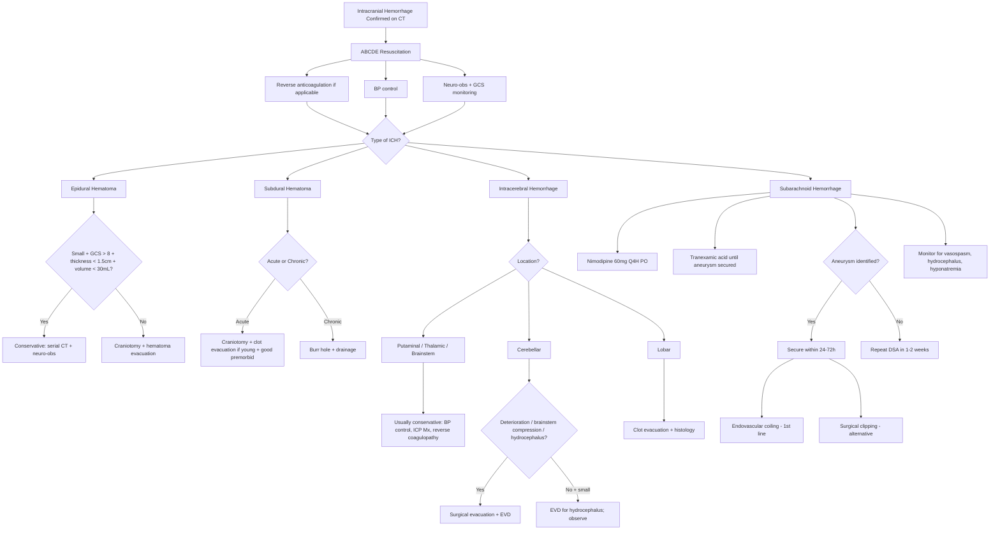
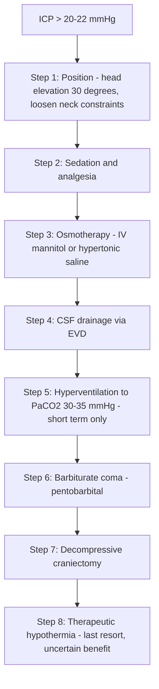

## Management of Intracranial Hemorrhage

### A. Overarching Principles

Before diving into specific management for each type, let's establish the fundamental philosophy. The lecture slides state it perfectly:

> ***The Fundamentals: Protect uninjured brain. Salvage injured brain. Treat underlying cause. ALWAYS resuscitate first. Clinical/ICP monitoring. Control ICP and maintain cerebral perfusion. Neuroprotective therapies.*** [16]

Think of it this way: in intracranial hemorrhage, the **primary injury** (the hemorrhage itself) has already happened — you cannot undo it. Your entire management strategy is aimed at **preventing secondary injury** — the cascade of events (hematoma expansion, cerebral edema, raised ICP, herniation, ischemia, rebleeding, vasospasm) that turns a survivable bleed into a fatal one.

The management framework for ALL types of intracranial hemorrhage shares common elements:

1. **ABC resuscitation** — always first
2. **Stop the bleeding** — reverse coagulopathy, control BP, secure aneurysm
3. **Control ICP** — medical and surgical
4. **Prevent complications** — rebleeding, vasospasm, hydrocephalus, seizures, DVT, infections
5. **Rehabilitation** — early and multidisciplinary

> ***Corticosteroids are NOT indicated and should be avoided following head injury since they are associated with increased acute mortality*** [2][13] — This was definitively shown in the CRASH trial.

<Callout title="Do NOT List (Head Injury / ICH)" type="error">

***Do NOT:*** [1][13]
1. ***Give mannitol if shocked*** (it is an osmotic diuretic — will worsen hypotension)
2. ***Blindly hyperventilate*** (PaCO2 30–35 mmHg causes vasoconstriction → may exacerbate ischemia)
3. ***Use barbiturate/propofol outside ICU*** (risk of cardiovascular collapse)
4. ***Give steroids*** (not effective for TBI or hemorrhagic stroke; contraindicated — CRASH trial)

</Callout>

---

### B. Surgical Terminology [2]

Before discussing operations, clarify three terms that come up constantly:

| Term | Definition | When Used |
|---|---|---|
| ***Craniotomy*** | ***With return of bone flap*** — a section of skull is removed, the procedure performed, and the bone is replaced | Hematoma evacuation, aneurysm clipping |
| ***Craniectomy*** | ***Without return of bone flap*** — bone is left out to allow space for brain swelling | Decompressive surgery for malignant edema |
| ***Burr hole*** | ***Creation of a small hole through the skull for drainage*** | Chronic SDH drainage, EVD insertion |

---

### C. Master Management Algorithm

---

### D. General Management (All Types)

#### D1. Airway, Breathing, Circulation [2][3]

> ***Airway support and ventilatory assistance are recommended for patients with acute stroke who have decreased consciousness or bulbar dysfunction causing airway compromise*** [2]

- **Airway:** Secure airway if GCS ≤ 8 (patient cannot protect airway). Endotracheal intubation with rapid sequence induction. ***Endotracheal intubation for airway protection (± early tracheostomy for better bronchial toileting)*** [3]
- **Breathing:** ***Supplemental oxygen to maintain SaO2 > 94%. Supplemental oxygen is NOT recommended in non-hypoxic patients*** [2] — because hyperoxia may paradoxically worsen oxidative stress in injured brain.
  - Target: ***SpO2 > 97%, PaO2 > 9 kPa, PCO2 4.5–5 kPa*** [3]
- **Circulation:** IV access, fluid resuscitation if hypotensive. Avoid hypotension at all costs — remember CPP = MAP – ICP; if MAP drops, CPP drops, and the brain suffers.

#### D2. Blood Pressure Management [1][2][3][4]

BP management is one of the most critical decisions in ICH. The logic:
- **Too high BP** → promotes hematoma expansion, ongoing bleeding
- **Too low BP** → reduces cerebral perfusion pressure → ischemia

***For Intracerebral Hemorrhage:***

> ***Patients with SBP between 150–220 mmHg and without contraindication to acute BP treatment: acute lowering of SBP to 140 mmHg is safe*** [2]

> ***Patients with SBP > 220 mmHg: consider aggressive reduction of BP with continuous IV drug infusion and close BP monitoring*** [2]

> ***Conservative management of putaminal ICH: Airway, breathing, circulation. Control ICP — head up, mannitol, glycerol. Control hypertension — target < 140 mmHg — prevent rebleeding*** [4]

- ***BP lowering agents: IV labetalol / nicardipine / hydralazine*** [2]
- ***IV labetalol: for adequate cerebral perfusion and to reduce risk of bleeding*** [3]
- ***Treat if SBP > 150 (unless evidence of increased ICP). Target SBP < 140, but avoid rapid BP reduction (renal complications)*** [3]

*Why labetalol?* It is a combined alpha-1 and beta-adrenergic blocker. The alpha blockade reduces peripheral vascular resistance (lowering BP), while the beta blockade prevents reflex tachycardia. It is titratable IV and does not significantly affect cerebral blood flow — ideal for neurological emergencies.

***For SAH:***
- ***Closely monitor BP: target SBP < 160*** [3] (note: this is slightly higher than for ICH — because you are balancing the ***risk of rebleeding vs maintenance of CPP*** [3])

#### D3. Reversal of Anticoagulation [1][2][17]

This is **urgent** — every minute of ongoing anticoagulation allows the hematoma to expand.

> ***Discontinuation of medication + reversal of antithrombotic agents is indicated if ICH is present or suspected*** [2]

| Anticoagulant | Reversal Agent | Key Points |
|---|---|---|
| ***Warfarin*** | ***IV Vitamin K + 4-factor PCC (preferred) or FFP*** | ***PCC is recommended over FFP — fewer complications, corrects INR more rapidly*** [2][1]. ***PCC C/I in active thrombosis/DIC; 1% risk of thrombosis*** [2]. Dose: Vitamin K1 5–10mg IV + PCC 25–50 U/kg [1]. ***rFVIIa is NOT recommended — does not replace all clotting factors*** [2] |
| ***Unfractionated / LMW heparin*** | ***Protamine sulphate*** | Fully reverses UFH; only partially reverses LMWH (~60% of anti-Xa activity) |
| ***Dabigatran (direct thrombin inhibitor)*** | ***Idarucizumab*** (specific reversal agent) / ***FEIBA / PCC / rFVIIa*** | ***Idarucizumab is the specific antidote for dabigatran*** [2]. ***Hemodialysis can be considered for dabigatran*** (as it is partially dialyzable) [2]. Activated charcoal if last dose < 2h [2] |
| ***Factor Xa inhibitors (rivaroxaban, apixaban)*** | ***Andexanet alfa*** (specific) / ***FEIBA / PCC / rFVIIa*** | ***PCC recommended over rFVIIa (lower thrombotic risk)*** [2]. Andexanet alfa (2025 guidelines) is the specific reversal agent. Activated charcoal if last dose < 2h [2] |
| ***Antiplatelets*** | ***Platelet transfusion (?)*** | ***Usefulness of platelet transfusion in patients with antiplatelet use is uncertain*** [2] — the PATCH trial showed platelet transfusion may actually worsen outcomes in ICH. Generally **not** recommended routinely. |
| ***Thrombolytics (rtPA)*** | ***Cryoprecipitate + Tranexamic acid / Aminocaproic acid*** | Cryoprecipitate contains Factor VIII and fibrinogen [2] |

> ***FEIBA = Factor VIII Inhibitor Bypassing Activity*** [2] — a prothrombin complex concentrate containing activated factors that bypasses the need for Factor VIII.

> ***Do NOT give tranexamic acid together with PCC*** [1] (increased thrombotic risk when combined)

<Callout title="PCC vs FFP — Why PCC Wins">
PCC (Prothrombin Complex Concentrate) contains concentrated factors II, VII, IX, X in a small volume (~20–40 mL). FFP contains all clotting factors but requires 4–6 units (~1000–1500 mL). ***PCC reverses warfarin effect much faster than FFP and has decreased preparation/infusion time and decreased volume*** [1]. In ICH, where every minute of bleeding matters and volume overload worsens ICP, PCC is clearly superior. However, PCC carries a ~1% risk of thrombosis [1][2].
</Callout>

#### D4. Medical ICP Management [1][2][16]

> ***Principles of management of raised ICP: Control ICP and maintain cerebral perfusion*** [16]

| Intervention | Mechanism | Key Details |
|---|---|---|
| ***Head elevation 30°*** | ***Increases venous drainage from the head → decreases intracranial blood volume → lowers ICP*** [1][3] | Also ***loosen any constraints around neck*** (avoid jugular vein compression) [3] |
| ***IV Mannitol*** | ***Osmotic diuretic — draws free water out of brain tissue into circulation to be excreted by kidneys*** [2]. Onset 15 min, duration 6h [2][13] | ***Bolus 0.25–1 g/kg*** [13]. ***Requires Foley catheter*** [2]. ***Avoid if hypernatremia, osmolarity > 320–340 mmol/L, hypovolemia, congestive heart failure, or renal failure*** [2][13]. ***Do NOT give mannitol if shocked*** [13] |
| ***Hypertonic saline (3% or 23.4%)*** | Similar osmotic effect; may be used as alternative to mannitol | Advantage: does not cause hypovolemia (unlike mannitol). Monitor serum Na (target < 155 mEq/L) |
| ***Hyperventilation*** | ***Lowers PaCO2 → cerebral vasoconstriction → decreases intracranial blood volume → lowers ICP*** [2]. Respiratory alkalosis buffers post-injury acidosis [2] | ***Target PaCO2 30–35 mmHg*** [13]. ***Short-term measure only — rapid onset (1 min) but NOT for first 24h of head injury*** [13]. Must taper back gradually to avoid rebound effect [2]. ***Excessive vasoconstriction can worsen ischemia*** [2] |
| ***Sedation and paralysis*** | ***Reduces metabolic demand of brain → decreases cerebral blood flow demand → lowers ICP*** [3] | Used in ventilated patients in ICU; renders GCS unreliable → need invasive ICP monitoring |
| ***Barbiturate coma (pentobarbital)*** | ***Reduces cerebral metabolism → decreases demand for CBF → lowers ICP; also alters vascular tone and inhibits free radical lipid peroxidation*** [2] | ***Last resort — risk of hypotension, infection, electrolyte disturbances*** [13]. Only use in ICU |
| ***CSF drainage via EVD*** | ***Directly removes CSF → reduces CSF volume → lowers ICP*** [1][16] | ***EVD is the gold standard for ICP monitoring + allows therapeutic drainage*** [1][16] |
| ***Frusemide*** | ***May reduce CSF formation; synergistic with mannitol*** [3] | Used as adjunct |

> ***Corticosteroids: Indicated in increased ICP due to CNS infections and brain tumours. AVOIDED in patients with cerebral infarction, hemorrhage, and trauma*** [2]

#### D5. Seizure Management [1][2]

- ***Seizure prophylaxis for 1 week only: decreases incidence of post-traumatic seizure; NO need if sedated*** [3]
- ***Prophylactic anticonvulsant if SAH*** [1]
- ***NOT recommended for infratentorial lesions (cerebellum)*** [2]
- Drug of choice: usually **levetiracetam** (Keppra) or **phenytoin** (IV loading)
- *Why seizure prophylaxis?* Seizures increase cerebral metabolic demand → increase cerebral blood flow → ***exacerbate raised ICP*** [13]. In the context of an already compromised brain, this can be catastrophic.

#### D6. General Supportive Care [1][2][3]

| Measure | Rationale |
|---|---|
| ***Bed rest, NPOEM (nil per oral except medicine), IV fluids*** [3] | Minimize metabolic demand; NPOEM because of aspiration risk with reduced consciousness |
| ***Neuro-obs*** | Monitor for deterioration; GCS (especially Motor score), pupils, limb power |
| ***Temperature control*** | ***Source of hyperthermia should be identified and treated; antipyretics for hyperthermic patients*** [2]. Target: ***temp < 37°C*** [3]. Fever worsens secondary injury by increasing metabolic demand. |
| ***DVT prophylaxis*** | ***Graded compression stockings*** [3]; intermittent pneumatic compression. SC heparin can be considered after hemorrhage is stable (typically 48–72h) — balance bleeding risk vs thrombosis risk |
| ***Nutrition*** | ***Feeding at least by Day 5*** [3]; early enteral nutrition preferred |
| ***Glucose control*** | ***Avoid hypoglycemia; correct hyperglycemia*** [3] — hyperglycemia worsens outcomes in neurological injury |
| ***Electrolytes*** | Monitor closely — especially Na (SIADH/CSWS post-SAH) |
| ***Stress ulcer prophylaxis*** | ***H2 blockers*** [13] — ICH patients on steroids or ventilated are at risk of stress ulcers |
| ***Avoid constipation*** | ***High fiber diet + stool softeners*** [2] — straining (Valsalva) raises ICP |

---

### E. Type-Specific Management

#### E1. Epidural Hematoma (EDH) [2]

***Conservative treatment*** — indicated if ALL of the following are met:
- ***Hematoma clot volume < 30 cm³***
- ***Maximum thickness < 1.5 cm***
- ***GCS score > 8***

Management: ***Serial CT brain and close neurological observation*** [2]

***Surgical treatment*** — indicated for patients with **focal neurological signs and symptoms** to prevent irreversible brain injury:

> ***Craniotomy + hematoma evacuation: open craniotomy allows a more complete evacuation of hematoma*** [2]

This is a **neurosurgical emergency** in symptomatic EDH. The prognosis is often excellent if evacuated promptly (the brain has been compressed but not destroyed — primary injury is minimal if surgery is timely).

#### E2. Subdural Hematoma (SDH) [1][2]

> ***Management: neurosurgical emergency*** [1]

> ***General: tranexamic acid, reverse anticoagulation, ICP control*** [1]

| Type | Surgical Approach | Prognosis |
|---|---|---|
| ***Acute SDH*** | ***Craniotomy + clot evacuation*** (clotted blood cannot be drained through a burr hole) — ***only in those young + good premorbid status*** [1] | ***Often associated with brain laceration/contusion → poor prognosis*** [1] |
| ***Subacute/Chronic SDH*** | ***Burr-hole + drainage*** (liquefied blood can be drained through small holes) — ***for majority of patients*** [1] | ***Late presentation means majority of damage is secondary injury and initial injury is likely mild → good prognosis*** [1] |

*Why the difference?* Acute SDH contains solid clot that cannot flow through a small burr hole — you need an open craniotomy to access and remove it. Chronic SDH has undergone liquefaction and behaves like a fluid collection — a burr hole with gravity drainage is sufficient and far less invasive.

#### E3. Intracerebral Hemorrhage (ICH) [1][2][3][4][18]

This is the most nuanced area of management. The key lecture slide message:

> ***Patient selection for treatment depends on: Age, co-morbidities, location of haematoma, neurological status, aetiology*** [4]

> ***Clot evacuation: decompresses brain and is life-saving but does not affect primary injury. Functional prognosis depends on location and extent of haemorrhage*** [4]

> ***No role for steroids. Tranexamic acid might help.*** [4]

> ***Reverse bleeding tendency. Principles of maintaining CBF apply.*** [4]

##### Medical Management (Most Patients)

The **majority of patients with ICH are managed conservatively**:
- BP control (SBP < 140)
- Reversal of anticoagulation
- ICP management
- Neuro-observation + serial CT

> ***Tranexamic acid: not evidence-based, but shown to be associated with improved outcome*** [1]. Loading 1g then 500mg Q8H IV [13]

##### Surgical Management — Indications

> ***Limited evidence to support routine surgical evacuation for most patients with intracerebral hemorrhage or most patients with supratentorial hemorrhage without neurological deterioration*** [2]

The landmark ***STICH Trial*** [18] showed:

> ***Patients with spontaneous supratentorial intracerebral haemorrhage in neurosurgical units show no overall benefit from early surgery when compared with initial conservative treatment*** [18]

However, surgery IS indicated in specific situations:

**Cerebellar hemorrhage** — this is the clear surgical indication:

> ***Management of cerebellar hemorrhage: Evacuation of hematoma if brainstem compression, hematoma > 3cm, or obliteration of cistern. External ventricular drainage if small hematoma with hydrocephalus*** [4]

> ***Cerebellar haemorrhage: prompt CSF drainage with clot evacuation. Hydrocephalus and brainstem compression → neurosurgical emergency!! Prognosis: good if timely treatment*** [1]

**Supratentorial hemorrhage** — surgery in selected patients:
- ***Patient with neurological deterioration***
- ***Patient in coma, large hematoma causing significant midline shift, or elevated ICP refractory to medical treatment***
- ***Patients with higher level of consciousness (GCS 9–12): early surgical intervention may be considered*** [2]
- ***Lobar haemorrhage: usually clot evacuation + histology (except amyloid angiopathy). Usually good outcome + provides histology on underlying pathology (e.g., AVM, tumour)*** [1]

**Brainstem and thalamic hemorrhage:**
- ***Conservative treatment. Prognosis: very high mortality*** [1]

**Intraventricular hemorrhage:**
- ***Usually by ventricular drainage and chemical clot lysis (streptokinase, urokinase, or tPA)*** [1]

**Surgical techniques:**
- ***Open craniotomy: most standard technique for supratentorial ICH*** [2]
- ***Decompressive craniectomy ± hematoma evacuation: may reduce mortality for patients in coma with large hematoma/midline shift/refractory ICP*** [2]
- ***Other methods: CT-guided stereotactic aspiration, endoscopic aspiration ± thrombolytic usage*** [2]

> ***Haemorrhagic stroke — deep vs. superficial — surgery in selected patients*** [4]

***Role of decompressive craniectomy:*** [3]
- ***Shown in RCT to reduce disability and mortality in: malignant MCA syndrome and massive cerebellar infarct*** [3]
- ***Decompressive craniectomy in diffuse swelling → decreased mortality but poor quality of survival → not recommended in guidelines but still done a lot*** [13]

| ICH Location | Primary Approach | Surgery? |
|---|---|---|
| ***Putaminal*** | Conservative (BP, ICP) | ***Conservative ± clot evacuation; surgery improves survival but likely poor functional outcome esp vegetative survival*** [1] |
| ***Thalamic*** | Conservative | ***Very high mortality; conservative*** [1] |
| ***Pontine (brainstem)*** | Conservative | ***Very high mortality; conservative*** [1] |
| ***Cerebellar*** | ***Surgical emergency*** | ***Prompt evacuation if deteriorating / brainstem compression / hydrocephalus. EVD for hydrocephalus*** [1][4] |
| ***Lobar*** | Case-by-case | ***Usually clot evacuation + histology*** [1] |
| ***IVH*** | Medical + EVD | ***Ventricular drainage + chemical clot lysis*** [1] |

#### E4. Subarachnoid Hemorrhage (SAH) [1][3][4]

SAH management is driven by the triad of **preventing rebleeding**, **managing vasospasm**, and **treating hydrocephalus**.

> ***Patient after aneurysmal SAH is at substantial risk of rebleeding: 3–4% in the first 24 hours, 1–2% each day in the first month. Aneurysmal rupture is associated with a mortality of 70%*** [2]

> ***Aneurysmal SAH — rebleeding, hydrocephalus, vasospasm — surgical clipping and endovascular treatment*** [4]

##### a. Early Aneurysm Occlusion — Preventing Rebleeding

> ***Aneurysm repair is the only effective treatment to prevent rebleeding and should be performed within 24 to 72 hours when possible*** [2]

> ***Once diagnosed, give tranexamic acid, anticonvulsant and call neurosurgeon*** [7]

**Two modalities:**

| Modality | Principle | Advantages | Complications |
|---|---|---|---|
| ***Endovascular coiling (1st line)*** [3] | ***DSA-guided insertion of detachable platinum coils (Guglielmi detachable coil, GDC) into aneurysm → decreased blood flow + velocity → eventual coagulation within aneurysm*** [1][5] | Less invasive, shorter recovery, better outcomes in posterior circulation aneurysms (ISAT trial) | Contrast allergy, embolism, aneurysm rupture, incomplete occlusion, recurrence |
| ***Flow diverter (pipeline stent)*** | ***Porous stent placed in parent vessel → disrupts flow within aneurysm while preserving flow in side-branches → coagulation within aneurysm + neo-intimal remodeling*** [1] | ***Favored for aneurysms with large necks*** [1]; like EVAR concept [3] | Requires long-term dual antiplatelet therapy |
| ***Surgical clipping*** | ***Craniotomy → brain retracted → clip applied at neck of aneurysm*** [1] | Definitive, low recurrence rate; allows inspection of surrounding anatomy | Invasive, risk of intraoperative rupture [1], brain retraction injury |

> ***Early surgery/endovascular coiling if Grade 1–3 SAH + aneurysm visualized by DSA/CTA*** [1]

##### b. Vasospasm Prevention and Treatment

> ***Vasospasm: blood in CSF triggers reflex vasospasm in underlying arterioles → risk of delayed cerebral infarct. Time course: starts on day 4, peaks in days 7–10, resolves in 2–3 weeks*** [1]

- ***Nimodipine: 60mg PO Q4H (or 1mg/h IV infusion) in Grade 1–3 with BP monitoring*** [1][3]
  - *Why nimodipine specifically?* Nimodipine is a dihydropyridine calcium channel blocker that preferentially acts on cerebral blood vessels. "Nimo" = nimbus (cloud/brain), "dipine" = dihydropyridine CCB. It has been shown in RCTs to reduce the incidence of delayed cerebral ischemia and improve outcomes — the only drug proven to do this.
  - ***Use of nimodipine should be individualized in Grade 4–5 patients*** [1]

- ***Triple-H therapy: Hypertension + Haemodilution + Hypervolemia → increase cerebral perfusion pressure + improve blood rheology*** [1]
  - Increasingly, the emphasis has shifted to **induced hypertension** alone (euvolemic hypertension) rather than the full Triple-H, as hypervolemia and hemodilution have not shown clear benefit and may cause pulmonary edema.

- ***Angioplasty: mechanical (transluminal angioplasty) or chemical (intra-arterial vasodilators e.g., papaverine, CCBs)*** [1] — for refractory vasospasm

- ***Delayed cerebral ischemia: Focal neurological deficit or decreased GCS for at least 1 hour. Investigate with CT perfusion + CTA for vasospasm. Treat with haemodynamic augmentation (increase BP), intra-arterial vasodilators, angioplasty + stenting*** [3]

##### c. Tranexamic Acid

- ***Tranexamic acid: for < 72h or until surgical treatment (risk of thrombosis)*** [3]
- ***Antifibrinolytic: early treatment with short course tranexamic acid → stop after aneurysm secured (to decrease side effects of aggravating ischaemic complications)*** [1]
- *Why tranexamic acid?* It inhibits plasminogen activation → prevents fibrinolysis → stabilizes the clot over the ruptured aneurysm → reduces rebleeding risk. But prolonged use increases the risk of cerebral ischemia (by promoting thrombosis), hence the short course.

##### d. Hydrocephalus

- ***Blood in subarachnoid space → obstruction of CSF flow → hydrocephalus*** [1]
- Can be early (obstructive — blood clot blocking aqueduct/4th ventricle) or late (communicating — blood products clogging arachnoid granulations)
- ***Management: CSF drainage. May provoke re-bleeding → always treat aneurysm before decompression*** [1]
- ***Acute hydrocephalus: burr hole + EVD*** [3]
- Late hydrocephalus may require a permanent VP shunt

#### E5. Cerebral Venous Sinus Thrombosis (CVST) [3]

> ***Management: Anticoagulation — LMWH (acute) → warfarin or dabigatran for 3 months (chronic). Endovascular thrombolysis in selected patients. ICP management. Treat seizures.*** [3]

*Why anticoagulate in a condition that can cause hemorrhagic infarction?* This seems counterintuitive, but the logic is: the venous infarction and hemorrhage are **caused by** the thrombosis (venous congestion → increased venous pressure → edema → hemorrhagic conversion). Treating the underlying cause (the thrombus) is more important than worrying about the secondary hemorrhage. RCTs have shown anticoagulation improves outcomes even in patients with hemorrhagic venous infarction.

---

### F. ICP Monitoring — When and How [1][16]

> ***ICP Monitoring — Indications: No reliable clinical monitoring (e.g., sedation, muscle paralysis). GCS ≤ 8 (requires intubation). Evolving disease conditions. Relative contraindications: Awake patients, bleeding tendency.*** [16]

> ***External Ventricular Drain (EVD): Manometric principle for monitoring intracranial CSF pressure. Therapeutic by draining CSF for decompression. Risk of infection, iatrogenic trauma.*** [16]

> ***Rising ICP: repeat CT and escalate treatment*** [16]

**Treatment targets for severe TBI/ICH** [3]:
- ***ICP < 22 mmHg, CPP 60–70 mmHg***
- ***SpO2 > 97%, PaO2 > 9 kPa, PCO2 4.5–5 kPa***
- ***Temp < 37°C, avoid hypoglycemia, serum Na > 140***

> ***ICP definitely abnormal if > 20 cmH2O → suggests worsening conditions → repeat imaging studies → escalate treatment*** [16]

---

### G. Stepwise ICP Management Escalation

> ***Therapeutic hypothermia is not recommended in adults (no benefit in RCTs) but less certain in children. Risks include cardiac arrest, ischemia, bleeding tendency, pneumonia.*** [13]

---

### H. Summary Table — Management by Type

| Type | Medical | Surgical | Key Points |
|---|---|---|---|
| **EDH** | Conservative if small (volume < 30mL, thickness < 1.5cm, GCS > 8) | ***Craniotomy + evacuation*** if symptomatic | Neurosurgical emergency; good prognosis if timely |
| **Acute SDH** | Reverse anticoagulation, ICP control | ***Craniotomy + clot evacuation*** (in young, good premorbid) | Poor prognosis (associated brain injury) |
| **Chronic SDH** | Observation if minimal symptoms | ***Burr hole + drainage*** | Good prognosis; may recur |
| **ICH — deep** | ***BP < 140, ICP control, reverse coagulopathy, tranexamic acid*** [4] | ***Usually conservative; STICH showed no overall benefit of early surgery for supratentorial ICH*** [18] | Cerebellar ICH is the exception — surgical emergency |
| **ICH — lobar** | As above | ***Clot evacuation + histology*** [1] | Good outcome; provides tissue diagnosis |
| **ICH — cerebellar** | EVD for hydrocephalus | ***Evacuation if brainstem compression / hematoma > 3cm / obliterated cistern*** [4] | ***Neurosurgical emergency; good prognosis if timely*** [1] |
| **SAH** | ***Nimodipine, tranexamic acid (short course), BP < 160, EVD if hydrocephalus*** | ***Endovascular coiling (1st line) or surgical clipping within 24–72h*** | Secure aneurysm ASAP; monitor for vasospasm day 4–14 |
| **CVST** | ***LMWH → warfarin/dabigatran 3 months, ICP management, anticonvulsants*** | ***Endovascular thrombolysis in selected cases*** | Anticoagulate even if hemorrhagic infarction present |

---

<Callout title="High Yield Summary — Management">

1. ***ALWAYS resuscitate first (ABCDE). Protect uninjured brain. Salvage injured brain. Treat underlying cause.*** [16]
2. ***Corticosteroids are contraindicated in hemorrhagic stroke and head injury (CRASH trial).*** [2]
3. **BP targets:** ICH → SBP < 140; SAH → SBP < 160. Use ***IV labetalol*** [3].
4. **Reverse anticoagulation urgently:** Warfarin → ***Vitamin K + PCC (preferred over FFP)*** [1][2]; Dabigatran → ***Idarucizumab***; Factor Xa inhibitors → ***Andexanet alfa / PCC***.
5. **ICP management escalation:** Head up 30° → sedation → mannitol/HTS → EVD/CSF drainage → hyperventilation → barbiturate coma → decompressive craniectomy.
6. ***EDH: craniotomy + evacuation if symptomatic (neurosurgical emergency with excellent prognosis if timely).***
7. ***SDH: craniotomy for acute (clotted); burr hole for chronic (liquefied).***
8. ***ICH: mostly conservative. STICH trial = no overall benefit of early surgery for supratentorial ICH.*** Exceptions: cerebellar ICH (surgical emergency if brainstem compression/hydrocephalus) and lobar ICH (evacuate + histology).
9. ***SAH: secure aneurysm within 24–72h — endovascular coiling (1st line) or surgical clipping. Nimodipine 60mg Q4H for vasospasm prevention. Tranexamic acid short course until aneurysm secured. Monitor for vasospasm (day 4–14), hydrocephalus, hyponatremia.***
10. ***CVST: anticoagulate (LMWH → warfarin/dabigatran) even with hemorrhagic infarction.***
11. ***EVD is the gold standard for ICP monitoring + therapeutic CSF drainage.*** [16]
12. ***Do NOT: give mannitol if shocked, blindly hyperventilate, use barbiturates outside ICU, give steroids for TBI/ICH.*** [13]

</Callout>

---

<ActiveRecallQuiz
  title="Active Recall - Management of Intracranial Hemorrhage"
  items={[
    {
      question: "A patient on warfarin (INR 3.8) presents with a large intracerebral hemorrhage. Outline the immediate steps to reverse anticoagulation and the rationale for choosing PCC over FFP.",
      markscheme: "Immediate: (1) Stop warfarin. (2) Give IV Vitamin K 5-10mg (takes 6-12h to work). (3) Give 4-factor PCC 25-50 U/kg for immediate reversal. Rationale for PCC over FFP: PCC corrects INR more rapidly, has smaller volume (reduces risk of volume overload and worsening ICP), shorter preparation and infusion time. FFP requires 4-6 units (1000-1500mL) and ABO compatibility. PCC carries 1% thrombosis risk and is C/I in active thrombosis/DIC. rFVIIa is NOT recommended as it does not replace all clotting factors."
    },
    {
      question: "What are the indications for surgical evacuation in cerebellar hemorrhage vs supratentorial hemorrhage?",
      markscheme: "Cerebellar: (1) neurological deterioration, (2) brainstem compression, (3) hematoma greater than 3cm, (4) obliteration of basal cisterns, (5) hydrocephalus from ventricular obstruction. EVD for small hematoma with hydrocephalus. This is a neurosurgical emergency with good prognosis if timely. Supratentorial: STICH trial showed no overall benefit of early surgery. Surgery considered only if: (1) neurological deterioration, (2) coma with large hematoma causing midline shift, (3) ICP refractory to medical treatment, (4) GCS 9-12 where early intervention may be considered. Lobar hemorrhage: evacuate + histology."
    },
    {
      question: "Describe the management strategy to prevent vasospasm after aneurysmal SAH, including the drug of choice, its mechanism, timing, and alternatives if vasospasm occurs.",
      markscheme: "Drug of choice: Nimodipine 60mg PO Q4H (or 1mg/h IV). Mechanism: dihydropyridine CCB with preferential action on cerebral vasculature, reduces incidence of delayed cerebral ischemia. Timing: start on admission, continue for 21 days. Monitor BP. Vasospasm develops day 4, peaks days 7-10, resolves by 2-3 weeks. If vasospasm occurs: (1) hemodynamic augmentation (induced hypertension), (2) intra-arterial vasodilators (papaverine, CCBs), (3) mechanical transluminal angioplasty. Triple-H therapy (hypertension, hemodilution, hypervolemia) traditionally used but emphasis now on induced hypertension alone."
    },
    {
      question: "List the stepwise escalation of ICP management from least to most aggressive interventions.",
      markscheme: "Step 1: Head elevation 30 degrees + loosen neck constraints. Step 2: Sedation and analgesia. Step 3: Osmotherapy (IV mannitol 0.25-1 g/kg or hypertonic saline). Step 4: CSF drainage via EVD. Step 5: Hyperventilation (PaCO2 30-35 mmHg, short-term only). Step 6: Barbiturate coma (pentobarbital, ICU only). Step 7: Decompressive craniectomy. Step 8: Therapeutic hypothermia (last resort, uncertain benefit in adults). Target: ICP less than 22 mmHg, CPP 60-70 mmHg."
    },
    {
      question: "Why is anticoagulation indicated in CVST even when there is hemorrhagic venous infarction on imaging?",
      markscheme: "The hemorrhagic infarction in CVST is caused by the venous thrombosis itself (venous congestion increases venous pressure, causing edema and hemorrhagic conversion). Treating the underlying cause (thrombus) with anticoagulation is more important than the risk of worsening hemorrhage. RCTs have shown anticoagulation with LMWH improves outcomes even with hemorrhagic infarction. Regime: LMWH acutely, then warfarin or dabigatran for 3 months. The pathophysiology is fundamentally different from arterial ICH."
    },
    {
      question: "What were the key findings of the STICH trial and how do they influence surgical decision-making in intracerebral hemorrhage?",
      markscheme: "STICH trial: 1033 patients randomised to early surgery (503) vs initial conservative treatment (530). At 6 months: 26% favourable outcome in surgery vs 24% in conservative (OR 0.89, p=0.414). No overall benefit from early surgery for spontaneous supratentorial ICH compared to initial conservative treatment. Implication: routine surgical evacuation is NOT indicated for most supratentorial ICH. Surgery reserved for: cerebellar hemorrhage with deterioration/brainstem compression, lobar hemorrhage (accessible + histology needed), patients deteriorating despite medical management, GCS 9-12 where early intervention may help."
    }
  ]}
/>

## References

[1] Senior notes: Ryan Ho Neurology.pdf (Section 3.2: Management of Haemorrhagic Stroke; p84–86: Acute management, reversal of anticoagulation, surgical decompression, SAH complications and management; p82: Prevention and treatment of complications; p156: ICP monitoring)
[2] Senior notes: felixlai.md (Treatment of hemorrhagic stroke, general principles, coagulopathy management, surgical treatment of ICH and SAH, ICP management, increased ICP treatment)
[3] Senior notes: maxim.md (ICH management, SAH management, severe TBI management, ICP management, CVST management, decompressive craniectomy)
[4] Lecture slides: Cererbrovascular disease.pdf (p3: Management of putaminal ICH; p10: Management of cerebellar hemorrhage)
[5] Senior notes: Ryan Ho Diagnostic Radiology.pdf (p85: Endovascular coiling, stenting)
[7] Lecture slides: GC 109. Headache and loss of consciousness Acute stroke, subarachnoid haemorrhage and vascular malformation.pdf (p6: Principles of management; p16: Once diagnosed give tranexamic acid, anticonvulsant, call neurosurgeon; p25: Key messages)
[13] Senior notes: Ryan Ho Fundamentals.pdf (p339: TBI management, ICP management, Do NOT list, tranexamic acid, reverse anticoagulation, neurosurgical interventions)
[16] Lecture slides: GC 111. Raised intracranial pressure and hydrocephalus.pdf (p8–9: ICP monitoring indications, EVD, clinical application, fundamentals of management)
[17] Senior notes: Ryan Ho Haemtology.pdf (p144: FFP, cryoprecipitate, PCC indications and dosing)
[18] Lecture slides: Cererbrovascular disease.pdf (p12: STICH Trial findings)
