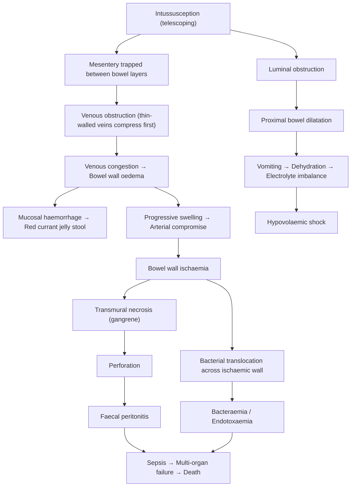

## Complications of Intussusception

Complications of intussusception can be organised into two broad categories: (A) **complications of the disease itself** (i.e., what happens if intussusception is not reduced in time, or progresses), and (B) **complications of treatment** (i.e., iatrogenic complications from enema reduction or surgery). Understanding these from first principles requires tracing the pathophysiological cascade back to the fundamental problem: **mesenteric compression by the telescoped bowel**.

---

### A. Complications of the Disease (Untreated / Delayed Intussusception)

The natural history of untreated intussusception follows a predictable, stepwise progression driven by mesenteric vascular compromise:

---

#### 1. Bowel Ischaemia and Necrosis (Strangulation)

**Why it happens**: The trapped mesentery between the intussusceptum and intussuscipiens undergoes progressive vascular compression. Veins (low-pressure, thin-walled) occlude first → venous congestion and oedema → if untreated, the swelling eventually compresses arteries (high-pressure, thick-walled) → **arterial ischaemia** → transmural necrosis (gangrene) [2][8].

**Clinical features suggestive of strangulation** [8]:
- **Clinical signs**: Fever, tachycardia, peritoneal signs (guarding, rigidity, rebound tenderness)
- **Clinical symptoms**: Continuous or worsening abdominal pain (loss of the classic pain-free intervals — the pain becomes constant because the ischaemia is now continuous, not just during peristaltic waves)
- **Biochemical**: Leucocytosis, ***metabolic acidosis, raised lactate → intestinal ischaemia*** [8]
- **Radiological**: ***Pneumatosis intestinalis*** (gas within the bowel wall from gas-producing bacteria infiltrating necrotic tissue), ***portal venous gas*** (gas entering mesenteric venous drainage and travelling to the portal system — an ominous sign), ***bowel wall thickening, reduced or lack of bowel wall enhancement*** on CT [8][15]

**Significance**: ***Morbidity and mortality are dependent on duration of ischaemia and its extent. Any length of ischaemic bowel can cause significant systemic effects secondary to sepsis and dehydration*** [8]. This is why early diagnosis and treatment are critical.

> **Prognosis of intestinal obstruction**: ***Mortality 2% (non-strangulated) vs 10–30% (strangulated)*** [13].

---

#### 2. Bowel Perforation

**Why it happens**: Transmural necrosis weakens the bowel wall → the necrotic segment gives way → intestinal contents (faeces, bacteria, gas) spill into the peritoneal cavity.

**Consequences**:
- **Faecal peritonitis**: Spillage of enteric bacteria (E. coli, Bacteroides, Enterococcus) into the sterile peritoneal cavity triggers a massive inflammatory response → ***peritonitis*** [2].
- **Pneumoperitoneum**: Free gas visible under the diaphragm on erect CXR, or as Rigler's sign (both sides of bowel wall visible) on supine AXR [15].
- **Septic shock**: Bacterial contamination → systemic inflammatory response → multi-organ dysfunction.

**Clinical features**: Sudden worsening of pain (which may paradoxically briefly "improve" as the distended bowel decompresses on perforation — a false reassurance), followed by signs of generalised peritonitis (board-like rigidity, absent bowel sounds, fever, tachycardia, hypotension) [8].

<Callout title="Perforation = Absolute Contraindication to Enema Reduction" type="error">
If perforation is suspected clinically or confirmed on erect CXR (pneumoperitoneum), do NOT attempt enema reduction — proceed directly to emergency laparotomy. Insufflation of air or fluid through perforated bowel would cause massive contamination of the peritoneal cavity or life-threatening tension pneumoperitoneum.
</Callout>

---

#### 3. Peritonitis and Sepsis

**Why it happens**: Follows from two mechanisms:
1. **Perforation** → direct faecal contamination of peritoneum (see above).
2. **Bacterial translocation** → even without frank perforation, the ischaemic, oedematous bowel wall loses its barrier function → bacteria and endotoxins translocate across the mucosa into the mesenteric lymphatics and portal circulation → bacteraemia and endotoxaemia [2].

**Pathophysiology of sepsis from bowel ischaemia**: Endotoxin (lipopolysaccharide from Gram-negative bacteria) triggers a cytokine cascade (TNF-α, IL-1, IL-6) → systemic vasodilation, capillary leak, myocardial depression → **septic shock** → multi-organ dysfunction (renal failure, DIC, ARDS).

**Clinical features**: High fever, tachycardia, hypotension, altered consciousness, poor capillary refill, oliguria. In infants, sepsis may present subtly with lethargy, poor feeding, and temperature instability (hypothermia as well as hyperthermia).

---

#### 4. Dehydration and Electrolyte Imbalance

**Why it happens**: The intestinal obstruction component of intussusception causes fluid and electrolyte losses through multiple mechanisms [8]:

| Mechanism | Explanation |
|---|---|
| **Vomiting** | Proximal bowel dilatation → reverse peristalsis → loss of gastric acid (H⁺, Cl⁻), water, K⁺, Na⁺ |
| **Reduced oral intake** | Pain, nausea, and anorexia prevent the child from feeding |
| **Third-space losses** | Oedematous bowel wall transudates fluid into the bowel lumen and peritoneal cavity — this fluid is "sequestered" and functionally lost from the intravascular compartment |
| **Defective intestinal absorption** | The oedematous bowel wall cannot absorb luminal fluid normally |

**Electrolyte consequences**:
- **Hypokalaemia**: Loss of K⁺ in vomitus + metabolic alkalosis shifts K⁺ intracellularly + renal K⁺ wasting from RAAS activation (hypovolaemia → aldosterone → Na⁺ reabsorption and K⁺ secretion in collecting duct)
- **Hypochloraemia**: Loss of HCl in vomiting
- **Metabolic alkalosis**: Loss of H⁺ in vomiting (high SBO/gastric outlet pattern)
- **Metabolic acidosis** (late): If ischaemia develops → lactic acidosis overrides the alkalosis
- **Hyponatraemia**: Dilutional (from inappropriate ADH secretion in the setting of hypovolaemia) and loss in vomitus

---

#### 5. Short Bowel Syndrome (Rare but Serious)

**Why it happens**: If extensive bowel necrosis has occurred by the time of surgery, a large segment of bowel may need to be resected. In neonates and infants, the total small bowel length is shorter to begin with (~200–250 cm at birth), so losing even a moderate segment represents a proportionally larger loss.

**Definition**: Short bowel syndrome occurs when the remaining functional small bowel is insufficient to maintain adequate nutrient and fluid absorption (generally < 100 cm in children, or < 30 cm of jejunum + ileum if the ileocaecal valve is lost).

**Consequences**: Malabsorption, failure to thrive, dependence on parenteral nutrition, micronutrient deficiencies. Loss of the terminal ileum specifically impairs bile salt reabsorption (→ fat malabsorption, steatorrhoea) and vitamin B12 absorption.

**Relevance to intussusception**: This complication underscores the importance of **early diagnosis and non-operative reduction** — the longer the delay, the more bowel may need to be resected.

---

### B. Complications of Treatment

#### 1. Complications of Non-Operative (Enema) Reduction

| Complication | Incidence | Mechanism | Management |
|---|---|---|---|
| ***Bowel perforation*** | ***< 1%*** [2] | Excessive pressure on an already weakened, oedematous bowel wall causes it to rupture. ***Risk factors include age < 6 months, long duration of symptoms and higher pressure during reduction*** [2]. | **Pneumatic reduction**: perforation → ***tension pneumoperitoneum*** [4]. Immediate management: large-bore needle decompression (18G needle in RUQ subdiaphragmatic area to release trapped air), followed by emergency laparotomy, bowel resection, and washout. **Hydrostatic reduction**: perforation → fluid peritonitis. Immediate laparotomy required. ***Pneumatic technique is more advantageous if perforation occurs*** [2] — air is less irritating to the peritoneum than barium and tension pneumoperitoneum can be rapidly decompressed. |
| ***Recurrence*** | ***~5%*** [4] | ***Possibility to develop recurrent intussusception due to residual bowel inflammation which may itself act as pathological lead point*** [2]. Most recurrences occur within 72 hours of reduction, though can occur weeks later. | First recurrence: repeat enema reduction is appropriate (success rate is similar). Second or third recurrence: strongly consider surgical exploration to rule out a pathological lead point (Meckel's diverticulum, polyp, lymphoma). |
| **Incomplete reduction** | Variable | The intussusception is partially but not completely reduced — a small residual "nubbin" of invagination may remain at the ileocaecal valve. | Re-attempt reduction. If persistent, surgical exploration. Some very small residual ileo-ileal intussusceptions may resolve spontaneously. |
| **Post-reduction fever** | Common | ***Patient usually presents with fever after successful reduction due to bacterial translocation or release of endotoxin or cytokines*** [2]. The ischaemic bowel wall allows passage of bacterial products into the bloodstream even after successful reduction. | Usually self-limiting (resolves within 24–48 hours). Monitor closely — persistent high fever may indicate incomplete reduction, perforation, or secondary infection. |

<Callout title="Tension Pneumoperitoneum — A Life-Threatening Emergency" type="error">
If perforation occurs during pneumatic reduction, air escapes into the peritoneal cavity under pressure → ***tension pneumoperitoneum***. This causes abdominal distension, splinting of the diaphragm, respiratory compromise, and cardiovascular collapse (compression of IVC → reduced venous return). Immediate needle decompression in the RUQ is required, followed by emergency laparotomy. This is why a **surgeon must always be on standby** during enema reduction.
</Callout>

---

#### 2. Complications of Surgical Treatment

| Complication | Mechanism | Prevention/Management |
|---|---|---|
| **Wound infection** | Contamination of the surgical wound by enteric organisms, especially if bowel was necrotic or perforated | Prophylactic IV antibiotics; meticulous wound care; delayed primary closure if heavily contaminated |
| **Anastomotic leak** | Following bowel resection with primary anastomosis, the join may fail to heal — especially if performed on oedematous, ischaemic, or poorly perfused bowel ends | Ensure well-vascularised, healthy bowel margins at anastomosis; tension-free suture; adequate nutrition post-operatively. Presents with fever, peritonitis, faecal drainage from wound/drain. Management: emergency re-laparotomy, washout, diversion (stoma). |
| **Post-operative ileus** | Normal post-operative temporary cessation of bowel motility due to handling of the bowel, anaesthesia, and inflammation | Expected and self-limiting (usually resolves in 2–5 days). NG decompression, IV fluids, NPO until bowel function returns (passage of flatus/stool). Prolonged ileus (> 5 days) warrants investigation for mechanical obstruction or intra-abdominal sepsis. |
| **Adhesive small bowel obstruction** | Intra-abdominal adhesions form as part of the healing process after any laparotomy → can cause SBO months to years later | This is a long-term risk of any abdominal surgery. Lifetime risk of adhesive SBO after childhood laparotomy is ~5–15%. Minimised by gentle tissue handling, avoiding unnecessary peritoneal disruption, and laparoscopic approach where possible. |
| **Post-operative intussusception** | Uncoordinated peristalsis during post-operative recovery can cause a new, usually **ileo-ileal** intussusception | Occurs in 1–5% of children after abdominal surgery (not specific to intussusception surgery). Usually ileo-ileal → not amenable to enema reduction → may require re-operation if does not resolve spontaneously. |
| **Stoma-related complications** (if stoma created) | If a stoma was necessary (e.g., in cases of severe peritonitis where primary anastomosis was unsafe): skin excoriation, prolapse, parastomal hernia, high-output stoma, electrolyte derangement | Specialist stoma nurse care; adequate fluid and electrolyte replacement; planned stoma reversal when patient recovered |

---

#### 3. Complications Related to the Underlying Lead Point

If a pathological lead point was the cause of intussusception, the complications of the lead point itself must be considered:

| Lead Point | Specific Complications |
|---|---|
| **Meckel's diverticulum** | GI bleeding (from ectopic gastric mucosa), Meckel's diverticulitis (mimics appendicitis), recurrent intussusception if not resected, Littre's hernia |
| **Lymphoma (e.g., Burkitt)** | If intussusception was the presenting feature of lymphoma, the child needs full oncological staging and treatment. Delay in diagnosis of the underlying malignancy is a significant risk. |
| **Polyps (e.g., Peutz-Jeghers)** | Recurrent intussusception if polyps are not removed. Peutz-Jeghers syndrome carries a lifetime cancer risk (GI, breast, pancreatic, ovarian) requiring surveillance. |
| **HSP** | Ongoing intestinal vasculitis, renal involvement (IgA nephropathy), recurrent intussusception if the bowel wall haematoma recurs |

---

### C. Prognosis

| Scenario | Outcome |
|---|---|
| **Early diagnosis + successful enema reduction** | Excellent prognosis. Near-zero mortality. Full recovery within days. |
| **Delayed presentation but reducible** | Good prognosis if reduced before necrosis develops |
| **Strangulated/necrotic bowel requiring resection** | ***Mortality 10–30% (strangulated)*** [13]. Higher morbidity including risk of short bowel syndrome, anastomotic leak, prolonged hospitalisation |
| **Recurrence** | ***~5% recurrence rate*** [4]. Most resolve with repeat enema reduction. Multiple recurrences warrant investigation for lead point. |
| **Adult intussusception** | Prognosis depends on the underlying aetiology — if malignant, depends on stage and histology |

---

<Callout title="High Yield Summary">

1. **Complications of the disease itself** follow the cascade: venous congestion → oedema → arterial ischaemia → **necrosis** → **perforation** → **peritonitis** → **sepsis** → multi-organ failure and death.

2. **Strangulation** is the most feared complication. Clinical features: constant pain (loss of pain-free intervals), fever, tachycardia, peritoneal signs, leucocytosis, ***raised lactate / metabolic acidosis*** [8]. Radiological signs: ***pneumatosis intestinalis, portal venous gas, lack of bowel wall enhancement*** [8][15].

3. ***Perforation during enema reduction occurs in < 1%*** of cases [2]. Risk factors: ***age < 6 months, long duration of symptoms, high pressure during reduction*** [2]. If pneumatic → ***tension pneumoperitoneum*** requiring needle decompression then laparotomy [4].

4. ***Recurrence rate ~5%*** [4] — usually due to ***residual bowel inflammation acting as lead point*** [2]. First recurrence: repeat enema. Multiple: investigate for pathological lead point.

5. ***Post-reduction fever is expected*** — due to ***bacterial translocation / endotoxin release*** from previously ischaemic bowel [2]. Self-limiting; persistent fever warrants investigation.

6. **Surgical complications**: wound infection, anastomotic leak, post-operative ileus, adhesive SBO (long-term), post-operative intussusception (ileo-ileal).

7. **Mortality**: ***2% non-strangulated vs 10–30% strangulated*** intestinal obstruction [13]. Early diagnosis and reduction are key to minimising morbidity and mortality.

</Callout>

---

<ActiveRecallQuiz
  title="Active Recall - Complications of Intussusception"
  items={[
    {
      question: "Describe the pathophysiological cascade from initial intussusception to perforation and peritonitis.",
      markscheme: "Telescoping traps mesentery between bowel layers → venous compression first (thin-walled, low-pressure veins) → venous congestion and bowel wall oedema → mucosal haemorrhage (red currant jelly stool) → progressive swelling compresses arteries → arterial ischaemia → transmural necrosis (gangrene) → weakened bowel wall perforates → faecal peritonitis → sepsis and multi-organ failure."
    },
    {
      question: "What are the clinical, biochemical, and radiological features that suggest strangulation in intestinal obstruction?",
      markscheme: "Clinical signs: fever, tachycardia, peritoneal signs (guarding, rigidity, rebound). Symptoms: continuous/worsening pain (loss of pain-free intervals). Biochemical: leucocytosis, metabolic acidosis, raised lactate. Radiological: pneumatosis intestinalis (intramural gas), portal venous gas, bowel wall thickening, reduced/absent bowel wall enhancement on CT."
    },
    {
      question: "A perforation occurs during pneumatic reduction of intussusception. What is the immediate life-threatening consequence, and how is it managed?",
      markscheme: "Tension pneumoperitoneum — air escapes under pressure into peritoneal cavity → abdominal distension, diaphragmatic splinting, respiratory compromise, IVC compression reducing venous return, cardiovascular collapse. Immediate management: large-bore needle decompression in RUQ, followed by emergency laparotomy with bowel resection and peritoneal washout."
    },
    {
      question: "Why do patients commonly develop fever after successful enema reduction of intussusception, and when should this cause concern?",
      markscheme: "Post-reduction fever is due to bacterial translocation across the previously ischaemic/oedematous bowel wall and release of endotoxins/cytokines into the systemic circulation. This is usually self-limiting within 24-48 hours. Concern is warranted if fever is persistent, high-grade, or associated with clinical deterioration — may indicate incomplete reduction, perforation, or secondary intra-abdominal sepsis."
    },
    {
      question: "What is the recurrence rate after successful non-operative reduction, what causes recurrence, and how should recurrent episodes be managed?",
      markscheme: "Recurrence rate approximately 5%. Caused by residual bowel inflammation/oedema at the reduction site acting as a transient lead point. First recurrence: repeat enema reduction (similar success rate). Multiple recurrences: investigate for pathological lead point (Meckel's diverticulum, polyp, lymphoma) — surgical exploration recommended."
    }
  ]}
/>

---

## References

[2] Senior notes: felixlai.md (Intussusception — Treatment, Complications, Pathogenesis sections)
[4] Senior notes: maxim.md (Intussusception table — Complications: bowel perforation, tension pneumoperitoneum, recurrence 5%)
[5] Senior notes: Ryan Ho GI.pdf (p134)
[8] Senior notes: felixlai.md (Complications of intestinal obstruction — Strangulation section)
[13] Senior notes: Ryan Ho GI.pdf (p137–139 — Complications of IO, strangulation signs, prognosis)
[15] Senior notes: felixlai.md (CT findings of complicated IO — pneumatosis intestinalis, portal venous gas, bowel wall changes)
