## Differential Diagnosis of Intussusception

The differential diagnosis of intussusception is fundamentally about thinking through **what else can cause this combination of symptoms in an infant/young child**: episodic abdominal pain, vomiting (especially bilious), rectal bleeding, abdominal mass, and/or lethargy. The key is to organise differentials by the **dominant presenting feature**, because the presenting complaint determines your initial differential list.

### Organising Framework

The clinical features of intussusception overlap with several conditions. We can group differentials by the feature that most closely mimics intussusception:

```mermaid
flowchart TD
    A["Infant with colicky abdominal pain ± vomiting ± rectal bleeding ± mass"] --> B["Intestinal obstruction features dominant?"]
    A --> C["Rectal bleeding dominant?"]
    A --> D["Lethargy / altered consciousness dominant?"]
    A --> E["RLQ / peritoneal signs dominant?"]

    B --> B1["Intussusception"]
    B --> B2["Malrotation with midgut volvulus"]
    B --> B3["Incarcerated inguinal hernia"]
    B --> B4["Adhesive SBO (post-op)"]
    B --> B5["Hirschsprung's enterocolitis"]

    C --> C1["Intussusception"]
    C --> C2["Meckel's diverticulum"]
    C --> C3["Juvenile polyp"]
    C --> C4["Bacterial colitis / Infectious diarrhoea"]
    C --> C5["Intestinal duplication cyst"]
    C --> C6["Anal fissure"]

    D --> D1["Intussusception"]
    D --> D2["Sepsis / Meningitis"]
    D --> D3["Non-accidental injury"]
    D --> D4["Metabolic crisis (e.g. IEM)"]

    E --> E1["Acute appendicitis"]
    E --> E2["Mesenteric adenitis"]
    E --> E3["Meckel's diverticulitis"]
    E --> E4["Henoch-Schönlein purpura"]
    E --> E5["Ovarian pathology (older girls)"]
```

---

### Detailed Differential Diagnosis

#### A. Differentials Presenting with Intestinal Obstruction (Colicky Pain + Vomiting + Distension)

| Condition | Key Distinguishing Features | Why It Mimics Intussusception | How to Differentiate |
|---|---|---|---|
| **Malrotation with midgut volvulus** | ***Bilious vomiting in a neonate*** (typically < 1 month) [7]; catastrophic if missed. Upper GI contrast shows abnormal DJ flexure position. Can present with PR bleed and abdominal distension [7]. | Both cause bilious vomiting, distension, and rectal bleeding. Midgut volvulus is a **surgical emergency** with very high risk of losing the entire midgut. | **Age**: volvulus peaks in neonates (first week of life), intussusception peaks 4–24 months. **Speed**: volvulus is typically acute and rapidly deteriorating. **Investigation**: upper GI contrast series shows malposition of DJ flexure (normally to the left of L1 vertebral body); USG may show "whirlpool sign" of twisted SMA. |
| ***Incarcerated inguinal hernia*** | ***Indirect hernia due to patent processus vaginalis (PPV)*** [4]; presents with erythema, pain & irritability, vomiting, cyanosis of the inguinal/scrotal mass. | Both cause colicky pain, vomiting, irritability in an infant. | **Always examine the groins and scrotum** in any child with intestinal obstruction. An incarcerated hernia is a **clinical diagnosis** — you will see and feel a tender, irreducible inguino-scrotal swelling. Intussusception mass is **abdominal** (usually RUQ), not inguinal. |
| **Adhesive small bowel obstruction** | History of **prior abdominal surgery**. Presents with classical intestinal obstruction: colicky pain, vomiting, distension, absolute constipation. | Both cause mechanical SBO symptoms. | History of previous surgery is key. AXR shows dilated SB loops with air-fluid levels but no specific "target sign." Post-operative intussusception (usually ileo-ileal) should also be considered — differentiated by USG [2]. |
| **Hirschsprung's enterocolitis** | Typically in a child with known or undiagnosed Hirschsprung's disease. Presents with abdominal distension, explosive foul-smelling diarrhoea, fever, sepsis. | Both can cause abdominal distension and bilious vomiting. | History of chronic constipation since birth, delayed passage of meconium (> 48 hours), failure to thrive. Rectal examination may produce explosive decompression. Rectal biopsy is diagnostic (absent ganglion cells). |

<Callout title="The Bilious Vomiting Neonate" type="error">
***Bilious (green) vomiting in a neonate is malrotation with midgut volvulus until proven otherwise*** — this is a **surgical emergency**. Do NOT confuse this with intussusception, which peaks at 4–24 months. A premature baby with greenish vomiting, PR bleed, and abdominal distension must have volvulus and necrotising enterocolitis high on the differential [7].
</Callout>

---

#### B. Differentials Presenting with Rectal Bleeding

This is one of the most important differential groups because **red currant jelly stool** is a hallmark of intussusception but is a **late sign**. Several other conditions also cause rectal bleeding in children [2][4]:

| Condition | Key Distinguishing Features | Why It Mimics Intussusception | How to Differentiate |
|---|---|---|---|
| ***Meckel's diverticulum*** | ***Massive painless altered blood (maroon-coloured stool)*** due to acid secretion by ectopic gastric mucosa [4][8]. Can also cause IO via intussusception (as lead point), volvulus, or Littre's hernia. | Meckel's can **cause** intussusception (as a lead point), and independently causes rectal bleeding. | **Painless** vs. intussusception's **painful** bleeding. Meckel's bleeding is typically large-volume, maroon/dark red, and painless. Technetium-99m pertechnetate scan (Meckel's scan) detects ectopic gastric mucosa [4]. ***Meckel's diverticulitis: similar presentation as acute appendicitis; diagnosis by CT scan; may be incidental finding during appendicectomy*** [9]. |
| **Juvenile colonic polyp** | ***Painless*** rectal bleeding, typically small amount of bright red blood coating stool. 90% are juvenile polyps (benign hamartomas). | Both cause rectal bleeding in a young child. | **Painless** and **no obstruction symptoms**. Diagnosed by colonoscopy. Managed by endoscopic polypectomy or bedside suture ligation [4]. |
| ***Bacterial colitis*** | Infectious diarrhoea (Salmonella, Shigella, Campylobacter, EHEC) with bloody mucoid diarrhoea, fever, abdominal cramps. | Both cause bloody stools and abdominal pain. | **Diarrhoea** is the dominant feature (frequent, watery then bloody). Fever more prominent early. Stool culture is diagnostic. No palpable abdominal mass. No intermittent colicky pattern with pain-free intervals. |
| **Intestinal duplication cyst** | Congenital cystic or tubular duplication of bowel. Can contain ectopic gastric mucosa → peptic ulceration → bleeding. Can act as lead point for intussusception. | Both cause rectal bleeding; duplication cysts can cause intussusception. | USG may show a cystic structure adjacent to bowel wall with the characteristic "muscular rim sign" (gut signature). Definitive diagnosis often at surgery. |
| **Anal fissure** | ***Painful*** defecation with bright red blood on surface of stool or on wiping. History of constipation. | Both cause blood per rectum. | Blood is **bright red and on the surface** of stool (outlet-type bleeding), not mixed with mucus. Pain is specifically with defecation. Perianal inspection reveals the fissure. No abdominal symptoms [4]. |

> **Key distinguishing point for rectal bleeding**: Intussusception bleeding is ***painful, small amount, with mucus*** ("red currant jelly"), whereas Meckel's diverticulum bleeding is ***painless, large amount, altered blood*** [4].

---

#### C. Differentials Presenting with Lethargy / Altered Consciousness

This is a **critically important** differential group because intussusception can present **primarily with lethargy**, and the abdominal pathology may be overlooked [2]:

| Condition | Key Distinguishing Features | Why It Mimics Intussusception | How to Differentiate |
|---|---|---|---|
| ***Septic shock*** | Fever, tachycardia, hypotension, altered consciousness, may have identifiable source (UTI, pneumonia, meningitis). | Both cause lethargy and pallor in an infant. Intussusception with advanced ischaemia can itself cause sepsis (bacterial translocation). | Intussusception lethargy is characteristically **episodic** — alternating with periods of inconsolable crying. Sepsis produces **sustained** lethargy. Always perform abdominal examination and consider USG if in doubt [2]. |
| **Meningitis / Encephalitis** | Fever, bulging fontanelle, neck stiffness (may be absent in infants), seizures, altered consciousness. | Both cause lethargy and irritability. | Lumbar puncture is diagnostic. The critical point is to **not forget to examine the abdomen** in a lethargic child — a simple USG abdomen can rule in/out intussusception rapidly. |
| **Non-accidental injury (NAI)** | Unexplained lethargy, bruising in non-mobile infant, subdural haematoma, retinal haemorrhages. | Both cause lethargy and irritability in an infant. | Detailed history (inconsistent story), full examination (bruising, burns), skeletal survey, ophthalmoscopy. Again, USG abdomen should be considered to exclude intussusception. |
| **Metabolic crisis (IEM)** | Inborn error of metabolism (e.g. urea cycle defect, organic acidaemia). Presents with poor feeding, vomiting, lethargy, encephalopathy, metabolic acidosis, hyperammonaemia. | Both cause vomiting and lethargy in an infant. | Blood gas (metabolic acidosis with high anion gap), ammonia level, lactate, urine organic acids, plasma amino acids. No abdominal mass; USG abdomen normal. |

<Callout title="Don't Forget the Abdomen in a Lethargic Infant" type="error">
A lethargic infant may be worked up for sepsis or meningitis while intussusception is missed. **Always palpate the abdomen and consider USG** in any infant with unexplained episodic lethargy — the endorphin release from severe visceral pain can make the child appear "floppy" and unresponsive between episodes.
</Callout>

---

#### D. Differentials Presenting with RLQ / Peritoneal Signs

When intussusception presents late with peritonitis, or when the history is atypical, it can mimic conditions that cause RLQ pain and peritoneal irritation [3][4]:

| Condition | Key Distinguishing Features | Why It Mimics Intussusception | How to Differentiate |
|---|---|---|---|
| ***Acute appendicitis*** | ***Differential diagnosis of intussusception*** [3]. Peak 2nd–3rd decades but can occur in children. Periumbilical → RIF pain migration. Anorexia, nausea, low-grade fever. | Both cause abdominal pain and vomiting in children. Late intussusception with peritonitis can present with RIF tenderness. | ***Investigations: leucocytosis, plain XR (rarely), USG, CT (beware of high radiation)*** [1]. Appendicitis pain is **progressive and constant** (not colicky/episodic). No "pain-free intervals." No rectal bleeding typically. USG shows non-compressible, dilated appendix > 6mm. |
| ***Mesenteric adenitis*** | ***Viral illness prodrome; USG detects lymphadenopathy*** [4]. Caused by viral or bacterial infection (Yersinia, adenovirus) → mesenteric lymph node inflammation. | Both can follow a viral prodrome. Both cause abdominal pain in a child. | Pain is more **diffuse and constant** (not episodic/colicky). Child often looks well between painful episodes. USG shows **clustered enlarged mesenteric lymph nodes** (> 5mm short axis) without evidence of intussusception. Self-limiting. |
| ***Henoch-Schönlein purpura (HSP)*** | ***IgA-mediated small vessel vasculitis*** with palpable purpura (vasculitis + bleeding), abdominal pain (intestinal vasculitis vs intussusception), arthritis, renal involvement (GN) [4]. **HSP can CAUSE intussusception** (submucosal haemorrhage acts as lead point). | HSP causes severe colicky abdominal pain (intestinal vasculitis), and can itself cause intussusception. | Look for the **classic rash** — palpable purpura on buttocks and lower limbs. Arthritis/arthralgia. ***Abdominal pain in HSP: intestinal vasculitis vs intussusception — differentiated by USG*** [4]. If USG shows intussusception, treat accordingly. |
| ***Meckel's diverticulitis*** | ***Similar presentation as acute appendicitis; diagnosis by CT scan; incidental finding during appendicectomy*** [9]. | Both cause RLQ/periumbilical pain. Meckel's diverticulitis is clinically indistinguishable from appendicitis pre-operatively. | CT abdomen may show inflamed diverticulum in the distal ileum. Often discovered incidentally at laparoscopy/laparotomy for presumed appendicitis. ***Treatment: antibiotics; diverticulectomy / small bowel resection*** [9]. |
| **Ovarian pathology** (older girls) | Ovarian cyst torsion, ruptured ovarian cyst, ectopic pregnancy (adolescents). | Both cause acute lower abdominal pain. | Ask about LMP in adolescent girls. Pregnancy test (β-hCG). USG pelvis diagnostic. ***Girls: ask LMP, order PT & USG abdomen, do not PV on your own (consult Gynae!!)*** [4]. |

---

### Summary: Key Differentiating Features at a Glance

| Feature | Intussusception | Midgut Volvulus | Incarcerated Hernia | Meckel's (bleeding) | Appendicitis | HSP |
|---|---|---|---|---|---|---|
| **Peak age** | 4–24 months | Neonate (< 1 month) | Any age | < 2 years | 2nd–3rd decade | 3–10 years |
| **Pain pattern** | Episodic, colicky, pain-free intervals | Acute, constant, rapidly deteriorating | Constant, worsening | Painless (bleeding) or colicky (IO) | Progressive, constant | Colicky (vasculitis) |
| **Vomiting** | Bilious (late) | Bilious (early) | Yes | If IO present | Reflex, rarely bilious | Yes |
| **Rectal bleeding** | Red currant jelly (late) | Late, dark | No | Painless, maroon, large-volume | No (usually) | May occur |
| **Mass** | Sausage-shaped, RUQ | No specific mass | Inguinal/scrotal | No | No (unless abscess) | No |
| **Rash** | No | No | No | No | No | Palpable purpura (buttocks/legs) |
| **Key investigation** | USG: target sign | Upper GI contrast / USG whirlpool | Clinical diagnosis | Meckel's scan | USG / CT | USG (r/o intussusception) + clinical |

---

### Special Considerations in Hong Kong

- **Seasonal peaks**: Intussusception in HK peaks in cooler months (October–February), coinciding with viral respiratory and GI seasons. Differentials such as bacterial colitis (Salmonella, Campylobacter) also peak in warmer months — a summer presentation of bloody diarrhoea is more likely infectious.
- **HSP**: Relatively common in HK children. Always examine the skin in any child with abdominal pain — the rash may appear after the abdominal symptoms, leading to diagnostic delay.
- **Rotavirus vaccine**: Now part of the HK childhood immunisation schedule. A very small excess risk of intussusception within 1 week of the first dose should be in the history if the timeline fits.

---

<Callout title="High Yield Summary">

1. **Organise differentials by dominant presenting feature**: intestinal obstruction, rectal bleeding, lethargy, or RLQ/peritoneal signs.

2. **Bilious vomiting in a neonate** = malrotation with midgut volvulus until proven otherwise — **do NOT confuse with intussusception** (different age group).

3. ***Always examine the groins*** — **incarcerated inguinal hernia** (due to ***patent processus vaginalis***) is a common mimic of intestinal obstruction in infancy.

4. **Rectal bleeding differentiation**: Intussusception = ***painful, small amount, mucus***; Meckel's diverticulum = ***painless, large amount, altered blood*** [4].

5. ***HSP can CAUSE intussusception*** — differentiate intestinal vasculitis pain from intussusception using USG [4].

6. ***Meckel's diverticulitis: similar presentation as acute appendicitis; diagnosis by CT scan; may be incidental finding at appendicectomy*** [9].

7. **Lethargy as a presenting feature**: always think intussusception in a lethargic 6–24 month old infant — don't be misled into a sepsis/meningitis work-up without examining the abdomen and obtaining USG.

8. **Key differentiators**: Age of presentation, pain pattern (episodic vs constant), presence/absence of mass, location of mass (abdominal vs inguinal), rash (HSP), and USG findings.

</Callout>

---

<ActiveRecallQuiz
  title="Active Recall - Differential Diagnosis of Intussusception"
  items={[
    {
      question: "A 3-week-old neonate presents with bilious vomiting and abdominal distension. What is the most important diagnosis to exclude and why is this different from intussusception?",
      markscheme: "Malrotation with midgut volvulus. This is a surgical emergency with risk of losing the entire midgut. It differs from intussusception in age (neonates vs 4-24 months), speed of deterioration (acute and rapid vs episodic), and investigation (upper GI contrast showing abnormal DJ flexure position or USG whirlpool sign, rather than target/pseudo-kidney sign)."
    },
    {
      question: "How do you differentiate rectal bleeding from intussusception versus Meckel's diverticulum in a young child?",
      markscheme: "Intussusception: painful, small amount, with mucus (red currant jelly stool); a late sign. Meckel's diverticulum: painless, large-volume, maroon-coloured/altered blood due to acid secretion from ectopic gastric mucosa. Meckel's scan (Tc-99m pertechnetate) detects ectopic gastric mucosa. Meckel's can also cause intussusception as a lead point."
    },
    {
      question: "A 5-year-old child presents with colicky abdominal pain and a palpable purpuric rash on the buttocks and lower limbs. What condition should you suspect and what specific complication must you exclude with USG?",
      markscheme: "Henoch-Schonlein purpura (IgA vasculitis). Must exclude intussusception by USG abdomen, as HSP can cause intussusception via submucosal haemorrhage/oedema acting as a lead point. Also assess for renal involvement (urinalysis) and arthritis."
    },
    {
      question: "An infant presents with acute intestinal obstruction symptoms. What must you always examine on physical examination to avoid missing a common mimic of intussusception?",
      markscheme: "Always examine the inguinal regions and scrotum to rule out incarcerated inguinal hernia (due to patent processus vaginalis in children). An incarcerated hernia presents with a tender, irreducible inguino-scrotal swelling, erythema, and sometimes cyanosis of the mass. It is a clinical diagnosis."
    },
    {
      question: "Name three conditions in which lethargy in an infant can mimic the lethargy seen in intussusception. How is the lethargy pattern in intussusception characteristically different?",
      markscheme: "Sepsis/meningitis, non-accidental injury, metabolic crisis (inborn error of metabolism). In intussusception, lethargy is characteristically EPISODIC — alternating with periods of inconsolable crying/distress (corresponding to peristaltic waves), unlike the sustained lethargy of sepsis or the persistent encephalopathy of NAI/metabolic crisis."
    }
  ]}
/>

---

## References

[1] Lecture slides: GC 203. The child needs an operation Common emergencies and surgery in childhood.pdf (p41, p45)
[2] Senior notes: felixlai.md (Intussusception section — Differential diagnosis)
[3] Senior notes: felixlai.md (Intestinal malrotation section — Differential diagnosis listing intussusception)
[4] Senior notes: maxim.md (Paediatric surgical abdomen table; LGIB section; HSP section)
[5] Senior notes: Ryan Ho GI.pdf (p134)
[7] Lecture slides: Case Study – Paediatric Surgery Bilious vomiting of new-born _ACH Fung.pdf (p5)
[8] Senior notes: felixlai.md (Meckel's diverticulum — Clinical manifestation)
[9] Lecture slides: GC 195. Lower and diffuse abdominal pain RLQ problems; pelvic inflammatory disease; peritonitis and abdominal emergencies.pdf (p22)
