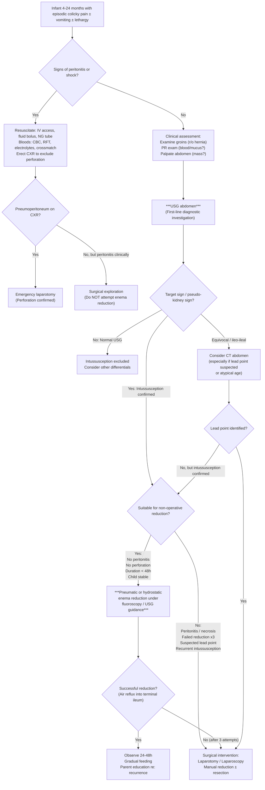
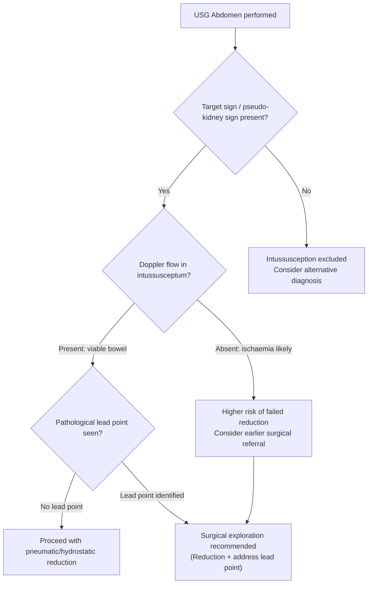

## Diagnosis of Intussusception

### Diagnostic Philosophy

The diagnosis of intussusception rests on a **high index of clinical suspicion** combined with **rapid imaging confirmation**. There are no formal "diagnostic criteria" in the way that rheumatological or metabolic conditions have — rather, the diagnosis is made by recognising the clinical pattern and confirming with imaging. The key principle is: **if you think of it, ultrasound it** — because early diagnosis and reduction before ischaemia sets in dramatically improves outcomes.

---

### 1. Clinical Diagnostic Features (Pattern Recognition)

While there is no formal points-based scoring system, the clinical diagnosis relies on recognising the characteristic pattern:

| Feature | Diagnostic Value |
|---------|-----------------|
| Age 4–24 months | High pre-test probability |
| Episodic colicky pain with pain-free intervals | Most consistent early feature |
| Bilious vomiting | Suggests distal SBO |
| Red currant jelly stool | **Late sign** — highly suggestive but present in minority at presentation |
| Sausage-shaped RUQ mass | When present, virtually diagnostic |
| Dance's sign (empty RIF) | Supportive |
| Preceding viral illness (URTI/GE) | Supports idiopathic aetiology |

> **In practice**: Any infant aged 6–24 months with **episodic inconsolable crying** (especially drawing up of legs) ± **vomiting** should have intussusception considered. The threshold for obtaining an **ultrasound** should be very low — it is non-invasive, radiation-free, and near-100% sensitive in experienced hands.

<Callout title="There Is No 'Diagnostic Criteria' Checklist" type="idea">
Unlike conditions such as rheumatic fever (Jones criteria) or SLE (SLICC criteria), intussusception does not have a validated points-based scoring system. The "diagnostic criterion" is **clinical suspicion + confirmatory imaging (USG)**. The classical triad is present in fewer than 50% of cases, so waiting for the full triad before investigating is a dangerous approach.
</Callout>

---

### 2. Diagnostic Algorithm

The following algorithm represents the standard approach in a Hong Kong paediatric surgical unit:

---

### 3. Investigation Modalities

The investigations for intussusception serve three purposes:
1. **Confirm the diagnosis** (primarily USG)
2. **Assess for complications** (ischaemia, perforation, dehydration)
3. **Identify pathological lead points** (USG, CT)

---

#### 3.1 Bedside Investigations

| Investigation | Purpose | Key Findings / Interpretation |
|---|---|---|
| ***Urinalysis, pregnancy test*** [10] | Rule out urological causes of abdominal pain; pregnancy test in adolescent girls | Should be normal in intussusception. Haematuria may suggest HSP (renal involvement) |
| **PR examination** | Detect blood/mucus before it is passed spontaneously; assess rectal masses | "Red currant jelly" on examining finger is highly suggestive. May also detect a prolapsing intussusceptum in advanced cases. |
| **Vital signs** | Assess haemodynamic status, fever, dehydration | Tachycardia and prolonged CRT suggest dehydration/shock. Fever suggests complication (necrosis, perforation, peritonitis). |

---

#### 3.2 Blood Tests

> ***Blood tests: Blood count, renal and liver function, amylase, clotting profile, arterial blood gas, type and screen*** [10]

| Investigation | Rationale (Why?) | Key Findings in Intussusception |
|---|---|---|
| **CBC (FBC)** | Assess for infection (raised WCC with left shift suggests complication); baseline Hb for bleeding; platelet count pre-operatively | ***WBC for infection (inflammatory source may cause left shift on differential)*** [11]. Leucocytosis suggests complicated intussusception (necrosis, peritonitis). Anaemia if significant GI blood loss. |
| **RFT (Renal function tests)** | Assess hydration status; baseline creatinine if contrast study considered | ***Hydration status; HypoK/hypoCl from prolonged vomiting*** [11]. Elevated urea:creatinine ratio suggests pre-renal dehydration from vomiting and third-space losses. |
| **Electrolytes** | Prolonged vomiting → electrolyte derangement | **Hypokalaemia** (K⁺ loss in vomitus + metabolic alkalosis shifts K⁺ intracellularly + renal K⁺ wasting from RAAS activation). **Hypochloraemia** and **metabolic alkalosis** from loss of gastric HCl. **Hyponatraemia** from third-spacing and vomiting [8]. |
| **LFT** | Rule out hepatobiliary pathology as cause of abdominal pain; baseline pre-surgery | Usually normal. May be deranged if prolonged shock with hepatic hypoperfusion. |
| **Clotting profile + Type & Screen** | Pre-operative preparation; crossmatch if surgery anticipated | Essential if surgery is likely. Ensures blood is available for transfusion. |
| ***Amylase*** [10] | Rule out pancreatitis as a cause of abdominal pain (pancreatitis can cause secondary ileus) | ***Amylase: peaks at 6-24h, > 1000 diagnostic of acute pancreatitis*** [11]. Should be normal in intussusception. |
| ***ABG (Arterial blood gas)*** [10] | Assess acid-base status; lactate level as marker of bowel ischaemia | ***Metabolic acidosis, raised lactate → intestinal ischaemia*** [11]. A raised lactate (> 2 mmol/L) should raise alarm for bowel compromise. ***Metabolic alkalosis → prolonged vomiting*** [11]. |
| **Serum lactate** | Sensitive marker of tissue hypoperfusion and bowel ischaemia | Elevated lactate in intussusception suggests strangulation with ischaemia — this is an indication for urgent surgical intervention rather than attempting non-operative reduction [8]. |

<Callout title="Lactate and ABG in Intussusception" type="error">
A raised serum lactate or metabolic acidosis on ABG should prompt you to think about **bowel ischaemia/strangulation**. In a child with suspected intussusception and raised lactate, do NOT delay for non-operative reduction attempts — this child may need urgent surgery. Conversely, metabolic alkalosis with hypokalaemia and hypochloraemia simply reflects prolonged vomiting.
</Callout>

---

#### 3.3 Imaging Investigations

##### 3.3.1 Plain Abdominal X-Ray (AXR)

***AXR — may show dilated small bowels and a mass*** [1].

**Role**: AXR is usually the **first imaging** obtained, primarily to **exclude perforation** (pneumoperitoneum) and to look for signs of intestinal obstruction. However, AXR is **neither sensitive nor specific** for intussusception — a normal AXR does NOT exclude the diagnosis. Its main value is to identify complications and provide a global overview.

> ***Erect CXR for free gas under diaphragm → perforation*** [10][11]

| AXR Finding | Description | Pathophysiological Basis |
|---|---|---|
| **Dilated small bowel loops** | Proximal SB loops > 3cm diameter with air-fluid levels on erect film | Mechanical obstruction at the ileocaecal junction → proximal bowel cannot empty → gas and fluid accumulate → dilatation |
| ***Absence of colonic (LB) gas*** | No gas seen in the large bowel | The intussusception obstructs the ileocaecal junction → gas cannot pass into the colon → the colon "empties" distally. ***AXR: distended SB, absent LB gas*** [4]. |
| **"Target sign"** (AXR) | Two concentric radiolucent circles superimposed on the right kidney | The peritoneal fat surrounding and within the intussusception creates concentric radiolucent rings. This is seen because fat is less dense than soft tissue and the layers of bowel-within-bowel create a characteristic pattern [2]. |
| **"Crescent sign"** | Soft-tissue density projecting into the gas of the large bowel | The intussusceptum (a soft-tissue mass) protrudes into the gas-filled lumen of the colon, creating a crescentic soft-tissue opacity outlined by colonic gas [2]. |
| **"Sausage-shaped opacity"** | Elongated soft-tissue density in the RUQ/transverse colon area | The telescoped bowel mass itself, visible as a soft tissue density [5]. |
| **Pneumoperitoneum** | Free gas under diaphragm on erect CXR, or Rigler's sign on supine AXR | Indicates bowel perforation — **absolute contraindication to enema reduction** → proceed directly to surgery |
| **Air-fluid levels** | Multiple (> 5) air-fluid levels on erect AXR | Indicates intestinal obstruction. ***> 5 air-fluid levels diagnostic of IO*** [5][11]. |

<Callout title="AXR Limitations in Intussusception">
AXR has a sensitivity of only ~45–80% for intussusception. A **normal AXR does NOT exclude intussusception**. If clinical suspicion is present, proceed directly to USG regardless of AXR findings. The main role of AXR is to exclude perforation (pneumoperitoneum) before attempting enema reduction.
</Callout>

##### 3.3.2 Ultrasound (USG) — The Gold Standard

***Ultrasound — usually diagnostic in experienced hands*** [1].

***USG abdomen (diagnostic): target sign, pseudo-kidney sign*** [4].

**Why USG is the investigation of choice**:
- **Sensitivity and specificity approach 100%** in experienced hands [2]
- **Non-invasive**, no radiation (critical in paediatric population)
- Can **detect pathological lead points** (masses, Meckel's diverticulum, duplication cysts)
- Can **assess vascularity** of the intussusceptum (Doppler) → predict viability
- Can **monitor the success of reduction** in real-time
- **Readily available** in most Hong Kong hospitals with paediatric services

| USG Finding | View | Description | Pathophysiological Basis |
|---|---|---|---|
| ***"Target sign" ("Doughnut sign" / "Bull's eye sign")*** | **Transverse (axial) view** | Multiple concentric rings of alternating echogenicity | In cross-section, the layers of the intussusceptum (mucosa, submucosa, muscularis, serosa) and the intussuscipiens create concentric rings. The oedematous, hyperaemic mucosa and the mesenteric fat trapped between layers create the alternating hypo- and hyperechoic rings — like a "target" or "doughnut" [2][4]. |
| ***"Pseudo-kidney sign" ("Sandwich sign")*** | **Longitudinal (sagittal) view** | An elongated mass with layers resembling the cortex and hilum of a kidney | In longitudinal section, the layered appearance of bowel-within-bowel with the trapped mesentery (hyperechoic) resembles the renal parenchyma surrounding the echogenic hilum — hence "pseudo-kidney" [2][4]. |
| **Trapped mesenteric fat and lymph nodes** | Both views | Echogenic focus within the intussusception | The dragged mesentery contains hyperechoic fat and hypoechoic lymph nodes, visible between the layers of the intussusception |
| **Free fluid** | General survey | Anechoic fluid around the intussusception or in the pelvis | Transudation from congested bowel; larger amounts suggest more advanced disease |
| **Absent Doppler flow in intussusceptum** | Colour Doppler | No vascular signal in the trapped bowel wall | ***Lack of perfusion in intussusceptum indicates development of ischaemia*** [2]. This is a poor prognostic sign — suggests arterial compromise and possible necrosis. May influence decision to proceed directly to surgery rather than attempting enema reduction. |
| **Pathological lead point** | Variable | A discrete mass within the intussusception | If a structural lesion (polyp, Meckel's diverticulum, lymphomatous mass, duplication cyst) is identified, it should prompt surgical exploration rather than enema reduction, as the lead point will cause recurrence and may itself require definitive treatment [2]. |
| **Length of intussusception** | Longitudinal | Measured in cm | Longer intussusceptions (> 3.5 cm) may be associated with lower success rates of pneumatic reduction, though this is not an absolute cut-off. |

**How to interpret USG in context:**

<Callout title="USG Findings That Favour Surgery Over Enema Reduction" type="idea">
The following USG findings should make you lean toward **surgical intervention** rather than attempting non-operative reduction:
- Absent Doppler flow in the intussusceptum (ischaemia)
- Large amount of free fluid (suggests advanced disease)
- Visible pathological lead point (will cause recurrence; may need resection)
- Very long intussusception extending to the left colon
- Trapped fluid between layers of the intussusception (suggests significant oedema/necrosis)
</Callout>

##### 3.3.3 CT Abdomen with Contrast

***CT: characteristic target (donut) lesions*** [5].

**Role**: CT is **NOT first-line** for paediatric intussusception due to radiation exposure. It is reserved for specific situations [2]:

| Indication for CT | Rationale |
|---|---|
| USG equivocal or technically limited | Obese child, excessive bowel gas, operator-dependent limitations |
| Atypical presentation (older child / adult) | Higher likelihood of pathological lead point; need to characterise the lesion and assess for malignancy |
| Suspected complications | Evaluate for perforation, abscess, or extent of ischaemia when clinical picture is unclear |
| Post-operative intussusception | Ileo-ileal intussusception may be difficult to detect on USG |

| CT Finding | Description | Pathophysiological Basis |
|---|---|---|
| ***"Target sign" / "Donut sign"*** | Alternating hypodense and hyperdense concentric layers on axial cuts | Same principle as USG target sign — layers of bowel wall, mesentery, and lumen creating concentric rings. Fat (hypodense) alternates with enhanced bowel wall (hyperdense after IV contrast) [5][8]. |
| **"Sausage-shaped mass"** | Elongated soft-tissue mass in the colon | The intussusception mass seen in coronal or sagittal reformats |
| **Identification of lead point** | Discrete enhancing mass within the intussusception | Critical for surgical planning — characterise the lesion (polyp, lymphoma, Meckel's, GIST, carcinoma in adults) |
| **Bowel wall thickening** | Thickened, oedematous bowel wall | Venous congestion → oedema |
| **Reduced/absent bowel wall enhancement** | Lack of contrast uptake in the intussusceptum wall | Arterial compromise → ischaemia → non-viable bowel [8] |
| **Pneumatosis intestinalis** | Gas within the bowel wall | Transmural necrosis → gas-producing bacteria infiltrate the bowel wall [8] |
| **Portal venous gas** | Gas in the portal venous system | Extremely ominous sign — indicates advanced bowel necrosis with gas entering the mesenteric venous system and draining to the portal vein [8] |
| **Free fluid / pneumoperitoneum** | Intraperitoneal fluid or free air | Perforation (free air) or transudation from ischaemic bowel (free fluid) |

##### 3.3.4 Contrast Enema (Barium / Air)

***Contrast enema — rarely done now*** [1] for purely diagnostic purposes.

**Historical context**: Before the widespread availability of USG, contrast enema (barium or air) was the primary diagnostic tool. Fluoroscopic contrast enema would show:
- **"Claw sign" / "Meniscus sign"**: The contrast (barium or air) outlines the tip of the intussusceptum within the colon, creating a crescent/claw-shaped filling defect.
- **"Coiled spring" appearance**: Contrast tracks between the layers of the intussusception, outlining the concentric rings.

**Current role**: In modern practice, contrast enema is used almost exclusively as a **therapeutic tool** (pneumatic or hydrostatic reduction) rather than for diagnosis. The diagnosis is made by USG, and the enema is then performed as treatment. Some centres use fluoroscopy during pneumatic reduction to monitor progress.

##### 3.3.5 Meckel's Scan (Technetium-99m Pertechnetate Scan)

**Role**: Not used for diagnosing intussusception per se, but indicated when **recurrent intussusception** raises suspicion of a **Meckel's diverticulum** as a pathological lead point [4][12].

- **Principle**: Pertechnetate (⁹⁹ᵐTc) behaves like chloride ions → actively accumulated and secreted by gastric mucosa. If ectopic gastric mucosa is present in a Meckel's diverticulum, the isotope accumulates there, creating a "hot spot" in the right lower quadrant.
- ***Requires pre-medication with H2 blockers***: These inhibit excretion of the isotope into the bowel lumen (which would cause dilution and false negatives), while NOT inhibiting uptake by the mucosa [4].
- **Limitations**: False positives (intestinal duplication cysts with gastric mucosa), false negatives (insufficient ectopic gastric mucosa, rapid GI bleeding diluting the tracer) [4].

---

### 4. Investigations in Adults

In adults, the diagnostic approach differs fundamentally because ***intussusception in adults is ALWAYS associated with pathological lead-points*** [5]:

| Modality | Role in Adults |
|---|---|
| **CT abdomen with contrast** | **First-line** in adults (unlike children where USG is first-line). Identifies the intussusception, characterises the lead point, stages malignancy, and assesses for metastatic disease. |
| **Colonoscopy** | May be used if colonic intussusception is suspected, to biopsy a visible lead point. However, avoid insufflation near an obstructed segment. |
| **MRI** | Occasionally used for further characterisation of identified lesions, especially in younger adults where radiation avoidance is desirable. |

> ***Adults: usually require formal resection to r/o CA*** [5] — the primary goal in adults is to identify and resect the lead point, not to perform non-operative reduction.

---

### 5. Summary Table: Key Investigations and Their Findings

| Investigation | Key Findings | Sensitivity/Specificity | When to Use |
|---|---|---|---|
| **AXR** | Dilated SB, absent LB gas, target sign, crescent sign, sausage-shaped opacity | Low sensitivity (~45-80%) | First-line to exclude perforation; not definitive |
| ***USG abdomen*** | ***Target sign (axial), pseudo-kidney sign (longitudinal)***, Doppler assessment, lead point detection | ***~100% in experienced hands*** | **Investigation of choice** in children |
| **CT abdomen** | ***Target/donut sign***, lead point characterisation, complications (ischaemia, perforation) | Very high | Atypical cases, older children, adults, equivocal USG |
| **Contrast enema** | Claw sign, meniscus sign, coiled spring | High but largely replaced by USG | Now mainly therapeutic, ***rarely done for diagnosis*** |
| **Erect CXR** | Pneumoperitoneum (free gas under diaphragm) | High for perforation | **Must be done before enema reduction** to exclude perforation |
| **Meckel's scan** | Hot spot in RLQ (ectopic gastric mucosa) | Moderate (sensitivity ~85% in children) | Recurrent intussusception suspected to be from Meckel's |

---

<Callout title="High Yield Summary">

1. **There are no formal "diagnostic criteria"** for intussusception — diagnosis is **clinical suspicion + imaging confirmation**.

2. ***USG abdomen is the investigation of choice***: target sign (axial) and pseudo-kidney sign (longitudinal), with ***sensitivity and specificity approaching 100% in experienced hands*** [1][2][4].

3. **AXR** is done first to **exclude perforation (pneumoperitoneum)** before enema reduction, and may show dilated SB with absent LB gas, but a **normal AXR does NOT exclude intussusception**.

4. **CT** is reserved for atypical cases, adults (first-line in adults), and when a **pathological lead point** needs characterisation. Shows ***characteristic target (donut) lesions*** [5].

5. ***Contrast enema is rarely done now*** [1] for diagnosis — it is primarily a **therapeutic tool**.

6. **Key USG danger signs** favouring surgery: absent Doppler flow (ischaemia), visible lead point, large free fluid.

7. **Blood tests** serve to assess for complications: ***raised lactate/metabolic acidosis → bowel ischaemia***; electrolyte derangement from vomiting; leucocytosis suggesting complication.

8. **In adults**, CT with contrast is first-line, and the goal is to identify and resect the pathological lead point (usually malignancy).

</Callout>

---

<ActiveRecallQuiz
  title="Active Recall - Diagnosis of Intussusception"
  items={[
    {
      question: "What is the investigation of choice for diagnosing intussusception in children, and what are the two classical findings on this modality?",
      markscheme: "USG abdomen is the investigation of choice. Classical findings: (1) Target sign (also called doughnut or bull's eye sign) on transverse/axial view — concentric rings of alternating echogenicity representing layers of bowel within bowel; (2) Pseudo-kidney sign on longitudinal view — layered appearance resembling renal cortex and hilum."
    },
    {
      question: "A child with suspected intussusception has an AXR that appears normal. What is the next step and why?",
      markscheme: "Proceed to USG abdomen. AXR has low sensitivity for intussusception (only 45-80%) and a normal AXR does NOT exclude the diagnosis. USG has near-100% sensitivity and specificity in experienced hands, is non-invasive, and radiation-free."
    },
    {
      question: "What must be excluded on erect CXR before attempting pneumatic or hydrostatic enema reduction, and why?",
      markscheme: "Must exclude pneumoperitoneum (free gas under diaphragm) indicating bowel perforation. Enema reduction in the setting of perforation would force air or contrast into the peritoneal cavity, causing tension pneumoperitoneum or peritonitis — a life-threatening complication."
    },
    {
      question: "What USG Doppler finding suggests that non-operative reduction is unlikely to succeed and surgical intervention should be considered?",
      markscheme: "Absent Doppler flow in the intussusceptum, indicating arterial compromise and likely bowel ischaemia/necrosis. This suggests the bowel may not be viable and non-operative reduction carries a higher risk of failure or perforation."
    },
    {
      question: "How does the diagnostic approach to intussusception differ between children and adults?",
      markscheme: "Children: USG is first-line (non-invasive, no radiation, near-100% accuracy); CT only if USG equivocal or lead point needs characterisation. Adults: CT abdomen with contrast is first-line because intussusception in adults is almost always caused by a pathological lead point (often malignancy), and CT is needed to characterise the lesion, stage disease, and plan resection."
    },
    {
      question: "Name three AXR findings that may be seen in intussusception and explain the pathophysiology of each.",
      markscheme: "(1) Dilated small bowel loops with air-fluid levels — mechanical obstruction at the ileocaecal junction prevents distal passage of gas and fluid. (2) Absence of colonic gas — obstruction at ICV prevents gas entry into colon. (3) Target sign (two concentric radiolucent circles over right kidney) — peritoneal fat surrounding and within the intussusception creates radiolucent rings against soft tissue density of bowel walls."
    }
  ]}
/>

---

## References

[1] Lecture slides: GC 203. The child needs an operation Common emergencies and surgery in childhood.pdf (p47)
[2] Senior notes: felixlai.md (Intussusception — Diagnosis section)
[4] Senior notes: maxim.md (Intussusception table; Meckel's scan section)
[5] Senior notes: Ryan Ho GI.pdf (p134)
[8] Senior notes: felixlai.md (Meckel's diverticulum — Diagnosis/biochemical tests)
[10] Lecture slides: GC 195. Lower and diffuse abdominal pain RLQ problems; pelvic inflammatory disease; peritonitis and abdominal emergencies.pdf (p12, p29)
[11] Senior notes: Ryan Ho GI.pdf (p105–106); Ryan Ho Fundamentals.pdf (p279)
[12] Senior notes: maxim.md (Meckel's scan — Investigations)
