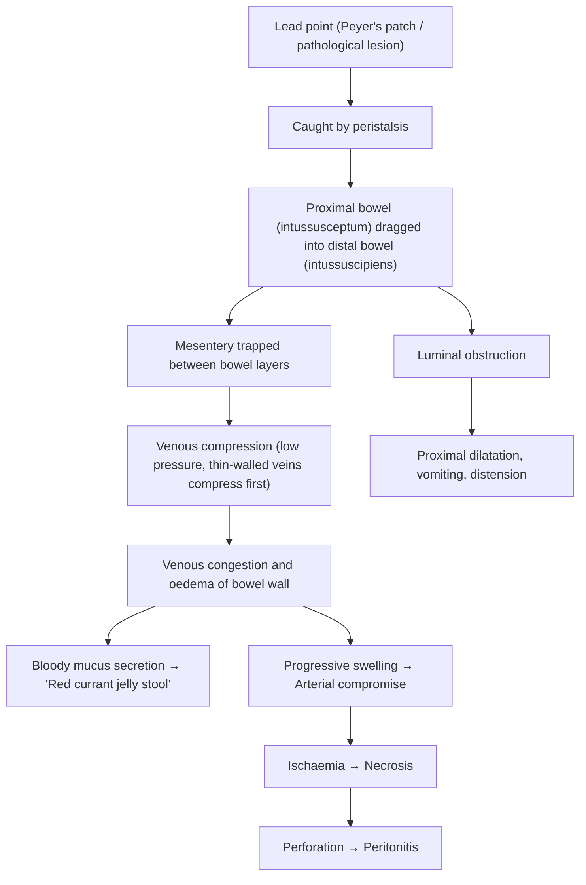

# Intussusception

## 1. Definition

Intussusception derives from the Latin *intus* ("within") + *suscipere* ("to take up") — literally, a segment of bowel being "taken up within" itself. ***Invagination of a portion of intestine into an adjacent portion*** [1].

More precisely, the **proximal segment** (called the **intussusceptum**) telescopes into the **distal segment** (called the **intussuscipiens**). The mesentery of the intussusceptum is dragged along with it, leading to venous congestion, oedema, ischaemia, and — if untreated — necrosis and perforation [2][3].

> **It is the most common abdominal emergency in early childhood** and the **most common cause of intestinal obstruction in infants between 6–36 months of age** [2].

---

## 2. Epidemiology

### 2.1 Incidence and Age Distribution

- ***Peak incidence: 4 to 24 months*** [1]. The majority of patients are younger than 2 years [2].
- Uncommon before 3 months and after 6 years of age. When it occurs outside this window, a **pathological lead point** should be strongly suspected [2][3].
- In adults, intussusception is rare and almost always secondary to a structural lesion (polyp, lipoma, GIST, carcinoma) [5].

### 2.2 Sex Predominance

- ***Male > Female*** (approximately 3:2) [1][2].

### 2.3 Hong Kong Context

- In Hong Kong, intussusception remains a common paediatric surgical emergency. The typical patient is a well-nourished infant aged 6–12 months presenting in autumn/winter (coinciding with peak viral gastroenteritis season). Awareness of this condition among parents and primary care physicians allows earlier presentation and higher rates of successful non-operative reduction.
- Rotavirus vaccine (Rotarix®, RotaTeq®) is part of the HK childhood immunisation schedule. There is a small but recognised increased risk of intussusception in the first 1–2 weeks following the **first dose** of rotavirus vaccine, though the absolute risk is very low (~1–6 per 100,000 vaccinated infants) [4].

---

## 3. Anatomy and Relevant Function

### 3.1 Normal Anatomy of the Ileocaecal Region

Understanding *why* intussusception occurs most often at the ileocaecal junction requires appreciating the anatomy:

- **Terminal ileum**: The last ~20–30 cm of the ileum is particularly rich in **lymphoid tissue (Peyer's patches)** — aggregated lymphoid follicles in the submucosal layer. These are part of gut-associated lymphoid tissue (GALT) and are most prominent in childhood, gradually atrophying with age.
- **Ileocaecal valve (ICV)**: A physiological sphincter at the junction of the ileum and caecum. It acts as a one-way valve. The abrupt change in calibre (narrow ileum → wide caecum) and the lip-like valve structure create a natural "funnel" into which the ileum can prolapse.
- **Mesentery**: The ileal mesentery is relatively mobile and long in children, allowing the ileum to prolapse into the caecum and ascending colon.

### 3.2 Why the Ileocaecal Junction?

The combination of:
1. **Abundant lymphoid tissue** (prone to reactive hyperplasia → acts as a "lead point")
2. **Calibre change** at the ICV (creates a natural telescoping point)
3. **Mesenteric mobility** in young children

...explains why **~85–90% of paediatric intussusceptions are ileocolic (ileocaecal)** [4].

### 3.3 Other Anatomical Sites

| Site | Description | Notes |
|------|-------------|-------|
| **Ileocolic** | Ileum telescopes through ICV into colon | Most common (85–90%) in children [4] |
| **Ileo-ileal** | Small bowel telescopes into itself | More common post-operatively; more likely to resolve spontaneously; less likely to respond to pneumatic reduction [2] |
| **Jejuno-jejunal** | Jejunum into jejunum | Rare; usually pathological lead point |
| **Colo-colic** | Colon into colon | More common in adults; suspect malignancy |

### 3.4 Functional Consequences of Telescoping

When the intussusceptum is dragged into the intussuscipiens:
1. **Mesentery is compressed** between the two layers of bowel → **venous obstruction first** (veins are thin-walled and compress before arteries)
2. **Venous congestion** → oedema of bowel wall → bloody mucus secretion ("red currant jelly stool")
3. **If untreated**, progressive oedema → **arterial compromise** → ischaemia → necrosis → perforation → peritonitis
4. **Luminal obstruction** → proximal bowel dilatation, vomiting (initially non-bilious if the obstruction is distal; **bilious if proximal to ampulla of Vater** or as condition progresses)

---

## 4. Etiology

### 4.1 Idiopathic (75–90% in Children)

- ***May be preceded by viral infection*** [1].
- **75% of cases are idiopathic** — no clear pathological lead point is found [2].
- **Proposed mechanism**: Viral infections (URTI, gastroenteritis — particularly adenovirus, rotavirus, enterovirus) cause **reactive lymphoid hyperplasia of Peyer's patches** in the terminal ileum [2][3].
  - ***Enlarged Peyer's patches (90%)*** act as a "lead point" — the hypertrophied lymphoid tissue protrudes into the lumen and is caught by normal peristalsis, which propels it distally, dragging the proximal bowel with it [4].
  - This explains the **seasonal variation** (autumn/winter peaks coinciding with viral season) and the age predilection (Peyer's patches are most prominent in infancy/early childhood).

<Callout title="Why Idiopathic Intussusception is a Disease of Infancy" type="idea">
Peyer's patches are most prominent at 6–24 months of age. They are the infant's primary immune sampling tissue in the gut, highly reactive to new antigenic exposure. After ~2 years, the lymphoid tissue starts to involute. This is why intussusception peaks at this age and is rare in older children or adults without a lead point.
</Callout>

### 4.2 Pathological Lead Points (~10–25%)

A **pathological lead point** is a structural lesion within the bowel wall or lumen that acts as the "anchor" dragged by peristalsis. It is **more common in children > 3 years and in adults**. ***In adults, intussusception is ALWAYS associated with pathological lead-points (usually intraluminal lesions in SB), e.g., polyp, submucosal lipoma, Meckel's diverticulum, GIST, carcinoma*** [5].

| Lead Point | Notes |
|------------|-------|
| ***Meckel's diverticulum*** | Most common pathological lead point in children. A true diverticulum containing all bowel wall layers. Should be considered in **recurrent small bowel intussusception** [6] |
| **Polyps** | Juvenile polyps, Peutz-Jeghers polyps (hamartomatous), adenomatous polyps |
| ***Lymphoma*** | Small bowel lymphoma (Burkitt lymphoma in children); always consider in older children with intussusception [4] |
| **Duplication cysts** | Congenital enteric duplication cysts act as mass lesion |
| ***Henoch-Schönlein purpura (HSP)*** | IgA vasculitis → submucosal haemorrhage/oedema in bowel wall acts as lead point [2] |
| **Submucosal lipoma** | More common in adults |
| **GIST / Carcinoma** | Adults — always rule out malignancy |
| **Appendiceal stump** | Post-appendicectomy; the inflamed stump can act as lead point |

<Callout title="When to Suspect a Pathological Lead Point" type="error">
Always suspect a pathological lead point when:
- Age **< 3 months or > 6 years**
- **Recurrent** intussusception (especially small bowel)
- **Ileo-ileal** location (not ileocolic)
- **Adult** presentation — assume malignancy until proven otherwise
</Callout>

### 4.3 Post-operative Intussusception

- Occurs after abdominal or retroperitoneal surgery (1–21 days post-op).
- Caused by **uncoordinated peristaltic activity** during recovery or traction from suture lines/feeding tubes [2].
- Usually **ileo-ileal** (not ileocolic), making it difficult to diagnose and **not amenable to pneumatic/hydrostatic reduction**.
- Diagnosis requires a high index of suspicion in any child with post-operative abdominal distension and vomiting.

### 4.4 Rotavirus Vaccine-Associated

- ***Rotavirus vaccine*** (particularly the earlier RotaShield® vaccine, now withdrawn) was associated with intussusception.
- Current vaccines (RotaTeq®, Rotarix®) carry a very small increased risk (~1–6 extra cases per 100,000 vaccinated infants), predominantly **within 1 week of the first dose** [4].
- The benefit of vaccination (preventing severe rotavirus gastroenteritis) far outweighs this small risk, and vaccination remains recommended.

---

## 5. Pathophysiology

### 5.1 Mechanism of Telescoping

The sequence of events in intussusception follows a logical, step-wise progression:

### 5.2 Key Pathophysiological Points

1. **Why venous obstruction before arterial?**
   - Veins are thin-walled, low-pressure vessels. When the mesentery is compressed between the intussusceptum and intussuscipiens, veins are occluded first while arterial inflow continues → **venous engorgement and haemorrhagic oedema** of the bowel wall.

2. **Why "red currant jelly" stool?**
   - Venous congestion → transudation of blood and mucus into the bowel lumen. The mixture of blood and mucus gives the characteristic **dark red, jelly-like appearance** (like redcurrant jam). This is a **late sign** and indicates significant mucosal ischaemia — it means the condition has been present for hours [4].

3. **Why colicky (intermittent) pain?**
   - Each peristaltic wave attempts to propel the intussusceptum further into the intussuscipiens → intense visceral pain during the peristaltic contraction → relief between contractions.
   - As the condition progresses, the pain may become constant (suggesting ischaemia/peritonitis).

4. **Why bilious vomiting?**
   - ***Bilious vomiting*** occurs because the obstruction is distal to the ampulla of Vater (in ileocolic intussusception, the obstruction is at the ileocaecal junction) → bile-stained vomiting indicates intestinal obstruction [4].
   - Initially vomiting may be non-bilious (reflex vomiting from visceral stimulation), but as obstruction progresses, it becomes bilious.

5. **Why a "sausage-shaped" mass?**
   - The telescoped bowel forms an elongated, firm, curved mass in the **right upper quadrant** (the intussusceptum advances from the ileocaecal region along the ascending colon toward the hepatic flexure and transverse colon) [4].
   - ***Sausage-shaped mass in RUQ*** [4].

6. **"Dance's sign" (emptiness in RIF)**
   - As the caecum is drawn up with the advancing intussusceptum, the **right iliac fossa becomes empty** to palpation (the caecum has been "pulled up"). This is called Dance's sign.

### 5.3 Pathophysiology of Intestinal Obstruction Component

Intussusception causes **mechanical small bowel obstruction**. The general pathophysiology of intestinal obstruction applies [4]:

- **Proximal dilatation**: Initially, increased peristalsis attempts to overcome the obstruction. Soon, gas accumulates (swallowed air + bacterial fermentation) and fluid accumulates (failed absorption + secretion from oedematous wall).
- **Dehydration and electrolyte imbalance** from:
  - Reduced oral intake
  - Vomiting
  - Defective intestinal absorption (oedematous bowel wall)
  - Transudation of fluid into the peritoneal cavity (third-spacing)
- **Strangulation**: Unlike simple obstruction, intussusception causes **strangulated obstruction** (mesenteric compromise) → ischaemia → necrosis → perforation → faecal peritonitis and sepsis.

---

## 6. Classification

### 6.1 By Anatomical Location

| Type | Description | Frequency |
|------|-------------|-----------|
| **Ileocolic (ileocaecal)** | Ileum prolapses through ICV into colon | ***85% in children*** [4] |
| **Ileo-ileal** | Small bowel into small bowel | More common post-op; also HSP, Meckel's |
| **Jejuno-jejunal** | Jejunum into jejunum | Rare |
| **Colo-colic** | Colon into colon | More common in adults (think malignancy) |

### 6.2 By Etiology

| Type | Description |
|------|-------------|
| **Idiopathic** | No structural lead point; reactive lymphoid hyperplasia (~75–90% in children) |
| **Secondary (lead-point)** | Structural lesion acts as lead point (Meckel's, polyp, lymphoma, etc.) |
| **Post-operative** | Uncoordinated peristalsis after abdominal surgery; usually ileo-ileal |
| **Vaccine-associated** | Following rotavirus vaccination (rare, first dose) |

### 6.3 By Reducibility

| Type | Description |
|------|-------------|
| **Reducible** | Can be reduced by pneumatic/hydrostatic enema or manual surgical reduction |
| **Irreducible** | Failed non-operative reduction; requires surgical intervention |
| **Gangrenous** | Bowel necrosis has occurred; requires resection |

---

## 7. Clinical Features

### 7.1 Symptoms

The clinical presentation of intussusception is one of the most classic and exam-tested presentations in paediatric surgery. However, the ***classical triad (intermittent colicky abdominal pain + red currant jelly stool + sausage-shaped mass) is present in fewer than 50% of cases*** [4].

| Symptom | Description | Pathophysiological Basis |
|---------|-------------|--------------------------|
| ***Intermittent colicky abdominal pain*** | Sudden onset, severe, episodic (every 10–20 min), child draws up knees and screams; **pain-free intervals between episodes** | Each peristaltic wave propels the intussusceptum deeper → intense visceral stretch and ischaemia → pain; pain resolves when peristalsis relaxes |
| **Inconsolable crying** | Especially in younger infants who cannot verbalise pain | Visceral pain from mesenteric traction and bowel wall ischaemia |
| ***Bilious vomiting*** | Initially non-bilious (reflex), becoming bilious as obstruction progresses | Obstruction distal to ampulla of Vater → bile cannot pass distally → refluxes proximally. Also increased proximal intraluminal pressure → reverse peristalsis |
| ***Red currant jelly stool*** | Dark red, mucoid bloody stool; this is a **LATE sign** | Venous engorgement of the trapped bowel → transudation of blood and mucus into the lumen. Indicates significant mucosal compromise. Not present early — by the time it appears, there is already significant ischaemia [4] |
| **Lethargy / altered consciousness** | May mimic sepsis or encephalitis; **drowsiness between episodes** is characteristic | Thought to be due to endorphin release in response to severe visceral pain, or possibly from endotoxin absorption from ischaemic bowel. This can be a **red herring** — a lethargic infant may be misdiagnosed with meningitis/encephalopathy |
| **Refusal to feed** | Child stops eating | Nausea and abdominal discomfort; intestinal obstruction causes anorexia |
| ***Fever*** | Low-grade initially; high-grade suggests complication | Mucosal disruption → bacterial translocation; late fever suggests necrosis/perforation/peritonitis [4] |
| ***Abdominal distension*** | Progressive as obstruction develops | Proximal bowel dilatation from gas and fluid accumulation due to mechanical obstruction |

<Callout title="The Lethargic Infant — Don't Forget Intussusception!" type="error">
A common exam pitfall: an infant presenting primarily with **lethargy and pallor** may be misdiagnosed as sepsis, meningitis, or even non-accidental injury. Always consider intussusception in a lethargic child aged 6–24 months, especially if there are intermittent episodes of distress. A simple abdominal ultrasound can save a life.
</Callout>

### 7.2 Signs

| Sign | Description | Pathophysiological Basis |
|------|-------------|--------------------------|
| ***Sausage-shaped mass in RUQ*** | Palpable, firm, slightly curved mass, usually in the right upper quadrant or along the transverse colon | The telescoped bowel forms an elongated mass as the intussusceptum advances along the colon [4] |
| **Dance's sign** | Emptiness or "hollowness" on palpation of the right iliac fossa | The caecum has been dragged superiorly with the intussusceptum → the RIF is empty |
| **Blood and mucus on PR examination** | "Red currant jelly" may be detected on rectal examination | Venous congestion → haemorrhagic transudation. PR examination may reveal blood before it is passed per rectum |
| **Rarely: prolapsing mass through rectum** | In advanced cases, the intussusceptum may be visible at the anus | Extreme advancement of the intussusceptum through the colon; must be differentiated from rectal prolapse |
| **Signs of dehydration** | Dry mucous membranes, sunken fontanelle, tachycardia, reduced urine output | Vomiting + third-space fluid losses + reduced intake |
| **Signs of peritonitis (late)** | Abdominal rigidity, guarding, rebound tenderness, absent bowel sounds, high fever, tachycardia, hypotension | Bowel necrosis → perforation → faecal peritonitis. This is a **surgical emergency** |
| **Abdominal distension** | Generalised distension | Mechanical bowel obstruction → proximal bowel dilatation with gas and fluid |

<Callout title="Classical Triad vs Reality">
The **classical triad** of intussusception is:
1. Intermittent colicky abdominal pain
2. Red currant jelly stool
3. Sausage-shaped abdominal mass

**However**, this full triad is present in **fewer than 50%** of cases. The most reliable and earliest feature is **episodic, severe colicky pain with pain-free intervals** in an infant aged 6–24 months. Do not wait for the full triad before investigating — early ultrasound is key.
</Callout>

### 7.3 Temporal Progression of Clinical Features

Understanding the chronological evolution helps you assess severity:

| Time Frame | Features | Implication |
|------------|----------|-------------|
| **Early (0–6 hours)** | Intermittent colicky pain, vomiting (non-bilious), irritability, drawing up of legs | Bowel telescoping with intermittent peristaltic episodes; no significant ischaemia yet |
| **Intermediate (6–12 hours)** | Pain becoming more frequent, bilious vomiting, lethargy between episodes, palpable mass | Progressive obstruction; venous congestion developing |
| **Late (12–24+ hours)** | Red currant jelly stool, fever, abdominal distension, signs of dehydration | Significant venous congestion → mucosal haemorrhage; strangulation developing |
| **Very late (> 24 hours)** | Constant pain, peritonitis, septic shock, absent bowel sounds | Bowel necrosis, perforation, faecal peritonitis — **surgical emergency** |

---

## 8. Differential Diagnosis of Intussusception

(To be covered in the next section as per your request, but key differentials are listed here for completeness of context.)

Key differentials for the acute presentation [2]:

**For rectal bleeding and vomiting:**
- Meckel's diverticulum
- Malrotation with midgut volvulus (especially neonates — bilious vomiting)
- Bacterial colitis (infectious diarrhoea)
- Juvenile polyp (painless rectal bleeding)

**For lethargy and altered consciousness:**
- Sepsis / meningitis
- Non-accidental injury (NAI)
- Metabolic crisis (inborn error of metabolism)

**For colicky abdominal pain in an infant:**
- Incarcerated inguinal hernia (***Indirect hernia due to patent processus vaginalis (PPV)*** — check inguinal regions!) [4]
- Infantile colic (diagnosis of exclusion, infant < 3 months)
- Testicular torsion (check scrotum in boys)

---

## 9. Summary Table: Intussusception at a Glance

| Feature | Detail |
|---------|--------|
| **Definition** | Telescoping of proximal bowel (intussusceptum) into distal bowel (intussuscipiens) |
| **Peak age** | ***4–24 months*** |
| **Sex** | ***Male > Female (3:2)*** |
| **Most common site** | ***Ileocolic / ileocaecal (85%)*** |
| **Most common cause (children)** | Idiopathic (reactive lymphoid hyperplasia of Peyer's patches) |
| **Most common lead point (children)** | Meckel's diverticulum |
| **Adults** | Always assume pathological lead point (r/o malignancy) |
| **Classical triad** | Colicky pain + red currant jelly stool + sausage-shaped mass (< 50%) |
| **Key investigation** | ***USG abdomen: target sign / pseudo-kidney sign*** |
| **First-line treatment** | ***Fluoroscopic/US-guided pneumatic reduction*** |
| **Surgical indications** | Failed reduction, peritonitis/necrosis, suspected pathological lead point |

---

<Callout title="High Yield Summary">

1. **Intussusception** = telescoping of proximal bowel into distal bowel; most common cause of intestinal obstruction in infants aged 6–36 months.

2. ***Peak incidence 4–24 months; Male > Female; may be preceded by viral infection*** [1].

3. **75–90% are idiopathic** in children → reactive lymphoid hyperplasia of Peyer's patches (especially after viral URTI/GE). **In adults, ALWAYS suspect a pathological lead point** (malignancy until proven otherwise) [5].

4. **Most common site**: ***Ileocaecal intussusception (85%)*** [4].

5. **Pathophysiology**: Lead point caught by peristalsis → telescoping → mesenteric trapping → **venous obstruction first** (veins compress before arteries) → congestion → oedema → "red currant jelly stool" (LATE sign) → if untreated, arterial compromise → necrosis → perforation → peritonitis.

6. ***Classical triad (< 50%): intermittent colicky abdominal pain, red currant jelly stool, sausage-shaped mass in RUQ*** [4].

7. **Don't forget**: Lethargy/altered consciousness can be a presenting feature — do not miss intussusception in a lethargic infant!

8. **Diagnosis**: ***USG abdomen (diagnostic): target sign (axial), pseudo-kidney sign (longitudinal)*** [4].

9. **Treatment**: ***Fluoroscopic-guided pneumatic reduction (75–95% success)*** as first-line; surgery if failed, peritonitis, or suspected lead point [4].

10. **Recurrence** ~5–10%; recurrent episodes should prompt investigation for a pathological lead point.

</Callout>

---

<ActiveRecallQuiz
  title="Active Recall - Intussusception"
  items={[
    {
      question: "What is the pathophysiological mechanism by which intussusception causes 'red currant jelly' stool?",
      markscheme: "Telescoped bowel drags mesentery between layers → venous compression (veins compress before arteries) → venous congestion and oedema of bowel wall → transudation of blood and mucus into lumen → dark red jelly-like stool. This is a LATE sign indicating significant mucosal ischaemia."
    },
    {
      question: "A 9-month-old boy presents with episodic screaming, drawing up of legs, and bilious vomiting. Between episodes he is lethargic. What is the most likely diagnosis, the most common underlying cause at this age, and the first-line investigation?",
      markscheme: "Intussusception. Most common cause at this age is idiopathic (reactive lymphoid hyperplasia of Peyer's patches, often post-viral URTI/GE). First-line investigation is ultrasound abdomen looking for target sign (axial view) or pseudo-kidney sign (longitudinal view)."
    },
    {
      question: "Name three indications for surgical intervention rather than pneumatic reduction in intussusception.",
      markscheme: "1) Failed pneumatic/hydrostatic reduction; 2) Signs of peritonitis or bowel necrosis/perforation; 3) Suspected pathological lead point (e.g., age > 6 years, recurrent intussusception, ileo-ileal type)."
    },
    {
      question: "Why is intussusception predominantly a disease of infants aged 6-24 months and why does it usually occur at the ileocaecal junction?",
      markscheme: "Peyer's patches (lymphoid tissue in terminal ileum) are most prominent at 6-24 months and are highly reactive to viral antigens → reactive lymphoid hyperplasia acts as lead point. The ileocaecal junction is predisposed because of: abundant lymphoid tissue, calibre change at ileocaecal valve creating a natural funnel, and relative mesenteric mobility in young children."
    },
    {
      question: "A 7-year-old child presents with intussusception. What key concern differentiates management from that in a typical 10-month-old infant?",
      markscheme: "In a child older than 6 years, intussusception is more likely to have a pathological lead point (e.g., Meckel's diverticulum, polyp, lymphoma) rather than being idiopathic. Must investigate for underlying structural lesion; surgical exploration and resection may be preferred over non-operative reduction to obtain tissue diagnosis and rule out malignancy."
    },
    {
      question: "What is Dance's sign and what is its pathophysiological basis in intussusception?",
      markscheme: "Dance's sign = emptiness or hollowness on palpation of the right iliac fossa. It occurs because the caecum and terminal ileum have been dragged superiorly and medially as the intussusceptum advances along the ascending colon, leaving the RIF empty."
    }
  ]}
/>

---

## References

[1] Lecture slides: GC 203. The child needs an operation Common emergencies and surgery in childhood.pdf (p45)
[2] Senior notes: felixlai.md (Intussusception section)
[3] Senior notes: Ryan Ho GI.pdf (p134)
[4] Senior notes: maxim.md (Intussusception table, Section 4.3)
[5] Senior notes: Ryan Ho GI.pdf (p134, adult intussusception)
[6] Senior notes: Ryan Ho GI.pdf (p161, Meckel's diverticulum as lead point)
