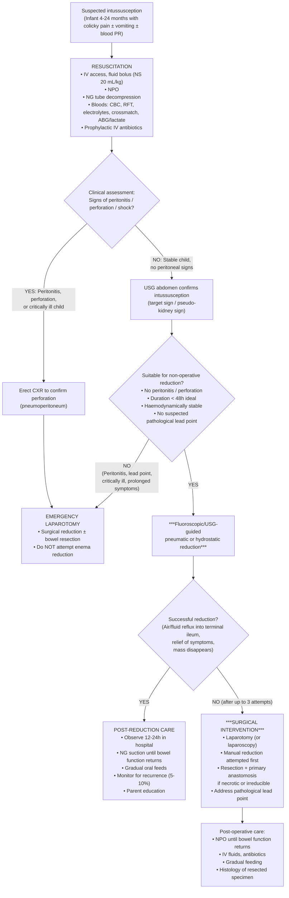

## Management of Intussusception

### Management Philosophy

The management of intussusception follows a clear logical hierarchy: **resuscitate → assess → reduce**. The cornerstone principle is that **most paediatric intussusceptions can be reduced non-operatively** with pneumatic or hydrostatic enema, achieving success rates of 75–95%. Surgery is reserved for specific indications. The urgency of management depends on the duration of symptoms and the presence of complications — the longer the delay, the higher the risk of ischaemia, necrosis, and the need for bowel resection.

In adults, the approach is fundamentally different: ***adults usually require formal resection to r/o CA*** [5].

---

### 1. Management Algorithm

---

### 2. Initial Resuscitation and Stabilisation

Before ANY attempt at reduction, the child must be adequately resuscitated. This follows the general **"drip and suck"** principle of intestinal obstruction management [8][13]:

| Intervention | Rationale (Why?) | Details |
|---|---|---|
| **NPO (Nil per os)** | Limits further bowel distension; prepares for potential anaesthesia/surgery | All patients should be made NPO immediately [8] |
| **IV fluid resuscitation** | Replace losses from vomiting, third-spacing, and reduced intake. Correct intravascular depletion before reduction attempts. | ***Crystalloids such as normal saline (NS), Ringer's lactate or Hartmann's solution*** [8]. In children: **NS 20 mL/kg bolus** repeated as needed. ***K⁺ replacement may be indicated but should be given cautiously in patients with AKI from severe dehydration*** [8]. |
| **NG tube decompression** | Decompress the proximal obstructed bowel; reduce risk of aspiration during sedation/anaesthesia | ***Placed on free drainage with 4-hourly aspiration*** [8]. Functions: (1) Decompression proximal to obstruction; (2) Reduce aspiration risk during induction of anaesthesia [8]. |
| **Prophylactic antibiotics** | Bacterial translocation across ischaemic bowel wall; preparation for possible surgery | ***Broad-spectrum antibiotics due to bacterial overgrowth; mandatory for all patients undergoing surgery for intestinal obstruction*** [8]. Typical regimen: IV amoxicillin/clavulanate or cefuroxime + metronidazole. ***Prophylactic antibiotics may be given due to risk of perforation*** [2]. |
| **Pain relief** | Humane care; also reduces vagal response that can complicate reduction | ***Pain management with opioids is reasonable although pain from mechanical bowel obstruction in general is often not amenable to treatment with analgesics*** [8]. IV paracetamol ± IV morphine 0.1 mg/kg in children, titrated carefully. |
| **Monitoring** | Track response to resuscitation; detect deterioration early | Vital signs (HR, BP, SpO₂, temp), urine output (catheterise if critically ill), serial abdominal examination |

<Callout title="Resuscitation Before Reduction" type="error">
Never attempt enema reduction in a dehydrated, haemodynamically unstable child. Adequate resuscitation with IV fluids and correction of electrolyte abnormalities is essential first. A child who arrests during enema reduction due to unrecognised hypovolaemia is a preventable tragedy.
</Callout>

---

### 3. Non-Operative Reduction (First-Line Treatment)

This is the ***preferred first treatment with high success rate in most cases*** [2].

#### 3.1 General Principles

Non-operative reduction works by applying retrograde pressure (air or fluid) into the colon via the rectum, which pushes the intussusceptum back through the intussuscipiens in the **reverse direction** of the original telescoping. Think of it as "un-telescoping" the bowel by pushing from below.

#### 3.2 Techniques

There are two main techniques, and two main guidance modalities:

| | **Pneumatic reduction (air)** | **Hydrostatic reduction (fluid)** |
|---|---|---|
| **Medium** | Air (or CO₂) | Normal saline (or barium historically) |
| **Guidance** | Fluoroscopy (traditional) or USG | USG (preferred) or fluoroscopy |
| **Mechanism** | Air insufflated per rectum → retrograde pressure pushes intussusceptum back | Saline infused per rectum under gravity → hydrostatic pressure reduces intussusception |
| **Advantages** | ***Pneumatic technique using air or CO₂ reduces intussusception more easily and is more advantageous if perforation occurs*** [2] (air causes less peritoneal contamination than barium; tension pneumoperitoneum can be rapidly decompressed with needle) | USG-guided hydrostatic reduction avoids radiation entirely; real-time visualisation of reduction |
| **Success rate** | ***75–95% success rate*** [4] | Similar success rates (~80–95%) |

> ***Fluoroscopic-guided pneumatic reduction (75–95% success rate): instill gas with 18–22 Fr Foley → maintain pressure ~100–120 mmHg × 3 min → observe for gush of air into terminal ileum*** [4].

#### 3.3 Technique of Pneumatic Reduction (Step-by-Step)

1. **Preparation**: Child is resuscitated, IV access secured, NG in situ. Surgeon and anaesthetist must be on standby (in case of perforation requiring emergency laparotomy). Erect CXR done beforehand to exclude pre-existing pneumoperitoneum.
2. **Catheter insertion**: ***18–22 Fr Foley catheter*** inserted into the rectum; balloon inflated to create a seal (prevents air leak) [4].
3. **Air insufflation**: Air is insufflated via a hand pump or controlled insufflator, connected to a pressure gauge.
4. **Pressure maintenance**: ***Maintain pressure ~100–120 mmHg for ~3 minutes*** [4]. The pressure must not exceed 120 mmHg (risk of perforation rises steeply above this).
5. **Monitoring**: Under fluoroscopy, the intussusceptum is seen as a soft tissue mass outlined by air. As reduction proceeds, the mass retreats toward the ileocaecal valve.
6. **Endpoint of successful reduction**: ***Observe for gush of air into terminal ileum*** — this is the definitive sign that the intussusception has been completely reduced [4]. Other markers of success include: ***appearance of water and bubbles in terminal ileum, free flow of contrast or air into terminal ileum, relief of symptoms, disappearance of abdominal mass*** [2].
7. **If unsuccessful**: A single attempt may be repeated (up to **3 attempts** total is the general consensus). Between attempts, allow a rest period of 15–30 minutes (the oedema may settle slightly, improving the chance of success on the next attempt).

#### 3.4 USG-Guided Hydrostatic Reduction

- Increasingly popular in Hong Kong and globally as it avoids radiation entirely.
- ***Ultrasound is now the intervention of choice*** for guidance [2].
- Warm normal saline is infused per rectum under gravity (height of the saline bag provides the hydrostatic pressure, typically hung ~100 cm above the patient).
- The USG operator watches the intussusception reduce in real-time — the "target sign" progressively disappears, and eventually free fluid is seen flowing into the terminal ileum.
- **Advantages over fluoroscopy**: No radiation, real-time monitoring of bowel wall viability (Doppler), better visualisation of complete reduction, ability to detect residual intussusception or lead points.

#### 3.5 Indications for Non-Operative Reduction

| Criteria | Explanation |
|---|---|
| Confirmed intussusception on USG | Diagnosis must be certain before attempting |
| No signs of peritonitis | Peritonitis suggests perforation or necrosis → surgery needed |
| No pneumoperitoneum on erect CXR | Perforation is an absolute contraindication to enema |
| Haemodynamically stable after resuscitation | Unstable child → surgery |
| Duration ideally < 48 hours | Longer duration → higher risk of necrosis → lower success rate |
| No suspected pathological lead point | Lead points will cause recurrence; need surgical excision |

#### 3.6 Absolute Contraindications to Non-Operative Reduction

| Contraindication | Rationale |
|---|---|
| **Pneumoperitoneum (perforation)** | Insufflation of air/fluid through a perforated bowel → faecal peritonitis or tension pneumoperitoneum |
| ***Peritonitis / necrosis*** [4] | Necrotic bowel cannot safely be "pushed back" — it will perforate during reduction. Needs resection. |
| **Haemodynamic instability / septic shock** | Child is too unstable for a controlled enema procedure; needs laparotomy |
| **Recurrent intussusception with suspected lead point** | Reduction alone will not be curative; the lead point needs surgical excision |

#### 3.7 Relative Contraindications

| Factor | Consideration |
|---|---|
| Duration > 48 hours | Lower success rate, higher complication risk, but not an absolute contraindication |
| Very young infant (< 3 months) | Higher likelihood of a pathological lead point; lower success rate |
| Ileo-ileal intussusception | ***Less likely to respond to non-operative reduction*** [2] — the enema pressure cannot effectively reach the small bowel |
| Absent Doppler flow on USG | Suggests ischaemia — may proceed cautiously but have very low threshold for surgery |

#### 3.8 Complications of Non-Operative Reduction

| Complication | Incidence | Details |
|---|---|---|
| ***Bowel perforation*** | ***< 1%*** [2]; ***Cx: bowel perforation, tension pneumoperitoneum*** [4] | ***Risk factors include age < 6 months, long duration of symptoms and higher pressure during reduction*** [2]. Presents with sudden clinical deterioration, abdominal distension, desaturation. If pneumatic reduction → tension pneumoperitoneum requiring immediate needle decompression (large-bore needle in RUQ) followed by emergency laparotomy. |
| ***Recurrence*** | ***~5%*** [4] | Due to residual bowel oedema acting as a transient lead point. Most recurrences happen within 72 hours. Recurrent episodes can be managed with repeat enema reduction (success rate is similar). Multiple recurrences should prompt investigation for a pathological lead point. |

#### 3.9 Post-Reduction Management

***Post-reduction management: Observation with hospitalisation for 12–24 hours*** [2]:

| Aspect | Details | Rationale |
|---|---|---|
| **Hospitalisation** | Observe in hospital for 12–24 hours minimum | Monitor for recurrence and complications |
| **NG tube** | ***Nasogastric suction is maintained until bowel function has returned and patient has passage of a bowel movement*** [2] | Ensure bowel function recovers before feeding |
| **Feeding** | Gradual introduction of clear fluids → milk/diet as tolerated | Prevents vomiting from feeding too early |
| **Fever** | ***Patient usually presents with fever after successful reduction due to bacterial translocation or release of endotoxin or cytokines*** [2] | Reassure parents — post-reduction fever is expected and self-limiting. However, persistent high fever may indicate incomplete reduction or complication. |
| **Recurrence monitoring** | ***Possibility to develop recurrent intussusception due to residual bowel inflammation which may itself act as pathological lead point*** [2] | Educate parents on symptoms to watch for; seek urgent medical attention if symptoms recur |

---

### 4. Surgical Management

#### 4.1 Indications for Surgery

***Surgical reduction: indicated if*** [4]:
1. ***Failed pneumatic reduction*** (after up to 3 attempts)
2. ***Peritonitis / necrosis***
3. ***Suspected pathological lead points***

Additional surgical indications [2]:
4. ***Suspected intussusception who is critically ill*** [2]
5. ***Suspected bowel perforation*** [2]
6. ***Refractory to non-operative reduction*** [2]
7. Post-operative (ileo-ileal) intussusception — not amenable to enema reduction
8. Adult intussusception — ***adults usually require formal resection to r/o CA*** [5]

#### 4.2 Surgical Approach

| Approach | Details |
|---|---|
| **Laparotomy** (traditional) | Right transverse or midline incision. Allows full exploration of the abdomen, manual reduction, assessment of bowel viability, and resection if needed. Remains the standard in many centres, especially in emergency settings. |
| **Laparoscopy** | Increasingly used in stable patients with uncomplicated intussusception. Advantages: smaller incisions, faster recovery, better cosmesis. Limitations: may not be feasible if significant distension or adhesions; requires experienced laparoscopic surgeon. Convert to open if needed. |

#### 4.3 Surgical Procedure

***Manual reduction at operation is attempted in most cases but resection with primary anastomosis may be needed if manual reduction is not possible or a lead point is identified*** [2].

The operative steps follow a logical sequence:

1. **Operative decompression** (always performed first):
   - ***Milk SB content in retrograde manner to stomach → insert orogastric tube for aspiration → replace aspirated volume as measured*** [13].
   - This decompresses the dilated proximal bowel, improving surgical access and reducing the risk of post-operative ileus.

2. **Manual reduction (Hutchinson's manoeuvre)**:
   - The surgeon applies gentle, sustained retrograde pressure on the **intussuscipiens** (the distal "receiving" bowel) to push the intussusceptum back out — like squeezing toothpaste back into the tube.
   - **Critical rule**: Never PULL on the intussusceptum (this will tear the oedematous, friable bowel). Always PUSH from below.
   - Continue squeezing gently until the intussusceptum is fully delivered back through the ileocaecal valve.

3. **Assessment of bowel viability** after reduction:
   - Inspect the reduced bowel for colour (pink = viable; dark purple/black = necrotic), peristalsis, mesenteric pulsations.
   - Wrap in warm saline-soaked packs and wait 10–15 minutes to reassess if borderline.

4. **Decision regarding resection**:

| Scenario | Action |
|---|---|
| Bowel is viable, no lead point | Reduction alone is sufficient. Close the abdomen. |
| Bowel is viable but lead point identified | Reduce the intussusception, then resect the lead point (e.g., Meckel's diverticulectomy, polypectomy, segmental resection) with primary anastomosis |
| ***Bowel is necrotic or irreducible*** | ***Resection with primary anastomosis*** [2][13]. The non-viable segment is resected and a primary end-to-end or end-to-side anastomosis is performed. In rare cases of severe contamination/peritonitis, a temporary stoma may be necessary (ileostomy) with delayed anastomosis. |

5. **Incidental appendicectomy**: Some surgeons perform a prophylactic appendicectomy during the procedure, as the caecum is already mobilised. This is not universally practised.

6. **Histological examination**: All resected specimens (bowel, lead points) should be sent for histology to exclude lymphoma, GIST, or other pathology.

#### 4.4 Post-Operative Care

| Aspect | Details |
|---|---|
| ***NPO until resolution*** | Continue NPO, NG decompression until bowel function returns (passage of flatus/stool) [13] |
| ***IV fluid/electrolytes*** | Continue IV maintenance fluids; ***give Ringer's lactate/NS ± K⁺ supplements and correct acidosis*** [13] |
| **Antibiotics** | Continue IV antibiotics for 3–5 days (longer if peritonitis or bowel resection performed) |
| **Nutritional support** | If prolonged NPO (> 5–7 days), consider parenteral nutrition. ***Enteral feeding is always first choice if GI tract can be used safely*** [14]. Resume enteral feeds as soon as bowel function recovers. |
| **Wound care** | Standard surgical wound care; watch for wound infection |
| **Follow-up** | Outpatient review at 1–2 weeks; histology results if resection performed |

---

### 5. Management in Adults

The approach in adults is fundamentally different [5]:

| Principle | Details |
|---|---|
| **Assume pathological lead point** | ***Adults: ALWAYS associated with pathological lead-points (usually intraluminal lesions in SB), e.g., polyp, submucosal lipoma, Meckel's diverticulum, GIST, carcinoma*** [5] |
| **CT first** | CT abdomen with contrast is first-line (not USG) — characterise the lead point, assess for malignancy, stage disease |
| **Surgical resection** | ***Adults usually require formal resection to r/o CA*** [5]. Non-operative reduction is NOT appropriate because: (1) the lead point will cause recurrence; (2) malignancy must be excluded by histology; (3) reducing a tumour may risk seeding. |
| **Oncological principles** | If malignancy is suspected, resection should follow oncological principles (adequate margins, lymph node harvest, en bloc resection of involved mesentery). |

---

### 6. Management Summary Table

| Situation | Management |
|---|---|
| **Typical infant, no complications** | Resuscitate → USG confirms → ***pneumatic/hydrostatic enema reduction*** (75–95% success) → observe 12–24h |
| **Failed enema reduction (×3)** | ***Surgical reduction ± resection*** |
| **Peritonitis / perforation / shock** | Emergency laparotomy — **do NOT attempt enema** |
| **Suspected pathological lead point** | Surgical exploration and resection |
| **Recurrent intussusception** | First recurrence: repeat enema reduction is reasonable. Multiple recurrences: investigate for lead point → surgical exploration |
| **Post-operative (ileo-ileal)** | Surgical reduction (enema cannot reach small bowel) |
| **Adult** | CT staging → ***formal surgical resection to r/o malignancy*** |

---

<Callout title="High Yield Summary">

1. **Resuscitate first**: ***"Drip and suck"*** — NPO, IV fluids (NS/Ringer's lactate), NG decompression, prophylactic antibiotics, correct electrolytes [8][13].

2. **First-line treatment**: ***Fluoroscopic/USG-guided pneumatic (or hydrostatic) reduction*** — success rate ***75–95%*** [4]. ***USG is now the intervention of choice*** for guidance [2].

3. **Pneumatic reduction technique**: ***18–22 Fr Foley catheter, maintain pressure ~100–120 mmHg × 3 min, observe for gush of air into terminal ileum*** [4].

4. ***Absolute contraindications to enema reduction***: peritonitis/necrosis, pneumoperitoneum (perforation), haemodynamic instability, suspected pathological lead point.

5. ***Surgical indications***: (1) ***Failed pneumatic reduction***; (2) ***Peritonitis / necrosis***; (3) ***Suspected pathological lead points*** [4].

6. **Surgical approach**: Manual reduction (Hutchinson's manoeuvre — PUSH, don't PULL) → assess viability → ***resection with primary anastomosis if necrotic or irreducible*** [2][13].

7. **Post-reduction**: Observe 12–24h; expect post-reduction fever (bacterial translocation); NG suction until bowel function returns; recurrence rate ~5–10% [2][4].

8. ***Adults: always formal surgical resection to r/o CA*** — non-operative reduction is NOT appropriate [5].

</Callout>

---

<ActiveRecallQuiz
  title="Active Recall - Management of Intussusception"
  items={[
    {
      question: "Describe the steps and parameters of fluoroscopic-guided pneumatic reduction of intussusception.",
      markscheme: "Insert 18-22 Fr Foley catheter per rectum, inflate balloon to create seal. Insufflate air maintaining pressure at 100-120 mmHg for approximately 3 minutes. Monitor under fluoroscopy. Endpoint of successful reduction is gush of air into the terminal ileum, relief of symptoms, and disappearance of abdominal mass. Can repeat up to 3 attempts. Success rate 75-95%."
    },
    {
      question: "Name four absolute contraindications to non-operative enema reduction in intussusception and explain the rationale for each.",
      markscheme: "(1) Pneumoperitoneum/perforation — insufflation through perforated bowel causes faecal peritonitis or tension pneumoperitoneum. (2) Peritonitis/necrosis — necrotic bowel will perforate during reduction. (3) Haemodynamic instability/shock — child too unstable for controlled enema, needs laparotomy. (4) Suspected pathological lead point — reduction alone not curative, lead point causes recurrence and may need histological diagnosis."
    },
    {
      question: "A child undergoes successful pneumatic reduction of intussusception. What post-reduction management is required and what should parents be counselled about?",
      markscheme: "Post-reduction: observe 12-24 hours in hospital. Maintain NG suction until bowel function returns and passage of stool. Gradual feeding when tolerated. Expect post-reduction low-grade fever (bacterial translocation/endotoxin release — self-limiting). Counsel parents about ~5-10% recurrence risk — seek urgent medical attention if episodic colicky pain, vomiting, or bloody stool recur."
    },
    {
      question: "Why is the surgical technique for intussusception reduction described as 'push, don't pull'?",
      markscheme: "During manual reduction (Hutchinson's manoeuvre), the surgeon must apply gentle retrograde pressure on the intussuscipiens (distal receiving bowel) to push the intussusceptum back out. Pulling on the intussusceptum would tear the oedematous, friable, congested bowel wall, risking perforation and haemorrhage. The pushing action mimics the retrograde pressure of the enema."
    },
    {
      question: "How does the management of intussusception in adults differ fundamentally from children, and why?",
      markscheme: "Adults always require formal surgical resection rather than non-operative enema reduction because: (1) adult intussusception is almost always caused by a pathological lead point (often malignancy — polyp, GIST, carcinoma, lipoma); (2) non-operative reduction would leave the lead point in situ causing recurrence; (3) malignancy must be excluded by histological examination of the resected specimen; (4) reducing a malignant tumour may risk tumour seeding. CT abdomen with contrast is first-line for diagnosis and staging before surgical planning."
    }
  ]}
/>

---

## References

[2] Senior notes: felixlai.md (Intussusception — Treatment section)
[4] Senior notes: maxim.md (Intussusception table — Management)
[5] Senior notes: Ryan Ho GI.pdf (p134 — adult intussusception management; p139 — surgical management of IO)
[8] Senior notes: felixlai.md (Supportive management of IO — NPO, IV fluid, NG tube, antibiotics, pain relief)
[13] Senior notes: Ryan Ho GI.pdf (p138–139 — Supportive management and surgical management of IO)
[14] Senior notes: Ryan Ho Fluids and Nutrition.pdf (p9 — Enteral feeding indications)
