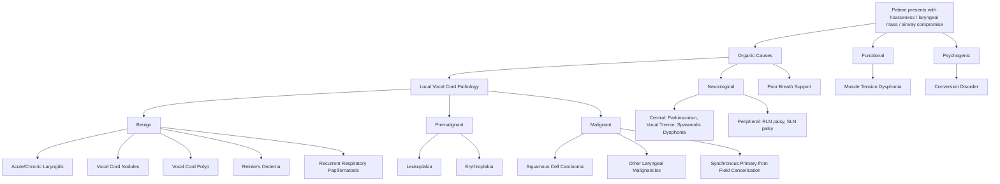
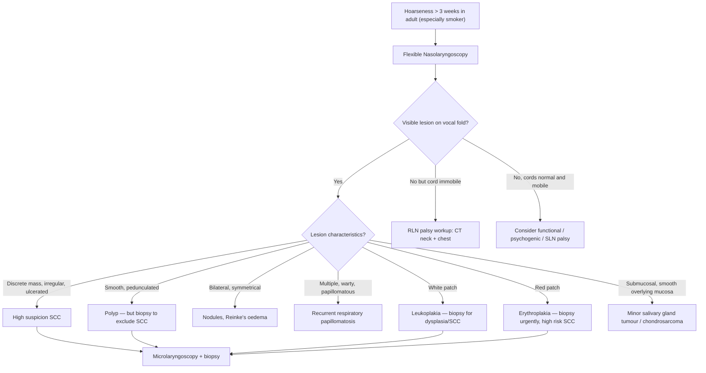

## Differential Diagnosis of Laryngeal Carcinoma

When a patient presents with hoarseness, stridor, dysphagia, or a laryngeal mass, the clinician must think systematically: "Is this really laryngeal carcinoma, or could it be something else?" The differential diagnosis is broad and spans benign vocal cord pathologies, other malignancies, neurological causes, and systemic conditions. Let me walk you through this from first principles.

The key clinical question is: **What can cause a visible lesion on the larynx, hoarseness, or airway compromise?**

We can organise differentials using the aetiological framework from the lecture slides [1]:

---

### 1. Benign Local Vocal Cord Pathologies

These are the conditions that most commonly mimic early glottic carcinoma because they also cause hoarseness and may appear as visible lesions on laryngoscopy.

#### A. ***Acute Laryngitis*** [1]

- **What it is**: Acute inflammation of the laryngeal mucosa, usually viral (URI) or from voice abuse
- **Why it mimics carcinoma**: Causes hoarseness, erythema, and oedema of the vocal folds
- **How to distinguish**: Self-limiting ( < 3 weeks), associated with URTI symptoms, bilateral and diffuse mucosal changes rather than a discrete mass. ***Persistent hoarseness (> 3 weeks) warrants further investigation to exclude malignancy*** [1]

#### B. ***Vocal Cord Nodules*** [1]

- **What they are**: Bilateral, symmetrical, small fibrotic nodules at the junction of the anterior 1/3 and posterior 2/3 of the true vocal folds ("singer's nodules" or "screamer's nodules")
- **Pathophysiological basis**: Chronic voice abuse → repeated collision of the vocal folds at the point of maximal vibration amplitude → localised oedema → fibrosis → nodule
- **Why it mimics carcinoma**: Discrete lesion on the vocal fold causing persistent hoarseness
- **How to distinguish**: Always **bilateral and symmetrical** (carcinoma is almost always unilateral initially); associated with voice abuse/high vocal demand; smooth surface (carcinoma is irregular/ulcerated); responds to voice therapy. ***Occupation and voice demand are key history points*** [1]

#### C. ***Vocal Cord Polyp*** [1]

- **What it is**: Usually a unilateral, pedunculated or sessile, smooth, translucent/haemorrhagic mass on the vocal fold
- **Pathophysiological basis**: Often follows a single episode of voice strain → submucosal haemorrhage in Reinke's space → organisation → polyp
- **Why it mimics carcinoma**: Unilateral lesion on the vocal fold causing hoarseness — this can look very similar to an early exophytic glottic SCC
- **How to distinguish**: Smooth, well-circumscribed, often translucent or vascular appearance; no surrounding leukoplakia. ***However, biopsy is essential to exclude malignancy*** — you cannot distinguish a polyp from an early carcinoma on appearance alone

<Callout title="Clinical Pearl" type="error">
A unilateral vocal cord "polyp" in a smoker is guilty until proven innocent. ***Biopsy!!!*** [5] — always obtain tissue for histology. Many early glottic carcinomas are initially mistaken for benign polyps.
</Callout>

#### D. ***Reinke's Oedema*** [1]

- **What it is**: Diffuse, bilateral oedema of the subepithelial layer (Reinke's space) of the vocal folds
- **Pathophysiological basis**: Chronic irritation (smoking, voice abuse, LPR) → increased vascular permeability → fluid accumulation in the loose connective tissue of Reinke's space → polypoid degeneration of both vocal folds
- **Why it mimics carcinoma**: Causes significant dysphonia (low-pitched, rough voice); the swollen vocal folds can look alarming on laryngoscopy
- **How to distinguish**: **Bilateral** and **diffuse** (not a discrete mass); translucent/gelatinous appearance; strongly associated with smoking. However, given the shared risk factor of smoking, coexistent dysplasia/carcinoma must be actively excluded with biopsy

#### E. ***Recurrent Respiratory Papillomatosis (RRP)*** [1]

- **What it is**: Multiple warty (papillomatous) growths on the laryngeal mucosa caused by **HPV types 6 and 11** (the low-risk types, NOT the oncogenic 16/18 types that cause oropharyngeal SCC)
- **Pathophysiological basis**: HPV infection of the basal epithelial cells → proliferative squamous papillomas; "recurrent" because the virus persists in adjacent normal-appearing mucosa and lesions regrow after removal
- **Why it mimics carcinoma**: Exophytic lesions that can cause hoarseness and airway obstruction; in adults, can occasionally undergo malignant transformation (especially with HPV 11, smoking, or prior radiation)
- **How to distinguish**: Multiple, bilateral, papillomatous (not ulcerated); history of recurrence after excision; bimodal age distribution (juvenile form: < 5 years; adult form: 20–40 years). Biopsy confirms squamous papilloma

---

### 2. Premalignant Lesions

These sit on the continuum between benign and malignant disease. They are critical differentials because they may represent the precursor to or coexist with laryngeal SCC.

#### A. ***Leukoplakia — whitish plaque*** [5]

- **Definition**: A white patch or plaque on the mucosal surface that **cannot be scraped off** and cannot be characterised clinically or pathologically as any other definable lesion [2]
- **Pathophysiological basis**: Represents hyperkeratosis or epithelial hyperplasia, often with underlying dysplasia; caused by chronic irritation (smoking, alcohol, voice abuse)
- **Clinical significance**: ***Premalignant (dysplasia) or already malignant (SCC)*** [5]. Malignant transformation rate varies widely (1–40% depending on grade of dysplasia and location — leukoplakia of the floor of the mouth has a particularly high risk [2])
- **Management**: ***Biopsy!!!*** [5] — ***Microlaryngoscopy + biopsy*** [5] is mandatory to determine the grade of dysplasia or exclude invasive carcinoma

#### B. ***Erythroplakia — reddish plaque*** [5]

- **Definition**: A bright red plaque of the oral/laryngeal mucosa that cannot be characterised clinically or pathologically as any other definable condition
- **Pathophysiological basis**: The red colour comes from thin, atrophic epithelium overlying a highly vascularised, dysplastic submucosa — the blood vessels "show through" the thinned epithelium
- **Clinical significance**: ***Premalignant (dysplasia) or malignant (SCC)*** [5]. Erythroplakia has a **MUCH higher** rate of malignant transformation than leukoplakia (~50% harbour invasive carcinoma or carcinoma in situ at initial biopsy)
- **Management**: ***Biopsy!!!*** [5]

<Callout title="Leukoplakia vs Erythroplakia" type="idea">
Think of it this way: **White = hyperkeratosis** (thickened surface layer); **Red = thin, atrophic epithelium with underlying dysplasia** showing the vasculature beneath. Erythroplakia is far more dangerous than leukoplakia — if you see a red patch, be very worried. Both require biopsy.
</Callout>

---

### 3. Other Malignancies of the Larynx

While ***SCC accounts for ~90–95% of laryngeal malignancies*** [1][6], other histological types must be considered:

| Malignancy | Key Distinguishing Features |
|---|---|
| **Verrucous carcinoma** | Well-differentiated, warty exophytic growth; locally aggressive but rarely metastasises; may be confused with papilloma on biopsy (needs adequate deep biopsy to show pushing invasion) |
| ***Minor salivary gland tumours*** [2] | ***May present as submucosal masses*** [2] — smooth overlying mucosa (submucosal rather than mucosal origin); includes adenoid cystic carcinoma (perineural invasion), mucoepidermoid carcinoma |
| ***Lymphoma*** [2][7] | ***Tonsils and tongue base may be the presenting site for a lymphoma*** [2]; can also rarely involve the larynx; suspect if rapidly growing, rubbery mass; constitutional B symptoms (fever, night sweats, weight loss); bilateral cervical lymphadenopathy |
| **Neuroendocrine tumours** | Rare; small cell carcinoma of the larynx (supraglottis most common) — very aggressive; typical/atypical carcinoid |
| **Chondrosarcoma** | Arises from laryngeal cartilage (usually cricoid); slow-growing, submucosal mass; endoscopy shows smooth, firm expansion |

---

### 4. Neurological Causes of Hoarseness (Mimicking Laryngeal Cancer)

A vocal cord that does not move on laryngoscopy could be due to tumour invasion (T3 laryngeal carcinoma) **or** a neurological lesion affecting the recurrent or superior laryngeal nerve.

#### A. ***Recurrent Laryngeal Nerve (RLN) Palsy*** [1]

- **Causes**: Thyroid surgery (most common iatrogenic cause), thyroid carcinoma, lung apex tumour (Pancoast), aortic arch aneurysm (left RLN loops under the aortic arch), mediastinal lymphadenopathy, oesophageal carcinoma, idiopathic
- **Why it mimics carcinoma**: Unilateral vocal fold immobility → hoarseness; on laryngoscopy, the cord appears immobile in the paramedian position
- **How to distinguish**: No visible mass on the vocal fold; the cord itself looks normal but does not move. CT neck and chest is needed to identify the cause of the nerve palsy. ***A vocal fold that is immobile but appears normal mandates investigation of the entire course of the RLN from skull base to mediastinum***

#### B. ***Superior Laryngeal Nerve (SLN) Palsy*** [1]

- **Causes**: Thyroid surgery, viral neuritis
- **Effect**: External branch paralysis → cricothyroid muscle weakness → loss of vocal fold tension → breathy, weak voice, inability to project or hit high notes
- **How to distinguish**: Vocal fold is mobile but may appear bowed; subtle and often missed on routine laryngoscopy

#### C. ***Central Neurological Causes*** [1]

- ***Parkinsonism***: Hypophonia (soft, monotone voice), not typically a mass lesion
- ***Vocal tremor***: Rhythmic oscillation of vocal folds
- ***Spasmodic dysphonia***: Involuntary spasms of the laryngeal muscles during speech (adductor type → strained, strangled voice; abductor type → breathy breaks)

---

### 5. Functional and Psychogenic Causes

#### A. ***Muscle Tension Dysphonia (MTD)*** [1]

- **What it is**: Excessive tension in the extrinsic and/or intrinsic laryngeal muscles during phonation
- **Pathophysiological basis**: Compensatory hyperfunction in response to an underlying laryngeal pathology (secondary MTD) or primary psychosocial stress
- **How to distinguish**: No structural lesion on laryngoscopy; may see supraglottic hyperadduction ("false fold phonation"); voice improves with manual laryngeal manipulation or voice therapy
- **Why it matters**: Can coexist with organic pathology — don't assume hoarseness is "just functional" without thorough laryngoscopy

#### B. ***Conversion Disorder (Psychogenic Dysphonia)*** [1]

- **What it is**: Loss of voice without organic cause, typically in the setting of psychological stress
- **How to distinguish**: Complete aphonia but with a normal cough (the cough reflex requires vocal fold adduction, proving the folds can move); laryngoscopy shows normal vocal fold structure and mobility (though folds may not adduct during phonation)

---

### 6. Other Important Differentials to Consider in the H&N Region

These are relevant because tumours from adjacent sites can extend to involve the larynx or present with similar symptoms:

#### A. ***Hypopharyngeal Carcinoma*** [8]

- ***Level of hyoid to lower border of cricoid*** [8]
- ***3 sites: 60% piriform fossa, 30% postcricoid, 10% posterior pharyngeal wall*** [8]
- Can invade the larynx secondarily → hoarseness, vocal fold fixation
- ***Paterson-Brown-Kelly syndrome*** [4] — associated with postcricoid carcinoma
- ***30% LN metastases at presentation*** [4]; ***loss of laryngeal crepitus*** [4] on examination
- History: ***Sore throat → globus → dysphagia*** [4]; ***otalgia***, ***hoarseness*** [4]

#### B. ***Oropharyngeal Carcinoma*** [7]

- ***Subsites: Tonsil (commonest), tongue base, soft palate, posterior wall*** [7]
- ***Histology: SCC (epithelial) vs lymphoma / minor salivary gland tumours*** [7]
- HPV-associated subset (younger patients, better prognosis) [2]
- Can refer pain to the ear and cause "hot potato" voice — symptoms overlapping with supraglottic laryngeal cancer

#### C. ***Synchronous Primary Tumour (Field Cancerisation)*** [2][9]

- ***Risk of synchronous cancer: 8–10%*** [9] due to ***field change effect from carcinogen exposure*** [9]
- ***Patients with laryngeal carcinoma are more likely to develop a second primary in the lung*** [2]
- This is why ***panendoscopy (bronchoscopy + oesophagoscopy)*** [9] is mandatory — you must actively look for a second tumour

#### D. Thyroid Carcinoma

- A thyroid mass can invade the larynx/trachea and cause hoarseness via RLN invasion
- Distinguished by thyroid nodule on examination/USG, thyroid function tests, and FNAC

#### E. Oesophageal Carcinoma

- Can extend superiorly to involve the postcricoid region or compress/invade the RLN
- Distinguished by dysphagia as the predominant symptom and by OGD findings

---

### 7. Systematic Approach to Differential Diagnosis

Here is a practical clinical approach when a patient presents with hoarseness ± a laryngeal lesion:

<Callout title="The Golden Rule" type="error">
***Any visible lesion on the vocal fold in a smoker must be biopsied. You cannot distinguish early SCC from a benign polyp or leukoplakia on appearance alone.*** This is why the lecture slides emphatically state: ***Biopsy!!!*** [5]. The standard approach is ***microlaryngoscopy + biopsy*** [5] under general anaesthesia.
</Callout>

---

### 8. "Red Flag" Symptoms That Should Raise Suspicion for Malignancy Over Benign Causes

The lecture slides specifically highlight these ***associated "red flag" symptoms for malignancy*** [1]:

| Red Flag | Why It Suggests Malignancy |
|---|---|
| ***Bleeding*** [1] | Friable, neovascularised tumour surface ulcerates and bleeds; benign lesions rarely bleed spontaneously |
| ***Shortness of breath*** [1] | Significant airway narrowing from tumour bulk or bilateral cord fixation; benign polyps/nodules rarely cause this |
| ***Dysphagia*** [1] | Suggests tumour extension beyond the glottis (supraglottic, hypopharyngeal, or oesophageal involvement) |
| ***Persistent hoarseness (> 3 weeks)*** [1] | ***Persistent = organic lesion; fluctuating = functional*** [1]. Organic lesions include SCC, polyp, nodule |
| ***Progressive course*** [1] | Benign lesions tend to be stable; progressive worsening suggests growing malignancy |
| ***Referred otalgia*** [4] | CN IX/X-mediated referred pain from pharyngolaryngeal tumour |
| ***Weight loss*** | Cancer cachexia; not expected with benign vocal cord pathology |
| ***Cervical lymphadenopathy*** | Nodal metastasis from SCC; not seen with benign lesions |

---

### 9. Summary Table of Key Differentials

| Differential | Typical Patient | Laryngoscopy Appearance | Key Distinguishing Feature |
|---|---|---|---|
| **Laryngeal SCC** | Elderly male smoker/drinker | Irregular, ulcerated, exophytic mass; leukoplakia; fixed cord | Biopsy confirms SCC |
| **Vocal cord polyp** | Any age; voice strain history | Smooth, unilateral, pedunculated | Biopsy needed to exclude SCC |
| **Vocal cord nodules** | Voice professional; high vocal demand | Bilateral, symmetrical, anterior 1/3–2/3 junction | Bilateral = almost never cancer |
| **Reinke's oedema** | Smoker; middle-aged woman | Bilateral, diffuse, translucent swelling | Bilateral + diffuse; still biopsy |
| **RRP** | Bimodal: child or young adult | Multiple, bilateral, warty | HPV 6/11; recurrence after excision |
| **Leukoplakia** | Smoker | White patch, cannot scrape off | ***Biopsy — may be dysplasia/SCC*** [5] |
| **Erythroplakia** | Smoker | Red patch | ***Biopsy — ~50% harbour SCC*** [5] |
| **RLN palsy** | Post-thyroidectomy, lung cancer | Immobile cord but normal-looking | No mass; CT to find cause |
| **Hypopharyngeal CA** | Elderly male smoker/drinker | Pyriform fossa/postcricoid mass | Loss of laryngeal crepitus [4] |
| **Lymphoma** | Any age; constitutional symptoms | Submucosal mass, tonsil/tongue base | B symptoms; biopsy shows lymphoid |
| **Minor salivary gland tumour** | Any age | Submucosal, smooth mucosa overlying | Submucosal mass [2] |

---

<Callout title="High Yield Summary — Differential Diagnosis">

1. ***Aetiologies of voice disorders are classified as Organic (local pathology / neurological / poor breath support), Functional (muscle tension dysphonia), and Psychogenic (conversion disorder)*** [1].

2. **Benign mimics** of glottic SCC: vocal cord polyp, nodules, Reinke's oedema, recurrent respiratory papillomatosis, laryngitis. Key distinguishing features: bilateral (nodules, Reinke's), smooth and pedunculated (polyp), self-limiting (laryngitis), multiple and warty (papillomatosis).

3. ***Leukoplakia and erythroplakia are premalignant — Biopsy!!!*** [5]. Erythroplakia carries a much higher malignant transformation rate.

4. ***Persistent hoarseness = organic lesion; fluctuating = functional*** [1]. Any hoarseness > 3 weeks in a smoker requires urgent laryngoscopy.

5. ***Red flag symptoms for malignancy: bleeding, shortness of breath, dysphagia*** [1], otalgia, progressive course, weight loss, cervical lymphadenopathy.

6. **Immobile vocal fold with no visible mass** → think RLN palsy → investigate the entire nerve course (neck + chest CT).

7. ***Adjacent H&N malignancies***: Hypopharyngeal carcinoma (piriform fossa > postcricoid > posterior wall) [8], oropharyngeal carcinoma (tonsil commonest) [7], and synchronous primary from field cancerisation (***8–10% risk***) [9].

8. ***Panendoscopy is mandatory*** [9] to detect synchronous lesions in the upper aerodigestive tract.

</Callout>

---

<ActiveRecallQuiz
  title="Active Recall - Differential Diagnosis of Laryngeal Carcinoma"
  items={[
    {
      question: "List the three broad categories of voice disorder aetiologies from the lecture classification, with one example of each.",
      markscheme: "1. Organic (e.g., vocal cord polyp, SCC, RLN palsy). 2. Functional (e.g., muscle tension dysphonia). 3. Psychogenic (e.g., conversion disorder)."
    },
    {
      question: "A 55-year-old male smoker presents with hoarseness for 6 weeks. Laryngoscopy shows a white patch on the left vocal fold. What is this lesion called, what is its significance, and what is the next step?",
      markscheme: "Leukoplakia. It is premalignant — may harbour dysplasia or SCC. Next step: microlaryngoscopy and biopsy. Cannot determine malignancy on appearance alone."
    },
    {
      question: "How do you distinguish vocal cord nodules from early glottic SCC on laryngoscopy?",
      markscheme: "Nodules are bilateral and symmetrical, located at the junction of the anterior 1/3 and posterior 2/3 of the vocal folds, with a smooth surface. SCC is typically unilateral, irregular or ulcerated, and may have surrounding leukoplakia. Biopsy confirms the diagnosis."
    },
    {
      question: "A patient has an immobile left vocal fold with no visible mass on laryngoscopy. What is the most likely cause and what investigation is needed?",
      markscheme: "Recurrent laryngeal nerve palsy. Investigate the entire course of the RLN from skull base to mediastinum with CT neck and chest — causes include thyroid pathology, lung apex tumour, aortic arch pathology, oesophageal carcinoma, or idiopathic."
    },
    {
      question: "What is the risk of synchronous cancer in a patient with a new H&N SCC, and what investigation is required to detect it?",
      markscheme: "8-10% risk of synchronous cancer due to field cancerisation. Panendoscopy (direct laryngoscopy + bronchoscopy + oesophagoscopy/OGD) is mandatory at initial evaluation."
    },
    {
      question: "Name two 'red flag' symptoms in a hoarse patient that should raise immediate suspicion of malignancy.",
      markscheme: "Any two of: bleeding (haemoptysis), shortness of breath/stridor, dysphagia, progressive worsening, referred otalgia, weight loss, cervical lymphadenopathy."
    }
  ]}
/>

## References

[1] Lecture slides: GC 216. Dysphonia Laryngitis, voice abuse, tumour and laryngeal cancer.pdf (p4, p7)
[2] Senior notes: felixlai.md (sections on Laryngeal carcinoma, Head and neck cancer overview, CA Oropharynx differential diagnosis, field cancerisation)
[4] Lecture slides: GC 219. Infections and tumours in pharynx and oral cavity.pdf (p39 — History and Examination)
[5] Lecture slides: GC 216. Dysphonia Laryngitis, voice abuse, tumour and laryngeal cancer.pdf (p18 — Leukoplakia, erythroplakia)
[6] Lecture slides: GC 219. Infections and tumours in pharynx and oral cavity.pdf (p40 — Histology)
[7] Lecture slides: GC 219. Infections and tumours in pharynx and oral cavity.pdf (p36 — Oropharyngeal Malignancy)
[8] Lecture slides: GC 219. Infections and tumours in pharynx and oral cavity.pdf (p38 — Hypopharyngeal carcinoma)
[9] Lecture slides: GC 216. Dysphonia Laryngitis, voice abuse, tumour and laryngeal cancer.pdf (p20 — Principle of investigation in HN cancers)
